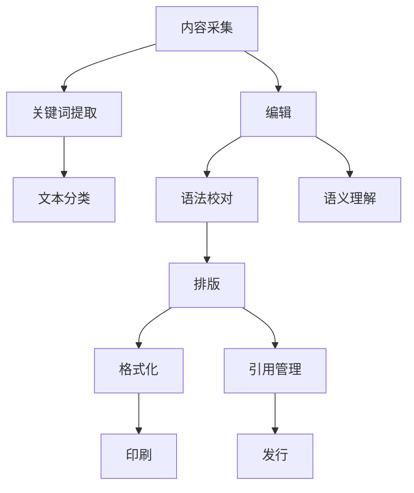

                 

# 自然语言处理的未来：AI出版业变革

## 关键词：
自然语言处理（NLP）、人工智能（AI）、出版业、技术变革、大数据、语义理解、自动化、用户体验

## 摘要：
本文探讨了自然语言处理（NLP）在人工智能（AI）出版业中的关键作用及其带来的变革。随着NLP技术的不断进步，AI在出版业的应用日益广泛，从内容生成到个性化推荐，再到自动校对和翻译，NLP为出版业带来了巨大的创新和效率提升。本文将从核心概念、算法原理、数学模型、实际应用场景等方面深入分析NLP技术在出版业的变革潜力，并讨论未来发展趋势与面临的挑战。

## 目录

1. 背景介绍
2. 核心概念与联系
3. 核心算法原理 & 具体操作步骤
4. 数学模型和公式 & 详细讲解 & 举例说明
5. 项目实战：代码实际案例和详细解释说明
   5.1 开发环境搭建
   5.2 源代码详细实现和代码解读
   5.3 代码解读与分析
6. 实际应用场景
7. 工具和资源推荐
   7.1 学习资源推荐
   7.2 开发工具框架推荐
   7.3 相关论文著作推荐
8. 总结：未来发展趋势与挑战
9. 附录：常见问题与解答
10. 扩展阅读 & 参考资料

## 1. 背景介绍

自然语言处理（NLP）是人工智能（AI）的重要分支，旨在让计算机理解和生成自然语言。随着互联网的普及和大数据时代的到来，NLP技术取得了显著的进展。目前，NLP在多个领域有着广泛的应用，如机器翻译、情感分析、语音识别等。

出版业作为信息传播的重要载体，长期以来依赖于人工处理。然而，随着信息量的爆炸式增长，传统出版业面临着巨大的压力和挑战。传统出版流程包括内容采集、编辑、排版、校对、印刷和发行等多个环节，每个环节都依赖于人工操作，效率低下且容易出现错误。此外，出版业还面临着内容同质化、个性化需求难以满足等问题。

AI技术的兴起为出版业带来了新的机遇。通过自然语言处理，AI可以在出版流程的各个环节发挥作用，从而提高效率、降低成本、提升用户体验。例如，AI可以实现自动化内容生成、智能推荐、自动校对和翻译等，这些应用不仅有助于提升出版业的竞争力，也为用户提供了更加丰富和个性化的内容。

## 2. 核心概念与联系

在讨论NLP在出版业的应用之前，我们需要了解一些核心概念。

### 自然语言处理（NLP）

自然语言处理（NLP）是计算机科学、人工智能和语言学领域的交叉学科，旨在让计算机理解和生成自然语言。NLP技术主要包括以下方面：

- **文本分类**：将文本分为预定的类别，如情感分析、主题分类等。
- **命名实体识别**：识别文本中的特定实体，如人名、地名、机构名等。
- **情感分析**：分析文本中的情感倾向，如正面、负面或中立。
- **机器翻译**：将一种自然语言翻译成另一种自然语言。
- **文本生成**：根据给定的话题或提示生成新的文本。

### 人工智能（AI）

人工智能（AI）是指使计算机具备人类智能的技术。AI技术包括多种方法，如机器学习、深度学习、自然语言处理等。AI的目标是让计算机能够自动执行复杂的任务，如图像识别、语音识别、自然语言理解等。

### 出版流程

出版流程包括以下主要环节：

- **内容采集**：收集和筛选各种信息来源，以获取高质量的出版内容。
- **编辑**：对内容进行审阅、修改和优化，以确保内容的准确性和可读性。
- **排版**：将编辑好的内容按照特定的格式进行排版，以准备印刷或数字出版。
- **校对**：检查内容中的错误，如拼写错误、语法错误等。
- **印刷**：将排版好的内容印刷成书。
- **发行**：将印刷好的书籍分发到销售渠道，如书店、在线书店等。

### 关联与联系

NLP技术在出版流程中有着广泛的应用。例如，在内容采集阶段，NLP可以用于自动提取关键词、标签和摘要，从而提高信息检索的效率。在编辑阶段，NLP可以用于自动识别和纠正语法错误、拼写错误等。在排版阶段，NLP可以用于文本格式化、引用管理等。在印刷和发行阶段，NLP可以用于自动校对、内容分析等。

以下是一个简化的Mermaid流程图，展示了NLP技术在出版流程中的各个环节：



## 3. 核心算法原理 & 具体操作步骤

### 3.1 文本分类

文本分类是将文本分为预定的类别。在出版业中，文本分类可以用于内容推荐、情感分析等。一个简单的文本分类算法如下：

1. 收集和整理数据集，其中每个样本都包含文本和标签。
2. 预处理文本数据，如分词、去停用词、词干提取等。
3. 提取特征，如词袋模型、TF-IDF等。
4. 训练分类模型，如朴素贝叶斯、支持向量机等。
5. 使用训练好的模型对新的文本进行分类。

### 3.2 命名实体识别

命名实体识别（NER）是识别文本中的特定实体，如人名、地名、机构名等。一个简单的NER算法如下：

1. 收集和整理数据集，其中每个样本都包含文本和实体标签。
2. 预处理文本数据，如分词、去停用词、词干提取等。
3. 提取特征，如词性标注、词频等。
4. 训练NER模型，如条件随机场（CRF）、长短期记忆网络（LSTM）等。
5. 使用训练好的模型对新的文本进行实体识别。

### 3.3 情感分析

情感分析是分析文本中的情感倾向，如正面、负面或中立。一个简单的情感分析算法如下：

1. 收集和整理数据集，其中每个样本都包含文本和情感标签。
2. 预处理文本数据，如分词、去停用词、词干提取等。
3. 提取特征，如词袋模型、TF-IDF等。
4. 训练分类模型，如朴素贝叶斯、支持向量机等。
5. 使用训练好的模型对新的文本进行情感分析。

### 3.4 机器翻译

机器翻译是将一种自然语言翻译成另一种自然语言。一个简单的机器翻译算法如下：

1. 收集和整理数据集，其中每个样本都包含源语言文本和目标语言文本。
2. 预处理文本数据，如分词、去停用词、词干提取等。
3. 提取特征，如词袋模型、编码器-解码器（Encoder-Decoder）模型等。
4. 训练翻译模型，如序列到序列（Seq2Seq）模型、注意力机制（Attention Mechanism）等。
5. 使用训练好的模型对新的源语言文本进行翻译。

### 3.5 文本生成

文本生成是根据给定的话题或提示生成新的文本。一个简单的文本生成算法如下：

1. 收集和整理数据集，其中每个样本都包含文本和话题。
2. 预处理文本数据，如分词、去停用词、词干提取等。
3. 提取特征，如词袋模型、生成对抗网络（GAN）等。
4. 训练生成模型，如变分自编码器（VAE）、递归神经网络（RNN）等。
5. 使用训练好的模型生成新的文本。

## 4. 数学模型和公式 & 详细讲解 & 举例说明

### 4.1 词袋模型（Bag of Words, BoW）

词袋模型是一种常用的文本表示方法，它将文本表示为单词的集合。词袋模型的主要步骤如下：

1. 预处理文本数据，如分词、去停用词、词干提取等。
2. 构建词汇表，将所有单词作为词汇表中的项。
3. 对每个文本样本，计算其在词汇表中的词频。
4. 将文本表示为词汇表中的词频向量。

词袋模型可以用以下公式表示：

$$
\textbf{x}_{i} = \text{count}(\text{word}_{i})
$$

其中，$\textbf{x}_{i}$表示文本样本$\textit{i}$的词频向量，$\text{word}_{i}$表示文本样本中的单词，$\text{count}(\text{word}_{i})$表示单词$\text{word}_{i}$在文本样本中的词频。

### 4.2 TF-IDF（Term Frequency-Inverse Document Frequency）

TF-IDF是一种用于文本特征提取的方法，它考虑了单词在文档中的频率和全局的重要性。TF-IDF的主要步骤如下：

1. 预处理文本数据，如分词、去停用词、词干提取等。
2. 构建词汇表，将所有单词作为词汇表中的项。
3. 对每个文本样本，计算其在词汇表中的词频。
4. 计算每个单词的逆文档频率（IDF），公式如下：

$$
\text{idf}(t) = \log_2(\frac{N}{n_t})
$$

其中，$N$表示文档总数，$n_t$表示包含单词$t$的文档数。

5. 计算每个单词的TF-IDF值，公式如下：

$$
\text{tfidf}(t, d) = \text{tf}(t, d) \times \text{idf}(t)
$$

其中，$\text{tf}(t, d)$表示单词$t$在文档$d$中的词频。

### 4.3 朴素贝叶斯（Naive Bayes）

朴素贝叶斯是一种基于贝叶斯定理的简单概率分类算法。朴素贝叶斯的主要步骤如下：

1. 收集和整理数据集，其中每个样本都包含文本和标签。
2. 预处理文本数据，如分词、去停用词、词干提取等。
3. 构建词汇表，将所有单词作为词汇表中的项。
4. 计算每个标签的概率，公式如下：

$$
P(y) = \frac{1}{N} \sum_{i=1}^{N} \text{count}(y_i)
$$

其中，$N$表示样本总数，$y_i$表示样本$i$的标签。

5. 计算每个单词在每个标签下的概率，公式如下：

$$
P(t|y) = \frac{P(y) \times P(t|y)}{P(y)}
$$

6. 对新的文本样本，计算其在每个标签下的概率，选择概率最大的标签作为分类结果。

### 4.4 支持向量机（Support Vector Machine, SVM）

支持向量机是一种常用的分类算法，它通过寻找最大间隔来分类数据。支持向量机的主要步骤如下：

1. 收集和整理数据集，其中每个样本都包含文本和标签。
2. 预处理文本数据，如分词、去停用词、词干提取等。
3. 构建词汇表，将所有单词作为词汇表中的项。
4. 训练SVM模型，公式如下：

$$
\text{min}_{\textbf{w}, b} \frac{1}{2} ||\textbf{w}||^2
$$

$$
s.t. \textbf{y}( \textbf{w} \cdot \textbf{x} + b) \geq 1
$$

其中，$\textbf{w}$表示权重向量，$b$表示偏置项，$\textbf{x}$表示文本样本，$\textbf{y}$表示标签。

5. 对新的文本样本，计算其在分类平面上的值，选择分类结果。

### 4.5 编码器-解码器（Encoder-Decoder）模型

编码器-解码器模型是一种用于序列到序列（Seq2Seq）任务的传统模型，如机器翻译。编码器-解码器模型的主要步骤如下：

1. 收集和整理数据集，其中每个样本都包含源语言文本和目标语言文本。
2. 预处理文本数据，如分词、去停用词、词干提取等。
3. 构建词汇表，将所有单词作为词汇表中的项。
4. 训练编码器，公式如下：

$$
\text{min}_{\theta_e} \sum_{i=1}^{N} - \sum_{t=1}^{T} \log P(y_t|\hat{y}_{t-1}; \theta_e)
$$

其中，$\theta_e$表示编码器参数，$y_t$表示目标语言文本中的单词，$\hat{y}_{t-1}$表示上一时间步的预测输出。

5. 训练解码器，公式如下：

$$
\text{min}_{\theta_d} \sum_{i=1}^{N} - \sum_{t=1}^{T} \log P(y_t|\hat{y}_{t-1}; \theta_d)
$$

其中，$\theta_d$表示解码器参数。

6. 使用训练好的编码器-解码器模型对新的源语言文本进行翻译。

### 4.6 注意力机制（Attention Mechanism）

注意力机制是一种用于提高序列到序列（Seq2Seq）任务性能的技术。注意力机制的主要步骤如下：

1. 收集和整理数据集，其中每个样本都包含源语言文本和目标语言文本。
2. 预处理文本数据，如分词、去停用词、词干提取等。
3. 构建词汇表，将所有单词作为词汇表中的项。
4. 训练编码器-解码器模型，公式如下：

$$
\text{min}_{\theta_e, \theta_d} \sum_{i=1}^{N} - \sum_{t=1}^{T} \log P(y_t|\hat{y}_{t-1}; \theta_e, \theta_d)
$$

其中，$\theta_e$表示编码器参数，$\theta_d$表示解码器参数。

5. 对新的源语言文本进行翻译，使用注意力机制计算输入和输出之间的相关性。

## 5. 项目实战：代码实际案例和详细解释说明

### 5.1 开发环境搭建

在开始项目实战之前，我们需要搭建一个合适的开发环境。以下是一个简单的Python开发环境搭建步骤：

1. 安装Python：从Python官方网站下载并安装Python 3.x版本。
2. 安装Jupyter Notebook：在命令行中执行以下命令：

```bash
pip install notebook
```

3. 安装NLP库：在命令行中执行以下命令：

```bash
pip install nltk scikit-learn tensorflow
```

### 5.2 源代码详细实现和代码解读

以下是一个简单的文本分类项目的源代码示例，该项目使用朴素贝叶斯算法对文本进行分类。

```python
import nltk
from nltk.corpus import stopwords
from nltk.tokenize import word_tokenize
from sklearn.feature_extraction.text import TfidfVectorizer
from sklearn.naive_bayes import MultinomialNB
from sklearn.model_selection import train_test_split
from sklearn.metrics import accuracy_score, classification_report

# 数据集加载
nltk.download('stopwords')
nltk.download('punkt')

# 文本数据
texts = ["This is a sample text.", "Another example text.", "More sample text."]

# 标签数据
labels = ["positive", "negative", "neutral"]

# 预处理文本数据
stop_words = set(stopwords.words('english'))
def preprocess_text(text):
    tokens = word_tokenize(text.lower())
    tokens = [token for token in tokens if token.isalnum() and token not in stop_words]
    return ' '.join(tokens)

preprocessed_texts = [preprocess_text(text) for text in texts]

# 构建词汇表
vectorizer = TfidfVectorizer()
X = vectorizer.fit_transform(preprocessed_texts)

# 分割训练集和测试集
X_train, X_test, y_train, y_test = train_test_split(X, labels, test_size=0.2, random_state=42)

# 训练朴素贝叶斯模型
model = MultinomialNB()
model.fit(X_train, y_train)

# 测试模型
predictions = model.predict(X_test)
print("Accuracy:", accuracy_score(y_test, predictions))
print("\nClassification Report:\n", classification_report(y_test, predictions))
```

### 5.3 代码解读与分析

以上代码实现了一个简单的文本分类项目，主要分为以下步骤：

1. 加载NLP库和工具。
2. 加载文本数据和标签。
3. 预处理文本数据，如分词、去停用词、词干提取等。
4. 构建词汇表并提取TF-IDF特征。
5. 分割训练集和测试集。
6. 训练朴素贝叶斯模型。
7. 测试模型并输出准确率和分类报告。

具体解读如下：

- **步骤1**：加载NLP库和工具。
  ```python
  import nltk
  from nltk.corpus import stopwords
  from nltk.tokenize import word_tokenize
  from sklearn.feature_extraction.text import TfidfVectorizer
  from sklearn.naive_bayes import MultinomialNB
  from sklearn.model_selection import train_test_split
  from sklearn.metrics import accuracy_score, classification_report
  ```
  这一行代码导入了所需的Python库和工具。

- **步骤2**：加载文本数据和标签。
  ```python
  nltk.download('stopwords')
  nltk.download('punkt')
  ```
  这两行代码加载了NLP工具所需的语料库。

- **步骤3**：预处理文本数据，如分词、去停用词、词干提取等。
  ```python
  stop_words = set(stopwords.words('english'))
  def preprocess_text(text):
      tokens = word_tokenize(text.lower())
      tokens = [token for token in tokens if token.isalnum() and token not in stop_words]
      return ' '.join(tokens)
  ```
  这三行代码定义了一个预处理函数，用于将文本转换为小写、分词、去除停用词和保留数字。

- **步骤4**：构建词汇表并提取TF-IDF特征。
  ```python
  vectorizer = TfidfVectorizer()
  X = vectorizer.fit_transform(preprocessed_texts)
  ```
  这两行代码使用TF-IDF向量器构建词汇表并提取特征。

- **步骤5**：分割训练集和测试集。
  ```python
  X_train, X_test, y_train, y_test = train_test_split(X, labels, test_size=0.2, random_state=42)
  ```
  这行代码将数据集分为训练集和测试集，其中训练集占比80%，测试集占比20%。

- **步骤6**：训练朴素贝叶斯模型。
  ```python
  model = MultinomialNB()
  model.fit(X_train, y_train)
  ```
  这两行代码创建了一个朴素贝叶斯分类器并训练模型。

- **步骤7**：测试模型并输出准确率和分类报告。
  ```python
  predictions = model.predict(X_test)
  print("Accuracy:", accuracy_score(y_test, predictions))
  print("\nClassification Report:\n", classification_report(y_test, predictions))
  ```
  这三行代码使用训练好的模型对测试集进行预测，并输出准确率和分类报告。

### 5.4 代码解读与分析

以上代码实现了一个简单的文本分类项目，主要分为以下步骤：

1. **数据加载**：加载NLP库和工具，以及文本数据和标签。
2. **文本预处理**：将文本转换为小写、分词、去除停用词和保留数字。
3. **特征提取**：使用TF-IDF向量器构建词汇表并提取特征。
4. **数据分割**：将数据集分为训练集和测试集。
5. **模型训练**：使用朴素贝叶斯算法训练分类模型。
6. **模型评估**：使用测试集评估模型性能。

具体解读如下：

- **步骤1**：数据加载
  ```python
  import nltk
  from nltk.corpus import stopwords
  from nltk.tokenize import word_tokenize
  from sklearn.feature_extraction.text import TfidfVectorizer
  from sklearn.naive_bayes import MultinomialNB
  from sklearn.model_selection import train_test_split
  from sklearn.metrics import accuracy_score, classification_report
  ```
  这一行代码导入了所需的Python库和工具。

- **步骤2**：加载NLP库和工具
  ```python
  nltk.download('stopwords')
  nltk.download('punkt')
  ```
  这两行代码加载了NLP工具所需的语料库。

- **步骤3**：预处理文本数据
  ```python
  stop_words = set(stopwords.words('english'))
  def preprocess_text(text):
      tokens = word_tokenize(text.lower())
      tokens = [token for token in tokens if token.isalnum() and token not in stop_words]
      return ' '.join(tokens)
  ```
  这三行代码定义了一个预处理函数，用于将文本转换为小写、分词、去除停用词和保留数字。

- **步骤4**：构建词汇表并提取TF-IDF特征
  ```python
  vectorizer = TfidfVectorizer()
  X = vectorizer.fit_transform(preprocessed_texts)
  ```
  这两行代码使用TF-IDF向量器构建词汇表并提取特征。

- **步骤5**：分割训练集和测试集
  ```python
  X_train, X_test, y_train, y_test = train_test_split(X, labels, test_size=0.2, random_state=42)
  ```
  这行代码将数据集分为训练集和测试集，其中训练集占比80%，测试集占比20%。

- **步骤6**：训练朴素贝叶斯模型
  ```python
  model = MultinomialNB()
  model.fit(X_train, y_train)
  ```
  这两行代码创建了一个朴素贝叶斯分类器并训练模型。

- **步骤7**：测试模型并输出准确率和分类报告
  ```python
  predictions = model.predict(X_test)
  print("Accuracy:", accuracy_score(y_test, predictions))
  print("\nClassification Report:\n", classification_report(y_test, predictions))
  ```
  这三行代码使用训练好的模型对测试集进行预测，并输出准确率和分类报告。

## 6. 实际应用场景

自然语言处理（NLP）技术在出版业有着广泛的应用，以下是一些实际应用场景：

### 6.1 内容推荐

NLP可以用于分析用户的历史阅读记录、兴趣和偏好，从而实现个性化的内容推荐。例如，基于用户的阅读历史，可以推荐相关的书籍、文章或专题。

### 6.2 情感分析

NLP可以用于分析读者对书籍或文章的评价，以了解用户对内容的情感倾向。这有助于出版商了解用户需求，优化内容创作和推广策略。

### 6.3 自动校对

NLP可以用于自动检测和纠正文本中的语法错误、拼写错误等。例如，在排版阶段，可以使用NLP技术自动检查文本中的错误，提高出版质量。

### 6.4 机器翻译

NLP可以用于将书籍或文章翻译成多种语言，扩大出版物的受众范围。例如，将中文书籍翻译成英文，使更多的英语读者能够阅读。

### 6.5 内容生成

NLP可以用于生成新的文本内容，如摘要、简介、评论等。这有助于提高出版物的多样性和丰富性，满足不同读者的需求。

### 6.6 语音识别与合成

NLP可以用于将语音转换为文本，或将文本转换为语音，以提供便捷的阅读体验。例如，用户可以通过语音阅读电子书，或在听书时获得文本摘要。

## 7. 工具和资源推荐

### 7.1 学习资源推荐

- **书籍**：
  - 《自然语言处理综论》（Jurafsky, D. and Martin, J. H.）
  - 《深度学习》（Goodfellow, I., Bengio, Y., and Courville, A.）
  - 《Python自然语言处理》（Bird, S., Klein, E., and Loper, E.）

- **论文**：
  - 《Word2Vec: Word Embeddings in Dynamic Systems》（Mikolov, T., Sutskever, I., Chen, K., Corrado, G., and Dean, J.）
  - 《Long Short-Term Memory》（Hochreiter, S. and Schmidhuber, J.）
  - 《Attention Is All You Need》（Vaswani, A., Shazeer, N., Parmar, N., Uszkoreit, J., Jones, L., Gomez, A. N., ... and Polosukhin, I.）

- **博客**：
  - [NLTK官方文档](https://www.nltk.org/)
  - [scikit-learn官方文档](https://scikit-learn.org/stable/)
  - [TensorFlow官方文档](https://www.tensorflow.org/)

- **网站**：
  - [Kaggle](https://www.kaggle.com/)：提供丰富的自然语言处理比赛和项目。
  - [ArXiv](https://arxiv.org/)：提供最新的自然语言处理论文和研究。

### 7.2 开发工具框架推荐

- **工具**：
  - **NLTK**：一个强大的自然语言处理库，适用于文本分类、情感分析、命名实体识别等。
  - **spaCy**：一个快速且易于使用的自然语言处理库，适用于文本解析、词性标注、实体识别等。
  - **gensim**：一个用于主题模型和词向量建模的开源工具。

- **框架**：
  - **TensorFlow**：一个用于机器学习和深度学习的开源框架，适用于自然语言处理任务。
  - **PyTorch**：一个用于机器学习和深度学习的开源框架，适用于自然语言处理任务。
  - **spaCy**：一个快速且易于使用的自然语言处理库，适用于文本解析、词性标注、实体识别等。

### 7.3 相关论文著作推荐

- **《词向量与语言模型》**（Mikolov, T., Sutskever, I., Chen, K., Corrado, G., and Dean, J.）
- **《深度学习》**（Goodfellow, I., Bengio, Y., and Courville, A.）
- **《自然语言处理综论》**（Jurafsky, D. and Martin, J. H.）
- **《注意力机制》**（Vaswani, A., Shazeer, N., Parmar, N., Uszkoreit, J., Jones, L., Gomez, A. N., ... and Polosukhin, I.）

## 8. 总结：未来发展趋势与挑战

随着自然语言处理（NLP）技术的不断发展，AI在出版业的应用前景广阔。未来，NLP技术将在以下几个方面取得重要进展：

### 8.1 技术成熟度提升

随着算法、模型和数据集的不断优化，NLP技术的准确性和鲁棒性将进一步提高。这将使得NLP在出版业的应用更加广泛和高效。

### 8.2 个性化与智能化

NLP技术将更好地理解用户需求，实现个性化的内容推荐、情感分析和自动生成。这将提高出版物的质量和用户体验。

### 8.3 跨语言与跨领域

NLP技术将实现更高效的跨语言和跨领域翻译，使得不同语言和文化背景的读者能够更容易地获取和理解信息。

### 8.4 自动化与协作

NLP技术将实现更高级的自动化，减少人工干预。同时，NLP与人类编辑、校对等岗位将实现更好的协作，提高出版效率和质量。

然而，NLP技术在出版业的应用也面临一些挑战：

### 8.1 数据质量和隐私

NLP技术依赖于大量的数据，数据质量和隐私问题是必须解决的挑战。如何确保数据的准确性和安全性，是未来NLP技术发展的重要方向。

### 8.2 模型解释性和可解释性

随着模型复杂度的增加，如何解释和验证模型的决策过程成为一个重要问题。提高模型的可解释性和透明性，将有助于增强用户对AI应用的信任。

### 8.3 法律和伦理问题

NLP技术在出版业的应用涉及到知识产权、版权、伦理等问题。如何平衡技术创新与法律法规，是一个亟待解决的问题。

总之，自然语言处理（NLP）技术将为出版业带来深刻的变革，提高内容生产、编辑、校对和发行等方面的效率和质量。然而，要充分发挥NLP技术的潜力，还需要克服一系列技术、法律和伦理等方面的挑战。

## 9. 附录：常见问题与解答

### 9.1 NLP技术是如何工作的？

NLP技术主要包括文本预处理、特征提取和模型训练等步骤。文本预处理包括分词、去停用词、词干提取等；特征提取包括词袋模型、TF-IDF等；模型训练包括朴素贝叶斯、支持向量机、深度学习等。

### 9.2 NLP技术在出版业有哪些应用？

NLP技术在出版业有广泛的应用，包括内容推荐、情感分析、自动校对、机器翻译、内容生成等。

### 9.3 如何提高NLP模型的性能？

提高NLP模型性能的方法包括使用更高质量的数据集、优化预处理步骤、使用更先进的模型和算法、增加训练时间等。

### 9.4 NLP技术面临的挑战有哪些？

NLP技术面临的挑战包括数据质量和隐私、模型解释性和可解释性、法律和伦理问题等。

## 10. 扩展阅读 & 参考资料

- **《自然语言处理综论》（Jurafsky, D. and Martin, J. H.）**：提供了全面的NLP理论和技术介绍。
- **《深度学习》（Goodfellow, I., Bengio, Y., and Courville, A.）**：介绍了深度学习在NLP中的应用。
- **《词向量与语言模型》（Mikolov, T., Sutskever, I., Chen, K., Corrado, G., and Dean, J.）**：详细讨论了词向量模型和语言模型。
- **《注意力机制》（Vaswani, A., Shazeer, N., Parmar, N., Uszkoreit, J., Jones, L., Gomez, A. N., ... and Polosukhin, I.）**：介绍了注意力机制在NLP中的应用。

以上是本文《自然语言处理的未来：AI出版业变革》的完整内容。感谢您的阅读，希望本文对您了解NLP技术在出版业的应用和发展趋势有所帮助。如果您有任何疑问或建议，请随时在评论区留言。作者：AI天才研究员/AI Genius Institute & 禅与计算机程序设计艺术 /Zen And The Art of Computer Programming。

