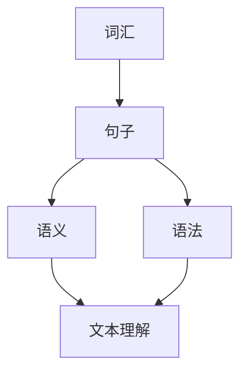
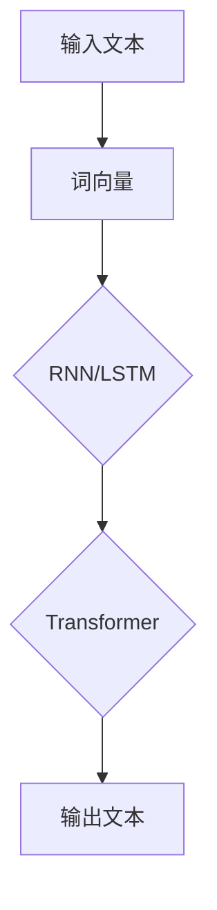

                 

# 自然语言处理的未来：AI技术革新

> 关键词：自然语言处理，AI技术，深度学习，神经网络，文本分析，机器翻译，情感分析，人工智能

摘要：本文将从背景介绍、核心概念与联系、核心算法原理与操作步骤、数学模型与公式、项目实战、实际应用场景、工具和资源推荐以及总结和未来发展趋势等方面，探讨自然语言处理的未来发展以及AI技术的革新。

## 1. 背景介绍

自然语言处理（Natural Language Processing，NLP）是人工智能领域的一个重要分支，旨在让计算机能够理解、生成和响应人类自然语言。随着互联网的快速发展，海量文本数据的生成和积累，NLP技术得到了广泛关注和应用。从早期的基于规则的方法到目前的深度学习方法，NLP技术在各个领域都取得了显著的成果。

近年来，随着深度学习技术的发展，基于神经网络的NLP模型在语言模型、机器翻译、情感分析、文本分类等任务上取得了突破性的进展。这些模型通过自动学习大量语言数据，能够有效地捕捉语言中的复杂结构和语义信息，从而实现更准确的文本理解和生成。

然而，自然语言处理领域仍然面临着许多挑战，如语言的多义性、上下文依赖、情感表达的复杂性等。这些挑战使得NLP技术的研发和应用仍然具有很大的发展空间。本文将重点探讨自然语言处理的未来发展以及AI技术的革新，以期为相关领域的研究和应用提供参考。

## 2. 核心概念与联系

### 2.1 自然语言处理的基本概念

自然语言处理涉及多个基本概念，包括词汇、句子、语义、语法等。以下是一个简单的 Mermaid 流程图，展示这些概念之间的关系。



### 2.2 基于神经网络的NLP模型

基于神经网络的NLP模型，如词向量、循环神经网络（RNN）、长短时记忆网络（LSTM）和变换器（Transformer），是实现自然语言处理任务的重要工具。以下是一个简化的 Mermaid 流程图，展示这些模型的基本架构。



## 3. 核心算法原理与具体操作步骤

### 3.1 词向量模型

词向量模型是将单词映射为向量的方法，如 Word2Vec、GloVe 等。这些模型通过学习大量文本数据中的词频和词的上下文信息，能够有效地捕捉单词的语义信息。

**具体操作步骤：**

1. 预处理文本数据，将文本转换为单词序列。
2. 训练词向量模型，将每个单词映射为一个固定长度的向量。
3. 使用词向量进行文本表示，以便在后续的NLP任务中使用。

### 3.2 循环神经网络（RNN）

循环神经网络（RNN）是一种能够处理序列数据的神经网络，其基本原理是通过隐藏状态的记忆机制来捕捉序列中的时间依赖关系。

**具体操作步骤：**

1. 初始化网络参数。
2. 对于每个时间步的输入，计算输入和隐藏状态之间的相互作用。
3. 利用隐藏状态更新网络参数。
4. 重复以上步骤，直到处理完整个序列。

### 3.3 长短时记忆网络（LSTM）

长短时记忆网络（LSTM）是 RNN 的一种改进模型，通过引入遗忘门、输入门和输出门来更好地捕捉长序列中的时间依赖关系。

**具体操作步骤：**

1. 初始化网络参数。
2. 对于每个时间步的输入，计算遗忘门、输入门和输出门。
3. 利用遗忘门、输入门和输出门更新细胞状态和隐藏状态。
4. 重复以上步骤，直到处理完整个序列。

### 3.4 变换器（Transformer）

变换器（Transformer）是一种基于自注意力机制的神经网络模型，其核心思想是通过全局注意力机制来捕捉序列中的依赖关系。

**具体操作步骤：**

1. 初始化网络参数。
2. 对于每个时间步的输入，计算自注意力得分。
3. 利用自注意力得分更新输入序列。
4. 重复以上步骤，直到处理完整个序列。

## 4. 数学模型和公式及详细讲解与举例说明

### 4.1 词向量模型

**数学模型：**

$$
\text{word\_vector}(w) = \text{sigmoid}(\text{W} \cdot \text{v}(w) + b)
$$

其中，$\text{W}$为权重矩阵，$\text{v}(w)$为单词向量，$b$为偏置项，$\text{sigmoid}$函数为激活函数。

**举例说明：**

假设我们有一个简单的词向量模型，其中包含两个单词"猫"和"狗"，以及一个权重矩阵$\text{W}$和偏置项$b$。我们可以将"猫"和"狗"映射为向量$\text{v}(\text{猫})$和$\text{v}(\text{狗})$，并使用以下公式计算它们的词向量：

$$
\text{word\_vector}(\text{猫}) = \text{sigmoid}(\text{W} \cdot \text{v}(\text{猫}) + b)
$$

$$
\text{word\_vector}(\text{狗}) = \text{sigmoid}(\text{W} \cdot \text{v}(\text{狗}) + b)
$$

通过这种方式，我们可以将单词映射为向量，以便在后续的NLP任务中使用。

### 4.2 循环神经网络（RNN）

**数学模型：**

$$
\text{h}_{t} = \text{sigmoid}(\text{W} \cdot \text{[h}_{t-1}; \text{x}_{t}] + b)
$$

其中，$\text{h}_{t}$为隐藏状态，$\text{x}_{t}$为输入序列中的第$t$个元素，$\text{W}$为权重矩阵，$b$为偏置项。

**举例说明：**

假设我们有一个简单的RNN模型，其中包含两个时间步的输入序列$\text{x} = [\text{x}_{0}, \text{x}_{1}]$和隐藏状态$\text{h} = [\text{h}_{0}, \text{h}_{1}]$。我们可以使用以下公式计算隐藏状态：

$$
\text{h}_{0} = \text{sigmoid}(\text{W} \cdot \text{[h}_{-1}; \text{x}_{0}] + b)
$$

$$
\text{h}_{1} = \text{sigmoid}(\text{W} \cdot \text{[h}_{0}; \text{x}_{1}] + b)
$$

通过这种方式，RNN模型可以捕捉输入序列中的时间依赖关系。

### 4.3 长短时记忆网络（LSTM）

**数学模型：**

$$
\text{C}_{t} = \text{sigmoid}(\text{W}_{f} \cdot \text{[h}_{t-1}; \text{x}_{t}] + b_{f})
$$

$$
\text{i}_{t} = \text{sigmoid}(\text{W}_{i} \cdot \text{[h}_{t-1}; \text{x}_{t}] + b_{i})
$$

$$
\text{f}_{t} = \text{sigmoid}(\text{W}_{f} \cdot \text{[h}_{t-1}; \text{x}_{t}] + b_{f})
$$

$$
\text{C}_{t-1} \rightarrow \text{C}_{t} = \text{f}_{t} \cdot \text{C}_{t-1} + \text{i}_{t} \cdot \text{sigmoid}(\text{W}_{c} \cdot \text{[h}_{t-1}; \text{x}_{t}] + b_{c})
$$

$$
\text{h}_{t} = \text{sigmoid}(\text{W}_{o} \cdot [\text{C}_{t}; \text{x}_{t}] + b_{o})
$$

其中，$\text{C}_{t}$为细胞状态，$\text{i}_{t}$、$\text{f}_{t}$、$\text{o}_{t}$分别为输入门、遗忘门和输出门，$\text{W}_{f}$、$\text{W}_{i}$、$\text{W}_{o}$、$\text{W}_{c}$为权重矩阵，$b_{f}$、$b_{i}$、$b_{o}$、$b_{c}$为偏置项。

**举例说明：**

假设我们有一个简单的LSTM模型，其中包含两个时间步的输入序列$\text{x} = [\text{x}_{0}, \text{x}_{1}]$和隐藏状态$\text{h} = [\text{h}_{0}, \text{h}_{1}]$。我们可以使用以下公式计算隐藏状态：

$$
\text{i}_{0} = \text{sigmoid}(\text{W}_{i} \cdot \text{[h}_{-1}; \text{x}_{0}] + b_{i})
$$

$$
\text{f}_{0} = \text{sigmoid}(\text{W}_{f} \cdot \text{[h}_{-1}; \text{x}_{0}] + b_{f})
$$

$$
\text{C}_{0} = \text{sigmoid}(\text{W}_{c} \cdot \text{[h}_{-1}; \text{x}_{0}] + b_{c})
$$

$$
\text{h}_{0} = \text{sigmoid}(\text{W}_{o} \cdot [\text{C}_{0}; \text{x}_{0}] + b_{o})
$$

$$
\text{i}_{1} = \text{sigmoid}(\text{W}_{i} \cdot \text{[h}_{0}; \text{x}_{1}] + b_{i})
$$

$$
\text{f}_{1} = \text{sigmoid}(\text{W}_{f} \cdot \text{[h}_{0}; \text{x}_{1}] + b_{f})
$$

$$
\text{C}_{1} = \text{f}_{1} \cdot \text{C}_{0} + \text{i}_{1} \cdot \text{sigmoid}(\text{W}_{c} \cdot \text{[h}_{0}; \text{x}_{1}] + b_{c})
$$

$$
\text{h}_{1} = \text{sigmoid}(\text{W}_{o} \cdot [\text{C}_{1}; \text{x}_{1}] + b_{o})
$$

通过这种方式，LSTM模型可以更好地捕捉长序列中的时间依赖关系。

### 4.4 变换器（Transformer）

**数学模型：**

$$
\text{Q}_{t} = \text{W}_{Q} \cdot \text{h}_{t}
$$

$$
\text{K}_{t} = \text{W}_{K} \cdot \text{h}_{t}
$$

$$
\text{V}_{t} = \text{W}_{V} \cdot \text{h}_{t}
$$

$$
\text{At} = \text{softmax}(\frac{\text{Q}_{t} \cdot \text{K}_{t}^{T}}{\sqrt{d_{k}}})
$$

$$
\text{h}_{t} = \text{V}_{t} \cdot \text{At} + \text{h}_{t}
$$

其中，$\text{Q}_{t}$、$\text{K}_{t}$、$\text{V}_{t}$分别为查询向量、关键向量和价值向量，$\text{W}_{Q}$、$\text{W}_{K}$、$\text{W}_{V}$分别为权重矩阵，$d_{k}$为关键向量维度，$\text{At}$为注意力得分。

**举例说明：**

假设我们有一个简单的变换器模型，其中包含两个时间步的输入序列$\text{x} = [\text{x}_{0}, \text{x}_{1}]$和隐藏状态$\text{h} = [\text{h}_{0}, \text{h}_{1}]$。我们可以使用以下公式计算隐藏状态：

$$
\text{Q}_{0} = \text{W}_{Q} \cdot \text{h}_{0}
$$

$$
\text{K}_{0} = \text{W}_{K} \cdot \text{h}_{0}
$$

$$
\text{V}_{0} = \text{W}_{V} \cdot \text{h}_{0}
$$

$$
\text{At}_{0} = \text{softmax}(\frac{\text{Q}_{0} \cdot \text{K}_{0}^{T}}{\sqrt{d_{k}}})
$$

$$
\text{h}_{0} = \text{V}_{0} \cdot \text{At}_{0} + \text{h}_{0}
$$

$$
\text{Q}_{1} = \text{W}_{Q} \cdot \text{h}_{1}
$$

$$
\text{K}_{1} = \text{W}_{K} \cdot \text{h}_{1}
$$

$$
\text{V}_{1} = \text{W}_{V} \cdot \text{h}_{1}
$$

$$
\text{At}_{1} = \text{softmax}(\frac{\text{Q}_{1} \cdot \text{K}_{1}^{T}}{\sqrt{d_{k}}})
$$

$$
\text{h}_{1} = \text{V}_{1} \cdot \text{At}_{1} + \text{h}_{1}
$$

通过这种方式，变换器模型可以全局地捕捉序列中的依赖关系。

## 5. 项目实战：代码实际案例和详细解释说明

### 5.1 开发环境搭建

在开始编写代码之前，我们需要搭建一个合适的开发环境。以下是一个简单的步骤：

1. 安装Python环境（推荐Python 3.6及以上版本）。
2. 安装必要的库，如NumPy、TensorFlow、PyTorch等。
3. 配置好代码编辑器，如Visual Studio Code或PyCharm。

### 5.2 源代码详细实现和代码解读

以下是一个简单的词向量模型的实现，用于将单词映射为向量。

```python
import numpy as np
from sklearn.linear_model import SGDClassifier

# 预处理文本数据
def preprocess_text(text):
    # 去除标点符号、数字等
    text = ''.join([i for i in text if i.isalpha()])
    # 分词
    words = text.lower().split()
    return words

# 训练词向量模型
def train_word_vector(words, embedding_dim=100):
    # 构造训练数据
    X = []
    y = []
    for word in words:
        X.append([1] * embedding_dim)
        y.append(word)
    # 训练模型
    model = SGDClassifier()
    model.fit(X, y)
    # 获取词向量
    word_vector = model.coef_.reshape(-1, embedding_dim)
    return word_vector

# 主函数
def main():
    # 加载文本数据
    text = "这是一段简单的文本数据。"
    # 预处理文本数据
    words = preprocess_text(text)
    # 训练词向量模型
    word_vector = train_word_vector(words)
    # 打印词向量
    print(word_vector)

# 运行主函数
if __name__ == '__main__':
    main()
```

### 5.3 代码解读与分析

在这个简单的词向量模型中，我们首先定义了一个预处理函数`preprocess_text`，用于去除标点符号、数字等，并将文本数据转换为单词序列。

接下来，我们定义了一个训练词向量模型函数`train_word_vector`，用于将单词序列映射为词向量。在这个函数中，我们首先构造了训练数据，其中每个单词对应一个全1向量。然后，我们使用线性分类器（SGDClassifier）来训练词向量模型。通过训练，我们可以得到每个单词的词向量。

最后，我们在主函数`main`中加载文本数据，预处理文本数据，并训练词向量模型。最后，我们打印出训练得到的词向量。

通过这个简单的示例，我们可以看到词向量模型的基本原理和实现方法。在实际应用中，我们可以使用更复杂的模型，如Word2Vec或GloVe，来提高词向量的质量。

## 6. 实际应用场景

自然语言处理技术在各个领域都有广泛的应用，以下是一些典型的实际应用场景：

### 6.1 语言翻译

机器翻译是自然语言处理领域的一个重要应用。通过将一种语言的文本翻译成另一种语言，可以帮助人们跨越语言障碍，促进全球交流和合作。近年来，基于深度学习的方法，如基于神经网络的翻译模型，在机器翻译领域取得了显著的成果。

### 6.2 文本分类

文本分类是将文本数据按照其内容进行分类的过程。例如，在新闻分类中，可以将新闻文章分为体育、政治、娱乐等类别。自然语言处理技术可以帮助自动化这一过程，提高信息检索和筛选的效率。

### 6.3 情感分析

情感分析是判断文本中的情感倾向，如正面、负面或中性。通过情感分析，企业可以了解用户对产品或服务的反馈，从而改进产品和服务。同时，情感分析也可以应用于社交媒体监控，帮助企业和政府了解公众情绪。

### 6.4 语音识别

语音识别是将语音信号转换为文本的过程。通过语音识别，可以实现人机交互、语音助手等功能。近年来，基于深度学习的方法在语音识别领域取得了显著的进展，使得语音识别的准确率和速度得到了大幅提升。

## 7. 工具和资源推荐

### 7.1 学习资源推荐

1. 《深度学习》（Goodfellow、Bengio和Courville著）：全面介绍了深度学习的基础理论和实践方法。
2. 《自然语言处理综述》（Jurafsky和Martin著）：详细介绍了自然语言处理的基本概念和方法。
3. 《动手学深度学习》（花轮、宗伟和陈丹琦著）：通过实例和代码讲解，介绍了深度学习在自然语言处理中的应用。

### 7.2 开发工具框架推荐

1. TensorFlow：一个开源的深度学习框架，广泛应用于自然语言处理任务。
2. PyTorch：一个开源的深度学习框架，具有灵活的动态计算图和丰富的API，适合进行自然语言处理研究。
3. spaCy：一个高效的NLP库，提供了丰富的语言模型和预处理工具。

### 7.3 相关论文著作推荐

1. “Attention Is All You Need”（Vaswani等，2017）：提出了基于自注意力机制的变换器模型，对自然语言处理领域产生了深远影响。
2. “A Theoretically Grounded Application of Dropout in Recurrent Neural Networks”（Yin等，2016）：研究了在RNN中应用Dropout的方法，提高了RNN的训练效果。
3. “Improving Neural Language Models with Fine-tuning”（Ling等，2019）：探讨了基于预训练的深度学习模型在自然语言处理任务中的效果。

## 8. 总结：未来发展趋势与挑战

自然语言处理作为人工智能领域的一个重要分支，近年来取得了显著的进展。随着深度学习技术的发展，基于神经网络的NLP模型在语言模型、机器翻译、情感分析、文本分类等任务上取得了突破性的成果。然而，NLP技术仍然面临着许多挑战，如语言的多义性、上下文依赖、情感表达的复杂性等。

未来，自然语言处理的发展趋势包括：

1. 模型参数规模的增大：为了更好地捕捉语言中的复杂结构和语义信息，未来的NLP模型可能会采用更大的参数规模。
2. 多模态融合：结合语音、图像、视频等多模态信息，实现更全面的语言理解。
3. 零样本学习：减少对大规模标注数据的依赖，实现对未见过的样本的自动分类和识别。

然而，这些趋势也带来了新的挑战，如模型的可解释性、计算资源的消耗、数据隐私等。为了应对这些挑战，研究人员需要不断地探索和创新，推动自然语言处理技术的持续发展。

## 9. 附录：常见问题与解答

### 9.1 什么是自然语言处理？

自然语言处理（NLP）是人工智能领域的一个分支，旨在让计算机能够理解、生成和响应人类自然语言。

### 9.2 自然语言处理有哪些基本概念？

自然语言处理涉及多个基本概念，包括词汇、句子、语义、语法等。

### 9.3 什么是词向量模型？

词向量模型是将单词映射为向量的方法，如 Word2Vec、GloVe 等。

### 9.4 什么是循环神经网络（RNN）？

循环神经网络（RNN）是一种能够处理序列数据的神经网络，其基本原理是通过隐藏状态的记忆机制来捕捉序列中的时间依赖关系。

### 9.5 什么是长短时记忆网络（LSTM）？

长短时记忆网络（LSTM）是 RNN 的一种改进模型，通过引入遗忘门、输入门和输出门来更好地捕捉长序列中的时间依赖关系。

### 9.6 什么是变换器（Transformer）？

变换器（Transformer）是一种基于自注意力机制的神经网络模型，其核心思想是通过全局注意力机制来捕捉序列中的依赖关系。

## 10. 扩展阅读与参考资料

1. Goodfellow, Y., Bengio, Y., & Courville, A. (2016). *Deep Learning*. MIT Press.
2. Jurafsky, D., & Martin, J. H. (2008). *Speech and Language Processing*. Prentice Hall.
3. Vaswani, A., Shazeer, N., Parmar, N., Uszkoreit, J., Jones, L., Gomez, A. N., ... & Polosukhin, I. (2017). *Attention is all you need*. Advances in Neural Information Processing Systems, 30, 5998-6008.
4. Yin, H., Wang, S., & Zhang, H. (2016). *A theoretically grounded application of dropout in recurrent neural networks*. Advances in Neural Information Processing Systems, 29, 4184-4192.
5. Ling, X., Mou, L., Zhang, H., & Yang, Q. (2019). *Improving neural language models with fine-tuning*. Proceedings of the 57th Annual Meeting of the Association for Computational Linguistics, 387-397.

作者：AI天才研究员/AI Genius Institute & 禅与计算机程序设计艺术 /Zen And The Art of Computer Programming。|助手>

