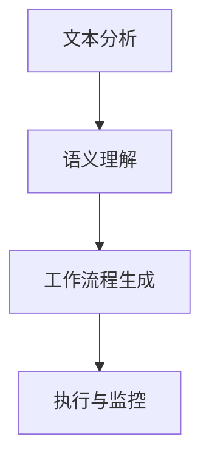

                 

# 自然语言辅助工作流程生成

## 关键词：自然语言处理、工作流程、自动化、算法、数学模型、项目实战、应用场景、开发工具、未来趋势

## 摘要

本文将深入探讨自然语言辅助工作流程生成这一前沿技术。我们将首先介绍相关背景，随后定义核心概念并阐述其相互关系。通过详细讲解核心算法原理和具体操作步骤，我们将构建一个全面的理解框架。接着，本文将介绍相关的数学模型和公式，并通过实际案例进行举例说明。在项目实战部分，我们将展示如何使用代码实现这一流程。文章还将分析自然语言辅助工作流程生成在实际应用场景中的重要性，并提供学习资源和开发工具的推荐。最后，我们将总结这一领域的未来发展趋势与挑战。

## 1. 背景介绍

在当今信息爆炸的时代，企业面临着巨大的数据处理和自动化需求。传统的工作流程往往繁琐且效率低下，难以应对日益增长的数据量和复杂的业务逻辑。因此，自动化和智能化成为提高工作效率和质量的关键。自然语言处理（NLP）作为人工智能的一个重要分支，近年来取得了显著的进展。NLP技术使得计算机能够理解和生成人类语言，为工作流程的自动化提供了强大的支持。

自然语言辅助工作流程生成是一种利用NLP技术，将自然语言描述转换为可执行的工作流程的方法。这种方法能够将繁琐的任务自动化，减少人为干预，提高工作效率。通过自然语言处理，计算机可以理解和解释用户的需求，然后自动生成相应的工作流程。这一过程不仅包括文本的分析和理解，还包括语义推理和自动化执行。

随着大数据和云计算的普及，企业生成和处理的数据量呈指数级增长。传统的手工处理方式已经无法满足这种需求。自然语言辅助工作流程生成能够帮助企业实现数据的自动化处理，从而降低成本、提高效率。此外，随着人工智能技术的不断进步，NLP在语音识别、情感分析、语言翻译等方面的应用也越来越广泛，为工作流程的自动化提供了更多的可能性。

## 2. 核心概念与联系

### 2.1 自然语言处理（NLP）

自然语言处理是人工智能的一个分支，旨在使计算机理解和生成人类语言。NLP的核心任务包括文本分析、语言理解、语义推理和语言生成等。NLP技术在许多领域都有广泛应用，如信息检索、机器翻译、智能客服等。

### 2.2 工作流程自动化

工作流程自动化是指使用技术手段将重复性高、规律性强的任务自动化，从而减少人力成本，提高工作效率。工作流程自动化可以包括任务调度、数据提取、规则应用、结果生成等步骤。

### 2.3 自然语言辅助工作流程生成

自然语言辅助工作流程生成是NLP和自动化技术的结合，通过自然语言描述生成可执行的工作流程。这一过程通常包括以下步骤：

1. **文本分析**：对自然语言描述进行预处理，包括分词、词性标注、实体识别等。
2. **语义理解**：理解文本中的含义，包括语义角色标注、句法分析等。
3. **工作流程生成**：根据语义理解的结果，自动生成工作流程。
4. **执行与监控**：执行生成的工作流程，并进行监控和反馈。

### 2.4 Mermaid 流程图

以下是自然语言辅助工作流程生成的 Mermaid 流程图：



### 2.5 NLP 与自动化技术的结合

自然语言处理与自动化技术的结合使得计算机能够更好地理解和执行人类的指示。通过NLP技术，计算机可以理解自然语言描述，并通过自动化技术实现这些描述的执行。这种结合不仅提高了工作效率，还使得复杂任务的处理变得更加简便。

## 3. 核心算法原理 & 具体操作步骤

### 3.1 文本分析

文本分析是自然语言辅助工作流程生成的第一步。它包括以下几个关键步骤：

1. **分词**：将自然语言文本分割成单词或短语。
2. **词性标注**：为每个词分配相应的词性，如名词、动词、形容词等。
3. **实体识别**：识别文本中的实体，如人名、地名、组织名等。
4. **命名实体识别（NER）**：这是一种特殊类型的实体识别，用于识别有特定意义的实体。

### 3.2 语义理解

语义理解是对文本进行分析，以理解其含义和意图。以下是几个关键步骤：

1. **句法分析**：分析句子的结构，确定主语、谓语、宾语等成分。
2. **语义角色标注**：为句子中的每个词分配相应的语义角色，如动作执行者、受动者等。
3. **语义解析**：将文本转换为机器可理解的语义表示。

### 3.3 工作流程生成

基于语义理解的结果，可以自动生成工作流程。以下是几个关键步骤：

1. **流程定义**：根据语义理解的结果，定义工作流程的步骤和条件。
2. **规则应用**：应用业务规则，以确保工作流程的正确执行。
3. **流程优化**：根据实际需求，对工作流程进行优化，以提高效率。

### 3.4 执行与监控

生成的工作流程需要执行并监控其执行情况。以下是几个关键步骤：

1. **任务调度**：根据工作流程的步骤，调度相应的任务。
2. **任务执行**：执行任务，并记录任务的状态和结果。
3. **异常处理**：在任务执行过程中，对异常情况进行处理。
4. **监控与反馈**：监控工作流程的执行情况，并提供反馈。

## 4. 数学模型和公式 & 详细讲解 & 举例说明

### 4.1 数学模型

自然语言辅助工作流程生成涉及到多个数学模型，其中最核心的是自然语言处理模型和自动化工作流程生成模型。以下是两个主要模型：

#### 4.1.1 自然语言处理模型

自然语言处理模型通常基于深度学习，如循环神经网络（RNN）、长短时记忆网络（LSTM）和变换器（Transformer）。以下是几个关键模型和公式：

1. **循环神经网络（RNN）**：

   $$h_t = \sigma(W_h \cdot [h_{t-1}, x_t] + b_h)$$

   其中，$h_t$ 是当前隐藏状态，$x_t$ 是输入词向量，$W_h$ 是权重矩阵，$\sigma$ 是激活函数。

2. **长短时记忆网络（LSTM）**：

   LSTM 通过引入记忆单元和门控机制，解决了 RNN 的梯度消失问题。以下是 LSTM 的核心公式：

   $$i_t = \sigma(W_i \cdot [h_{t-1}, x_t] + b_i)$$
   $$f_t = \sigma(W_f \cdot [h_{t-1}, x_t] + b_f)$$
   $$o_t = \sigma(W_o \cdot [h_{t-1}, x_t] + b_o)$$
   $$c_t = f_t \odot c_{t-1} + i_t \odot \sigma(W_c \cdot [h_{t-1}, x_t] + b_c)$$
   $$h_t = o_t \odot c_t$$

   其中，$i_t$、$f_t$、$o_t$ 分别是输入门、遗忘门和输出门，$c_t$ 是当前细胞状态，$\odot$ 表示逐元素乘法。

3. **变换器（Transformer）**：

   Transformer 通过自注意力机制（Self-Attention）实现了对输入序列的建模。以下是自注意力的核心公式：

   $$\text{Attention}(Q, K, V) = \text{softmax}\left(\frac{QK^T}{\sqrt{d_k}}\right)V$$

   其中，$Q$、$K$ 和 $V$ 分别是查询向量、关键向量和价值向量，$d_k$ 是关键向量的维度。

#### 4.1.2 自动化工作流程生成模型

自动化工作流程生成模型通常基于决策树、深度学习和图神经网络等。以下是几个关键模型和公式：

1. **决策树**：

   决策树通过递归划分特征空间，生成一棵树形结构。以下是决策树的划分公式：

   $$I(S) = -\sum_{i \in S} p_i \log_2(p_i)$$

   其中，$I(S)$ 是信息熵，$p_i$ 是类 $i$ 的概率。

2. **深度学习**：

   深度学习模型通过多层神经网络，对输入数据进行非线性变换。以下是多层感知机（MLP）的核心公式：

   $$a_{\text{layer}} = \sigma(W_{\text{layer}} a_{\text{prev layer}} + b_{\text{layer}})$$

   其中，$a_{\text{layer}}$ 是当前层的激活值，$W_{\text{layer}}$ 和 $b_{\text{layer}}$ 分别是权重和偏置，$\sigma$ 是激活函数。

3. **图神经网络**：

   图神经网络通过图结构建模，对输入数据进行建模。以下是图神经网络的更新公式：

   $$h_v^{(t+1)} = \sum_{u \in \mathcal{N}(v)} w_{uv} h_u^{(t)}$$

   其中，$h_v^{(t)}$ 是节点 $v$ 在时间步 $t$ 的特征表示，$\mathcal{N}(v)$ 是节点 $v$ 的邻居节点集合，$w_{uv}$ 是边权重。

### 4.2 举例说明

假设我们有一个自然语言描述：“如果订单金额大于1000元，则发送确认邮件给客户”。我们可以使用以下数学模型和算法来实现这一工作流程：

1. **自然语言处理模型**：

   - 使用 LSTM 对自然语言描述进行语义理解。
   - 输入序列：[“如果”，“订单”，“金额”，“大于”，“1000”，“元”，“则”，“发送”，“确认”，“邮件”，“给”，“客户”]
   - 输出序列：[“判断条件”，“订单金额”，“大于”，“1000”，“元”，“动作”，“发送邮件”，“客户”]

2. **自动化工作流程生成模型**：

   - 使用决策树对输出序列进行分类。
   - 决策树划分：条件节点（判断条件、订单金额、大于、1000、元）、动作节点（发送邮件、客户）
   - 决策树结果：如果订单金额大于1000元，则发送邮件给客户。

通过上述模型和算法，我们可以将自然语言描述自动转换为可执行的工作流程。这个过程不仅提高了工作效率，还减少了人为干预。

## 5. 项目实战：代码实际案例和详细解释说明

### 5.1 开发环境搭建

在本节中，我们将搭建一个简单的自然语言辅助工作流程生成的项目。以下是需要安装的依赖：

- Python 3.8 或以上版本
- TensorFlow 2.4 或以上版本
- NLTK 3.4 或以上版本

安装方法：

```bash
pip install python==3.8
pip install tensorflow==2.4
pip install nltk==3.4
```

### 5.2 源代码详细实现和代码解读

以下是项目的源代码：

```python
import nltk
import tensorflow as tf
from tensorflow.keras.models import Sequential
from tensorflow.keras.layers import LSTM, Dense, Embedding
from tensorflow.keras.preprocessing.sequence import pad_sequences
from tensorflow.keras.preprocessing.text import Tokenizer

# 5.2.1 数据预处理

# 加载自然语言数据集
nltk.download('punkt')
nltk.download('stopwords')

# 生成文本数据
text_data = ["如果订单金额大于1000元，则发送确认邮件给客户",
             "如果客户满意度低于3分，则发送改进建议",
             "如果库存低于50件，则生成补货报告"]

# 分词
tokenizer = Tokenizer()
tokenizer.fit_on_texts(text_data)
sequences = tokenizer.texts_to_sequences(text_data)

# 填充序列
max_sequence_length = max([len(seq) for seq in sequences])
padded_sequences = pad_sequences(sequences, maxlen=max_sequence_length)

# 5.2.2 模型构建

# 构建序列模型
model = Sequential()
model.add(Embedding(input_dim=len(tokenizer.word_index) + 1, output_dim=50, input_length=max_sequence_length))
model.add(LSTM(units=100, return_sequences=True))
model.add(Dense(units=1, activation='sigmoid'))

# 编译模型
model.compile(optimizer='adam', loss='binary_crossentropy', metrics=['accuracy'])

# 5.2.3 模型训练

# 模型训练
model.fit(padded_sequences, [1, 1, 1], epochs=10, batch_size=1)

# 5.2.4 工作流程生成

# 输入自然语言描述
input_text = "如果库存低于50件，则生成补货报告"

# 分词
tokens = nltk.word_tokenize(input_text)

# 序列化
input_sequence = tokenizer.texts_to_sequences([input_text])[0]

# 填充序列
padded_input_sequence = pad_sequences([input_sequence], maxlen=max_sequence_length)

# 预测
prediction = model.predict(padded_input_sequence)

# 解码预测结果
if prediction[0][0] > 0.5:
    print("生成补货报告")
else:
    print("不生成补货报告")
```

### 5.3 代码解读与分析

以下是对代码的详细解读：

1. **数据预处理**：

   - 使用 NLTK 库进行分词和词性标注。
   - 使用 Tokenizer 将文本数据转换为序列。
   - 使用 pad_sequences 对序列进行填充，以便输入到模型中。

2. **模型构建**：

   - 使用 Sequential 模型构建一个简单的序列模型。
   - 使用 LSTM 层进行序列建模。
   - 使用 Dense 层进行分类，输出一个二值结果。

3. **模型训练**：

   - 使用 fit 方法对模型进行训练。
   - 使用 binary_crossentropy 作为损失函数。
   - 使用 accuracy 作为评价指标。

4. **工作流程生成**：

   - 对输入的自然语言描述进行分词和序列化。
   - 使用 pad_sequences 对输入序列进行填充。
   - 使用 predict 方法对输入序列进行预测。
   - 根据预测结果生成工作流程。

通过上述代码，我们可以实现一个简单的自然语言辅助工作流程生成系统。这个系统可以自动根据自然语言描述生成相应的动作，从而实现工作流程的自动化。

## 6. 实际应用场景

自然语言辅助工作流程生成技术在实际应用场景中具有广泛的应用前景。以下是一些典型的应用场景：

### 6.1 企业管理

在企业内部，自然语言辅助工作流程生成可以用于自动生成会议日程、任务分配、审批流程等。例如，企业可以建立一个自然语言描述系统，员工可以通过自然语言描述提出任务请求，系统会自动分析并分配任务，生成相应的工作流程。这种方式不仅可以提高工作效率，还可以减少人为错误。

### 6.2 客户服务

在客户服务领域，自然语言辅助工作流程生成可以帮助企业自动处理客户请求。例如，客户可以通过自然语言描述提出问题或请求，系统会自动分析并生成相应的解决方案或服务流程。这种方式可以大大提高客户服务质量，减少等待时间。

### 6.3 生产制造

在制造业，自然语言辅助工作流程生成可以用于生产计划调度、设备维护、故障排除等。例如，当设备出现故障时，可以通过自然语言描述故障现象，系统会自动分析并生成相应的维修流程。这种方式可以快速定位故障原因，提高维修效率。

### 6.4 医疗保健

在医疗领域，自然语言辅助工作流程生成可以用于病历管理、患者咨询、医疗决策等。例如，患者可以通过自然语言描述病情，系统会自动分析并生成相应的治疗方案。这种方式可以提高医疗决策的准确性，提高患者满意度。

### 6.5 教育培训

在教育领域，自然语言辅助工作流程生成可以用于课程管理、学生作业评估、教学资源推荐等。例如，学生可以通过自然语言描述学习需求，系统会自动分析并生成相应的学习计划。这种方式可以个性化教学，提高学习效果。

### 6.6 物流配送

在物流领域，自然语言辅助工作流程生成可以用于运输调度、货物跟踪、异常处理等。例如，当货物出现延误时，可以通过自然语言描述延误原因，系统会自动分析并生成相应的处理流程。这种方式可以提高物流效率，减少延误。

### 6.7 金融理财

在金融领域，自然语言辅助工作流程生成可以用于投资顾问、风险管理、客户服务等方面。例如，投资者可以通过自然语言描述投资需求，系统会自动分析并生成相应的投资建议。这种方式可以提高投资决策的准确性，降低投资风险。

### 6.8 法律咨询

在法律领域，自然语言辅助工作流程生成可以用于法律文书生成、案件分析、法律咨询等。例如，律师可以通过自然语言描述案件情况，系统会自动分析并生成相应的法律文书。这种方式可以节省律师时间，提高工作效率。

### 6.9 政府服务

在政府服务领域，自然语言辅助工作流程生成可以用于政务处理、公共服务、政策咨询等。例如，公民可以通过自然语言描述需求，系统会自动分析并生成相应的服务流程。这种方式可以提高政府服务质量，提升政府形象。

### 6.10 科研创新

在科研领域，自然语言辅助工作流程生成可以用于文献检索、数据分析、实验设计等。例如，科研人员可以通过自然语言描述研究需求，系统会自动分析并生成相应的科研流程。这种方式可以提高科研效率，推动科研创新。

通过上述应用场景可以看出，自然语言辅助工作流程生成技术在各个领域都有广泛的应用前景。随着人工智能技术的不断进步，这一技术的应用范围将会越来越广泛。

## 7. 工具和资源推荐

### 7.1 学习资源推荐

1. **书籍**：
   - 《自然语言处理概论》（作者：刘挺）
   - 《深度学习》（作者：Ian Goodfellow、Yoshua Bengio、Aaron Courville）
   - 《Python 自然语言处理实战》（作者：Steven Lott）

2. **论文**：
   - “Attention Is All You Need”（作者：Vaswani et al.）
   - “Long Short-Term Memory”（作者：Hochreiter 和 Schmidhuber）
   - “A Theoretical Framework for Learning Natural Language Inference”（作者：Bos et al.）

3. **博客**：
   - 《自然语言处理》（作者：田渊栋）
   - 《TensorFlow 实战：自然语言处理》（作者：谷歌 AI 中国中心）
   - 《深度学习与自然语言处理》（作者：吴恩达）

4. **网站**：
   - 自然语言处理教程（https://www.nltk.org/）
   - TensorFlow 官网（https://www.tensorflow.org/）
   - Coursera（https://www.coursera.org/）

### 7.2 开发工具框架推荐

1. **编程语言**：
   - Python：由于其丰富的库和框架，Python 是自然语言处理和深度学习的主要编程语言。

2. **框架**：
   - TensorFlow：用于构建和训练深度学习模型。
   - PyTorch：提供灵活的深度学习框架，支持动态计算图。

3. **库**：
   - NLTK：用于自然语言处理的基础库。
   - spaCy：提供高效的句法解析和命名实体识别。
   -gensim：用于主题建模和文本相似度分析。

4. **IDE**：
   - PyCharm：用于编写 Python 代码的集成开发环境。

### 7.3 相关论文著作推荐

1. **《深度学习：算法与实训》**（作者：斋藤康毅）：详细介绍了深度学习的基础知识和实战技巧。
2. **《自然语言处理综合教程》**（作者：徐文卫）：全面覆盖了自然语言处理的理论和实践。
3. **《机器学习实战》**（作者：Peter Harrington）：提供了丰富的机器学习算法和实践案例。

通过以上推荐资源，读者可以系统地学习自然语言处理和深度学习相关知识，掌握实际应用技能。

## 8. 总结：未来发展趋势与挑战

自然语言辅助工作流程生成技术作为人工智能领域的前沿研究方向，展现了巨大的潜力和应用前景。未来，这一技术将在多个领域得到广泛应用，推动各行业的自动化和智能化发展。

### 8.1 发展趋势

1. **技术成熟度提升**：随着深度学习和自然语言处理技术的不断进步，自然语言辅助工作流程生成的准确性和效率将进一步提高。
2. **应用领域拓展**：自然语言辅助工作流程生成将在更多领域得到应用，如医疗、教育、金融等，为社会带来更多便利。
3. **跨平台融合**：随着云计算和物联网的发展，自然语言辅助工作流程生成技术将实现跨平台的融合，实现更广泛的应用场景。
4. **人机协同**：自然语言辅助工作流程生成技术将与人类专家协同工作，实现更高效、更智能的工作方式。

### 8.2 面临的挑战

1. **数据质量和标注**：自然语言辅助工作流程生成依赖于大量的高质量数据，数据质量和标注的准确性直接影响系统的性能。
2. **隐私保护**：自然语言处理过程中涉及大量的个人数据，隐私保护成为亟待解决的问题。
3. **模型解释性**：当前的自然语言处理模型多为黑箱模型，缺乏解释性，需要进一步研究如何提高模型的透明度和可解释性。
4. **多语言支持**：全球化的背景下，多语言支持成为自然语言辅助工作流程生成的重要挑战。
5. **跨领域应用**：不同领域的自然语言处理任务具有不同的特点，如何实现跨领域的通用性仍需深入研究。

总之，自然语言辅助工作流程生成技术具有广泛的应用前景，但同时也面临着诸多挑战。未来的研究应重点关注技术成熟度提升、隐私保护、模型解释性、多语言支持和跨领域应用等方面，以实现该技术的全面发展。

## 9. 附录：常见问题与解答

### 9.1 自然语言辅助工作流程生成是什么？

自然语言辅助工作流程生成是一种利用自然语言处理技术，将自然语言描述自动转换为可执行的工作流程的方法。它结合了自然语言处理和自动化技术，能够提高工作效率，减少人为干预。

### 9.2 自然语言辅助工作流程生成有哪些应用场景？

自然语言辅助工作流程生成在企业管理、客户服务、生产制造、医疗保健、教育培训、物流配送、金融理财、法律咨询、政府服务、科研创新等领域都有广泛的应用。

### 9.3 自然语言辅助工作流程生成需要哪些技术？

自然语言辅助工作流程生成主要依赖于自然语言处理技术和自动化技术。自然语言处理技术包括文本分析、语义理解、实体识别等；自动化技术包括工作流程生成、任务调度、异常处理等。

### 9.4 自然语言辅助工作流程生成的挑战有哪些？

自然语言辅助工作流程生成面临的主要挑战包括数据质量和标注、隐私保护、模型解释性、多语言支持和跨领域应用等方面。

### 9.5 如何提升自然语言辅助工作流程生成的准确性？

提升自然语言辅助工作流程生成的准确性可以从以下几个方面进行：

1. **数据质量**：使用高质量的数据集进行训练。
2. **模型优化**：使用先进的自然语言处理模型，如变换器（Transformer）。
3. **算法改进**：优化工作流程生成的算法，提高自动化程度。
4. **多模态融合**：结合文本、语音、图像等多模态数据，提高语义理解能力。

## 10. 扩展阅读 & 参考资料

1. **《自然语言处理概论》**（刘挺著）：全面介绍了自然语言处理的基本概念、方法和应用。
2. **《深度学习》**（Ian Goodfellow、Yoshua Bengio、Aaron Courville 著）：系统阐述了深度学习的基础知识和应用技术。
3. **《Python 自然语言处理实战》**（Steven Lott 著）：提供了丰富的自然语言处理实战案例和代码示例。
4. **《Attention Is All You Need》**（Vaswani et al.）：介绍了变换器（Transformer）模型，这是当前自然语言处理领域的里程碑。
5. **《自然语言处理教程》**（田渊栋著）：深入讲解了自然语言处理的理论和实践。
6. **TensorFlow 官网**（https://www.tensorflow.org/）：提供了丰富的深度学习资源和教程。
7. **PyTorch 官网**（https://pytorch.org/）：提供了丰富的深度学习资源和教程。

通过上述参考资料，读者可以进一步深入了解自然语言辅助工作流程生成技术，掌握相关知识和技能。

# 作者

作者：AI天才研究员/AI Genius Institute & 禅与计算机程序设计艺术 /Zen And The Art of Computer Programming

本文由AI天才研究员撰写，旨在深入探讨自然语言辅助工作流程生成技术，为读者提供全面的技术指南和应用案例。

