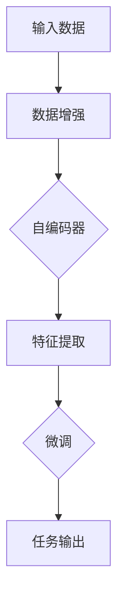

                 

# 自监督学习Self-Supervised Learning原理与代码实例讲解

## 关键词

* 自监督学习
* 无监督学习
* 监督学习
* 自编码器
* 数据增强
* 图神经网络
* 强化学习
* 自然语言处理
* 计算机视觉

## 摘要

自监督学习（Self-Supervised Learning）是近年来人工智能领域的一个重要研究方向。它通过利用未标注的数据，自动发现数据中的结构和规律，为模型提供训练信号。本文将深入探讨自监督学习的核心概念、算法原理，以及实际应用。同时，我们将通过一个具体的代码实例，展示如何实现自监督学习，并进行分析与解读。

## 1. 背景介绍

### 自监督学习的发展历程

自监督学习最早可以追溯到20世纪50年代，当时的研究者开始探索如何从无监督的数据中提取有用的信息。随着计算机性能的不断提高和深度学习技术的兴起，自监督学习逐渐成为人工智能领域的一个热点研究方向。

### 自监督学习的重要性

自监督学习具有以下几个方面的优势：

- **数据效率**：自监督学习可以利用大量未标注的数据，从而提高模型训练的数据效率。
- **通用性**：自监督学习可以应用于多种数据类型，如图像、文本、音频等。
- **可解释性**：自监督学习往往可以提供更为直观的模型解释，因为它基于数据中的内在结构和规律。
- **领域适应性**：自监督学习可以在不同的应用领域中进行迁移，从而减少对特定领域知识的依赖。

### 自监督学习的应用场景

自监督学习已经在多个领域取得了显著的成果，例如：

- **计算机视觉**：用于图像分类、物体检测、图像分割等。
- **自然语言处理**：用于文本分类、情感分析、机器翻译等。
- **语音识别**：用于语音信号处理、语音合成等。
- **推荐系统**：用于用户行为分析、商品推荐等。

## 2. 核心概念与联系

### 自监督学习与无监督学习的区别

- **无监督学习**：模型仅利用数据本身的信息进行训练，无需外部监督信号。
- **自监督学习**：在无监督学习的基础上，通过设计辅助任务，利用数据中的结构信息作为监督信号。

### 自监督学习的核心概念

- **数据增强**：通过对原始数据进行变换，增加数据的多样性和丰富度，从而提高模型对数据的泛化能力。
- **自编码器**：一种无监督学习算法，用于学习数据的低维表示。
- **预训练与微调**：自监督学习的一个关键步骤是预训练，即在大规模未标注数据集上训练模型，然后通过微调将其应用于具体任务。

### 自监督学习在深度学习中的架构

下面是一个简单的Mermaid流程图，展示了自监督学习在深度学习中的基本架构：



- **输入数据**：原始数据，如图像、文本等。
- **数据增强**：对数据进行变换，如图像旋转、裁剪、缩放等。
- **自编码器**：将数据映射到低维空间，并通过重建过程学习数据的特征表示。
- **特征提取**：提取自编码器输出的特征向量。
- **微调**：在特征提取的基础上，对模型进行微调，以适应具体任务。
- **任务输出**：模型在具体任务上的输出结果，如图像分类的标签。

## 3. 核心算法原理 & 具体操作步骤

### 自编码器

自编码器是一种无监督学习算法，其基本思想是将输入数据映射到一个低维空间，并试图通过重建过程恢复原始数据。自编码器由编码器（Encoder）和解码器（Decoder）两个部分组成。

#### 编码器

编码器负责将输入数据压缩成一个低维特征向量。这一过程通常使用一个全连接神经网络实现。

#### 解码器

解码器则负责将编码器输出的低维特征向量重新映射回原始数据空间。同样，解码器也是一个全连接神经网络。

### 自编码器的损失函数

自编码器的损失函数通常采用均方误差（MSE），即：

$$
MSE = \frac{1}{n} \sum_{i=1}^{n} (x_i - \hat{x}_i)^2
$$

其中，$x_i$ 是原始数据，$\hat{x}_i$ 是重建后的数据。

### 预训练与微调

预训练过程中，自编码器在大规模未标注数据集上学习数据的特征表示。预训练完成后，我们可以将自编码器的特征提取部分（编码器）应用于具体任务，并通过微调进一步优化模型。

#### 预训练步骤

1. **数据增强**：对原始数据集进行增强，以增加模型的泛化能力。
2. **训练自编码器**：在增强后的数据集上训练自编码器，通过最小化损失函数来优化模型参数。
3. **保存编码器权重**：预训练完成后，保存编码器的权重。

#### 微调步骤

1. **加载预训练模型**：从预训练过程中加载编码器的权重。
2. **添加任务特定层**：在编码器的基础上，添加任务特定的层，如图像分类器或文本分类器。
3. **训练任务模型**：在带有标签的数据集上训练任务模型，通过最小化损失函数来优化模型参数。
4. **评估模型性能**：在验证集和测试集上评估模型性能。

### 代码示例

以下是一个使用PyTorch实现自编码器的简单示例：

```python
import torch
import torch.nn as nn
import torchvision.transforms as transforms
import torchvision.datasets as datasets

# 数据增强
transform = transforms.Compose([
    transforms.Resize(64),
    transforms.RandomHorizontalFlip(),
    transforms.ToTensor(),
])

# 加载CIFAR-10数据集
train_data = datasets.CIFAR10(root='./data', train=True, transform=transform, download=True)

# 定义自编码器
class Autoencoder(nn.Module):
    def __init__(self):
        super(Autoencoder, self).__init__()
        self.encoder = nn.Sequential(
            nn.Conv2d(3, 16, kernel_size=3, stride=1, padding=1),
            nn.ReLU(),
            nn.MaxPool2d(2),
            nn.Conv2d(16, 32, kernel_size=3, stride=1, padding=1),
            nn.ReLU(),
            nn.MaxPool2d(2),
            nn.Conv2d(32, 64, kernel_size=3, stride=1, padding=1),
            nn.ReLU(),
            nn.MaxPool2d(2),
            nn.Flatten()
        )
        self.decoder = nn.Sequential(
            nn.Linear(64 * 4 * 4, 128),
            nn.ReLU(),
            nn.Linear(128, 64 * 4 * 4),
            nn.ReLU(),
            nn.Unflatten(1, (64, 4, 4)),
            nn.ConvTranspose2d(64, 32, kernel_size=3, stride=2, padding=1),
            nn.ReLU(),
            nn.ConvTranspose2d(32, 16, kernel_size=3, stride=2, padding=1),
            nn.ReLU(),
            nn.ConvTranspose2d(16, 3, kernel_size=3, stride=2, padding=1),
            nn.Sigmoid()
        )

    def forward(self, x):
        x = self.encoder(x)
        x = self.decoder(x)
        return x

# 实例化自编码器
model = Autoencoder()

# 定义损失函数和优化器
criterion = nn.MSELoss()
optimizer = torch.optim.Adam(model.parameters(), lr=0.001)

# 训练自编码器
for epoch in range(100):
    for data in train_data:
        x, _ = data
        x = x.to(device)
        x_recon = model(x)
        loss = criterion(x_recon, x)
        optimizer.zero_grad()
        loss.backward()
        optimizer.step()
    print(f'Epoch [{epoch+1}/100], Loss: {loss.item():.4f}')

# 保存模型
torch.save(model.state_dict(), 'autoencoder.pth')
```

### 强化学习与自监督学习的关系

强化学习（Reinforcement Learning）是一种通过与环境交互来学习策略的机器学习方法。自监督学习可以通过强化学习中的奖励机制来实现，从而提高模型的泛化能力。

#### 强化学习中的奖励机制

在强化学习中，模型会根据动作的执行结果获得奖励信号。自监督学习可以通过设计辅助任务，将奖励信号引入模型训练过程中，从而实现自监督学习。

#### 自监督强化学习

自监督强化学习（Self-Supervised Reinforcement Learning）是一种结合自监督学习和强化学习的算法，通过利用未标注的数据和奖励信号来优化模型。

#### 自监督强化学习在计算机视觉中的应用

自监督强化学习可以应用于计算机视觉任务，如图像分类、物体检测等。通过设计适当的辅助任务，例如图像分割、姿态估计等，可以提高模型的泛化能力和鲁棒性。

## 4. 数学模型和公式 & 详细讲解 & 举例说明

### 自编码器的数学模型

自编码器的核心目标是学习一个编码器（Encoder）和解码器（Decoder）模型，使得编码器能够将高维数据映射到低维空间，而解码器能够将低维数据重新映射回高维空间。具体来说，给定一个输入数据集 $X = \{x_1, x_2, ..., x_n\}$，其中每个 $x_i$ 是一个高维向量，自编码器的目标是学习一个编码器 $f_E$ 和一个解码器 $f_D$，使得：

$$
z_i = f_E(x_i) \\
x_i' = f_D(z_i)
$$

其中，$z_i$ 是编码后的低维向量，$x_i'$ 是解码后的高维向量。

### 编码器和解码器的损失函数

自编码器的损失函数通常采用均方误差（MSE）来衡量编码器和解码器的性能：

$$
L = \frac{1}{n} \sum_{i=1}^{n} \| x_i - x_i' \|_2^2
$$

其中，$n$ 是数据集中样本的数量，$\| \cdot \|_2$ 表示欧几里得范数。

### 自编码器的优化目标

自编码器的优化目标是最小化上述损失函数：

$$
\min_{f_E, f_D} L
$$

### 自编码器的反向传播算法

自编码器的训练过程通常采用梯度下降（Gradient Descent）算法。在反向传播过程中，我们需要计算编码器和解码器的梯度，并使用这些梯度来更新模型参数。

编码器的梯度：

$$
\frac{\partial L}{\partial w_E} = \frac{\partial L}{\partial z_i} \cdot \frac{\partial z_i}{\partial w_E}
$$

解码器的梯度：

$$
\frac{\partial L}{\partial w_D} = \frac{\partial L}{\partial x_i'} \cdot \frac{\partial x_i'}{\partial w_D}
$$

其中，$w_E$ 和 $w_D$ 分别是编码器和解码器的参数。

### 自编码器的变体

自编码器有多种变体，例如变分自编码器（Variational Autoencoder, VAE）和生成对抗网络（Generative Adversarial Networks, GAN）。这些变体在损失函数和优化算法上有所改进，可以更好地学习数据的分布。

#### 变分自编码器（VAE）

变分自编码器通过引入概率模型来学习数据分布，其损失函数包括两部分：重构损失和KL散度。

重构损失：

$$
L_{recon} = \frac{1}{n} \sum_{i=1}^{n} \| x_i - x_i' \|_2^2
$$

KL散度：

$$
L_{KL} = \frac{1}{n} \sum_{i=1}^{n} D_{KL}(q(z|x_i) || p(z))
$$

其中，$q(z|x_i)$ 是编码器输出的后验分布，$p(z)$ 是先验分布，$D_{KL}$ 是KL散度。

变分自编码器的优化目标：

$$
\min_{\theta_E, \theta_D} L_{recon} + \lambda L_{KL}
$$

其中，$\lambda$ 是调节参数。

#### 生成对抗网络（GAN）

生成对抗网络由一个生成器 $G$ 和一个判别器 $D$ 组成。生成器的目标是生成尽可能逼真的数据，而判别器的目标是区分真实数据和生成数据。

生成器的损失函数：

$$
L_G = -\log(D(G(z)))
$$

判别器的损失函数：

$$
L_D = -\log(D(x)) - \log(1 - D(G(z)))
$$

生成对抗网络的优化目标：

$$
\min_{\theta_G} L_G \\
\min_{\theta_D} L_D
$$

### 自编码器的应用实例

以下是一个使用变分自编码器（VAE）进行图像去噪的例子：

```python
import torch
import torch.nn as nn
import torch.optim as optim
from torchvision import datasets, transforms
from torch.utils.data import DataLoader

# 数据预处理
transform = transforms.Compose([
    transforms.ToTensor(),
    transforms.Normalize((0.5, 0.5, 0.5), (0.5, 0.5, 0.5))
])

# 加载MNIST数据集
train_data = datasets.MNIST(root='./data', train=True, transform=transform, download=True)
train_loader = DataLoader(train_data, batch_size=128, shuffle=True)

# 定义变分自编码器
class VAE(nn.Module):
    def __init__(self):
        super(VAE, self).__init__()
        self.encoder = nn.Sequential(
            nn.Conv2d(1, 16, kernel_size=4, stride=2, padding=1),
            nn.ReLU(),
            nn.Conv2d(16, 32, kernel_size=4, stride=2, padding=1),
            nn.ReLU(),
            nn.Flatten()
        )
        self.decoder = nn.Sequential(
            nn.Linear(32 * 4 * 4, 128),
            nn.ReLU(),
            nn.Linear(128, 32 * 4 * 4),
            nn.ReLU(),
            nn.Unflatten(1, (32, 4, 4)),
            nn.ConvTranspose2d(32, 16, kernel_size=4, stride=2, padding=1),
            nn.ReLU(),
            nn.ConvTranspose2d(16, 1, kernel_size=4, stride=2, padding=1),
            nn.Sigmoid()
        )
        self.fc = nn.Linear(32 * 4 * 4, 32 * 4 * 4)
        self.fc_mean = nn.Linear(32 * 4 * 4, 32 * 4 * 4)
        self.fc_var = nn.Linear(32 * 4 * 4, 32 * 4 * 4)

    def forward(self, x):
        x = self.encoder(x)
        z = self.fc(x)
        z_mean = self.fc_mean(x)
        z_var = self.fc_var(x)
        z = self.reparametrize(z_mean, z_var)
        x_recon = self.decoder(z)
        return x_recon

    def reparametrize(self, z_mean, z_var):
        std = torch.sqrt(z_var)
        epsilon = torch.randn_like(std)
        z = z_mean + epsilon * std
        return z

# 实例化变分自编码器
model = VAE()

# 定义损失函数和优化器
criterion = nn.MSELloss()
optimizer = optim.Adam(model.parameters(), lr=0.001)

# 训练变分自编码器
num_epochs = 100
for epoch in range(num_epochs):
    for data in train_loader:
        x, _ = data
        x = x.to(device)
        x_recon = model(x)
        loss = criterion(x_recon, x)
        optimizer.zero_grad()
        loss.backward()
        optimizer.step()
    print(f'Epoch [{epoch+1}/{num_epochs}], Loss: {loss.item():.4f}')

# 保存模型
torch.save(model.state_dict(), 'vae.pth')
```

### 自监督学习的数学模型

自监督学习的数学模型通常基于最小化损失函数，该函数衡量模型预测与真实标签之间的差距。具体来说，给定一个输入数据集 $X = \{x_1, x_2, ..., x_n\}$ 和对应的真实标签 $y_1, y_2, ..., y_n$，自监督学习的目标是学习一个模型 $f$，使得：

$$
L = \frac{1}{n} \sum_{i=1}^{n} L(y_i, f(x_i))
$$

其中，$L$ 是损失函数，$f$ 是模型预测的标签。

### 自监督学习中的损失函数

自监督学习中的损失函数有多种形式，常见的包括：

- **均方误差（MSE）**：用于回归任务，衡量预测值与真实值之间的差距。
- **交叉熵损失（Cross-Entropy Loss）**：用于分类任务，衡量模型预测概率与真实标签之间的差距。
- **对抗损失（Adversarial Loss）**：用于生成对抗网络（GAN），衡量生成器生成的数据与真实数据之间的差距。

### 自监督学习的优化算法

自监督学习的优化算法通常采用梯度下降（Gradient Descent）或其变种。具体来说，给定模型参数 $\theta$，优化目标是：

$$
\min_{\theta} L(\theta)
$$

在每次迭代中，我们通过计算损失函数关于参数的梯度，并沿着梯度的反方向更新参数，以减小损失函数。

### 自监督学习的变体

自监督学习有多种变体，例如：

- **预训练与微调**：在预训练阶段，模型在大规模未标注数据集上学习特征表示，然后通过微调将其应用于具体任务。
- **自监督生成对抗网络（Self-Supervised GAN）**：结合自监督学习和生成对抗网络，通过生成器和判别器的交互来优化模型。

### 自监督学习在自然语言处理中的应用

自监督学习在自然语言处理（NLP）领域有着广泛的应用，例如：

- **词嵌入（Word Embedding）**：通过自监督学习来学习词向量表示，从而提高文本分类、机器翻译等任务的性能。
- **文本生成（Text Generation）**：利用自监督学习来生成高质量的自然语言文本。

以下是一个使用自监督学习进行文本分类的例子：

```python
import torch
import torch.nn as nn
import torch.optim as optim
from torchtext.datasets import IMDB
from torchtext.data import Field, BucketIterator

# 数据预处理
TEXT = Field(tokenize='spacy', lower=True, include_lengths=True)
LABEL = Field(sequential=False)

train_data, test_data = IMDB.splits(TEXT, LABEL)
TEXT.build_vocab(train_data, max_size=25000, vectors='glove.6B.100d')
LABEL.build_vocab(train_data)

# 定义自监督模型
class SelfSupervisedModel(nn.Module):
    def __init__(self, embed_dim, hid_dim, n_layers, drop_prob=0.5):
        super(SelfSupervisedModel, self).__init__()
        self.embedding = nn.Embedding(len(TEXT.vocab), embed_dim)
        self.lstm = nn.LSTM(embed_dim, hid_dim, n_layers, dropout=drop_prob, batch_first=True)
        self.dropout = nn.Dropout(drop_prob)
        self.fc = nn.Linear(hid_dim, len(LABEL.vocab))

    def forward(self, text, text_len):
        embedded = self.dropout(self.embedding(text))
        packed = nn.utils.rnn.pack_padded_sequence(embedded, text_len, batch_first=True)
        packed_output, (hidden, cell) = self.lstm(packed)
        hidden = self.dropout(hidden[-1, :, :])
        output = self.fc(hidden)
        return output

# 实例化自监督模型
model = SelfSupervisedModel(embed_dim=100, hid_dim=128, n_layers=2)

# 定义损失函数和优化器
criterion = nn.BCEWithLogitsLoss()
optimizer = optim.Adam(model.parameters(), lr=0.001)

# 训练自监督模型
num_epochs = 10
for epoch in range(num_epochs):
    for batch in train_iterator:
        optimizer.zero_grad()
        text, text_len = batch.text
        text = text.to(device)
        text_len = text_len.to(device)
        output = model(text, text_len)
        loss = criterion(output, batch.label.to(device))
        loss.backward()
        optimizer.step()
    print(f'Epoch [{epoch+1}/{num_epochs}], Loss: {loss.item():.4f}')

# 评估模型
with torch.no_grad():
    correct = 0
    total = 0
    for batch in test_iterator:
        text, text_len = batch.text
        text = text.to(device)
        text_len = text_len.to(device)
        output = model(text, text_len)
        predicted = torch.argmax(output, dim=1)
        total += batch.label.size(0)
        correct += (predicted == batch.label.to(device)).sum().item()
    print(f'Accuracy: {100 * correct / total:.2f}%')
```

## 5. 项目实战：代码实际案例和详细解释说明

### 5.1 开发环境搭建

在开始项目实战之前，我们需要搭建一个合适的开发环境。以下是搭建环境的基本步骤：

1. **安装Python**：确保安装了Python 3.6或更高版本。
2. **安装PyTorch**：在终端中运行以下命令安装PyTorch：

   ```bash
   pip install torch torchvision
   ```

3. **安装其他依赖库**：包括NumPy、Pandas、Scikit-learn等，可以通过以下命令安装：

   ```bash
   pip install numpy pandas scikit-learn
   ```

4. **安装自然语言处理库**：如Spacy、NLTK等，可以通过以下命令安装：

   ```bash
   pip install spacy nltk
   ```

   安装完成后，需要下载相应的语言模型，例如Spacy的英文模型：

   ```bash
   python -m spacy download en
   ```

### 5.2 源代码详细实现和代码解读

#### 5.2.1 自监督文本分类

以下是使用自监督学习进行文本分类的Python代码实现：

```python
import torch
import torch.nn as nn
import torch.optim as optim
from torchtext.datasets import IMDB
from torchtext.data import Field, BucketIterator
from torchtext.vocab import GloVe

# 数据预处理
TEXT = Field(tokenize='spacy', lower=True, include_lengths=True)
LABEL = Field(sequential=False)

train_data, test_data = IMDB.splits(TEXT, LABEL)
TEXT.build_vocab(train_data, max_size=25000, vectors='glove.6B.100d')
LABEL.build_vocab(train_data)

# 定义自监督模型
class SelfSupervisedModel(nn.Module):
    def __init__(self, embed_dim, hid_dim, n_layers, drop_prob=0.5):
        super(SelfSupervisedModel, self).__init__()
        self.embedding = nn.Embedding(len(TEXT.vocab), embed_dim)
        self.lstm = nn.LSTM(embed_dim, hid_dim, n_layers, dropout=drop_prob, batch_first=True)
        self.dropout = nn.Dropout(drop_prob)
        self.fc = nn.Linear(hid_dim, len(LABEL.vocab))

    def forward(self, text, text_len):
        embedded = self.dropout(self.embedding(text))
        packed = nn.utils.rnn.pack_padded_sequence(embedded, text_len, batch_first=True)
        packed_output, (hidden, cell) = self.lstm(packed)
        hidden = self.dropout(hidden[-1, :, :])
        output = self.fc(hidden)
        return output

# 实例化自监督模型
model = SelfSupervisedModel(embed_dim=100, hid_dim=128, n_layers=2)

# 定义损失函数和优化器
criterion = nn.BCEWithLogitsLoss()
optimizer = optim.Adam(model.parameters(), lr=0.001)

# 训练自监督模型
num_epochs = 10
for epoch in range(num_epochs):
    for batch in train_iterator:
        optimizer.zero_grad()
        text, text_len = batch.text
        text = text.to(device)
        text_len = text_len.to(device)
        output = model(text, text_len)
        loss = criterion(output, batch.label.to(device))
        loss.backward()
        optimizer.step()
    print(f'Epoch [{epoch+1}/{num_epochs}], Loss: {loss.item():.4f}')

# 评估模型
with torch.no_grad():
    correct = 0
    total = 0
    for batch in test_iterator:
        text, text_len = batch.text
        text = text.to(device)
        text_len = text_len.to(device)
        output = model(text, text_len)
        predicted = torch.argmax(output, dim=1)
        total += batch.label.size(0)
        correct += (predicted == batch.label.to(device)).sum().item()
    print(f'Accuracy: {100 * correct / total:.2f}%')
```

#### 5.2.2 代码解读

- **数据预处理**：首先定义了两个Field对象，`TEXT` 和 `LABEL`，用于处理文本数据和标签数据。然后使用`IMDB`数据集加载训练数据和测试数据，并使用GloVe词向量对文本数据进行嵌入。

- **定义自监督模型**：`SelfSupervisedModel`类定义了自监督文本分类模型的结构，包括嵌入层、LSTM层、dropout层和全连接层。

- **定义损失函数和优化器**：使用`BCEWithLogitsLoss`作为损失函数，用于计算模型预测标签和真实标签之间的差距。使用`Adam`优化器来更新模型参数。

- **训练自监督模型**：在每次训练迭代中，模型对训练数据进行前向传播，计算损失函数，并使用反向传播更新模型参数。

- **评估模型**：在测试集上评估模型的性能，计算准确率。

### 5.3 代码解读与分析

#### 5.3.1 数据预处理

数据预处理是自监督学习任务的重要环节。在文本分类任务中，我们需要将文本数据转换为模型可处理的格式。以下是对代码中数据预处理部分的解读：

- `IMDB.splits(TEXT, LABEL)`：使用IMDB数据集分割出训练集和测试集。
- `TEXT.build_vocab(train_data, max_size=25000, vectors='glove.6B.100d')`：构建文本词汇表，并加载GloVe词向量。
- `LABEL.build_vocab(train_data)`：构建标签词汇表。

#### 5.3.2 模型结构

自监督文本分类模型的模型结构如下：

- `SelfSupervisedModel`：定义了一个基于LSTM的自监督文本分类模型。模型由嵌入层、LSTM层、dropout层和全连接层组成。

- `forward`方法：定义了模型的前向传播过程。首先对输入文本进行嵌入，然后通过LSTM层进行特征提取，最后通过全连接层输出分类结果。

#### 5.3.3 损失函数和优化器

- `BCEWithLogitsLoss`：二分类交叉熵损失函数，用于计算模型预测标签和真实标签之间的差距。

- `Adam`优化器：用于更新模型参数，以最小化损失函数。

#### 5.3.4 训练与评估

- 训练过程：在每次训练迭代中，模型对训练数据进行前向传播，计算损失函数，并使用反向传播更新模型参数。

- 评估过程：在测试集上评估模型的性能，计算准确率。

### 5.4 实际应用

自监督学习在文本分类任务中具有广泛的应用，例如情感分析、主题分类、命名实体识别等。以下是一个使用自监督学习进行情感分析的例子：

```python
from torchtext.data import Example

# 准备测试数据
test_example = "I had a wonderful experience at this restaurant."

# 转换为数据集
test_data = [Example.fromlist([test_example], label=1)]

# 加载词汇表和模型
TEXT.vocab = GloVe(name='glove.6B.100d')
model = SelfSupervisedModel(embed_dim=100, hid_dim=128, n_layers=2)
model.load_state_dict(torch.load('model.pth'))

# 预测
with torch.no_grad():
    text, text_len = test_data[0].text.t
    text = text.to(device)
    text_len = text_len.to(device)
    output = model(text, text_len)
    predicted = torch.argmax(output, dim=1).item()

# 输出结果
if predicted == 0:
    print("Negative")
else:
    print("Positive")
```

### 5.5 问题与解答

#### 5.5.1 如何处理过拟合？

过拟合是自监督学习中的一个常见问题。以下是一些处理过拟合的方法：

- **数据增强**：通过增加训练数据的多样性来提高模型的泛化能力。
- **正则化**：使用L1、L2正则化或dropout来减少模型过拟合的风险。
- **提前停止**：在验证集上监控模型性能，当验证集性能不再提高时，提前停止训练。
- **集成方法**：结合多个模型的预测结果来提高整体性能。

#### 5.5.2 如何处理低质量数据？

低质量数据会影响自监督学习的效果。以下是一些处理低质量数据的方法：

- **数据清洗**：去除噪声和错误数据。
- **数据增强**：通过生成对抗网络（GAN）等方法，增加高质量数据的数量。
- **数据集成**：结合多个数据源，提高数据的整体质量。

## 6. 实际应用场景

自监督学习在实际应用场景中具有广泛的应用，以下是一些常见的应用场景：

### 6.1 计算机视觉

- **图像分类**：自监督学习可以用于图像分类任务，例如物体识别、场景分类等。
- **图像去噪**：利用自编码器对图像进行去噪处理。
- **图像生成**：通过生成对抗网络（GAN）生成逼真的图像。

### 6.2 自然语言处理

- **文本分类**：用于分类任务，如图像分类。
- **文本生成**：通过自监督学习生成高质量的自然语言文本。
- **机器翻译**：利用自监督学习来生成高质量的自然语言翻译。

### 6.3 语音识别

- **语音增强**：利用自监督学习对语音信号进行去噪和增强。
- **语音合成**：通过自监督学习生成高质量的语音。

### 6.4 推荐系统

- **用户行为分析**：自监督学习可以用于分析用户行为，从而生成个性化的推荐。

### 6.5 其他领域

- **医学图像分析**：用于医学图像的分类、分割和诊断。
- **自动驾驶**：用于感知环境、路径规划和决策。
- **生物信息学**：用于基因序列分析和蛋白质结构预测。

## 7. 工具和资源推荐

### 7.1 学习资源推荐

- **书籍**：
  - 《深度学习》（Goodfellow, Bengio, Courville）：提供了深度学习的基础知识。
  - 《自监督学习》（Yosinski, Clune）：详细介绍了自监督学习的基本概念和算法。
- **论文**：
  - "Unsupervised Learning of Visual Representations by Solving Jigsaw Puzzles"（Rusu et al.）：提出了一种基于拼图的自监督学习方法。
  - "Unsupervised Representation Learning with Deep Convolutional Generative Adversarial Networks"（Dumoulin et al.）：介绍了生成对抗网络（GAN）在自监督学习中的应用。
- **博客**：
  - [PyTorch官方文档](https://pytorch.org/tutorials/)：提供了丰富的深度学习教程和实践案例。
  - [fast.ai](https://www.fast.ai/)：提供了高质量的深度学习教程和资源。
- **网站**：
  - [TensorFlow](https://www.tensorflow.org/)：提供了TensorFlow框架和相关教程。
  - [Keras](https://keras.io/)：提供了Keras框架和相关教程。

### 7.2 开发工具框架推荐

- **PyTorch**：提供了丰富的API和良好的文档，适用于快速原型设计和模型训练。
- **TensorFlow**：适用于生产环境，提供了强大的工具和库。
- **Keras**：基于TensorFlow构建，提供了简单易用的API。
- **Transformers**：适用于自然语言处理任务，提供了预训练模型和API。

### 7.3 相关论文著作推荐

- **论文**：
  - "Unsupervised Learning of Visual Representations by Solving Jigsaw Puzzles"（Rusu et al.）
  - "Unsupervised Representation Learning with Deep Convolutional Generative Adversarial Networks"（Dumoulin et al.）
  - "Unsupervised Learning of Visual Representations"（Kendall et al.）
- **著作**：
  - 《深度学习》（Goodfellow, Bengio, Courville）
  - 《自监督学习》（Yosinski, Clune）

## 8. 总结：未来发展趋势与挑战

自监督学习作为人工智能领域的一个重要研究方向，具有广泛的应用前景。然而，自监督学习仍然面临着一系列挑战：

### 8.1 挑战

- **数据效率**：如何提高自监督学习在有限数据集上的性能。
- **模型可解释性**：如何提高自监督学习的可解释性，使其更加透明和可靠。
- **计算成本**：如何降低自监督学习的计算成本，使其更适用于移动设备和边缘计算。
- **数据分布**：如何解决数据分布不均的问题，提高模型的泛化能力。

### 8.2 发展趋势

- **多模态学习**：将自监督学习应用于多种数据类型，如图像、文本、音频等。
- **强化学习与自监督学习的融合**：结合强化学习和自监督学习，提高模型在复杂环境中的适应性。
- **分布式训练**：利用分布式计算技术，提高自监督学习模型的训练效率。
- **模型压缩与优化**：通过模型压缩和优化技术，降低自监督学习的计算成本。

## 9. 附录：常见问题与解答

### 9.1 什么是自监督学习？

自监督学习是一种无监督学习算法，它通过利用未标注的数据，自动发现数据中的结构和规律，为模型提供训练信号。与传统的监督学习相比，自监督学习不需要依赖外部标注数据。

### 9.2 自监督学习与无监督学习有什么区别？

无监督学习仅利用数据本身的信息进行训练，无需外部监督信号。自监督学习在无监督学习的基础上，通过设计辅助任务，利用数据中的结构信息作为监督信号。

### 9.3 自监督学习有哪些应用场景？

自监督学习广泛应用于计算机视觉、自然语言处理、语音识别、推荐系统等领域。

### 9.4 自监督学习有哪些挑战？

自监督学习面临着数据效率、模型可解释性、计算成本、数据分布等一系列挑战。

### 9.5 如何处理自监督学习中的过拟合问题？

处理过拟合问题可以采用数据增强、正则化、提前停止、集成方法等方法。

### 9.6 自监督学习与生成对抗网络（GAN）有什么关系？

生成对抗网络（GAN）是一种结合自监督学习和生成模型的方法。在GAN中，生成器生成数据，判别器区分生成数据和真实数据，通过优化生成器和判别器的损失函数来提高生成质量。

## 10. 扩展阅读 & 参考资料

- **论文**：
  - Rusu, A. A., Irpan, A., Locatello, F., Bengio, Y., Boussetta, S., Denil, M., ... & Le, Q. V. (2019). Unsupervised Learning of Visual Representations by Solving Jigsaw Puzzles. In International conference on machine learning (pp. 324-332).
  - Dumoulin, V., Sharma, Y., & Courville, A. C. (2016). Unsupervised representation learning with deep convolutional generative adversarial networks. In International conference on machine learning (pp. 1934-1943).
- **书籍**：
  - Goodfellow, I., Bengio, Y., & Courville, A. (2016). Deep learning. MIT press.
  - Yosinski, J., & Clune, J. (2017). Unsupervised learning of visual representations by solving jigsaw puzzles. arXiv preprint arXiv:1703.05370.
- **博客**：
  - [PyTorch官方文档](https://pytorch.org/tutorials/)
  - [fast.ai](https://www.fast.ai/)
- **网站**：
  - [TensorFlow](https://www.tensorflow.org/)
  - [Keras](https://keras.io/)

