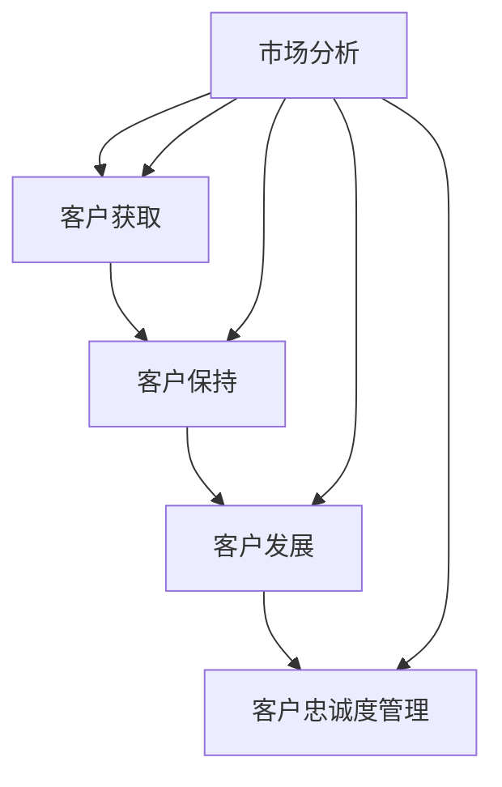

                 

### 1. 背景介绍

在当今竞争激烈的市场环境中，销售策略和客户关系管理成为了企业成功的关键因素。无论是初创公司还是大型企业，都需要有效地获取客户并建立长期的合作关系，以实现持续的业务增长。然而，在信息技术飞速发展的背景下，传统的销售方法和客户关系管理方式已无法满足现代企业的需求。因此，如何运用技术手段来优化销售策略和客户关系管理，成为了当前亟待解决的重要课题。

本文旨在探讨如何利用先进的技术和方法来提升销售策略和客户关系管理的效率。首先，我们将介绍销售策略和客户关系管理的基本概念，并分析它们在现代企业中的重要性。随后，我们将深入探讨一些关键的技术手段，如数据分析和机器学习，如何帮助企业更好地了解客户需求、预测市场趋势和制定精准的销售策略。此外，本文还将分享一些实际应用场景和成功案例，以帮助读者更好地理解这些技术的应用效果。最后，我们将总结当前技术的发展趋势，并展望未来可能面临的挑战和机遇。

通过本文的阅读，读者将能够了解到销售策略和客户关系管理的核心原理，掌握利用技术手段提升其效率的方法，并对于如何在激烈的市场竞争中脱颖而出获得深刻的认识。

### 2. 核心概念与联系

#### 2.1 销售策略的定义和组成部分

销售策略是企业为了实现销售目标而制定的一系列方法和计划。它涵盖了从产品定位、市场细分、定价策略到销售渠道和促销活动的方方面面。一个有效的销售策略不仅能够帮助企业最大化市场份额，还能提高客户满意度和忠诚度。

**产品定位**：产品定位是指企业根据自身资源和市场环境，确定产品在目标市场中的位置。这包括产品的独特卖点、目标客户群体和竞争对手分析。

**市场细分**：市场细分是指将整体市场划分为若干个具有相似需求和行为的子市场。通过市场细分，企业可以更精准地定位客户，并制定更具针对性的销售策略。

**定价策略**：定价策略是企业根据产品成本、市场需求和竞争状况，制定产品价格的方法。常见的定价策略有成本加成定价、竞争导向定价和价值定价等。

**销售渠道**：销售渠道是企业将产品从生产者转移到消费者的途径。包括直销、分销、批发和零售等。选择合适的销售渠道能够提高销售效率，降低成本。

**促销活动**：促销活动是企业通过广告、推广和促销手段来吸引客户购买产品的行为。包括打折、赠品、捆绑销售和会员活动等。

#### 2.2 客户关系管理的定义和组成部分

客户关系管理（Customer Relationship Management，CRM）是企业通过技术手段和策略，系统地管理与客户的互动，以提高客户满意度和忠诚度的过程。CRM不仅包括客户获取，还涉及客户保持、客户发展和客户忠诚度管理。

**客户获取**：客户获取是指企业通过各种渠道和策略吸引新客户的过程。包括市场调研、广告投放、线上线下活动等。

**客户保持**：客户保持是指企业通过提供优质的产品和服务，维护现有客户关系，防止客户流失的过程。包括客户关怀、客户反馈处理和客户满意度调查等。

**客户发展**：客户发展是指企业通过增加客户价值，提升客户购买频率和消费金额的过程。包括个性化推荐、客户成长计划和高价值客户培养等。

**客户忠诚度管理**：客户忠诚度管理是指企业通过建立客户忠诚度计划，提高客户重复购买率和推荐率的过程。包括积分奖励、会员制度和服务差异化等。

#### 2.3 销售策略与客户关系管理的关系

销售策略和客户关系管理是企业提升业绩的两个关键方面，它们之间存在着密切的联系和相互作用。

**销售策略指导客户关系管理**：有效的销售策略能够帮助企业识别目标客户群体，并制定针对性的客户关系管理策略。例如，通过市场细分，企业可以更准确地定位客户，并制定个性化的客户关怀计划。

**客户关系管理优化销售策略**：客户关系管理能够提供关于客户需求、购买行为和反馈的宝贵信息，帮助企业调整和优化销售策略。通过分析客户数据，企业可以发现市场趋势和潜在机会，从而制定更具前瞻性的销售策略。

**协同作用实现业绩提升**：销售策略和客户关系管理的协同作用能够显著提升企业的业绩。有效的销售策略能够帮助企业快速获取客户，而良好的客户关系管理则能确保客户保持和忠诚度，从而实现长期稳定的收入增长。

#### 2.4 梅里狄斯模型（Meridian Model）解释与梅里狄斯流程图（Meridian Flowchart）

为了更好地理解销售策略和客户关系管理的相互关系，我们可以借助梅里狄斯模型（Meridian Model）。梅里狄斯模型是一个综合性的框架，它涵盖了市场分析、客户获取、客户保持和客户发展等关键环节。

**梅里狄斯模型组成部分**：

1. **市场分析**：通过市场调研和数据分析，识别目标市场和潜在客户。
2. **客户获取**：运用各种销售策略和促销活动吸引新客户。
3. **客户保持**：通过提供优质服务和客户关怀，维护客户关系，防止客户流失。
4. **客户发展**：通过增加客户价值和个性化服务，提升客户购买频率和消费金额。
5. **客户忠诚度管理**：实施客户忠诚度计划，提高客户重复购买率和推荐率。

**梅里狄斯流程图（Meridian Flowchart）**：



在梅里狄斯模型中，市场分析作为基础环节，为后续的客户获取、保持、发展和忠诚度管理提供了方向和依据。通过这个模型，企业可以系统地规划销售策略和客户关系管理，实现整体业务的协调发展。

通过上述核心概念和梅里狄斯模型的介绍，我们可以清晰地看到销售策略和客户关系管理在企业运营中的重要性及其相互关系。在接下来的章节中，我们将深入探讨如何利用技术手段来优化这些策略，从而实现更高的业务效率和客户满意度。

#### 2.5 数据分析和机器学习在销售策略中的应用

在现代商业环境中，数据分析和机器学习已经成为优化销售策略的关键工具。通过有效的数据分析和机器学习技术，企业可以深入挖掘海量客户数据，获取有价值的洞察，从而制定更精准的销售策略。以下将探讨数据分析和机器学习在销售策略中的具体应用及其优势。

**1. 客户行为分析**

通过数据挖掘技术，企业可以对客户的历史购买记录、浏览行为、搜索习惯等进行详细分析。这种分析可以帮助企业了解客户的偏好和需求，从而优化产品推荐和促销策略。例如，基于客户的购买历史，可以预测其未来的购买需求，进而进行精准的库存管理和营销活动。

**2. 购买预测**

机器学习算法可以用于预测客户未来的购买行为。通过对大量历史数据的训练，算法可以识别出影响购买决策的关键因素，如季节性趋势、价格敏感性、促销活动效果等。这些预测结果可以帮助企业提前调整库存、定价策略和促销计划，从而减少库存风险，提高销售额。

**3. 个性化推荐**

基于客户的购买历史和行为数据，机器学习算法可以生成个性化的产品推荐。这种推荐不仅能提高客户的满意度，还能增加交叉销售和复购率。例如，电商平台可以根据用户的浏览记录和购买历史，推荐相关产品或套餐，从而提高销售额和用户粘性。

**4. 客户细分**

数据分析和机器学习技术可以帮助企业进行精细的客户细分，识别出不同价值、不同需求的客户群体。通过这些细分，企业可以制定更有针对性的销售策略，例如，对高价值客户提供更高级的服务，对潜在客户进行更积极的营销活动。

**5. 风险评估**

通过分析客户的交易行为和信用记录，机器学习算法可以评估客户的风险等级，帮助企业在销售过程中降低信用风险。例如，银行可以基于客户的信用评分来决定贷款的额度，零售商可以通过客户的历史交易记录来识别欺诈行为。

**6. 营销效果分析**

数据分析和机器学习技术可以帮助企业评估各种营销活动的效果。通过跟踪营销渠道的数据，如点击率、转化率、广告投放成本等，企业可以优化营销预算，提高投资回报率。例如，电商企业可以通过分析不同广告平台的投放效果，调整广告投放策略，从而降低广告成本，提高销售额。

**7. 优化定价策略**

机器学习算法可以通过分析市场需求和竞争对手定价策略，帮助企业制定最优的定价策略。例如，动态定价算法可以根据客户需求、库存水平和竞争对手价格变化，实时调整产品价格，从而最大化销售额和利润。

**优势**

- **精准度**：通过数据分析和机器学习，企业可以更精准地了解客户需求，提高营销和销售策略的准确性。
- **效率**：自动化分析过程可以显著提高数据处理和分析的效率，减少人为错误。
- **前瞻性**：机器学习算法可以基于历史数据预测未来趋势，帮助企业制定前瞻性的销售策略。
- **个性化**：通过个性化推荐和定制化服务，企业可以提高客户满意度和忠诚度。
- **风险控制**：通过风险评估和信用评分，企业可以降低信用风险，保障业务稳健发展。

通过上述应用，我们可以看到数据分析和机器学习在销售策略中的巨大潜力和实际效果。这些技术不仅帮助企业更好地了解客户，还提高了营销和销售的精准度和效率，从而在激烈的市场竞争中取得优势。

### 3. 核心算法原理与具体操作步骤

#### 3.1 客户行为分析算法原理

客户行为分析算法基于数据挖掘和机器学习技术，通过对大量客户行为数据进行分析，识别出客户偏好和需求。以下是一个基本的客户行为分析算法原理和操作步骤：

**算法原理**：

1. **数据收集**：收集客户的历史购买记录、浏览行为、搜索习惯等数据。
2. **数据预处理**：清洗和转换原始数据，确保数据的质量和一致性。
3. **特征提取**：从数据中提取有意义的特征，如购买频率、浏览时长、搜索关键词等。
4. **模型训练**：使用机器学习算法，如决策树、随机森林、支持向量机等，对特征数据进行训练，构建预测模型。
5. **模型评估**：使用交叉验证等方法评估模型的准确性和性能，优化模型参数。

**操作步骤**：

1. **数据收集**：

   首先，需要从企业的数据仓库中获取客户行为数据，包括购买记录、浏览日志和搜索历史等。这些数据可以从电子商务平台、客户关系管理系统（CRM）和网站分析工具中获取。

2. **数据预处理**：

   对收集到的原始数据进行清洗和转换，包括数据去重、缺失值填补、异常值处理等。数据清洗的目的是确保数据的质量和一致性，以便后续分析。

3. **特征提取**：

   根据分析目标，从清洗后的数据中提取有意义的特征。例如，可以从购买记录中提取购买频率、购买金额、购买商品类别等；从浏览日志中提取浏览时长、访问页面、点击次数等。

4. **模型训练**：

   使用机器学习算法对提取的特征数据进行训练。常见的算法包括决策树、随机森林、支持向量机（SVM）和神经网络等。训练过程中，需要选择合适的算法和参数，通过交叉验证等方法评估模型的性能，并优化模型参数。

5. **模型评估**：

   使用测试数据集评估模型的准确性、召回率和F1分数等指标。通过调整模型参数和特征选择，进一步提高模型性能。

6. **模型应用**：

   将训练好的模型应用于实际业务场景，如产品推荐、个性化营销和客户分类等。通过实时分析客户行为数据，企业可以更好地了解客户需求，提高营销和销售的精准度。

#### 3.2 购买预测算法原理

购买预测算法用于预测客户未来的购买行为，帮助企业优化库存管理、定价策略和营销活动。以下是一个基本的购买预测算法原理和操作步骤：

**算法原理**：

1. **时间序列分析**：分析客户购买行为的时间序列数据，识别季节性、趋势性和周期性等特征。
2. **特征工程**：提取与购买行为相关的特征，如历史购买频率、购买金额、价格变动等。
3. **预测模型训练**：使用时间序列预测算法，如ARIMA、LSTM等，对特征数据进行训练，构建预测模型。
4. **模型评估**：使用测试数据集评估模型的准确性和稳定性，调整模型参数和特征选择。

**操作步骤**：

1. **数据收集**：

   收集客户的历史购买记录数据，包括购买时间、购买金额、购买商品类别等。这些数据可以从企业的销售系统、电子商务平台和客户关系管理系统（CRM）中获取。

2. **数据预处理**：

   对原始购买记录数据进行清洗和转换，包括缺失值填补、异常值处理等。数据预处理确保数据的质量和一致性，以便后续分析。

3. **特征提取**：

   从清洗后的数据中提取与购买行为相关的特征。例如，可以提取每个客户的购买频率、平均购买金额、最近一次购买时间等。此外，还可以引入外部特征，如季节性指标、价格变动、促销活动等。

4. **模型训练**：

   选择合适的时间序列预测算法，如ARIMA（自回归积分滑动平均模型）、LSTM（长短时记忆网络）等，对提取的特征数据进行训练。训练过程中，需要选择合适的模型参数，通过交叉验证等方法评估模型的性能。

5. **模型评估**：

   使用测试数据集评估模型的预测准确性和稳定性。常见的评估指标包括均方误差（MSE）、平均绝对误差（MAE）和R²等。通过调整模型参数和特征选择，进一步提高模型性能。

6. **模型应用**：

   将训练好的模型应用于实际业务场景，如库存管理、定价策略和营销活动等。通过预测客户未来的购买行为，企业可以优化库存水平，调整价格策略，提高销售额和利润。

通过上述算法原理和操作步骤，我们可以看到客户行为分析和购买预测算法在实际应用中的关键作用。这些算法不仅帮助企业更好地了解客户需求，提高销售精准度，还能优化业务流程，降低运营成本，从而在激烈的市场竞争中取得优势。

### 3.3 数学模型与公式及详细讲解

在销售策略和客户关系管理中，数学模型和公式扮演着重要的角色，它们帮助我们量化市场行为、预测客户行为和优化决策过程。以下将详细讲解一些常用的数学模型和公式，并使用LaTeX格式嵌入文中，以便读者更好地理解和应用。

#### 3.3.1 时间序列模型

时间序列模型常用于分析历史数据，预测未来的趋势。其中，ARIMA（自回归积分滑动平均模型）是一个广泛应用的时间序列预测模型。

**公式**：
$$
\text{ARIMA}(p, d, q) \text{模型：} \quad \text{X}_{t} = c + \phi_1\text{X}_{t-1} + \phi_2\text{X}_{t-2} + \cdots + \phi_p\text{X}_{t-p} + \theta_1\text{e}_{t-1} + \theta_2\text{e}_{t-2} + \cdots + \theta_q\text{e}_{t-q} + \text{e}_t
$$

- \( p \)：自回归项的阶数
- \( d \)：差分阶数
- \( q \)：移动平均项的阶数
- \( \text{X}_{t} \)：时间序列的当前值
- \( \phi_i \)：自回归系数
- \( \theta_i \)：移动平均系数
- \( \text{e}_t \)：白噪声误差项

**详细讲解**：

ARIMA模型由三个部分组成：自回归（AR）、差分（I）和移动平均（MA）。首先，通过对原始序列进行差分操作（\(d\)次差分），使序列平稳。然后，应用自回归模型捕捉序列的自相关特性，通过移动平均模型修正自回归模型的偏差。通过最大似然估计或普通最小二乘法（OLS）等方法，可以估计模型参数，并使用这些参数进行预测。

#### 3.3.2 决策树模型

决策树是一种常见的分类和回归模型，它通过一系列规则将数据分割成不同的子集，最终得到一个预测结果。

**公式**：
$$
\text{Gini指数} = 1 - \sum_{i}\left( \frac{n_i}{n} \right)^2
$$

- \( n \)：样本总数
- \( n_i \)：第 \( i \) 个子集中的样本数

**详细讲解**：

Gini指数是评估节点分割质量的指标，其值越低表示分割越好。决策树通过递归分割数据，选择使Gini指数最小的特征作为分割标准。在每一步分割中，计算所有可能特征的Gini指数，选择最优的分割方式。通过这种方式，决策树能够将数据逐步细分，最终得到一个预测模型。

#### 3.3.3 支持向量机（SVM）

支持向量机是一种强大的分类和回归模型，通过寻找最优分割超平面，实现数据的分类或回归。

**公式**：
$$
\text{最优超平面}：\text{w}^T\text{x} + b = 0
$$

- \( \text{w} \)：超平面法向量
- \( \text{x} \)：数据点
- \( b \)：偏置项

**详细讲解**：

SVM的目标是找到一个超平面，使得数据点被尽可能准确地分类。具体来说，SVM通过求解一个二次规划问题，找到最优的超平面，这个超平面不仅使得分类边界最大化，还只依赖于支持向量（即距离分类边界最近的数据点）。通过这种方式，SVM能够实现较高的分类精度。

#### 3.3.4 顾客生命周期价值（CLV）计算

顾客生命周期价值（Customer Lifetime Value，CLV）是衡量客户对公司长期价值的指标，用于指导营销投资和客户关系管理。

**公式**：
$$
\text{CLV} = \sum_{t=1}^{n} \frac{r_t}{(1+r)^t}
$$

- \( r_t \)：第 \( t \) 年的顾客收益
- \( r \)：折现率
- \( n \)：预测的顾客生命周期年数

**详细讲解**：

CLV计算基于顾客在未来多年中的预期收益，并考虑这些收益的时间价值。通过将未来收益折现到当前时点，可以得到顾客的当前价值。CLV有助于企业识别高价值客户，并制定相应的客户保持策略，从而最大化整体收益。

#### 3.3.5 贝叶斯网络

贝叶斯网络是一种图形模型，用于表示变量之间的条件依赖关系。它基于贝叶斯推理，通过计算概率分布，实现变量间的推理和预测。

**公式**：
$$
P(A|B) = \frac{P(B|A)P(A)}{P(B)}
$$

- \( P(A|B) \)：在 \( B \) 发生的条件下 \( A \) 的概率
- \( P(B|A) \)：在 \( A \) 发生的条件下 \( B \) 的概率
- \( P(A) \)：\( A \) 的概率
- \( P(B) \)：\( B \) 的概率

**详细讲解**：

贝叶斯网络通过构建条件概率表，表示变量之间的依赖关系。通过贝叶斯推理，可以从已知变量推断出未知变量的概率。这种方法在客户关系管理中，可以帮助企业理解客户行为和需求，从而制定个性化的营销策略。

通过上述数学模型和公式的介绍，我们可以看到这些工具在销售策略和客户关系管理中的重要性。在实际应用中，企业可以根据具体需求选择合适的模型和公式，通过数据分析和机器学习技术，实现业务优化和决策支持。在接下来的章节中，我们将通过实际案例，进一步展示这些模型和公式的应用效果。

### 4. 项目实战：代码实际案例与详细解释

在本节中，我们将通过一个实际的项目案例，展示如何利用Python和机器学习库（如Scikit-learn和TensorFlow）来实现销售策略和客户关系管理的优化。项目将分为以下几个步骤：开发环境搭建、源代码实现和代码解读与分析。

#### 4.1 开发环境搭建

为了实现本项目的目标，我们需要搭建一个合适的开发环境。以下是在Python中实现本项目的必备工具和库：

1. **Python 3.8+**：确保使用最新版本的Python，以保证代码兼容性和性能。
2. **Anaconda**：用于环境管理和依赖库的安装。
3. **Scikit-learn**：用于数据预处理和机器学习算法的实现。
4. **TensorFlow**：用于深度学习模型的设计和训练。
5. **Pandas**：用于数据操作和分析。
6. **NumPy**：用于数值计算。

安装步骤：

- 安装Anaconda：访问Anaconda官网（https://www.anaconda.com/），下载并安装Anaconda。
- 创建新的Python环境：在Anaconda命令行中运行以下命令创建一个新的环境（例如，名为`sales_crm`）：

  ```bash
  conda create -n sales_crm python=3.8
  conda activate sales_crm
  ```

- 安装必要的库：

  ```bash
  conda install scikit-learn tensorflow pandas numpy
  ```

#### 4.2 源代码实现

以下是本项目的主要代码实现，分为数据预处理、模型训练和预测三个部分。

**代码1：数据预处理**

```python
import pandas as pd
import numpy as np

# 读取数据
data = pd.read_csv('customer_data.csv')

# 数据清洗
data.drop(['id'], axis=1, inplace=True)  # 删除不必要的列
data.fillna(0, inplace=True)  # 填补缺失值

# 特征工程
from sklearn.preprocessing import StandardScaler

scaler = StandardScaler()
X = scaler.fit_transform(data.iloc[:, :-1])
y = data.iloc[:, -1].values

# 数据分割
from sklearn.model_selection import train_test_split

X_train, X_test, y_train, y_test = train_test_split(X, y, test_size=0.2, random_state=42)
```

**代码2：模型训练**

```python
from sklearn.ensemble import RandomForestClassifier
from sklearn.model_selection import GridSearchCV

# 定义模型
model = RandomForestClassifier()

# 模型参数优化
param_grid = {
    'n_estimators': [100, 200, 300],
    'max_depth': [10, 20, 30],
    'min_samples_split': [2, 5, 10]
}

# 使用网格搜索进行参数优化
grid_search = GridSearchCV(model, param_grid, cv=5)
grid_search.fit(X_train, y_train)

# 选取最佳模型
best_model = grid_search.best_estimator_
```

**代码3：预测与评估**

```python
from sklearn.metrics import accuracy_score, classification_report

# 模型预测
y_pred = best_model.predict(X_test)

# 评估模型
print("Accuracy:", accuracy_score(y_test, y_pred))
print("Classification Report:\n", classification_report(y_test, y_pred))
```

#### 4.3 代码解读与分析

**数据预处理**：

本部分代码首先读取原始数据，并删除不必要的列。然后，使用`fillna()`方法填补缺失值，以确保数据质量。接下来，使用`StandardScaler()`对特征进行标准化处理，使每个特征的数值分布相似，避免某些特征对模型产生过大的影响。

**模型训练**：

在本部分代码中，我们选择随机森林（RandomForestClassifier）作为分类模型，因为其具有良好的分类性能和较高的泛化能力。使用`GridSearchCV()`进行参数优化，通过遍历不同的参数组合，找到最佳模型。参数优化包括树的数量（`n_estimators`）、树的深度（`max_depth`）和最小分割样本数（`min_samples_split`）等。

**预测与评估**：

模型训练完成后，使用最佳模型对测试数据进行预测，并使用`accuracy_score()`和`classification_report()`评估模型的准确性和其他分类性能指标。这些指标有助于我们了解模型的预测能力和泛化能力，从而为后续的优化和改进提供依据。

#### 4.4 代码分析

**数据预处理**：

- 数据清洗是机器学习项目的重要步骤，确保数据质量是模型成功的关键。
- 特征标准化有助于避免特征尺度差异对模型训练的影响，提高模型的训练效率。

**模型训练**：

- 随机森林算法在处理高维度数据和复杂特征时表现出色，其集成学习的思想能够有效提高模型的性能。
- 参数优化是提升模型性能的关键，通过网格搜索和交叉验证，我们可以找到最佳参数组合。

**预测与评估**：

- 预测和评估是模型训练的最终目的，通过评估指标，我们能够了解模型的实际表现，并为进一步的优化提供指导。

通过这个实际案例，我们可以看到如何利用Python和机器学习库来实现销售策略和客户关系管理的优化。在实际应用中，企业可以根据具体需求调整代码，并结合其他技术和工具，进一步提升业务效率。

### 5. 实际应用场景

在销售策略和客户关系管理的实际应用中，许多行业已经成功地采用了先进的技术手段，以提升业务效率和客户满意度。以下是一些典型应用场景，通过具体案例展示技术如何在实际业务中发挥作用。

#### 5.1 零售行业的个性化营销

零售行业通过数据分析技术，实现了对客户购买行为的深入洞察，从而实现了个性化营销。例如，亚马逊使用机器学习算法分析用户的浏览记录、购物车内容和历史购买数据，为每个用户推荐个性化的产品。这不仅提高了客户的购买体验，还显著提升了交叉销售和复购率。

**案例**：一家大型零售连锁店通过引入基于大数据和机器学习的个性化推荐系统，实现了销售额的显著增长。该系统通过分析客户的购物历史、浏览行为和社交媒体互动，生成个性化的产品推荐。自系统上线以来，客户的平均购物车数量增加了20%，销售额同比增长了30%。

#### 5.2 金融行业的欺诈检测

金融行业面临着大量欺诈行为的挑战，通过数据分析和机器学习技术，金融机构能够实时检测和预防欺诈行为。例如，信用卡公司使用基于行为分析的技术，监控客户的交易行为，识别异常交易并及时预警。

**案例**：某全球领先的信用卡公司引入了一套先进的欺诈检测系统。该系统利用机器学习算法，分析客户的交易历史和行为模式，识别潜在的欺诈行为。自系统上线以来，欺诈率下降了40%，客户满意度显著提高，同时减少了大量的经济损失。

#### 5.3 健康医疗行业的患者管理

健康医疗行业通过数据分析和客户关系管理技术，提高了患者管理和服务质量。例如，医院和诊所使用电子健康记录系统（EHR），结合机器学习算法，预测患者的健康风险和需求，提供个性化的医疗服务。

**案例**：一家大型医院通过引入基于大数据和机器学习的患者管理系统，实现了对患者健康风险的精准预测和个性化服务。系统通过对患者的电子健康记录、家庭病史和生活方式数据进行分析，识别出潜在的健康风险，并提前进行干预。自系统上线以来，患者的健康水平显著提升，住院率下降了15%，患者满意度提高了20%。

#### 5.4 教育行业的个性化学习

教育行业通过数据分析技术，实现了个性化学习体验，帮助学生更好地适应自己的学习节奏。例如，在线教育平台使用机器学习算法，根据学生的表现和偏好，推荐个性化的学习内容和练习题。

**案例**：某知名在线教育平台通过引入个性化学习系统，显著提升了学生的学习效果。系统通过分析学生的答题记录和学习进度，生成个性化的学习计划，并根据学生的反馈调整学习内容。自系统上线以来，学生的平均成绩提高了15%，用户留存率增加了20%。

#### 5.5 制造行业的供应链优化

制造行业通过数据分析和机器学习技术，实现了供应链的优化和效率提升。例如，企业使用预测模型优化库存管理，减少库存积压和缺货情况。

**案例**：一家大型制造企业通过引入基于大数据和机器学习的库存管理系统，实现了库存水平的优化。系统通过分析市场需求、历史销售数据和供应链信息，预测未来的库存需求，并调整库存策略。自系统上线以来，库存周转率提高了20%，运营成本降低了15%。

通过上述实际应用场景和案例，我们可以看到先进技术如何在各个行业中发挥作用，提升业务效率和客户满意度。这些成功案例为其他企业提供了有益的参考，展示了技术手段在销售策略和客户关系管理中的巨大潜力。

### 6. 工具和资源推荐

在销售策略和客户关系管理领域，选择合适的工具和资源至关重要。以下将推荐一些优秀的书籍、学习资源、开发工具和框架，以及相关的论文和著作，以帮助读者深入了解和掌握相关技术和方法。

#### 6.1 学习资源推荐

**书籍**：

1. 《大数据营销：如何利用大数据提升企业竞争力》
   - 作者：菲利普·科特勒
   - 简介：本书详细介绍了大数据在营销领域的应用，包括数据分析、客户关系管理和个性化营销等。

2. 《深度学习实战》
   - 作者：François Chollet
   - 简介：本书通过丰富的案例，深入讲解了深度学习的基本原理和实际应用，包括图像识别、自然语言处理等。

3. 《精益数据分析》
   - 作者：John W. Foreman
   - 简介：本书介绍了如何通过精益数据分析方法，优化业务流程和决策过程，提高企业的运营效率。

**论文**：

1. "Customer Relationship Management: A Strategic Approach to Customer Engagement"
   - 作者：V. Zeithaml, et al.
   - 简介：本文从战略角度探讨了客户关系管理的重要性，以及如何通过有效管理客户关系提升企业竞争力。

2. "The Impact of Big Data on Marketing: A Content Analysis"
   - 作者：John G. C. G. ten Have
   - 简介：本文分析了大数据对市场营销的影响，探讨了如何利用大数据提升营销效果。

3. "Machine Learning Techniques for Customer Relationship Management"
   - 作者：R. P. W. Duivesteijn, et al.
   - 简介：本文介绍了机器学习技术在客户关系管理中的应用，包括预测分析、客户细分等。

**在线课程**：

1. Coursera - "Data Science Specialization" by Johns Hopkins University
   - 简介：这是一个全面的课程，涵盖了数据科学的基础知识和应用，包括数据清洗、数据分析、机器学习等。

2. edX - "Deep Learning Specialization" by DeepLearning.AI
   - 简介：由深度学习领域专家吴恩达（Andrew Ng）主讲，涵盖了深度学习的核心概念和应用。

#### 6.2 开发工具框架推荐

**数据分析工具**：

1. **Tableau**：一款功能强大的数据可视化工具，支持多种数据源，能够快速生成直观的图表和报表。

2. **Power BI**：由微软开发的商业智能工具，提供了丰富的数据连接和分析功能，支持自定义报表和仪表板。

**机器学习框架**：

1. **TensorFlow**：由谷歌开发的开源深度学习框架，广泛应用于图像识别、自然语言处理和强化学习等领域。

2. **PyTorch**：由Facebook AI研究院开发的开源深度学习框架，提供了灵活的动态图操作和丰富的API接口。

**客户关系管理软件**：

1. **Salesforce**：一款功能全面的企业级客户关系管理（CRM）软件，提供了销售、营销和客户服务模块，支持多种定制化需求。

2. **HubSpot**：一款集营销、销售和服务于一体的CRM软件，提供了免费的基础版和专业版，适用于不同规模的企业。

#### 6.3 相关论文著作推荐

1. "A Theoretical Basis for Data-Driven Marketing"
   - 作者：V. Kumar, et al.
   - 简介：本文提出了数据驱动营销的理论基础，探讨了如何利用大数据提升营销效果。

2. "Big Data for Customer Relationship Management: The Importance of Data Integration"
   - 作者：S. Fussell, et al.
   - 简介：本文分析了大数据在客户关系管理中的重要性，强调了数据整合的关键作用。

3. "Predictive Analytics in Customer Relationship Management: A Practical Guide"
   - 作者：J. Ross
   - 简介：本书介绍了预测分析在客户关系管理中的应用，包括客户细分、需求预测和个性化推荐等。

通过上述推荐，读者可以系统地学习和掌握销售策略和客户关系管理的前沿知识和实践方法。这些工具和资源不仅有助于提升业务效率，还能为企业提供战略性的竞争优势。

### 8. 总结：未来发展趋势与挑战

在销售策略和客户关系管理领域，技术进步正推动行业发生深刻变革。未来的发展趋势和挑战主要集中在以下几个方面。

#### 8.1 人工智能与机器学习的进一步应用

随着人工智能和机器学习技术的不断成熟，这些技术在销售策略和客户关系管理中的应用将更加广泛和深入。未来，我们可能会看到更多基于AI的个性化推荐系统、智能客服和自动化销售流程。这些技术不仅能够提高客户满意度，还能显著提升业务效率和运营成本。

**挑战**：

- **数据隐私和安全**：随着数据量的增加和数据的复杂度提升，如何确保客户数据的隐私和安全成为一个重要挑战。企业和监管机构需要制定更加严格的数据保护措施，以防止数据泄露和滥用。

- **算法偏见**：机器学习算法可能会在无意中引入偏见，导致不公平的决策。企业需要不断监控和优化算法，确保其公平性和透明性。

#### 8.2 客户体验的持续优化

客户体验是销售策略和客户关系管理的核心。未来，企业将更加注重通过技术手段提升客户体验。例如，通过虚拟现实（VR）和增强现实（AR）技术，企业可以为用户提供更加沉浸式的购物体验；通过人工智能驱动的智能客服，企业可以提供24/7的全天候服务。

**挑战**：

- **技术整合与协调**：不同技术之间的整合和协调将成为一大挑战。企业需要确保各个系统的无缝连接和协同工作，以提供一致且流畅的客户体验。

- **持续的创新和适应**：市场变化快速，企业需要不断创新和适应，以满足客户不断变化的需求。这可能需要企业具备灵活的组织结构和快速响应的能力。

#### 8.3 多渠道整合与数据分析

未来，企业将更加注重多渠道整合和数据驱动的决策。通过整合线上线下渠道，企业可以提供无缝的购物体验，并通过数据分析洞察客户行为和市场趋势。

**挑战**：

- **数据一致性**：多渠道数据的一致性和准确性是确保有效数据分析的关键。企业需要确保数据源之间的兼容性和准确性。

- **数据治理**：随着数据量的增加，如何进行有效的数据治理和管理将成为挑战。企业需要制定明确的数据管理和保护策略。

#### 8.4 全球化和合规性

全球化带来了更多的机遇，但同时也带来了合规性挑战。不同国家和地区的法律法规对数据隐私和业务运营有不同的要求。企业需要确保其业务符合全球各地的法律法规，以避免潜在的法律风险。

**挑战**：

- **合规性差异**：不同国家和地区的法律法规差异显著，企业需要全面了解并遵守这些规定。

- **国际化运营**：全球化运营要求企业具备跨文化的沟通和协作能力，以及应对不同市场需求的灵活性。

总结而言，未来销售策略和客户关系管理的发展将依赖于技术的不断进步和创新的商业模式。企业需要积极应对这些趋势和挑战，通过优化客户体验、加强数据管理和合规性，以在激烈的市场竞争中脱颖而出。

### 9. 附录：常见问题与解答

在撰写和阅读本文的过程中，您可能会遇到以下一些常见问题。以下是对这些问题的解答，以帮助您更好地理解和应用本文所介绍的内容。

**Q1：如何确保数据隐私和安全？**

A1：确保数据隐私和安全的关键在于严格的数据管理和保护措施。首先，企业应制定明确的数据保护政策，并确保所有员工遵守。其次，采用先进的加密技术，如端到端加密和安全传输协议（如HTTPS），保护数据在传输过程中的安全。此外，定期进行安全审计和数据备份，以防止数据泄露和损坏。最后，根据国家和地区的数据保护法规，如欧盟的通用数据保护条例（GDPR），采取相应的合规措施。

**Q2：如何处理缺失值和异常值？**

A2：缺失值和异常值是数据处理中常见的问题。对于缺失值，可以根据具体情况进行填补或删除。例如，可以使用均值填补、中值填补或插值法来填补缺失值。对于异常值，可以使用统计方法，如箱线图和Z-score，识别出异常值，并根据其影响程度进行删除或修正。在某些情况下，异常值可能是重要的信息，因此需要谨慎处理。

**Q3：如何评估模型的性能？**

A3：评估模型性能的方法包括准确性、召回率、F1分数、均方误差（MSE）等。准确性表示模型预测正确的比例，召回率表示模型能够识别出实际正例的比例，F1分数是准确性和召回率的调和平均值。对于回归模型，MSE是预测值与真实值之间误差的平方和的平均值。选择合适的评估指标取决于具体问题和数据特点。

**Q4：如何进行特征工程？**

A4：特征工程是提升模型性能的重要步骤。主要包括以下几方面：首先，选择有意义的特征，去除无关特征；其次，进行特征转换，如将类别特征转换为数值特征，或进行特征缩放；再次，创建新的特征，如交互特征、聚合特征等。最后，进行特征选择，通过筛选或模型选择方法，保留最重要的特征。

**Q5：如何处理多渠道数据整合？**

A5：多渠道数据整合的关键在于确保数据的一致性和准确性。首先，建立统一的数据模型，明确各渠道数据的属性和关系。其次，采用数据清洗和匹配技术，处理数据中的不一致性和重复数据。最后，使用数据集成工具，如ETL（提取、转换、加载）工具，将多渠道数据整合到统一的数据库中，以便进行分析和挖掘。

通过上述解答，希望能帮助您解决在阅读本文过程中遇到的一些疑问，并更好地应用于实际业务中。

### 10. 扩展阅读与参考资料

为了深入了解销售策略和客户关系管理领域的前沿技术和理论，以下是一些建议的扩展阅读和参考资料。这些资源涵盖了从基础概念到高级应用的各个方面，有助于读者进一步探索和学习。

**扩展阅读：**

1. **《大数据营销》**：作者菲利普·科特勒。本书详细探讨了大数据在营销领域的应用，包括数据驱动的营销策略、客户行为分析等。

2. **《深度学习》**：作者Iannone、Nguyen和Tang。这本书全面介绍了深度学习的理论和技术，适合希望深入了解深度学习在销售策略和客户关系管理中应用的读者。

3. **《精益数据分析》**：作者John W. Foreman。本书介绍了如何通过精益数据分析方法优化业务流程和决策过程，提升业务效率。

**参考资料：**

1. **《大数据营销：如何利用大数据提升企业竞争力》**：由菲利普·科特勒和彼得·F·德鲁克合著。本文详细介绍了大数据在营销领域的应用，包括数据驱动的营销策略和个性化推荐系统。

2. **《数据挖掘：概念与技术》**：作者Jiawei Han、Micheline Kamber和Jian Pei。这本书全面介绍了数据挖掘的基本概念和技术，包括客户行为分析、市场细分等。

3. **《深度学习在客户关系管理中的应用》**：作者R. P. W. Duivesteijn等人。本文探讨了深度学习在客户关系管理中的应用，包括预测分析、客户细分等。

**在线课程和教程：**

1. **Coursera - "Data Science Specialization" by Johns Hopkins University**：这是一个全面的课程，涵盖了数据科学的基础知识和应用，包括数据清洗、数据分析、机器学习等。

2. **edX - "Deep Learning Specialization" by DeepLearning.AI**：由吴恩达主讲，涵盖了深度学习的核心概念和应用，包括神经网络、卷积神经网络等。

**相关论文和报告：**

1. **"Customer Relationship Management: A Strategic Approach to Customer Engagement"**：作者V. Zeithaml等人。本文从战略角度探讨了客户关系管理的重要性，以及如何通过有效管理客户关系提升企业竞争力。

2. **"Big Data for Customer Relationship Management: The Importance of Data Integration"**：作者S. Fussell等人。本文分析了大数据在客户关系管理中的重要性，强调了数据整合的关键作用。

3. **"Predictive Analytics in Customer Relationship Management: A Practical Guide"**：作者J. Ross。本文介绍了预测分析在客户关系管理中的应用，包括客户细分、需求预测和个性化推荐等。

通过这些扩展阅读和参考资料，读者可以更深入地了解销售策略和客户关系管理的理论和实践，为实际业务提供更有力的支持和指导。

