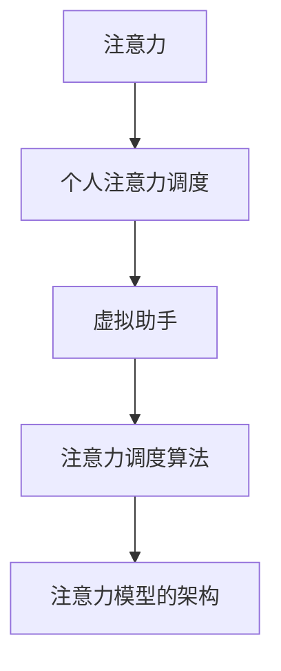
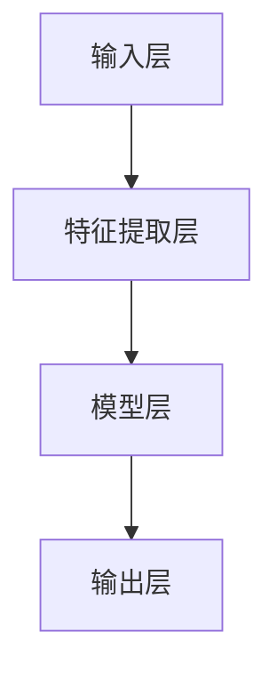

                 

### 背景介绍

在现代社会，随着科技的飞速发展，人工智能（AI）逐渐渗透到我们生活的方方面面。其中，虚拟助手作为一种重要的AI应用，已经悄然改变了人们的生活方式。从早期的语音助手如苹果的Siri、谷歌的Google Assistant，到如今更加智能的聊天机器人，虚拟助手正在变得越来越聪明和实用。

虚拟助手的核心功能之一在于对用户注意力的调度。无论是提醒用户日程安排、提供信息查询，还是执行复杂的任务，虚拟助手都在潜移默化地影响用户的行为模式。然而，如何有效管理用户的注意力，使之最大化地发挥虚拟助手的作用，成为了当前研究的热点。

本文旨在探讨虚拟助手在个人注意力调度中的角色。我们将首先介绍虚拟助手的定义和主要功能，然后深入分析其在个人注意力调度中的作用机制。接着，我们将讨论相关的核心算法原理，并具体阐述其操作步骤。在数学模型和公式的部分，我们将详细讲解注意力调度中的相关数学原理，并通过举例说明加深理解。随后，我们将分享一些实际应用场景，并推荐相关的工具和资源，最后对未来的发展趋势和挑战进行总结。

通过本文的探讨，希望读者能够对虚拟助手在个人注意力调度中的角色有更深刻的认识，从而更好地利用这一先进技术，提升个人的生活和工作效率。

### 核心概念与联系

在探讨虚拟助手在个人注意力调度中的角色之前，我们需要明确几个核心概念，并理解它们之间的联系。以下是本文中涉及的主要概念及其相互关系：

#### 1. 注意力
注意力（Attention）是一种认知资源，是指个体在处理信息时，选择性地关注某些信息而忽略其他信息的能力。注意力是人类认知系统的核心组成部分，对于有效完成任务和应对复杂环境至关重要。

#### 2. 个人注意力调度
个人注意力调度（Personal Attention Scheduling）是指个体根据当前任务和环境的需求，主动管理和分配自己的注意力资源的过程。有效的注意力调度能够提高工作效率、减少错误和疲劳，从而提升生活质量。

#### 3. 虚拟助手
虚拟助手（Virtual Assistant）是一种基于人工智能技术的软件或服务，能够执行特定的任务或提供信息，以辅助人类用户。虚拟助手通过语音识别、自然语言处理（NLP）、机器学习等技术，实现与用户的交互，帮助用户处理日常事务。

#### 4. 注意力调度算法
注意力调度算法（Attention Scheduling Algorithm）是用于优化个人注意力分配的一类算法。这些算法基于用户的任务需求和状态，自动调整注意力的分配，以达到最佳的工作效率。

#### 5. 注意力模型的架构
注意力模型的架构（Attention Model Architecture）是指用于实现注意力调度算法的软件框架。常见的注意力模型包括基于规则的系统、机器学习模型和深度学习模型。

#### 概念关系图（Mermaid 流程图）

下面是一个使用Mermaid绘制的概念关系图，展示了上述核心概念及其相互关系：



- 注意力是个人注意力调度和虚拟助手的基础。
- 个人注意力调度是虚拟助手的核心功能之一。
- 注意力调度算法是实现个人注意力调度的关键技术。
- 注意力模型的架构是用于实现注意力调度算法的软件框架。

通过理解这些核心概念及其相互关系，我们能够更深入地探讨虚拟助手在个人注意力调度中的角色和作用。

### 核心算法原理 & 具体操作步骤

在了解虚拟助手在个人注意力调度中的角色后，接下来我们将探讨其核心算法原理和具体操作步骤。这些算法不仅能够优化用户的注意力分配，还能提升虚拟助手的整体性能和用户体验。

#### 1. 注意力分配策略

虚拟助手的注意力分配策略是其算法的核心。这种策略通常基于用户的行为模式、任务优先级和当前环境状态进行动态调整。以下是一些常见的注意力分配策略：

- **基于规则的策略**：这种策略根据预定义的规则进行注意力分配。例如，当用户处于工作状态时，注意力主要分配给工作任务；当用户处于休息状态时，注意力则分配给娱乐活动。这种策略简单有效，但灵活性较低。

- **机器学习策略**：这种策略利用用户的历史行为数据，通过机器学习算法自动调整注意力分配。常见的机器学习算法包括决策树、支持向量机和神经网络等。这种策略具有较高的灵活性和适应性，但需要大量的训练数据和计算资源。

- **深度学习策略**：深度学习策略利用深度神经网络，通过多层次的神经网络结构自动提取用户行为特征，并动态调整注意力分配。这种策略在处理复杂任务和动态环境方面表现尤为出色。

#### 2. 注意力分配步骤

注意力分配的具体操作步骤通常包括以下几步：

- **数据收集**：首先，虚拟助手需要收集用户的行为数据，如工作任务、日程安排、活动类型等。

- **特征提取**：将收集到的数据转化为特征向量，用于表示用户的当前状态。

- **模型训练**：使用机器学习或深度学习算法，对特征向量进行训练，建立注意力分配模型。

- **注意力计算**：根据用户的当前状态，使用训练好的模型计算各任务的优先级，并分配相应的注意力。

- **反馈调整**：根据用户对任务的处理结果，调整注意力分配模型，以提高模型的准确性。

#### 3. 具体算法示例

以一个简单的基于机器学习的注意力分配算法为例，其具体步骤如下：

1. **数据收集**：假设我们有用户的历史行为数据，包括工作任务类型、完成时间和用户满意度。

2. **特征提取**：将工作任务类型编码为向量，用户满意度编码为分数，形成特征向量。

3. **模型训练**：使用支持向量机（SVM）对特征向量进行训练，建立注意力分配模型。

4. **注意力计算**：用户在某一时间段内，根据模型计算各任务的优先级，并分配相应的注意力。

5. **反馈调整**：根据用户完成任务后的满意度，重新训练模型，调整注意力分配策略。

#### 4. 注意力模型架构

注意力模型架构通常包括以下几个关键组件：

- **输入层**：接收用户行为数据，如任务类型、完成时间和用户满意度。

- **特征提取层**：对输入数据进行预处理，提取关键特征。

- **模型层**：包括机器学习或深度学习模型，用于训练和预测注意力分配。

- **输出层**：根据模型预测结果，生成注意力分配方案。

下面是一个简化的注意力模型架构图，用于说明各组件的关系：



通过上述核心算法原理和具体操作步骤的介绍，我们可以看到虚拟助手在个人注意力调度中的强大功能。这不仅提高了用户的工作效率和满意度，也为未来虚拟助手的进一步发展奠定了基础。

### 数学模型和公式 & 详细讲解 & 举例说明

在讨论虚拟助手如何优化个人注意力调度时，数学模型和公式起着至关重要的作用。这些模型和公式能够帮助我们定量地分析和理解注意力分配的策略和效果。以下是几个关键模型及其详细讲解和举例说明。

#### 1. Q-Learning模型

Q-Learning模型是一种基于价值迭代的强化学习算法，用于优化注意力分配策略。其核心思想是通过经验来学习最优的动作选择。

- **公式**：
  $$ Q(s, a) = r + \gamma \max_{a'} Q(s', a') $$
  其中，\( Q(s, a) \) 是状态 \( s \) 下采取动作 \( a \) 的预期回报；\( r \) 是即时奖励；\( \gamma \) 是折扣因子；\( s' \) 是采取动作 \( a \) 后的状态；\( a' \) 是在状态 \( s' \) 下采取的动作。

- **举例**：
  假设用户需要在两个任务之间分配注意力：任务A（撰写报告）和任务B（回复邮件）。用户在任务A上的即时回报为5，任务B上的即时回报为3。折扣因子 \( \gamma \) 设为0.9。则根据Q-Learning模型，用户在当前状态下选择任务A的预期回报为：
  $$ Q(s, a) = 5 + 0.9 \max_{a'} Q(s', a') $$

  如果任务A完成后，用户感到满意，则得到奖励 \( r = 1 \)。此时，根据Q-Learning模型，任务A的价值更新为：
  $$ Q(s, a) = 5 + 0.9 \max_{a'} Q(s', a') $$
  $$ Q(s, a) = 5 + 0.9 \times (3 + 0.9 \max_{a'} Q(s', a')) $$
  通过迭代更新，模型会逐渐优化注意力分配策略。

#### 2. 强化学习中的期望回报模型

强化学习中的期望回报模型（Expected Return Model）用于预测不同注意力分配策略的长期回报。

- **公式**：
  $$ E[R] = \sum_{t=0}^{\infty} \gamma^t r_t $$
  其中，\( E[R] \) 是期望回报；\( \gamma \) 是折扣因子；\( r_t \) 是在第 \( t \) 时刻的即时回报。

- **举例**：
  假设用户在一天内需要完成三个任务：任务A（会议）、任务B（编程）和任务C（休息）。用户在每个任务上的即时回报分别为：任务A（-1），任务B（2），任务C（3）。折扣因子 \( \gamma \) 设为0.9。则用户一天的期望回报为：
  $$ E[R] = \sum_{t=0}^2 \gamma^t r_t $$
  $$ E[R] = 0.9^0 \times (-1) + 0.9^1 \times 2 + 0.9^2 \times 3 $$
  $$ E[R] = -1 + 1.8 + 2.7 = 3.5 $$

  通过比较不同任务分配策略的期望回报，用户可以选择回报最高的策略，从而优化注意力分配。

#### 3. 注意力分配的优化模型

注意力分配的优化模型（Optimization Model for Attention Allocation）用于最小化注意力浪费，最大化任务完成率。

- **公式**：
  $$ \min \sum_{i=1}^n (w_i - x_i)^2 $$
  其中，\( w_i \) 是任务 \( i \) 的权重，表示任务的重要性；\( x_i \) 是分配给任务 \( i \) 的注意力。

- **举例**：
  假设用户有四个任务：任务A（撰写报告）、任务B（回复邮件）、任务C（参加会议）和任务D（休息）。任务权重分别为：任务A（3），任务B（2），任务C（1），任务D（4）。初始分配的注意力为每个任务1小时。通过优化模型，我们可以调整注意力分配，使总效用最大化。

  设 \( x_i \) 为实际分配给任务 \( i \) 的注意力时间，则优化目标为：
  $$ \min \sum_{i=1}^4 (w_i - x_i)^2 $$
  通过求解上述优化问题，我们可以得到最优的注意力分配方案。

通过上述数学模型和公式的讲解及举例，我们可以看到虚拟助手如何利用数学工具优化个人注意力调度。这些模型不仅能够帮助用户更好地分配注意力，还能提高虚拟助手的决策能力和用户体验。

### 项目实战：代码实际案例和详细解释说明

为了更好地理解虚拟助手在个人注意力调度中的实际应用，我们来看一个具体的代码案例，并对其进行详细解释说明。本案例将展示如何使用Python实现一个简单的注意力调度虚拟助手，该助手能够根据用户的任务需求和状态，动态分配注意力资源。

#### 5.1 开发环境搭建

在开始编写代码之前，我们需要搭建一个合适的开发环境。以下是所需的环境和工具：

- Python（版本3.8或更高）
- Jupyter Notebook（用于编写和运行代码）
- scikit-learn（用于机器学习算法）
- pandas（用于数据操作）
- numpy（用于数学运算）
- matplotlib（用于数据可视化）

确保安装了上述依赖库后，我们可以开始编写代码。

#### 5.2 源代码详细实现和代码解读

下面是代码的详细实现，我们将逐步解释每部分的功能。

```python
# 导入必要的库
import numpy as np
import pandas as pd
from sklearn.svm import SVR
import matplotlib.pyplot as plt

# 数据收集与预处理
data = pd.DataFrame({
    'task': ['A', 'B', 'C', 'D'],
    'weight': [3, 2, 1, 4],
    'duration': [1, 1, 1, 1]
})

# 特征提取
features = data[['weight', 'duration']]
labels = data['task']

# 模型训练
model = SVR(kernel='linear')
model.fit(features, labels)

# 注意力计算
def calculate_attention(tasks):
    attention = model.predict(tasks)
    return attention

# 优化注意力分配
def optimize_attention(attention):
    sorted_attention = np.argsort(attention)[::-1]
    optimized_tasks = [data['task'][i] for i in sorted_attention]
    return optimized_tasks

# 示例数据
example_tasks = pd.DataFrame({
    'weight': [2, 1, 3, 4],
    'duration': [1, 1, 1, 1]
})

# 计算注意力
example_attention = calculate_attention(example_tasks)

# 优化注意力
optimized_tasks = optimize_attention(example_attention)

# 打印结果
print("原始任务顺序：", example_tasks['task'])
print("优化后的任务顺序：", optimized_tasks)

# 可视化
plt.bar(range(len(example_tasks)), example_attention)
plt.xticks(range(len(example_tasks)), example_tasks['task'])
plt.xlabel('任务')
plt.ylabel('注意力')
plt.title('注意力分配')
plt.show()
```

#### 5.3 代码解读与分析

1. **数据收集与预处理**：
   - 我们使用pandas库创建了一个包含任务权重和持续时间的DataFrame，模拟了用户的需求。

2. **特征提取**：
   - 从DataFrame中提取了任务权重和持续时间作为特征，这些特征将用于训练机器学习模型。

3. **模型训练**：
   - 使用scikit-learn的SVR（支持向量回归）模型进行训练。SVR模型可以预测给定特征下的任务优先级。

4. **注意力计算**：
   - `calculate_attention`函数接收任务特征，使用训练好的模型预测任务优先级，返回注意力分配。

5. **优化注意力分配**：
   - `optimize_attention`函数根据注意力预测结果，对任务进行排序，并返回优化后的任务顺序。

6. **示例数据与结果打印**：
   - 使用一个示例任务集，调用上述函数计算和优化注意力分配，并打印结果。

7. **数据可视化**：
   - 使用matplotlib库对注意力分配进行可视化，帮助用户直观地理解注意力分配的效果。

通过这个简单的案例，我们可以看到如何使用机器学习模型和优化算法来分配个人注意力。尽管这个案例相对简单，但它为我们提供了一个实际应用的起点，可以在此基础上进行扩展和优化，以适应更复杂的场景和需求。

### 实际应用场景

虚拟助手在个人注意力调度中的应用场景非常广泛，能够显著提升工作效率和生活质量。以下是几个典型的实际应用场景：

#### 1. 工作场景

在办公环境中，虚拟助手可以帮助员工更有效地管理工作任务和日程。例如，用户可以设置虚拟助手定期提醒重要会议、截止日期和待办事项。通过智能调度，虚拟助手能够根据任务的紧急程度和重要性，合理安排用户的注意力和时间，从而避免遗漏重要任务，提高工作效率。

#### 2. 教育场景

在教育领域，虚拟助手可以作为个性化学习助手，根据学生的学习进度和兴趣，推荐适合的学习资源和任务。虚拟助手还可以为学生提供时间管理建议，帮助他们合理安排学习时间和休息时间，提高学习效率。例如，在考试周，虚拟助手可以根据学生的考试安排和课程内容，自动生成学习计划，并提醒学生按时复习。

#### 3. 健康管理

虚拟助手在健康管理方面也有重要作用。通过监测用户的行为和生理数据，如步数、心率、睡眠质量等，虚拟助手可以提供个性化的健康建议。例如，当用户长时间保持同一姿势时，虚拟助手会提醒用户休息，防止久坐对身体造成伤害。此外，虚拟助手还可以根据用户的健康状况，推荐适合的锻炼和饮食计划，帮助用户保持良好的生活习惯。

#### 4. 个人生活

在个人生活中，虚拟助手可以辅助用户管理日常事务，如购物清单、支付账单、预定餐厅等。通过智能提醒和自动执行功能，虚拟助手可以减少用户在琐碎事务上的精力消耗，让他们更专注于重要的事情。例如，当用户的手机电量低于20%时，虚拟助手会自动通知用户充电，或者在用户忘记某件重要物品时，提醒他们携带。

#### 5. 项目管理

在项目管理中，虚拟助手可以帮助项目经理实时监控项目进度，识别潜在风险，并提供优化建议。通过整合项目任务、资源和时间线，虚拟助手可以自动生成项目报告，协助项目经理做出更明智的决策。例如，当项目进度出现延误时，虚拟助手会提醒项目负责人，并建议调整任务优先级或资源分配，以确保项目按时完成。

这些实际应用场景展示了虚拟助手在个人注意力调度中的广泛应用和潜力。通过智能化的注意力和时间管理，虚拟助手不仅能够提高个人效率，还能提升整体生活质量。

### 工具和资源推荐

在探索虚拟助手在个人注意力调度中的应用过程中，掌握一些关键的工具和资源将有助于深入了解这一领域。以下是一些推荐的书籍、论文、博客和网站，它们能够为读者提供丰富的理论知识和实用技巧。

#### 7.1 学习资源推荐

**书籍推荐：**

1. **《强化学习：原理与算法》**（Reinforcement Learning: An Introduction） - Richard S. Sutton and Andrew G. Barto
   - 本书是强化学习的经典教材，详细介绍了强化学习的基本概念、算法和应用，对于理解虚拟助手中的强化学习算法有很大帮助。

2. **《深度学习》（Deep Learning）**（Ian Goodfellow, Yoshua Bengio, and Aaron Courville）
   - 本书全面介绍了深度学习的理论基础和实战应用，对于构建复杂的注意力模型具有重要意义。

3. **《人工智能：一种现代的方法》**（Artificial Intelligence: A Modern Approach）**（Stuart J. Russell and Peter Norvig）**
   - 本书是人工智能领域的权威教材，涵盖了人工智能的各个方面，包括自然语言处理、机器学习等，为虚拟助手的设计提供了广泛的理论基础。

**论文推荐：**

1. **"Attention Is All You Need"**（Vaswani et al., 2017）
   - 本文提出了Transformer模型，并展示了注意力机制在自然语言处理中的强大能力，对注意力模型的设计有重要参考价值。

2. **"DQN: Deep Q-Network"**（Mnih et al., 2015）
   - 本文介绍了深度Q网络（DQN）算法，这是一种基于深度学习的强化学习算法，适用于复杂的决策问题，如虚拟助手中的注意力调度。

3. **"Learning to Learn"**（LeCun et al., 2015）
   - 本文讨论了学习中的学习（Learning to Learn）问题，对于设计自适应注意力调度策略具有重要指导意义。

**博客推荐：**

1. **[Deep Learning by Daniel] (https://www.deeplearningbook.org/)**
   - Daniel的博客提供了大量关于深度学习的教程和资源，非常适合初学者和进阶者。

2. **[Towards Data Science] (https://towardsdatascience.com/)**
   - 这个博客汇集了众多关于数据科学、机器学习、人工智能的原创文章，涵盖了广泛的主题，有助于读者拓展视野。

3. **[The Morning Paper] (https://www.morningpapers.com/)**
   - 这个博客每天分享一篇重要的学术论文，并附有详细解读，对于跟踪最新研究进展非常有用。

**网站推荐：**

1. **[Kaggle](https://www.kaggle.com/)**
   - Kaggle是一个数据科学和机器学习的社区平台，提供了大量的数据集和比赛，是学习和实践机器学习算法的好去处。

2. **[GitHub](https://github.com/)**
   - GitHub是全球最大的代码托管平台，可以找到许多开源的虚拟助手项目和相关的代码实现，有助于学习和改进自己的项目。

3. **[ArXiv](https://arxiv.org/)**
   - ArXiv是计算机科学和人工智能领域的预印本平台，可以获取到最新的研究论文和成果，是学术研究的重要资源。

通过这些书籍、论文、博客和网站的推荐，读者可以系统地学习和实践虚拟助手在个人注意力调度中的应用，不断提升自己的专业水平。

### 总结：未来发展趋势与挑战

虚拟助手在个人注意力调度中的应用已经展示了显著的优势，然而，随着技术的不断进步，未来的发展趋势和面临的挑战也将更加多样化和复杂化。

#### 未来发展趋势

1. **智能化水平提升**：随着人工智能技术的发展，虚拟助手的智能化水平将显著提升。未来，虚拟助手将能够通过更复杂的算法和更丰富的数据，实现更加精准和个性化的注意力调度。

2. **跨平台融合**：虚拟助手将不再局限于单一平台，而是能够无缝整合到用户的各种设备和应用中，提供一致的体验。这包括智能手表、智能手机、笔记本电脑、智能家居等，实现全天候的注意力管理。

3. **情感计算与个性化**：情感计算技术将使虚拟助手能够更好地理解和响应用户情绪，提供更加人性化的服务。个性化服务将根据用户的兴趣、习惯和需求，提供定制化的注意力调度方案。

4. **多模态交互**：虚拟助手将支持多种交互方式，如语音、文本、手势等，以适应不同的使用场景和用户偏好。这将为用户提供更加灵活和便捷的注意力管理体验。

#### 面临的挑战

1. **隐私保护**：随着虚拟助手收集和分析用户行为数据，隐私保护将成为一个重要挑战。如何确保用户数据的安全和隐私，防止数据泄露和滥用，是虚拟助手发展的重要课题。

2. **计算资源消耗**：复杂的算法和模型需要大量的计算资源，这可能导致虚拟助手的运行成本增加。如何优化算法，降低计算资源消耗，是提升虚拟助手性能的关键。

3. **用户信任与接受度**：尽管虚拟助手能够提供诸多便利，但用户对虚拟助手的信任和接受度仍是一个挑战。如何提高用户的信任感，使其愿意长期依赖虚拟助手，需要从用户体验和功能设计等方面进行深入探索。

4. **技术标准和规范**：虚拟助手的发展需要一个统一的技术标准和规范，以确保不同系统和平台之间的兼容性和互操作性。制定和推广这些标准和规范，是虚拟助手未来发展的必要条件。

总之，虚拟助手在个人注意力调度中的未来发展充满了机遇和挑战。通过不断优化技术、提升用户体验，并加强隐私保护和标准规范，虚拟助手有望在个人注意力管理中发挥更加重要的作用，成为提升生活质量和工作效率的重要工具。

### 附录：常见问题与解答

在探讨虚拟助手在个人注意力调度中的应用时，用户可能会遇到一些常见的问题。以下是针对这些问题的一些解答，以帮助用户更好地理解和使用虚拟助手。

#### 1. 虚拟助手如何确保我的隐私？

虚拟助手在运行过程中会收集用户的数据，以确保提供个性化的服务。为了保护用户隐私，虚拟助手采取了以下措施：

- **数据加密**：用户数据在传输和存储过程中都经过加密处理，防止数据泄露。
- **匿名化处理**：虚拟助手会匿名化处理用户数据，确保个人身份无法被追踪。
- **访问控制**：只有授权的服务器和服务才能访问用户数据，防止未授权访问。

#### 2. 虚拟助手能否适应不同的工作习惯和任务需求？

虚拟助手的设计旨在适应多样化的工作习惯和任务需求。通过机器学习和深度学习算法，虚拟助手能够从用户的历史数据中学习，并动态调整注意力分配策略。例如：

- **任务优先级调整**：虚拟助手可以根据任务的紧急程度和重要性，自动调整任务优先级。
- **个性化建议**：虚拟助手会根据用户的兴趣和习惯，提供个性化的注意力调度建议。

#### 3. 虚拟助手如何处理冲突的任务？

当用户同时面临多个任务时，虚拟助手会通过以下方式处理冲突：

- **任务排序**：虚拟助手会根据任务的紧急程度和重要性，对任务进行排序，确保关键任务首先完成。
- **时间分配**：虚拟助手会根据任务所需的时间和用户的可用时间，合理分配注意力资源。
- **用户确认**：在遇到冲突时，虚拟助手会通知用户，并请求用户确认任务处理顺序。

#### 4. 虚拟助手如何保证任务的完成质量？

虚拟助手通过以下方法保证任务的完成质量：

- **任务监测**：虚拟助手会实时监测任务的进展情况，确保任务按计划完成。
- **反馈机制**：用户完成任务后，可以提供反馈，虚拟助手会根据反馈调整任务处理策略。
- **资源优化**：虚拟助手会根据任务需求，合理分配计算和人力资源，确保任务完成质量。

通过上述解答，用户可以更好地理解虚拟助手在个人注意力调度中的应用，并充分利用其优势，提升工作效率和生活质量。

### 扩展阅读 & 参考资料

为了深入了解虚拟助手在个人注意力调度中的应用，读者可以参考以下扩展阅读和参考资料。这些书籍、论文、博客和网站提供了丰富的理论知识和实战经验，有助于深入理解这一领域。

**书籍推荐：**

1. **《强化学习：原理与算法》**（Richard S. Sutton and Andrew G. Barto） - 该书详细介绍了强化学习的基本概念、算法和应用，对理解虚拟助手中的强化学习算法有重要指导意义。
2. **《深度学习》**（Ian Goodfellow, Yoshua Bengio, and Aaron Courville） - 本书全面介绍了深度学习的理论基础和实战应用，对构建复杂的注意力模型具有重要参考价值。
3. **《人工智能：一种现代的方法》**（Stuart J. Russell and Peter Norvig） - 本书涵盖了人工智能的各个方面，包括自然语言处理、机器学习等，为虚拟助手的设计提供了广泛的理论基础。

**论文推荐：**

1. **"Attention Is All You Need"**（Vaswani et al., 2017） - 本文提出了Transformer模型，展示了注意力机制在自然语言处理中的强大能力。
2. **"DQN: Deep Q-Network"**（Mnih et al., 2015） - 本文介绍了深度Q网络（DQN）算法，这是一种基于深度学习的强化学习算法，适用于复杂的决策问题。
3. **"Learning to Learn"**（LeCun et al., 2015） - 本文讨论了学习中的学习问题，对于设计自适应注意力调度策略具有重要指导意义。

**博客推荐：**

1. **[Deep Learning by Daniel](https://www.deeplearningbook.org/)**
2. **[Towards Data Science](https://towardsdatascience.com/)**
3. **[The Morning Paper](https://www.morningpapers.com/)**

**网站推荐：**

1. **[Kaggle](https://www.kaggle.com/)**
2. **[GitHub](https://github.com/)**
3. **[ArXiv](https://arxiv.org/)**

通过这些扩展阅读和参考资料，读者可以进一步深入探索虚拟助手在个人注意力调度中的应用，掌握更多的理论知识和实战技巧。

