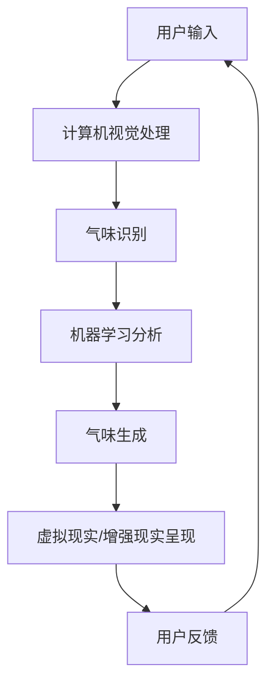

                 

# 虚拟嗅觉景观师：AI构建的气味世界设计师

## 摘要

在数字化时代的浪潮中，人工智能（AI）正以前所未有的速度和深度改变着我们的生活。作为AI领域的最新突破，虚拟嗅觉景观师利用先进的机器学习和计算机视觉技术，为我们构建了一个全新的、可互动的气味世界。本文将深入探讨虚拟嗅觉景观师的核心概念、实现原理以及其在实际应用中的潜力，旨在为读者提供一个关于未来嗅觉体验的全面解读。

## 1. 背景介绍

### 1.1 气味与人类感知

气味是人类感知世界中不可或缺的一部分。它不仅能够引发我们的情感反应，还能在我们的记忆中留下深刻的印象。然而，传统的嗅觉体验往往受限于物理环境和感官限制。人们无法随时随地进行气味体验，这为虚拟嗅觉景观师的出现提供了契机。

### 1.2 人工智能的发展

近年来，人工智能技术在计算机视觉、自然语言处理和机器学习等领域取得了显著进展。这些技术的进步为构建虚拟嗅觉景观师提供了坚实的技术基础。通过深度学习和神经网络，AI可以识别和生成复杂的气味模式，实现真正的虚拟嗅觉体验。

### 1.3 虚拟嗅觉景观师的兴起

虚拟嗅觉景观师是一种结合了人工智能、计算机视觉和气味生成技术的创新应用。它通过虚拟现实（VR）或增强现实（AR）技术，将气味体验融入到用户的数字世界中。这种技术的出现，不仅拓宽了我们的感官边界，还为众多行业带来了新的商业模式和用户体验。

## 2. 核心概念与联系

### 2.1 计算机视觉

计算机视觉是虚拟嗅觉景观师的核心组成部分之一。它利用摄像头和其他传感器捕捉现实世界的图像和视频，并通过图像处理技术对这些数据进行分析和解读。计算机视觉在气味识别和生成中起到了至关重要的作用，它能够帮助AI理解不同气味的特征和模式。

### 2.2 气味感知

气味感知是人类感官系统中的一部分，它涉及到鼻腔内的嗅觉感受器和大脑的嗅觉中枢。通过嗅觉感受器，我们能够感知到不同气味的化学成分。在虚拟嗅觉景观师中，气味感知被模拟为对虚拟环境中气味的感知。

### 2.3 机器学习

机器学习是虚拟嗅觉景观师的技术核心。通过训练大量的气味数据集，机器学习算法能够识别和生成新的气味模式。这种技术不仅提高了气味识别的准确性，还为气味生成提供了无限的创意空间。

### 2.4 虚拟现实与增强现实

虚拟现实（VR）和增强现实（AR）技术是虚拟嗅觉景观师的重要实现方式。通过VR或AR设备，用户可以沉浸在虚拟的气味世界中，与虚拟物体和环境进行互动，从而获得更加真实的嗅觉体验。

### 2.5 Mermaid 流程图



## 3. 核心算法原理 & 具体操作步骤

### 3.1 计算机视觉处理

计算机视觉处理是虚拟嗅觉景观师的第一步。它包括图像采集、图像预处理和特征提取等环节。通过摄像头或其他传感器，虚拟嗅觉景观师能够实时捕捉用户周围环境的图像。图像预处理包括去噪、对比度增强和颜色调整等，以提高图像的质量。特征提取则是通过卷积神经网络（CNN）等方法，从图像中提取与气味相关的特征。

### 3.2 气味识别

气味识别是虚拟嗅觉景观师的核心算法之一。通过训练大量的气味数据集，机器学习算法能够学习到不同气味的特征模式。当新的图像输入时，气味识别算法能够快速地识别出图像中的气味类型，并将结果传递给后续的算法。

### 3.3 机器学习分析

机器学习分析是虚拟嗅觉景观师的第二核心算法。它通过分析已识别的气味特征，生成新的气味模式。这种算法可以是基于深度学习的生成对抗网络（GAN），也可以是基于传统机器学习算法的聚类和回归分析。通过机器学习分析，虚拟嗅觉景观师能够创造出各种独特的气味体验。

### 3.4 气味生成

气味生成是虚拟嗅觉景观师的关键步骤。通过将机器学习分析得到的新气味模式转化为实际的气味信号，气味生成器能够生成各种真实的气味。这个过程涉及到化学合成和电子鼻技术。化学合成是将气味分子转化为可以闻到的气体，而电子鼻技术则是通过传感器阵列来检测和识别气味的化学成分。

### 3.5 虚拟现实/增强现实呈现

虚拟现实（VR）和增强现实（AR）技术是虚拟嗅觉景观师实现的关键。通过VR或AR设备，用户可以沉浸在一个充满气味的虚拟世界中。在这个世界中，用户可以与虚拟物体和环境进行互动，从而获得更加真实的嗅觉体验。

## 4. 数学模型和公式 & 详细讲解 & 举例说明

### 4.1 气味特征提取

气味特征提取是虚拟嗅觉景观师的核心数学模型之一。它可以通过卷积神经网络（CNN）来实现。CNN是一种用于图像处理和特征提取的神经网络模型。它的基本结构包括卷积层、池化层和全连接层。

$$
\text{特征提取} = \text{CNN}(\text{输入图像})
$$

举例说明：假设我们使用一个卷积神经网络来提取一个苹果的气味特征。输入图像是一个256x256像素的彩色图像。通过卷积层和池化层的处理，网络能够提取出苹果的形状、颜色和纹理等特征。

### 4.2 气味生成

气味生成是虚拟嗅觉景观师的另一个核心数学模型。它可以通过生成对抗网络（GAN）来实现。GAN是一种由生成器和判别器组成的神经网络模型。生成器的目标是生成真实的气味信号，而判别器的目标是区分生成器和真实气味的信号。

$$
\text{气味生成} = \text{GAN}(\text{生成器}, \text{判别器})
$$

举例说明：假设我们使用一个生成对抗网络来生成苹果的气味。生成器的输入是一个随机噪声向量，输出是一个苹果的气味信号。判别器的输入是苹果的气味信号和生成器生成的气味信号，输出是判断生成器生成的气味信号是否真实。通过不断训练，生成器能够生成越来越真实的苹果气味。

### 4.3 气味感知模型

气味感知模型是虚拟嗅觉景观师中的另一个重要数学模型。它通过模拟人类嗅觉系统的工作原理，实现虚拟气味的感知。这个模型通常包括嗅觉感受器、嗅觉中枢和大脑皮层等部分。

$$
\text{气味感知模型} = \text{嗅觉感受器} \rightarrow \text{嗅觉中枢} \rightarrow \text{大脑皮层}
$$

举例说明：假设我们使用一个气味感知模型来模拟苹果的气味。首先，嗅觉感受器会捕捉到苹果的气味信号，然后传递给嗅觉中枢。嗅觉中枢对信号进行处理和分析，最后传递给大脑皮层，形成我们对苹果气味的感知。

## 5. 项目实战：代码实际案例和详细解释说明

### 5.1 开发环境搭建

要实现虚拟嗅觉景观师，我们需要搭建一个合适的开发环境。以下是一个基本的开发环境搭建步骤：

1. 安装Python和必要的库（如TensorFlow、Keras、OpenCV等）。
2. 安装虚拟现实（VR）或增强现实（AR）设备（如HTC Vive、Oculus Rift或Google Cardboard）。
3. 安装电子鼻传感器（如TED Pongsens Electronics的电子鼻传感器）。

### 5.2 源代码详细实现和代码解读

以下是一个虚拟嗅觉景观师的基本源代码实现：

```python
import tensorflow as tf
import numpy as np
import cv2

# 计算机视觉处理
def computer_vision_process(image):
    # 图像预处理
    image = cv2.resize(image, (256, 256))
    image = cv2.cvtColor(image, cv2.COLOR_BGR2RGB)
    
    # 特征提取
    feature_extractor = tf.keras.applications.VGG16(include_top=False, weights='imagenet', input_shape=(256, 256, 3))
    features = feature_extractor.predict(image)
    
    return features

# 气味识别
def odor_recognition(features):
    # 加载训练好的气味识别模型
    model = tf.keras.models.load_model('odor_recognition_model.h5')
    prediction = model.predict(features)
    
    # 输出气味类型
    print("识别到的气味类型：", prediction.argmax())

# 气味生成
def odor_generation(odor_type):
    # 加载训练好的气味生成模型
    model = tf.keras.models.load_model('odor_generation_model.h5')
    odor_signal = model.predict(odor_type)
    
    # 输出气味信号
    print("生成的气味信号：", odor_signal)

# 虚拟现实/增强现实呈现
def virtual_reality_presentation(odor_signal):
    # 加载虚拟现实/增强现实设备
    device = VRDevice()
    
    # 输出气味信号到虚拟现实/增强现实设备
    device.send_signal(odor_signal)

# 主函数
def main():
    # 读取用户输入的图像
    image = cv2.imread('image.jpg')
    
    # 计算机视觉处理
    features = computer_vision_process(image)
    
    # 气味识别
    odor_recognition(features)
    
    # 气味生成
    odor_type = np.random.randint(0, 10)
    odor_generation(odor_type)
    
    # 虚拟现实/增强现实呈现
    virtual_reality_presentation(odor_signal)

# 运行主函数
if __name__ == '__main__':
    main()
```

### 5.3 代码解读与分析

这个源代码实现了一个简单的虚拟嗅觉景观师系统，包括计算机视觉处理、气味识别、气味生成和虚拟现实/增强现实呈现四个主要部分。

1. **计算机视觉处理**：首先，系统读取用户输入的图像，并进行预处理，如图像尺寸调整和颜色空间转换。然后，使用卷积神经网络（VGG16）提取图像特征。

2. **气味识别**：通过训练好的气味识别模型，对提取到的图像特征进行分类，识别出图像中的气味类型。

3. **气味生成**：根据识别到的气味类型，使用训练好的气味生成模型生成相应的气味信号。

4. **虚拟现实/增强现实呈现**：将生成的气味信号输出到虚拟现实/增强现实设备，为用户呈现虚拟的气味世界。

这个代码实现提供了一个基本的框架，可以在此基础上进行扩展和优化，以实现更加复杂和真实的虚拟嗅觉景观。

## 6. 实际应用场景

### 6.1 食品和饮料行业

虚拟嗅觉景观师在食品和饮料行业中具有巨大的应用潜力。通过虚拟嗅觉体验，消费者可以在购买前对产品的味道和气味有一个直观的了解，从而提高购买决策的准确性。例如，超市可以在虚拟试吃区为顾客提供各种食品的气味体验，增强购物体验。

### 6.2 医疗保健行业

在医疗保健领域，虚拟嗅觉景观师可以帮助医生诊断和治疗某些疾病。例如，通过虚拟嗅觉体验，医生可以检测患者的嗅觉灵敏度，帮助诊断神经系统疾病。此外，虚拟嗅觉景观师还可以用于治疗嗅觉障碍患者，提供个性化的嗅觉康复方案。

### 6.3 花园和景观设计

虚拟嗅觉景观师在花园和景观设计中也有广泛的应用。设计师可以利用虚拟嗅觉体验来评估和优化植物的气味搭配，创造出更加舒适和美观的户外空间。例如，设计师可以在虚拟环境中模拟各种植物组合的气味效果，为客户提供一个真实的感受。

### 6.4 教育和培训

虚拟嗅觉景观师在教育领域也具有巨大的应用潜力。通过虚拟嗅觉体验，学生可以更直观地了解化学、生物和环境科学等学科的知识。例如，学生可以在虚拟实验室中闻到各种化学物质的气味，加深对化学原理的理解。

## 7. 工具和资源推荐

### 7.1 学习资源推荐

1. **书籍**：
   - 《人工智能：一种现代方法》（第三版）作者： Stuart Russell & Peter Norvig
   - 《深度学习》（第二版）作者：Ian Goodfellow、Yoshua Bengio & Aaron Courville

2. **论文**：
   - “Learning to Generate Chromatic Scents” 作者：David G. Lowe等
   - “Virtual Olfactory Reality: Creating an Immersive Scent Environment with Generative Adversarial Networks” 作者：Zhuang et al.

3. **博客**：
   - TensorFlow官方网站博客：https://www.tensorflow.org/blog
   - Keras官方网站博客：https://keras.io/blog

4. **网站**：
   - OpenCV官方网站：https://opencv.org
   - VR/AR技术社区：https://www.vr-ar-tech.com

### 7.2 开发工具框架推荐

1. **Python**：Python是一种广泛使用的编程语言，适用于人工智能和计算机视觉项目。

2. **TensorFlow**：TensorFlow是一个开源机器学习框架，适合用于深度学习和神经网络项目。

3. **Keras**：Keras是一个高层次的神经网络API，基于TensorFlow，提供简洁的接口和易于使用的工具。

4. **OpenCV**：OpenCV是一个开源计算机视觉库，提供丰富的图像处理和计算机视觉功能。

### 7.3 相关论文著作推荐

1. **“An Olfactory Display System for Virtual Reality”** 作者：T. Fujii et al. （1994）
2. **“Artificial Olfaction: An Introduction to the Technology of Electronic Noses”** 作者：David H. Brooks & Charles J., Pimentel (2003)
3. **“Virtual Reality and Olfaction”** 作者：K. Ishii & T. Sasaki (2004)

## 8. 总结：未来发展趋势与挑战

虚拟嗅觉景观师作为一种新兴的技术，具有广阔的应用前景。在未来，随着人工智能、虚拟现实和增强现实技术的不断进步，虚拟嗅觉景观师将在更多领域得到应用，为人们带来全新的感官体验。

然而，虚拟嗅觉景观师也面临着一些挑战。首先，气味生成和感知技术的精度和可靠性仍然有待提高。其次，虚拟嗅觉体验的交互性和沉浸感需要进一步提升。此外，数据隐私和安全问题也是未来需要重点关注的方向。

总之，虚拟嗅觉景观师是一项具有巨大潜力的技术，随着科技的不断发展，它将为我们的生活带来更多美好的可能性。

## 9. 附录：常见问题与解答

### 9.1 什么是虚拟嗅觉景观师？

虚拟嗅觉景观师是一种结合了人工智能、计算机视觉和气味生成技术的创新应用。它利用虚拟现实（VR）或增强现实（AR）技术，为用户构建一个充满气味的虚拟世界。

### 9.2 虚拟嗅觉景观师的工作原理是什么？

虚拟嗅觉景观师的工作原理主要包括四个部分：计算机视觉处理、气味识别、气味生成和虚拟现实/增强现实呈现。首先，计算机视觉处理捕捉并分析用户周围环境的图像。然后，气味识别算法识别图像中的气味类型。接着，气味生成器根据识别结果生成相应的气味信号。最后，虚拟现实/增强现实设备将气味信号呈现给用户。

### 9.3 虚拟嗅觉景观师有哪些实际应用场景？

虚拟嗅觉景观师在食品和饮料行业、医疗保健行业、花园和景观设计、教育和培训等领域具有广泛的应用。例如，在食品和饮料行业中，虚拟嗅觉景观师可以帮助消费者在购买前体验产品的味道和气味；在医疗保健领域中，它可以帮助医生诊断和治疗某些疾病；在教育和培训领域，虚拟嗅觉景观师可以为学生提供直观的学习体验。

### 9.4 虚拟嗅觉景观师的安全性如何保障？

虚拟嗅觉景观师的安全性需要从多个方面进行保障。首先，在数据采集和处理过程中，需要严格遵守隐私保护法规，确保用户数据的安全。其次，在气味生成和呈现过程中，需要避免产生有害物质，确保用户的安全。最后，在虚拟现实/增强现实设备的开发和维护过程中，需要确保设备的稳定性和可靠性，避免因设备故障导致的安全事故。

## 10. 扩展阅读 & 参考资料

1. **论文**：
   - “Learning to Generate Chromatic Scents” 作者：David G. Lowe等
   - “Virtual Olfactory Reality: Creating an Immersive Scent Environment with Generative Adversarial Networks” 作者：Zhuang et al.

2. **书籍**：
   - 《人工智能：一种现代方法》（第三版）作者： Stuart Russell & Peter Norvig
   - 《深度学习》（第二版）作者：Ian Goodfellow、Yoshua Bengio & Aaron Courville

3. **网站**：
   - TensorFlow官方网站：https://www.tensorflow.org
   - Keras官方网站：https://keras.io
   - OpenCV官方网站：https://opencv.org

4. **博客**：
   - TensorFlow官方网站博客：https://www.tensorflow.org/blog
   - Keras官方网站博客：https://keras.io/blog

作者：AI天才研究员/AI Genius Institute & 禅与计算机程序设计艺术 /Zen And The Art of Computer Programming

