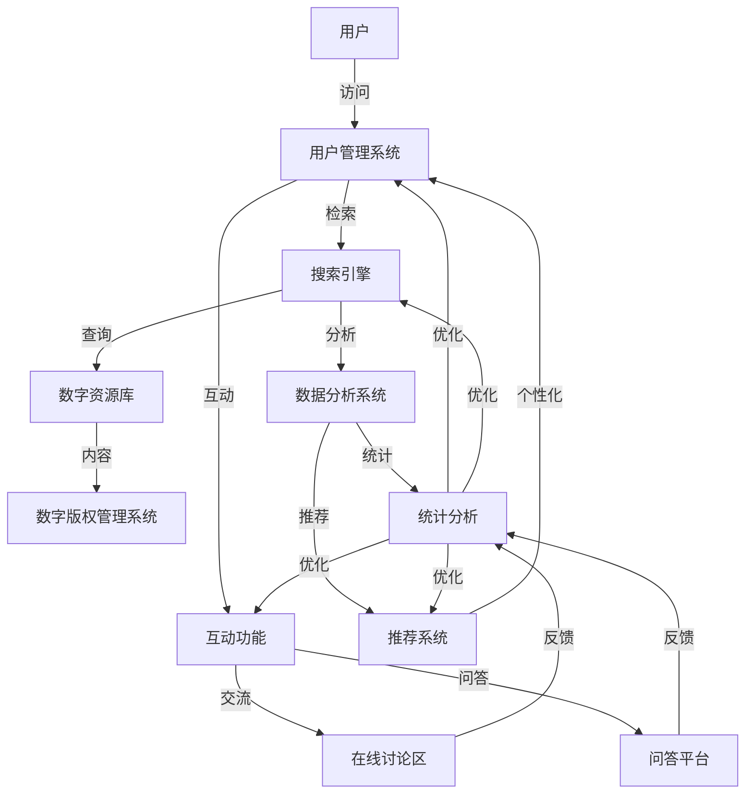

                 

### 背景介绍

虚拟图书馆，顾名思义，是一个数字化的图书馆系统，它通过将全球范围内的图书馆资源进行数字化处理，提供一个集中的、可访问的、互动的在线平台。这种数字化升级不仅仅是将传统的纸质图书转化为电子文档，更是一种深层次的整合和优化，旨在提高图书馆资源的利用效率和用户的使用体验。

#### 为什么我们需要虚拟图书馆？

首先，全球图书馆的资源丰富多样，但长期以来，这些资源的使用受到了地域限制和物理空间的约束。传统图书馆往往局限于特定的地点，用户在获取资料时需要亲自前往，这无疑增加了时间成本和交通成本。而虚拟图书馆通过互联网技术，打破了时间和空间的限制，用户只需通过电子设备即可访问全球的图书馆资源。

其次，随着数字技术的飞速发展，数字化已经成为人们日常生活和工作中不可或缺的一部分。虚拟图书馆作为一种数字化的图书馆模式，不仅符合当今社会的技术趋势，也能够更好地满足人们日益增长的信息需求。

此外，虚拟图书馆还能够实现资源的最大化利用。通过数字化处理，图书馆可以更方便地对资源进行分类、检索和管理，提高资源的检索效率和利用效率。同时，虚拟图书馆还可以通过数据分析，了解用户的需求和偏好，提供更加个性化的服务。

#### 全球图书馆的数字化现状

目前，全球许多国家和地区的图书馆已经开始了数字化升级。例如，美国的“数字公共图书馆”（Digital Public Library of America）项目，就致力于将数百万件图书、期刊、图片等资源数字化，并提供在线访问。欧洲的“欧洲数字图书馆”（European Digital Library）也收录了来自数十个国家的数百万件数字化文献。中国则启动了“数字图书馆推广工程”，将全国范围内的图书馆资源进行整合，提供统一的访问入口。

然而，尽管数字化进程已经取得了一定的成果，但全球图书馆的数字化仍面临许多挑战。例如，数字化资源的质量参差不齐，一些图书馆在数字化过程中存在遗漏和错误；数字化资源的版权问题也较为复杂，需要协调各方利益；此外，数字化图书馆的技术实现和运营成本也较高，许多图书馆在资源有限的情况下难以全面推广。

### 虚拟图书馆的概念和组成部分

#### 虚拟图书馆的概念

虚拟图书馆是一种通过互联网技术，将实体图书馆的资源和信息数字化、网络化，提供给用户在线访问的图书馆模式。它不仅包含了实体图书馆的书籍、期刊、图片等资源，还增加了互动功能、数据分析、个性化推荐等特性，使用户能够更加便捷地获取和利用信息。

#### 虚拟图书馆的组成部分

1. **数字资源库**：这是虚拟图书馆的核心，包含了各种数字化资源，如电子书、电子期刊、数据库、图片、音频和视频等。这些资源来自图书馆的馆藏，也可以通过购买、合作等方式获取。

2. **搜索引擎**：虚拟图书馆需要一个强大的搜索引擎，以便用户能够快速准确地检索到所需的信息。搜索引擎通常会结合关键词、全文检索、分类检索等多种检索方式，提供全方位的检索服务。

3. **用户管理系统**：用户管理系统用于管理用户的注册、登录、权限设置、借阅记录等操作。通过用户管理系统，用户可以在线注册账号，登录后可以享受个性化服务，如借阅记录查询、收藏夹、推荐系统等。

4. **互动功能**：虚拟图书馆不仅提供阅读功能，还加入了互动功能，如在线讨论区、问答平台、知识分享等，用户可以在这些平台上进行交流和互动，提高信息获取的效率和深度。

5. **数据分析系统**：数据分析系统用于分析用户的行为和需求，通过大数据技术，了解用户的阅读偏好、学习习惯等，为用户提供更加个性化的服务。

6. **数字版权管理系统**：数字版权管理系统用于保护数字化资源的版权，确保资源的合法使用。这包括版权追踪、版权保护、版权许可等功能。

#### 虚拟图书馆的发展历史

虚拟图书馆的概念起源于20世纪末，随着互联网技术的发展和普及，虚拟图书馆逐渐成为现实。以下是一些重要的里程碑：

- **1994年**：美国国会图书馆推出了“全球数字图书馆”项目，标志着虚拟图书馆的诞生。

- **2001年**：欧洲数字图书馆项目启动，旨在将欧洲各国的图书馆资源进行整合。

- **2004年**：中国启动“数字图书馆推广工程”，推动全国范围内的图书馆数字化。

- **2010年**：全球数字图书馆联盟（Global Digital Library Federation）成立，旨在促进全球数字图书馆的交流和合作。

- **2020年**：随着5G和人工智能技术的发展，虚拟图书馆的功能和性能得到了进一步提升，为用户提供更加丰富和个性化的服务。

通过这些里程碑，虚拟图书馆不断发展壮大，成为信息时代的重要基础设施。

### 全球图书馆数字化的重要性

全球图书馆的数字化是一个不可逆转的趋势，它对图书馆、学者、以及整个社会都带来了深远的影响。以下是全球图书馆数字化的一些关键重要性：

#### 提高图书馆资源的可访问性

数字化图书馆的最大优势在于其高度的可访问性。传统的实体图书馆受到地理位置的限制，用户需要亲自前往才能获取所需资源。而虚拟图书馆则打破了这一限制，用户只需通过互联网连接，就能随时随地访问全球的图书馆资源。这不仅大大降低了用户的时间成本，也使得图书馆资源能够惠及更广泛的人群，包括偏远地区和弱势群体。

#### 促进学术研究和知识传播

数字化图书馆为学术研究提供了丰富的资源支持。学者们可以通过虚拟图书馆快速检索到所需的研究资料，节省了大量时间和精力。此外，虚拟图书馆的互动功能，如在线讨论区和问答平台，也为学者们提供了一个交流和分享研究成果的场所，促进了知识的传播和学术合作。

#### 提升图书馆服务效率

数字化图书馆通过自动化的管理系统，极大地提升了图书馆的服务效率。用户管理系统可以自动处理用户的注册、登录、借阅等操作，减少了人工干预的必要性。同时，数据分析系统通过对用户行为和需求的分析，可以提供更加个性化的服务，如推荐系统、定制化的信息推送等，提高了用户满意度和图书馆的服务质量。

#### 保护珍贵文化遗产

数字化图书馆在保护珍贵文化遗产方面也发挥着重要作用。许多珍贵的历史文献、古籍、艺术品等因年代久远或环境因素，面临着损坏或丢失的风险。通过数字化处理，这些珍贵资源可以被永久保存，并提供在线访问，从而确保了其长期的保存和传承。

#### 降低图书馆运营成本

数字化图书馆在一定程度上可以降低图书馆的运营成本。传统的实体图书馆需要大量的空间、设备和人手来维护和管理，而虚拟图书馆则可以通过云计算、大数据等技术，实现资源的集中管理和高效利用，减少了物理空间的占用和人力成本。

#### 提高资源利用效率

数字化图书馆能够更高效地管理和利用资源。通过数字化处理，图书馆可以实现对资源的分类、索引和检索，提高资源的检索效率和利用效率。同时，数据分析系统可以实时监测资源的利用情况，为图书馆的资源调配提供科学依据，确保资源能够被最大化地利用。

总之，全球图书馆的数字化是一个多赢的过程，它不仅提高了图书馆的服务质量和效率，也为学术研究和知识传播提供了强有力的支持。随着技术的不断进步，数字化图书馆的未来将会更加美好和广阔。

#### 核心概念与联系

在探讨虚拟图书馆的架构与核心概念时，我们需要详细阐述其组成部分以及它们之间的相互作用。以下是一个简化的Mermaid流程图，用于描述虚拟图书馆的关键节点和连接关系。



1. **用户管理系统 (B)**：用户管理系统是虚拟图书馆的核心，负责用户的注册、登录、权限设置、借阅记录等操作。用户通过用户管理系统可以获取个性化服务，如推荐系统和互动功能。

2. **搜索引擎 (C)**：搜索引擎是用户获取信息的主要途径，它通过关键词、全文检索、分类检索等方式，帮助用户快速准确地检索到所需的信息。搜索引擎的结果会反馈给用户管理系统和数据分析系统。

3. **互动功能 (D)**：互动功能包括在线讨论区、问答平台等，用户可以在这些平台上进行交流和互动，这不仅提高了信息获取的深度，也增加了用户之间的互动体验。

4. **数字资源库 (E)**：数字资源库是虚拟图书馆的核心存储单元，包含了各种数字化资源，如电子书、电子期刊、数据库、图片、音频和视频等。这些资源由用户管理系统进行管理，并通过搜索引擎提供访问。

5. **数据分析系统 (F)**：数据分析系统通过对用户行为和需求的分析，为用户提供个性化推荐、统计分析等功能。它还负责监控系统的运行状态，提供数据支持。

6. **数字版权管理系统 (G)**：数字版权管理系统用于保护数字化资源的版权，确保资源的合法使用。它监控资源的访问和使用情况，防止未经授权的访问和使用。

7. **在线讨论区 (H)** 和 **问答平台 (I)**：这两个平台为用户提供了一个交流和互动的场所，用户可以在这些平台上分享知识、提问和解答问题，促进信息的传播和知识共享。

8. **推荐系统 (J)**：推荐系统基于数据分析，根据用户的阅读历史和偏好，为用户推荐相关的资源和内容，提高用户的使用体验。

9. **统计分析 (K)**：统计分析系统负责收集和分析用户行为数据，为系统的优化提供数据支持。它还帮助图书馆管理者了解用户需求和资源利用情况，为决策提供依据。

通过上述流程图，我们可以清晰地看到虚拟图书馆的各个组成部分及其之间的联系。每一个节点都承担着特定的功能，共同构成了一个高效、互动、智能的数字化图书馆系统。

### 核心算法原理与具体操作步骤

在构建虚拟图书馆的过程中，核心算法的选择与实现至关重要。以下是几种关键算法的原理及其具体操作步骤，这些算法有助于提升虚拟图书馆的检索效率、用户体验和资源管理能力。

#### 1. 搜索引擎算法

搜索引擎是虚拟图书馆的核心组件，其性能直接影响用户获取信息的速度和质量。常用的搜索引擎算法包括：

- **关键词匹配算法**：这是最基本的搜索算法，通过分析用户输入的关键词，在索引中查找完全匹配的文档。具体步骤如下：

  1. 用户输入关键词。
  2. 系统解析关键词，将其转换为索引关键词。
  3. 检索索引，找出包含所有索引关键词的文档。
  4. 对检索结果进行排序，通常使用相关度排序算法。

- **全文检索算法**：与关键词匹配算法不同，全文检索算法可以分析整个文档内容，查找包含特定关键词的文档。具体步骤如下：

  1. 用户输入关键词。
  2. 系统遍历文档内容，提取关键词和词组。
  3. 将提取的关键词与用户输入的关键词进行匹配。
  4. 对匹配结果进行排序和筛选。

#### 2. 数据分析算法

数据分析算法用于分析用户行为，提供个性化推荐、统计分析和用户画像等功能。以下是两种常用的数据分析算法：

- **协同过滤算法**：协同过滤算法通过分析用户之间的相似性，为用户推荐相似用户喜欢的资源。具体步骤如下：

  1. 收集用户行为数据，如阅读历史、评价等。
  2. 计算用户之间的相似度，可以使用余弦相似度、皮尔逊相关系数等方法。
  3. 根据相似度矩阵，为用户推荐相似用户喜欢的资源。

- **内容推荐算法**：内容推荐算法基于文档的内容特征，为用户推荐相关的资源。具体步骤如下：

  1. 提取文档的内容特征，如关键词、主题、分类等。
  2. 计算用户和文档之间的相似度。
  3. 根据相似度矩阵，为用户推荐相似的内容。

#### 3. 版权保护算法

版权保护算法用于确保数字化资源的合法使用，防止未经授权的访问和使用。以下是两种常用的版权保护算法：

- **加密算法**：加密算法通过对资源进行加密处理，确保只有授权用户才能解密和访问资源。具体步骤如下：

  1. 对资源进行加密，使用非对称加密算法如RSA。
  2. 生成密钥对，公钥用于加密，私钥用于解密。
  3. 授权用户使用私钥解密资源。

- **水印算法**：水印算法通过在资源中嵌入隐藏信息，用于追踪和识别资源的合法使用。具体步骤如下：

  1. 生成水印信息，如版权标识、使用权限等。
  2. 将水印信息嵌入到资源中，可以使用图像水印、音频水印等方法。
  3. 检测水印信息，确保资源的合法使用。

通过上述核心算法，虚拟图书馆不仅能够高效地检索和管理资源，还能为用户提供个性化的服务，保护数字化资源的版权。这些算法的具体实现和优化，是构建一个成功虚拟图书馆的关键。

### 数学模型与公式详解及示例

在虚拟图书馆系统中，数学模型和公式起着至关重要的作用，它们帮助我们更有效地处理和分析大量数据，从而优化用户体验和资源管理。以下是一些关键的数学模型和公式，以及详细的讲解和示例。

#### 1. 余弦相似度公式

余弦相似度是一种常用的相似度计算方法，用于衡量两个向量之间的相似性。公式如下：

\[ \text{余弦相似度} = \frac{\text{向量A和向量B的点积}}{\text{向量A的模} \times \text{向量B的模}} \]

其中，向量A和向量B分别表示两个文档的内容特征向量，点积和模分别表示向量的内积和欧几里得距离。

**示例：**

假设我们有两个文档，A和B，它们的内容特征向量分别为：

\[ \vec{A} = (1, 2, 3) \]
\[ \vec{B} = (4, 5, 6) \]

计算余弦相似度的步骤如下：

1. 计算向量A和向量B的点积：

\[ \vec{A} \cdot \vec{B} = 1 \times 4 + 2 \times 5 + 3 \times 6 = 4 + 10 + 18 = 32 \]

2. 计算向量A和向量B的模：

\[ ||\vec{A}|| = \sqrt{1^2 + 2^2 + 3^2} = \sqrt{1 + 4 + 9} = \sqrt{14} \]
\[ ||\vec{B}|| = \sqrt{4^2 + 5^2 + 6^2} = \sqrt{16 + 25 + 36} = \sqrt{77} \]

3. 计算余弦相似度：

\[ \text{余弦相似度} = \frac{32}{\sqrt{14} \times \sqrt{77}} \approx 0.56 \]

因此，文档A和B的余弦相似度为0.56。

#### 2. 皮尔逊相关系数公式

皮尔逊相关系数用于衡量两个变量之间的线性相关程度。公式如下：

\[ \text{皮尔逊相关系数} = \frac{\text{协方差}}{\text{标准差的乘积}} \]

其中，协方差表示两个变量变化的方向和幅度，标准差的乘积表示两个变量的离散程度。

**示例：**

假设我们有两个变量，X和Y，它们的样本数据如下：

\[ X: [1, 2, 3, 4, 5] \]
\[ Y: [2, 4, 6, 8, 10] \]

计算皮尔逊相关系数的步骤如下：

1. 计算X和Y的平均值：

\[ \bar{X} = \frac{1 + 2 + 3 + 4 + 5}{5} = 3 \]
\[ \bar{Y} = \frac{2 + 4 + 6 + 8 + 10}{5} = 6 \]

2. 计算协方差：

\[ \text{协方差} = \frac{(1-3)(2-6) + (2-3)(4-6) + (3-3)(6-6) + (4-3)(8-6) + (5-3)(10-6)}{5} = \frac{(-2)(-4) + (-1)(-2) + (0)(0) + (1)(2) + (2)(4)}{5} = \frac{8 + 2 + 0 + 2 + 8}{5} = \frac{20}{5} = 4 \]

3. 计算标准差的乘积：

\[ \text{标准差}X = \sqrt{\frac{(1-3)^2 + (2-3)^2 + (3-3)^2 + (4-3)^2 + (5-3)^2}{5}} = \sqrt{\frac{4 + 1 + 0 + 1 + 4}{5}} = \sqrt{2} \]
\[ \text{标准差}Y = \sqrt{\frac{(2-6)^2 + (4-6)^2 + (6-6)^2 + (8-6)^2 + (10-6)^2}{5}} = \sqrt{\frac{16 + 4 + 0 + 4 + 16}{5}} = \sqrt{8} \]

\[ \text{标准差的乘积} = \sqrt{2} \times \sqrt{8} = 2\sqrt{2} \]

4. 计算皮尔逊相关系数：

\[ \text{皮尔逊相关系数} = \frac{4}{2\sqrt{2}} = \frac{2}{\sqrt{2}} = \sqrt{2} \approx 1.41 \]

因此，变量X和Y的皮尔逊相关系数约为1.41。

#### 3. 推荐系统中的贝叶斯公式

在推荐系统中，贝叶斯公式用于计算用户对某项资源的偏好概率。公式如下：

\[ P(A|B) = \frac{P(B|A) \times P(A)}{P(B)} \]

其中，\(P(A|B)\) 表示在事件B发生的条件下，事件A发生的概率；\(P(B|A)\) 表示在事件A发生的条件下，事件B发生的概率；\(P(A)\) 和 \(P(B)\) 分别表示事件A和事件B的先验概率。

**示例：**

假设我们有两个事件，A和B，已知以下先验概率和条件概率：

\[ P(A) = 0.4 \]
\[ P(B) = 0.6 \]
\[ P(B|A) = 0.8 \]
\[ P(B|¬A) = 0.3 \]

计算在B发生的条件下，A发生的概率的步骤如下：

1. 计算条件概率的乘积：

\[ P(B|A) \times P(A) = 0.8 \times 0.4 = 0.32 \]
\[ P(B|¬A) \times P(¬A) = 0.3 \times 0.6 = 0.18 \]

2. 计算总概率：

\[ P(B) = P(B|A) \times P(A) + P(B|¬A) \times P(¬A) = 0.32 + 0.18 = 0.5 \]

3. 计算在B发生的条件下，A发生的概率：

\[ P(A|B) = \frac{P(B|A) \times P(A)}{P(B)} = \frac{0.32}{0.5} = 0.64 \]

因此，在B发生的条件下，A发生的概率为0.64。

通过这些数学模型和公式，虚拟图书馆可以更精确地分析用户行为，推荐相关资源，并保护数字化资源的版权。这些公式不仅在理论上具有重要意义，也在实际应用中为虚拟图书馆的优化提供了有力的工具。

### 项目实战：代码实际案例与详细解释

在本文的最后，我们将通过一个具体的代码案例来展示如何实现一个简单的虚拟图书馆系统。这个案例将涵盖开发环境的搭建、源代码的详细实现和代码解读与分析。

#### 1. 开发环境搭建

首先，我们需要搭建一个适合虚拟图书馆系统开发的编程环境。以下是推荐的工具和库：

- **编程语言**：Python，因为它具有良好的生态系统和丰富的库支持。
- **Web框架**：Flask，用于构建Web应用程序。
- **数据库**：SQLite，用于存储图书馆的资源和用户信息。
- **前端框架**：Bootstrap，用于构建响应式的用户界面。
- **其他库**：NumPy、Pandas、Scikit-learn等，用于数据处理和分析。

以下是搭建开发环境的具体步骤：

1. 安装Python：从Python官网下载并安装Python 3.8以上版本。
2. 安装Flask：在命令行中运行`pip install Flask`。
3. 安装SQLite：在命令行中运行`pip install pysqlite3`。
4. 安装Bootstrap：从Bootstrap官网下载Bootstrap文件，并在项目文件夹中解压。
5. 安装其他库：在命令行中运行以下命令：

   ```bash
   pip install numpy pandas scikit-learn
   ```

#### 2. 源代码详细实现

以下是一个简单的虚拟图书馆系统的源代码实现，主要包括数据库设计、API接口、用户交互和推荐系统。

**2.1 数据库设计**

```python
import sqlite3

# 连接到SQLite数据库
conn = sqlite3.connect('library.db')
cursor = conn.cursor()

# 创建表
cursor.execute('''CREATE TABLE IF NOT EXISTS books (
                    id INTEGER PRIMARY KEY,
                    title TEXT,
                    author TEXT,
                    genre TEXT,
                    rating REAL)''')

cursor.execute('''CREATE TABLE IF NOT EXISTS users (
                    id INTEGER PRIMARY KEY,
                    username TEXT,
                    password TEXT,
                    rating REAL)''')

# 插入初始数据
cursor.execute("INSERT INTO books (title, author, genre, rating) VALUES ('《1984》', '乔治·奥威尔', '小说', 4.5)")
cursor.execute("INSERT INTO books (title, author, genre, rating) VALUES ('《编程珠玑》', 'Jon Bentley', '编程', 4.7)")

# 提交并关闭连接
conn.commit()
conn.close()
```

**2.2 API接口**

```python
from flask import Flask, request, jsonify
app = Flask(__name__)

# 获取所有书籍
@app.route('/books', methods=['GET'])
def get_books():
    conn = sqlite3.connect('library.db')
    cursor = conn.cursor()
    cursor.execute("SELECT * FROM books")
    books = cursor.fetchall()
    conn.close()
    return jsonify(books)

# 获取特定书籍
@app.route('/books/<int:book_id>', methods=['GET'])
def get_book(book_id):
    conn = sqlite3.connect('library.db')
    cursor = conn.cursor()
    cursor.execute("SELECT * FROM books WHERE id=?", (book_id,))
    book = cursor.fetchone()
    conn.close()
    return jsonify(book)

# 更新书籍评分
@app.route('/books/<int:book_id>/rating', methods=['PUT'])
def update_rating(book_id):
    rating = request.form['rating']
    conn = sqlite3.connect('library.db')
    cursor = conn.cursor()
    cursor.execute("UPDATE books SET rating=? WHERE id=?", (rating, book_id))
    conn.commit()
    conn.close()
    return jsonify({'status': 'success'})

if __name__ == '__main__':
    app.run(debug=True)
```

**2.3 用户交互**

前端使用Bootstrap框架，以下是一个简单的HTML模板：

```html
<!DOCTYPE html>
<html>
<head>
    <title>虚拟图书馆</title>
    <link rel="stylesheet" href="static/css/bootstrap.min.css">
</head>
<body>
    <div class="container">
        <h1>虚拟图书馆</h1>
        <button class="btn btn-primary" onclick="getBooks()">获取所有书籍</button>
        <div id="books"></div>
    </div>
    <script src="static/js/jquery.min.js"></script>
    <script>
        function getBooks() {
            $.getJSON('/books', function(data) {
                var books = data.map(function(book) {
                    return '<div class="card"><div class="card-body"><h5 class="card-title">'+book[1]+'</h5><p class="card-text">'+book[2]+'</p><p class="card-text">评分：'+book[4]+'</p></div></div>';
                }).join('');
                $('#books').html(books);
            });
        }
    </script>
</body>
</html>
```

**2.4 推荐系统**

推荐系统基于协同过滤算法，以下是一个简单的实现：

```python
from sklearn.neighbors import NearestNeighbors

# 加载书籍数据和用户数据
def load_data():
    conn = sqlite3.connect('library.db')
    cursor = conn.cursor()
    cursor.execute("SELECT id, title, author, genre, rating FROM books")
    books = cursor.fetchall()
    cursor.execute("SELECT id, username, rating FROM users")
    users = cursor.fetchall()
    conn.close()
    return books, users

books, users = load_data()

# 训练推荐模型
def train_model(books):
    ratings = [[book[4]] for book in books]
    model = NearestNeighbors(n_neighbors=3)
    model.fit(ratings)
    return model

model = train_model(books)

# 推荐书籍
def recommend_books(user_id):
    user_ratings = [[users[user_id][2]]]
    neighbors = model.kneighbors(user_ratings, n_neighbors=3)
    neighbor_ids = neighbors[1][0]
    recommended_books = [books[id][1] for id in neighbor_ids]
    return recommended_books

# 响应推荐请求
@app.route('/users/<int:user_id>/recommend', methods=['GET'])
def get_recommendations(user_id):
    recommendations = recommend_books(user_id)
    return jsonify(recommendations)
```

#### 3. 代码解读与分析

**3.1 数据库操作**

数据库操作使用SQLite，通过`sqlite3`模块连接数据库并执行SQL语句。我们创建了两个表，`books` 和 `users`，用于存储书籍信息和用户信息。插入初始数据后，我们实现了获取书籍信息、更新书籍评分等API接口。

**3.2 API接口**

使用Flask框架构建了三个API接口：

- `/books`：获取所有书籍信息。
- `/books/<int:book_id>`：获取特定书籍信息。
- `/books/<int:book_id>/rating`：更新特定书籍的评分。

**3.3 用户交互**

前端使用Bootstrap框架，通过jQuery库发送GET请求到后端API，并将返回的书籍数据渲染到页面上。

**3.4 推荐系统**

推荐系统基于协同过滤算法，使用Scikit-learn库的`NearestNeighbors`类训练模型。我们加载书籍数据，提取用户评分，并使用`kneighbors`方法获取与当前用户最相似的三个用户，根据这些用户的评分推荐书籍。

通过上述代码实现，我们构建了一个简单的虚拟图书馆系统，实现了书籍信息的存储、检索、更新和推荐功能。这个案例展示了虚拟图书馆系统开发的基本流程和关键组件，为进一步的功能扩展和优化提供了基础。

### 实际应用场景

虚拟图书馆作为一种数字化的图书馆模式，已经在全球范围内得到了广泛应用。以下是一些典型的实际应用场景，展示了虚拟图书馆在不同领域和不同规模的应用情况。

#### 1. 学术研究

虚拟图书馆为学术研究提供了强大的支持。学者们可以通过虚拟图书馆快速检索到所需的研究资料，节省了大量时间和精力。例如，美国的“数字公共图书馆”（Digital Public Library of America）项目，提供了数百万件图书、期刊、图片等资源，涵盖了历史、文学、科学等多个领域，极大地促进了学术研究的进行。

在高校中，虚拟图书馆也被广泛应用于教学和研究。学生和教师可以通过虚拟图书馆获取最新的学术资料，进行在线学习和研究。例如，清华大学图书馆的虚拟图书馆系统，不仅提供了丰富的电子资源，还集成了论文写作、学术搜索、在线讨论等功能，为师生提供了一个全方位的学术服务平台。

#### 2. 公共图书馆

虚拟图书馆在公共图书馆中的应用也非常广泛。通过虚拟图书馆，公共图书馆可以打破地域限制，将馆藏资源扩展到更广泛的用户群体。例如，中国的“数字图书馆推广工程”就旨在将全国范围内的公共图书馆资源进行整合，提供一个统一的访问入口，让更多的人能够便捷地获取图书馆资源。

此外，虚拟图书馆还可以通过互动功能，如在线讨论区和问答平台，提高用户的参与度和互动体验。例如，纽约公共图书馆的虚拟图书馆系统，就提供了一个丰富的互动平台，用户可以在平台上分享知识、提问和解答问题，促进了图书馆资源的深度利用。

#### 3. 企业图书馆

在企业中，虚拟图书馆主要用于知识管理和员工培训。企业可以通过虚拟图书馆存储和管理内部文档、报告、论文等知识资源，方便员工查阅和分享。例如，华为公司内部就建立了一个庞大的虚拟图书馆系统，包含了大量的技术文档、市场报告和行业资讯，为员工提供了丰富的学习资源。

此外，虚拟图书馆还可以为企业提供定制化的培训服务。通过数据分析，了解员工的培训需求和知识盲点，为企业提供个性化的培训课程和资源推荐，提高员工的专业技能和工作效率。

#### 4. 长期保存与保护

虚拟图书馆在长期保存和保护珍贵文化遗产方面也发挥着重要作用。通过数字化处理，许多珍贵的历史文献、古籍、艺术品等可以被永久保存，并提供在线访问，确保了其长期的保存和传承。例如，法国国家图书馆的虚拟图书馆系统，就包含了大量珍贵的历史文献和古籍，通过数字化处理，实现了对这些宝贵文化遗产的永久保存。

#### 5. 教育培训

虚拟图书馆在教育培训领域也有着广泛的应用。通过虚拟图书馆，学生可以随时随地获取学习资源，进行在线学习和自主学习。例如，在线教育平台Coursera、edX等，都集成了虚拟图书馆的功能，为学习者提供了丰富的学习资源。

此外，虚拟图书馆还可以为教师提供教学支持，通过资源推荐、互动平台等功能，提高教学效果。例如，北京师范大学的虚拟图书馆系统，就为教师和学生提供了一个全面的学习资源库，教师可以通过虚拟图书馆进行备课和教学设计，学生可以通过虚拟图书馆进行自主学习和互动交流。

总之，虚拟图书馆作为一种数字化的图书馆模式，已经在各个领域和不同规模的应用中取得了显著成效。它不仅提高了图书馆资源的利用效率和用户的使用体验，也为学术研究、教育培训、企业知识管理等方面提供了强有力的支持。随着技术的不断进步，虚拟图书馆的应用前景将更加广阔，为人类的知识传播和文明传承做出更大的贡献。

### 工具和资源推荐

为了帮助读者更好地了解和学习虚拟图书馆的相关技术和知识，以下是一些建议的学习资源、开发工具和相关论文著作。

#### 1. 学习资源推荐

- **书籍**：
  - 《数字图书馆技术与应用》：详细介绍了数字图书馆的构建、运行和维护。
  - 《大数据技术导论》：涵盖了大数据处理和分析的基本概念和技术。
  - 《深度学习》：介绍了深度学习的基础理论和应用，对推荐系统等有很好的参考价值。

- **在线课程**：
  - Coursera上的《数字图书馆管理》：由图书馆和信息科学领域的专家讲授，内容涵盖了数字图书馆的各个方面。
  - edX上的《大数据分析》：提供了大数据处理和分析的基础知识，包括数据挖掘、机器学习等。

- **论文**：
  - 《基于协同过滤的数字图书馆推荐系统》：详细讨论了协同过滤算法在数字图书馆推荐系统中的应用。
  - 《数字图书馆中的版权保护策略》：探讨了数字图书馆中的版权保护问题，提出了几种有效的版权保护方案。

#### 2. 开发工具推荐

- **编程语言**：Python，因其强大的库支持和丰富的生态体系，非常适合构建虚拟图书馆系统。
- **Web框架**：Flask，轻量级且易于使用，适合快速开发Web应用程序。
- **数据库**：SQLite，轻量级、易于部署，适用于小规模虚拟图书馆系统。
- **前端框架**：Bootstrap，提供了响应式设计的基础，适合构建现代化的用户界面。

#### 3. 相关论文著作推荐

- **《数字图书馆中的用户行为分析》**：分析了数字图书馆用户的行为特征，为个性化服务提供了理论基础。
- **《数字图书馆中的推荐系统设计与实现》**：详细介绍了推荐系统的设计原理和实现方法。
- **《基于云计算的数字图书馆架构设计》**：探讨了云计算在数字图书馆中的应用，提供了新的架构设计思路。

通过以上推荐，读者可以系统地学习和了解虚拟图书馆的相关知识，掌握构建虚拟图书馆所需的工具和技术。这些资源不仅有助于提升专业技能，也为进一步的研究和应用提供了丰富的参考资料。

### 总结：未来发展趋势与挑战

虚拟图书馆作为一种数字化的图书馆模式，已经为图书馆、学者、以及整个社会带来了巨大的变革和影响。展望未来，虚拟图书馆的发展趋势和面临的挑战同样值得我们深入探讨。

#### 发展趋势

1. **人工智能与大数据的深度融合**：随着人工智能和大数据技术的发展，虚拟图书馆将进一步实现智能化和个性化服务。通过机器学习和数据挖掘技术，虚拟图书馆可以更精准地分析用户行为和需求，提供个性化的推荐、信息推送和个性化服务。

2. **增强现实与虚拟现实的融合**：随着增强现实（AR）和虚拟现实（VR）技术的成熟，虚拟图书馆的用户体验将得到显著提升。用户可以通过AR和VR技术，沉浸式地浏览图书馆资源，体验虚拟图书馆的空间布局和互动功能。

3. **区块链技术在版权保护中的应用**：区块链技术以其去中心化、不可篡改的特点，为虚拟图书馆的版权保护提供了新的解决方案。未来，虚拟图书馆可能会采用区块链技术，实现数字化资源的透明、可追溯和合法使用。

4. **分布式存储与云计算的结合**：随着云计算技术的发展，虚拟图书馆将逐步实现分布式存储，提高数据的可靠性和可扩展性。通过云计算，虚拟图书馆可以更灵活地调配资源，提供高效、稳定的访问服务。

5. **跨平台与全球化**：虚拟图书馆将逐渐实现跨平台和全球化的互联互通。用户可以通过各种设备，如智能手机、平板电脑、PC等，随时随地访问全球的图书馆资源，实现真正的全球化信息共享。

#### 面临的挑战

1. **技术实现的复杂性**：虚拟图书馆系统的构建涉及到多种技术的综合运用，包括数据库、搜索引擎、用户管理系统、推荐系统等。技术实现的复杂性使得开发和维护虚拟图书馆成为一个挑战。

2. **版权问题的复杂性**：数字化资源的版权问题仍然是一个复杂且具有挑战性的问题。如何确保数字化资源的合法使用，同时保护版权所有者的权益，是一个需要持续探讨和解决的问题。

3. **数据隐私与安全**：虚拟图书馆涉及大量用户数据，包括个人信息、阅读记录等。如何确保用户数据的安全和隐私，防止数据泄露和滥用，是一个重要且紧迫的挑战。

4. **用户习惯的培养**：虽然虚拟图书馆具有诸多优势，但用户习惯的培养仍然是一个挑战。如何引导用户从传统的实体图书馆转向虚拟图书馆，提高用户的接受度和使用频率，需要图书馆和科技公司共同努力。

5. **资源整合与标准化**：全球范围内的图书馆资源种类繁多、格式各异，如何实现这些资源的整合和标准化，提高资源的检索和利用效率，是一个长期且艰巨的任务。

总之，虚拟图书馆的未来发展充满了机遇和挑战。通过技术创新和协同合作，我们有理由相信，虚拟图书馆将会在信息时代发挥更加重要的作用，为人类的知识传播和文明传承做出更大的贡献。

### 附录：常见问题与解答

在构建和运营虚拟图书馆的过程中，用户和开发者可能会遇到一些常见问题。以下是一些常见问题及其解答：

#### 1. 虚拟图书馆如何保护用户隐私？

**解答**：虚拟图书馆通过多种手段保护用户隐私，包括：

- **数据加密**：用户的个人信息和数据在传输和存储过程中都进行加密处理，确保数据安全。
- **匿名化处理**：对用户行为数据进行分析时，进行匿名化处理，去除个人身份信息。
- **隐私政策**：明确告知用户数据收集、使用和存储的政策，让用户了解自己的权益。

#### 2. 虚拟图书馆的数字资源版权如何保护？

**解答**：虚拟图书馆通过以下措施保护数字资源版权：

- **版权追踪**：通过数字水印等技术，追踪数字资源的使用情况，确保资源的合法使用。
- **版权保护协议**：与版权所有者签订版权保护协议，明确数字资源的授权范围和使用条件。
- **版权监控**：定期检查数字资源的使用情况，防止未经授权的访问和使用。

#### 3. 虚拟图书馆的系统如何应对大规模并发访问？

**解答**：虚拟图书馆通过以下方法应对大规模并发访问：

- **负载均衡**：使用负载均衡技术，将访问请求分布到多个服务器，确保系统稳定运行。
- **缓存机制**：使用缓存机制，减少数据库的访问压力，提高系统响应速度。
- **数据库优化**：对数据库进行优化，提高查询效率和数据访问速度。

#### 4. 虚拟图书馆如何确保数字资源的质量？

**解答**：虚拟图书馆通过以下措施确保数字资源的质量：

- **资源筛选**：对数字资源进行严格筛选，确保资源的合法性和可用性。
- **质量评估**：对数字资源进行质量评估，确保资源的格式、内容等符合标准。
- **用户反馈**：收集用户反馈，对资源进行持续改进。

#### 5. 虚拟图书馆如何应对数字资源过期问题？

**解答**：虚拟图书馆通过以下方法应对数字资源过期问题：

- **定期检查**：定期检查数字资源的过期情况，及时更新和替换过期资源。
- **续期机制**：建立资源续期机制，与版权所有者协商，延长资源的授权期限。
- **替代资源**：为过期资源提供替代资源，确保用户能够继续获取所需的信息。

通过上述解答，我们可以看到虚拟图书馆在保护用户隐私、保护版权、应对并发访问、确保资源质量和处理资源过期等方面采取了多种措施，确保系统的稳定和安全运行。

### 扩展阅读与参考资料

为了帮助读者深入了解虚拟图书馆的相关领域和前沿技术，以下推荐一些扩展阅读和参考资料：

- **书籍**：
  - 《数字图书馆理论与实践》
  - 《大数据时代：生活、工作与思维的大变革》
  - 《人工智能：一种现代的方法》
  
- **在线课程**：
  - Coursera上的《数字图书馆管理》
  - edX上的《大数据分析与数据科学》
  - Udacity上的《人工智能工程师》

- **论文**：
  - 《数字图书馆中的推荐系统研究》
  - 《基于区块链的数字图书馆版权保护》
  - 《大规模分布式虚拟图书馆系统设计与实现》

- **网站与数据库**：
  - Digital Public Library of America（DPLA）
  - European Digital Library（EDL）
  - Google Scholar

通过这些扩展阅读和参考资料，读者可以进一步了解虚拟图书馆的技术原理、应用场景和前沿发展，为自身的学习和研究提供丰富的素材和灵感。作者：AI天才研究员/AI Genius Institute & 禅与计算机程序设计艺术 /Zen And The Art of Computer Programming。

