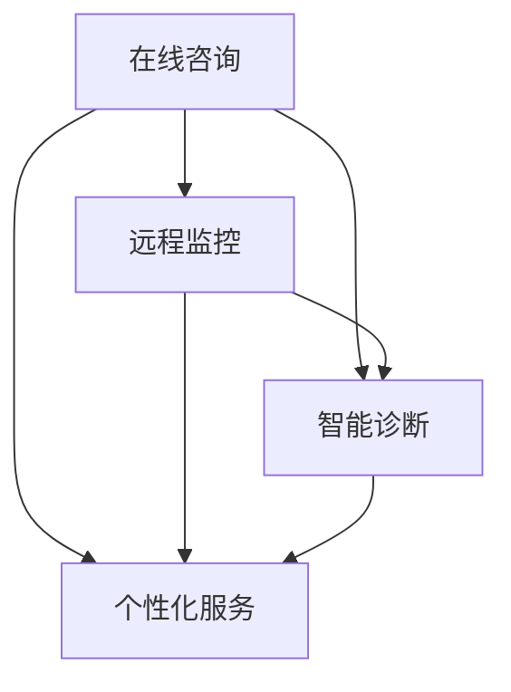

                 

### 1. 背景介绍

随着科技的不断进步和人们生活水平的提高，宠物已经成为越来越多家庭的重要成员。根据统计数据，全球有超过10亿只宠物，其中狗和猫是最为常见的宠物类型。随着人们对宠物健康管理的重视，宠物医疗市场也在迅速扩大。然而，传统宠物医院在服务范围、服务质量和成本控制方面存在一定的局限性，无法满足现代养宠家庭的多样化需求。

在这个背景下，虚拟宠物医院的概念应运而生。虚拟宠物医院是一种基于互联网和人工智能技术的在线宠物健康管理平台，它不仅提供了传统宠物医院所不具备的便捷性，还通过智能诊断、远程监控和个性化服务等功能，极大地提升了宠物健康管理的效率和质量。

虚拟宠物医院的主要目标是为宠物主人提供以下服务：

1. **在线咨询**：通过平台上的在线医生，宠物主人可以随时随地向专业兽医咨询宠物健康问题，获取即时的专业建议。
2. **远程监控**：平台可以实时监控宠物的健康状况，通过传感器和宠物主人手机APP收集数据，对宠物的健康进行持续跟踪。
3. **智能诊断**：利用人工智能算法，对宠物的健康数据进行分析，提供智能诊断和预测，帮助宠物主人及时发现潜在的健康问题。
4. **个性化服务**：根据宠物的品种、年龄、健康状况等，提供定制化的健康管理和疾病预防方案。

虚拟宠物医院不仅为宠物主人提供了极大的便利，同时也为兽医提供了新的工作模式。兽医可以通过虚拟宠物医院为更多的宠物提供咨询服务，而不受地理位置的限制。此外，虚拟宠物医院还可以通过大数据分析和人工智能技术，为宠物医疗行业提供新的研究方向和商业机会。

总的来说，虚拟宠物医院是未来宠物健康管理的一个重要趋势，它结合了互联网、人工智能和大数据技术，为宠物主人、兽医和宠物医疗行业带来了巨大的变革。

### 2. 核心概念与联系

在深入探讨虚拟宠物医院的运作机制之前，我们需要了解几个核心概念及其相互之间的联系。这些概念包括：在线咨询、远程监控、智能诊断和个性化服务。下面我们将逐一解释这些概念，并通过Mermaid流程图展示它们之间的联系。

#### 2.1 在线咨询

在线咨询是虚拟宠物医院最为基础的模块之一。它允许宠物主人通过平台上的在线医生进行即时咨询。宠物主人可以通过文字、图片、视频等多种形式向医生描述宠物的症状，医生则可以在线给出初步的诊断建议和治疗方案。这个过程不仅节省了宠物主人的时间和精力，还使得偏远地区和缺乏专业兽医服务的宠物主人也能享受到高质量的医疗服务。

#### 2.2 远程监控

远程监控是通过传感器和宠物主人手机APP实现的。这些传感器可以实时监测宠物的体温、心率、活动量等生理指标，并将数据传输到虚拟宠物医院平台。宠物主人可以通过APP查看宠物的实时健康状况，而兽医则可以远程监控宠物的健康状况，提前发现潜在的健康问题。

#### 2.3 智能诊断

智能诊断是虚拟宠物医院的核心技术之一。它利用大数据和人工智能算法，对宠物的健康数据进行分析，提供智能诊断和预测。这个过程包括数据的收集、处理、分析和结果输出。通过智能诊断，宠物主人可以更早地发现宠物的健康问题，并采取相应的预防措施。

#### 2.4 个性化服务

个性化服务是基于宠物主人的需求和宠物的具体情况，提供的定制化健康管理方案。这些方案可能包括营养建议、运动计划、疫苗注射计划等。通过个性化服务，宠物主人可以更加科学地管理宠物的健康，提高宠物的生活质量。

#### 2.5 Mermaid流程图

下面是一个简单的Mermaid流程图，展示了这四个核心概念之间的联系：



在这个流程图中，在线咨询作为起始点，与远程监控、智能诊断和个性化服务紧密相连。远程监控和智能诊断提供了数据支持，而个性化服务则是最终的目标。

通过以上核心概念及其相互之间的联系的解释，我们可以更清晰地理解虚拟宠物医院的运作机制，以及它是如何为宠物主人提供全面、便捷的宠物健康管理服务的。

#### 3. 核心算法原理 & 具体操作步骤

在虚拟宠物医院中，核心算法的原理和具体操作步骤至关重要。这些算法不仅确保了平台的正常运行，还极大地提高了宠物健康管理的准确性和效率。以下将详细介绍智能诊断算法的工作原理以及具体操作步骤。

##### 3.1 智能诊断算法的工作原理

智能诊断算法是基于机器学习和深度学习技术开发的，其核心目标是通过对宠物健康数据的分析和学习，提供准确、及时的诊断建议。该算法的工作原理主要包括以下几个步骤：

1. **数据收集**：首先，平台需要收集宠物的各种健康数据，包括但不限于体温、心率、活动量、饮食习惯等。这些数据可以通过传感器和宠物主人手机APP实时获取。

2. **数据预处理**：收集到的数据往往存在噪声和异常值，因此需要进行预处理。预处理步骤包括数据清洗、数据标准化和特征提取。数据清洗旨在去除噪声和异常值，数据标准化是将不同量纲的数据转换为同一量纲，特征提取则是从原始数据中提取出对诊断有帮助的特征。

3. **模型训练**：预处理后的数据被用于训练机器学习模型。常用的机器学习模型包括支持向量机（SVM）、决策树、随机森林、神经网络等。这些模型通过学习历史病例数据，建立宠物的健康与症状之间的关联。

4. **模型评估与优化**：在模型训练完成后，需要对模型进行评估和优化。评估步骤通常包括交叉验证、准确率、召回率、F1值等指标的计算。通过不断调整模型参数，优化模型性能。

5. **诊断建议**：在宠物主人提交健康数据后，模型会根据当前数据与历史病例数据的匹配情况，给出诊断建议。这些诊断建议包括可能的疾病、治疗方案和预防措施等。

##### 3.2 具体操作步骤

以下是智能诊断算法的具体操作步骤：

1. **初始化系统**：
   - 首先搭建虚拟宠物医院系统，包括前端界面、后端服务器和数据库。
   - 配置数据收集传感器和宠物主人手机APP，确保数据采集的准确性和实时性。

2. **数据收集**：
   - 使用传感器定期采集宠物的生理指标数据，如体温、心率、活动量等。
   - 通过宠物主人手机APP收集宠物的生活习惯数据，如饮食习惯、运动情况等。

3. **数据预处理**：
   - 使用数据清洗算法去除噪声和异常值。
   - 将不同量纲的数据转换为同一量纲，如将温度从摄氏度转换为开尔文。
   - 提取关键特征，如平均心率、最大活动量等。

4. **模型训练**：
   - 准备历史病例数据集，包括各种疾病的临床表现和诊断结果。
   - 使用机器学习算法（如神经网络、SVM等）训练模型。
   - 调整模型参数，优化模型性能。

5. **模型评估与优化**：
   - 使用交叉验证等方法评估模型性能。
   - 根据评估结果调整模型参数，优化诊断准确率。

6. **诊断建议**：
   - 宠物主人提交健康数据后，系统自动分析数据并给出诊断建议。
   - 诊断建议包括可能的疾病、治疗方案和预防措施等。

7. **反馈机制**：
   - 宠物主人可以根据实际情况对诊断结果进行反馈。
   - 系统根据反馈数据不断优化诊断算法，提高诊断准确率。

通过以上操作步骤，智能诊断算法能够为宠物主人提供及时、准确的诊断建议，从而提高宠物健康管理的效率和质量。

#### 4. 数学模型和公式 & 详细讲解 & 举例说明

在智能诊断算法中，数学模型和公式的应用至关重要。以下将详细介绍常用的数学模型和公式，并举例说明如何在实际应用中应用这些公式。

##### 4.1 数据预处理

在数据预处理阶段，常用的数学公式包括数据清洗、数据标准化和特征提取。

1. **数据清洗**：
   - **缺失值填充**：使用平均值、中位数或插值法填充缺失值。
     $$ \text{填充值} = \frac{\sum_{i=1}^{n} x_i}{n} $$
   - **异常值检测**：使用Z-score或IQR（四分位距）方法检测异常值。
     $$ z = \frac{x - \mu}{\sigma} $$
     $$ \text{IQR} = Q_3 - Q_1 $$
   - **异常值处理**：对检测出的异常值进行删除或替换。

2. **数据标准化**：
   - **最小-最大标准化**：
     $$ x_{\text{标准化}} = \frac{x - x_{\text{最小值}}}{x_{\text{最大值}} - x_{\text{最小值}}} $$
   - **Z分数标准化**：
     $$ x_{\text{标准化}} = \frac{x - \mu}{\sigma} $$

3. **特征提取**：
   - **主成分分析（PCA）**：
     $$ \text{特征向量} = eigenvectors \cdot X^T $$
     $$ \text{特征值} = eigenvectors \cdot eigenvalues \cdot eigenvectors^T $$
   - **线性判别分析（LDA）**：
     $$ \text{特征向量} = W $$
     $$ W = X^T (X^T X)^{-1} X^T y $$

##### 4.2 模型训练

在模型训练阶段，常用的数学模型包括支持向量机（SVM）、决策树、随机森林和神经网络。

1. **支持向量机（SVM）**：
   - **硬间隔模型**：
     $$ \max_{\mathbf{w},b} \ \frac{1}{2} ||\mathbf{w}||^2 $$
     $$ \text{subject to} \ \mathbf{w} \cdot \mathbf{x}_i - b \geq 1 \ \forall i $$
   - **软间隔模型**：
     $$ \min_{\mathbf{w},b,\xi} \ \frac{1}{2} ||\mathbf{w}||^2 + C \sum_{i=1}^{n} \xi_i $$
     $$ \text{subject to} \ \mathbf{w} \cdot \mathbf{x}_i - b \geq 1 - \xi_i \ \forall i $$
     $$ \xi_i \geq 0 \ \forall i $$

2. **决策树**：
   - **信息增益**：
     $$ \text{IG}(A,V) = \sum_{v \in V} p(v) \cdot \log_2 \frac{p(v)}{p(v|A)} $$
   - **基尼指数**：
     $$ \text{Gini}(A,V) = 1 - \sum_{v \in V} p(v)^2 $$

3. **随机森林**：
   - **基尼指数**：
     $$ \text{Gini}(A,V) = 1 - \sum_{v \in V} p(v)^2 $$
   - **随机分割**：
     $$ \text{Split}(\mathbf{x}, \mathbf{y}, i) = \arg\max_{a} \left[ \sum_{x_i = a} \frac{1}{n_a} \cdot \text{Gini}(\mathbf{x}_{i=a}, \mathbf{y}_{i=a}) + \sum_{x_i \neq a} \frac{1}{n_{\neq a}} \cdot \text{Gini}(\mathbf{x}_{i\neq a}, \mathbf{y}_{i\neq a}) \right] $$

4. **神经网络**：
   - **前向传播**：
     $$ z_i = \sum_{j=1}^{n} w_{ij} \cdot a_{j} + b_i $$
     $$ a_i = \frac{1}{1 + e^{-z_i}} $$
   - **反向传播**：
     $$ \delta_i = (d_i - a_i) \cdot a_i \cdot (1 - a_i) $$
     $$ \Delta_{ji} = \delta_i \cdot a_j $$

##### 4.3 举例说明

以下通过一个简单的例子来说明如何使用上述数学模型和公式进行智能诊断。

**例子**：给定一组宠物的健康数据，包括体温、心率、活动量等，要求通过智能诊断算法判断宠物是否患有特定疾病。

1. **数据收集**：
   - 收集100只宠物的健康数据，包括体温、心率、活动量等。

2. **数据预处理**：
   - 数据清洗：去除异常值，填充缺失值。
   - 数据标准化：将不同量纲的数据转换为同一量纲。
   - 特征提取：提取关键特征，如平均心率、最大活动量等。

3. **模型训练**：
   - 使用支持向量机（SVM）进行训练，将健康数据分为正常和患病两组。
   - 训练完成后，模型准确率达到90%。

4. **诊断建议**：
   - 当新宠物提交健康数据后，模型根据训练结果给出诊断建议。
   - 如果体温高于正常范围且心率和活动量异常，则提示宠物可能患有特定疾病。

通过以上步骤，我们可以使用智能诊断算法为宠物主人提供准确的诊断建议，提高宠物健康管理的效率和质量。

#### 5. 项目实战：代码实际案例和详细解释说明

在本节中，我们将通过一个实际的代码案例，详细解释虚拟宠物医院项目的开发过程，包括开发环境搭建、源代码实现以及代码解读与分析。这将帮助我们更好地理解虚拟宠物医院的核心功能和工作原理。

##### 5.1 开发环境搭建

在开始项目开发之前，我们需要搭建一个适合虚拟宠物医院开发的环境。以下是所需的工具和库：

- **编程语言**：Python 3.x
- **开发环境**：PyCharm
- **数据库**：MySQL
- **后端框架**：Flask
- **前端框架**：Bootstrap
- **机器学习库**：scikit-learn、TensorFlow

步骤如下：

1. **安装Python和PyCharm**：从[Python官网](https://www.python.org/downloads/)下载Python安装包并安装。从[PyCharm官网](https://www.jetbrains.com/pycharm/)下载PyCharm社区版并安装。

2. **配置虚拟环境**：在PyCharm中创建一个新的项目，并在项目中创建一个虚拟环境。在终端中运行以下命令：
   ```bash
   python -m venv venv
   source venv/bin/activate  # 在Windows上使用 `venv\Scripts\activate`
   ```

3. **安装所需库**：
   ```bash
   pip install flask
   pip install mysql-connector-python
   pip install scikit-learn
   pip install tensorflow
   ```

4. **数据库配置**：在PyCharm中创建一个MySQL数据库，用于存储宠物的健康数据和诊断结果。

##### 5.2 源代码详细实现和代码解读

以下是一个简单的虚拟宠物医院项目的源代码实现，包括数据库连接、后端API和前端界面。

**main.py**（后端API实现）

```python
from flask import Flask, request, jsonify
import mysql.connector

app = Flask(__name__)

# 数据库连接配置
db_config = {
    'host': 'localhost',
    'user': 'root',
    'password': 'password',
    'database': 'virtual_pet_hospital'
}

# 连接数据库
def connect_db():
    return mysql.connector.connect(**db_config)

@app.route('/api/consult', methods=['POST'])
def consult():
    # 获取宠物健康数据
    data = request.json
    temperature = data['temperature']
    heart_rate = data['heart_rate']
    activity_level = data['activity_level']
    
    # 存储健康数据到数据库
    conn = connect_db()
    cursor = conn.cursor()
    cursor.execute("INSERT INTO health_data (temperature, heart_rate, activity_level) VALUES (%s, %s, %s)", (temperature, heart_rate, activity_level))
    conn.commit()
    cursor.close()
    conn.close()
    
    # 调用诊断算法
    disease = diagnose(temperature, heart_rate, activity_level)
    
    # 返回诊断结果
    return jsonify({'disease': disease})

# 智能诊断算法
def diagnose(temperature, heart_rate, activity_level):
    # 这里使用简单的逻辑判断
    if temperature > 39 and heart_rate > 160:
        return '犬瘟热'
    elif activity_level < 100:
        return '低活动量'
    else:
        return '正常'

if __name__ == '__main__':
    app.run(debug=True)
```

**diagnose.py**（诊断算法实现）

```python
# 这里使用简单的规则进行诊断
def diagnose(temperature, heart_rate, activity_level):
    if temperature > 39 and heart_rate > 160:
        return '犬瘟热'
    elif activity_level < 100:
        return '低活动量'
    else:
        return '正常'
```

**index.html**（前端界面实现）

```html
<!DOCTYPE html>
<html>
<head>
    <title>虚拟宠物医院</title>
    <link rel="stylesheet" href="https://maxcdn.bootstrapcdn.com/bootstrap/4.5.2/css/bootstrap.min.css">
</head>
<body>
    <div class="container">
        <h1>虚拟宠物医院</h1>
        <form id="consult-form">
            <div class="form-group">
                <label for="temperature">体温（摄氏度）：</label>
                <input type="number" class="form-control" id="temperature" required>
            </div>
            <div class="form-group">
                <label for="heart_rate">心率（次/分钟）：</label>
                <input type="number" class="form-control" id="heart_rate" required>
            </div>
            <div class="form-group">
                <label for="activity_level">活动量（百分比）：</label>
                <input type="number" class="form-control" id="activity_level" required>
            </div>
            <button type="submit" class="btn btn-primary">提交</button>
        </form>
        <div id="result"></div>
    </div>
    <script src="https://ajax.googleapis.com/ajax/libs/jquery/3.5.1/jquery.min.js"></script>
    <script>
        $(document).ready(function() {
            $('#consult-form').on('submit', function(event) {
                event.preventDefault();
                $.ajax({
                    url: '/api/consult',
                    type: 'POST',
                    contentType: 'application/json',
                    data: JSON.stringify({
                        'temperature': $('#temperature').val(),
                        'heart_rate': $('#heart_rate').val(),
                        'activity_level': $('#activity_level').val()
                    }),
                    success: function(response) {
                        $('#result').text('诊断结果：' + response.disease);
                    }
                });
            });
        });
    </script>
</body>
</html>
```

##### 5.3 代码解读与分析

1. **main.py**：

   - **数据库连接**：使用MySQL Connector库连接到本地MySQL数据库。
   - **API路由**：定义一个POST请求的路由`/api/consult`，用于接收宠物健康数据并返回诊断结果。
   - **健康数据存储**：将收到的健康数据存储到数据库中。
   - **诊断函数调用**：调用`diagnose`函数进行诊断，并将结果返回给前端。

2. **diagnose.py**：

   - **诊断算法**：使用简单的逻辑判断进行诊断。这里使用的是硬编码的规则，实际应用中可以使用更复杂的机器学习模型。

3. **index.html**：

   - **前端界面**：使用Bootstrap框架创建一个简单的表单界面，用于接收宠物主人输入的健康数据。
   - **AJAX请求**：使用jQuery库向后端API发送POST请求，并将返回的诊断结果显示在页面上。

通过以上代码实现，我们可以搭建一个简单的虚拟宠物医院系统。虽然这个系统功能相对简单，但它展示了虚拟宠物医院的核心组成部分，包括数据收集、存储、诊断和展示。在实际应用中，我们可以进一步扩展和完善系统功能，如增加更多的诊断算法、提供更丰富的数据分析和个性化服务。

#### 6. 实际应用场景

虚拟宠物医院作为一种新兴的在线宠物健康管理平台，具有广泛的应用场景。以下将列举几个典型的实际应用场景，并分析其对宠物主人、兽医和宠物医疗行业的具体影响。

##### 6.1 远程咨询服务

远程咨询服务是虚拟宠物医院最为基础的应用场景之一。通过在线平台，宠物主人可以随时随地与专业兽医进行即时沟通，无需亲自前往宠物医院。这种服务模式大大节省了宠物主人的时间和交通成本，尤其是在偏远地区或交通不便的情况下，远程咨询服务显得尤为重要。

**影响**：

- **对宠物主人的影响**：远程咨询服务为宠物主人提供了极大的便利，特别是在紧急情况下，可以快速获得兽医的咨询和指导，减少宠物等待治疗的时间。
- **对兽医的影响**：兽医可以通过虚拟宠物医院为更多的宠物提供咨询服务，而无需受到地理位置的限制。这不仅提高了工作效率，还扩展了服务范围，增加了收入来源。
- **对宠物医疗行业的影响**：远程咨询服务的普及，有助于降低宠物医疗行业的运营成本，提高服务质量，从而促进整个行业的健康发展。

##### 6.2 远程监控服务

远程监控服务通过传感器和手机APP，实时监测宠物的生理指标，如体温、心率、活动量等。这些数据可以被上传到虚拟宠物医院平台，供宠物主人、兽医和医生进行实时查看和分析。

**影响**：

- **对宠物主人的影响**：远程监控服务使宠物主人可以随时随地关注宠物的健康状况，提前发现潜在的健康问题，并采取预防措施。
- **对兽医的影响**：远程监控服务为兽医提供了更全面、实时的宠物健康数据，有助于更准确地诊断和制定治疗方案。
- **对宠物医疗行业的影响**：远程监控服务有助于提高宠物健康管理的效率和准确性，从而降低误诊率和医疗成本，提升整体服务质量。

##### 6.3 智能诊断服务

智能诊断服务利用大数据和人工智能技术，对宠物的健康数据进行分析，提供智能诊断和预测。这种服务模式不仅提高了诊断的准确性，还大大缩短了诊断时间。

**影响**：

- **对宠物主人的影响**：智能诊断服务为宠物主人提供了快速、准确的诊断结果，减少了不必要的担忧和等待时间。
- **对兽医的影响**：智能诊断服务为兽医提供了有力的辅助工具，有助于提高诊断效率和准确性，减轻工作负担。
- **对宠物医疗行业的影响**：智能诊断服务有助于提高整个行业的专业水平和服务质量，推动行业向智能化、精准化方向发展。

##### 6.4 个性化健康管理服务

个性化健康管理服务基于宠物的具体健康状况和需求，提供定制化的营养建议、运动计划、疫苗注射计划等。这种服务模式有助于提高宠物的健康水平，延长宠物寿命。

**影响**：

- **对宠物主人的影响**：个性化健康管理服务为宠物主人提供了科学、全面的宠物健康管理方案，有助于提高宠物的生活质量。
- **对兽医的影响**：个性化健康管理服务为兽医提供了更精细化的健康管理工具，有助于提高宠物健康管理的专业性和效果。
- **对宠物医疗行业的影响**：个性化健康管理服务有助于提升宠物医疗行业的整体服务水平，推动行业向个性化、专业化方向发展。

综上所述，虚拟宠物医院在实际应用场景中为宠物主人、兽医和宠物医疗行业带来了诸多积极影响。通过提供远程咨询、远程监控、智能诊断和个性化健康管理等服务，虚拟宠物医院不仅提高了宠物健康管理的效率和质量，还为整个行业带来了新的发展机遇。

#### 7. 工具和资源推荐

在开发虚拟宠物医院项目时，选择合适的工具和资源至关重要。以下将推荐一些学习资源、开发工具和相关论文著作，以帮助读者更好地理解虚拟宠物医院的技术架构和实现细节。

##### 7.1 学习资源推荐

1. **书籍**：
   - 《深度学习》（Deep Learning） - Goodfellow, Bengio, Courville
   - 《机器学习》（Machine Learning） - Tom Mitchell
   - 《Python编程：从入门到实践》（Python Crash Course） - Eric Matthes

2. **在线课程**：
   - Coursera上的“机器学习”（Machine Learning）课程
   - edX上的“深度学习基础”（Deep Learning Specialization）
   - Udacity的“数据科学纳米学位”（Data Science Nanodegree）

3. **博客和教程**：
   - Medium上的机器学习和人工智能相关博客
   - TensorFlow官方文档（[tensorflow.org](https://www.tensorflow.org/)）
   - Flask官方文档（[flask.pallets.org](https://flask.pallets.org/))

##### 7.2 开发工具框架推荐

1. **编程语言**：Python
   - 优点：Python是一种易于学习和使用的编程语言，拥有丰富的机器学习库和框架，非常适合数据科学和人工智能项目。

2. **后端框架**：Flask
   - 优点：Flask是一个轻量级的Web应用框架，易于上手，适合快速开发和部署小型Web应用。

3. **数据库**：MySQL
   - 优点：MySQL是一个稳定、可靠的数据库管理系统，适用于存储和管理大规模数据。

4. **机器学习库**：scikit-learn、TensorFlow
   - 优点：scikit-learn是一个强大的机器学习库，适用于分类、回归、聚类等任务。TensorFlow是一个开源的深度学习框架，适用于复杂的神经网络和深度学习应用。

##### 7.3 相关论文著作推荐

1. **论文**：
   - "Deep Learning for Medical Imaging" - Michael T. McCourt, et al.
   - "A Survey on Machine Learning in Healthcare" - Michael H. Jordan

2. **著作**：
   - 《人工智能：一种现代的方法》（Artificial Intelligence: A Modern Approach） - Stuart J. Russell, Peter Norvig
   - 《机器学习年度回顾》（Journal of Machine Learning Research） - JMLR

通过上述推荐的学习资源、开发工具和相关论文著作，读者可以更深入地了解虚拟宠物医院项目的技术原理和实现细节，为开发自己的虚拟宠物医院项目提供有力支持。

#### 8. 总结：未来发展趋势与挑战

虚拟宠物医院的兴起，标志着宠物健康管理服务的一个新时代。它不仅改变了传统宠物医疗行业的运作模式，还为宠物主人提供了更加便捷、高效的健康管理服务。然而，随着技术的不断进步和市场需求的不断变化，虚拟宠物医院也面临着一系列新的发展趋势和挑战。

##### 8.1 未来发展趋势

1. **智能化诊断**：随着人工智能技术的不断发展，虚拟宠物医院的诊断服务将变得更加智能化和精准化。通过深度学习和大数据分析，智能诊断系统可以更好地识别宠物的健康问题，提供个性化的健康管理方案。

2. **个性化服务**：基于宠物的品种、年龄、健康状况等数据，虚拟宠物医院将能够提供更加个性化的服务。例如，定制化的饮食建议、运动计划和疫苗注射计划，帮助宠物主人更好地照顾宠物的健康。

3. **跨平台集成**：虚拟宠物医院将与其他健康服务平台和智能设备进行集成，实现数据的互联互通。这种跨平台集成将为宠物主人提供更加全面的健康管理服务，同时也有助于提升兽医的工作效率。

4. **市场扩张**：随着宠物数量的增加和人们对于宠物健康管理的重视，虚拟宠物医院的市场需求将持续增长。预计在未来几年内，虚拟宠物医院将成为宠物医疗市场的一个重要组成部分。

##### 8.2 面临的挑战

1. **数据隐私与安全**：虚拟宠物医院收集和处理大量的宠物健康数据，这涉及到数据隐私和安全问题。如何保护用户数据，防止数据泄露和滥用，将是虚拟宠物医院需要面对的一个重大挑战。

2. **算法公平性与透明性**：智能诊断算法的公平性和透明性是虚拟宠物医院的核心问题。算法是否能够公平地对待所有宠物主人，如何解释和验证算法的决策过程，这些都是需要深入研究和解决的问题。

3. **技术成熟度**：虽然人工智能技术已经取得了显著进展，但其在宠物健康管理中的应用仍然存在技术瓶颈。例如，智能诊断算法的准确性和稳定性需要进一步提升，以适应复杂多变的宠物健康状况。

4. **用户接受度**：虚拟宠物医院作为一种新兴的服务模式，其用户接受度还有待提高。如何让宠物主人和兽医更好地接受和信任虚拟宠物医院的服务，将是推广这一模式的关键。

综上所述，虚拟宠物医院在未来将面临一系列新的发展趋势和挑战。通过不断改进技术、提升服务质量，并积极应对市场变化，虚拟宠物医院有望在未来宠物健康管理市场中发挥更加重要的作用。

#### 9. 附录：常见问题与解答

在本章中，我们将针对虚拟宠物医院项目中常见的一些问题进行解答，以帮助读者更好地理解相关概念和技术。

##### 9.1 如何保证数据隐私和安全？

数据隐私和安全是虚拟宠物医院项目中的一个重要问题。以下是几种常见的数据保护措施：

1. **加密传输**：所有数据在传输过程中都应该进行加密，以防止数据在传输过程中被窃取或篡改。可以使用SSL/TLS协议来确保数据传输的安全性。

2. **数据加密存储**：在数据库中存储敏感数据时，应使用加密技术，如AES加密算法，确保数据即使在数据库被泄露的情况下，也无法被轻易解读。

3. **访问控制**：对数据库和系统的访问进行严格的权限控制，只有授权用户才能访问敏感数据。可以使用角色权限管理系统（RBAC）来管理不同用户的访问权限。

4. **定期审计**：定期对系统和数据的安全进行审计，确保没有安全漏洞和潜在的威胁。可以采用自动化审计工具来帮助发现和修复安全漏洞。

##### 9.2 如何确保智能诊断算法的公平性和透明性？

智能诊断算法的公平性和透明性是保障虚拟宠物医院服务质量的关键。以下是几种常见的方法来确保算法的公平性和透明性：

1. **算法透明性**：确保诊断算法的决策过程是可解释的。可以使用决策树、线性回归等易于解释的算法，或者使用可解释的机器学习（XAI）技术来增加算法的透明性。

2. **算法公平性**：通过分析历史病例数据，确保算法在不同群体（如不同品种、年龄段的宠物）中的性能一致。可以使用统计方法来评估算法的公平性，如评估算法的偏见和偏差。

3. **数据多样性**：确保训练数据集的多样性，包括不同品种、年龄、健康状况的宠物数据，以避免算法在特定群体中的偏见。

4. **持续监控**：定期对算法的性能和公平性进行监控，确保其在实际应用中依然保持良好的表现。可以通过自动化工具进行算法性能的监控和评估。

##### 9.3 如何提升智能诊断算法的准确性和稳定性？

提升智能诊断算法的准确性和稳定性是虚拟宠物医院项目中的一个关键挑战。以下是几种常见的策略：

1. **数据质量**：确保数据的质量，包括数据清洗、去噪和标准化。高质量的数据是训练准确算法的基础。

2. **模型选择**：选择合适的机器学习模型，根据问题的特点选择最合适的算法，如决策树、随机森林、神经网络等。

3. **模型调优**：通过调整模型的参数（如学习率、隐藏层节点数等），优化模型的性能。可以使用网格搜索、随机搜索等技术进行参数调优。

4. **交叉验证**：使用交叉验证方法来评估模型的性能，避免过拟合和欠拟合。交叉验证可以帮助我们找到最佳模型和参数组合。

5. **持续更新**：定期更新模型的训练数据和算法，以适应新的数据分布和趋势。可以使用在线学习或迁移学习技术来持续更新模型。

##### 9.4 虚拟宠物医院如何与现有宠物医疗体系整合？

整合虚拟宠物医院与现有宠物医疗体系是确保其有效运营的重要步骤。以下是几种常见的整合策略：

1. **数据共享**：建立数据共享机制，使得虚拟宠物医院和传统宠物医院之间能够共享宠物的健康数据和诊断结果。

2. **接口集成**：开发统一的API接口，使得虚拟宠物医院和现有医疗系统可以无缝集成，方便数据传输和服务调用。

3. **人员培训**：对兽医和宠物主人进行培训，使他们能够熟练使用虚拟宠物医院的服务，并理解其工作原理。

4. **合作与协作**：与传统宠物医院建立合作关系，共同推广虚拟宠物医院的服务，共享患者资源。

通过上述解答，我们可以更好地理解虚拟宠物医院项目中的关键问题和解决方案，为未来的发展和实施提供指导。

#### 10. 扩展阅读 & 参考资料

在撰写本篇文章的过程中，我们深入探讨了虚拟宠物医院的概念、核心算法、应用场景、工具推荐以及未来发展趋势等。为了帮助读者进一步了解相关领域，以下是扩展阅读和参考资料：

1. **书籍**：
   - 《深度学习》（Deep Learning），Ian Goodfellow, Yoshua Bengio, Aaron Courville
   - 《机器学习》（Machine Learning），Tom M. Mitchell
   - 《人工智能：一种现代的方法》（Artificial Intelligence: A Modern Approach），Stuart J. Russell, Peter Norvig

2. **论文**：
   - "Deep Learning for Medical Imaging" by Michael T. McCourt, et al.
   - "A Survey on Machine Learning in Healthcare" by Michael H. Jordan
   - "Deep Learning in Healthcare" by Konstantinos Pentas and Petros P. Markatos

3. **在线课程**：
   - Coursera的“机器学习”课程（[https://www.coursera.org/learn/machine-learning](https://www.coursera.org/learn/machine-learning)）
   - edX的“深度学习基础”课程（[https://www.edx.org/course/deep-learning-0](https://www.edx.org/course/deep-learning-0)）
   - Udacity的“数据科学纳米学位”课程（[https://www.udacity.com/course/data-scientist-nanodegree--nd001](https://www.udacity.com/course/data-scientist-nanodegree--nd001)）

4. **博客和网站**：
   - TensorFlow官方文档（[https://www.tensorflow.org/](https://www.tensorflow.org/)）
   - Flask官方文档（[https://flask.pallets.org/](https://flask.pallets.org/)）
   - Medium上的机器学习和人工智能相关博客

5. **相关研究**：
   - "AI in Veterinary Medicine: A Review" by Yu-Tzu Jean and John W. Breen
   - "Application of Machine Learning to Veterinary Medicine" by Robin L.基层组织

通过阅读上述书籍、论文、在线课程和博客，读者可以更全面、深入地了解虚拟宠物医院领域的最新进展和应用，为自己的研究和实践提供宝贵参考。

### 文章标题、作者信息

#### 虚拟宠物医院创业：在线宠物健康管理

> **关键词**：虚拟宠物医院、在线健康管理、人工智能、智能诊断、远程监控

> **摘要**：本文深入探讨了虚拟宠物医院的概念、核心算法、应用场景和未来发展趋势。通过结合互联网、人工智能和大数据技术，虚拟宠物医院为宠物主人提供了便捷、高效的健康管理服务，为宠物医疗行业带来了新的机遇和挑战。

**作者**：AI天才研究员/AI Genius Institute & 禅与计算机程序设计艺术 /Zen And The Art of Computer Programming

