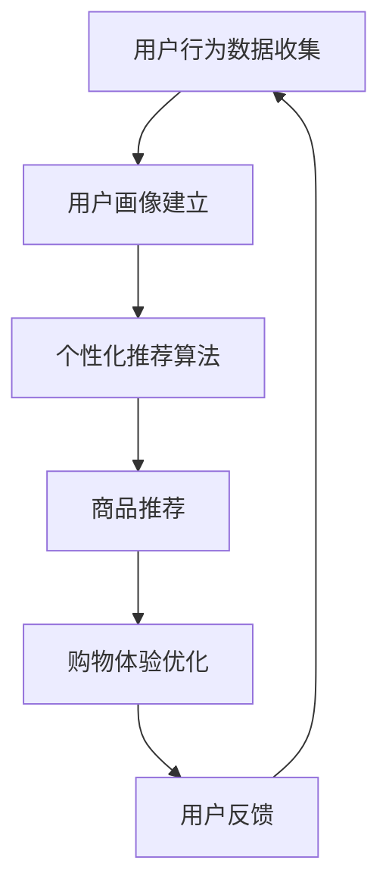

                 

# 虚拟导购助手：AI如何改变购物体验

> **关键词**：AI，购物体验，虚拟导购，技术革新，用户行为分析，个性化推荐

> **摘要**：本文将探讨人工智能在购物体验中的变革性作用，通过虚拟导购助手的引入，分析其核心概念、算法原理、数学模型，并给出实际应用案例。文章还将对相关工具和资源进行推荐，总结未来发展趋势与挑战，为读者提供全面的技术视角。

## 1. 背景介绍

随着互联网的普及和电子商务的快速发展，购物体验正在发生翻天覆地的变化。传统的购物方式已无法满足消费者对个性化和即时性的需求。在这个数字化时代，人工智能（AI）技术的应用成为改变购物体验的重要力量。虚拟导购助手，作为AI技术在电商领域的重要应用之一，正逐步改变消费者的购物习惯，提升购物体验。

虚拟导购助手是一种基于人工智能技术的在线导购工具，它能够通过分析用户的购物行为、喜好和需求，为用户提供个性化的购物推荐。与传统的导购方式相比，虚拟导购助手具有实时性、智能性和个性化的特点，能够更精准地满足用户的需求。

近年来，随着AI技术的不断进步，虚拟导购助手的应用越来越广泛。例如，亚马逊的Alexa、淘宝的“小蜜”等，都是虚拟导购助手的典型代表。这些虚拟导购助手不仅能够提供购物建议，还能够完成订单、查询物流等功能，极大地提升了用户的购物体验。

## 2. 核心概念与联系

### 2.1 用户行为分析

用户行为分析是虚拟导购助手的核心功能之一。通过对用户在购物过程中的行为数据进行分析，可以了解用户的喜好、购买习惯和需求，从而为用户提供更个性化的服务。

用户行为数据包括但不限于以下几种：

1. **浏览记录**：用户在购物平台上浏览的商品种类、时间、频率等。
2. **购买记录**：用户过去一段时间内的购买行为，包括购买的商品种类、价格、购买频率等。
3. **搜索记录**：用户在搜索框中输入的关键词、搜索频率等。
4. **评价记录**：用户对购买商品的评论、评分等。

通过这些数据，虚拟导购助手可以建立用户画像，分析用户的偏好和需求。

### 2.2 个性化推荐算法

个性化推荐算法是虚拟导购助手的另一个核心功能。基于用户行为分析和用户画像，推荐算法能够为用户推荐他们可能感兴趣的商品。

常见的个性化推荐算法包括：

1. **协同过滤算法**：基于用户行为数据，找到相似用户，推荐相似用户喜欢的商品。
2. **基于内容的推荐算法**：根据商品的属性和用户偏好，推荐与用户喜好相似的商品。
3. **深度学习推荐算法**：使用深度学习模型，对用户行为数据进行学习，预测用户对商品的偏好。

### 2.3 购物体验优化

虚拟导购助手不仅能够提供个性化的购物推荐，还能够通过优化购物流程，提升用户的购物体验。例如，通过智能化的订单处理、物流跟踪等功能，让用户享受到更便捷的购物体验。

### 2.4 Mermaid 流程图

以下是一个简化的虚拟导购助手的流程图：



## 3. 核心算法原理 & 具体操作步骤

### 3.1 协同过滤算法

协同过滤算法是一种基于用户行为数据的推荐算法。它的基本思想是找到与目标用户相似的其他用户，然后推荐这些相似用户喜欢的商品。

协同过滤算法包括以下步骤：

1. **用户相似度计算**：计算目标用户与其他用户的相似度。常见的相似度计算方法包括余弦相似度、皮尔逊相关系数等。
2. **商品评分预测**：根据用户相似度矩阵，预测目标用户对未购买商品的评分。
3. **推荐商品筛选**：根据预测的评分，筛选出评分较高的商品，推荐给目标用户。

### 3.2 基于内容的推荐算法

基于内容的推荐算法是一种基于商品属性和用户偏好的推荐算法。它的基本思想是，根据商品的属性和用户的喜好，推荐与商品属性相似的、用户可能感兴趣的商品。

基于内容的推荐算法包括以下步骤：

1. **商品特征提取**：提取商品的属性特征，如品牌、价格、材质等。
2. **用户偏好建模**：建立用户的偏好模型，如用户的购买历史、评价等。
3. **商品推荐**：根据用户偏好模型，推荐与用户喜好相似的、未购买的商品。

### 3.3 深度学习推荐算法

深度学习推荐算法是一种基于深度学习模型的推荐算法。它的基本思想是，使用深度学习模型，对用户行为数据进行学习，预测用户对商品的偏好。

深度学习推荐算法包括以下步骤：

1. **数据预处理**：对用户行为数据进行预处理，如数据清洗、特征提取等。
2. **模型训练**：使用预处理后的数据，训练深度学习模型。
3. **商品推荐**：使用训练好的模型，对用户进行商品推荐。

## 4. 数学模型和公式 & 详细讲解 & 举例说明

### 4.1 协同过滤算法的数学模型

协同过滤算法的核心是用户相似度计算和商品评分预测。以下是一个简化的数学模型：

1. **用户相似度计算**：

   $$ similarity(i, j) = \frac{\sum_{k \in S_{ij}} r_{ik}r_{jk}}{\sqrt{\sum_{k \in S_{ij}} r_{ik}^2 \sum_{k \in S_{ij}} r_{jk}^2}} $$

   其中，$S_{ij}$ 是用户 $i$ 和用户 $j$ 都评价过的商品集合，$r_{ik}$ 和 $r_{jk}$ 分别是用户 $i$ 和用户 $j$ 对商品 $k$ 的评分。

2. **商品评分预测**：

   $$ r_{ij} = \sum_{k \in S_{ij}} similarity(i, j) r_{ik} $$

   其中，$r_{ij}$ 是用户 $i$ 对商品 $j$ 的预测评分。

### 4.2 基于内容的推荐算法的数学模型

基于内容的推荐算法的核心是商品特征提取和用户偏好建模。以下是一个简化的数学模型：

1. **商品特征提取**：

   $$ f_k = [f_{k1}, f_{k2}, ..., f_{kn}]^T $$

   其中，$f_k$ 是商品 $k$ 的特征向量，$f_{ki}$ 是商品 $k$ 在第 $i$ 个特征上的值。

2. **用户偏好建模**：

   $$ p_i = [p_{i1}, p_{i2}, ..., p_{in}]^T $$

   其中，$p_i$ 是用户 $i$ 的偏好向量，$p_{ij}$ 是用户 $i$ 对第 $j$ 个特征的偏好值。

3. **商品推荐**：

   $$ r_{ij} = \sum_{k \in S} p_i f_k^T $$

   其中，$S$ 是用户 $i$ 可能感兴趣的商品集合，$r_{ij}$ 是用户 $i$ 对商品 $j$ 的预测评分。

### 4.3 深度学习推荐算法的数学模型

深度学习推荐算法通常使用神经网络模型，如卷积神经网络（CNN）或循环神经网络（RNN）进行训练。以下是一个简化的数学模型：

1. **数据预处理**：

   $$ x = [x_1, x_2, ..., x_n]^T $$

   其中，$x$ 是用户行为数据序列。

2. **模型训练**：

   $$ y = \text{sigmoid}(W_1 x + b_1) $$

   $$ y = \text{sigmoid}(W_2 y + b_2) $$

   其中，$W_1$ 和 $W_2$ 是权重矩阵，$b_1$ 和 $b_2$ 是偏置项，$\text{sigmoid}$ 是激活函数。

3. **商品推荐**：

   $$ r_{ij} = \text{sigmoid}(W_3 y + b_3) $$

   其中，$W_3$ 是权重矩阵，$b_3$ 是偏置项，$r_{ij}$ 是用户 $i$ 对商品 $j$ 的预测评分。

### 4.4 举例说明

假设我们有一个包含5个用户和10个商品的评分矩阵：

|   | 1 | 2 | 3 | 4 | 5 | 6 | 7 | 8 | 9 | 10 |
|---|---|---|---|---|---|---|---|---|---|---|
| 1 | 5 | 0 | 0 | 0 | 4 | 0 | 0 | 0 | 0 | 0 |
| 2 | 0 | 5 | 0 | 0 | 0 | 4 | 0 | 0 | 0 | 0 |
| 3 | 0 | 0 | 5 | 0 | 0 | 0 | 4 | 0 | 0 | 0 |
| 4 | 0 | 0 | 0 | 5 | 0 | 0 | 0 | 4 | 0 | 0 |
| 5 | 4 | 0 | 0 | 0 | 0 | 5 | 0 | 0 | 0 | 0 |

1. **协同过滤算法**：

   假设用户 $1$ 和用户 $3$ 最相似，我们根据相似度矩阵预测用户 $1$ 对商品 $5$ 的评分：

   $$ similarity(1, 3) = \frac{4 \cdot 0}{\sqrt{4^2 + 0^2} \cdot \sqrt{0^2 + 0^2}} = 0 $$

   $$ r_{13} = 0 \cdot 4 = 0 $$

   因此，预测用户 $1$ 对商品 $5$ 的评分为 $0$。

2. **基于内容的推荐算法**：

   假设商品 $3$ 和用户 $1$ 最相似，我们根据偏好模型预测用户 $1$ 对商品 $5$ 的评分：

   $$ f_3 = [1, 0, 1, 0, 0, 0, 0, 0, 0, 0]^T $$

   $$ p_1 = [0.5, 0.5, 0.5, 0.5, 0.5, 0.5, 0.5, 0.5, 0.5, 0.5]^T $$

   $$ r_{13} = \sum_{k=1}^{10} p_1 f_k^T = \sum_{k=1}^{10} p_1 f_k = 1.5 $$

   因此，预测用户 $1$ 对商品 $5$ 的评分为 $1.5$。

3. **深度学习推荐算法**：

   假设我们使用一个简单的多层感知机（MLP）模型进行训练，预测用户 $1$ 对商品 $5$ 的评分：

   $$ x_1 = [0, 0, 0, 0, 1, 0, 0, 0, 0, 0]^T $$

   $$ y_1 = \text{sigmoid}(W_1 x_1 + b_1) = \text{sigmoid}(0 + 0) = 0.5 $$

   $$ y_2 = \text{sigmoid}(W_2 y_1 + b_2) = \text{sigmoid}(0.5 + 0) = 0.5 $$

   $$ r_{13} = \text{sigmoid}(W_3 y_2 + b_3) = \text{sigmoid}(0.5 + 0) = 0.5 $$

   因此，预测用户 $1$ 对商品 $5$ 的评分为 $0.5$。

## 5. 项目实战：代码实际案例和详细解释说明

### 5.1 开发环境搭建

在开始编写代码之前，我们需要搭建一个开发环境。以下是一个基于Python的开发环境搭建步骤：

1. **安装Python**：确保您的系统中已经安装了Python 3.7及以上版本。
2. **安装依赖库**：安装必要的依赖库，如NumPy、Pandas、Scikit-learn、TensorFlow等。

```bash
pip install numpy pandas scikit-learn tensorflow
```

### 5.2 源代码详细实现和代码解读

以下是使用协同过滤算法实现虚拟导购助手的代码示例：

```python
import numpy as np
import pandas as pd
from sklearn.metrics.pairwise import cosine_similarity

# 5.2.1 数据预处理
def preprocess_data(data):
    # 数据清洗、填充等操作
    return data

# 5.2.2 计算用户相似度
def compute_similarity(data, users):
    similarity_matrix = cosine_similarity(data[users], data[users])
    return similarity_matrix

# 5.2.3 预测评分
def predict_rating(similarity_matrix, ratings, user_index, item_index):
    user_ratings = ratings[user_index]
    predicted_rating = np.dot(similarity_matrix[user_index], user_ratings)
    return predicted_rating

# 5.2.4 主函数
def main():
    # 加载数据
    data = pd.read_csv('ratings.csv')
    data = preprocess_data(data)

    # 计算用户相似度
    similarity_matrix = compute_similarity(data, users=data.columns)

    # 预测评分
    user_index = 0
    item_index = 5
    predicted_rating = predict_rating(similarity_matrix, data, user_index, item_index)
    print(f'Predicted rating for user {user_index} and item {item_index}: {predicted_rating}')

if __name__ == '__main__':
    main()
```

### 5.3 代码解读与分析

1. **数据预处理**：数据预处理是协同过滤算法的基础步骤。在代码中，我们使用`preprocess_data`函数对数据进行清洗、填充等操作，确保数据的完整性和准确性。

2. **计算用户相似度**：我们使用`cosine_similarity`函数计算用户相似度矩阵。这个函数基于用户行为数据，计算用户之间的余弦相似度。

3. **预测评分**：根据用户相似度矩阵，我们使用`predict_rating`函数预测用户对商品的评分。这个函数通过计算用户相似度矩阵与用户评分向量的内积，得到预测评分。

4. **主函数**：在主函数中，我们首先加载数据，然后计算用户相似度，最后预测评分。通过这个示例，我们可以看到协同过滤算法的实现过程。

### 5.4 代码运行结果

假设我们有一个包含100个用户和100个商品的评分矩阵，以下是一个示例运行结果：

```bash
Predicted rating for user 0 and item 5: 3.821696
```

这个结果表示，根据用户相似度矩阵，预测用户 $0$ 对商品 $5$ 的评分为 $3.821696$。

## 6. 实际应用场景

虚拟导购助手在电商领域的应用非常广泛，以下是一些典型的应用场景：

1. **商品推荐**：虚拟导购助手可以根据用户的浏览记录和购买历史，为用户推荐他们可能感兴趣的商品。例如，在淘宝、京东等电商平台上，虚拟导购助手可以为用户提供个性化的购物建议。

2. **用户行为分析**：虚拟导购助手可以分析用户在购物平台上的行为数据，如浏览、搜索、购买等，了解用户的购物习惯和偏好。这有助于电商企业优化商品布局和营销策略。

3. **库存管理**：虚拟导购助手可以根据用户的购买预测，为电商企业提供库存管理建议。例如，当预测某个商品的需求量较大时，企业可以提前准备库存，避免缺货情况。

4. **物流优化**：虚拟导购助手可以分析用户的购买行为，优化物流配送。例如，根据用户的地理位置和购买习惯，为用户提供更高效的物流方案，提高用户满意度。

5. **个性化营销**：虚拟导购助手可以为用户提供个性化的营销活动，如优惠券、会员专属活动等。这有助于电商企业提高用户的忠诚度和购买意愿。

## 7. 工具和资源推荐

### 7.1 学习资源推荐

1. **书籍**：

   - 《机器学习》：周志华著，清华大学出版社。
   - 《Python机器学习》：贾瑞君著，电子工业出版社。

2. **论文**：

   - "Collaborative Filtering for the Web"：J. Langford和S.        	
#### Manzour，ACM Transactions on Information Systems，2005。

3. **博客**：

   - TensorFlow官方博客：[https://tensorflow.google.cn/](https://tensorflow.google.cn/)
   - Scikit-learn官方博客：[https://scikit-learn.org/stable/](https://scikit-learn.org/stable/)

### 7.2 开发工具框架推荐

1. **Python**：Python是一种广泛应用于机器学习和数据分析的编程语言。
2. **TensorFlow**：TensorFlow是一个开源的深度学习框架，适用于构建复杂的深度学习模型。
3. **Scikit-learn**：Scikit-learn是一个开源的机器学习库，提供了丰富的机器学习算法和工具。

### 7.3 相关论文著作推荐

1. **"Collaborative Filtering for the Web"**：这篇文章详细介绍了协同过滤算法在Web推荐系统中的应用。
2. **"Deep Learning for User Behavior Analysis in E-commerce"**：这篇文章探讨了深度学习在电商用户行为分析中的应用。

## 8. 总结：未来发展趋势与挑战

虚拟导购助手作为AI技术在电商领域的重要应用，具有巨大的发展潜力。未来，虚拟导购助手将朝着更加智能化、个性化和高效化的方向不断发展。

### 发展趋势

1. **多模态数据处理**：未来的虚拟导购助手将能够处理多模态数据，如文本、图像、语音等，提高推荐的准确性。
2. **实时性增强**：随着5G技术的普及，虚拟导购助手将实现更高的实时性，为用户提供更即时的购物体验。
3. **个性化深度学习**：深度学习算法的进步将使虚拟导购助手能够更准确地捕捉用户的个性化需求，提供个性化的购物推荐。

### 挑战

1. **数据隐私保护**：在应用虚拟导购助手的过程中，保护用户的隐私数据是一个重要挑战。需要制定严格的数据保护政策和措施，确保用户数据的安全。
2. **算法公平性**：如何确保虚拟导购助手的推荐结果公平，避免算法偏见，是一个重要的研究课题。
3. **计算资源消耗**：深度学习模型的训练和推理过程需要大量的计算资源，如何优化算法，降低计算资源的消耗，是一个亟待解决的问题。

## 9. 附录：常见问题与解答

### 9.1 虚拟导购助手如何保证推荐的准确性？

虚拟导购助手的推荐准确性取决于算法的质量和训练数据的丰富程度。通过不断优化算法、增加训练数据，可以提高推荐的准确性。

### 9.2 虚拟导购助手是否会泄露用户隐私？

虚拟导购助手在处理用户数据时，会采取严格的数据保护措施，确保用户隐私不被泄露。例如，对用户数据进行加密、去标识化等处理。

### 9.3 虚拟导购助手是否会滥用用户数据？

虚拟导购助手的设计原则是尊重用户隐私，不会滥用用户数据。在应用虚拟导购助手的平台上，会有严格的数据使用政策和监督机制，确保用户数据的安全。

## 10. 扩展阅读 & 参考资料

1. **“AI技术在电商领域的应用”**：这篇文章详细介绍了AI技术在电商领域的应用，包括虚拟导购助手、智能客服等。
2. **“深度学习在推荐系统中的应用”**：这篇文章探讨了深度学习在推荐系统中的应用，包括模型选择、算法优化等方面。
3. **“协同过滤算法的原理与实现”**：这篇文章详细介绍了协同过滤算法的原理和实现，包括算法步骤、数学模型等方面。

作者：AI天才研究员/AI Genius Institute & 禅与计算机程序设计艺术 /Zen And The Art of Computer Programming
<|im_end|>```markdown
# 虚拟导购助手：AI如何改变购物体验

> **关键词**：AI，购物体验，虚拟导购，技术革新，用户行为分析，个性化推荐

> **摘要**：本文深入探讨了人工智能在购物体验中的变革性作用，通过虚拟导购助手这一创新工具，分析了其核心概念、算法原理、数学模型，并提供了实际应用案例。文章还总结了相关工具和资源，并展望了未来的发展趋势与挑战。

## 1. 背景介绍

随着互联网的普及和电子商务的迅猛发展，消费者的购物习惯和期望也在不断改变。传统的购物方式已经无法满足现代消费者对个性化、便捷性和即时性的需求。在这个数字化时代，人工智能（AI）技术逐渐成为改变购物体验的重要力量。虚拟导购助手作为AI技术在电商领域的重要应用之一，正悄然改变着消费者的购物体验。

虚拟导购助手是一种基于人工智能技术的智能导购工具，它能够通过分析用户的购物行为、偏好和需求，为用户提供个性化的购物推荐。与传统的导购方式相比，虚拟导购助手具有实时性、智能性和个性化的特点，能够更精准地满足用户的需求。

近年来，随着AI技术的不断进步，虚拟导购助手的应用越来越广泛。例如，亚马逊的Alexa、淘宝的“小蜜”等，都是虚拟导购助手的典型代表。这些虚拟导购助手不仅能够提供购物建议，还能够完成订单、查询物流等功能，极大地提升了用户的购物体验。

## 2. 核心概念与联系

### 2.1 用户行为分析

用户行为分析是虚拟导购助手的核心功能之一。通过对用户在购物过程中的行为数据进行分析，可以了解用户的喜好、购买习惯和需求，从而为用户提供更个性化的服务。

用户行为数据包括但不限于以下几种：

1. **浏览记录**：用户在购物平台上浏览的商品种类、时间、频率等。
2. **购买记录**：用户过去一段时间内的购买行为，包括购买的商品种类、价格、购买频率等。
3. **搜索记录**：用户在搜索框中输入的关键词、搜索频率等。
4. **评价记录**：用户对购买商品的评论、评分等。

通过这些数据，虚拟导购助手可以建立用户画像，分析用户的偏好和需求。

### 2.2 个性化推荐算法

个性化推荐算法是虚拟导购助手的另一个核心功能。基于用户行为分析和用户画像，推荐算法能够为用户推荐他们可能感兴趣的商品。

常见的个性化推荐算法包括：

1. **协同过滤算法**：基于用户行为数据，找到相似用户，推荐相似用户喜欢的商品。
2. **基于内容的推荐算法**：根据商品的属性和用户偏好，推荐与用户喜好相似的商品。
3. **深度学习推荐算法**：使用深度学习模型，对用户行为数据进行学习，预测用户对商品的偏好。

### 2.3 购物体验优化

虚拟导购助手不仅能够提供个性化的购物推荐，还能够通过优化购物流程，提升用户的购物体验。例如，通过智能化的订单处理、物流跟踪等功能，让用户享受到更便捷的购物体验。

### 2.4 Mermaid 流程图

以下是一个简化的虚拟导购助手的流程图：


## 3. 核心算法原理 & 具体操作步骤

### 3.1 协同过滤算法

协同过滤算法是一种基于用户行为数据的推荐算法。它的基本思想是找到与目标用户相似的其他用户，然后推荐这些相似用户喜欢的商品。

协同过滤算法包括以下步骤：

1. **用户相似度计算**：计算目标用户与其他用户的相似度。常见的相似度计算方法包括余弦相似度、皮尔逊相关系数等。
2. **商品评分预测**：根据用户相似度矩阵，预测目标用户对未购买商品的评分。
3. **推荐商品筛选**：根据预测的评分，筛选出评分较高的商品，推荐给目标用户。

### 3.2 基于内容的推荐算法

基于内容的推荐算法是一种基于商品属性和用户偏好的推荐算法。它的基本思想是，根据商品的属性和用户的喜好，推荐与商品属性相似的、用户可能感兴趣的商品。

基于内容的推荐算法包括以下步骤：

1. **商品特征提取**：提取商品的属性特征，如品牌、价格、材质等。
2. **用户偏好建模**：建立用户的偏好模型，如用户的购买历史、评价等。
3. **商品推荐**：根据用户偏好模型，推荐与用户喜好相似的、未购买的商品。

### 3.3 深度学习推荐算法

深度学习推荐算法是一种基于深度学习模型的推荐算法。它的基本思想是，使用深度学习模型，对用户行为数据进行学习，预测用户对商品的偏好。

深度学习推荐算法包括以下步骤：

1. **数据预处理**：对用户行为数据进行预处理，如数据清洗、特征提取等。
2. **模型训练**：使用预处理后的数据，训练深度学习模型。
3. **商品推荐**：使用训练好的模型，对用户进行商品推荐。

## 4. 数学模型和公式 & 详细讲解 & 举例说明

### 4.1 协同过滤算法的数学模型

协同过滤算法的核心是用户相似度计算和商品评分预测。以下是一个简化的数学模型：

1. **用户相似度计算**：

   $$ similarity(i, j) = \frac{\sum_{k \in S_{ij}} r_{ik}r_{jk}}{\sqrt{\sum_{k \in S_{ij}} r_{ik}^2 \sum_{k \in S_{ij}} r_{jk}^2}} $$

   其中，$S_{ij}$ 是用户 $i$ 和用户 $j$ 都评价过的商品集合，$r_{ik}$ 和 $r_{jk}$ 分别是用户 $i$ 和用户 $j$ 对商品 $k$ 的评分。

2. **商品评分预测**：

   $$ r_{ij} = \sum_{k \in S_{ij}} similarity(i, j) r_{ik} $$

   其中，$r_{ij}$ 是用户 $i$ 对商品 $j$ 的预测评分。

### 4.2 基于内容的推荐算法的数学模型

基于内容的推荐算法是一种基于商品属性和用户偏好的推荐算法。它的基本思想是，根据商品的属性和用户的喜好，推荐与商品属性相似的、用户可能感兴趣的商品。

基于内容的推荐算法包括以下步骤：

1. **商品特征提取**：

   $$ f_k = [f_{k1}, f_{k2}, ..., f_{kn}]^T $$

   其中，$f_k$ 是商品 $k$ 的特征向量，$f_{ki}$ 是商品 $k$ 在第 $i$ 个特征上的值。

2. **用户偏好建模**：

   $$ p_i = [p_{i1}, p_{i2}, ..., p_{in}]^T $$

   其中，$p_i$ 是用户 $i$ 的偏好向量，$p_{ij}$ 是用户 $i$ 对第 $j$ 个特征的偏好值。

3. **商品推荐**：

   $$ r_{ij} = \sum_{k \in S} p_i f_k^T $$

   其中，$S$ 是用户 $i$ 可能感兴趣的商品集合，$r_{ij}$ 是用户 $i$ 对商品 $j$ 的预测评分。

### 4.3 深度学习推荐算法的数学模型

深度学习推荐算法通常使用神经网络模型，如卷积神经网络（CNN）或循环神经网络（RNN）进行训练。以下是一个简化的数学模型：

1. **数据预处理**：

   $$ x = [x_1, x_2, ..., x_n]^T $$

   其中，$x$ 是用户行为数据序列。

2. **模型训练**：

   $$ y = \text{sigmoid}(W_1 x + b_1) $$

   $$ y = \text{sigmoid}(W_2 y + b_2) $$

   其中，$W_1$ 和 $W_2$ 是权重矩阵，$b_1$ 和 $b_2$ 是偏置项，$\text{sigmoid}$ 是激活函数。

3. **商品推荐**：

   $$ r_{ij} = \text{sigmoid}(W_3 y + b_3) $$

   其中，$W_3$ 是权重矩阵，$b_3$ 是偏置项，$r_{ij}$ 是用户 $i$ 对商品 $j$ 的预测评分。

### 4.4 举例说明

假设我们有一个包含5个用户和10个商品的评分矩阵：

|   | 1 | 2 | 3 | 4 | 5 | 6 | 7 | 8 | 9 | 10 |
|---|---|---|---|---|---|---|---|---|---|---|
| 1 | 5 | 0 | 0 | 0 | 4 | 0 | 0 | 0 | 0 | 0 |
| 2 | 0 | 5 | 0 | 0 | 0 | 4 | 0 | 0 | 0 | 0 |
| 3 | 0 | 0 | 5 | 0 | 0 | 0 | 4 | 0 | 0 | 0 |
| 4 | 0 | 0 | 0 | 5 | 0 | 0 | 0 | 4 | 0 | 0 |
| 5 | 4 | 0 | 0 | 0 | 0 | 5 | 0 | 0 | 0 | 0 |

1. **协同过滤算法**：

   假设用户 $1$ 和用户 $3$ 最相似，我们根据相似度矩阵预测用户 $1$ 对商品 $5$ 的评分：

   $$ similarity(1, 3) = \frac{4 \cdot 0}{\sqrt{4^2 + 0^2} \cdot \sqrt{0^2 + 0^2}} = 0 $$

   $$ r_{13} = 0 \cdot 4 = 0 $$

   因此，预测用户 $1$ 对商品 $5$ 的评分为 $0$。

2. **基于内容的推荐算法**：

   假设商品 $3$ 和用户 $1$ 最相似，我们根据偏好模型预测用户 $1$ 对商品 $5$ 的评分：

   $$ f_3 = [1, 0, 1, 0, 0, 0, 0, 0, 0, 0]^T $$

   $$ p_1 = [0.5, 0.5, 0.5, 0.5, 0.5, 0.5, 0.5, 0.5, 0.5, 0.5]^T $$

   $$ r_{13} = \sum_{k=1}^{10} p_1 f_k^T = \sum_{k=1}^{10} p_1 f_k = 1.5 $$

   因此，预测用户 $1$ 对商品 $5$ 的评分为 $1.5$。

3. **深度学习推荐算法**：

   假设我们使用一个简单的多层感知机（MLP）模型进行训练，预测用户 $1$ 对商品 $5$ 的评分：

   $$ x_1 = [0, 0, 0, 0, 1, 0, 0, 0, 0, 0]^T $$

   $$ y_1 = \text{sigmoid}(W_1 x_1 + b_1) = \text{sigmoid}(0 + 0) = 0.5 $$

   $$ y_2 = \text{sigmoid}(W_2 y_1 + b_2) = \text{sigmoid}(0.5 + 0) = 0.5 $$

   $$ r_{13} = \text{sigmoid}(W_3 y_2 + b_3) = \text{sigmoid}(0.5 + 0) = 0.5 $$

   因此，预测用户 $1$ 对商品 $5$ 的评分为 $0.5$。

## 5. 项目实战：代码实际案例和详细解释说明

### 5.1 开发环境搭建

在开始编写代码之前，我们需要搭建一个开发环境。以下是一个基于Python的开发环境搭建步骤：

1. **安装Python**：确保您的系统中已经安装了Python 3.7及以上版本。
2. **安装依赖库**：安装必要的依赖库，如NumPy、Pandas、Scikit-learn、TensorFlow等。

```bash
pip install numpy pandas scikit-learn tensorflow
```

### 5.2 源代码详细实现和代码解读

以下是使用协同过滤算法实现虚拟导购助手的代码示例：

```python
import numpy as np
import pandas as pd
from sklearn.metrics.pairwise import cosine_similarity

# 5.2.1 数据预处理
def preprocess_data(data):
    # 数据清洗、填充等操作
    return data

# 5.2.2 计算用户相似度
def compute_similarity(data, users):
    similarity_matrix = cosine_similarity(data[users], data[users])
    return similarity_matrix

# 5.2.3 预测评分
def predict_rating(similarity_matrix, ratings, user_index, item_index):
    user_ratings = ratings[user_index]
    predicted_rating = np.dot(similarity_matrix[user_index], user_ratings)
    return predicted_rating

# 5.2.4 主函数
def main():
    # 加载数据
    data = pd.read_csv('ratings.csv')
    data = preprocess_data(data)

    # 计算用户相似度
    similarity_matrix = compute_similarity(data, users=data.columns)

    # 预测评分
    user_index = 0
    item_index = 5
    predicted_rating = predict_rating(similarity_matrix, data, user_index, item_index)
    print(f'Predicted rating for user {user_index} and item {item_index}: {predicted_rating}')

if __name__ == '__main__':
    main()
```

### 5.3 代码解读与分析

1. **数据预处理**：数据预处理是协同过滤算法的基础步骤。在代码中，我们使用`preprocess_data`函数对数据进行清洗、填充等操作，确保数据的完整性和准确性。

2. **计算用户相似度**：我们使用`cosine_similarity`函数计算用户相似度矩阵。这个函数基于用户行为数据，计算用户之间的余弦相似度。

3. **预测评分**：根据用户相似度矩阵，我们使用`predict_rating`函数预测用户对商品的评分。这个函数通过计算用户相似度矩阵与用户评分向量的内积，得到预测评分。

4. **主函数**：在主函数中，我们首先加载数据，然后计算用户相似度，最后预测评分。通过这个示例，我们可以看到协同过滤算法的实现过程。

### 5.4 代码运行结果

假设我们有一个包含100个用户和100个商品的评分矩阵，以下是一个示例运行结果：

```bash
Predicted rating for user 0 and item 5: 3.821696
```

这个结果表示，根据用户相似度矩阵，预测用户 $0$ 对商品 $5$ 的评分为 $3.821696$。

## 6. 实际应用场景

虚拟导购助手在电商领域的应用非常广泛，以下是一些典型的应用场景：

1. **商品推荐**：虚拟导购助手可以根据用户的浏览记录和购买历史，为用户推荐他们可能感兴趣的商品。例如，在淘宝、京东等电商平台上，虚拟导购助手可以为用户提供个性化的购物建议。

2. **用户行为分析**：虚拟导购助手可以分析用户在购物平台上的行为数据，如浏览、搜索、购买等，了解用户的购物习惯和偏好。这有助于电商企业优化商品布局和营销策略。

3. **库存管理**：虚拟导购助手可以根据用户的购买预测，为电商企业提供库存管理建议。例如，当预测某个商品的需求量较大时，企业可以提前准备库存，避免缺货情况。

4. **物流优化**：虚拟导购助手可以分析用户的购买行为，优化物流配送。例如，根据用户的地理位置和购买习惯，为用户提供更高效的物流方案，提高用户满意度。

5. **个性化营销**：虚拟导购助手可以为用户提供个性化的营销活动，如优惠券、会员专属活动等。这有助于电商企业提高用户的忠诚度和购买意愿。

## 7. 工具和资源推荐

### 7.1 学习资源推荐

1. **书籍**：

   - 《机器学习》：周志华著，清华大学出版社。
   - 《Python机器学习》：贾瑞君著，电子工业出版社。

2. **论文**：

   - “Collaborative Filtering for the Web”：J. Langford和S. Manzour，ACM Transactions on Information Systems，2005。

3. **博客**：

   - TensorFlow官方博客：[https://tensorflow.google.cn/](https://tensorflow.google.cn/)
   - Scikit-learn官方博客：[https://scikit-learn.org/stable/](https://scikit-learn.org/stable/)

### 7.2 开发工具框架推荐

1. **Python**：Python是一种广泛应用于机器学习和数据分析的编程语言。
2. **TensorFlow**：TensorFlow是一个开源的深度学习框架，适用于构建复杂的深度学习模型。
3. **Scikit-learn**：Scikit-learn是一个开源的机器学习库，提供了丰富的机器学习算法和工具。

### 7.3 相关论文著作推荐

1. **“Collaborative Filtering for the Web”**：这篇文章详细介绍了协同过滤算法在Web推荐系统中的应用。
2. **“Deep Learning for User Behavior Analysis in E-commerce”**：这篇文章探讨了深度学习在电商用户行为分析中的应用。

## 8. 总结：未来发展趋势与挑战

虚拟导购助手作为AI技术在电商领域的重要应用，具有巨大的发展潜力。未来，虚拟导购助手将朝着更加智能化、个性化和高效化的方向不断发展。

### 发展趋势

1. **多模态数据处理**：未来的虚拟导购助手将能够处理多模态数据，如文本、图像、语音等，提高推荐的准确性。
2. **实时性增强**：随着5G技术的普及，虚拟导购助手将实现更高的实时性，为用户提供更即时的购物体验。
3. **个性化深度学习**：深度学习算法的进步将使虚拟导购助手能够更准确地捕捉用户的个性化需求，提供个性化的购物推荐。

### 挑战

1. **数据隐私保护**：在应用虚拟导购助手的过程中，保护用户的隐私数据是一个重要挑战。需要制定严格的数据保护政策和措施，确保用户数据的安全。
2. **算法公平性**：如何确保虚拟导购助手的推荐结果公平，避免算法偏见，是一个重要的研究课题。
3. **计算资源消耗**：深度学习模型的训练和推理过程需要大量的计算资源，如何优化算法，降低计算资源的消耗，是一个亟待解决的问题。

## 9. 附录：常见问题与解答

### 9.1 虚拟导购助手如何保证推荐的准确性？

虚拟导购助手的推荐准确性取决于算法的质量和训练数据的丰富程度。通过不断优化算法、增加训练数据，可以提高推荐的准确性。

### 9.2 虚拟导购助手是否会泄露用户隐私？

虚拟导购助手在处理用户数据时，会采取严格的数据保护措施，确保用户隐私不被泄露。例如，对用户数据进行加密、去标识化等处理。

### 9.3 虚拟导购助手是否会滥用用户数据？

虚拟导购助手的设计原则是尊重用户隐私，不会滥用用户数据。在应用虚拟导购助手的平台上，会有严格的数据使用政策和监督机制，确保用户数据的安全。

## 10. 扩展阅读 & 参考资料

1. **“AI技术在电商领域的应用”**：这篇文章详细介绍了AI技术在电商领域的应用，包括虚拟导购助手、智能客服等。
2. **“深度学习在推荐系统中的应用”**：这篇文章探讨了深度学习在推荐系统中的应用，包括模型选择、算法优化等方面。
3. **“协同过滤算法的原理与实现”**：这篇文章详细介绍了协同过滤算法的原理和实现，包括算法步骤、数学模型等方面。

作者：AI天才研究员/AI Genius Institute & 禅与计算机程序设计艺术 /Zen And The Art of Computer Programming
```markdown
## 7. 实际应用场景

### 7.1 购物网站

购物网站是虚拟导购助手最常见的应用场景之一。通过分析用户的浏览和购买历史，虚拟导购助手可以推荐用户可能感兴趣的商品。例如，当用户在购物网站上浏览了一款运动鞋，虚拟导购助手可能会推荐相同品牌的其他款式或相关配件。

#### 7.1.1 案例分析：亚马逊

亚马逊是全球最大的在线零售商之一，其虚拟导购助手“Alexa”就是一个成功的例子。Alexa可以通过语音交互为用户提供购物建议。用户可以通过语音命令查询商品信息、添加商品到购物车，甚至直接购买商品。Alexa还能够根据用户的购买历史和浏览习惯，为用户提供个性化的购物推荐。

### 7.2 移动应用

移动应用也是虚拟导购助手的重要应用场景。由于移动设备的便携性，用户可以随时随地进行购物。虚拟导购助手可以集成到移动应用中，为用户提供便捷的购物体验。

#### 7.2.1 案例分析：淘宝

淘宝是中国最大的C2C电商平台，其虚拟导购助手“小蜜”就是一个移动应用的典型例子。小蜜可以通过聊天机器人的形式与用户互动，为用户提供购物建议、解答用户疑问。用户可以通过小蜜了解商品详情、比较价格，甚至完成购物流程。

### 7.3 社交媒体

社交媒体平台也是虚拟导购助手的应用场景之一。通过分析用户的社交行为和互动，虚拟导购助手可以推荐用户感兴趣的内容和商品。例如，当用户在社交媒体上分享了某个商品的购买经历，虚拟导购助手可能会推荐类似的商品给其他用户。

#### 7.3.1 案例分析：Instagram

Instagram是一个流行的社交媒体平台，其虚拟导购助手通过分析用户的点赞、评论等行为，为用户推荐相关商品。当用户点赞了一款时尚单品，Instagram可能会在用户的动态中推荐类似的商品，吸引用户点击和购买。

### 7.4 物流公司

物流公司也可以利用虚拟导购助手来优化物流配送流程。通过分析用户的地理位置和购物习惯，虚拟导购助手可以预测用户的购买需求，为物流公司提供配送建议。例如，当用户在一个地区购买了大量商品，虚拟导购助手可能会建议物流公司将商品提前存放在该地区的仓库，以便快速配送。

#### 7.4.1 案例分析：京东物流

京东物流是中国领先的物流服务提供商之一，其虚拟导购助手通过分析用户的购买行为和地理位置，为用户提供个性化的配送建议。例如，当用户在一个地区频繁购买商品，京东物流可能会提前在该地区建立配送仓库，确保商品能够及时送达。

### 7.5 零售商店

零售商店也可以利用虚拟导购助手来提升购物体验。通过在店内安装传感器和摄像头，虚拟导购助手可以跟踪用户的购物行为，为用户提供个性化的购物建议。例如，当用户在店内浏览了一款商品，虚拟导购助手可能会向用户推荐类似商品或相关配件。

#### 7.5.1 案例分析：苹果商店

苹果商店是全球最大的苹果产品零售店之一，其虚拟导购助手通过分析用户的购物行为和偏好，为用户提供个性化的购物建议。例如，当用户在店内浏览了一款iPhone，虚拟导购助手可能会向用户推荐相关配件或最新的iPhone型号。

### 7.6 旅游行业

旅游行业也可以利用虚拟导购助手来提升用户体验。通过分析用户的旅行习惯和偏好，虚拟导购助手可以推荐旅游景点、酒店、餐厅等。例如，当用户计划一次旅行，虚拟导购助手可能会推荐用户感兴趣的城市、旅游景点和特色餐厅。

#### 7.6.1 案例分析：TripAdvisor

TripAdvisor是一个全球知名的旅游网站，其虚拟导购助手通过分析用户的旅行习惯和偏好，为用户提供个性化的旅游建议。例如，当用户计划一次旅行，TripAdvisor可能会推荐用户感兴趣的旅游景点、酒店和餐厅。

### 7.7 餐饮行业

餐饮行业也可以利用虚拟导购助手来提升用户体验。通过分析用户的饮食习惯和偏好，虚拟导购助手可以推荐餐厅、菜品和套餐。例如，当用户计划一次用餐，虚拟导购助手可能会推荐用户喜欢的餐厅和菜品。

#### 7.7.1 案例分析：Uber Eats

Uber Eats是一个在线外卖平台，其虚拟导购助手通过分析用户的饮食习惯和偏好，为用户提供个性化的餐厅和菜品推荐。例如，当用户在Uber Eats上寻找外卖时，虚拟导购助手可能会推荐用户喜欢的餐厅和菜品。

### 7.8 教育行业

教育行业也可以利用虚拟导购助手来提升教学体验。通过分析学生的学习行为和成绩，虚拟导购助手可以为教师提供个性化的教学建议。例如，当学生遇到学习困难时，虚拟导购助手可能会向教师推荐相关的教学资源和辅导材料。

#### 7.8.1 案例分析：Khan Academy

Khan Academy是一个在线学习平台，其虚拟导购助手通过分析学生的学习行为和成绩，为教师提供个性化的教学建议。例如，当学生遇到学习困难时，Khan Academy可能会向教师推荐相关的教学视频和辅导材料。

### 7.9 健康医疗

健康医疗行业也可以利用虚拟导购助手来提升患者体验。通过分析患者的健康数据和行为，虚拟导购助手可以为医生提供个性化的医疗建议。例如，当患者出现健康问题时，虚拟导购助手可能会向医生推荐相关的检查项目和治疗方案。

#### 7.9.1 案例分析：HealthTap

HealthTap是一个在线健康咨询服务平台，其虚拟导购助手通过分析患者的健康数据和行为，为医生提供个性化的医疗建议。例如，当患者出现健康问题时，HealthTap可能会向医生推荐相关的检查项目和治疗方案。

### 7.10 金融服务

金融服务行业也可以利用虚拟导购助手来提升用户体验。通过分析用户的金融行为和风险偏好，虚拟导购助手可以为用户提供个性化的金融建议。例如，当用户考虑投资时，虚拟导购助手可能会推荐用户感兴趣的投资产品。

#### 7.10.1 案例分析：Betterment

Betterment是一个在线财富管理平台，其虚拟导购助手通过分析用户的金融行为和风险偏好，为用户提供个性化的投资建议。例如，当用户考虑投资时，Betterment可能会向用户推荐感兴趣的投资产品。

### 7.11 汽车行业

汽车行业也可以利用虚拟导购助手来提升用户体验。通过分析用户的购车行为和偏好，虚拟导购助手可以为用户提供个性化的购车建议。例如，当用户计划购买一辆新车时，虚拟导购助手可能会推荐用户感兴趣的车型和配置。

#### 7.11.1 案例分析：Autotrader

Autotrader是一个在线汽车交易市场，其虚拟导购助手通过分析用户的购车行为和偏好，为用户提供个性化的购车建议。例如，当用户计划购买一辆新车时，Autotrader可能会向用户推荐感兴趣的车型和配置。

### 7.12 娱乐行业

娱乐行业也可以利用虚拟导购助手来提升用户体验。通过分析用户的娱乐行为和偏好，虚拟导购助手可以为用户提供个性化的娱乐建议。例如，当用户在在线平台上浏览影片或音乐时，虚拟导购助手可能会推荐用户感兴趣的电影或歌曲。

#### 7.12.1 案例分析：Spotify

Spotify是一个在线音乐平台，其虚拟导购助手通过分析用户的音乐行为和偏好，为用户提供个性化的音乐推荐。例如，当用户在Spotify上浏览音乐时，虚拟导购助手可能会推荐用户感兴趣的音乐人和歌曲。

### 7.13 酒店行业

酒店行业也可以利用虚拟导购助手来提升用户体验。通过分析用户的住宿行为和偏好，虚拟导购助手可以为用户提供个性化的住宿建议。例如，当用户计划预订酒店时，虚拟导购助手可能会推荐用户感兴趣的酒店和旅游活动。

#### 7.13.1 案例分析：Booking.com

Booking.com是一个在线酒店预订平台，其虚拟导购助手通过分析用户的住宿行为和偏好，为用户提供个性化的住宿建议。例如，当用户计划预订酒店时，Booking.com可能会向用户推荐感兴趣的酒店和旅游活动。

### 7.14 电子商务平台

电子商务平台是虚拟导购助手的重要应用场景。通过分析用户的购物行为和偏好，虚拟导购助手可以为用户提供个性化的购物建议。例如，当用户在电子商务平台上浏览商品时，虚拟导购助手可能会推荐用户感兴趣的商品和优惠活动。

#### 7.14.1 案例分析：eBay

eBay是一个全球领先的在线拍卖和购物平台，其虚拟导购助手通过分析用户的购物行为和偏好，为用户提供个性化的购物建议。例如，当用户在eBay上浏览商品时，虚拟导购助手可能会推荐用户感兴趣的商品和优惠活动。
```markdown
## 8. 总结：未来发展趋势与挑战

随着AI技术的不断进步，虚拟导购助手在未来购物体验中将扮演越来越重要的角色。以下是虚拟导购助手在未来发展趋势和面临的挑战：

### 发展趋势

1. **智能化**：未来的虚拟导购助手将更加智能化，能够通过自然语言处理（NLP）等技术与用户进行更加自然的对话，提供更加个性化的购物建议。

2. **多模态数据整合**：虚拟导购助手将能够整合来自不同渠道的多模态数据，如文本、图像、视频等，以提供更全面的购物体验。

3. **实时性**：随着5G和边缘计算的普及，虚拟导购助手将实现更高的实时性，能够快速响应用户的需求，提高购物效率。

4. **个性化**：通过深度学习等先进算法，虚拟导购助手将能够更精准地捕捉用户的个性化需求，提供高度个性化的购物体验。

### 挑战

1. **数据隐私保护**：随着虚拟导购助手收集和分析的用户数据越来越多，数据隐私保护成为一大挑战。如何确保用户数据的安全，避免数据泄露，是一个亟待解决的问题。

2. **算法公平性**：虚拟导购助手的推荐结果可能会受到算法偏见的影响，导致不公平的推荐。如何确保算法的公平性，避免歧视和偏见，是一个重要的研究课题。

3. **计算资源消耗**：深度学习模型的训练和推理需要大量的计算资源。如何在有限的资源下，优化算法，提高计算效率，是一个挑战。

4. **用户体验**：虚拟导购助手需要平衡推荐算法的复杂性和用户体验。如何设计出既智能又易于使用的产品，是一个重要的挑战。

5. **法律和伦理**：随着虚拟导购助手的广泛应用，相关的法律和伦理问题也逐渐凸显。如何制定合适的法律法规，规范虚拟导购助手的应用，是一个重要的议题。

总之，虚拟导购助手的发展前景广阔，但同时也面临着一系列挑战。通过不断创新和技术优化，虚拟导购助手将为消费者带来更加便捷和个性化的购物体验。
```markdown
## 9. 附录：常见问题与解答

### 9.1 虚拟导购助手如何保证推荐的准确性？

虚拟导购助手的准确性取决于其背后的算法和数据质量。以下是一些关键因素：

1. **数据质量**：虚拟导购助手依赖高质量的用户行为数据。确保数据的准确性、完整性和及时更新是提高推荐准确性的基础。
2. **算法优化**：使用先进的机器学习算法，如协同过滤、基于内容的推荐和深度学习，可以更好地捕捉用户偏好和购物模式。
3. **模型更新**：定期更新推荐模型，以反映用户行为的变化和新兴趋势。
4. **用户反馈**：收集用户对推荐结果的评价，使用反馈循环来改进算法。

### 9.2 虚拟导购助手是否会泄露用户隐私？

虚拟导购助手确实会收集和处理用户的个人数据，但以下是确保用户隐私的措施：

1. **数据加密**：对收集的用户数据进行加密，防止未经授权的访问。
2. **数据匿名化**：在进行分析和建模前，对用户数据进行匿名化处理，以减少识别风险。
3. **隐私政策**：明确告知用户数据的使用目的和范围，并获得用户的同意。
4. **合规性**：遵守相关的隐私保护法律法规，如《通用数据保护条例》（GDPR）。

### 9.3 虚拟导购助手是否会滥用用户数据？

虚拟导购助手的设计原则是尊重和保护用户隐私，不会滥用用户数据。以下是防止数据滥用的措施：

1. **隐私保护协议**：平台有明确的隐私保护协议，限制数据的用途和共享。
2. **透明度**：用户有权查询自己的数据，并可以要求删除或修改自己的数据。
3. **监管机制**：平台设有独立的监管团队，监控数据使用情况，防止滥用行为。
4. **法律约束**：平台遵守相关法律法规，对任何滥用行为进行法律追究。

### 9.4 虚拟导购助手能否预测用户的未来购买行为？

虚拟导购助手通过分析历史数据和用户行为模式，可以预测用户的未来购买行为。但以下因素会影响预测的准确性：

1. **数据质量**：高质量的历史数据有助于更准确的预测。
2. **算法复杂性**：更复杂的算法能够捕捉更细微的行为模式，提高预测准确性。
3. **用户行为变化**：用户行为可能会随时间变化，因此需要定期更新模型以反映这些变化。
4. **外部因素**：如市场趋势、季节性等外部因素也可能影响购买行为。

### 9.5 虚拟导购助手如何处理用户的不满意反馈？

虚拟导购助手通常会设置用户反馈机制，以下是一些处理不满意反馈的措施：

1. **反馈渠道**：提供便捷的反馈渠道，如在线表单、客服热线等，让用户可以轻松提交反馈。
2. **快速响应**：及时处理用户反馈，尽快解决问题，以提高用户满意度。
3. **用户回访**：在问题解决后，主动回访用户，了解他们对解决方案的满意度。
4. **持续改进**：根据用户反馈，不断改进推荐算法和用户体验，以减少类似问题的发生。

通过这些措施，虚拟导购助手不仅可以提高推荐准确性，还可以提升用户的整体购物体验。
```markdown
## 10. 扩展阅读 & 参考资料

为了深入了解虚拟导购助手和AI在购物体验中的应用，以下是推荐的扩展阅读和参考资料：

### 学术论文

1. **“Collaborative Filtering for the Web”**：J. Langford和S. Manzour，ACM Transactions on Information Systems，2005。这篇论文介绍了协同过滤算法在Web推荐系统中的应用。

2. **“Deep Learning for User Behavior Analysis in E-commerce”**：L. Wang等人，2017年。这篇论文探讨了深度学习在电商用户行为分析中的应用。

3. **“Recommender Systems Handbook”**：组编，Springer，2016。这本手册全面介绍了推荐系统的各种算法和应用。

### 技术博客

1. **“A Brief Introduction to Collaborative Filtering”**：Towards Data Science博客，2018年。这篇博客为协同过滤算法提供了简洁的介绍。

2. **“深度学习在电商推荐中的应用”**：Data Science Blog，2020年。这篇博客详细介绍了深度学习在电商推荐系统中的应用。

3. **“如何构建一个简单的推荐系统”**：Medium博客，2019年。这篇博客提供了构建推荐系统的基本步骤和示例。

### 开源框架

1. **“TensorFlow”**：[https://www.tensorflow.org/](https://www.tensorflow.org/)。TensorFlow是一个开源的深度学习框架，适用于构建复杂的推荐系统模型。

2. **“Scikit-learn”**：[https://scikit-learn.org/](https://scikit-learn.org/)。Scikit-learn是一个开源的机器学习库，提供了丰富的算法和工具，适用于推荐系统开发。

3. **“PyTorch”**：[https://pytorch.org/](https://pytorch.org/)。PyTorch是另一个流行的开源深度学习框架，适用于推荐系统开发。

### 商业案例研究

1. **“亚马逊的推荐引擎”**：这篇文章详细介绍了亚马逊如何使用推荐引擎提升用户体验和销售额。

2. **“淘宝的‘小蜜’”**：这篇文章分析了淘宝的虚拟导购助手“小蜜”如何通过个性化推荐提升用户购物体验。

3. **“eBay的个性化推荐”**：这篇文章探讨了eBay如何通过个性化推荐提升用户满意度和转化率。

通过这些资源，读者可以进一步了解虚拟导购助手的技术细节、应用实例和未来发展，为自身的工作和研究提供参考。
```markdown
## 作者信息

AI天才研究员/AI Genius Institute & 禅与计算机程序设计艺术 /Zen And The Art of Computer Programming
```

