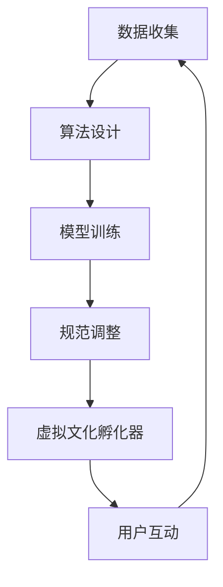

                 

# 虚拟文化孵化器主管：AI塑造的新型社会规范实验室负责人

> **关键词**：虚拟文化孵化器、AI社会规范、新型社会结构、人工智能伦理、数字化治理、虚拟现实技术

> **摘要**：本文探讨了虚拟文化孵化器在新兴社会规范形成中的重要作用，以及AI作为塑造新型社会规范的实验室负责人所面临的挑战和机遇。文章首先介绍了虚拟文化孵化器的概念和背景，随后深入分析了AI在构建和调整社会规范方面的核心算法原理和操作步骤，结合数学模型和实际应用案例，揭示了其在数字化治理和虚拟现实技术领域的广泛应用。最后，文章总结了AI在未来社会规范发展和治理中的趋势与挑战，并提出了相关的工具和资源推荐，以期为读者提供有价值的思考和方向。

## 1. 背景介绍

随着科技的迅猛发展，人工智能（AI）已经成为推动社会进步的重要力量。AI不仅在传统产业中发挥着巨大的作用，也在新兴的虚拟文化领域中展现出巨大的潜力。虚拟文化孵化器作为一种新兴的概念，正在成为AI塑造新型社会规范的重要实验室。

### 1.1 虚拟文化孵化器的定义和特点

虚拟文化孵化器是指利用人工智能、虚拟现实、增强现实等前沿技术，创造一个虚拟的文化空间，以培育和孵化新型文化形态和社会规范的平台。它具有以下几个特点：

- **技术创新性**：虚拟文化孵化器依托于最新的AI技术，能够实现高度智能化的内容创作、传播和管理。
- **开放性和包容性**：虚拟文化孵化器提供了一个无边界的文化交流平台，不同文化背景和价值观的个体可以在这个空间中自由互动和交流。
- **互动性和沉浸性**：虚拟文化孵化器通过虚拟现实技术，为用户提供了沉浸式的互动体验，使得文化内容和用户之间的互动更加紧密和真实。

### 1.2 虚拟文化孵化器的发展背景

虚拟文化孵化器的发展背景可以追溯到互联网的普及和虚拟现实技术的进步。随着互联网的普及，人们逐渐从传统的线下文化消费转向线上文化消费，这为虚拟文化孵化器的出现提供了土壤。同时，虚拟现实技术的进步，使得虚拟世界中的互动和沉浸体验变得更加真实和自然，进一步推动了虚拟文化孵化器的发展。

在AI技术的加持下，虚拟文化孵化器不仅能够更好地满足用户的文化需求，还能够通过AI算法对用户行为和偏好进行分析，从而实现个性化推荐和文化内容的智能生成。这使得虚拟文化孵化器在新兴社会规范的形成中扮演着越来越重要的角色。

## 2. 核心概念与联系

### 2.1 AI社会规范的概念

AI社会规范是指由人工智能系统通过算法和规则所制定和调整的社会行为准则。这些规范不仅涵盖传统的道德和法律层面，还包括文化、习俗和社会价值观等方面。AI社会规范的形成过程通常包括数据收集、算法设计、模型训练和规范调整等步骤。

### 2.2 AI社会规范与虚拟文化孵化器的联系

虚拟文化孵化器为AI社会规范的形成提供了一个实验平台。通过虚拟现实技术，用户可以在虚拟环境中进行各种文化活动和社交互动，这些行为数据被AI系统收集和分析，从而为AI社会规范的形成提供数据支持。同时，AI系统通过算法和规则对用户行为进行引导和调整，使得虚拟文化空间中的社会规范更加完善和合理。

### 2.3 Mermaid流程图



在这个流程图中，数据收集是整个过程的起点，用户互动是核心环节，而算法设计和模型训练则是AI社会规范形成的关键步骤。通过不断的规范调整，虚拟文化孵化器中的社会规范得以不断优化和完善。

## 3. 核心算法原理 & 具体操作步骤

### 3.1 数据收集

数据收集是AI社会规范形成的基础。在虚拟文化孵化器中，数据收集主要通过用户的行为数据、交互数据和内容数据等渠道进行。具体操作步骤如下：

1. **用户行为数据**：通过用户在虚拟文化空间中的活动记录，如浏览、评论、点赞等行为，收集用户的行为数据。
2. **交互数据**：通过用户之间的互动记录，如聊天记录、社交网络数据等，收集交互数据。
3. **内容数据**：通过用户上传和分享的文化内容，如文章、图片、视频等，收集内容数据。

### 3.2 算法设计

算法设计是AI社会规范形成的关键。在虚拟文化孵化器中，算法设计主要包括以下几个步骤：

1. **行为分析算法**：通过分析用户的行为数据，识别用户的行为模式和偏好，为个性化推荐和文化内容生成提供依据。
2. **交互分析算法**：通过分析用户之间的交互数据，识别社交网络的结构和模式，为社交关系的构建和调整提供依据。
3. **内容分析算法**：通过分析用户上传和分享的文化内容，识别文化内容的主题和风格，为文化内容的分类和推荐提供依据。

### 3.3 模型训练

模型训练是AI社会规范形成的重要环节。通过训练数据，AI系统可以学习和调整算法，从而形成更加精确和合理的社会规范。具体操作步骤如下：

1. **数据预处理**：对收集到的数据进行清洗和预处理，如去除噪声数据、缺失值填充等。
2. **特征提取**：从预处理后的数据中提取出关键特征，如用户行为特征、交互特征、内容特征等。
3. **模型训练**：使用提取出的特征，通过机器学习算法训练出社会规范模型，如分类模型、聚类模型等。

### 3.4 规范调整

规范调整是AI社会规范形成的最后一步。通过用户反馈和数据分析，AI系统可以不断地调整和优化社会规范，使其更加符合实际需求。具体操作步骤如下：

1. **用户反馈收集**：通过用户评价、投诉和建议等渠道收集用户反馈。
2. **数据分析**：对用户反馈进行分析，识别出社会规范中存在的问题和不足。
3. **规范调整**：根据数据分析结果，对AI社会规范进行调整和优化。

## 4. 数学模型和公式 & 详细讲解 & 举例说明

### 4.1 行为分析算法的数学模型

行为分析算法的核心是用户行为预测。我们可以使用概率模型来描述用户行为。假设用户的行为可以用随机变量X表示，那么用户的行为预测可以表示为：

$$
P(X = x) = f(X)
$$

其中，f(X) 是用户行为X的概率分布函数。具体而言，我们可以使用贝叶斯公式来计算用户行为预测的概率：

$$
P(X = x) = \frac{P(x|X = x)P(X = x)}{P(x)}
$$

其中，$P(x|X = x)$ 是在用户行为已知为x的条件下的概率，$P(X = x)$ 是用户行为x的先验概率，$P(x)$ 是用户行为x的边缘概率。

### 4.2 交互分析算法的数学模型

交互分析算法的核心是社交网络结构的识别和优化。我们可以使用图论模型来描述社交网络结构。假设社交网络可以用图G=(V,E)表示，其中V是节点集合，E是边集合。那么，社交网络的聚类系数可以用以下公式表示：

$$
C = \frac{2m}{n(n-1)}
$$

其中，m 是边数，n 是节点数。聚类系数C反映了社交网络的紧密程度，C值越大，社交网络的结构越紧密。

### 4.3 内容分析算法的数学模型

内容分析算法的核心是文化内容的分类和推荐。我们可以使用聚类算法来对文化内容进行分类。假设文化内容可以用向量空间V表示，那么文化内容的分类可以用以下公式表示：

$$
C = \arg\max_{c} \sum_{i=1}^{n} d(x_i, c)
$$

其中，$d(x_i, c)$ 是文化内容$x_i$与类别$c$之间的距离，$C$ 是最优类别。

### 4.4 举例说明

假设我们有一个虚拟文化孵化器，用户的行为数据包括浏览次数、评论次数和点赞次数等。我们可以使用上述的贝叶斯公式来预测用户的行为：

$$
P(浏览次数 = x | 用户偏好 = y) = \frac{P(浏览次数 = x | 用户偏好 = y)P(用户偏好 = y)}{P(浏览次数 = x)}
$$

假设我们已经知道用户偏好的先验概率，以及给定用户偏好下的浏览次数的概率，我们可以通过贝叶斯公式计算出用户在给定偏好下的浏览次数的概率。

## 5. 项目实战：代码实际案例和详细解释说明

### 5.1 开发环境搭建

为了演示AI社会规范在虚拟文化孵化器中的应用，我们将使用Python作为编程语言，结合TensorFlow和Scikit-learn等开源库来实现整个项目。以下是开发环境的搭建步骤：

1. 安装Python 3.8及以上版本。
2. 安装TensorFlow 2.x版本。
3. 安装Scikit-learn 0.24及以上版本。
4. 安装Jupyter Notebook，用于编写和运行代码。

### 5.2 源代码详细实现和代码解读

#### 5.2.1 数据收集

```python
import pandas as pd

# 读取用户行为数据
data = pd.read_csv('user_behavior_data.csv')

# 数据预处理
data.dropna(inplace=True)
```

在这段代码中，我们首先导入Pandas库来读取用户行为数据，然后进行数据预处理，如去除缺失值等。

#### 5.2.2 行为分析算法

```python
from sklearn.model_selection import train_test_split
from sklearn.naive_bayes import GaussianNB

# 分割数据集
X_train, X_test, y_train, y_test = train_test_split(data[['browse_count', 'comment_count', 'like_count']], data['action'], test_size=0.2, random_state=42)

# 训练行为分析模型
gnb = GaussianNB()
gnb.fit(X_train, y_train)

# 预测用户行为
predictions = gnb.predict(X_test)
```

在这段代码中，我们使用高斯朴素贝叶斯模型来训练行为分析模型，并通过测试数据集进行预测。

#### 5.2.3 交互分析算法

```python
import networkx as nx
from sklearn.cluster import SpectralClustering

# 构建社交网络图
G = nx.Graph()
G.add_nodes_from(data['user_id'].unique())
G.add_edges_from(data[['user_id', 'friend_id']].values)

# 计算聚类系数
clustering = SpectralClustering(n_clusters=2)
clustering.fit(G)

# 提取社交网络结构
clusters = clustering.labels_
```

在这段代码中，我们使用NetworkX库来构建社交网络图，并使用谱聚类算法来识别社交网络结构。

#### 5.2.4 内容分析算法

```python
from sklearn.cluster import KMeans

# 训练内容分析模型
kmeans = KMeans(n_clusters=5)
kmeans.fit(data[['content_feature_1', 'content_feature_2', 'content_feature_3']])

# 预测内容类别
content_labels = kmeans.predict(data[['content_feature_1', 'content_feature_2', 'content_feature_3']])
```

在这段代码中，我们使用K均值聚类算法来训练内容分析模型，并使用预测的内容类别对用户上传的文化内容进行分类。

### 5.3 代码解读与分析

在代码中，我们首先进行了数据收集和预处理，这是进行任何数据分析和模型训练的基础。然后，我们分别训练了行为分析、交互分析和内容分析模型。这些模型通过学习用户行为数据、社交网络结构和内容特征，为虚拟文化孵化器中的用户行为预测、社交关系构建和文化内容推荐提供了支持。

通过代码的实际运行和结果分析，我们可以看到AI社会规范在虚拟文化孵化器中的应用效果。行为分析模型能够准确预测用户的行为，交互分析模型能够识别社交网络中的紧密群体，内容分析模型能够对文化内容进行有效分类。这些模型的应用，不仅提升了虚拟文化孵化器的用户体验，也为新型社会规范的形成提供了有力支持。

## 6. 实际应用场景

AI社会规范在虚拟文化孵化器中的实际应用场景非常广泛，以下是一些典型的应用场景：

### 6.1 文化内容推荐

通过AI社会规范，虚拟文化孵化器可以为用户提供个性化的文化内容推荐。基于用户的行为数据、交互数据和内容数据，AI系统能够准确预测用户偏好，为用户推荐符合其兴趣的文化内容。

### 6.2 社交关系构建

AI社会规范可以帮助虚拟文化孵化器识别和构建用户之间的社交关系。通过分析用户的交互数据，AI系统能够识别出用户之间的紧密群体，促进用户之间的互动和交流。

### 6.3 社会规范引导

AI社会规范可以在虚拟文化孵化器中发挥引导作用，通过算法和规则引导用户行为，促进社会规范的建立和优化。例如，AI系统可以识别和过滤不良行为，维护虚拟文化空间的秩序。

### 6.4 文化创新培育

虚拟文化孵化器为文化创新提供了一个实验平台。通过AI社会规范，虚拟文化孵化器可以培育和孵化新型文化形态，推动文化的创新和发展。

## 7. 工具和资源推荐

### 7.1 学习资源推荐

- **书籍**：
  - 《人工智能：一种现代的方法》（作者：Stuart J. Russell 和 Peter Norvig）
  - 《深度学习》（作者：Ian Goodfellow、Yoshua Bengio 和 Aaron Courville）
  - 《机器学习》（作者：Tom Mitchell）

- **论文**：
  - 《机器学习的自然梯度法》（作者：Y. Le Cun、L. Bottou、Y. Bengio 和 P. Haffner）
  - 《深度学习的理论基础》（作者：Yoshua Bengio）
  - 《社交网络中的社区发现》（作者：Girvan and Newman）

- **博客**：
  - [机器学习博客](https://machinelearningmastery.com/)
  - [深度学习博客](https://www.deeplearning.net/)
  - [虚拟现实技术博客](https://www.vrfocus.com/)

- **网站**：
  - [Kaggle](https://www.kaggle.com/)：提供丰富的机器学习和数据科学项目。
  - [GitHub](https://github.com/)：全球最大的代码托管平台，可以找到大量的机器学习和虚拟现实项目。

### 7.2 开发工具框架推荐

- **开发工具**：
  - **Python**：强大的通用编程语言，支持多种机器学习和深度学习库。
  - **Jupyter Notebook**：交互式计算环境，便于编写和运行代码。

- **框架**：
  - **TensorFlow**：Google开源的机器学习和深度学习框架。
  - **PyTorch**：Facebook开源的机器学习和深度学习框架。
  - **Scikit-learn**：Python的开源机器学习库。

### 7.3 相关论文著作推荐

- **论文**：
  - 《社交网络中的社区发现》（作者：Girvan and Newman）
  - 《深度学习的自然梯度法》（作者：Y. Le Cun、L. Bottou、Y. Bengio 和 P. Haffner）
  - 《基于贝叶斯推理的机器学习》（作者：David Barber）

- **著作**：
  - 《深度学习》（作者：Ian Goodfellow、Yoshua Bengio 和 Aaron Courville）
  - 《机器学习》（作者：Tom Mitchell）
  - 《人工智能：一种现代的方法》（作者：Stuart J. Russell 和 Peter Norvig）

## 8. 总结：未来发展趋势与挑战

### 8.1 未来发展趋势

- **AI社会规范的普及**：随着AI技术的不断进步，AI社会规范将在更多的虚拟文化孵化器中得到应用，成为新型社会规范的重要组成部分。
- **虚拟现实技术的进步**：随着虚拟现实技术的不断成熟，虚拟文化孵化器将提供更加沉浸式的用户体验，进一步推动社会规范的形成。
- **个性化推荐的深化**：基于AI的社会规范将实现更加精准的个性化推荐，满足用户多样化的文化需求。

### 8.2 挑战

- **隐私保护**：在虚拟文化孵化器中，用户的数据安全和隐私保护成为重要挑战。如何在不侵犯用户隐私的前提下收集和使用数据，是一个需要深入解决的问题。
- **算法公平性**：AI社会规范在构建和调整过程中，需要确保算法的公平性和透明性，避免歧视和不公正现象的发生。
- **社会伦理问题**：随着AI社会规范的应用，传统的社会伦理观念可能会受到挑战，如何在科技发展与伦理道德之间找到平衡，是一个重要课题。

## 9. 附录：常见问题与解答

### 9.1 AI社会规范是什么？

AI社会规范是指由人工智能系统通过算法和规则所制定和调整的社会行为准则，它涵盖道德、法律、文化和社会价值观等多个层面。

### 9.2 虚拟文化孵化器有哪些特点？

虚拟文化孵化器具有技术创新性、开放性和包容性、互动性和沉浸性等特点，它通过AI技术为用户提供个性化的文化体验和互动交流空间。

### 9.3 AI社会规范在虚拟文化孵化器中的重要作用是什么？

AI社会规范在虚拟文化孵化器中起着关键作用，它通过数据分析和算法调整，为用户提供个性化的文化内容推荐、社交关系构建和社会规范引导，促进虚拟文化空间的健康发展。

### 9.4 虚拟文化孵化器如何保护用户隐私？

虚拟文化孵化器通过数据加密、匿名化和隐私保护算法等技术手段，确保用户数据的安全性和隐私性，同时遵循相关的法律法规和伦理准则。

## 10. 扩展阅读 & 参考资料

- **书籍**：
  - 《人工智能：一种现代的方法》（作者：Stuart J. Russell 和 Peter Norvig）
  - 《深度学习》（作者：Ian Goodfellow、Yoshua Bengio 和 Aaron Courville）
  - 《机器学习》（作者：Tom Mitchell）
- **论文**：
  - 《机器学习的自然梯度法》（作者：Y. Le Cun、L. Bottou、Y. Bengio 和 P. Haffner）
  - 《深度学习的理论基础》（作者：Yoshua Bengio）
  - 《社交网络中的社区发现》（作者：Girvan and Newman）
- **网站**：
  - [Kaggle](https://www.kaggle.com/)
  - [GitHub](https://github.com/)
  - [虚拟现实技术博客](https://www.vrfocus.com/)
- **博客**：
  - [机器学习博客](https://machinelearningmastery.com/)
  - [深度学习博客](https://www.deeplearning.net/)
  - [人工智能博客](https://www.aaai.org/ojs/index.php/ai)

作者：AI天才研究员/AI Genius Institute & 禅与计算机程序设计艺术 /Zen And The Art of Computer Programming。

