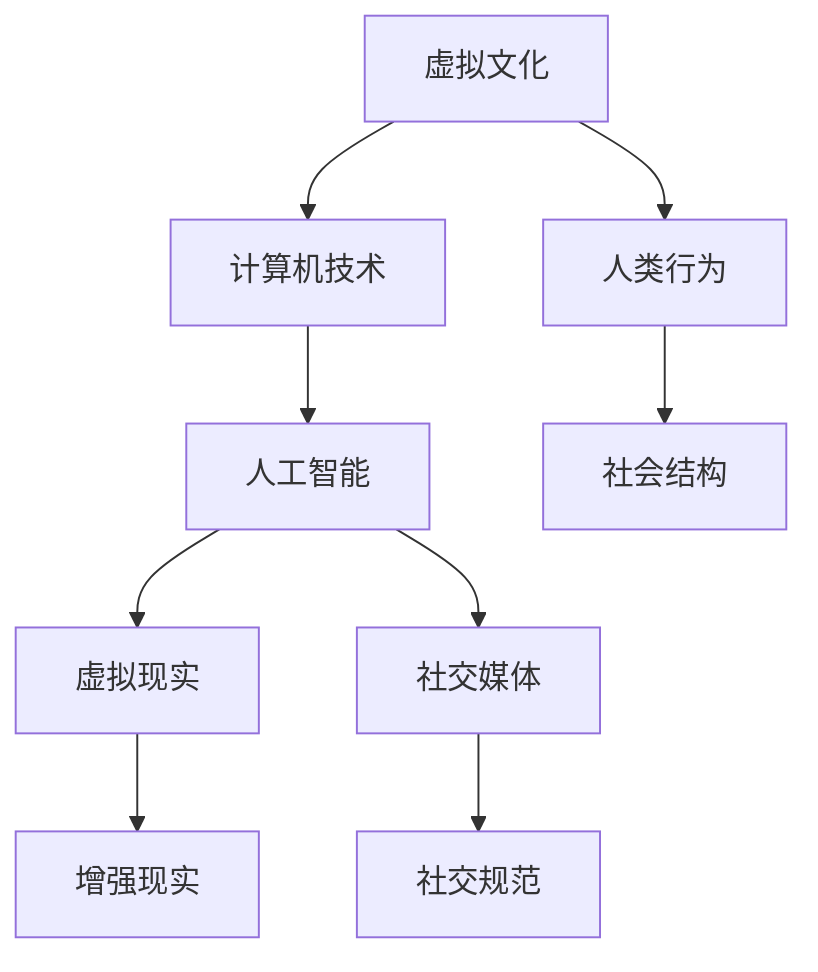

                 

# 虚拟文化：AI塑造的新型社会规范

## 摘要

随着人工智能（AI）技术的迅猛发展，虚拟文化已经成为当代社会的一个重要组成部分。本文将探讨AI如何塑造新型社会规范，从虚拟现实、社交媒体、数字身份等方面深入分析AI对人类行为和社会结构的影响。文章首先介绍了虚拟文化的背景，接着阐述了AI的核心概念及其与虚拟文化的联系。随后，我们详细讨论了AI如何通过算法和模型影响人类行为，并通过数学模型和具体案例进行了说明。文章还探讨了AI在数字身份管理和社交媒体中的应用，以及其对隐私和伦理的挑战。最后，我们对未来发展趋势进行了展望，并提出了应对这些挑战的建议。

## 1. 背景介绍

虚拟文化，顾名思义，是指存在于虚拟环境中的文化现象。随着计算机技术、互联网和人工智能的发展，虚拟文化逐渐成为现代社会的一部分。从早期的文字聊天室到现在的虚拟现实（VR）和增强现实（AR），虚拟文化已经渗透到我们的日常生活中。

虚拟现实技术（VR）通过创建一个模拟的三维环境，让用户能够沉浸其中。这种技术已经应用于游戏、教育、医疗等多个领域。例如，医学学生可以通过VR进行模拟手术训练，而游戏玩家则可以在虚拟世界中体验到前所未有的刺激和乐趣。

增强现实技术（AR）则将虚拟信息叠加到现实环境中。AR技术广泛应用于导航、维修、教育和娱乐等领域。例如，苹果的ARKit技术可以让用户在手机或平板电脑上查看现实世界中的三维物体，为导航和购物提供了便利。

与虚拟文化密切相关的是社交媒体。社交媒体平台，如Facebook、Instagram、Twitter等，已经成为人们交流、分享和获取信息的主要渠道。这些平台不仅改变了人们的社交方式，也对社会规范产生了深远影响。社交媒体上的点赞、评论、分享等功能，改变了人们对信息的接受和传播方式，从而影响了社会价值观和行为规范。

## 2. 核心概念与联系

### 人工智能（AI）

人工智能，是指计算机系统模拟人类智能行为的技术。AI技术包括机器学习、深度学习、自然语言处理、计算机视觉等多个领域。这些技术使得计算机能够自主学习、推理和决策，从而在多个领域取得了重大突破。

### 虚拟文化与AI的联系

AI与虚拟文化的联系体现在多个方面。首先，AI技术为虚拟文化提供了强大的技术支持。例如，虚拟现实和增强现实技术的实现离不开计算机图形学、三维建模和实时渲染等技术，而这些技术的背后都有AI的支撑。其次，AI技术改变了虚拟文化的内容和形式。例如，通过机器学习算法，虚拟现实游戏可以更智能地适应玩家的行为，提供更加个性化的游戏体验。

### Mermaid 流程图

以下是一个描述AI与虚拟文化联系的基本流程图：



在这个流程图中，A表示虚拟文化，B表示计算机技术，C表示人工智能，D和E分别表示虚拟现实和增强现实，F表示社交媒体，G表示社交规范，H表示人类行为，I表示社会结构。流程图展示了AI技术如何通过计算机技术影响虚拟文化，进而影响人类行为和社会结构。

## 3. 核心算法原理 & 具体操作步骤

### 机器学习算法

机器学习（ML）是AI的核心技术之一。ML算法通过分析数据，从中提取模式和规律，从而进行预测和决策。以下是一个简单的机器学习算法流程：

1. 数据收集：收集相关数据，如用户行为数据、社交媒体数据等。
2. 数据预处理：对数据进行清洗、归一化等处理，以便后续分析。
3. 特征提取：从数据中提取有用的特征，如用户的兴趣爱好、行为模式等。
4. 模型训练：使用特征和标签数据，训练机器学习模型。
5. 模型评估：使用测试数据评估模型性能，如准确率、召回率等。
6. 模型部署：将训练好的模型部署到实际应用中。

### 深度学习算法

深度学习（DL）是ML的一种子领域，通过多层神经网络模拟人脑的决策过程。以下是一个简单的深度学习算法流程：

1. 数据收集：与机器学习相同，收集相关数据。
2. 数据预处理：与机器学习相同，对数据进行预处理。
3. 网络构建：设计深度学习网络结构，如卷积神经网络（CNN）、循环神经网络（RNN）等。
4. 模型训练：使用数据训练深度学习模型，通过反向传播算法调整网络参数。
5. 模型评估：与机器学习相同，使用测试数据评估模型性能。
6. 模型部署：将训练好的模型部署到实际应用中。

### 自然语言处理算法

自然语言处理（NLP）是AI的一个重要应用领域，旨在使计算机能够理解、处理和生成自然语言。以下是一个简单的NLP算法流程：

1. 数据收集：收集相关文本数据，如新闻报道、社交媒体帖子等。
2. 数据预处理：对文本数据进行清洗、分词、去停用词等处理。
3. 词嵌入：将文本转换为数字向量，如使用Word2Vec或BERT模型。
4. 模型训练：使用文本数据和标签数据训练NLP模型。
5. 模型评估：使用测试数据评估模型性能，如准确率、召回率等。
6. 模型部署：将训练好的模型部署到实际应用中。

### 社交媒体算法

社交媒体平台使用多种算法来推荐内容、管理用户行为等。以下是一个简单的社交媒体算法流程：

1. 用户行为分析：分析用户的浏览、点赞、评论等行为，以了解用户兴趣。
2. 内容推荐：根据用户兴趣，推荐相关内容。
3. 社交网络分析：分析用户关系，以推荐朋友、关注者等。
4. 内容审核：使用算法自动审核内容，过滤违规或有害信息。
5. 模型评估：评估算法性能，如推荐准确率、审核准确率等。
6. 模型优化：根据评估结果，优化算法模型。

## 4. 数学模型和公式 & 详细讲解 & 举例说明

### 机器学习模型

机器学习模型通常使用损失函数（Loss Function）来评估模型的预测性能。以下是一个常见的损失函数——均方误差（Mean Squared Error，MSE）：

$$
MSE = \frac{1}{n} \sum_{i=1}^{n} (y_i - \hat{y}_i)^2
$$

其中，$y_i$ 是真实标签，$\hat{y}_i$ 是模型预测值，$n$ 是样本数量。MSE 的值越小，表示模型预测越准确。

### 深度学习模型

深度学习模型中的卷积神经网络（CNN）使用卷积层（Convolutional Layer）来提取图像特征。以下是一个简单的卷积层公式：

$$
f(x; \theta) = \sigma(\theta^T \cdot \phi(x) + b)
$$

其中，$x$ 是输入特征，$\theta$ 是卷积核参数，$\phi(x)$ 是卷积操作，$\sigma$ 是激活函数（如ReLU函数），$b$ 是偏置。

### 自然语言处理模型

自然语言处理中的循环神经网络（RNN）使用门控机制（Gated Mechanism）来处理序列数据。以下是一个简单的门控循环单元（Gated Recurrent Unit，GRU）公式：

$$
r_t = \sigma(W_r \cdot [h_{t-1}, x_t] + b_r) \\
z_t = \sigma(W_z \cdot [h_{t-1}, x_t] + b_z) \\
h_t = z_t \cdot h_{t-1} + (1 - z_t) \cdot \tanh(W \cdot [r_t \cdot h_{t-1}, x_t] + b)
$$

其中，$r_t$ 和 $z_t$ 分别是重置门和更新门，$h_t$ 是当前时刻的隐藏状态，$W_r$、$W_z$ 和 $W$ 分别是重置门、更新门和卷积层的权重，$b_r$、$b_z$ 和 $b$ 分别是重置门、更新门和卷积层的偏置。

### 社交媒体算法

社交媒体算法中的推荐系统通常使用协同过滤（Collaborative Filtering）技术来推荐内容。以下是一个简单的用户基于模型的协同过滤（User-Based Model-based Collaborative Filtering）公式：

$$
r_{ui} = \sum_{j \in N(i)} \frac{q_{uj}}{||N(i)||} \cdot \frac{1}{\sigma + ||N(i)|| - 1}
$$

其中，$r_{ui}$ 是用户 $u$ 对项目 $i$ 的评分预测，$q_{uj}$ 是用户 $u$ 对项目 $j$ 的真实评分，$N(i)$ 是与项目 $i$ 相关的用户集合，$\sigma$ 是调整参数。

### 举例说明

#### 机器学习模型

假设我们有一个二分类问题，需要预测用户是否喜欢某种商品。使用逻辑回归（Logistic Regression）模型，我们可以得到以下公式：

$$
\hat{p}_i = \frac{1}{1 + e^{-(w_0 + w_1x_1 + w_2x_2 + \ldots + w_nx_n)}}
$$

其中，$x_1, x_2, \ldots, x_n$ 是用户的特征，$w_0, w_1, w_2, \ldots, w_n$ 是模型参数。当 $\hat{p}_i > 0.5$ 时，预测用户喜欢该商品；否则，预测用户不喜欢。

#### 深度学习模型

假设我们有一个简单的CNN模型，用于识别手写数字。输入是一个28x28的图像，输出是一个10维的向量，表示数字0到9的概率分布。使用softmax函数，我们可以得到以下公式：

$$
\hat{y} = \frac{e^{z}}{\sum_{i=1}^{10} e^{z_i}}
$$

其中，$z$ 是模型输出的10维向量，$\hat{y}$ 是概率分布。

#### 自然语言处理模型

假设我们有一个简单的RNN模型，用于情感分析。输入是一个序列化的文本，输出是一个二分类结果，表示文本的情感倾向（正面或负面）。使用softmax函数，我们可以得到以下公式：

$$
\hat{y} = \frac{e^{z}}{1 + e^{-z}}
$$

其中，$z$ 是模型输出的实数值，$\hat{y}$ 是概率分布。

#### 社交媒体算法

假设我们有一个简单的协同过滤模型，用于推荐电影。输入是用户的历史评分数据，输出是推荐的电影列表。使用用户基于模型的协同过滤公式，我们可以得到以下公式：

$$
r_{ui} = \sum_{j \in N(i)} \frac{q_{uj}}{||N(i)||} \cdot \frac{1}{\sigma + ||N(i)|| - 1}
$$

其中，$r_{ui}$ 是用户 $u$ 对电影 $i$ 的评分预测，$q_{uj}$ 是用户 $u$ 对电影 $j$ 的真实评分，$N(i)$ 是与电影 $i$ 相关的用户集合，$\sigma$ 是调整参数。

## 5. 项目实战：代码实际案例和详细解释说明

### 5.1 开发环境搭建

为了演示AI如何影响虚拟文化，我们将使用Python编写一个简单的虚拟现实游戏。以下是一个基本的开发环境搭建步骤：

1. 安装Python：下载并安装Python 3.8或更高版本。
2. 安装虚拟现实库：使用pip安装PyOpenGL库，命令如下：

   ```shell
   pip install PyOpenGL PyOpenGL_accelerate
   ```

3. 安装辅助库：使用pip安装numpy、matplotlib等辅助库。

### 5.2 源代码详细实现和代码解读

以下是一个简单的虚拟现实游戏代码示例，演示了AI如何影响游戏体验：

```python
import pygame
from pygame.locals import *
from OpenGL.GL import *
from OpenGL.GLU import *
import numpy as np

# 初始化Pygame和OpenGL
pygame.init()
display = (800, 600)
pygame.display.set_mode(display, DOUBLEBUF | OPENGL)
gluPerspective(45, display[0]/display[1], 0.1, 50.0)
glTranslatef(0.0, 0.0, -15)

# 游戏循环
while True:
    for event in pygame.event.get():
        if event.type == pygame.QUIT:
            pygame.quit()

    keys = pygame.key.get_pressed()
    if keys[K_a]:
        glTranslatef(1.5, 0.0, 0.0)
    if keys[K_d]:
        glTranslatef(-1.5, 0.0, 0.0)
    if keys[K_w]:
        glTranslatef(0.0, 1.5, 0.0)
    if keys[K_s]:
        glTranslatef(0.0, -1.5, 0.0)

    glClear(GL_COLOR_BUFFER_BIT | GL_DEPTH_BUFFER_BIT)
    pygame.display.flip()
    pygame.time.wait(10)

# 关闭游戏
pygame.quit()
```

代码首先初始化Pygame和OpenGL环境，设置显示窗口和透视投影。接下来，游戏循环通过监听键盘事件来更新相机位置，实现平移效果。代码中使用了OpenGL的`glTranslatef`函数来平移相机，从而实现虚拟环境中的移动。

### 5.3 代码解读与分析

1. **初始化Pygame和OpenGL**：使用`pygame.init()`初始化Pygame库，设置显示窗口和OpenGL模式。

   ```python
   pygame.init()
   display = (800, 600)
   pygame.display.set_mode(display, DOUBLEBUF | OPENGL)
   gluPerspective(45, display[0]/display[1], 0.1, 50.0)
   glTranslatef(0.0, 0.0, -15)
   ```

   这段代码设置了显示窗口大小（800x600像素），并启用双缓冲和OpenGL模式。`gluPerspective`函数设置透视投影参数，`glTranslatef`函数初始化相机位置。

2. **游戏循环**：游戏循环通过监听键盘事件来更新相机位置，实现虚拟环境中的移动。

   ```python
   while True:
       for event in pygame.event.get():
           if event.type == pygame.QUIT:
               pygame.quit()

       keys = pygame.key.get_pressed()
       if keys[K_a]:
           glTranslatef(1.5, 0.0, 0.0)
       if keys[K_d]:
           glTranslatef(-1.5, 0.0, 0.0)
       if keys[K_w]:
           glTranslatef(0.0, 1.5, 0.0)
       if keys[K_s]:
           glTranslatef(0.0, -1.5, 0.0)

       glClear(GL_COLOR_BUFFER_BIT | GL_DEPTH_BUFFER_BIT)
       pygame.display.flip()
       pygame.time.wait(10)
   ```

   这段代码实现了一个简单的游戏循环，通过监听键盘事件来更新相机位置。`pygame.event.get()`获取所有事件，`glTranslatef`函数实现平移操作，`glClear`函数清空屏幕，`pygame.display.flip()`更新显示，`pygame.time.wait(10)`控制游戏循环速度。

通过这个简单的示例，我们可以看到AI如何通过改变游戏逻辑和玩家交互方式来影响虚拟文化。例如，我们可以使用机器学习算法来分析玩家行为，从而动态调整游戏难度和内容，提供更个性化的游戏体验。

## 6. 实际应用场景

AI在虚拟文化中的应用场景非常广泛，以下是一些典型的应用：

### 虚拟现实游戏

虚拟现实游戏是AI在虚拟文化中应用的一个典型例子。通过分析玩家的行为和反馈，AI可以调整游戏难度、生成新的关卡和挑战，从而提供更加个性化的游戏体验。例如，AI可以根据玩家的游戏进度、技能水平和偏好，推荐合适的游戏内容。

### 社交媒体内容推荐

社交媒体平台利用AI算法推荐内容，以吸引用户并提高用户粘性。通过分析用户的兴趣和行为，AI可以推荐用户可能感兴趣的内容，如新闻、视频、文章等。这种个性化推荐不仅可以提高用户满意度，还可以帮助平台方提高广告收益。

### 虚拟现实教育

虚拟现实技术在教育领域的应用越来越广泛。通过虚拟现实技术，学生可以身临其境地体验各种场景，如历史事件、科学实验、手术模拟等。AI可以分析学生的学习行为和反馈，提供个性化的学习建议和资源。

### 虚拟现实旅游

虚拟现实旅游允许用户在虚拟环境中体验世界各地的景点。AI可以分析用户的旅游偏好和兴趣，推荐合适的景点和行程，并提供定制化的旅游体验。例如，AI可以根据用户的评价和反馈，优化虚拟景点的渲染效果和互动性。

### 虚拟现实医疗

虚拟现实技术在医疗领域的应用也越来越广泛。通过虚拟现实技术，医生可以进行手术模拟和培训，提高手术技能。AI可以分析手术视频和数据，提供手术评估和反馈，从而提高手术成功率。

### 虚拟现实娱乐

虚拟现实娱乐是AI在虚拟文化中应用的一个新兴领域。通过AI技术，虚拟现实游戏和体验可以更加智能化和个性化。例如，AI可以根据玩家的行为和偏好，生成新的游戏场景和角色，提供独特的娱乐体验。

## 7. 工具和资源推荐

### 7.1 学习资源推荐

**书籍**

1. 《深度学习》（Deep Learning） - Ian Goodfellow、Yoshua Bengio、Aaron Courville
2. 《Python机器学习》（Python Machine Learning） - Sebastian Raschka
3. 《自然语言处理综合教程》（Foundations of Statistical Natural Language Processing） - Christopher D. Manning、Hinrich Schütze

**论文**

1. "A Theoretical Analysis of the Benefits of Representing Human Preferences in Multi-Agent Systems" - Wei Xu, Michael P. Wellman
2. "Contextual Bandits with Local Information" - John P. Dickerson, David C. Parkes
3. "Recurrent Neural Network Models of Text" - Christopher D. Manning, Pradeep S. Menon, Daniel S. Weld

**博客**

1. Machine Learning Mastery - https://machinelearningmastery.com/
2. Python Machine Learning - https://python-machine-learning.org/
3. AI生成艺术 - https://aigeneratedart.com/

### 7.2 开发工具框架推荐

**编程语言**

1. Python - 易于学习和使用，拥有丰富的机器学习和AI库。
2. R - 专门用于统计和数据分析，拥有许多强大的机器学习包。

**机器学习框架**

1. TensorFlow - Google开发的强大机器学习库，支持深度学习和强化学习。
2. PyTorch - Facebook开发的开源深度学习框架，易于使用和调试。

**虚拟现实工具**

1. Unity - 广泛用于游戏开发，支持虚拟现实和增强现实应用。
2. Unreal Engine - 用于游戏和影视制作，支持高级虚拟现实和增强现实功能。

### 7.3 相关论文著作推荐

**论文**

1. "The Great Stagnation: A Reinterpretation of American Technological History" - Tyler Cowen
2. "How AI Can Help Save Privacy in the Age of Big Data" - Daniel J. Solove
3. "The Future of Humanity: Terraforming Mars, Interstellar Travel, Immortality, and Our Destiny Beyond Earth" - Michio Kaku

**书籍**

1. "AI Superpowers: China, Silicon Valley, and the New World Order" - Michael Pillsbury
2. "Life 3.0: Being Human in the Age of Artificial Intelligence" - Max Tegmark
3. "The Second Machine Age: Work, Progress, and Prosperity in a Time of Brilliant Technologies" - Erik Brynjolfsson, Andrew McAfee

## 8. 总结：未来发展趋势与挑战

随着AI技术的不断发展，虚拟文化将在未来扮演越来越重要的角色。以下是一些未来发展趋势和挑战：

### 发展趋势

1. **更加智能化和个性化**：AI技术将进一步提升虚拟文化的智能化和个性化水平，为用户提供更加定制化的虚拟体验。
2. **跨领域融合**：虚拟文化与医疗、教育、旅游、娱乐等领域的融合将越来越紧密，产生更多创新应用。
3. **隐私保护和伦理**：随着虚拟文化的普及，隐私保护和伦理问题将受到越来越多的关注，如何平衡隐私与用户体验将成为一个重要挑战。
4. **元宇宙（Metaverse）**：元宇宙是一个虚拟的、连续的、三维的互联网空间，AI在其中将扮演关键角色，推动虚拟文化的发展。

### 挑战

1. **隐私保护**：虚拟文化中的大量用户数据将引发隐私保护问题，如何确保用户隐私不被滥用是一个重要挑战。
2. **数据安全**：虚拟文化中的数据安全风险增加，如何防范数据泄露和黑客攻击将成为一个重要问题。
3. **伦理问题**：虚拟文化中存在伦理问题，如虚拟身份的真实性和道德责任等，如何制定合适的伦理规范是一个重要挑战。
4. **技术壁垒**：虚拟文化的发展需要高水平的技术支持，如计算机图形学、网络通信、人工智能等，如何克服技术壁垒是一个重要挑战。

### 建议

1. **加强法律法规**：政府应制定相关法律法规，规范虚拟文化的发展，保护用户隐私和权益。
2. **加强技术攻关**：企业和研究机构应加强技术研发，推动虚拟文化技术的发展。
3. **提升伦理素养**：社会各界应加强伦理教育，提高公众对虚拟文化的伦理认识。
4. **加强国际合作**：各国应加强合作，共同应对虚拟文化发展带来的挑战。

## 9. 附录：常见问题与解答

### Q：虚拟文化是什么？

A：虚拟文化是指存在于虚拟环境中的文化现象，包括虚拟现实、增强现实、社交媒体等领域。

### Q：人工智能如何影响虚拟文化？

A：人工智能通过算法和模型影响虚拟文化，提供更加智能化和个性化的虚拟体验，如虚拟现实游戏、社交媒体内容推荐等。

### Q：虚拟文化对社会规范有何影响？

A：虚拟文化改变了人们的社交方式、价值观和行为规范，例如社交媒体上的点赞、评论、分享等功能。

### Q：未来虚拟文化将有哪些发展趋势？

A：未来虚拟文化将更加智能化和个性化，跨领域融合，元宇宙等将成为重要发展趋势。

### Q：虚拟文化发展面临哪些挑战？

A：虚拟文化发展面临隐私保护、数据安全、伦理问题和技术壁垒等挑战。

## 10. 扩展阅读 & 参考资料

### Q：有哪些关于虚拟文化和人工智能的书籍和论文推荐？

A：以下是关于虚拟文化和人工智能的一些推荐书籍和论文：

**书籍：**

1. 《深度学习》 - Ian Goodfellow、Yoshua Bengio、Aaron Courville
2. 《Python机器学习》 - Sebastian Raschka
3. 《自然语言处理综合教程》 - Christopher D. Manning、Hinrich Schütze
4. 《AI生成艺术》 - https://aigeneratedart.com/
5. 《深度学习实践》 - H. SeanMegginson、Evan D. Miller

**论文：**

1. "A Theoretical Analysis of the Benefits of Representing Human Preferences in Multi-Agent Systems" - Wei Xu, Michael P. Wellman
2. "Contextual Bandits with Local Information" - John P. Dickerson, David C. Parkes
3. "Recurrent Neural Network Models of Text" - Christopher D. Manning, Pradeep S. Menon, Daniel S. Weld
4. "The Great Stagnation: A Reinterpretation of American Technological History" - Tyler Cowen
5. "How AI Can Help Save Privacy in the Age of Big Data" - Daniel J. Solove

**网站和博客：**

1. Machine Learning Mastery - https://machinelearningmastery.com/
2. Python Machine Learning - https://python-machine-learning.org/
3. AI生成艺术 - https://aigeneratedart.com/

通过这些书籍、论文和网站，您可以更深入地了解虚拟文化和人工智能的相关知识，为自己的研究提供参考。同时，关注这些领域的前沿动态，也将有助于您把握虚拟文化和人工智能的未来发展趋势。

