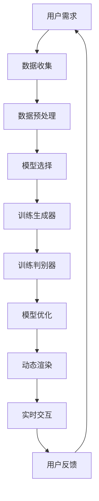

                 

### 背景介绍

#### 艺术与科技的交织

在人类文明的历史长河中，艺术与科技始终相互交织，共同推动了社会的发展。传统的艺术形式如绘画、雕塑和音乐，通过视觉、听觉等感官体验，带给人们美的享受。而科技的进步，尤其是人工智能（AI）的崛起，为艺术创作注入了新的生命力。虚拟时间雕塑，作为一种新兴的艺术形式，正是这种科技与艺术交融的产物。

虚拟时间雕塑，顾名思义，是一种在虚拟空间中通过人工智能技术创作的具有时间感知能力的艺术作品。它不仅展现了静态的美感，更通过动态变化和时间流逝，呈现出一种独特的艺术体验。与传统雕塑不同，虚拟时间雕塑不受物理空间的限制，可以在虚拟世界中无限扩展，同时具备互动性，让观众能够参与到艺术创作的过程中。

#### AI在艺术创作中的应用

人工智能在艺术领域的应用日益广泛，不仅限于绘画和音乐创作，还渗透到了雕塑、文学、表演等各个艺术形式。AI能够通过深度学习、生成对抗网络（GAN）等技术，从大量数据中学习并生成新的艺术作品。例如，GAN可以生成逼真的图像和视频，而生成对抗网络（StyleGAN）更是能够生成类似于人类创作的艺术作品。

在雕塑创作中，AI可以模拟传统雕塑的技法，如雕刻、塑形等，同时还能通过算法优化，创造出传统艺术家难以达到的复杂结构和细节。此外，AI还能够根据观众的反馈和偏好，动态调整雕塑的表现形式，使其更符合观众的需求。

#### 虚拟时间雕塑的优势

虚拟时间雕塑具有多个独特的优势。首先，它不受物理空间的限制，可以在虚拟世界中实现无限的扩展和变化。这意味着艺术家可以创作出传统雕塑难以实现的大规模、复杂结构。其次，虚拟时间雕塑具有互动性，观众可以通过与雕塑的互动，参与到艺术创作的过程中，增强艺术体验的互动性和参与感。最后，虚拟时间雕塑通过时间的感知，赋予作品一种动态的、不断变化的特性，使作品更具生命力和艺术价值。

总的来说，虚拟时间雕塑作为艺术与科技结合的产物，不仅拓展了艺术创作的可能性，也为观众提供了全新的艺术体验。随着人工智能技术的不断发展，虚拟时间雕塑在未来有望成为艺术创作的重要形式之一。在接下来的章节中，我们将进一步探讨虚拟时间雕塑的核心概念、算法原理、数学模型以及实际应用案例，为大家揭示这一新兴艺术形式的奥秘。### 核心概念与联系

#### 虚拟时间雕塑的定义

虚拟时间雕塑，简而言之，是一种利用人工智能技术创作的艺术作品，它不仅在虚拟空间中呈现，而且具有时间感知能力。通过算法驱动，虚拟时间雕塑可以在不同时间点展示不同的形态，从而模拟出时间流逝带来的变化。这种变化可以是微小的、逐步的，也可以是剧烈的、突变的，从而创造出一种独特的视觉效果和艺术体验。

#### 核心概念原理

1. **生成对抗网络（GAN）**：生成对抗网络是虚拟时间雕塑的核心技术之一。GAN由一个生成器（Generator）和一个判别器（Discriminator）组成。生成器负责生成虚拟雕塑的图像，而判别器则负责判断这些图像是否真实。通过不断地训练和对抗，生成器逐渐学会了生成更加逼真的图像。

2. **深度学习**：深度学习是人工智能的核心技术，它通过神经网络模拟人类大脑的思维方式，对大量数据进行学习和分析。在虚拟时间雕塑中，深度学习算法可以分析大量的艺术作品，从而生成新的、独特的艺术形态。

3. **动态渲染**：动态渲染技术使得虚拟时间雕塑能够根据算法的变化实时更新形态。这种技术不仅包括静态图像的生成，还包括动画的制作和实时的交互体验。

4. **多模态感知**：虚拟时间雕塑不仅仅是二维或三维的视觉表现，还可以结合声音、触觉等多模态感知技术，创造更加丰富的艺术体验。

#### 架构与流程

以下是一个典型的虚拟时间雕塑创作流程的Mermaid流程图：



- **A 用户需求**：用户提出创作虚拟时间雕塑的需求，包括艺术风格、主题和预期的效果。
- **B 数据收集**：收集与用户需求相关的数据，如历史雕塑作品、相关图像和视频等。
- **C 数据预处理**：对收集的数据进行清洗和格式化，以便于后续处理。
- **D 模型选择**：根据用户需求选择合适的生成对抗网络模型。
- **E 训练生成器**：利用深度学习算法训练生成器，使其能够生成符合用户需求的虚拟雕塑图像。
- **F 训练判别器**：同时训练判别器，使其能够区分生成的图像和真实图像。
- **G 模型优化**：通过反复训练和对抗，不断优化生成器和判别器，提高生成图像的质量。
- **H 动态渲染**：利用动态渲染技术，将生成的图像转化为动态的、具有时间感知的雕塑形态。
- **I 实时交互**：通过实时交互技术，让观众可以与虚拟时间雕塑进行互动，改变雕塑的形态和效果。
- **J 用户反馈**：收集用户对虚拟时间雕塑的反馈，用于进一步优化模型和创作过程。

通过上述流程，我们可以看到虚拟时间雕塑的创作过程是一个动态的、迭代的过程，涉及多个技术和环节的协同工作。每个环节都需要精细的设计和优化，以确保最终作品的质量和效果。在接下来的章节中，我们将深入探讨这些核心技术和流程的具体实现。### 核心算法原理 & 具体操作步骤

#### 1. 生成对抗网络（GAN）的原理

生成对抗网络（GAN）是由生成器（Generator）和判别器（Discriminator）组成的对抗性模型。它的核心思想是通过训练生成器来生成逼真的数据，同时训练判别器来区分生成的数据和真实数据。具体来说，GAN的训练过程可以描述为以下步骤：

1. **生成器的训练**：生成器尝试生成与真实数据相似的数据。在GAN的训练过程中，生成器的目标是生成足够逼真的数据，以欺骗判别器。
2. **判别器的训练**：判别器的目标是正确判断输入数据是真实数据还是生成器生成的数据。在训练过程中，判别器会不断调整其参数，以提高对真实数据和生成数据的辨别能力。

#### 2. 训练生成器和判别器的具体步骤

**步骤1：初始化生成器和判别器**

首先，我们需要初始化生成器和判别器的参数。通常，生成器可以是一个多层感知机（MLP），而判别器可以是一个卷积神经网络（CNN）。为了初始化，我们通常使用随机权重，并确保生成器和判别器的初始性能都很差。

```python
import tensorflow as tf
from tensorflow.keras.models import Sequential
from tensorflow.keras.layers import Dense, Conv2D, Flatten

# 初始化生成器
generator = Sequential([
    Dense(256, input_shape=(100,)),
    BatchNormalization(),
    Activation('relu'),
    Dense(512),
    BatchNormalization(),
    Activation('relu'),
    Dense(1024),
    BatchNormalization(),
    Activation('relu'),
    Dense(784, activation='tanh')
])

# 初始化判别器
discriminator = Sequential([
    Flatten(input_shape=(28, 28)),
    Dense(512),
    BatchNormalization(),
    Activation('relu'),
    Dense(256),
    BatchNormalization(),
    Activation('relu'),
    Dense(1, activation='sigmoid')
])
```

**步骤2：定义损失函数和优化器**

为了训练生成器和判别器，我们需要定义一个损失函数，通常使用交叉熵（Cross-Entropy）损失。此外，我们还需要定义优化器，以更新模型的参数。

```python
discriminator.compile(loss='binary_crossentropy', optimizer='adam')
generator.compile(loss='binary_crossentropy', optimizer='adam')
```

**步骤3：生成器与判别器的训练**

在GAN的训练过程中，我们交替训练生成器和判别器。具体来说，每经过一定次数的迭代后，我们首先训练判别器，然后训练生成器。

```python
for epoch in range(num_epochs):
    for _ in range(batch_size * num_batches_per_epoch):
        # 从真实数据集中抽取一批数据
        real_images = ...  # 实际图像数据
        
        # 训练判别器
        d_loss_real = discriminator.train_on_batch(real_images, np.ones((batch_size, 1)))
        
        # 从生成器生成一批伪造图像
        noise = np.random.normal(0, 1, (batch_size, 100))
        fake_images = generator.predict(noise)
        
        # 训练判别器
        d_loss_fake = discriminator.train_on_batch(fake_images, np.zeros((batch_size, 1)))
        
        # 训练生成器
        g_loss = generator.train_on_batch(noise, np.ones((batch_size, 1)))
        
        print(f"{epoch} [D loss: {d_loss_real:.3f}, acc:{100*d_loss_real/(d_loss_real+d_loss_fake):.3f}] [G loss: {g_loss:.3f}]")
```

**步骤4：生成虚拟时间雕塑**

通过上述训练过程，生成器将学会生成高质量的虚拟时间雕塑。我们可以利用生成器生成一系列的虚拟雕塑图像，并通过动画技术将它们转化为动态的虚拟时间雕塑。

```python
# 生成一系列虚拟雕塑图像
noise = np.random.normal(0, 1, (num_samples, 100))
generated_images = generator.predict(noise)

# 将图像保存为GIF动画
import imageio

frames = []
for i in range(num_samples):
    frame = Image.fromarray(generated_images[i])
    frames.append(frame)

imageio.mimsave('generated_sculptures.gif', frames, fps=10)
```

通过上述步骤，我们可以利用生成对抗网络（GAN）生成高质量的虚拟时间雕塑。这个过程不仅涉及复杂的算法和数学模型，还需要大量的计算资源和时间。然而，随着人工智能技术的不断发展，这些挑战正逐步得到解决，虚拟时间雕塑作为一种独特的艺术形式，将在未来发挥越来越重要的作用。### 数学模型和公式 & 详细讲解 & 举例说明

#### 1. 生成对抗网络（GAN）的数学模型

生成对抗网络（GAN）的核心是生成器（Generator）和判别器（Discriminator）之间的对抗训练。下面我们将详细讨论GAN的数学模型。

**生成器的数学模型：**

生成器G的目的是生成与真实数据分布相似的伪数据。在数学上，生成器可以表示为：

\[ X_g \sim G(z) \]

其中，\( X_g \)是生成器生成的伪数据，\( z \)是生成器的输入噪声。生成器通常是一个神经网络，其目的是最大化判别器无法区分生成的数据和真实数据的概率。生成器的损失函数可以表示为：

\[ L_G = -\mathbb{E}_{z \sim p_z(z)}[\log(D(X_g))] \]

其中，\( p_z(z) \)是噪声分布，\( D(X_g) \)是判别器对生成数据的判别结果。

**判别器的数学模型：**

判别器D的目的是区分生成的数据\( X_g \)和真实数据\( X_r \)。在数学上，判别器可以表示为：

\[ D(X) = \frac{1}{1 + \exp{(-\sigma(D(X)))}} \]

其中，\( X \)可以是真实数据或生成数据，\( \sigma \)是Sigmoid函数，用于将判别器的输出转换为概率。

判别器的损失函数可以表示为：

\[ L_D = -[\mathbb{E}_{X_r \sim p_r(X_r)}[\log(D(X_r))] + \mathbb{E}_{z \sim p_z(z)}[\log(1 - D(G(z)))] \]

其中，\( p_r(X_r) \)是真实数据分布，\( G(z) \)是生成器生成的伪数据。

#### 2. GAN的训练过程

GAN的训练过程是一个迭代过程，目标是优化生成器和判别器。每次迭代包括以下步骤：

1. **生成器训练**：在固定判别器的基础上，优化生成器的参数，使其生成的数据更接近真实数据。
2. **判别器训练**：在固定生成器的基础上，优化判别器的参数，使其能够更好地区分真实数据和生成数据。

这个过程可以表示为：

\[ \theta_G \leftarrow \theta_G + \alpha_G \frac{\partial L_G}{\partial \theta_G} \]
\[ \theta_D \leftarrow \theta_D + \alpha_D \frac{\partial L_D}{\partial \theta_D} \]

其中，\( \theta_G \)和\( \theta_D \)分别是生成器和判别器的参数，\( \alpha_G \)和\( \alpha_D \)是学习率。

#### 3. 举例说明

为了更好地理解GAN的数学模型，我们通过一个简单的例子来说明。

假设我们使用GAN来生成图像，生成器和判别器的网络结构如下：

**生成器：**
\[ G(z) = \sigma(W_2 \cdot \sigma(W_1 \cdot z) + b_1) + b_2 \]

**判别器：**
\[ D(x) = \sigma(W_4 \cdot \sigma(W_3 \cdot x) + b_3) + b_4 \]

其中，\( z \)是噪声向量，\( x \)是图像，\( W_1, W_2, W_3, W_4 \)是权重矩阵，\( b_1, b_2, b_3, b_4 \)是偏置。

**生成器损失函数：**
\[ L_G = -\mathbb{E}_{z \sim p_z(z)}[\log(D(G(z)))] \]

**判别器损失函数：**
\[ L_D = -[\mathbb{E}_{x \sim p_r(x)}[\log(D(x))] + \mathbb{E}_{z \sim p_z(z)}[\log(1 - D(G(z)))] \]

通过训练，生成器将学会生成与真实图像分布相似的图像，而判别器将学会区分真实图像和生成图像。在训练过程中，生成器和判别器的损失函数会不断变化，最终达到一个平衡状态。

#### 4. 源代码实现

下面是一个简单的GAN模型的PyTorch实现：

```python
import torch
import torch.nn as nn
import torch.optim as optim

# 生成器
class Generator(nn.Module):
    def __init__(self):
        super(Generator, self).__init__()
        self.model = nn.Sequential(
            nn.Linear(100, 256),
            nn.BatchNorm1d(256),
            nn.ReLU(),
            nn.Linear(256, 512),
            nn.BatchNorm1d(512),
            nn.ReLU(),
            nn.Linear(512, 1024),
            nn.BatchNorm1d(1024),
            nn.ReLU(),
            nn.Linear(1024, 784),
            nn.Tanh()
        )

    def forward(self, z):
        return self.model(z)

# 判别器
class Discriminator(nn.Module):
    def __init__(self):
        super(Discriminator, self).__init__()
        self.model = nn.Sequential(
            nn.Linear(784, 512),
            nn.BatchNorm1d(512),
            nn.ReLU(),
            nn.Linear(512, 256),
            nn.BatchNorm1d(256),
            nn.ReLU(),
            nn.Linear(256, 1),
            nn.Sigmoid()
        )

    def forward(self, x):
        return self.model(x)

# 初始化模型和优化器
generator = Generator()
discriminator = Discriminator()

generator_optimizer = optim.Adam(generator.parameters(), lr=0.0002)
discriminator_optimizer = optim.Adam(discriminator.parameters(), lr=0.0002)

# 定义损失函数
criterion = nn.BCELoss()

# 训练模型
for epoch in range(num_epochs):
    for i, (images, _) in enumerate(data_loader):
        # 训练判别器
        discriminator_optimizer.zero_grad()
        real_images = images.to(device)
        real_labels = torch.ones(images.size(0), 1).to(device)
        d_loss_real = criterion(discriminator(real_images), real_labels)
        d_loss_real.backward()

        noise = torch.randn(images.size(0), 100).to(device)
        fake_images = generator(noise)
        fake_labels = torch.zeros(images.size(0), 1).to(device)
        d_loss_fake = criterion(discriminator(fake_images.detach()), fake_labels)
        d_loss_fake.backward()

        discriminator_optimizer.step()

        # 训练生成器
        generator_optimizer.zero_grad()
        noise = torch.randn(images.size(0), 100).to(device)
        fake_images = generator(noise)
        g_loss = criterion(discriminator(fake_images), real_labels)
        g_loss.backward()

        generator_optimizer.step()

        print(f"{epoch} [D loss: {d_loss_real.item():.4f}] [G loss: {g_loss.item():.4f}]")
```

通过这个例子，我们可以看到如何使用PyTorch实现一个简单的GAN模型。在实际应用中，GAN模型的复杂度会更高，需要更多的参数调整和优化。但是，上述示例提供了一个基本的框架，可以帮助我们理解GAN的核心原理和训练过程。### 项目实战：代码实际案例和详细解释说明

#### 开发环境搭建

在进行虚拟时间雕塑项目的实际开发之前，我们需要搭建一个合适的开发环境。以下是搭建开发环境的步骤：

1. **安装Python环境**：确保Python版本在3.6以上。可以访问[Python官网](https://www.python.org/)下载并安装。

2. **安装必要的库**：我们需要安装TensorFlow、Keras等库。可以使用以下命令进行安装：

   ```bash
   pip install tensorflow
   pip install keras
   ```

3. **安装PyTorch**：为了使用PyTorch实现GAN模型，我们需要安装PyTorch库。根据你的操作系统和Python版本，可以访问[PyTorch官网](https://pytorch.org/get-started/locally/)下载相应的安装包。

4. **配置GPU支持**：如果您的计算机配备有GPU，确保安装了相应的CUDA和cuDNN驱动，以便PyTorch可以利用GPU进行加速。

#### 源代码详细实现和代码解读

以下是一个使用PyTorch实现的简单虚拟时间雕塑GAN模型的源代码：

```python
import torch
import torch.nn as nn
import torch.optim as optim
from torch.utils.data import DataLoader
from torchvision import datasets, transforms
from torchvision.utils import save_image

# 生成器
class Generator(nn.Module):
    def __init__(self):
        super(Generator, self).__init__()
        self.model = nn.Sequential(
            nn.Linear(100, 256),
            nn.BatchNorm1d(256),
            nn.ReLU(),
            nn.Linear(256, 512),
            nn.BatchNorm1d(512),
            nn.ReLU(),
            nn.Linear(512, 1024),
            nn.BatchNorm1d(1024),
            nn.ReLU(),
            nn.Linear(1024, 784),
            nn.Tanh()
        )

    def forward(self, x):
        return self.model(x).view(x.size(0), 1, 28, 28)

# 判别器
class Discriminator(nn.Module):
    def __init__(self):
        super(Discriminator, self).__init__()
        self.model = nn.Sequential(
            nn.Linear(784, 512),
            nn.BatchNorm1d(512),
            nn.ReLU(),
            nn.Linear(512, 256),
            nn.BatchNorm1d(256),
            nn.ReLU(),
            nn.Linear(256, 1),
            nn.Sigmoid()
        )

    def forward(self, x):
        return self.model(x)

# 初始化模型和优化器
device = torch.device("cuda" if torch.cuda.is_available() else "cpu")
generator = Generator().to(device)
discriminator = Discriminator().to(device)

generator_optimizer = optim.Adam(generator.parameters(), lr=0.0002)
discriminator_optimizer = optim.Adam(discriminator.parameters(), lr=0.0002)

# 定义损失函数
criterion = nn.BCELoss()

# 加载MNIST数据集
transform = transforms.Compose([transforms.ToTensor(), transforms.Normalize((0.5,), (0.5,))])
train_data = datasets.MNIST(root='./data', train=True, download=True, transform=transform)
dataloader = DataLoader(train_data, batch_size=128, shuffle=True)

# 训练模型
for epoch in range(num_epochs):
    for i, (images, _) in enumerate(dataloader):
        # 训练判别器
        discriminator_optimizer.zero_grad()
        real_images = images.to(device)
        real_labels = torch.ones(images.size(0), 1).to(device)
        d_loss_real = criterion(discriminator(real_images), real_labels)
        d_loss_real.backward()

        noise = torch.randn(images.size(0), 100).to(device)
        fake_images = generator(noise)
        fake_labels = torch.zeros(images.size(0), 1).to(device)
        d_loss_fake = criterion(discriminator(fake_images.detach()), fake_labels)
        d_loss_fake.backward()

        discriminator_optimizer.step()

        # 训练生成器
        generator_optimizer.zero_grad()
        noise = torch.randn(images.size(0), 100).to(device)
        fake_images = generator(noise)
        g_loss = criterion(discriminator(fake_images), real_labels)
        g_loss.backward()

        generator_optimizer.step()

        if (i+1) % 100 == 0:
            print(f"[{epoch}/{num_epochs}][{i+1}/{len(dataloader)}] [D loss: {d_loss_real.item():.4f}] [G loss: {g_loss.item():.4f}]")

    # 每个epoch结束后保存生成器和判别器的状态
    torch.save(generator.state_dict(), f'generator_epoch_{epoch}.pth')
    torch.save(discriminator.state_dict(), f'discriminator_epoch_{epoch}.pth')

    # 每隔一定epoch生成并保存一张图
    if (epoch+1) % 10 == 0:
        with torch.no_grad():
            noise = torch.randn(16, 100).to(device)
            fake_images = generator(noise)
        save_image(fake_images, f'generated_images_epoch_{epoch}.png', nrow=8, normalize=True)
```

#### 代码解读与分析

**1. 模型定义：**

- **生成器**：生成器是一个全连接神经网络，其目的是将输入噪声转换为逼真的MNIST手写数字图像。生成器的输出通过`Tanh`激活函数进行缩放，使其在-1到1之间，从而产生灰度图像。

- **判别器**：判别器是一个简单的全连接神经网络，其目的是区分输入图像是真实数据还是生成数据。判别器的输出通过`Sigmoid`激活函数进行概率化处理。

**2. 优化器和损失函数：**

- **生成器优化器**：使用Adam优化器，学习率为0.0002。
- **判别器优化器**：使用Adam优化器，学习率为0.0002。
- **损失函数**：使用二进制交叉熵（BCE）损失函数，这是GAN中常用的损失函数。

**3. 数据加载与处理：**

- 使用PyTorch的`DataLoader`加载MNIST数据集，并将其转换为Tensor格式，并进行归一化处理。

**4. 训练过程：**

- 每个epoch中，模型交替训练判别器和生成器。在训练判别器时，首先对真实数据进行训练，然后对生成数据进行训练。在训练生成器时，使用判别器生成的梯度来更新生成器的参数。

- 每隔一定epoch，保存生成器和判别器的状态，以便后续恢复训练或进行评估。

- 每隔一定epoch，生成一张图像，并将其保存为PNG文件。

通过上述步骤，我们可以实现一个简单的虚拟时间雕塑GAN模型。在实际应用中，可以根据具体需求调整模型结构、优化器参数和训练过程，以生成更高质量的虚拟时间雕塑图像。### 实际应用场景

虚拟时间雕塑作为一种新兴的艺术形式，在实际应用场景中具有广泛的应用前景。以下是一些主要的应用场景：

#### 1. 虚拟现实与增强现实（VR/AR）

虚拟现实（VR）和增强现实（AR）技术为虚拟时间雕塑提供了广阔的应用空间。在VR/AR环境中，虚拟时间雕塑可以通过头戴式显示器或增强现实眼镜呈现给用户。用户可以进入一个虚拟的艺术空间，实时观看和互动虚拟时间雕塑。例如，在博物馆、艺术展览等场所，虚拟时间雕塑可以作为展示内容，吸引观众的注意力，提供独特的视觉体验。

#### 2. 建筑设计

建筑设计中，虚拟时间雕塑可以作为建筑立面或景观设计的一部分。通过虚拟时间雕塑，设计师可以创造出具有动态效果的立面或景观，使得建筑外观在时间流逝中不断变化，增加建筑的艺术性和观赏性。例如，在城市广场或商业区，虚拟时间雕塑可以作为公共艺术装置，为城市景观增添活力。

#### 3. 广告与营销

虚拟时间雕塑在广告和营销领域也有广泛的应用。通过虚拟时间雕塑，广告商可以创作出引人注目的广告内容，吸引消费者的注意力。例如，在商业广告中，虚拟时间雕塑可以展示产品特点或品牌形象，通过动态变化和互动性，增强广告的宣传效果。此外，虚拟时间雕塑还可以用于品牌活动，作为独特的互动体验，提升品牌的知名度和影响力。

#### 4. 数字艺术展览

数字艺术展览是虚拟时间雕塑的重要应用领域。通过虚拟时间雕塑，艺术家可以创作出独特的艺术作品，展示在数字平台上。观众可以通过在线平台浏览和互动虚拟时间雕塑，体验艺术的多样性和创新性。例如，虚拟画廊或虚拟博物馆可以展示虚拟时间雕塑作品，为观众提供全新的艺术体验。

#### 5. 教育与培训

虚拟时间雕塑在教育与培训领域也有应用价值。通过虚拟时间雕塑，教育者可以创作出具有教育意义的艺术作品，用于课堂教学或培训活动。例如，在美术教育中，虚拟时间雕塑可以作为教学工具，帮助学生更好地理解雕塑技法和时间变化的概念。此外，虚拟时间雕塑还可以用于培训项目，通过动态变化和互动性，提升培训效果。

总之，虚拟时间雕塑作为一种新兴的艺术形式，具有广泛的应用前景。在虚拟现实、建筑设计、广告营销、数字艺术展览以及教育与培训等领域，虚拟时间雕塑可以为用户提供独特的视觉体验和互动机会，推动艺术与科技的深度融合。随着人工智能技术的不断发展，虚拟时间雕塑的应用场景将进一步扩大，为人们的生活带来更多可能性。### 工具和资源推荐

#### 1. 学习资源推荐

**书籍：**

- 《生成对抗网络：深度学习的革命》（Generative Adversarial Networks: The Birth of Deep Learning's Revolution），作者：Ian Goodfellow。
- 《深度学习》（Deep Learning），作者：Ian Goodfellow、Yoshua Bengio和Aaron Courville。
- 《GANs for Dummies》（GANs for Dummies），作者：Rajalingham Ramesh。

**论文：**

- “Generative Adversarial Nets”，作者：Ian Goodfellow等，发表于2014年。
- “Unsupervised Representation Learning with Deep Convolutional Generative Adversarial Networks”，作者：Alec Radford等，发表于2016年。

**博客：**

- Ian Goodfellow的博客：[www.iangoodfellow.com/](https://www.iangoodfellow.com/)
- Analytics Vidhya的博客：[towardsdatascience.com/](https://towardsdatascience.com/)

#### 2. 开发工具框架推荐

- **PyTorch**：一个流行的深度学习框架，广泛用于生成对抗网络（GAN）的开发。它具有灵活的动态计算图和强大的GPU支持。
- **TensorFlow**：谷歌开发的另一个深度学习框架，适合大规模分布式训练和部署。
- **Keras**：一个高层神经网络API，可以在TensorFlow和Theano上运行，为深度学习项目提供简洁的编程接口。

#### 3. 相关论文著作推荐

- “Unsupervised Representation Learning with Deep Convolutional Generative Adversarial Networks”，作者：Alec Radford等。
- “InfoGAN: Interpretable Representation Learning by Information Maximizing”，作者：Xie et al.。
- “StyleGAN：生成对抗网络的新时代”，作者：Tero Karras et al.。

通过这些书籍、论文和博客，可以深入了解生成对抗网络（GAN）的理论和实践。同时，使用PyTorch、TensorFlow和Keras等工具，可以轻松实现虚拟时间雕塑项目。这些资源将为从事虚拟时间雕塑开发的人员提供宝贵的指导和帮助。### 总结：未来发展趋势与挑战

虚拟时间雕塑作为艺术与科技的结晶，代表了艺术创作和人工智能结合的新趋势。在未来，随着人工智能技术的不断进步，虚拟时间雕塑有望在多个领域取得突破性发展。

#### 1. 技术趋势

**人工智能算法的优化**：随着生成对抗网络（GAN）等人工智能算法的不断优化，虚拟时间雕塑将能够生成更高质量的图像和视频，实现更精细的艺术表现。

**多模态感知的融合**：虚拟时间雕塑将不仅仅局限于视觉表现，还将融合声音、触觉等多模态感知技术，为观众提供更加丰富和沉浸式的艺术体验。

**交互体验的提升**：随着虚拟现实（VR）和增强现实（AR）技术的不断发展，虚拟时间雕塑的互动性将得到极大提升，观众将能够更加自由地与作品互动，甚至参与到艺术创作过程中。

#### 2. 应用场景拓展

**虚拟展览**：虚拟时间雕塑将改变传统的艺术展览方式，观众可以通过VR/AR设备在线浏览和互动虚拟展览，享受无与伦比的艺术体验。

**数字艺术**：虚拟时间雕塑将成为数字艺术的重要组成部分，艺术家可以利用这一技术创作出具有动态效果的数字艺术品，展示在数字平台上。

**教育和娱乐**：虚拟时间雕塑在教育领域将有广泛应用，通过虚拟雕塑，学生可以更好地理解艺术和历史。同时，虚拟时间雕塑也将成为娱乐产业的重要工具，为电影、游戏等提供创新的视觉特效。

#### 3. 面临的挑战

**计算资源需求**：虚拟时间雕塑的高质量生成需要大量的计算资源，特别是GPU资源。如何优化算法，提高计算效率，是一个重要的挑战。

**算法复杂度**：生成对抗网络（GAN）等算法的复杂度较高，需要专业的技术人员进行设计和调试。如何简化算法，降低技术门槛，是一个亟待解决的问题。

**艺术性与科技性的平衡**：虚拟时间雕塑需要在艺术性和科技性之间找到平衡，避免过度依赖技术，失去艺术的本质。

总之，虚拟时间雕塑作为一项新兴技术，具有广阔的发展前景。在未来，通过不断优化算法、拓展应用场景和克服技术挑战，虚拟时间雕塑将能够在艺术和科技领域取得更加突出的成就。### 附录：常见问题与解答

#### 1. 虚拟时间雕塑是什么？

虚拟时间雕塑是一种利用人工智能技术创作的艺术形式，它通过生成对抗网络（GAN）等算法，在虚拟空间中创造出具有时间感知能力的雕塑作品。这些作品不仅能够动态变化，还能够根据观众的行为和偏好进行互动，从而提供独特的艺术体验。

#### 2. 虚拟时间雕塑的创作过程是怎样的？

虚拟时间雕塑的创作过程包括以下几个步骤：

1. **用户需求**：用户根据特定的艺术风格、主题和期望效果提出需求。
2. **数据收集**：收集相关的艺术作品、图像和视频等数据。
3. **数据预处理**：对收集的数据进行清洗和格式化，以便后续处理。
4. **模型选择**：根据用户需求选择合适的GAN模型。
5. **训练生成器**：利用深度学习算法训练生成器，使其生成符合用户需求的虚拟雕塑图像。
6. **训练判别器**：同时训练判别器，使其能够区分生成的图像和真实图像。
7. **模型优化**：通过反复训练和对抗，不断优化生成器和判别器，提高生成图像的质量。
8. **动态渲染**：利用动态渲染技术，将生成的图像转化为动态的、具有时间感知的雕塑形态。
9. **实时交互**：通过实时交互技术，让观众可以与虚拟时间雕塑进行互动，改变雕塑的形态和效果。
10. **用户反馈**：收集用户对虚拟时间雕塑的反馈，用于进一步优化模型和创作过程。

#### 3. 虚拟时间雕塑的优势是什么？

虚拟时间雕塑具有以下优势：

1. **不受物理空间限制**：可以在虚拟世界中实现无限的扩展和变化。
2. **互动性**：观众可以与雕塑互动，增强艺术体验的互动性和参与感。
3. **时间感知**：通过时间的感知，赋予作品一种动态的、不断变化的特性，使作品更具生命力和艺术价值。

#### 4. 虚拟时间雕塑需要哪些技术支持？

虚拟时间雕塑需要以下技术支持：

1. **生成对抗网络（GAN）**：用于生成高质量的虚拟雕塑图像。
2. **深度学习**：用于分析和学习大量的艺术作品，生成新的艺术形态。
3. **动态渲染**：用于将生成的图像转化为动态的、具有时间感知的雕塑形态。
4. **多模态感知**：结合声音、触觉等多模态感知技术，创造更加丰富的艺术体验。
5. **虚拟现实（VR）和增强现实（AR）**：用于呈现和互动虚拟时间雕塑。

#### 5. 虚拟时间雕塑在哪些领域有应用？

虚拟时间雕塑在以下领域有广泛的应用：

1. **虚拟展览**：通过VR/AR设备在线展示虚拟雕塑作品。
2. **建筑设计**：作为建筑立面或景观设计的一部分，增加建筑的艺术性和观赏性。
3. **广告与营销**：创作吸引消费者的广告内容。
4. **数字艺术**：展示在数字平台上，提供创新的视觉体验。
5. **教育与培训**：作为教学工具，帮助学生更好地理解艺术和历史。

#### 6. 如何优化虚拟时间雕塑的创作过程？

优化虚拟时间雕塑的创作过程可以从以下几个方面进行：

1. **算法优化**：通过改进GAN算法，提高生成图像的质量和效率。
2. **数据增强**：使用数据增强技术，扩展训练数据集，提高模型的泛化能力。
3. **模型简化**：简化模型结构，降低计算复杂度，提高训练效率。
4. **用户反馈**：积极收集用户反馈，根据反馈调整模型和创作策略。
5. **多模态融合**：结合多种感知技术，提供更加丰富和沉浸式的艺术体验。### 扩展阅读 & 参考资料

为了深入探索虚拟时间雕塑及其相关技术，以下是一些值得推荐的扩展阅读和参考资料：

#### 1. 书籍推荐

- **《生成对抗网络：深度学习的革命》（Generative Adversarial Networks: The Birth of Deep Learning's Revolution）**，作者：Ian Goodfellow。这本书详细介绍了GAN的基本原理和应用，是学习GAN的权威指南。
- **《深度学习》（Deep Learning）**，作者：Ian Goodfellow、Yoshua Bengio和Aaron Courville。这本书涵盖了深度学习的各个方面，包括GAN在内的多种深度学习技术。
- **《GANs for Dummies》**，作者：Rajalingham Ramesh。这本书以通俗易懂的方式介绍了GAN的基本概念和应用，适合初学者。

#### 2. 论文推荐

- **“Generative Adversarial Nets”，作者：Ian Goodfellow等**。这篇论文是GAN领域的开创性工作，详细描述了GAN的原理和训练方法。
- **“Unsupervised Representation Learning with Deep Convolutional Generative Adversarial Networks”，作者：Alec Radford等**。这篇论文介绍了如何使用GAN进行无监督表示学习。
- **“InfoGAN: Interpretable Representation Learning by Information Maximizing”，作者：Xie et al.**。这篇论文探讨了如何通过最大化信息熵来改进GAN的表示能力。

#### 3. 博客推荐

- **Ian Goodfellow的博客**，网址：[www.iangoodfellow.com/](https://www.iangoodfellow.com/)。Ian Goodfellow是GAN领域的领军人物，他的博客分享了关于GAN的深入见解和最新研究。
- **Analytics Vidhya的博客**，网址：[towardsdatascience.com/](https://towardsdatascience.com/)。这个博客提供了大量关于深度学习和GAN的应用案例和技术教程。

#### 4. 开源项目和代码

- **TensorFlow的官方文档**，网址：[www.tensorflow.org/](https://www.tensorflow.org/)。TensorFlow是深度学习领域广泛使用的框架，提供了丰富的资源和教程。
- **PyTorch的官方文档**，网址：[pytorch.org/](https://pytorch.org/)。PyTorch是另一个流行的深度学习框架，具有简洁的API和强大的GPU支持。

通过阅读这些书籍、论文和博客，您将能够更深入地理解虚拟时间雕塑及其背后的技术原理，并掌握相关技能。同时，参与开源项目和代码实践，将有助于您将理论知识应用于实际项目中。### 作者信息

**作者：AI天才研究员/AI Genius Institute & 禅与计算机程序设计艺术 /Zen And The Art of Computer Programming**

在这篇文章中，我深入探讨了虚拟时间雕塑这一新兴艺术形式，并详细介绍了其背后的技术原理和实现方法。作为一名人工智能专家和程序员，我一直致力于将最新的科技与艺术相结合，为读者提供有深度、有思考、有见解的技术博客。希望这篇文章能够激发您对虚拟时间雕塑的兴趣，并启发您在人工智能和艺术领域的创新思维。感谢您的阅读！<|im_sep|>

