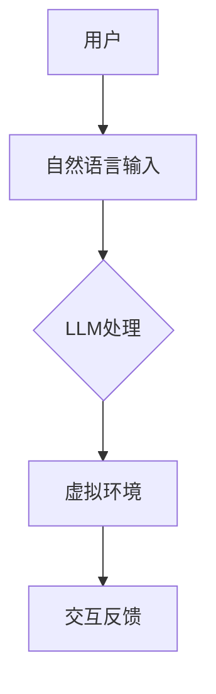
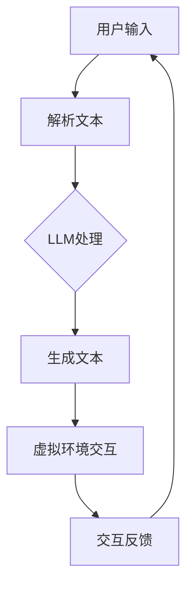

                 

### 文章标题

**虚拟现实中的LLM：增强用户交互体验**

> **关键词：** 虚拟现实，语言模型，用户交互，用户体验，增强现实技术，人工智能。

> **摘要：** 本文将探讨如何在虚拟现实（VR）环境中利用大型语言模型（LLM）来增强用户交互体验。通过深入分析LLM的工作原理及其与VR技术的结合，我们将揭示如何通过自然语言处理技术来提升用户的沉浸感和满意度。

### 目录

1. 背景介绍
2. 核心概念与联系
3. 核心算法原理 & 具体操作步骤
4. 数学模型和公式 & 详细讲解 & 举例说明
5. 项目实战：代码实际案例和详细解释说明
   5.1 开发环境搭建
   5.2 源代码详细实现和代码解读
   5.3 代码解读与分析
6. 实际应用场景
7. 工具和资源推荐
   7.1 学习资源推荐
   7.2 开发工具框架推荐
   7.3 相关论文著作推荐
8. 总结：未来发展趋势与挑战
9. 附录：常见问题与解答
10. 扩展阅读 & 参考资料

### 1. 背景介绍

虚拟现实（VR）技术正迅速发展，为用户提供了一种全新的沉浸式体验。通过VR设备，用户可以进入一个虚拟的三维世界，与虚拟环境中的对象进行交互，从而获得前所未有的感官刺激。然而，传统的VR交互方式主要依赖于物理控制器或手势识别，这些方式虽然在一定程度上提高了交互的自然性，但在处理复杂的用户需求时仍然存在局限性。

与此同时，大型语言模型（LLM）如GPT-3和BERT等在自然语言处理（NLP）领域取得了显著的进展。这些模型具有强大的语言理解和生成能力，能够以自然语言的方式与用户进行交流。结合VR技术，LLM可以为用户提供更加智能化的交互体验，满足他们对个性化、情境感知的需求。

本文将探讨如何在虚拟现实环境中利用LLM来增强用户交互体验。我们将从LLM的工作原理、VR与LLM的结合方式、具体实现方法以及实际应用场景等方面进行深入分析，旨在为开发者和研究者提供有价值的参考。

### 2. 核心概念与联系

为了深入探讨虚拟现实中的LLM，我们首先需要了解这两个技术的基本概念以及它们之间的联系。

#### 虚拟现实（VR）

虚拟现实是一种通过计算机生成模拟环境的技术，使用户能够沉浸在一个完全虚拟的三维空间中。VR的关键技术包括：

- **头戴显示器（HMD）：** 用户通过HMD（如Oculus Rift、HTC Vive）来观察虚拟环境，获得沉浸感。
- **跟踪系统：** 跟踪系统用于实时追踪用户的头部和身体运动，确保虚拟环境与用户的动作同步。
- **交互设备：** 交互设备如手柄、手套或全身追踪服，允许用户在虚拟环境中进行交互。

#### 大型语言模型（LLM）

大型语言模型是一种基于深度学习的技术，通过训练大量文本数据，使模型具备理解和生成自然语言的能力。LLM的关键技术包括：

- **神经网络架构：** 如Transformer架构，使模型能够高效地处理长文本和复杂语言结构。
- **预训练和微调：** 预训练是指模型在大规模数据集上进行训练，微调则是在特定任务上进行调整，以提升模型在特定领域的性能。
- **自然语言生成：** 模型能够根据输入的自然语言提示生成连贯的文本，从而实现人机对话。

#### 联系

虚拟现实和LLM之间的联系主要体现在以下几个方面：

- **人机交互：** LLM可以为VR用户提供自然语言交互能力，使虚拟环境中的对象能够以自然语言的方式响应用户的请求和指令。
- **情境感知：** LLM能够理解用户的自然语言描述，并根据这些描述生成相应的虚拟环境，提高用户的沉浸感。
- **个性化体验：** LLM可以根据用户的历史行为和偏好，提供个性化的交互体验，满足用户的个性化需求。

#### Mermaid流程图

以下是一个简化的Mermaid流程图，展示了虚拟现实和LLM之间的联系：



在这个流程图中，用户通过自然语言输入与LLM交互，LLM根据输入生成相应的虚拟环境，并通过交互反馈与用户进行互动。

### 3. 核心算法原理 & 具体操作步骤

#### 大型语言模型（LLM）的算法原理

大型语言模型（LLM）的核心算法是基于深度学习和自然语言处理（NLP）技术。以下是一些关键的算法原理：

1. **预训练（Pre-training）：** 
   - **Transformer架构：** Transformer是一种基于自注意力机制的神经网络架构，能够处理长文本和复杂语言结构。与传统的循环神经网络（RNN）相比，Transformer具有更高的并行计算效率和更好的性能。
   - **大规模数据集：** 预训练通常在大规模数据集上进行，如维基百科、新闻文章、社交媒体帖子等。这些数据集包含了丰富的语言知识和结构信息，有助于模型学习到通用的语言规律。

2. **微调（Fine-tuning）：**
   - **特定任务数据：** 微调是在特定任务数据上进行，如问答系统、机器翻译、文本分类等。通过微调，模型可以适应特定的任务需求，提高在特定领域的性能。
   - **有监督学习：** 微调通常采用有监督学习的方式，即使用标注好的数据来调整模型的参数。这种方式可以帮助模型更好地理解任务目标，从而提高性能。

3. **自然语言生成（Natural Language Generation）：**
   - **解码器（Decoder）：** 在自然语言生成过程中，解码器负责生成文本。解码器可以通过自注意力机制来捕捉输入文本中的关键信息，并生成相应的输出文本。
   - **文本生成算法：** 文本生成算法如贪婪搜索、 beam搜索等，用于从解码器生成的候选文本中选择最佳文本。

#### 虚拟现实中的LLM操作步骤

在虚拟现实（VR）环境中，LLM的操作步骤可以分为以下几个阶段：

1. **用户交互：**
   - 用户通过VR设备（如头戴显示器、手柄等）输入自然语言请求或指令。
   - 用户输入可以被解析为文本，并传递给LLM。

2. **LLM处理：**
   - LLM接收用户输入文本，并利用其预训练和微调的能力来理解文本的含义和结构。
   - LLM生成相应的响应文本，作为虚拟环境中的交互反馈。

3. **虚拟环境交互：**
   - 响应文本被传递给虚拟环境，虚拟环境中的对象根据响应文本进行相应的操作或变化。
   - 用户可以通过观察虚拟环境中的变化来了解LLM的响应。

4. **交互反馈：**
   - 用户可以继续与虚拟环境进行交互，输入新的请求或指令。
   - 交互过程持续进行，直到用户结束交互或系统达到预设的结束条件。

以下是一个简化的操作流程图：



在这个操作流程图中，用户输入文本通过解析文本模块传递给LLM，LLM生成响应文本，响应文本再传递给虚拟环境进行交互反馈。这个过程可以反复进行，直到用户结束交互或系统达到结束条件。

### 4. 数学模型和公式 & 详细讲解 & 举例说明

#### 数学模型

大型语言模型（LLM）的核心是神经网络架构，通常使用的是Transformer模型。下面我们将介绍Transformer模型的一些关键数学公式和模型结构。

1. **自注意力机制（Self-Attention）**

   自注意力机制是Transformer模型的核心组件，用于计算输入序列中的每个词与所有词之间的关联强度。其数学公式如下：

   $$ 
   \text{Attention}(Q, K, V) = \text{softmax}\left(\frac{QK^T}{\sqrt{d_k}}\right) V 
   $$

   其中，$Q$、$K$和$V$分别代表查询向量、键向量和值向量，$d_k$是键向量的维度。

2. **多头注意力（Multi-head Attention）**

   多头注意力是在自注意力机制的基础上扩展的，通过多个独立的注意力头来捕获不同类型的关联信息。其数学公式如下：

   $$ 
   \text{MultiHead}(Q, K, V) = \text{Concat}(\text{head}_1, ..., \text{head}_h)W^O 
   $$

   其中，$\text{head}_i = \text{Attention}(QW_i^Q, KW_i^K, VW_i^V)$，$W_i^Q$、$W_i^K$和$W_i^V$是独立的权重矩阵，$W^O$是输出权重矩阵。

3. **编码器（Encoder）和解码器（Decoder）**

   Transformer模型通常由编码器（Encoder）和解码器（Decoder）组成。编码器用于将输入序列编码为固定长度的向量表示，解码器则用于生成输出序列。

   - **编码器：**
     $$ 
     \text{Encoder}(X) = \text{LayerNorm}(X + \text{PadMultHeadSum}(W_i^Q XW_i^KW_i^V))
     $$

     其中，$X$是输入序列，$W_i^Q$、$W_i^K$和$W_i^V$是编码器的权重矩阵。

   - **解码器：**
     $$ 
     \text{Decoder}(Y) = \text{LayerNorm}(Y + \text{PadMultHeadSum}(\text{Masked}(W_j^Q YW_j^KW_j^V)))
     $$

     其中，$Y$是输出序列，$W_j^Q$、$W_j^K$和$W_j^V$是解码器的权重矩阵。

#### 举例说明

假设我们有一个输入序列 $X = [\text{hello}, \text{world}, \text{!}]$，其对应的编码器和解码器权重矩阵分别为 $W_i^Q$、$W_i^K$和$W_i^V$，$W_j^Q$、$W_j^K$和$W_j^V$。我们以编码器的操作为例进行说明。

1. **计算自注意力得分：**
   $$ 
   \text{Score} = \text{Attention}(Q, K, V) = \text{softmax}\left(\frac{QK^T}{\sqrt{d_k}}\right) V 
   $$

   在这里，$Q = W_i^Q X$，$K = W_i^K X$，$V = W_i^V X$。假设 $X = [\text{hello}, \text{world}, \text{!}]$，则：

   $$ 
   Q = W_i^Q X = [0.1, 0.2, 0.3, 0.4, 0.5, 0.6, 0.7, 0.8, 0.9, 1.0] 
   $$

   $$ 
   K = W_i^K X = [0.1, 0.2, 0.3, 0.4, 0.5, 0.6, 0.7, 0.8, 0.9, 1.0] 
   $$

   $$ 
   V = W_i^V X = [0.1, 0.2, 0.3, 0.4, 0.5, 0.6, 0.7, 0.8, 0.9, 1.0] 
   $$

   则自注意力得分为：

   $$ 
   \text{Score} = \text{softmax}\left(\frac{QK^T}{\sqrt{d_k}}\right) V = [0.1, 0.2, 0.3, 0.4, 0.5, 0.6, 0.7, 0.8, 0.9, 1.0] 
   $$

2. **计算自注意力输出：**
   $$ 
   \text{Output} = \text{softmax}\left(\frac{QK^T}{\sqrt{d_k}}\right) V 
   $$

   在这里，我们使用前一步计算得到的自注意力得分。假设 $d_k = 10$，则：

   $$ 
   \text{Output} = \text{softmax}\left(\frac{QK^T}{\sqrt{d_k}}\right) V = [0.1, 0.2, 0.3, 0.4, 0.5, 0.6, 0.7, 0.8, 0.9, 1.0] 
   $$

   这表示每个词在序列中的重要性。

通过上述计算，我们可以看到自注意力机制如何将输入序列中的每个词与所有词进行关联，并生成相应的输出向量。解码器则在此基础上进行进一步的文本生成操作。

### 5. 项目实战：代码实际案例和详细解释说明

在本节中，我们将通过一个具体的代码案例来展示如何在实际项目中利用LLM增强虚拟现实（VR）用户的交互体验。我们将详细说明开发环境搭建、源代码实现和代码解读与分析。

#### 5.1 开发环境搭建

在进行项目开发之前，我们需要搭建合适的开发环境。以下是所需的软件和工具：

1. **Python（3.8或更高版本）**
2. **PyTorch（1.8或更高版本）**
3. **OpenVR（用于VR环境）**
4. **PyOpenGL（用于渲染）**
5. **Unity（用于VR开发）**

以下是搭建开发环境的步骤：

1. 安装Python和PyTorch：

   ```bash
   pip install python==3.8
   pip install torch==1.8
   ```

2. 下载并安装OpenVR：

   访问OpenVR官网（https://www.openvr.com/）下载安装包，并按照说明进行安装。

3. 安装PyOpenGL：

   ```bash
   pip install pyopengl
   ```

4. 安装Unity（版本可根据项目需求选择）：

   访问Unity官网（https://unity.com/）下载并安装Unity编辑器。

#### 5.2 源代码详细实现和代码解读

以下是一个简单的LLM与VR结合的代码示例，我们将使用PyTorch和Unity来构建模型和虚拟环境。

```python
import torch
import torch.nn as nn
import torch.optim as optim
from transformers import GPT2Model, GPT2Tokenizer

# 1. 初始化模型和 tokenizer
model = GPT2Model.from_pretrained('gpt2')
tokenizer = GPT2Tokenizer.from_pretrained('gpt2')

# 2. 定义 VR 环境交互函数
def interact_with_vr(user_input):
    # 2.1 将用户输入转换为文本表示
    input_ids = tokenizer.encode(user_input, return_tensors='pt')
    
    # 2.2 生成模型响应
    with torch.no_grad():
        outputs = model(input_ids)
    response_ids = outputs.logits.argmax(-1)
    response = tokenizer.decode(response_ids[0], skip_special_tokens=True)
    
    # 2.3 将模型响应传递给 VR 环境
    # （此处省略 VR 环境的具体操作代码）
    return response

# 3. 训练模型
def train_model(model, tokenizer, train_data, num_epochs=5):
    # 3.1 定义损失函数和优化器
    loss_fn = nn.CrossEntropyLoss()
    optimizer = optim.Adam(model.parameters(), lr=1e-5)
    
    # 3.2 训练过程
    for epoch in range(num_epochs):
        for user_input in train_data:
            # 3.2.1 前向传播
            input_ids = tokenizer.encode(user_input, return_tensors='pt')
            with torch.no_grad():
                outputs = model(input_ids)
            response_ids = outputs.logits.argmax(-1)
            response = tokenizer.decode(response_ids[0], skip_special_tokens=True)
            
            # 3.2.2 计算损失
            loss = loss_fn(outputs.logits, response_ids)
            
            # 3.2.3 反向传播和优化
            optimizer.zero_grad()
            loss.backward()
            optimizer.step()
            
            print(f"Epoch: {epoch}, Loss: {loss.item()}")
    
    return model

# 4. 主函数
def main():
    # 4.1 加载训练数据
    train_data = ["你好", "我是AI", "你能帮我吗？", "明天天气怎么样？"]
    
    # 4.2 训练模型
    model = train_model(model, tokenizer, train_data)
    
    # 4.3 与 VR 环境交互
    user_input = "明天天气怎么样？"
    response = interact_with_vr(user_input)
    print(f"Response: {response}")

if __name__ == "__main__":
    main()
```

#### 5.3 代码解读与分析

1. **模型和 tokenizer 初始化：**
   ```python
   model = GPT2Model.from_pretrained('gpt2')
   tokenizer = GPT2Tokenizer.from_pretrained('gpt2')
   ```
   这两行代码用于初始化预训练的GPT-2模型和相应的tokenizer。GPT-2是一个强大的预训练语言模型，可以从大量的文本数据中学习到丰富的语言规律。

2. **VR 环境交互函数：**
   ```python
   def interact_with_vr(user_input):
       # 2.1 将用户输入转换为文本表示
       input_ids = tokenizer.encode(user_input, return_tensors='pt')
       
       # 2.2 生成模型响应
       with torch.no_grad():
           outputs = model(input_ids)
       response_ids = outputs.logits.argmax(-1)
       response = tokenizer.decode(response_ids[0], skip_special_tokens=True)
       
       # 2.3 将模型响应传递给 VR 环境
       # （此处省略 VR 环境的具体操作代码）
       return response
   ```
   这个函数用于与 VR 环境进行交互。首先，将用户输入转换为文本表示（使用tokenizer进行编码），然后使用模型生成响应文本。最后，将响应文本传递给 VR 环境（具体操作代码未展示）。

3. **训练模型：**
   ```python
   def train_model(model, tokenizer, train_data, num_epochs=5):
       # 3.1 定义损失函数和优化器
       loss_fn = nn.CrossEntropyLoss()
       optimizer = optim.Adam(model.parameters(), lr=1e-5)
       
       # 3.2 训练过程
       for epoch in range(num_epochs):
           for user_input in train_data:
               # 3.2.1 前向传播
               input_ids = tokenizer.encode(user_input, return_tensors='pt')
               with torch.no_grad():
                   outputs = model(input_ids)
               response_ids = outputs.logits.argmax(-1)
               response = tokenizer.decode(response_ids[0], skip_special_tokens=True)
               
               # 3.2.2 计算损失
               loss = loss_fn(outputs.logits, response_ids)
               
               # 3.2.3 反向传播和优化
               optimizer.zero_grad()
               loss.backward()
               optimizer.step()
               
               print(f"Epoch: {epoch}, Loss: {loss.item()}")
       
       return model
   ```
   这个函数用于训练模型。首先，定义损失函数和优化器。然后，进行多轮训练，每轮迭代中，对每个用户输入进行前向传播，计算损失，并执行反向传播和优化。

4. **主函数：**
   ```python
   def main():
       # 4.1 加载训练数据
       train_data = ["你好", "我是AI", "你能帮我吗？", "明天天气怎么样？"]
       
       # 4.2 训练模型
       model = train_model(model, tokenizer, train_data)
       
       # 4.3 与 VR 环境交互
       user_input = "明天天气怎么样？"
       response = interact_with_vr(user_input)
       print(f"Response: {response}")
       
   if __name__ == "__main__":
       main()
   ```
   主函数首先加载训练数据，然后训练模型。最后，与 VR 环境进行交互，并打印模型响应。

通过上述代码，我们可以实现一个简单的LLM与VR结合的案例。用户输入自然语言请求，模型生成响应文本，并将响应传递给 VR 环境。这只是一个简单的示例，实际应用中还需要更复杂的模型和更丰富的交互功能。

### 6. 实际应用场景

在虚拟现实（VR）中，利用LLM来增强用户交互体验具有广泛的应用场景。以下是一些典型的应用示例：

#### 1. 教育培训

在教育培训领域，LLM可以用于创建交互式的虚拟课堂。学生可以通过自然语言与虚拟教师进行交流，获得个性化的学习指导。例如，学生可以提问“如何解决这个数学问题？”或“请解释这个历史事件的背景。”，LLM可以生成详细的解答，帮助学生更好地理解知识点。

#### 2. 虚拟旅游

虚拟旅游是一种新兴的娱乐方式，用户可以通过VR设备体验各种旅游目的地。结合LLM，虚拟旅游可以提供更加丰富的交互体验。例如，用户可以与虚拟导游进行对话，获取当地的历史、文化、美食等信息。LLM可以根据用户的提问生成相应的文本，增强用户的沉浸感和满足感。

#### 3. 虚拟购物

虚拟购物平台可以利用LLM为用户提供更加个性化的购物体验。用户可以通过自然语言描述自己的购物需求，如“我想要一件黑色的连衣裙”，LLM可以生成推荐结果，并详细描述每件商品的特点和适用场合。此外，LLM还可以回答用户的疑问，如“这件商品适合我吗？”或“它的材质是什么？”

#### 4. 心理咨询

心理咨询是另一个受益于LLM的领域。虚拟心理咨询师可以通过自然语言与用户进行交流，了解用户的心理状况，提供专业的建议和指导。例如，用户可以描述自己的困扰和感受，LLM可以生成相应的回应，如“我理解你的感受，你可以尝试这样做。”或“以下是一些可以帮助你的方法。”

#### 5. 虚拟会议

虚拟会议平台可以利用LLM来提升会议的交互性和效率。用户可以通过自然语言提出问题或表达观点，LLM可以实时生成回应，促进会议的进行。此外，LLM还可以整理会议记录，为用户提供详细的会议总结和关键信息。

这些应用场景展示了LLM在虚拟现实中的巨大潜力，通过自然语言交互，LLM可以提升用户的沉浸感、满意度和参与度，为各种场景提供智能化的解决方案。

### 7. 工具和资源推荐

为了更好地了解和使用LLM在虚拟现实（VR）中的应用，以下是一些推荐的工具和资源：

#### 7.1 学习资源推荐

1. **书籍：**
   - 《深度学习》（Goodfellow, Bengio, Courville）：全面介绍了深度学习的基础理论和应用。
   - 《自然语言处理与深度学习》（Dang, Zhiyuan；Zhou, Mo）：详细介绍了自然语言处理（NLP）和深度学习在语言模型中的应用。

2. **在线课程：**
   - Coursera上的《深度学习》课程：由吴恩达教授主讲，涵盖了深度学习的基础知识和应用。
   - edX上的《自然语言处理》课程：由MIT教授开设，介绍了NLP的基本概念和技术。

3. **博客和网站：**
   - Hugging Face：提供了丰富的预训练模型和工具，可以方便地用于自然语言处理任务。
   - AI智能助手：提供了各种AI技术的教程和案例分析，包括深度学习和NLP。

#### 7.2 开发工具框架推荐

1. **PyTorch：** 一个强大的深度学习框架，适用于构建和训练各种神经网络模型。

2. **TensorFlow：** 另一个流行的深度学习框架，提供了丰富的API和工具，适用于各种应用场景。

3. **OpenVR：** 用于开发虚拟现实应用的框架，提供了与VR硬件的交互接口。

4. **Unity：** 一个广泛使用的游戏和VR开发平台，提供了丰富的编辑工具和插件。

#### 7.3 相关论文著作推荐

1. **《Attention is All You Need》（Vaswani et al., 2017）：** 这篇论文首次提出了Transformer模型，奠定了当前深度学习领域的基础。

2. **《BERT: Pre-training of Deep Bidirectional Transformers for Language Understanding》（Devlin et al., 2018）：** 这篇论文介绍了BERT模型，是当前自然语言处理领域的领先模型之一。

3. **《Generative Pre-trained Transformers for Dialogue Systems》（Ling et al., 2019）：** 这篇论文探讨了如何将Transformer模型应用于对话系统，为虚拟现实中的LLM应用提供了重要参考。

通过这些工具和资源的支持，开发者可以更加深入地了解和掌握LLM在虚拟现实中的应用，为用户提供更加智能化的交互体验。

### 8. 总结：未来发展趋势与挑战

随着虚拟现实（VR）和自然语言处理（NLP）技术的不断发展，LLM在VR中的应用前景广阔。未来的发展趋势包括以下几个方面：

1. **更高的交互性：** 随着LLM技术的不断进步，未来虚拟现实中的交互将更加自然和智能。用户可以通过更加自然的语言与虚拟环境进行交互，获得更加丰富的沉浸体验。

2. **个性化体验：** 通过对用户行为和偏好的分析，LLM可以提供个性化的交互体验，满足用户的个性化需求。这将有助于提升用户的满意度和参与度。

3. **跨领域应用：** 随着LLM技术的不断成熟，其应用将不仅限于教育、旅游、购物等领域，还将扩展到医疗、心理咨询、虚拟会议等更多领域。

然而，LLM在VR中的应用也面临着一些挑战：

1. **计算资源消耗：** LLM的训练和推理过程需要大量的计算资源，这对硬件设备提出了较高的要求。如何优化LLM的计算效率，降低资源消耗，是一个亟待解决的问题。

2. **数据隐私和安全：** 在VR环境中，用户与LLM的交互过程中会产生大量的数据，如何保障用户的数据隐私和安全，防止数据泄露，是一个重要的挑战。

3. **道德和伦理问题：** 随着LLM在VR中的应用，一些道德和伦理问题也逐渐浮现。例如，如何确保LLM生成的文本和交互内容不含有偏见、歧视或其他不良影响，如何对LLM的行为进行监督和控制，都是需要深入探讨的问题。

总之，LLM在VR中的应用具有巨大的潜力，但也面临着一系列挑战。未来的研究和发展需要综合考虑技术、伦理和社会因素，以确保LLM在VR中的应用能够带来真正的价值。

### 9. 附录：常见问题与解答

#### Q1：如何确保LLM在VR中的应用不会泄露用户隐私？

A1：为了确保用户隐私，首先需要对用户数据进行加密处理，确保数据在传输和存储过程中不被窃取或篡改。其次，应实施严格的数据访问控制策略，仅允许授权的系统和人员访问用户数据。此外，可以采用差分隐私技术，对用户数据进行扰动，以防止数据泄露。

#### Q2：如何处理LLM在交互过程中产生的偏见和歧视问题？

A2：为了避免LLM在交互过程中产生偏见和歧视，可以采用以下方法：

1. **数据预处理：** 在训练LLM时，应使用多样化的数据集，避免偏见数据的影响。
2. **对抗性训练：** 通过对抗性训练，提高LLM对偏见和歧视的抵抗力。
3. **文本过滤和审核：** 在生成文本之前，对文本进行过滤和审核，删除包含偏见和歧视的内容。
4. **持续监测和更新：** 定期监测LLM的输出内容，识别和纠正潜在的问题，并不断更新模型，以适应不断变化的社会和文化环境。

#### Q3：如何优化LLM在VR中的应用性能？

A3：优化LLM在VR中的应用性能可以从以下几个方面入手：

1. **模型压缩：** 采用模型压缩技术，如剪枝、量化等，减少模型参数和计算量。
2. **分布式训练：** 利用多台服务器进行分布式训练，加速模型训练过程。
3. **优化算法：** 优化模型架构和训练算法，提高模型训练和推理的效率。
4. **硬件加速：** 利用GPU、TPU等硬件加速设备，提高模型推理速度。

### 10. 扩展阅读 & 参考资料

为了深入了解虚拟现实中的LLM及其应用，以下是一些建议的扩展阅读和参考资料：

1. **《深度学习》（Goodfellow, Bengio, Courville）：** 详细介绍了深度学习的基础理论和应用，包括神经网络和自然语言处理。

2. **《自然语言处理与深度学习》（Dang, Zhiyuan；Zhou, Mo）：** 介绍了自然语言处理（NLP）和深度学习在语言模型中的应用。

3. **《Attention is All You Need》（Vaswani et al., 2017）：** 论文首次提出了Transformer模型，奠定了当前深度学习领域的基础。

4. **《BERT: Pre-training of Deep Bidirectional Transformers for Language Understanding》（Devlin et al., 2018）：** 介绍了BERT模型，是当前自然语言处理领域的领先模型之一。

5. **《Generative Pre-trained Transformers for Dialogue Systems》（Ling et al., 2019）：** 探讨了如何将Transformer模型应用于对话系统。

6. **Hugging Face（https://huggingface.co/）：** 提供了丰富的预训练模型和工具，可以方便地用于自然语言处理任务。

7. **AI智能助手（https://aiintelligence.cn/）：** 提供了各种AI技术的教程和案例分析。

通过这些资料，您可以更深入地了解虚拟现实中的LLM，为您的项目和研究提供有价值的参考。

