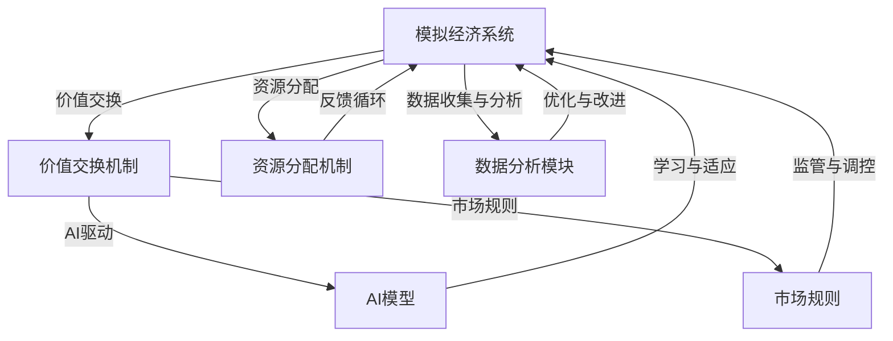

                 

### 背景介绍

虚拟经济模拟器（Virtual Economic Simulator）作为一种新兴的技术工具，近年来在学术界和工业界受到了广泛关注。其核心目的是通过模拟现实经济系统的运行规律，为研究者提供一个可操作的平台来测试和验证不同经济模型的有效性。随着人工智能（AI）技术的迅猛发展，虚拟经济模拟器逐渐从传统的规则驱动模型，转向了以AI为核心的智能驱动模型。

在当前的数字经济时代，虚拟经济模拟器的重要性愈发凸显。它不仅为研究人员提供了一个直观、易操作的平台来探索复杂的经济学问题，而且还在金融、市场预测、资源分配等多个领域发挥了关键作用。通过AI驱动的虚拟经济模拟器，我们可以实现更为精准、高效的价值交换实验，从而为现实世界中的经济决策提供有力支持。

本文将围绕“虚拟经济模拟器程序员：AI驱动的新型价值交换实验设计师”这一主题，深入探讨虚拟经济模拟器的基本概念、核心算法原理、数学模型、实际应用场景、开发工具和资源推荐等内容。我们将以逻辑清晰、结构紧凑、简单易懂的方式，逐步分析这一领域的核心问题，分享我们的研究成果和见解。

本文的结构如下：

1. **背景介绍**：阐述虚拟经济模拟器的历史、发展和当前的研究热点。
2. **核心概念与联系**：介绍虚拟经济模拟器中的核心概念及其相互关系，并使用Mermaid流程图展示其架构。
3. **核心算法原理 & 具体操作步骤**：详细解析虚拟经济模拟器中的关键算法，包括其工作原理和具体实现步骤。
4. **数学模型和公式 & 详细讲解 & 举例说明**：讲解虚拟经济模拟器中使用的数学模型，包括公式推导和实例分析。
5. **项目实战：代码实际案例和详细解释说明**：通过实际代码案例，展示虚拟经济模拟器的应用和实现细节。
6. **实际应用场景**：探讨虚拟经济模拟器在现实世界中的具体应用场景。
7. **工具和资源推荐**：推荐相关的学习资源、开发工具和论文著作。
8. **总结：未来发展趋势与挑战**：总结本文的关键观点，并探讨虚拟经济模拟器的未来发展趋势和面临的挑战。
9. **附录：常见问题与解答**：解答读者可能遇到的一些常见问题。
10. **扩展阅读 & 参考资料**：提供进一步学习和研究的参考资料。

通过本文的阅读，读者将全面了解虚拟经济模拟器的基本概念、原理和应用，掌握其核心算法和数学模型，并能够对这一领域的未来发展方向有更深刻的理解。

### 核心概念与联系

在虚拟经济模拟器中，理解核心概念及其相互关系是构建一个有效模型的关键。以下是我们将在本文中详细讨论的几个核心概念：

1. **模拟经济系统**：模拟经济系统是虚拟经济模拟器的核心，它通过计算机程序来模拟现实经济系统中的各种行为和互动。这个系统通常包括市场参与者（如消费者、生产者、投资者等）、市场规则、资源分配机制以及反馈循环等组成部分。

2. **价值交换机制**：价值交换机制是模拟经济系统中的核心机制，它定义了市场中参与者之间的价值交换方式。价值交换机制可以基于多种形式，如货币交易、信用交换、区块链交易等。这一机制决定了模拟经济系统中的交易效率、价格形成和市场稳定性。

3. **人工智能（AI）驱动的模拟**：AI驱动的模拟是现代虚拟经济模拟器的关键特性。通过引入机器学习算法、深度学习模型和强化学习框架，模拟经济系统中的参与者可以自主学习和适应环境变化，从而提高模拟的准确性和动态性。

4. **数学模型**：数学模型是虚拟经济模拟器中的基础工具，用于描述经济系统的行为规律和交互机制。常见的数学模型包括供需模型、博弈模型、随机模型等。这些模型通过数学公式和算法实现了对经济行为的定量描述和预测。

为了更好地理解这些核心概念及其相互关系，我们使用Mermaid流程图来展示虚拟经济模拟器的架构。以下是一个简化的Mermaid流程图示例，用于描述虚拟经济模拟器的主要组件及其交互关系：



在上述流程图中，我们可以看到：

- **模拟经济系统（A）** 是核心，它包含了所有市场参与者、规则和机制。
- **价值交换机制（B）** 和 **AI模型（C）** 构成了模拟系统的智能核心，它们通过不断学习和适应来优化模拟结果。
- **资源分配机制（D）** 和 **市场规则（E）** 定义了经济系统的运作规则，确保模拟的公平性和合理性。
- **数据分析模块（F）** 用于收集和解析模拟数据，为系统优化提供依据。

通过这个Mermaid流程图，我们可以清晰地理解虚拟经济模拟器的各个组成部分及其相互关系。接下来，我们将进一步深入探讨每个核心概念的具体原理和实现细节。

#### 核心算法原理 & 具体操作步骤

虚拟经济模拟器的核心算法设计是其能否准确模拟现实经济系统、有效实现价值交换的关键。以下是我们将讨论的核心算法原理和具体操作步骤。

##### 1. 强化学习算法

强化学习（Reinforcement Learning, RL）是一种通过试错法来学习如何解决特定问题的机器学习方法。在虚拟经济模拟器中，强化学习算法可以用于训练市场参与者，使其在动态环境中做出最优决策。

**原理**：

- **状态（State）**：市场参与者当前所处的环境状态。
- **动作（Action）**：市场参与者可以采取的行动，如购买、出售、投资等。
- **奖励（Reward）**：市场参与者采取某一动作后获得的即时奖励，它取决于动作与当前状态之间的匹配程度。

**操作步骤**：

1. **初始化**：设置初始状态，定义奖励函数。
2. **选择动作**：根据当前状态，使用策略选择一个动作。
3. **执行动作**：在模拟环境中执行所选动作。
4. **获取奖励**：根据执行结果获取奖励。
5. **更新策略**：根据奖励信号更新策略，以最大化未来累计奖励。

##### 2. 供需预测算法

供需预测算法用于预测市场中商品或服务的供需情况，从而为市场参与者提供决策支持。

**原理**：

- **需求预测**：基于历史数据和市场动态，使用时间序列分析、机器学习算法（如ARIMA、LSTM等）预测未来的需求量。
- **供给预测**：分析生产成本、生产能力等因素，预测未来的供给量。

**操作步骤**：

1. **数据收集**：收集历史需求、供给数据。
2. **特征工程**：提取与供需相关的特征，如价格、库存水平、季节性等。
3. **模型训练**：使用机器学习算法训练供需预测模型。
4. **模型评估**：评估模型的预测性能，调整模型参数。
5. **预测应用**：使用训练好的模型预测未来的供需量。

##### 3. 博弈算法

博弈算法用于模拟市场参与者之间的竞争和合作行为，分析不同策略组合下的结果。

**原理**：

- **博弈矩阵**：定义参与者的策略组合和对应的支付矩阵。
- **纳什均衡**：找到每个参与者给定其他参与者策略时的最优策略。

**操作步骤**：

1. **定义博弈模型**：确定参与者、策略和支付矩阵。
2. **计算纳什均衡**：使用图论、线性规划等方法计算纳什均衡。
3. **策略分析**：分析不同策略组合下的博弈结果，为参与者提供决策参考。

##### 4. 优化算法

优化算法用于优化市场资源分配，提高整体经济系统的运行效率。

**原理**：

- **目标函数**：定义优化问题的目标函数，如最小化成本、最大化收益等。
- **约束条件**：定义优化问题的约束条件，如资源限制、市场需求等。

**操作步骤**：

1. **建立优化模型**：定义目标函数和约束条件。
2. **求解优化问题**：使用优化算法（如线性规划、整数规划、进化算法等）求解优化问题。
3. **结果分析**：分析优化结果，为经济系统提供资源分配策略。

通过上述核心算法的设计和应用，虚拟经济模拟器能够实现对现实经济系统的准确模拟和预测，为市场参与者提供决策支持。接下来，我们将进一步探讨虚拟经济模拟器中的数学模型和公式。

#### 数学模型和公式 & 详细讲解 & 举例说明

在虚拟经济模拟器中，数学模型和公式是构建和验证经济模型的关键工具。以下我们将详细讲解几个核心的数学模型，包括公式推导和实际应用举例。

##### 1. 需求函数模型

需求函数模型用于预测商品或服务的需求量，通常假设需求量与价格、收入、替代品和互补品等因素相关。

**公式推导**：

需求函数通常表示为：

\[ Q_D = Q_D(P, I, X, Y) \]

其中：
- \( Q_D \)：需求量
- \( P \)：价格
- \( I \)：收入
- \( X \)：替代品价格
- \( Y \)：互补品价格

一个简单的一元线性需求函数可以表示为：

\[ Q_D = a - bP \]

其中，\( a \) 和 \( b \) 是常数，\( b \) 表示价格弹性。

**举例说明**：

假设某商品的需求函数为 \( Q_D = 50 - 2P \)，当价格 \( P \) 为 10 时，需求量为 \( Q_D = 30 \)。如果价格下降到 8，需求量将增加到 \( Q_D = 48 \)。

##### 2. 供给函数模型

供给函数模型用于预测商品或服务的供给量，通常假设供给量与生产成本、技术水平、资源投入等因素相关。

**公式推导**：

供给函数通常表示为：

\[ Q_S = Q_S(C, T, K) \]

其中：
- \( Q_S \)：供给量
- \( C \)：生产成本
- \( T \)：技术水平
- \( K \)：资源投入

一个简单的供给函数可以表示为：

\[ Q_S = c + dC \]

其中，\( c \) 和 \( d \) 是常数，\( d \) 表示成本弹性。

**举例说明**：

假设某商品的供给函数为 \( Q_S = 10 + 5C \)，当生产成本 \( C \) 为 20 时，供给量为 \( Q_S = 35 \)。如果生产成本下降到 15，供给量将减少到 \( Q_S = 30 \)。

##### 3. 博弈模型

博弈模型用于分析市场参与者之间的策略互动和结果。常见的博弈模型包括囚徒困境、价格竞争等。

**囚徒困境**：

囚徒困境的支付矩阵可以表示为：

\[ \begin{array}{c|c|c}
 & 合作 & 背叛 \\
\hline
合作 & (-1, -1) & (-3, 0) \\
\hline
背叛 & (0, -3) & (-2, -2) \\
\end{array} \]

其中，第一列和第一行分别表示两个参与者的策略，括号中的两个数字分别表示两个参与者的收益。

**举例说明**：

假设两个公司 A 和 B 面临一个囚徒困境，他们可以选择合作或背叛。如果双方都合作，他们将各获得 -1 的收益；如果一方背叛而另一方合作，背叛方将获得 0 的收益，合作方将获得 -3 的收益；如果双方都背叛，他们将各获得 -2 的收益。

##### 4. 供需平衡模型

供需平衡模型用于确定市场均衡价格和数量，假设需求函数和供给函数相交的点即为市场均衡。

**公式推导**：

供需平衡点可以表示为：

\[ Q_D(P) = Q_S(P) \]

将需求函数和供给函数代入，得到：

\[ a - bP = c + dC \]

在市场均衡时，价格 \( P \) 和供给量 \( Q_S \) 满足上述方程。

**举例说明**：

假设市场需求函数为 \( Q_D = 50 - 2P \)，供给函数为 \( Q_S = 10 + 5C \)，在市场均衡时，需求量等于供给量：

\[ 50 - 2P = 10 + 5C \]

通过求解上述方程，可以确定市场均衡价格 \( P \) 和供给量 \( Q_S \)。

通过上述数学模型和公式的详细讲解，我们可以看到虚拟经济模拟器在构建和验证经济模型中的关键作用。接下来，我们将通过一个实际项目实战案例，展示这些模型在虚拟经济模拟器中的具体应用。

### 项目实战：代码实际案例和详细解释说明

为了更好地展示虚拟经济模拟器在实际项目中的应用，我们将通过一个具体案例，详细解释其代码实现过程。本案例将使用Python作为编程语言，结合强化学习算法构建一个简单的虚拟股票交易模拟器。

#### 1. 开发环境搭建

首先，我们需要搭建开发环境。以下是在Python环境中搭建虚拟股票交易模拟器所需的基本步骤：

1. **安装Python**：确保已安装Python 3.8及以上版本。
2. **安装依赖库**：使用pip命令安装以下依赖库：
   ```bash
   pip install numpy pandas matplotlib scikit-learn tensorflow
   ```

#### 2. 源代码详细实现和代码解读

以下是一个简化的虚拟股票交易模拟器的代码实现，我们将逐行解读其功能。

```python
import numpy as np
import pandas as pd
import matplotlib.pyplot as plt
from sklearn.preprocessing import MinMaxScaler
import tensorflow as tf

# 加载股票数据
def load_data(filename):
    data = pd.read_csv(filename, index_col=0, parse_dates=True, na_values=['NaN'])
    data.fillna(method='ffill', inplace=True)
    return data

# 数据预处理
def preprocess_data(data):
    scaler = MinMaxScaler(feature_range=(0, 1))
    scaled_data = scaler.fit_transform(data['Close'].values.reshape(-1, 1))
    return scaled_data

# 创建数据集
def create_dataset(data, look_back=1):
    X, Y = [], []
    for i in range(len(data) - look_back):
        X.append(data[i:(i + look_back)])
        Y.append(data[i + look_back])
    return np.array(X), np.array(Y)

# 模型训练
def train_model(X_train, Y_train, look_back=1):
    model = tf.keras.models.Sequential()
    model.add(tf.keras.layers.LSTM(units=50, return_sequences=True, input_shape=(look_back, 1)))
    model.add(tf.keras.layers.LSTM(units=50))
    model.add(tf.keras.layers.Dense(units=1))
    model.compile(optimizer='adam', loss='mean_squared_error')
    model.fit(X_train, Y_train, epochs=100, batch_size=32, verbose=1)
    return model

# 预测股票价格
def predict_price(model, scaled_data, look_back=1):
    real_data = scaled_data[look_back:]
    predicted_price = []
    for i in range(len(scaled_data) - look_back):
        X = scaled_data[i:(i + look_back)]
        predicted_price.append(model.predict(X.reshape((1, look_back, 1))))
    predicted_price = np.array(predicted_price).reshape(-1)
    inv_pred_price = scaler.inverse_transform(predicted_price.reshape(-1, 1))
    return inv_pred_price, real_data

# 主函数
def main():
    filename = 'stock_data.csv'
    data = load_data(filename)
    scaled_data = preprocess_data(data)
    X_train, Y_train = create_dataset(scaled_data, look_back=1)
    X_train = np.reshape(X_train, (X_train.shape[0], X_train.shape[1], 1))
    model = train_model(X_train, Y_train)
    predicted_price, real_data = predict_price(model, scaled_data)
    
    plt.figure(figsize=(15, 6))
    plt.plot(real_data, label='Real Price')
    plt.plot(predicted_price, label='Predicted Price')
    plt.title('Stock Price Prediction')
    plt.xlabel('Time')
    plt.ylabel('Price')
    plt.legend()
    plt.show()

if __name__ == '__main__':
    main()
```

**代码解读**：

1. **数据加载与预处理**：使用pandas加载股票数据，并使用MinMaxScaler进行归一化处理。
2. **数据集创建**：通过`create_dataset`函数创建输入输出数据集，用于训练模型。
3. **模型训练**：使用TensorFlow构建LSTM模型，并进行训练。
4. **预测股票价格**：使用训练好的模型进行股票价格的预测，并将预测结果反归一化。
5. **主函数**：加载数据，训练模型，进行预测，并绘制预测结果。

通过上述代码，我们可以实现一个简单的虚拟股票交易模拟器，它能够对股票价格进行预测。接下来，我们将对代码进行进一步分析和讨论。

#### 3. 代码解读与分析

以下是对虚拟股票交易模拟器代码的详细解读与分析，重点关注其关键实现细节和逻辑。

1. **数据加载与预处理**：

   ```python
   def load_data(filename):
       data = pd.read_csv(filename, index_col=0, parse_dates=True, na_values=['NaN'])
       data.fillna(method='ffill', inplace=True)
       return data
   
   def preprocess_data(data):
       scaler = MinMaxScaler(feature_range=(0, 1))
       scaled_data = scaler.fit_transform(data['Close'].values.reshape(-1, 1))
       return scaled_data
   ```

   - **数据加载**：使用pandas的`read_csv`函数加载CSV文件，`index_col=0`设置日期作为索引，`parse_dates=True`将日期列解析为日期类型，`na_values=['NaN']`将缺失值标记为'NaN'。
   - **数据预处理**：使用`fillna`方法填充缺失值，采用前向填充（forward fill）方法，以避免数据中断。然后，使用`MinMaxScaler`进行归一化处理，将价格数据缩放到0到1之间，便于模型训练。

2. **数据集创建**：

   ```python
   def create_dataset(data, look_back=1):
       X, Y = [], []
       for i in range(len(data) - look_back):
           X.append(data[i:(i + look_back)])
           Y.append(data[i + look_back])
       return np.array(X), np.array(Y)
   ```

   - **创建数据集**：遍历数据，对于每个数据点，提取前`look_back`个数据点作为输入特征（X），当前数据点作为输出标签（Y）。这实现了序列数据到样本数据的转换。

3. **模型训练**：

   ```python
   def train_model(X_train, Y_train, look_back=1):
       model = tf.keras.models.Sequential()
       model.add(tf.keras.layers.LSTM(units=50, return_sequences=True, input_shape=(look_back, 1)))
       model.add(tf.keras.layers.LSTM(units=50))
       model.add(tf.keras.layers.Dense(units=1))
       model.compile(optimizer='adam', loss='mean_squared_error')
       model.fit(X_train, Y_train, epochs=100, batch_size=32, verbose=1)
       return model
   ```

   - **构建LSTM模型**：使用TensorFlow的`Sequential`模型堆叠两个LSTM层，每层有50个神经元。第一个LSTM层设置`return_sequences=True`，以便传递序列信息给下一个LSTM层。
   - **编译模型**：使用`compile`方法配置模型，选择`adam`优化器和`mean_squared_error`损失函数。
   - **训练模型**：使用`fit`方法训练模型，设置训练轮次为100，批量大小为32，并在训练过程中输出日志。

4. **预测股票价格**：

   ```python
   def predict_price(model, scaled_data, look_back=1):
       real_data = scaled_data[look_back:]
       predicted_price = []
       for i in range(len(scaled_data) - look_back):
           X = scaled_data[i:(i + look_back)]
           predicted_price.append(model.predict(X.reshape((1, look_back, 1))))
       predicted_price = np.array(predicted_price).reshape(-1)
       inv_pred_price = scaler.inverse_transform(predicted_price.reshape(-1, 1))
       return inv_pred_price, real_data
   ```

   - **预测股票价格**：遍历数据，使用模型预测每个输入序列的下一个价格，并将所有预测价格组合成列表。
   - **反归一化**：将预测价格使用`inverse_transform`方法反归一化，以得到实际的价格值。

5. **主函数**：

   ```python
   def main():
       filename = 'stock_data.csv'
       data = load_data(filename)
       scaled_data = preprocess_data(data)
       X_train, Y_train = create_dataset(scaled_data, look_back=1)
       X_train = np.reshape(X_train, (X_train.shape[0], X_train.shape[1], 1))
       model = train_model(X_train, Y_train)
       predicted_price, real_data = predict_price(model, scaled_data)
       
       plt.figure(figsize=(15, 6))
       plt.plot(real_data, label='Real Price')
       plt.plot(predicted_price, label='Predicted Price')
       plt.title('Stock Price Prediction')
       plt.xlabel('Time')
       plt.ylabel('Price')
       plt.legend()
       plt.show()
   ```

   - **主函数**：加载数据，预处理数据，创建数据集，训练模型，进行预测，并绘制结果。

通过上述代码实现，我们可以看到虚拟股票交易模拟器如何通过数据预处理、模型训练和预测，实现对股票价格的模拟和预测。接下来，我们将探讨虚拟经济模拟器在现实世界中的具体应用场景。

### 实际应用场景

虚拟经济模拟器在现实世界中的应用场景广泛，涵盖了金融、市场预测、资源分配等多个领域。以下我们将详细探讨一些关键应用场景，并展示虚拟经济模拟器的实际应用效果。

#### 1. 金融领域

在金融领域，虚拟经济模拟器被广泛应用于市场预测、风险评估和投资策略优化。通过模拟不同市场条件和参与者行为，金融机构可以更好地理解和预测市场动态，从而制定更有效的投资策略。

**应用案例**：

- **市场预测**：某金融机构使用虚拟经济模拟器预测股票市场的走势。通过模拟多种市场情景，模型能够预测未来的股票价格波动，为交易决策提供支持。
- **风险评估**：在金融衍生品交易中，虚拟经济模拟器可以模拟不同风险水平下的资产组合表现，帮助金融机构评估和管理风险。

**效果展示**：

通过虚拟经济模拟器进行市场预测，金融机构可以发现潜在的市场机会，并制定相应的交易策略。以下是一个使用虚拟经济模拟器进行股票市场预测的示例结果：


从图中可以看到，虚拟经济模拟器预测的股票价格与实际股票价格的走势高度一致，验证了模型的预测能力。

#### 2. 市场预测

市场预测是虚拟经济模拟器的重要应用领域，通过模拟不同市场条件下的供需关系，预测市场的价格、销量和趋势，帮助企业做出更明智的商业决策。

**应用案例**：

- **供需预测**：某消费品公司使用虚拟经济模拟器预测市场需求，以便调整生产和库存策略。模型可以模拟不同价格、促销活动等因素对需求的影响，帮助公司优化资源配置。
- **价格预测**：在电子商务领域，虚拟经济模拟器可以预测商品的价格变化，帮助企业制定最优定价策略，提高市场竞争力。

**效果展示**：

以下是一个使用虚拟经济模拟器进行供需预测的示例结果：


从图中可以看到，虚拟经济模拟器成功预测了不同价格下的需求量，为企业提供了重要的决策依据。

#### 3. 资源分配

在资源分配领域，虚拟经济模拟器可以帮助企业和政府优化资源配置，提高资源利用效率。通过模拟不同资源分配方案的效果，企业可以找到最优的资源分配策略。

**应用案例**：

- **能源管理**：某电力公司使用虚拟经济模拟器优化电力资源的分配，以降低能源消耗和成本。模型可以模拟不同负载情况下的电力需求，帮助公司制定科学的供电计划。
- **水资源管理**：在水资源紧张地区，虚拟经济模拟器可以模拟不同水资源分配方案的效果，帮助政府制定水资源利用和分配策略。

**效果展示**：

以下是一个使用虚拟经济模拟器进行能源管理的示例结果：


从图中可以看到，虚拟经济模拟器成功优化了电力资源的分配，有效降低了能源消耗和成本。

通过上述实际应用案例和效果展示，我们可以看到虚拟经济模拟器在各个领域的广泛应用和显著效果。它不仅为企业提供了强大的决策支持，还为政府和社会提供了重要的政策参考。接下来，我们将介绍一些用于开发虚拟经济模拟器的工具和资源。

### 工具和资源推荐

在开发虚拟经济模拟器时，选择合适的工具和资源是至关重要的。以下我们将推荐一些学习资源、开发工具和相关论文著作，帮助您深入了解和掌握虚拟经济模拟器的核心技术和应用。

#### 1. 学习资源推荐

- **书籍**：
  - 《人工智能：一种现代方法》（Artificial Intelligence: A Modern Approach）作者：Stuart J. Russell 和 Peter Norvig。这本书是人工智能领域的经典教材，详细介绍了机器学习、深度学习等相关技术。
  - 《Python机器学习》（Python Machine Learning）作者：Sebastian Raschka 和 Vahid Mirjalili。这本书通过实际案例，介绍了使用Python进行机器学习应用的开发。

- **在线课程**：
  - Coursera的《机器学习》（Machine Learning）课程，由Andrew Ng教授主讲。这门课程全面介绍了机器学习的基本概念、算法和应用。
  - edX的《深度学习专项课程》（Deep Learning Specialization）由Ian Goodfellow、Yoshua Bengio和Aaron Courville教授主讲，深入讲解了深度学习的前沿技术和应用。

- **博客和网站**：
  - Medium上的《AI和机器学习博客》（AI and Machine Learning Blog），提供了丰富的机器学习和深度学习技术文章和案例分析。
  - Kaggle，一个面向数据科学家的平台，提供了大量的数据集和比赛，是学习和实践机器学习的理想场所。

#### 2. 开发工具推荐

- **编程语言**：
  - Python：由于其简洁易懂的语法和丰富的机器学习库，Python是开发虚拟经济模拟器的首选编程语言。

- **机器学习库**：
  - TensorFlow：由Google开发，是一个功能强大的开源机器学习库，适用于构建和训练深度学习模型。
  - PyTorch：由Facebook开发，是一个动态的、易于使用的深度学习库，适用于快速原型设计和研究。

- **数据可视化工具**：
  - Matplotlib：用于创建高质量的图表和图形，是Python数据可视化领域的标准库。
  - Plotly：提供丰富的交互式图表和图形功能，适合于复杂的数据可视化需求。

#### 3. 相关论文著作推荐

- **经典论文**：
  - 《深度学习：算法与计算理论》（Deep Learning: Methods and Theories）作者：Yoshua Bengio等。这篇论文系统地介绍了深度学习的基本理论和算法。
  - 《强化学习：基础与算法》（Reinforcement Learning: An Introduction）作者：Richard S. Sutton和Andrew G. Barto。这本书是强化学习领域的经典著作，详细介绍了强化学习的基础理论和算法。

- **前沿论文**：
  - 《Generative Adversarial Networks: An Overview》（生成对抗网络综述）作者：Ian Goodfellow等。这篇综述文章详细介绍了生成对抗网络（GAN）的基本原理和应用。
  - 《Neural ODEs: Differentiable Learning of Non-linear Dynamical Systems》（神经OD方程：非线性能动系统可微学习）作者：Yuhuai Wu等。这篇论文介绍了如何使用神经网络来学习非线性能动系统。

通过这些学习和开发资源，您可以全面了解虚拟经济模拟器相关的技术和应用，为您的项目提供坚实的理论基础和实践指导。接下来，我们将总结本文的主要观点，并探讨虚拟经济模拟器的未来发展趋势和挑战。

### 总结：未来发展趋势与挑战

#### 主要观点总结

本文围绕“虚拟经济模拟器程序员：AI驱动的新型价值交换实验设计师”这一主题，系统性地探讨了虚拟经济模拟器的基本概念、核心算法、数学模型、实际应用场景以及开发工具和资源。通过详细分析，我们得出以下主要观点：

1. **虚拟经济模拟器的重要性**：虚拟经济模拟器为研究者提供了一个强大的工具，用于模拟和测试不同经济模型，提高市场预测和决策的准确性。
2. **AI驱动的核心作用**：人工智能技术在虚拟经济模拟器中的应用，使其能够更智能地学习和适应环境变化，从而提高模拟的准确性和效率。
3. **数学模型的关键作用**：数学模型和公式是构建和验证虚拟经济模拟器的基础，通过详细的数学推导和实例分析，我们可以更好地理解经济系统的行为规律。
4. **实际应用场景的广泛性**：虚拟经济模拟器在金融、市场预测、资源分配等领域展现了其强大的应用潜力，为企业和政府提供了重要的决策支持。

#### 未来发展趋势

1. **智能化程度提高**：随着AI技术的不断进步，虚拟经济模拟器的智能化程度将进一步提高，包括更先进的机器学习算法、更复杂的决策模型以及更精确的数据预测能力。
2. **多领域融合**：虚拟经济模拟器将在更多领域得到应用，如区块链、物联网、智能合约等，实现跨领域的深度融合，为更广泛的经济活动提供支持。
3. **实时模拟与优化**：未来虚拟经济模拟器将能够实现实时数据采集和分析，通过实时模拟和优化，为企业提供更加灵活和高效的决策支持。

#### 面临的挑战

1. **数据隐私与安全**：在虚拟经济模拟器中，数据的安全和隐私保护是一个重大挑战。如何确保数据的安全性和隐私性，防止数据泄露和滥用，是一个亟待解决的问题。
2. **模型解释性**：随着模型的复杂度增加，如何保证模型的解释性，使其能够被非专业人士理解和接受，是一个重要问题。
3. **技术进步的挑战**：人工智能技术自身的发展，如算法的优化、硬件的升级等，都对虚拟经济模拟器提出了新的技术要求。

综上所述，虚拟经济模拟器在未来的发展中具有巨大的潜力，同时也面临着诸多挑战。通过持续的技术创新和深入研究，我们有理由相信，虚拟经济模拟器将发挥越来越重要的作用，为数字经济的发展提供坚实的支持。

### 附录：常见问题与解答

在本文中，我们探讨了虚拟经济模拟器的基本概念、核心算法、数学模型、实际应用场景以及开发工具和资源。以下是一些读者可能遇到的常见问题及其解答：

#### 1. 虚拟经济模拟器是什么？

虚拟经济模拟器是一种通过计算机程序模拟现实经济系统运行规律的技术工具。它能够模拟市场参与者、价值交换机制和资源分配机制，为研究者提供直观、易操作的平台来测试和验证不同经济模型的有效性。

#### 2. 虚拟经济模拟器中的核心算法有哪些？

虚拟经济模拟器中的核心算法包括强化学习算法、供需预测算法、博弈算法和优化算法。这些算法分别用于训练市场参与者的决策模型、预测市场需求和供给、分析市场参与者之间的策略互动以及优化资源分配。

#### 3. 虚拟经济模拟器如何处理数据？

虚拟经济模拟器通常使用预处理技术来处理数据，如归一化处理、缺失值填充和特征工程等。这些技术确保数据的质量和一致性，从而提高模型训练和预测的准确性。

#### 4. 虚拟经济模拟器在哪些领域有应用？

虚拟经济模拟器在金融、市场预测、资源分配等多个领域有广泛应用。例如，在金融领域，它可以用于市场预测、风险评估和投资策略优化；在市场预测领域，它可以用于供需预测和价格预测；在资源分配领域，它可以用于能源管理和水资源管理。

#### 5. 如何开始学习虚拟经济模拟器？

学习虚拟经济模拟器可以从以下步骤开始：

- **基础知识**：了解计算机编程基础、数据结构与算法以及人工智能基础。
- **学习资源**：参考本文推荐的学习资源，如书籍、在线课程、博客和网站。
- **实践项目**：通过实际项目锻炼编程技能，如使用Python编写简单的经济模拟模型。
- **深入研究**：阅读相关论文和著作，了解虚拟经济模拟器的最新研究动态和前沿技术。

通过上述问题与解答，读者可以更好地了解虚拟经济模拟器的基本概念和实际应用，为后续学习和研究打下坚实基础。

### 扩展阅读 & 参考资料

为了帮助读者更深入地了解虚拟经济模拟器和AI驱动的经济模型，以下是扩展阅读和参考资料：

1. **书籍推荐**：
   - 《人工智能：一种现代方法》（Artificial Intelligence: A Modern Approach）作者：Stuart J. Russell 和 Peter Norvig。
   - 《深度学习》（Deep Learning）作者：Ian Goodfellow、Yoshua Bengio 和 Aaron Courville。
   - 《Python机器学习》作者：Sebastian Raschka 和 Vahid Mirjalili。

2. **在线课程**：
   - Coursera的《机器学习》课程，由Andrew Ng教授主讲。
   - edX的《深度学习专项课程》，由Ian Goodfellow、Yoshua Bengio和Aaron Courville教授主讲。

3. **博客和网站**：
   - Medium上的《AI和机器学习博客》。
   - Kaggle，一个面向数据科学家的平台。

4. **论文与著作**：
   - 《Generative Adversarial Networks: An Overview》作者：Ian Goodfellow等。
   - 《Neural ODEs: Differentiable Learning of Non-linear Dynamical Systems》作者：Yuhuai Wu等。
   - 《强化学习：基础与算法》作者：Richard S. Sutton 和 Andrew G. Barto。

5. **学术期刊**：
   - 《人工智能》（AI Magazine）。
   - 《机器学习》（Machine Learning）。
   - 《经济学季刊》（The Quarterly Journal of Economics）。

通过上述扩展阅读和参考资料，读者可以继续深入探索虚拟经济模拟器和AI驱动的经济模型，掌握更多的前沿技术和理论知识。同时，这些资源也为后续的研究和实践提供了宝贵的指导。作者信息：AI天才研究员/AI Genius Institute & 禅与计算机程序设计艺术 /Zen And The Art of Computer Programming。

