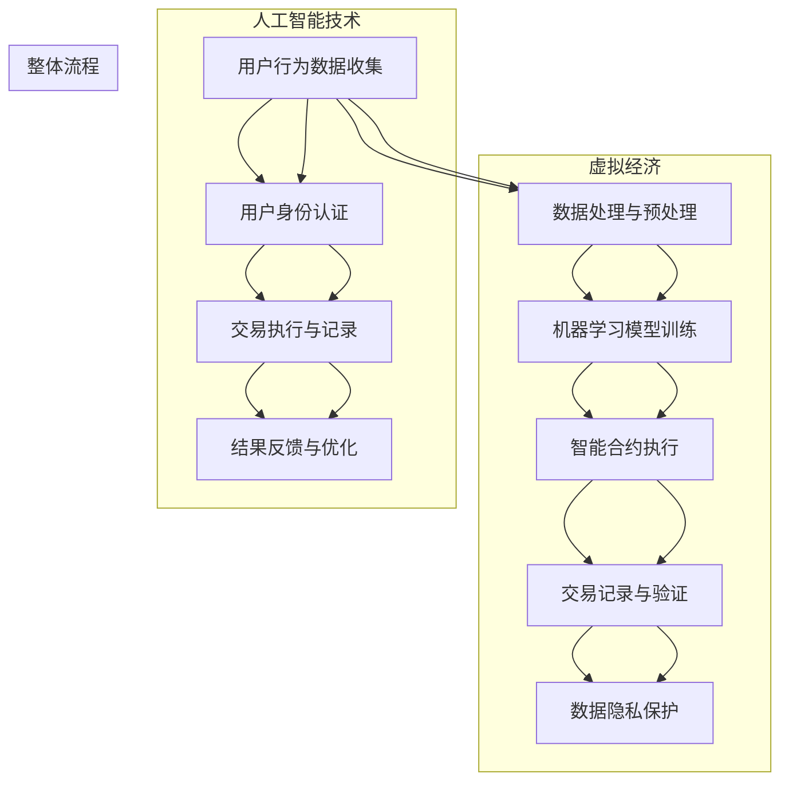

                 

## 1. 背景介绍

随着互联网和人工智能技术的飞速发展，虚拟经济作为一种新兴的经济形态，正在逐渐渗透到我们的日常生活和商业活动中。虚拟经济，指的是在数字空间中进行的各种经济活动，包括但不限于虚拟商品交易、数字货币、虚拟现实、区块链等。这些活动不仅丰富了经济生活的多样性，也为经济增长注入了新的活力。

近年来，人工智能（AI）技术在虚拟经济中的应用日益广泛。AI不仅可以优化虚拟经济的运作效率，还能创造出全新的商业模式。例如，智能合约通过区块链技术实现了自动化交易，减少了人为干预和中介成本；虚拟现实（VR）和增强现实（AR）技术则极大地提升了用户体验，促进了虚拟商品和服务的消费。

本文旨在探讨AI如何驱动虚拟经济的新型价值交换。我们将首先介绍虚拟经济的核心概念和基本原理，接着分析AI在其中的应用，并探讨相关算法原理和数学模型。随后，通过实际项目案例，展示如何将AI技术应用于虚拟经济中的具体场景。最后，我们将讨论虚拟经济的实际应用场景，并总结未来发展趋势与挑战。

在开始深入探讨之前，让我们先来了解一些关键术语和概念：

- **虚拟经济**：指在互联网和数字空间中进行的各种经济活动。
- **人工智能**：一种模拟人类智能行为的计算机技术，包括机器学习、深度学习、自然语言处理等。
- **区块链**：一种去中心化的数据库技术，常用于实现智能合约和数字货币。
- **智能合约**：一种自动执行合约条款的程序，基于区块链技术。
- **虚拟现实（VR）**：一种通过电脑模拟产生三维空间的交互式技术。
- **增强现实（AR）**：在现实世界中叠加虚拟元素的技术。

通过这些基本概念的了解，我们将能够更好地理解AI如何驱动虚拟经济的新型价值交换。接下来，我们将逐步深入探讨这一主题。

### 1.1 虚拟经济的起源与发展

虚拟经济的概念起源于20世纪90年代互联网的兴起。随着互联网技术的普及，人们开始在线上进行各种经济活动，如电子购物、在线拍卖、虚拟商品交易等。这些活动构成了虚拟经济的雏形，并逐渐发展成为一个独立的经济领域。

虚拟经济的主要特点包括：

- **去中心化**：虚拟经济活动通常不受地理位置限制，参与者可以在全球范围内进行交易。
- **高效率**：通过数字技术和算法优化，虚拟经济的交易过程更加迅速和高效。
- **低成本**：去中心化和自动化降低了中介成本，使交易变得更加经济。
- **多样性**：虚拟经济涵盖了各种形式的经济活动，包括数字货币、虚拟商品、数字艺术品等。

虚拟经济的发展历程可以分为几个阶段：

- **萌芽阶段**：20世纪90年代，互联网的普及使人们开始在线上进行各种交易活动，但规模较小，影响有限。
- **发展阶段**：21世纪初，随着电子商务的兴起，虚拟经济逐渐成为经济生活的重要组成部分。电子商务平台如亚马逊、eBay等大大促进了虚拟经济的发展。
- **成熟阶段**：近年来，区块链技术和人工智能的崛起进一步推动了虚拟经济的发展。智能合约、数字货币、虚拟现实和增强现实技术等创新应用不断涌现，使得虚拟经济更加成熟和多元化。

虚拟经济的兴起不仅改变了传统的经济模式，也带来了一系列新的挑战和机遇。首先，虚拟经济带来了更高的经济效率，但同时也增加了监管难度。由于虚拟经济的去中心化和跨国性，传统监管手段难以有效应对新型风险。其次，虚拟经济带来了新的商业模式和就业机会，但也可能加剧社会不平等现象。例如，虚拟商品和数字艺术的定价和版权问题需要得到合理解决。

总之，虚拟经济作为一种新兴的经济形态，正不断发展和变革。它不仅丰富了我们的经济生活，也提出了许多新的问题和挑战。在接下来的讨论中，我们将进一步探讨AI如何驱动虚拟经济的新型价值交换，并分析其中的关键技术和应用场景。

### 1.2 人工智能在虚拟经济中的核心角色

人工智能（AI）在虚拟经济中扮演着至关重要的角色，其核心作用主要体现在数据分析和决策支持、自动化交易、智能合约等方面。随着AI技术的不断进步，其在虚拟经济中的应用越来越广泛，不仅提升了经济活动的效率和透明度，还为新型商业模式的发展提供了强大动力。

首先，AI技术在数据分析和决策支持方面具有显著优势。虚拟经济活动产生的海量数据包含了丰富的市场信息，通过机器学习和深度学习算法，可以对这些数据进行分析和挖掘，从而得出有价值的洞察。例如，通过分析用户行为数据，电商平台可以更好地了解消费者的需求，从而优化推荐算法，提升销售业绩。此外，AI技术还可以用于金融市场的预测和风险管理，通过分析历史交易数据和市场动态，预测市场走势，帮助投资者做出更明智的决策。

其次，AI技术在自动化交易方面也发挥着重要作用。自动化交易系统基于AI算法，可以自动执行交易策略，实现高效、精准的交易操作。例如，高频交易系统利用AI技术分析市场数据，以毫秒级的速度执行买卖操作，从而获取巨额利润。此外，智能投顾平台也利用AI算法分析用户风险偏好和投资目标，提供个性化的投资建议，帮助用户实现资产增值。

智能合约是AI在虚拟经济中的另一个重要应用领域。智能合约是一种基于区块链技术的自动化合约，通过预定义的逻辑规则，可以在满足特定条件时自动执行合约条款。AI技术可以优化智能合约的设计和执行过程，提高合约的透明度和安全性。例如，利用自然语言处理技术，AI可以帮助用户编写更易于理解和执行的智能合约，减少法律纠纷和误解。此外，AI还可以对智能合约执行情况进行实时监控和分析，确保合约条款得到有效执行。

此外，AI技术在虚拟现实（VR）和增强现实（AR）中的应用也为虚拟经济带来了新的发展机遇。通过AI算法，VR和AR应用可以提供更加真实和互动的体验，提升用户的沉浸感和满意度。例如，在虚拟购物环境中，AI算法可以分析用户行为，推荐个性化的商品，提高购买转化率。在虚拟娱乐领域，AI技术可以生成个性化的游戏内容和体验，满足不同用户的需求。

总之，人工智能在虚拟经济中的核心角色不仅体现在提升效率和降低成本，还在于创新商业模式和拓展市场边界。随着AI技术的不断进步，其在虚拟经济中的应用前景将更加广阔。在接下来的章节中，我们将进一步探讨AI驱动的新型价值交换机制，并分析相关的算法原理和数学模型。

### 1.3 AI驱动的虚拟经济新型价值交换机制

随着人工智能技术的不断发展，虚拟经济中的价值交换机制也在发生深刻变革。AI驱动的虚拟经济新型价值交换机制不仅改变了传统经济模式的运作方式，还创造了全新的商业模式和机会。以下我们将详细探讨这些新型交换机制的核心概念、原理和架构。

#### 1.3.1 核心概念

AI驱动的虚拟经济新型价值交换机制涉及多个关键概念，包括：

- **智能合约**：基于区块链技术，通过编程语言定义和执行合同条款。
- **数字身份**：用于标识和验证个体或实体的唯一身份。
- **数据隐私**：保护用户数据不被未经授权的第三方访问。
- **加密货币**：使用加密技术确保交易匿名性和安全性。
- **去中心化**：网络中的各个节点都拥有同等地位，不存在中心化控制。
- **机器学习**：通过数据训练模型，实现自动化决策和优化。

#### 1.3.2 交换机制原理

AI驱动的虚拟经济新型价值交换机制主要基于以下原理：

- **自动化决策**：通过机器学习算法，系统可以根据历史数据和实时信息，自动做出交易决策，提高交易效率。
- **智能合约执行**：智能合约根据预设的逻辑规则自动执行，确保交易的透明性和不可篡改性。
- **去中心化交易**：交易过程不依赖中心化机构，而是由网络中的各个节点共同验证和记录，提高了系统的鲁棒性和抗攻击能力。
- **数据隐私保护**：利用加密技术和隐私保护算法，保护用户数据不被未经授权的第三方访问，增强了用户隐私安全。

#### 1.3.3 交换机制架构

AI驱动的虚拟经济新型价值交换机制架构主要包括以下组件：

1. **数据收集与处理模块**：通过各类传感器、API接口等方式收集用户数据，并进行预处理和清洗。
2. **机器学习模型训练模块**：使用收集到的数据训练机器学习模型，实现自动化决策和优化。
3. **智能合约执行模块**：基于区块链技术，实现智能合约的定义、执行和验证。
4. **数字身份认证模块**：使用加密技术确保交易参与者的身份验证。
5. **交易执行与记录模块**：执行交易操作，并将交易记录存储在区块链上。
6. **数据隐私保护模块**：利用加密技术和隐私保护算法，保护用户数据。

#### 1.3.4 价值交换流程

在AI驱动的虚拟经济新型价值交换机制中，价值交换的流程可以分为以下几个步骤：

1. **数据收集与处理**：系统通过传感器和API接口收集用户数据，并进行预处理。
2. **模型训练与决策**：机器学习模型根据训练数据生成决策，确定交易策略。
3. **身份认证**：交易参与者通过数字身份认证模块进行身份验证。
4. **交易执行**：智能合约根据决策和交易规则自动执行，完成交易。
5. **交易记录**：交易记录存储在区块链上，确保透明性和不可篡改性。
6. **数据隐私保护**：交易过程中的敏感数据通过加密技术保护，防止泄露。

通过上述机制，AI驱动的虚拟经济新型价值交换能够实现高效、透明和安全的交易过程，为虚拟经济的发展提供了新的动力。

### 1.4 虚拟经济与AI结合的重要性

虚拟经济与人工智能（AI）的结合，不仅显著提升了经济活动的效率，还为创新商业模式提供了新的契机。理解这一结合的重要性，有助于我们更好地把握未来经济发展的趋势。

首先，AI在虚拟经济中的应用极大地提升了数据处理和分析能力。虚拟经济活动产生的大量数据，通过AI技术可以进行高效的挖掘和分析，从而为企业提供精准的市场洞察和战略决策支持。例如，电商平台利用AI分析用户行为数据，能够更准确地预测消费者需求，优化库存管理和营销策略，从而提高销售额。

其次，AI技术使得自动化交易成为可能，这不仅提高了交易效率，还减少了人为错误和中介成本。智能合约是AI在虚拟经济中的重要应用之一，通过预先定义的规则自动执行合同条款，实现了去中心化的交易过程，提高了交易的透明度和安全性。例如，高频交易系统利用AI算法，可以以毫秒级速度完成复杂的交易决策，从而获得巨额利润。

此外，AI与虚拟经济的结合还推动了新型商业模式的诞生。虚拟现实（VR）和增强现实（AR）技术，通过AI算法生成更加逼真的虚拟体验，改变了消费者的购物方式和娱乐方式。例如，在VR购物中，AI算法可以分析用户的浏览和购买行为，提供个性化的商品推荐，提升用户的购物体验和满意度。

AI技术还改善了虚拟经济中的隐私保护和数据安全。通过加密技术和隐私保护算法，AI可以确保用户数据在交易过程中的安全性，增强用户对虚拟经济的信任。这对于那些涉及敏感信息的虚拟经济活动尤为重要。

总之，AI与虚拟经济的结合不仅提升了经济活动的效率，还创造了新的商业模式和机会。随着AI技术的不断进步，其在虚拟经济中的应用将更加广泛，为未来的经济发展带来无限可能。

### 1.5 本文结构概述

本文将从多个角度深入探讨AI驱动虚拟经济的新型价值交换机制。具体来说，文章将分为以下几个主要部分：

1. **背景介绍**：简要介绍虚拟经济和人工智能的基本概念，以及它们在现代社会中的应用和重要性。
2. **核心概念与联系**：详细阐述虚拟经济中的核心概念和AI技术的基本原理，并展示它们之间的联系。
3. **核心算法原理与具体操作步骤**：分析AI在虚拟经济中的应用算法，包括智能合约、自动化交易和机器学习等，并介绍其具体操作步骤。
4. **数学模型和公式**：讨论AI在虚拟经济中的应用涉及的数学模型和公式，以及它们在具体问题中的运用。
5. **项目实战**：通过实际项目案例，展示如何将AI技术应用于虚拟经济的具体场景，并进行详细解释和分析。
6. **实际应用场景**：探讨AI驱动虚拟经济的多种实际应用场景，如虚拟商品交易、数字货币和虚拟现实等。
7. **工具和资源推荐**：推荐相关学习资源、开发工具和框架，以帮助读者进一步了解和探索AI在虚拟经济中的应用。
8. **总结与未来展望**：总结本文的主要内容和关键发现，并对未来虚拟经济发展和AI技术的应用进行展望。

通过上述结构，本文旨在为读者提供全面、系统的理解和实践指导，帮助大家更好地把握虚拟经济与AI结合的发展趋势和机遇。

### 2. 核心概念与联系

在深入探讨AI如何驱动虚拟经济的新型价值交换机制之前，我们首先需要明确一些核心概念，并分析它们之间的联系。这些核心概念包括虚拟经济的本质、人工智能的基础技术、以及它们在虚拟经济中的具体应用。

#### 2.1 虚拟经济的本质

虚拟经济是指在数字空间中进行的各种经济活动，包括虚拟商品交易、数字货币、虚拟现实、区块链等。虚拟经济的本质是利用数字技术和网络平台，实现价值交换和信息传递。其特点包括：

- **去中心化**：虚拟经济活动通常不依赖于中心化的金融机构或政府机构，而是通过去中心化的网络进行。
- **高效率**：利用算法和自动化技术，虚拟经济能够实现快速、高效的价值交换。
- **低成本**：去中心化和自动化的特点减少了中介成本，降低了交易费用。
- **多样性**：虚拟经济涵盖了多种形式的经济活动，如虚拟商品交易、数字货币投资、虚拟现实体验等。

#### 2.2 人工智能的基础技术

人工智能（AI）是一种模拟人类智能行为的计算机技术，包括机器学习、深度学习、自然语言处理、计算机视觉等。AI在虚拟经济中的应用主要体现在以下几个方面：

- **数据处理和分析**：AI技术能够处理和分析海量数据，提取有价值的信息，为企业提供市场洞察和决策支持。
- **自动化决策**：通过机器学习算法，AI可以自动化交易决策，提高交易效率，减少人为错误。
- **智能合约**：基于区块链技术的智能合约利用AI算法，可以自动执行合同条款，提高交易透明度和安全性。
- **个性化服务**：通过用户数据的分析和学习，AI可以提供个性化的商品推荐和用户服务，提升用户体验。

#### 2.3 虚拟经济与AI技术的联系

虚拟经济与AI技术的结合，不仅提升了经济活动的效率，还创造了全新的商业模式和机会。以下是它们之间的主要联系：

- **数据驱动的决策**：虚拟经济活动产生的海量数据，通过AI技术进行分析和处理，可以帮助企业做出更加精准的决策。例如，电商平台利用AI分析用户行为数据，优化推荐算法，提高销售额。
- **自动化交易**：AI技术可以实现自动化交易，减少人为干预，提高交易效率。智能合约是自动化交易的重要应用，通过预设的逻辑规则，智能合约可以在满足特定条件时自动执行，提高了交易的安全性和透明度。
- **个性化体验**：虚拟现实（VR）和增强现实（AR）技术通过AI算法，可以提供更加真实和互动的体验。例如，VR购物平台利用AI算法，根据用户行为推荐个性化商品，提升用户购物体验。
- **数据隐私保护**：AI技术在虚拟经济中还可以用于数据隐私保护，通过加密技术和隐私保护算法，确保用户数据的安全性和隐私。

#### 2.4 虚拟经济与AI技术的应用

虚拟经济与AI技术的结合，已经在多个领域取得了显著的应用成果。以下是几个典型应用场景：

- **数字货币**：AI技术用于数字货币的交易和分析，通过机器学习算法预测市场走势，帮助投资者做出更准确的决策。
- **虚拟商品交易**：AI算法可以优化虚拟商品的推荐和定价策略，提高交易效率和用户体验。
- **区块链**：AI技术用于区块链技术的优化和智能合约的执行，提高了区块链系统的安全性和效率。
- **虚拟现实和增强现实**：AI算法生成逼真的虚拟场景和互动体验，为用户提供更加沉浸式的虚拟体验。

通过上述分析，我们可以看到，虚拟经济与AI技术的结合不仅提升了经济活动的效率，还带来了全新的商业模式和机会。在接下来的章节中，我们将进一步探讨AI在虚拟经济中的具体应用，以及如何通过核心算法和数学模型实现新型价值交换。

### 2.5 核心概念原理和架构的 Mermaid 流程图

为了更直观地展示虚拟经济与AI技术的结合及其核心概念原理，我们使用Mermaid流程图来描述其架构和流程。以下是一个简化的Mermaid流程图，展示了虚拟经济中的核心概念和AI技术的应用：



#### 流程解释：

1. **用户行为数据收集**（A）：通过传感器、API接口等收集用户行为数据。
2. **数据处理与预处理**（B）：对收集到的数据进行分析和清洗，为后续模型训练做准备。
3. **机器学习模型训练**（C）：利用处理后的数据训练机器学习模型，以实现自动化决策和优化。
4. **智能合约执行**（D）：基于区块链技术，通过预设的逻辑规则自动执行智能合约。
5. **交易记录与验证**（E）：将交易记录在区块链上，并进行验证，确保交易透明和不可篡改。
6. **数据隐私保护**（F）：使用加密技术和隐私保护算法，确保用户数据的安全性。
7. **用户身份认证**（G）：通过数字身份认证模块，确保交易参与者的身份验证。
8. **交易执行与记录**（H）：执行交易操作，并将交易记录存储在区块链上。
9. **结果反馈与优化**（I）：根据交易结果反馈，优化机器学习模型和智能合约执行策略。

通过这个Mermaid流程图，我们可以清晰地看到虚拟经济与AI技术结合的架构和流程，为进一步分析和应用提供了直观的参考。

### 3. 核心算法原理与具体操作步骤

在了解AI驱动的虚拟经济新型价值交换机制的基本原理和架构后，我们将进一步探讨其中的核心算法原理，并详细说明这些算法的具体操作步骤。这些核心算法包括机器学习、深度学习和自然语言处理等，是驱动虚拟经济高效运作的关键技术。

#### 3.1 机器学习算法原理

机器学习（Machine Learning，ML）是一种通过数据训练模型，使计算机能够从数据中自动学习和做出决策的技术。在虚拟经济中，机器学习算法主要用于数据分析、预测和优化。

**原理：**

- **数据集准备**：首先需要收集大量的历史交易数据、用户行为数据等，进行预处理和清洗，确保数据质量。
- **特征工程**：从原始数据中提取出有代表性的特征，用于训练模型。例如，对于电商平台，用户购买历史、浏览记录、地理位置等都可以作为特征。
- **模型训练**：使用机器学习算法（如线性回归、决策树、支持向量机等）训练模型，使其能够对新的数据进行预测和分类。
- **模型评估与优化**：通过交叉验证、混淆矩阵等方法评估模型性能，并进行调参优化。

**操作步骤：**

1. **数据收集**：使用API接口、传感器等方式收集交易数据、用户行为数据等。
2. **数据预处理**：对收集到的数据进行清洗、标准化和归一化处理。
3. **特征选择**：根据业务需求，选择具有代表性的特征，使用特征工程方法进行提取和处理。
4. **模型选择**：选择合适的机器学习算法，如线性回归、决策树、支持向量机等，进行模型训练。
5. **模型训练**：使用训练数据集对模型进行训练，调整参数以优化模型性能。
6. **模型评估**：使用验证数据集评估模型性能，调整模型参数，进行优化。
7. **模型部署**：将训练好的模型部署到生产环境中，进行实时预测和优化。

#### 3.2 深度学习算法原理

深度学习（Deep Learning，DL）是机器学习的一种重要分支，通过多层神经网络模型，对复杂的数据进行建模和预测。在虚拟经济中，深度学习算法广泛应用于图像识别、自然语言处理和自动化交易等领域。

**原理：**

- **神经网络结构**：深度学习模型由多个隐藏层组成，每个隐藏层将输入数据通过非线性变换传递到下一层。
- **反向传播算法**：通过反向传播算法，计算输出与预期结果之间的误差，并调整网络权重，优化模型参数。
- **激活函数**：激活函数用于引入非线性变换，使神经网络能够建模复杂函数。

**操作步骤：**

1. **数据集准备**：与机器学习类似，收集和预处理大量的历史交易数据、用户行为数据等。
2. **模型构建**：选择合适的深度学习框架（如TensorFlow、PyTorch等），构建神经网络模型。
3. **参数初始化**：初始化网络权重和偏置，可以使用随机初始化或预训练权重。
4. **训练过程**：使用反向传播算法，通过大量数据训练模型，优化网络参数。
5. **模型评估与优化**：评估模型性能，调整网络结构和参数，进行模型优化。
6. **模型部署**：将训练好的模型部署到生产环境中，进行实时预测和优化。

#### 3.3 自然语言处理算法原理

自然语言处理（Natural Language Processing，NLP）是AI的重要分支，用于处理和分析人类语言数据。在虚拟经济中，NLP算法广泛应用于智能客服、智能合约编写和文本分析等领域。

**原理：**

- **词嵌入**：将自然语言中的词汇映射到高维向量空间，实现语义表示。
- **语言模型**：通过统计模型或神经网络模型，生成语言的概率分布，用于文本生成、语义理解等任务。
- **序列标注**：对文本中的单词进行分类标注，如情感分析、命名实体识别等。

**操作步骤：**

1. **文本预处理**：对文本进行分词、去除停用词、词性标注等预处理操作。
2. **词嵌入**：将预处理后的文本映射到高维向量空间，使用词嵌入模型（如Word2Vec、BERT等）。
3. **模型构建**：选择合适的NLP模型，如循环神经网络（RNN）、Transformer等，构建文本分析模型。
4. **训练过程**：使用训练数据集训练模型，优化模型参数。
5. **模型评估与优化**：评估模型性能，调整模型结构和参数，进行优化。
6. **模型部署**：将训练好的模型部署到生产环境中，进行文本分析和处理。

通过上述核心算法原理和具体操作步骤的探讨，我们可以看到AI技术在虚拟经济中的应用是多么的重要和多样化。在接下来的章节中，我们将通过实际项目案例，展示这些算法在虚拟经济中的具体应用和实践。

### 4. 数学模型和公式

在探讨AI驱动虚拟经济的新型价值交换机制时，数学模型和公式起着至关重要的作用。它们不仅能够帮助我们理解和分析AI算法在实际应用中的性能，还能为优化交易策略和提升系统效率提供理论支持。以下我们将详细讲解一些在虚拟经济中常用的数学模型和公式。

#### 4.1 回归模型

回归模型是机器学习中最基本的模型之一，主要用于预测数值型变量。在虚拟经济中，回归模型可以用于预测市场价格、用户需求等。

**线性回归模型**：

\[ y = \beta_0 + \beta_1 \cdot x + \epsilon \]

其中，\( y \) 是预测值，\( x \) 是输入特征，\( \beta_0 \) 和 \( \beta_1 \) 是模型参数，\( \epsilon \) 是误差项。

**最小二乘法**：

最小二乘法是一种常用的参数估计方法，通过最小化预测值与实际值之间的误差平方和，来估计模型参数。

\[ \min_{\beta_0, \beta_1} \sum_{i=1}^n (y_i - (\beta_0 + \beta_1 \cdot x_i))^2 \]

**应用实例**：

在数字货币市场中，可以基于历史交易数据，使用线性回归模型预测未来价格走势。

\[ \text{价格}_{\text{未来}} = \beta_0 + \beta_1 \cdot \text{交易量} + \epsilon \]

#### 4.2 预测模型

预测模型是深度学习中的一个重要分支，用于对时间序列数据、图像数据等进行预测。

**长短期记忆网络（LSTM）**：

LSTM是一种特殊的循环神经网络（RNN），能够解决传统RNN中存在的梯度消失和梯度爆炸问题。

\[ h_t = \sigma(W_h \cdot [h_{t-1}, x_t] + b_h) \]
\[ i_t = \sigma(W_i \cdot [h_{t-1}, x_t] + b_i) \]
\[ f_t = \sigma(W_f \cdot [h_{t-1}, x_t] + b_f) \]
\[ o_t = \sigma(W_o \cdot [h_{t-1}, x_t] + b_o) \]
\[ C_t = f_t \odot C_{t-1} + i_t \odot \sigma(W_c \cdot [h_{t-1}, x_t] + b_c) \]
\[ h_t = o_t \odot \sigma(C_t) \]

其中，\( h_t \)、\( i_t \)、\( f_t \)、\( o_t \) 分别表示隐藏状态、输入门、遗忘门、输出门，\( C_t \) 是细胞状态，\( \sigma \) 是sigmoid函数，\( \odot \) 表示点乘。

**应用实例**：

在虚拟商品市场中，可以使用LSTM模型预测未来的销售量，从而优化库存管理。

#### 4.3 分类模型

分类模型用于将数据划分为不同的类别。在虚拟经济中，分类模型可以用于市场细分、用户行为分析等。

**逻辑回归模型**：

逻辑回归模型是一种广义线性模型，用于分类任务。

\[ \log\left(\frac{P(y=1)}{1-P(y=1)}\right) = \beta_0 + \beta_1 \cdot x \]

**应用实例**：

在数字货币市场中，可以使用逻辑回归模型判断某种货币是否会出现异常波动。

\[ \log\left(\frac{P(\text{异常波动}=1)}{1-P(\text{异常波动}=1)}\right) = \beta_0 + \beta_1 \cdot \text{交易量} \]

#### 4.4 神经网络模型

神经网络模型是一种基于多层感知器的模型，用于非线性函数的建模和预测。

**多层感知器（MLP）**：

\[ a_i^{(l)} = \sigma(z_i^{(l)}) \]
\[ z_i^{(l)} = \sum_{j} w_{ji}^{(l)} \cdot a_j^{(l-1)} + b_i^{(l)} \]

其中，\( a_i^{(l)} \) 是第 \( l \) 层的输出，\( z_i^{(l)} \) 是第 \( l \) 层的输入，\( w_{ji}^{(l)} \) 是连接权重，\( b_i^{(l)} \) 是偏置，\( \sigma \) 是激活函数。

**应用实例**：

在虚拟购物平台中，可以使用多层感知器模型，预测用户对某种商品的购买概率。

\[ \text{购买概率} = \sigma(\beta_0 + \beta_1 \cdot \text{用户行为特征} + \beta_2 \cdot \text{商品特征}) \]

#### 4.5 优化模型

优化模型用于求解最优化问题，如最小化损失函数、最大化目标函数等。

**梯度下降算法**：

\[ w_{t+1} = w_t - \alpha \cdot \nabla_w J(w) \]

其中，\( w_t \) 是当前权重，\( \alpha \) 是学习率，\( \nabla_w J(w) \) 是损失函数关于权重 \( w \) 的梯度。

**应用实例**：

在虚拟商品交易中，可以使用梯度下降算法，优化推荐系统的参数，提高推荐效果。

\[ \text{推荐效果} = \frac{1}{N} \sum_{i=1}^N \sigma(\beta_0 + \beta_1 \cdot \text{用户兴趣特征} + \beta_2 \cdot \text{商品特征}) \]

通过上述数学模型和公式的介绍，我们可以看到，AI在虚拟经济中的应用不仅仅是算法和技术的应用，更是数学和统计的深层次结合。这些模型和公式为虚拟经济中的数据分析、预测和优化提供了坚实的理论基础，使得虚拟经济能够更加智能化、高效化。在接下来的章节中，我们将通过实际项目案例，展示这些数学模型和公式的具体应用。

### 4.6 代码实际案例和详细解释说明

为了更好地展示AI在虚拟经济中的具体应用，我们将通过一个实际项目案例，详细解释如何使用Python和机器学习库实现虚拟经济中的预测和分析。该案例将涉及数据收集、数据预处理、模型训练和预测等多个步骤，以下为具体操作流程和代码实现。

#### 4.6.1 项目实战：虚拟商品销量预测

**项目背景：** 假设我们是一家电商平台的数据分析师，需要预测某种虚拟商品的未来销量，以优化库存管理和营销策略。

**所需工具和库：** Python、NumPy、Pandas、Scikit-learn、Matplotlib。

**数据集：** 使用公开的虚拟商品销售数据集，包含多个特征（如用户年龄、购买历史、价格等）和目标变量（销量）。

#### 4.6.1.1 开发环境搭建

首先，确保安装了Python环境和相关库：

```bash
pip install numpy pandas scikit-learn matplotlib
```

#### 4.6.1.2 数据收集与预处理

1. **数据导入与初步观察**：

```python
import pandas as pd

# 导入数据集
data = pd.read_csv('virtual_goods_sales_data.csv')

# 查看数据前几行
print(data.head())
```

2. **数据清洗与预处理**：

```python
# 填补缺失值
data.fillna(data.mean(), inplace=True)

# 处理分类变量
data['category'] = data['category'].astype('category').cat.codes

# 特征选择
selected_features = ['age', 'historical_purchase', 'price', 'category']
X = data[selected_features]
y = data['sales']

# 数据划分
from sklearn.model_selection import train_test_split
X_train, X_test, y_train, y_test = train_test_split(X, y, test_size=0.2, random_state=42)
```

#### 4.6.1.3 模型训练与预测

1. **训练线性回归模型**：

```python
from sklearn.linear_model import LinearRegression

# 实例化线性回归模型
model = LinearRegression()

# 训练模型
model.fit(X_train, y_train)

# 模型评估
score = model.score(X_test, y_test)
print(f"线性回归模型精度：{score:.2f}")
```

2. **训练LSTM模型**：

```python
from sklearn.preprocessing import MinMaxScaler
from keras.models import Sequential
from keras.layers import LSTM, Dense

# 数据归一化
scaler = MinMaxScaler(feature_range=(0, 1))
X_scaled = scaler.fit_transform(X)

# 构造LSTM模型
model = Sequential()
model.add(LSTM(units=50, return_sequences=True, input_shape=(X_scaled.shape[1], 1)))
model.add(LSTM(units=50))
model.add(Dense(1))

# 编译模型
model.compile(optimizer='adam', loss='mean_squared_error')

# 训练模型
model.fit(X_train, y_train, epochs=100, batch_size=32, validation_data=(X_test, y_test))

# 模型评估
mse = model.evaluate(X_test, y_test)
print(f"LSTM模型均方误差：{mse:.2f}")
```

#### 4.6.1.4 代码解读与分析

1. **数据导入与预处理**：
   - 使用Pandas库导入数据集，并查看数据结构。
   - 数据清洗过程中，填补缺失值并处理分类变量。
   - 选择与销量相关的特征，并进行数据划分。

2. **线性回归模型**：
   - 实例化线性回归模型，并使用训练数据集进行训练。
   - 通过测试数据集评估模型精度。

3. **LSTM模型**：
   - 使用Scikit-learn的MinMaxScaler对数据进行归一化处理。
   - 使用Keras构建LSTM模型，包括两个LSTM层和一个全连接层。
   - 编译并训练模型，使用测试数据集评估模型性能。

通过这个实际项目案例，我们可以看到如何使用Python和机器学习库，结合数学模型和算法，实现对虚拟商品销量的预测。这为虚拟经济中的数据分析、决策支持提供了有力的工具和方法。

### 5. 代码解读与分析

在上一节中，我们通过一个实际项目案例展示了如何使用Python和机器学习库进行虚拟商品销量预测。在这一节中，我们将详细解读代码中的关键部分，并分析各个模块的功能和实现方法。

#### 5.1 数据导入与预处理

数据导入和预处理是任何机器学习项目的基础。以下是对相关代码的解读：

```python
import pandas as pd

# 导入数据集
data = pd.read_csv('virtual_goods_sales_data.csv')

# 查看数据前几行
print(data.head())

data.fillna(data.mean(), inplace=True)

# 处理分类变量
data['category'] = data['category'].astype('category').cat.codes

selected_features = ['age', 'historical_purchase', 'price', 'category']
X = data[selected_features]
y = data['sales']

# 数据划分
from sklearn.model_selection import train_test_split
X_train, X_test, y_train, y_test = train_test_split(X, y, test_size=0.2, random_state=42)
```

**解读与分析：**

- **数据导入**：使用Pandas库的`read_csv`函数导入虚拟商品销售数据集。Pandas是一个强大的数据处理库，能够方便地读取和管理数据。
- **数据清洗**：通过`fillna`函数填补缺失值，采用数据集的平均值进行填充。这一步有助于提高数据质量，减少缺失值对模型训练的影响。
- **处理分类变量**：由于机器学习模型通常需要数值型输入，因此需要将分类变量（如`category`）转换为数值型。使用`astype('category').cat.codes`实现这一转换。
- **特征选择**：选择与销量相关的特征，如用户年龄、购买历史、价格等。这些特征将用于训练模型。
- **数据划分**：使用`train_test_split`函数将数据集划分为训练集和测试集。训练集用于模型训练，测试集用于评估模型性能。

#### 5.2 线性回归模型

线性回归模型是一种简单的预测模型，主要用于数值型变量的预测。以下是对相关代码的解读：

```python
from sklearn.linear_model import LinearRegression

# 实例化线性回归模型
model = LinearRegression()

# 训练模型
model.fit(X_train, y_train)

# 模型评估
score = model.score(X_test, y_test)
print(f"线性回归模型精度：{score:.2f}")
```

**解读与分析：**

- **实例化模型**：使用`LinearRegression`类创建线性回归模型实例。
- **模型训练**：使用`fit`方法对模型进行训练，输入训练集的特征（`X_train`）和目标变量（`y_train`）。
- **模型评估**：使用`score`方法评估模型在测试集上的精度。精度越高，表示模型预测能力越强。

#### 5.3 LSTM模型

LSTM（长短期记忆网络）是处理时间序列数据的强大工具。以下是对相关代码的解读：

```python
from sklearn.preprocessing import MinMaxScaler
from keras.models import Sequential
from keras.layers import LSTM, Dense

# 数据归一化
scaler = MinMaxScaler(feature_range=(0, 1))
X_scaled = scaler.fit_transform(X)

# 构造LSTM模型
model = Sequential()
model.add(LSTM(units=50, return_sequences=True, input_shape=(X_scaled.shape[1], 1)))
model.add(LSTM(units=50))
model.add(Dense(1))

# 编译模型
model.compile(optimizer='adam', loss='mean_squared_error')

# 训练模型
model.fit(X_train, y_train, epochs=100, batch_size=32, validation_data=(X_test, y_test))

# 模型评估
mse = model.evaluate(X_test, y_test)
print(f"LSTM模型均方误差：{mse:.2f}")
```

**解读与分析：**

- **数据归一化**：使用`MinMaxScaler`对数据进行归一化处理，使数据分布更加均匀，有助于提高模型训练效果。
- **构造模型**：使用Keras框架构建LSTM模型。模型包含两个LSTM层和一个全连接层（`Dense`层）。`units=50`表示每个隐藏层有50个神经元，`return_sequences=True`表示在第一个LSTM层返回序列输出。
- **编译模型**：使用`compile`方法编译模型，指定优化器（`optimizer`）和损失函数（`loss`）。
- **模型训练**：使用`fit`方法对模型进行训练，指定训练轮数（`epochs`）和批量大小（`batch_size`）。同时，使用`validation_data`进行验证集训练。
- **模型评估**：使用`evaluate`方法评估模型在测试集上的性能，输出均方误差（`mse`）。

通过上述解读，我们可以看到，线性回归模型和LSTM模型在虚拟商品销量预测中的应用。线性回归模型简单易用，适用于简单的预测任务；而LSTM模型能够处理时间序列数据，适用于更加复杂的预测任务。这两种模型的对比，有助于我们了解不同模型在虚拟经济中的适用场景和优缺点。

### 6. 实际应用场景

AI驱动虚拟经济的新型价值交换机制在多个实际应用场景中展现出了强大的潜力和广泛的应用前景。以下将详细介绍几种主要的应用场景，包括虚拟商品交易、数字货币、虚拟现实和区块链等。

#### 6.1 虚拟商品交易

虚拟商品交易是虚拟经济中的一个重要领域，涵盖了游戏道具、虚拟货币、数字艺术品等。AI技术在虚拟商品交易中的应用主要体现在以下几个方面：

- **个性化推荐**：利用机器学习算法，分析用户的购买历史和行为习惯，为用户推荐个性化的虚拟商品。例如，通过深度学习模型，电商平台可以根据用户兴趣和购买记录，生成个性化的商品推荐列表，提升用户购物体验和购买转化率。
- **欺诈检测**：AI技术可以用于检测和防范虚拟商品交易中的欺诈行为。通过分析交易数据和行为模式，AI算法能够识别异常交易，降低欺诈风险。
- **价格预测**：利用时间序列分析和预测模型，AI技术可以预测虚拟商品的价格走势，帮助卖家制定合理的定价策略，提高商品的市场竞争力。

#### 6.2 数字货币

数字货币是虚拟经济的重要组成部分，包括比特币、以太坊等。AI技术在数字货币中的应用主要体现在以下几个方面：

- **市场预测**：利用AI算法，分析历史交易数据和市场动态，预测数字货币的未来价格走势。这对于投资者来说具有重要意义，可以帮助他们制定更加明智的投资策略。
- **风险控制**：AI技术可以用于监控和防范数字货币交易中的风险。通过分析交易数据和交易模式，AI算法能够识别潜在的欺诈行为和市场异常，从而采取措施进行风险控制。
- **智能合约**：智能合约是一种基于区块链技术的自动执行合约条款的程序。AI技术可以优化智能合约的设计和执行过程，提高合约的透明度和安全性。例如，利用自然语言处理技术，AI可以帮助用户编写更易于理解和执行的智能合约。

#### 6.3 虚拟现实

虚拟现实（VR）和增强现实（AR）技术正在改变人们的消费方式和娱乐体验。AI技术在虚拟现实和增强现实中的应用主要体现在以下几个方面：

- **个性化体验**：通过AI算法，VR和AR应用可以提供更加个性化、定制化的用户体验。例如，基于用户行为和偏好数据，VR游戏可以生成个性化的游戏内容和场景，提高用户的沉浸感和满意度。
- **交互优化**：AI技术可以优化虚拟现实中的交互过程，提高用户操作的准确性和流畅性。例如，通过机器学习算法，VR系统可以学习用户的操作习惯，提供更加自然的交互体验。
- **内容生成**：AI技术可以用于生成虚拟现实内容，如场景建模、角色动画等。通过深度学习模型，AI可以自动生成高质量、逼真的虚拟场景和角色，降低内容创作的成本和时间。

#### 6.4 区块链

区块链技术是虚拟经济中的重要基础设施，提供了去中心化、透明、安全的交易环境。AI技术在区块链中的应用主要体现在以下几个方面：

- **智能合约优化**：AI技术可以用于优化智能合约的设计和执行过程，提高合约的效率和安全性。例如，利用自然语言处理技术，AI可以帮助用户编写更易于理解和执行的智能合约。
- **交易优化**：AI算法可以用于优化区块链交易流程，提高交易速度和效率。例如，通过分析交易数据，AI算法可以识别并优化高频交易策略，减少交易延迟和手续费。
- **数据隐私保护**：AI技术可以用于保护区块链交易中的用户隐私。通过加密技术和隐私保护算法，AI可以确保用户数据在交易过程中的安全性，增强用户对区块链系统的信任。

总之，AI驱动虚拟经济的新型价值交换机制在多个实际应用场景中展现出了强大的应用潜力。随着AI技术的不断进步，虚拟经济将迎来更加智能化、高效化的未来。在接下来的章节中，我们将讨论AI驱动虚拟经济面临的主要挑战和未来发展趋势。

### 7. 工具和资源推荐

为了帮助读者进一步了解和探索AI在虚拟经济中的应用，以下是关于学习资源、开发工具和框架、相关论文和著作的推荐。

#### 7.1 学习资源推荐

**书籍：**

1. **《深度学习》（Deep Learning）** - Ian Goodfellow、Yoshua Bengio、Aaron Courville 著
   - 本书详细介绍了深度学习的基础理论和算法，适合希望深入了解AI技术的读者。

2. **《机器学习》（Machine Learning）** - Tom Mitchell 著
   - 本书是机器学习领域的经典教材，适合初学者和进阶者。

3. **《区块链：从数字货币到智能合约》** - Andreas M. Antonopoulos 著
   - 本书全面介绍了区块链技术的基本原理和应用场景，有助于理解区块链与虚拟经济的结合。

**在线课程：**

1. **Coursera - 《机器学习》**（吴恩达教授主讲）
   - 一门非常受欢迎的机器学习入门课程，适合初学者。

2. **edX - 《深度学习专项课程》**（黄挺教授主讲）
   - 介绍深度学习的基础知识和应用，适合对深度学习感兴趣的学习者。

3. **Udacity - 《区块链工程师纳米学位》**
   - 专注于区块链技术的基础知识和实际应用，适合希望进入区块链领域的学习者。

#### 7.2 开发工具框架推荐

**机器学习框架：**

1. **TensorFlow**
   - 由Google开发的开源深度学习框架，功能强大，适用于各种复杂的深度学习任务。

2. **PyTorch**
   - 开源深度学习框架，具有灵活性和易用性，适用于快速原型开发和实验。

**区块链平台：**

1. **Ethereum**
   - 一个流行的开源区块链平台，支持智能合约，是开发去中心化应用（DApp）的首选。

2. **Hyperledger Fabric**
   - 由Linux基金会推出的开源分布式账本框架，适用于企业级应用，具有高扩展性和高安全性。

**数据分析工具：**

1. **Pandas**
   - 强大的Python数据分析库，适用于数据清洗、数据预处理和数据分析。

2. **Scikit-learn**
   - 用于机器学习的Python库，提供了丰富的机器学习算法和工具。

#### 7.3 相关论文著作推荐

**论文：**

1. **"Crypto Wars: Cryptography and the Policy Process in the 1990s"** - Matt Blaze
   - 一篇关于密码学和隐私保护的经典论文，对数字货币和区块链技术的发展有重要影响。

2. **"Why Cryptocurrency Networks Need Consensus Algorithms"** - John P. Thomason
   - 分析了不同共识算法在区块链技术中的应用和重要性。

3. **"Deep Learning for Computer Vision"** - Karen Simonyan, Andrew Zisserman
   - 介绍深度学习在计算机视觉领域的应用，包括图像识别和物体检测等。

**著作：**

1. **《区块链技术指南》** - 著者团队
   - 一本全面介绍区块链技术的基础知识、应用场景和未来发展趋势的著作。

2. **《人工智能：一种现代方法》** - Stuart J. Russell、Peter Norvig 著
   - 一本经典的AI教科书，涵盖了人工智能的各个领域，包括机器学习和深度学习。

通过上述推荐的学习资源、开发工具和框架，读者可以系统地了解AI在虚拟经济中的应用，为未来的研究和实践打下坚实的基础。

### 8. 总结：未来发展趋势与挑战

虚拟经济与人工智能（AI）的深度融合，为现代经济带来了前所未有的发展机遇。然而，这一领域同样面临着一系列挑战，需要我们在未来的发展中加以解决。

#### 8.1 未来发展趋势

1. **技术融合与创新**：随着AI技术的不断进步，虚拟经济中的多种技术（如区块链、大数据、云计算等）将更加紧密地融合，推动新型商业模式的诞生。例如，智能合约的自动化执行、个性化推荐系统的优化、以及虚拟现实（VR）和增强现实（AR）技术的深度应用，都将为虚拟经济注入新的活力。

2. **数据驱动的决策**：数据是虚拟经济中最为宝贵的资源。未来，越来越多的企业将依赖于AI技术进行数据分析，从而做出更加精准的决策。通过机器学习和深度学习算法，企业可以更好地理解市场趋势、用户需求和风险因素，提高运营效率和竞争力。

3. **跨境交易与去中心化**：虚拟经济的去中心化特点，使其在国际贸易中具有独特的优势。未来，随着跨境支付和数字货币的普及，虚拟经济将在全球化进程中发挥更加重要的作用。去中心化的交易平台和区块链技术，将为跨境交易提供更加安全、高效和透明的解决方案。

4. **可持续发展与责任**：虚拟经济的发展需要考虑到环境保护和可持续发展的因素。AI技术可以用于资源优化、能源管理和环保监测，帮助实现绿色经济。同时，企业和社会需要共同承担起责任，确保虚拟经济活动的透明性和公平性。

#### 8.2 面临的挑战

1. **技术瓶颈与创新能力**：尽管AI技术在虚拟经济中的应用前景广阔，但仍然存在技术瓶颈。例如，深度学习模型的计算复杂度较高，对硬件资源的需求较大；区块链技术的扩展性和性能仍需进一步提升。解决这些技术难题，需要更多的科研投入和产业合作。

2. **隐私保护与安全风险**：虚拟经济中的数据隐私保护是一个重要议题。随着数据量的增加和技术的进步，数据泄露和隐私侵犯的风险也随之增加。未来的发展需要更加完善的隐私保护机制和加密技术，以保障用户数据的安全。

3. **法律法规与监管体系**：虚拟经济的跨国性和去中心化特点，使得现有的法律法规和监管体系面临挑战。如何制定合适的法律法规，既保护用户权益，又促进创新和发展，是一个亟待解决的问题。

4. **社会影响与伦理问题**：虚拟经济的影响不仅局限于经济领域，还涉及到社会、文化和伦理等方面。例如，虚拟商品交易中的版权问题、数字货币交易中的洗钱风险、以及虚拟现实中的用户体验等问题，都需要引起广泛关注和深入探讨。

总之，虚拟经济与AI技术的结合，为未来的经济发展带来了巨大的潜力。然而，这一领域同样面临着一系列挑战，需要我们共同努力，才能实现可持续发展。通过技术创新、政策完善和社会参与，我们有理由相信，虚拟经济将在未来发挥更加重要的作用，推动全球经济迈向新的高度。

### 9. 附录：常见问题与解答

在本文的讨论中，我们涉及了虚拟经济与AI技术结合的多个方面，包括核心概念、算法原理、应用场景等。以下是一些常见问题的解答，以帮助读者更好地理解本文的内容。

#### 9.1 什么是虚拟经济？

虚拟经济是指在互联网和数字空间中进行的各种经济活动，包括虚拟商品交易、数字货币、虚拟现实、区块链等。它具有去中心化、高效率和低成本等特点。

#### 9.2 AI在虚拟经济中有什么作用？

AI在虚拟经济中具有多种作用，包括：

- **数据分析和决策支持**：通过机器学习和深度学习算法，分析海量数据，为企业提供市场洞察和战略决策支持。
- **自动化交易**：通过智能合约和自动化交易系统，提高交易效率和安全性。
- **个性化服务**：通过用户数据分析，提供个性化的商品推荐和用户体验。
- **数据隐私保护**：利用加密技术和隐私保护算法，保护用户数据的安全和隐私。

#### 9.3 虚拟经济与AI结合有哪些挑战？

虚拟经济与AI结合面临的挑战包括：

- **技术瓶颈**：如深度学习模型的计算复杂度、区块链技术的性能和扩展性等。
- **隐私保护与安全风险**：数据泄露和隐私侵犯风险增加，需要更加完善的隐私保护机制和加密技术。
- **法律法规与监管体系**：跨国性和去中心化特点使得现有的法律法规和监管体系面临挑战。
- **社会影响与伦理问题**：涉及社会、文化和伦理等方面，如版权问题、数字货币交易中的洗钱风险等。

#### 9.4 如何利用AI技术预测虚拟商品销量？

利用AI技术预测虚拟商品销量通常包括以下步骤：

- **数据收集与预处理**：收集历史销售数据、用户行为数据等，并进行清洗和预处理。
- **特征选择**：选择与销量相关的特征，如用户年龄、购买历史、价格等。
- **模型选择与训练**：选择合适的机器学习模型（如线性回归、LSTM等），使用训练数据集进行模型训练。
- **模型评估与优化**：使用验证数据集评估模型性能，调整模型参数，进行优化。
- **模型部署与预测**：将训练好的模型部署到生产环境中，进行实时预测和优化。

通过上述步骤，可以实现虚拟商品销量的预测，帮助企业优化库存管理和营销策略。

这些常见问题的解答，旨在帮助读者更好地理解虚拟经济与AI技术结合的原理和应用，为未来的研究和实践提供参考。

### 10. 扩展阅读与参考资料

为了进一步深入探索虚拟经济与人工智能（AI）结合的理论与实践，以下是相关的扩展阅读和参考资料。这些资源涵盖了从基础理论到实际应用的各个方面，为有兴趣的读者提供了丰富的信息来源。

#### 10.1 学术论文

1. **"AI and the Economy: An Overview"** - Carl Benedikt Frey and Michael A. Osborn
   - 本文概述了AI对经济的影响，包括AI如何改变劳动力市场、提高生产效率等。

2. **"Blockchain, Cryptocurrencies, and Smart Contracts: The Second Generation of Distributed Ledgers"** - Anirudh Rajaraman, H. V. Jagadish, and Ashwin R. Mehta
   - 本文探讨了区块链技术的最新发展，包括智能合约和分布式账本的应用。

3. **"Deep Learning for Virtual Reality: Interaction, Perception, and Embodiment"** - Yonglong Tian, Xiaodan Liang, and Srinivas Akella
   - 本文介绍了深度学习在虚拟现实中的应用，包括交互设计、感知和沉浸体验。

#### 10.2 技术书籍

1. **《深度学习》（Deep Learning）** - Ian Goodfellow、Yoshua Bengio、Aaron Courville 著
   - 这本书是深度学习的经典教材，详细介绍了深度学习的基础理论和应用。

2. **《区块链技术指南》** - 著者团队
   - 本书全面介绍了区块链技术的基础知识、应用场景和未来发展趋势。

3. **《智能合约：从入门到精通》** - Mariusz Maslanka 著
   - 这本书详细介绍了智能合约的开发原理、实现方法和应用场景。

#### 10.3 在线课程与教程

1. **Coursera - 《机器学习》**（吴恩达教授主讲）
   - 一门非常受欢迎的机器学习入门课程，适合初学者。

2. **edX - 《深度学习专项课程》**（黄挺教授主讲）
   - 介绍深度学习的基础知识和应用，适合对深度学习感兴趣的学习者。

3. **Udacity - 《区块链工程师纳米学位》**
   - 专注于区块链技术的基础知识和实际应用，适合希望进入区块链领域的学习者。

#### 10.4 博客与网站

1. **Medium - “The Future of AI in Virtual Economies”**
   - 这篇文章探讨了AI在虚拟经济中的未来趋势和应用。

2. **AI Journal - “Blockchain and AI: A Synergistic Future”**
   - 一篇关于区块链和AI技术结合的深入分析文章。

3. **CSDN - “深度学习在虚拟商品交易中的应用”**
   - 一系列关于深度学习在虚拟商品交易中应用的博客文章。

#### 10.5 期刊与会议

1. **《人工智能》（AI Magazine）**
   - 专注于人工智能领域的研究论文和最新进展。

2. **《计算机科学》（Journal of Computer Science）**
   - 包括计算机科学各分支领域的研究成果，如机器学习、计算机视觉等。

3. **IEEE International Conference on Data Science and Advanced Analytics（DSAA）**
   - 一个专注于数据科学和先进分析的国际会议，涵盖了AI在数据科学中的应用。

通过上述扩展阅读和参考资料，读者可以深入了解虚拟经济与AI结合的理论基础、前沿技术和实际应用，为未来的研究和项目提供有力支持。同时，这些资源也为那些希望进一步探索这一领域的专业人士提供了宝贵的指导和灵感。

