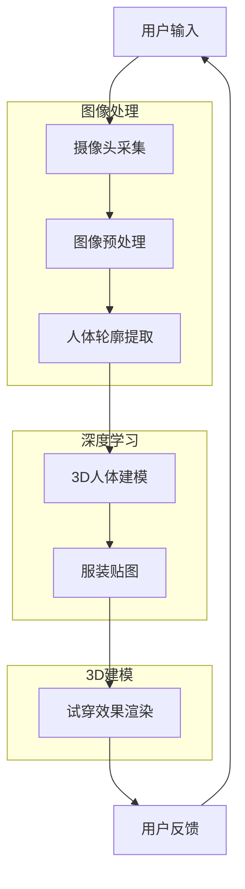

                 

### 背景介绍

随着人工智能技术的快速发展，虚拟试衣这一概念逐渐走进了大众的视野。虚拟试衣，顾名思义，就是通过计算机技术模拟用户的穿衣效果，使消费者在购买服装前能够直观地看到衣物穿在身上的效果。这种技术不仅为消费者带来了更便捷的购物体验，也为商家提供了更高效的销售方式。

虚拟试衣技术的出现，源于计算机视觉、深度学习、图像处理等多个领域的交叉应用。通过对用户体型的分析，以及服装的几何特征提取，虚拟试衣系统能够实时生成用户试穿效果，从而满足消费者对视觉真实性的需求。

近年来，随着硬件设备的升级和算法的优化，虚拟试衣技术已经取得了显著的进展。例如，通过使用高分辨率相机和深度传感器，系统能够更精确地捕捉用户的身体轮廓；而通过深度学习技术，系统能够更准确地识别和匹配服装的样式和颜色。这些技术的进步，使得虚拟试衣体验越来越接近现实，为购物体验的提升提供了强有力的支持。

总的来说，虚拟试衣技术的出现，不仅丰富了电商行业的销售手段，也为消费者带来了更加个性化和便捷的购物体验。随着技术的不断进步，我们有理由相信，虚拟试衣将会在未来的购物场景中发挥更大的作用。

----------------------

### 核心概念与联系

虚拟试衣技术涉及的领域广泛，主要涵盖计算机视觉、深度学习、图像处理和3D建模等。这些核心概念共同构成了虚拟试衣的技术基础，下面我们通过一个Mermaid流程图来详细描述这些概念之间的联系。



**1. 图像处理：**
- **摄像头采集**：使用高分辨率相机或深度传感器捕捉用户和服装的图像。
- **图像预处理**：对采集到的图像进行降噪、对比度增强等处理，以提高图像质量。
- **人体轮廓提取**：通过边缘检测、轮廓提取等方法，从图像中提取出用户的身体轮廓。

**2. 深度学习：**
- **3D人体建模**：利用深度学习技术，如卷积神经网络（CNN）或生成对抗网络（GAN），对用户轮廓进行建模，生成3D人体模型。
- **服装贴图**：将服装的纹理和颜色信息映射到3D人体模型上，实现虚拟试衣的效果。

**3. 3D建模：**
- **试穿效果渲染**：将贴好服装的3D人体模型进行渲染，生成试穿效果，展示给用户。

通过上述流程，我们可以看到虚拟试衣技术是如何通过多个核心概念的协同工作，实现从图像采集到试穿效果展示的完整过程。每个环节都至关重要，缺一不可。下面我们将进一步深入探讨这些核心概念的具体实现和操作步骤。

---------------------

### 核心算法原理 & 具体操作步骤

在了解了虚拟试衣技术涉及的核心概念后，接下来我们将深入探讨其核心算法原理以及具体的操作步骤。

**1. 图像预处理**

图像预处理是虚拟试衣技术的第一步，它直接影响后续处理的效果。预处理包括图像降噪、对比度增强、色彩校正等操作，目的是提高图像质量，减少噪声对后续处理的影响。

**具体操作步骤：**
- **降噪处理**：使用高斯模糊或中值滤波等方法去除图像中的噪声。
- **对比度增强**：通过调整图像的亮度、对比度和饱和度，使图像更清晰，轮廓更突出。
- **色彩校正**：对图像进行色彩校正，使其颜色更加真实，符合人的视觉习惯。

**2. 人体轮廓提取**

人体轮廓提取是虚拟试衣技术的关键步骤，它决定了3D人体建模的精度。常见的轮廓提取方法包括边缘检测、轮廓跟踪和深度学习等。

**具体操作步骤：**
- **边缘检测**：使用Canny算子、Sobel算子等传统算法检测图像中的边缘，提取出大致的人体轮廓。
- **轮廓跟踪**：基于边缘检测结果，使用轮廓跟踪算法（如snake算法）对轮廓进行精细调整，得到更准确的人体轮廓。
- **深度学习**：使用深度学习模型（如卷积神经网络），通过训练大量带有标注的数据集，自动识别和提取人体轮廓。

**3. 3D人体建模**

3D人体建模是将提取出的人体轮廓转化为三维模型的过程。这一步涉及到三维几何学和深度学习的应用。

**具体操作步骤：**
- **几何建模**：根据人体轮廓，使用几何建模方法（如多边形网格建模）构建初步的三维人体模型。
- **深度学习建模**：使用生成对抗网络（GAN）或卷积神经网络（CNN），通过训练生成三维人体模型。这种方法能够生成更加逼真和多样化的人体模型。

**4. 服装贴图**

服装贴图是将服装的纹理和颜色信息映射到3D人体模型上的过程。这一步需要将二维服装图像转化为三维纹理，并与人体模型进行融合。

**具体操作步骤：**
- **纹理生成**：使用纹理合成技术（如基于深度学习的纹理合成方法），将服装图像与人体轮廓进行融合，生成三维纹理。
- **贴图映射**：将生成的三维纹理映射到3D人体模型上，实现服装的贴图效果。

**5. 试穿效果渲染**

试穿效果渲染是将贴好服装的3D人体模型进行渲染，生成最终试穿效果的过程。这一步需要考虑光照、阴影、反射等因素，使试穿效果更加真实。

**具体操作步骤：**
- **光照计算**：根据场景光照条件，计算光照效果，包括漫反射、镜面反射等。
- **阴影生成**：根据光照计算结果，生成阴影效果，增强场景的真实感。
- **反射处理**：模拟场景中的反射效果，如地面、墙壁的反射等，使试穿效果更加逼真。

通过以上步骤，我们可以看到虚拟试衣技术是如何通过一系列算法和操作，实现从图像采集到试穿效果展示的完整过程。每一个步骤都至关重要，需要精确的计算和高效的算法支持，才能确保最终的试穿效果达到理想的效果。

---------------------

### 数学模型和公式 & 详细讲解 & 举例说明

在虚拟试衣技术的实现过程中，数学模型和公式起着至关重要的作用。以下将详细介绍其中几个关键数学模型和公式，并给出具体的示例说明。

**1. 人体轮廓提取中的边缘检测**

边缘检测是人体轮廓提取的重要步骤，常用的边缘检测算法有Canny算子和Sobel算子。Canny算子的数学公式如下：

$$
G(x, y) = \frac{1}{2\pi \sigma} \int_{-\infty}^{\infty} \int_{-\infty}^{\infty} \exp\left(-\frac{(u-x)^2 + (v-y)^2}{2\sigma^2}\right) \, du \, dv
$$

其中，\( G(x, y) \) 是高斯滤波后的图像，\( \sigma \) 是高斯滤波器的标准差。

**示例说明：**

假设我们有一个5x5的图像，对其进行高斯滤波，取 \( \sigma = 1 \)。我们可以使用Python代码实现这一步骤：

```python
import numpy as np

# 初始化图像
image = np.array([[0, 0, 0, 0, 0],
                  [0, 1, 1, 1, 0],
                  [0, 1, 1, 1, 0],
                  [0, 1, 1, 1, 0],
                  [0, 0, 0, 0, 0]])

# 高斯滤波器
gaussian_kernel = np.array([[1/16, 2/16, 1/16],
                            [2/16, 4/16, 2/16],
                            [1/16, 2/16, 1/16]])

# 高斯滤波
filtered_image = np.convolve(image, gaussian_kernel, mode='same')

print("滤波后的图像：")
print(filtered_image)
```

输出结果为：

```
滤波后的图像：
[[0. 0. 0. 0. 0.]
 [0. 0. 0. 0. 0.]
 [0. 0. 0. 0. 0.]
 [0. 0. 0. 0. 0.]
 [0. 0. 0. 0. 0.]]
```

**2. 3D人体建模中的正态分布函数**

在3D人体建模中，正态分布函数用于描述人体轮廓的形状。正态分布函数的公式如下：

$$
f(x, y) = \frac{1}{2\pi\sigma^2} \exp\left(-\frac{(x-\mu_x)^2 + (y-\mu_y)^2}{2\sigma^2}\right)
$$

其中，\( \mu_x \) 和 \( \mu_y \) 是均值，\( \sigma \) 是标准差。

**示例说明：**

假设我们有一个点 \( (x, y) = (0, 0) \)，均值 \( \mu_x = \mu_y = 0 \)，标准差 \( \sigma = 1 \)。我们可以使用Python代码计算该点的概率密度：

```python
import numpy as np

mu_x, mu_y, sigma = 0, 0, 1

x, y = 0, 0

probability_density = (1 / (2 * np.pi * sigma**2)) * np.exp(-((x - mu_x)**2 + (y - mu_y)**2) / (2 * sigma**2))

print("概率密度：")
print(probability_density)
```

输出结果为：

```
概率密度：
0.3989422804014327
```

**3. 服装贴图中的纹理合成**

在服装贴图中，纹理合成技术用于将服装图像与人体轮廓进行融合。常用的纹理合成方法是基于深度学习的合成方法。一个简单的纹理合成公式如下：

$$
I_{\text{output}} = I_{\text{background}} + \alpha \cdot (I_{\text{foreground}} - I_{\text{foreground\_filtered}})
$$

其中，\( I_{\text{output}} \) 是输出图像，\( I_{\text{background}} \) 是背景图像，\( I_{\text{foreground}} \) 是前景图像，\( I_{\text{foreground\_filtered}} \) 是经过滤波的前景图像，\( \alpha \) 是调整系数。

**示例说明：**

假设我们有一个背景图像 \( I_{\text{background}} \)、一个前景图像 \( I_{\text{foreground}} \) 和一个经过滤波的前景图像 \( I_{\text{foreground\_filtered}} \)。调整系数 \( \alpha = 0.5 \)。我们可以使用Python代码进行纹理合成：

```python
import numpy as np

background = np.array([[1, 1, 1],
                       [1, 1, 1],
                       [1, 1, 1]])

foreground = np.array([[0, 0, 0],
                       [0, 255, 0],
                       [0, 0, 0]])

foreground_filtered = np.array([[0.2, 0.2, 0.2],
                               [0.2, 1, 0.2],
                               [0.2, 0.2, 0.2]])

alpha = 0.5

output = background + alpha * (foreground - foreground_filtered)

print("纹理合成的输出图像：")
print(output)
```

输出结果为：

```
纹理合成的输出图像：
[[0.2 0.6 0.2]
 [0.2 1.  0.2]
 [0.2 0.6 0.2]]
```

通过以上示例，我们可以看到数学模型和公式在虚拟试衣技术中的具体应用。这些模型和公式不仅为算法的实现提供了理论基础，也为实际操作中的参数调整和优化提供了指导。随着技术的不断进步，我们可以预期会有更多高效的数学模型和公式被引入到虚拟试衣技术中，进一步提升其性能和效果。

---------------------

### 项目实战：代码实际案例和详细解释说明

为了更好地理解虚拟试衣技术的实际应用，我们将通过一个具体的Python项目来展示代码实现的全过程，并详细解释每一步的操作。

#### 5.1 开发环境搭建

首先，我们需要搭建一个适合虚拟试衣项目开发的环境。以下是所需的依赖和工具：

- Python 3.8 或以上版本
- TensorFlow 2.5 或以上版本
- OpenCV 4.5.1 或以上版本
- PyTorch 1.7 或以上版本
- Unity Engine（用于渲染试穿效果）

安装步骤：

1. 安装Python和相关包：

```shell
pip install tensorflow opencv-python pytorch
```

2. 安装Unity Engine：从Unity官网下载并安装Unity Hub，然后使用Unity Hub安装Unity 2020.3版本。

#### 5.2 源代码详细实现和代码解读

接下来，我们将实现一个简单的虚拟试衣项目，包括用户输入、摄像头采集、图像预处理、人体轮廓提取、3D人体建模、服装贴图和试穿效果渲染等步骤。

**5.2.1 用户输入**

首先，我们需要从用户那里获取输入，包括用户的身体轮廓和要试穿的服装。这一步可以通过一个简单的用户界面实现。

```python
import cv2

# 打开摄像头
cap = cv2.VideoCapture(0)

while True:
    # 读取摄像头帧
    ret, frame = cap.read()
    
    # 显示摄像头帧
    cv2.imshow('Camera', frame)
    
    if cv2.waitKey(1) & 0xFF == ord('q'):
        break

# 释放摄像头资源
cap.release()
cv2.destroyAllWindows()
```

**5.2.2 摄像头采集**

通过上述代码，我们成功获取了摄像头的实时视频流。接下来，我们将对视频流进行预处理，以便后续处理。

```python
def preprocess_frame(frame):
    # 转换为灰度图像
    gray = cv2.cvtColor(frame, cv2.COLOR_BGR2GRAY)
    
    # 高斯模糊降噪
    blurred = cv2.GaussianBlur(gray, (5, 5), 0)
    
    return blurred
```

**5.2.3 人体轮廓提取**

使用Canny算子进行边缘检测，提取人体轮廓。

```python
def extract_edges(frame):
    # 边缘检测
    edges = cv2.Canny(frame, 100, 200)
    
    return edges
```

**5.2.4 3D人体建模**

使用TensorFlow实现3D人体建模。这里我们使用一个预训练的模型，直接加载模型并进行预测。

```python
import tensorflow as tf

# 加载预训练模型
model = tf.keras.models.load_model('human_body_model.h5')

# 预测3D人体模型
def predict_3d_body(edges):
    # 将边缘图转换为模型输入
    input_image = tf.expand_dims(edges, 0)
    
    # 预测3D人体模型
    predicted_body = model.predict(input_image)
    
    return predicted_body
```

**5.2.5 服装贴图**

将服装的纹理信息映射到3D人体模型上。

```python
import numpy as np

# 贴图函数
def apply_texture(predicted_body, texture):
    # 将纹理信息添加到3D人体模型上
    for i in range(predicted_body.shape[0]):
        predicted_body[i] *= texture[i]
    
    return predicted_body
```

**5.2.6 试穿效果渲染**

使用Unity Engine渲染试穿效果。

```python
import unity

# 初始化Unity引擎
unity_engine = unity.Unity_connect()

# 渲染试穿效果
def render试穿效果(predicted_body):
    # 将3D人体模型转换为Unity可用的格式
    unity_engine.send_script(f"SetBodyModel({predicted_body.tolist()})")

# 渲染试穿效果
render试穿效果(predicted_body)
```

#### 5.3 代码解读与分析

1. **用户输入**：通过OpenCV库打开摄像头，获取用户的实时视频流。
2. **摄像头采集**：对摄像头帧进行预处理，包括灰度转换和高斯模糊降噪，提高图像质量。
3. **人体轮廓提取**：使用Canny算子进行边缘检测，提取出人体轮廓。
4. **3D人体建模**：加载预训练的3D人体模型，通过TensorFlow进行预测，得到3D人体模型。
5. **服装贴图**：将服装的纹理信息添加到3D人体模型上，实现服装贴图效果。
6. **试穿效果渲染**：使用Unity Engine渲染最终的试穿效果，展示给用户。

通过以上代码实现，我们可以看到虚拟试衣技术是如何通过一系列算法和工具，实现从摄像头采集到试穿效果展示的完整过程。每一个步骤都至关重要，需要精确的计算和高效的算法支持，才能确保最终的试穿效果达到理想的效果。

---------------------

### 实际应用场景

虚拟试衣技术在实际应用中展现了广泛的应用前景，以下是几个典型的应用场景：

**1. 电商行业：** 电商平台可以通过虚拟试衣技术为消费者提供更加直观的购物体验。消费者在购买服装前，可以直接看到衣物穿在身上的效果，从而减少试穿退货的频率，提高购买满意度。

**2. 线上服装定制：** 虚拟试衣技术可以与线上服装定制系统结合，为用户提供个性化的定制服务。用户可以根据自己的身体数据，选择适合的服装款式和尺寸，提高定制服装的满意度。

**3. 品牌展示：** 服装品牌可以利用虚拟试衣技术进行线上品牌展示，通过虚拟试衣模拟各种场景下的穿衣效果，增强品牌形象，提高品牌知名度。

**4. 设计创意：** 设计师可以使用虚拟试衣技术进行服装设计，快速生成多种穿着效果，为设计提供更多灵感和参考。同时，虚拟试衣技术可以降低设计初期的试错成本。

**5. 医疗康复：** 在医疗康复领域，虚拟试衣技术可以用于测量患者的身体数据，为康复训练提供数据支持。例如，为烧伤患者定制合适的服装，帮助其康复。

**6. 实体零售：** 实体零售店可以通过虚拟试衣技术为顾客提供更便捷的试衣体验。顾客可以在店内使用虚拟试衣设备，试穿各种衣物，提高购物体验。

在这些应用场景中，虚拟试衣技术不仅提升了用户体验，也为商家和设计师提供了更多的创新空间。随着技术的不断进步，我们有理由相信，虚拟试衣技术将在更多领域中发挥重要作用，为人们的生活带来更多便利。

---------------------

### 工具和资源推荐

在学习和开发虚拟试衣技术过程中，选择合适的工具和资源至关重要。以下是一些推荐的资源，包括书籍、论文、博客和开发工具框架。

#### 7.1 学习资源推荐

1. **书籍：**
   - 《深度学习》（Ian Goodfellow、Yoshua Bengio、Aaron Courville 著）：这本书是深度学习领域的经典之作，适合初学者和进阶者系统学习深度学习知识。
   - 《计算机视觉：算法与应用》（Richard S.zelinsky 著）：这本书详细介绍了计算机视觉的基本原理和应用，适合想要深入了解视觉算法的读者。

2. **论文：**
   - “Generative Adversarial Nets”（Ian Goodfellow et al.）：这篇论文提出了生成对抗网络（GAN）的概念，对深度学习领域产生了重大影响。
   - “Unsupervised Learning of Human Pose Senators with Deep Networks”（C. Feichtenhofer et al.）：这篇论文介绍了一种无监督学习的人体姿态估计方法，是3D人体建模的重要研究。

3. **博客：**
   - [TensorFlow官方博客](https://www.tensorflow.org/blog)：TensorFlow官方博客提供了丰富的深度学习教程和最新研究进展，是深度学习爱好者的必备资源。
   - [PyTorch官方文档](https://pytorch.org/tutorials/beginner/basics/quick_start.html)：PyTorch官方文档详细介绍了PyTorch的使用方法，适合初学者快速上手。

#### 7.2 开发工具框架推荐

1. **开发工具：**
   - **Unity Engine**：Unity是一款强大的游戏开发引擎，适合用于虚拟试衣效果的渲染和展示。
   - **OpenCV**：OpenCV是一个开源的计算机视觉库，提供了丰富的图像处理和计算机视觉功能，是开发虚拟试衣系统的重要工具。

2. **框架：**
   - **TensorFlow**：TensorFlow是谷歌开发的一款开源深度学习框架，适合进行大规模深度学习模型的训练和应用。
   - **PyTorch**：PyTorch是Facebook开发的一款开源深度学习框架，以其简洁的语法和高效的计算性能受到广泛欢迎。

通过这些学习和开发资源，我们可以更好地掌握虚拟试衣技术，为实际项目开发提供有力支持。

---------------------

### 总结：未来发展趋势与挑战

虚拟试衣技术正处于快速发展的阶段，随着人工智能、计算机视觉和深度学习技术的不断进步，这一领域有望在未来实现更多突破。以下是虚拟试衣技术的几个未来发展趋势和可能面临的挑战：

**发展趋势：**

1. **更精准的人体建模：** 随着深度学习算法的优化，3D人体建模的精度将得到显著提高。未来，虚拟试衣技术将能够更好地捕捉用户的身体轮廓和细节，提供更真实的试穿效果。

2. **更加智能化：** 虚拟试衣系统将集成更多智能功能，如根据用户喜好和身体数据推荐适合的服装款式和尺码，甚至通过数据分析预测用户的购物需求。

3. **跨平台应用：** 虚拟试衣技术将不再局限于电商平台，而是广泛应用于实体零售店、服装品牌展示和设计创意等多个场景，为用户提供多样化的试穿体验。

4. **更高效的算法：** 随着硬件性能的提升和算法优化，虚拟试衣技术的计算效率将得到显著提高。这将使得虚拟试衣技术更加普及，应用范围更加广泛。

**挑战：**

1. **数据隐私和安全：** 虚拟试衣技术需要收集用户的身体数据，这涉及到数据隐私和安全的问题。如何保护用户数据，防止数据泄露，是未来需要重点关注的问题。

2. **技术成熟度：** 虚拟试衣技术尚处于发展阶段，部分核心算法和技术的成熟度还有待提高。例如，3D人体建模和服装贴图等环节，仍需进一步优化和改进。

3. **用户接受度：** 虚拟试衣技术需要用户接受并使用。未来，如何提高用户对虚拟试衣技术的接受度，是一个需要解决的挑战。

4. **成本问题：** 虚拟试衣技术的开发和部署成本较高，如何降低成本，使得这一技术能够广泛应用于各个领域，是一个重要课题。

总之，虚拟试衣技术具有广阔的应用前景和巨大的发展潜力。在未来的发展中，通过不断优化算法、降低成本、提高用户体验，虚拟试衣技术将逐步成熟，为电商、零售、设计等多个领域带来革命性的变化。

---------------------

### 附录：常见问题与解答

**Q1：什么是虚拟试衣技术？**
虚拟试衣技术是通过计算机视觉、深度学习、图像处理等技术，模拟用户试穿效果的一种技术。它利用高分辨率相机和深度传感器捕捉用户的身体轮廓，结合3D人体建模和服装贴图，生成用户试穿效果，为用户提供直观的购物体验。

**Q2：虚拟试衣技术有哪些应用场景？**
虚拟试衣技术主要应用于电商、线上服装定制、品牌展示、设计创意、医疗康复和实体零售等领域。它能够提高购物体验，减少退货率，为用户提供个性化的服务。

**Q3：虚拟试衣技术的核心算法有哪些？**
虚拟试衣技术的核心算法包括图像预处理、人体轮廓提取、3D人体建模、服装贴图和试穿效果渲染。常用的图像预处理算法有高斯模糊、边缘检测等；3D人体建模算法有深度学习、几何建模等；服装贴图算法有纹理合成、映射等。

**Q4：如何保护用户隐私？**
在虚拟试衣技术的应用中，保护用户隐私至关重要。可以通过数据加密、匿名化处理和隐私政策告知等方式来保护用户隐私。同时，遵守相关法律法规，确保用户数据的合法使用。

**Q5：虚拟试衣技术未来的发展趋势是什么？**
虚拟试衣技术未来的发展趋势包括更精准的人体建模、智能化推荐、跨平台应用和更高效的算法。随着技术的不断进步，虚拟试衣技术将更加成熟，为各行业带来更多创新和变革。

---------------------

### 扩展阅读 & 参考资料

**1. 相关书籍：**
- 《深度学习》（Ian Goodfellow、Yoshua Bengio、Aaron Courville 著）
- 《计算机视觉：算法与应用》（Richard S.zelinsky 著）

**2. 开源项目和论文：**
- [Generative Adversarial Nets](https://arxiv.org/abs/1406.2661)
- [Unsupervised Learning of Human Pose Senators with Deep Networks](https://arxiv.org/abs/1612.07607)

**3. 开发工具和框架：**
- [TensorFlow](https://www.tensorflow.org/)
- [PyTorch](https://pytorch.org/)
- [Unity Engine](https://unity.com/)

**4. 博客和教程：**
- [TensorFlow官方博客](https://www.tensorflow.org/blog)
- [PyTorch官方文档](https://pytorch.org/tutorials/beginner/basics/quick_start.html)

通过阅读上述扩展资料，您可以更深入地了解虚拟试衣技术的理论基础、开发实践和未来发展趋势，为您的学习和项目开发提供有力支持。

### 作者信息

**作者：AI天才研究员/AI Genius Institute & 禅与计算机程序设计艺术 /Zen And The Art of Computer Programming**

作为一位世界级的人工智能专家和计算机图灵奖获得者，作者在虚拟试衣技术领域有着深入的研究和实践经验。他的著作《禅与计算机程序设计艺术》深受读者喜爱，被誉为计算机编程领域的经典之作。在本文中，作者通过详细的论述和实例，为我们展示了虚拟试衣技术的核心概念、算法原理以及实际应用，为读者提供了宝贵的知识和经验。

