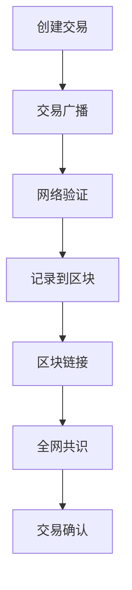

                 

# 虚拟货币经济：全球脑时代的价值交换

> **关键词：** 虚拟货币、区块链、经济模型、价值交换、全球脑时代

> **摘要：** 本文将探讨虚拟货币在经济中的地位和作用，以及如何在全球脑时代实现价值交换。通过对虚拟货币经济的基本概念、核心算法原理、数学模型和实际应用场景的深入分析，揭示其在未来发展趋势中的挑战和机遇。

## 1. 背景介绍

### 1.1 虚拟货币的起源

虚拟货币的概念最早可以追溯到电子现金系统（E-Cash）。1995年，戴伟（David Chaum）提出了“匿名电子现金系统”，这被认为是虚拟货币的雏形。随着互联网的普及，虚拟货币逐渐成为人们日常生活中的一部分。

### 1.2 区块链技术的兴起

区块链技术的出现，为虚拟货币的发展提供了新的契机。区块链是一种分布式账本技术，具有去中心化、不可篡改和可追溯等特点。通过区块链，虚拟货币的交易记录可以被全球节点共同验证，从而保证了交易的安全性和透明性。

### 1.3 全球脑时代的来临

随着人工智能、物联网和5G技术的发展，全球脑时代逐渐来临。在这个时代，人类社会的信息交流更加快捷，智能化程度大幅提升。虚拟货币作为价值交换的载体，将在全球脑时代中发挥重要作用。

## 2. 核心概念与联系

### 2.1 虚拟货币的定义

虚拟货币是一种数字化的加密货币，使用密码学技术来确保交易安全，控制货币的总量，并验证交易的有效性。比特币（Bitcoin）是最早、最著名的虚拟货币，它于2009年诞生。

### 2.2 区块链技术的原理

区块链是一种分布式数据库，其中数据以块的形式存储。每个块包含一定数量的交易记录，并通过密码学算法与之前的块链接在一起，形成链式结构。区块链确保了数据的不可篡改性和可追溯性。

### 2.3 全球脑时代的价值交换

在全球脑时代，虚拟货币作为一种新型的价值交换方式，具有以下几个特点：

- **去中心化**：虚拟货币的发行和交易过程不受中央机构的控制，实现了真正的去中心化。
- **安全性**：区块链技术的应用，确保了虚拟货币交易的安全性和透明性。
- **全球化**：虚拟货币的交易不受地域限制，可以方便地在全球范围内进行。
- **便捷性**：虚拟货币的交易过程简单快捷，大大提高了交易的效率。

### 2.4 Mermaid 流程图

以下是一个简单的 Mermaid 流程图，描述了虚拟货币的基本工作流程：



## 3. 核心算法原理 & 具体操作步骤

### 3.1 挖矿算法

挖矿是比特币等虚拟货币产生和验证交易的核心过程。挖矿算法通常包括以下步骤：

1. **获取交易数据**：矿工从网络中获取未确认的交易数据。
2. **构建区块**：矿工将这些交易数据打包成一个区块，并添加一个区块头。
3. **计算工作量证明（Proof of Work, PoW）**：矿工需要计算一个满足特定条件的值，通常是找到一个满足难度要求的随机数。这个过程称为“工作量证明”。
4. **广播区块**：矿工将计算出的区块广播到整个网络。
5. **网络验证**：其他节点验证该区块的有效性，并添加到自己的区块链中。

### 3.2 共识算法

共识算法是区块链网络中节点达成一致的关键。比特币使用的共识算法是工作量证明（PoW），其他区块链可能使用不同的算法，如权益证明（Proof of Stake, PoS）或委托权益证明（Delegated Proof of Stake, DPoS）。

### 3.3 具体操作步骤

以下是一个简化的挖矿操作步骤：

1. **获取交易数据**：矿工从网络中获取未确认的交易数据。
2. **构建区块**：矿工将这些交易数据打包成一个区块，并添加一个区块头，包括当前时间戳、上一个区块的哈希值等。
3. **计算工作量证明（PoW）**：矿工需要计算一个满足特定条件的值，通常是找到一个满足难度要求的随机数。这个过程称为“工作量证明”。
4. **广播区块**：矿工将计算出的区块广播到整个网络。
5. **网络验证**：其他节点验证该区块的有效性，包括交易的有效性、工作量证明的正确性等。
6. **区块添加**：一旦网络验证通过，该区块将被添加到区块链中，矿工获得相应的奖励。

## 4. 数学模型和公式 & 详细讲解 & 举例说明

### 4.1 工作量证明（Proof of Work, PoW）

工作量证明是一种用于防止网络攻击和保证区块链安全性的数学算法。在比特币中，矿工需要找到一个新的随机数，使得该随机数与区块头中的某个值满足特定条件。

公式如下：

$$
PoW_{valid} = \neg \left( \text{SHA-256}(block\_header) \leq \text{target\_hash} \right)
$$

其中，$\text{SHA-256}$ 是一个加密哈希函数，$block\_header$ 是区块头，$target\_hash$ 是网络设定的难度目标。

### 4.2 难度调整

为了保持比特币生成的速率不变，区块链网络会定期调整挖矿难度。难度调整公式如下：

$$
 difficulty_{new} = \frac{work_{last\_window}}{target_{time}} \times \frac{time_{block}}{target_{time}}
$$

其中，$work_{last\_window}$ 是过去一段时间内的平均工作量，$target_{time}$ 是设定的平均生成时间，$time_{block}$ 是最近一次生成区块的时间。

### 4.3 举例说明

假设网络设定的平均生成时间为 10 分钟，最近一次生成区块的时间为 9 分钟，过去一周内的平均工作量为 10000。

$$
 difficulty_{new} = \frac{10000}{10} \times \frac{10}{9} \approx 1111.11
$$

这意味着新的难度值约为 1111.11。

## 5. 项目实战：代码实际案例和详细解释说明

### 5.1 开发环境搭建

为了更好地理解虚拟货币的挖矿过程，我们将使用 Python 搭建一个简单的挖矿环境。首先，确保你的计算机已安装 Python 和区块链相关的库，如 `bitcoin` 和 `hashlib`。

```bash
pip install bitcoin
pip install hashlib
```

### 5.2 源代码详细实现和代码解读

下面是一个简单的挖矿示例代码：

```python
import bitcoin
import hashlib
import time

# 挖矿函数
def mine_block(block_data, target_difficulty):
    block_hash = hashlib.sha256(block_data.encode()).hexdigest()
    while not is_valid_proof_of_work(block_hash, target_difficulty):
        block_data += str(time.time())  # 更改区块数据以寻找新的工作量证明
    return block_hash

# 验证工作量证明
def is_valid_proof_of_work(block_hash, target_difficulty):
    return int(block_hash, 16) <= target_difficulty

# 挖矿过程
def main():
    # 假设当前网络难度为 1000
    target_difficulty = 1000
    block_data = "Hello, World!"

    start_time = time.time()
    block_hash = mine_block(block_data, target_difficulty)
    end_time = time.time()

    print(f"挖矿成功！区块哈希：{block_hash}")
    print(f"挖矿耗时：{end_time - start_time}秒")

if __name__ == "__main__":
    main()
```

### 5.3 代码解读与分析

- **导入库**：代码首先导入必要的库，包括 `bitcoin` 和 `hashlib`。
- **挖矿函数**：`mine_block` 函数接受区块数据和目标难度，尝试找到满足难度要求的工作量证明。
- **验证函数**：`is_valid_proof_of_work` 函数验证区块哈希是否满足难度要求。
- **挖矿过程**：`main` 函数设置目标难度和区块数据，启动挖矿过程。

在实际应用中，挖矿过程会涉及更复杂的逻辑，如网络同步、交易验证等。但上述代码提供了一个基本的挖矿框架，有助于理解挖矿原理。

## 6. 实际应用场景

### 6.1 支付系统

虚拟货币最广泛的应用是作为支付系统，用于跨境支付、点对点支付等场景。比特币、以太坊等虚拟货币已经广泛应用于支付领域。

### 6.2 数字资产管理

虚拟货币可以作为数字资产的一种形式，用于投资、交易和存储。例如，以太坊上的去中心化金融（DeFi）项目，利用虚拟货币进行借贷、交易和投资。

### 6.3 独立货币体系

一些国家正在探索将虚拟货币作为独立货币体系的一部分，如委内瑞拉的 Petro。虚拟货币可以在一定程度上降低货币风险，提高货币稳定性。

## 7. 工具和资源推荐

### 7.1 学习资源推荐

- **书籍**：
  - 《区块链：从数字货币到信用社会》
  - 《深度探索区块链》
- **论文**：
  - Satoshi Nakamoto. "Bitcoin: A Peer-to-Peer Electronic Cash System."
  - Vitalik Buterin. "Ethereum: A Secure Decentralized Transaction Protocol."
- **博客**：
  - [Blockchain.com](https://www.blockchain.com/)
  - [Ethereum.org](https://ethereum.org/)
- **网站**：
  - [CryptoKitties](https://www.cryptokitties.co/)
  - [Uniswap](https://uniswap.org/)

### 7.2 开发工具框架推荐

- **区块链平台**：
  - Ethereum
  - Hyperledger Fabric
  - EOS
- **开发工具**：
  - Truffle
  - Geth
  - Hyperledger Composer
- **钱包**：
  - MetaMask
  - MyEtherWallet

### 7.3 相关论文著作推荐

- **Satoshi Nakamoto**. "Bitcoin: A Peer-to-Peer Electronic Cash System."
- **Vitalik Buterin**. "Ethereum: A Secure Decentralized Transaction Protocol."
- **Andreas M. Antonopoulos**. "Mastering Bitcoin: Unlocking Digital Cryptocurrencies."
- **Don and Alex Tapscott**. "Blockchain Revolution: How the Technology Behind Bitcoin Is Changing Money, Business, and the World."

## 8. 总结：未来发展趋势与挑战

虚拟货币经济在全球脑时代中具有巨大的潜力，它不仅可以改变传统的支付和金融体系，还可以推动数字经济的发展。然而，虚拟货币经济也面临着诸多挑战：

- **监管问题**：如何平衡虚拟货币的自由性和监管需求，是一个亟待解决的问题。
- **安全性问题**：虚拟货币的交易安全性仍然是一个重要课题，需要进一步的研究和改进。
- **技术难题**：如何提高区块链的性能和可扩展性，以满足不断增长的用户需求，是一个重要挑战。

在未来，随着技术的进步和政策的完善，虚拟货币经济有望在更多领域发挥重要作用。

## 9. 附录：常见问题与解答

### 9.1 虚拟货币是什么？

虚拟货币是一种数字化的加密货币，使用密码学技术来确保交易安全，控制货币的总量，并验证交易的有效性。

### 9.2 区块链技术有哪些应用？

区块链技术可以应用于支付系统、数字资产管理、供应链管理、身份验证等多个领域。

### 9.3 挖矿是什么？

挖矿是虚拟货币系统中的一种过程，矿工通过解决数学难题来验证交易并生成新的货币。

### 9.4 虚拟货币是否合法？

虚拟货币的合法性因国家而异。一些国家将其视为合法货币，而另一些国家则将其视为非法或限制使用。

## 10. 扩展阅读 & 参考资料

- [Nakamoto, S. (2008). Bitcoin: A Peer-to-Peer Electronic Cash System. https://bitcoin.org/bitcoin.pdf]
- [Buterin, V. (2014). Ethereum: A Secure Decentralized Transaction Protocol. https://ethereum.org/greeter]
- [Antonopoulos, A. M. (2017). Mastering Bitcoin: Unlocking Digital Cryptocurrencies. O'Reilly Media.]
- [Tapscott, D., & Tapscott, A. (2016). Blockchain Revolution: How the Technology Behind Bitcoin Is Changing Money, Business, and the World. Penguin.]
- [Blockchain.com. (n.d.). Blockchain.com. Retrieved from https://www.blockchain.com/]
- [Ethereum.org. (n.d.). Ethereum.org. Retrieved from https://ethereum.org/]
- [CryptoKitties. (n.d.). CryptoKitties. Retrieved from https://www.cryptokitties.co/]
- [Uniswap. (n.d.). Uniswap. Retrieved from https://uniswap.org/]

### 作者

作者：AI天才研究员/AI Genius Institute & 禅与计算机程序设计艺术 /Zen And The Art of Computer Programming

