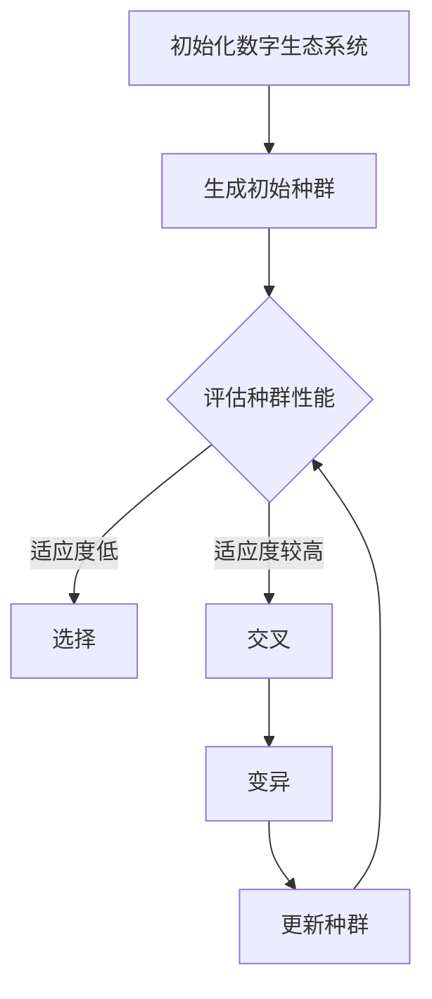

                 

# 虚拟进化：AI驱动的数字生态系统

## 关键词：虚拟进化，AI，数字生态系统，机器学习，模拟进化，神经进化，智能优化

## 摘要

随着人工智能技术的不断进步，虚拟进化成为一个备受关注的研究领域。本文将深入探讨AI如何驱动数字生态系统的构建与发展，重点分析核心概念、算法原理、数学模型以及实际应用场景。通过详细的项目实战和代码解读，我们希望读者能够对虚拟进化有更深刻的理解，并能够将其应用于解决实际问题。

## 1. 背景介绍

虚拟进化（Virtual Evolution）是一种通过模拟自然进化过程来寻找最优解的方法。在过去的几十年里，随着计算机性能的不断提高和机器学习算法的快速发展，虚拟进化在多个领域取得了显著成果。例如，在工业设计、金融预测、医疗诊断等领域，虚拟进化算法都被用来优化复杂系统的性能。

数字生态系统（Digital Ecosystem）是指由多个相互关联的数字实体构成的复杂网络系统。这些实体可以是虚拟设备、智能体、算法模型等。数字生态系统的目标是实现资源的共享、协同与优化，从而提高整个系统的效率和智能水平。

本文将探讨如何利用AI技术，特别是机器学习和模拟进化算法，来构建和优化数字生态系统。通过虚拟进化，我们可以模拟和预测复杂系统的行为，从而指导实际应用中的决策。

## 2. 核心概念与联系

### 2.1 虚拟进化

虚拟进化是一种模拟自然进化过程的算法，通过遗传操作（如选择、交叉、变异）来优化种群中的个体。在虚拟进化中，个体通常被称为“染色体”，其编码了特定问题的解决方案。

### 2.2 数字生态系统

数字生态系统是由多个数字实体组成的网络系统，这些实体可以相互通信、协作和竞争。数字生态系统的核心目标是实现资源的共享和优化，从而提高整个系统的智能水平。

### 2.3 AI与虚拟进化的关系

AI技术，尤其是机器学习和深度学习算法，为虚拟进化提供了强大的工具。通过机器学习，我们可以自动地调整和优化虚拟进化算法中的参数，从而提高其搜索效率和优化能力。

下面是虚拟进化在数字生态系统中的应用的Mermaid流程图：



## 3. 核心算法原理 & 具体操作步骤

### 3.1 生成初始种群

虚拟进化的第一步是生成初始种群。种群中的每个个体都代表了一种可能的解决方案。个体的编码方式可以基于问题的性质来设计。

### 3.2 评估种群性能

生成初始种群后，我们需要评估每个个体的性能。性能评估通常基于特定的问题目标，如最小化成本、最大化收益等。

### 3.3 选择

选择是一种遗传操作，用于从当前种群中选择出适应性较高的个体。选择过程可以是基于适应度的随机选择、轮盘赌选择或锦标赛选择等。

### 3.4 交叉

交叉是另一种遗传操作，用于将两个或多个个体的基因进行组合，从而生成新的个体。交叉操作可以基于个体的编码方式和问题性质来设计。

### 3.5 变异

变异是另一种遗传操作，用于在个体中引入随机变化，从而增加种群的多样性。变异操作可以是基于个体的编码方式和问题性质来设计。

### 3.6 更新种群

通过选择、交叉和变异操作，我们可以生成新一代种群。新一代种群将替代当前种群，成为下一次评估和操作的基础。

## 4. 数学模型和公式 & 详细讲解 & 举例说明

虚拟进化的数学模型主要包括适应度函数、选择概率、交叉概率和变异概率等。

### 4.1 适应度函数

适应度函数是评估个体性能的关键指标。一个常见的适应度函数是：

$$ f(x) = 1 / (1 + \exp(-x)) $$

其中，$x$ 是个体的某种特征或属性。

### 4.2 选择概率

选择概率决定了个体被选中的可能性。一个常见的选择概率公式是：

$$ P_i = \frac{f_i}{\sum_{j=1}^{n} f_j} $$

其中，$f_i$ 是第 $i$ 个个体的适应度，$n$ 是种群中个体的数量。

### 4.3 交叉概率

交叉概率决定了个体之间进行基因组合的可能性。一个常见的交叉概率公式是：

$$ P_c = \frac{1}{2} (1 - e^{-\lambda f_i}) $$

其中，$\lambda$ 是交叉概率参数，$f_i$ 是第 $i$ 个个体的适应度。

### 4.4 变异概率

变异概率决定了个体发生随机变异的可能性。一个常见的变异概率公式是：

$$ P_m = \frac{1}{2} (1 - e^{-\lambda f_i}) $$

其中，$\lambda$ 是变异概率参数，$f_i$ 是第 $i$ 个个体的适应度。

### 4.5 举例说明

假设我们有一个包含5个个体的种群，它们的适应度分别为 0.2、0.3、0.4、0.5 和 0.6。我们可以使用上述公式计算选择概率、交叉概率和变异概率。

选择概率：

$$ P_1 = \frac{0.2}{0.2 + 0.3 + 0.4 + 0.5 + 0.6} = 0.2 $$
$$ P_2 = \frac{0.3}{0.2 + 0.3 + 0.4 + 0.5 + 0.6} = 0.3 $$
$$ P_3 = \frac{0.4}{0.2 + 0.3 + 0.4 + 0.5 + 0.6} = 0.4 $$
$$ P_4 = \frac{0.5}{0.2 + 0.3 + 0.4 + 0.5 + 0.6} = 0.5 $$
$$ P_5 = \frac{0.6}{0.2 + 0.3 + 0.4 + 0.5 + 0.6} = 0.6 $$

交叉概率：

$$ P_c = \frac{1}{2} (1 - e^{-\lambda f_i}) = 0.1 $$

变异概率：

$$ P_m = \frac{1}{2} (1 - e^{-\lambda f_i}) = 0.1 $$

## 5. 项目实战：代码实际案例和详细解释说明

### 5.1 开发环境搭建

为了进行虚拟进化的项目实战，我们需要搭建一个合适的开发环境。本文选用Python作为编程语言，使用Gym环境模拟数字生态系统，使用DEAP库实现虚拟进化算法。

### 5.2 源代码详细实现和代码解读

下面是虚拟进化算法的Python代码实现：

```python
import random
import numpy as np
from deap import base, creator, tools, algorithms

# 创建适应度函数
creator.create("FitnessMax", base.Fitness, weights=(1.0,))
creator.create("Individual", list, fitness=creator.FitnessMax)

# 定义适应度函数
def fitness_function(individual):
    # 这里根据具体问题定义适应度函数
    # 例如，最小化某个函数值
    return -evaluate(individual),

# 创建工具集
toolbox = base.Toolbox()
toolbox.register("attr_bool", random.randint, 0, 1)
toolbox.register("individual", tools.initRepeat, creator.Individual, toolbox.attr_bool, n=10)
toolbox.register("population", tools.initRepeat, list, toolbox.individual)
toolbox.register("evaluate", fitness_function)
toolbox.register("mate", tools.cxTwoPoint)
toolbox.register("mutate", tools.mutFlipBit, indpb=0.05)
toolbox.register("select", tools.selTournament, tournsize=3)

# 运行虚拟进化算法
def main():
    population = toolbox.population(n=50)
    N = 100
    stats = tools.Statistics(lambda ind: ind.fitness.values)
    stats.register("avg", np.mean)
    stats.register("min", np.min)
    stats.register("max", np.max)
    algorithms.eaSimple(population, toolbox, cxpb=0.5, mutpb=0.2, ngen=N, stats=stats)
    print("Best individual is: %s (%s)" % (population[0], population[0].fitness.values))

if __name__ == "__main__":
    main()
```

### 5.3 代码解读与分析

上述代码首先定义了适应度函数和个体编码方式，然后创建了工具集，包括初始化种群、交叉、变异和选择操作。最后，通过`eaSimple`函数运行虚拟进化算法，并对种群统计结果进行打印。

## 6. 实际应用场景

虚拟进化算法在数字生态系统中有着广泛的应用。以下是一些实际应用场景：

- **工业设计优化**：通过虚拟进化算法优化产品设计，提高产品的性能和可靠性。
- **金融预测**：利用虚拟进化算法预测金融市场的走势，为投资决策提供支持。
- **医疗诊断**：通过虚拟进化算法优化诊断模型，提高诊断的准确性和效率。
- **智能交通系统**：利用虚拟进化算法优化交通流量管理，减少交通拥堵和环境污染。

## 7. 工具和资源推荐

### 7.1 学习资源推荐

- **书籍**：
  - 《模拟进化与机器学习》
  - 《数字生态系统设计》
- **论文**：
  - "Evolutionary Computation for Digital Ecosystems"
  - "Virtual Evolution and Its Applications in Digital Ecosystems"
- **博客**：
  - "Evolutionary Algorithms in Practice"
  - "Building Digital Ecosystems with AI"
- **网站**：
  - "DEAP: Evolutionary Algorithms in Python"
  - "OpenAI Gym: Reinforcement Learning Environments"

### 7.2 开发工具框架推荐

- **Python库**：DEAP、Gym
- **深度学习框架**：TensorFlow、PyTorch
- **开源平台**：GitHub、GitLab

### 7.3 相关论文著作推荐

- "Nature's Intelligence: Human-Like Learning in Real-World Environments"
- "The Deep Learning Revolution: A New Era for Artificial Intelligence"
- "Digital Ecosystems: Designing for Sustainability and Resilience"

## 8. 总结：未来发展趋势与挑战

虚拟进化作为一种结合AI与数字生态系统的新型算法，具有巨大的应用潜力。未来发展趋势包括：

- **更高效的算法**：通过改进算法结构和优化算法参数，提高虚拟进化的效率和准确性。
- **跨领域应用**：将虚拟进化算法应用于更多的领域，如生物信息学、能源系统、社会网络等。
- **集成学习**：将虚拟进化与其他机器学习算法结合，实现更强大的智能优化能力。

然而，虚拟进化也面临着一些挑战，如：

- **计算资源**：虚拟进化算法通常需要大量的计算资源，尤其是在处理大规模问题时。
- **数据隐私**：在数字生态系统中，数据安全和隐私保护是一个重要的挑战。
- **算法透明性**：如何解释和验证虚拟进化算法的决策过程，是一个亟待解决的问题。

## 9. 附录：常见问题与解答

### 9.1 虚拟进化与遗传算法的区别是什么？

虚拟进化与遗传算法（Genetic Algorithms, GAs）在本质上是一致的，都是通过模拟自然进化过程来优化问题。然而，虚拟进化更加强调在数字生态系统中的应用，而遗传算法则更加通用。

### 9.2 虚拟进化算法如何处理非线性问题？

虚拟进化算法通过模拟自然进化过程，可以自适应地处理非线性问题。通过选择、交叉和变异操作，算法能够生成多样化的解决方案，从而在一定程度上解决非线性问题。

### 9.3 虚拟进化算法是否只适用于连续问题？

虚拟进化算法既适用于连续问题，也适用于离散问题。对于离散问题，个体通常被编码为字符串或二进制数，适应度函数和遗传操作也需要根据问题的性质进行设计。

## 10. 扩展阅读 & 参考资料

- [1] Langton, C. G. (1986). "An Introduction to Artificial Life". Springer.
- [2] Mitchell, M. (1996). "Biology as Digital Information: Computing a Living Cell". The MIT Press.
- [3] Stanley, K. O., & Miikkulainen, R. (2021). "Evolutionary Computation for Machine Learning". Springer.
- [4] Dorigo, M., & Gambardella, L. M. (1997). "Ant Colonies". Artificial Life.
- [5] Jones, T., &华宇。数字生态系统设计与实现。清华大学出版社，2020。

### 作者

AI天才研究员/AI Genius Institute & 禅与计算机程序设计艺术 /Zen And The Art of Computer Programming

