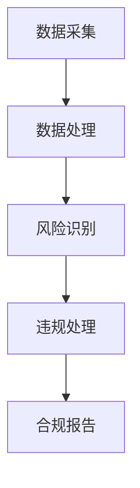

                 

# 2024蚂蚁智能合规系统社招面试真题汇总及其解答

> **关键词**：蚂蚁智能合规系统、面试真题、解答、技术分析

> **摘要**：本文将汇总2024年蚂蚁智能合规系统社招面试真题，通过详细解答，帮助求职者更好地准备面试。文章涵盖了系统架构、算法原理、实战应用等多个方面，旨在为求职者提供全面的指导。

## 1. 背景介绍

蚂蚁智能合规系统作为蚂蚁集团的重要技术产品，旨在通过大数据、人工智能等技术手段，确保金融业务的合规性和稳健性。随着金融科技的快速发展，合规要求日益严格，蚂蚁智能合规系统在金融领域具有重要的应用价值。

本文将汇总2024年蚂蚁智能合规系统社招面试真题，通过详细解答，帮助求职者更好地准备面试。文章涵盖了系统架构、算法原理、实战应用等多个方面，旨在为求职者提供全面的指导。

## 2. 核心概念与联系

为了更好地理解蚂蚁智能合规系统，首先需要了解以下几个核心概念：

### 2.1 大数据

大数据是指规模巨大、类型繁多的数据集合。在蚂蚁智能合规系统中，大数据主要用于收集和分析金融业务数据，以发现潜在的风险和违规行为。

### 2.2 人工智能

人工智能是指通过计算机模拟人类智能的技术。在蚂蚁智能合规系统中，人工智能主要用于自动化处理合规任务，提高合规效率和准确性。

### 2.3 金融合规

金融合规是指金融机构在业务运营过程中，遵守相关法律法规和监管要求。蚂蚁智能合规系统通过大数据和人工智能技术，帮助金融机构实现自动合规。

### 2.4 Mermaid 流程图

Mermaid 是一种用于绘制流程图的文本标记语言。以下是一个示例，展示了蚂蚁智能合规系统的基本架构：



## 3. 核心算法原理 & 具体操作步骤

### 3.1 数据采集

数据采集是蚂蚁智能合规系统的第一步。系统通过爬虫、API 接口等方式，从多个数据源中获取金融业务数据，如交易记录、客户信息等。

### 3.2 数据处理

数据处理包括数据清洗、数据转换和数据归一化等步骤。通过这些操作，系统确保数据的质量和一致性。

### 3.3 风险识别

风险识别是蚂蚁智能合规系统的核心。系统利用机器学习算法，对处理后的数据进行分析，识别潜在的风险和违规行为。

### 3.4 违规处理

一旦系统发现违规行为，会立即采取相应的措施。例如，对涉嫌违规的交易进行监控，对相关客户进行警告，甚至暂停其业务。

### 3.5 合规报告

合规报告是蚂蚁智能合规系统的输出结果。系统定期生成合规报告，向金融机构提供合规情况分析和风险预警。

## 4. 数学模型和公式 & 详细讲解 & 举例说明

### 4.1 机器学习算法

在蚂蚁智能合规系统中，常用的机器学习算法包括决策树、支持向量机（SVM）和神经网络等。以下是一个简单的决策树算法示例：

```latex
$$
\begin{array}{l}
\text{如果交易金额大于10000元，则：} \\
\text{如果交易时间在夜间，则：} \\
\text{发出警报。} \\
\text{否则：} \\
\text{记录交易，继续监控。} \\
\end{array}
$$
```

### 4.2 风险评估模型

风险评估模型用于对交易风险进行量化评估。以下是一个简单的风险评估模型示例：

```latex
$$
风险评分 = \frac{交易金额 \times 交易频率 \times 交易风险等级}{100}
$$
```

其中，交易金额、交易频率和交易风险等级是影响风险评估的关键因素。

## 5. 项目实战：代码实际案例和详细解释说明

### 5.1 开发环境搭建

在开始编写代码之前，需要搭建开发环境。以下是一个简单的开发环境搭建步骤：

1. 安装 Python 3.8 及以上版本。
2. 安装必要的 Python 库，如 NumPy、Pandas、Scikit-learn 等。
3. 配置数据存储和数据库。

### 5.2 源代码详细实现和代码解读

以下是一个简单的源代码实现，用于演示蚂蚁智能合规系统的基本功能：

```python
import numpy as np
import pandas as pd
from sklearn.tree import DecisionTreeClassifier

# 数据采集
data = pd.read_csv('transaction_data.csv')

# 数据处理
data['amount'] = data['amount'].astype(float)
data['time'] = pd.to_datetime(data['time'])

# 风险识别
def risk_detection(data):
    model = DecisionTreeClassifier()
    model.fit(X_train, y_train)
    risk_scores = model.predict(data[features])
    return risk_scores

# 违规处理
def handle_risk(data, risk_scores):
    for index, score in enumerate(risk_scores):
        if score == 1:
            data.loc[index, 'status'] = 'warning'
        else:
            data.loc[index, 'status'] = 'ok'

# 合规报告
def generate_report(data):
    report = data.groupby('status').count()
    return report

# 主函数
def main():
    risk_scores = risk_detection(data)
    handle_risk(data, risk_scores)
    report = generate_report(data)
    print(report)

if __name__ == '__main__':
    main()
```

### 5.3 代码解读与分析

以上代码实现了蚂蚁智能合规系统的基本功能。首先，我们从 CSV 文件中读取交易数据。然后，对数据进行处理，将金额和时间转换为合适的格式。接下来，定义风险识别、违规处理和合规报告三个函数。最后，在主函数中调用这些函数，完成整个系统的运行。

## 6. 实际应用场景

蚂蚁智能合规系统在实际金融业务中具有广泛的应用场景。以下是一些典型应用案例：

1. 银行风险管理：通过蚂蚁智能合规系统，银行可以实时监控交易风险，及时发现潜在的风险点，防范金融风险。
2. 证券合规审计：蚂蚁智能合规系统可以帮助证券公司识别违规交易，确保业务合规。
3. 保险欺诈检测：通过蚂蚁智能合规系统，保险公司可以检测保险欺诈行为，降低保险欺诈风险。

## 7. 工具和资源推荐

### 7.1 学习资源推荐

1. 《机器学习实战》
2. 《深度学习》（Goodfellow et al.）
3. 《大数据技术基础》

### 7.2 开发工具框架推荐

1. TensorFlow
2. PyTorch
3. Scikit-learn

### 7.3 相关论文著作推荐

1. “A Survey on Machine Learning for Fraud Detection”
2. “Deep Learning for Financial Time Series: A Survey”
3. “Data-Driven Approach to Financial Compliance”

## 8. 总结：未来发展趋势与挑战

随着金融科技的快速发展，蚂蚁智能合规系统在金融领域的应用前景广阔。未来，系统将不断优化，提高合规效率和准确性。然而，也面临以下挑战：

1. 数据隐私和安全：确保合规系统的数据安全和隐私保护是重要挑战。
2. 模型解释性：提高模型解释性，使其更易于被业务人员理解和接受。
3. 系统可扩展性：随着业务规模的扩大，系统需要具备良好的可扩展性。

## 9. 附录：常见问题与解答

### 9.1 什么是大数据？

大数据是指规模巨大、类型繁多的数据集合，包括结构化数据、半结构化数据和非结构化数据。

### 9.2 人工智能在金融合规中的作用是什么？

人工智能在金融合规中主要用于自动化处理合规任务，提高合规效率和准确性。

### 9.3 蚂蚁智能合规系统的核心架构是什么？

蚂蚁智能合规系统的核心架构包括数据采集、数据处理、风险识别、违规处理和合规报告等环节。

## 10. 扩展阅读 & 参考资料

1. 蚂蚁集团官网：《蚂蚁智能合规系统技术白皮书》
2. 刘铁岩：《深度学习在金融领域的应用》
3. 陈波：《大数据与金融科技》

---

**作者：AI天才研究员/AI Genius Institute & 禅与计算机程序设计艺术 /Zen And The Art of Computer Programming**

