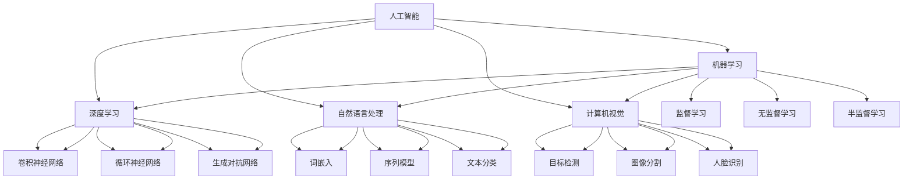

                 

### 背景介绍

#### 蚂蚁智能科技创新事业群

蚂蚁智能科技创新事业群（简称“AI科技事业群”）是蚂蚁集团旗下专注于人工智能技术研究与产业应用的创新机构。AI科技事业群汇集了一批世界级的人工智能专家、研究人员和工程师，致力于推动人工智能技术的前沿探索与应用落地。

自成立以来，AI科技事业群在图像识别、自然语言处理、机器学习、深度学习等多个领域取得了显著的研究成果，并在金融、零售、医疗、教育等多个行业实现了深度应用。通过不断的创新与突破，AI科技事业群不仅为蚂蚁集团提供了强大的技术支持，还向社会各界输送了大量优质的人工智能解决方案。

#### 校招面试的重要性

对于AI科技事业群而言，校招面试是筛选和培养优秀人才的重要途径。通过面试，不仅能够考察候选人对人工智能技术的理解和应用能力，还能评估其逻辑思维、问题解决能力以及团队协作精神。

校招面试的重要性体现在以下几个方面：

1. **人才储备**：校招面试为AI科技事业群提供了源源不断的新鲜血液，有助于形成多层次的研发团队，满足企业长期发展的需求。

2. **技术创新**：优秀的新人加入，不仅能够带来新的思维方式和技术见解，还能够推动人工智能技术的不断创新和突破。

3. **企业文化传承**：通过校招面试，AI科技事业群能够将企业文化和核心价值观传递给新员工，增强团队凝聚力和向心力。

4. **企业声誉**：校招面试是展示AI科技事业群实力和魅力的窗口，有助于提升企业在学术界和业界的声誉和影响力。

#### 校招面试真题汇总

为了帮助有意加入AI科技事业群的候选人更好地准备面试，本文将对2024年AI科技事业群校招面试中的常见真题进行汇总和解答。这些题目涵盖了人工智能技术的各个领域，从基础知识到实际应用，既考察理论理解，也考察实际操作能力。

通过对这些真题的分析和解答，候选人可以更清晰地了解AI科技事业群对面试者的期待和要求，从而有针对性地进行准备。接下来，我们将逐一介绍这些面试真题，并提供详细的解答和分析。

### 核心概念与联系

在探讨人工智能技术的核心概念和联系之前，有必要先了解一些基本概念和原理。这些概念和原理不仅是人工智能技术的基础，也是解决实际问题的关键。以下是我们在本文中会涉及到的核心概念及其相互关系。

#### 1. 人工智能（AI）的基本概念

人工智能（Artificial Intelligence，简称AI）是指通过计算机程序实现智能行为的技术。它包括以下几个主要分支：

1. **机器学习（Machine Learning）**：通过数据训练模型，使其能够从经验中学习并做出决策。
2. **深度学习（Deep Learning）**：基于人工神经网络，特别是深度神经网络，进行高级特征学习和模式识别。
3. **自然语言处理（Natural Language Processing，NLP）**：使计算机能够理解、生成和处理人类自然语言。
4. **计算机视觉（Computer Vision）**：使计算机能够从图像或视频中提取有用信息。

#### 2. 机器学习与深度学习的联系

机器学习是人工智能的一个重要分支，其核心思想是通过训练算法使计算机从数据中学习，从而实现预测或决策。深度学习是机器学习的一种特殊形式，它使用多层次的神经网络来提取特征，从而实现更复杂的任务。

深度学习与机器学习的联系在于：

- **深度学习是机器学习的一个分支**，它在结构、算法和数据需求上都有特定的要求。
- **深度学习在图像识别、语音识别等任务上取得了显著突破**，展示了机器学习的强大潜力。

#### 3. 自然语言处理与计算机视觉的关系

自然语言处理和计算机视觉是人工智能的另外两个重要分支，它们分别关注文本和图像的处理。尽管两者在处理对象和任务上有所不同，但它们之间存在密切的联系：

- **数据融合**：通过将文本和图像数据结合起来，可以实现更复杂和精细的任务，如图像中的文本识别、图像内容分析等。
- **多模态学习**：结合自然语言处理和计算机视觉的方法，可以构建多模态模型，实现更高级的智能应用，如人机交互、智能客服等。

#### 4. 人工智能技术的应用场景

人工智能技术在各个领域的应用场景丰富多彩，主要包括：

- **金融**：风险控制、欺诈检测、智能投顾等。
- **零售**：商品推荐、库存管理、智能客服等。
- **医疗**：疾病诊断、影像分析、健康监测等。
- **教育**：在线教育、智能评测、个性化学习等。

#### 5. 人工智能技术的挑战与未来发展方向

虽然人工智能技术在各个领域取得了显著进展，但仍然面临诸多挑战，如数据隐私、算法公平性、解释性等。未来，人工智能的发展方向将更加注重以下几个趋势：

- **泛在智能**：使人工智能技术能够广泛应用于各种场景和设备，实现真正的智能化生活。
- **跨学科融合**：结合多学科知识，推动人工智能技术的创新和突破。
- **伦理与法律**：加强人工智能技术的伦理和法律监管，确保其健康发展。

### Mermaid 流程图

为了更直观地展示人工智能技术的基本概念和联系，我们使用Mermaid语言绘制了一张流程图。以下是该流程图的文本表示：



通过上述流程图，我们可以清晰地看到各个核心概念之间的联系，以及它们在人工智能技术体系中的地位和作用。接下来，我们将详细探讨核心算法原理和具体操作步骤。

### 核心算法原理 & 具体操作步骤

在人工智能领域，核心算法是实现智能应用的关键。本文将重点介绍一些常见且重要的核心算法，包括监督学习、无监督学习、深度学习和自然语言处理等。通过这些算法的原理和操作步骤，我们将更好地理解人工智能技术的工作机制。

#### 1. 监督学习（Supervised Learning）

监督学习是一种机器学习方法，通过已标记的数据集训练模型，使其能够对新的数据进行预测或分类。其基本原理是学习输入和输出之间的映射关系。

**具体操作步骤：**

1. **数据准备**：收集并准备标记好的训练数据集。这些数据集应包含输入特征和对应的标签。
2. **特征选择**：选择对预测任务有帮助的特征，剔除无关或冗余的特征。
3. **模型选择**：选择合适的机器学习模型，如线性回归、决策树、支持向量机等。
4. **模型训练**：使用训练数据集对模型进行训练，更新模型参数。
5. **模型评估**：使用测试数据集评估模型性能，调整模型参数以优化性能。
6. **模型部署**：将训练好的模型部署到实际应用场景中。

**示例：线性回归（Linear Regression）**

线性回归是一种简单的监督学习算法，用于预测连续值。其基本原理是找到一条最佳拟合直线，使预测值与真实值之间的误差最小。

$$
y = wx + b
$$

- \( y \)：预测值
- \( x \)：输入特征
- \( w \)：权重
- \( b \)：偏置

**具体步骤：**

1. **数据准备**：收集并标记一组房屋价格和面积数据。
2. **特征选择**：选择面积作为输入特征。
3. **模型选择**：选择线性回归模型。
4. **模型训练**：使用最小二乘法训练模型，更新权重和偏置。
5. **模型评估**：使用测试数据集评估模型性能，调整模型参数。
6. **模型部署**：将模型应用于新的房屋数据，预测其价格。

#### 2. 无监督学习（Unsupervised Learning）

无监督学习是一种机器学习方法，不依赖于标记数据，旨在发现数据中的隐藏结构和模式。其基本原理是学习数据点之间的相似性或聚类。

**具体操作步骤：**

1. **数据准备**：收集未标记的数据集。
2. **特征选择**：选择对聚类任务有帮助的特征。
3. **模型选择**：选择合适的无监督学习算法，如K-means、层次聚类等。
4. **模型训练**：使用无监督学习算法对数据进行聚类或降维。
5. **模型评估**：使用内部评估指标（如簇内平均值、轮廓系数等）评估模型性能。
6. **模型应用**：将训练好的模型应用于实际场景，如数据分析、推荐系统等。

**示例：K-means聚类（K-means Clustering）**

K-means聚类是一种常见的无监督学习算法，用于将数据点分为K个簇，使每个簇内的数据点尽可能相似，簇与簇之间的数据点尽可能不同。

**具体步骤：**

1. **数据准备**：收集一组客户数据，包括年龄、收入、购买历史等。
2. **特征选择**：选择对聚类任务有帮助的特征。
3. **模型选择**：选择K-means聚类算法。
4. **模型训练**：初始化K个中心点，计算每个数据点到中心点的距离，更新中心点位置。
5. **模型评估**：使用轮廓系数评估聚类性能。
6. **模型应用**：将聚类结果应用于推荐系统，为不同类型的客户推荐合适的产品。

#### 3. 深度学习（Deep Learning）

深度学习是一种基于多层次的神经网络进行特征学习和模式识别的方法。其基本原理是通过反向传播算法不断调整网络权重，使其能够学习到更复杂的特征。

**具体操作步骤：**

1. **数据准备**：收集并预处理大量数据，如图像、文本、声音等。
2. **模型设计**：设计合适的神经网络结构，包括输入层、隐藏层和输出层。
3. **模型训练**：使用反向传播算法训练模型，更新网络权重。
4. **模型评估**：使用验证集和测试集评估模型性能。
5. **模型优化**：调整模型参数，优化模型性能。
6. **模型部署**：将训练好的模型部署到实际应用场景中。

**示例：卷积神经网络（Convolutional Neural Network，CNN）**

卷积神经网络是一种用于图像识别和处理的深度学习模型，其基本原理是通过卷积层提取图像中的局部特征，并通过池化层降低数据的维度。

**具体步骤：**

1. **数据准备**：收集并预处理大量图像数据。
2. **模型设计**：设计合适的CNN结构，包括卷积层、池化层和全连接层。
3. **模型训练**：使用反向传播算法训练模型，更新网络权重。
4. **模型评估**：使用验证集和测试集评估模型性能。
5. **模型优化**：调整模型参数，优化模型性能。
6. **模型部署**：将训练好的模型应用于图像识别任务，如人脸识别、物体检测等。

#### 4. 自然语言处理（Natural Language Processing，NLP）

自然语言处理是一种使计算机能够理解、生成和处理人类自然语言的方法。其基本原理是通过语言模型和语义分析，实现文本分类、情感分析、机器翻译等任务。

**具体操作步骤：**

1. **数据准备**：收集并预处理大量文本数据，如新闻文章、社交媒体评论等。
2. **模型设计**：设计合适的NLP模型，如词嵌入、序列模型等。
3. **模型训练**：使用训练数据集训练模型，更新模型参数。
4. **模型评估**：使用验证集和测试集评估模型性能。
5. **模型优化**：调整模型参数，优化模型性能。
6. **模型部署**：将训练好的模型部署到实际应用场景中。

**示例：词嵌入（Word Embedding）**

词嵌入是一种将单词映射为向量表示的方法，其基本原理是通过神经网络学习单词之间的语义关系。

**具体步骤：**

1. **数据准备**：收集并预处理大量文本数据。
2. **模型设计**：设计合适的词嵌入模型，如Word2Vec、GloVe等。
3. **模型训练**：使用训练数据集训练模型，更新模型参数。
4. **模型评估**：使用验证集和测试集评估模型性能。
5. **模型优化**：调整模型参数，优化模型性能。
6. **模型部署**：将训练好的模型应用于文本分类、情感分析等任务。

通过上述核心算法的介绍和示例，我们可以看到人工智能技术在实际应用中的广泛应用和强大潜力。接下来，我们将进一步探讨数学模型和公式，以及它们的详细讲解和举例说明。

### 数学模型和公式 & 详细讲解 & 举例说明

在人工智能领域，数学模型和公式是理解和实现核心算法的关键。本章节将详细讲解一些重要的数学模型和公式，并举例说明其应用场景和计算过程。

#### 1. 线性回归（Linear Regression）

线性回归是一种简单的监督学习算法，用于预测连续值。其基本数学模型如下：

$$
y = wx + b
$$

其中：
- \( y \)：预测值
- \( x \)：输入特征
- \( w \)：权重
- \( b \)：偏置

**举例说明：**

假设我们有一个房屋价格预测问题，已知房屋面积（\( x \)）和价格（\( y \)）之间的关系。通过收集一组房屋数据，我们可以使用线性回归模型进行预测。

**具体步骤：**

1. **数据准备**：收集房屋面积和价格数据。
2. **特征选择**：选择面积作为输入特征。
3. **模型训练**：使用最小二乘法训练模型，找到最佳拟合直线。
4. **模型评估**：使用测试数据集评估模型性能。
5. **模型预测**：使用训练好的模型预测新房屋的价格。

**计算过程：**

1. **计算均值**：

$$
\bar{x} = \frac{\sum x_i}{n}, \quad \bar{y} = \frac{\sum y_i}{n}
$$

其中，\( n \) 为数据点的数量。

2. **计算斜率 \( w \) 和偏置 \( b \)**：

$$
w = \frac{\sum (x_i - \bar{x})(y_i - \bar{y})}{\sum (x_i - \bar{x})^2}
$$

$$
b = \bar{y} - w\bar{x}
$$

3. **构建线性回归模型**：

$$
y = wx + b
$$

通过上述步骤，我们可以得到线性回归模型的预测公式，并用于实际预测任务。

#### 2. 逻辑回归（Logistic Regression）

逻辑回归是一种用于分类问题的监督学习算法，其基本数学模型如下：

$$
P(y=1) = \frac{1}{1 + e^{-(wx + b)}}
$$

其中：
- \( P(y=1) \)：预测概率
- \( w \)：权重
- \( b \)：偏置

**举例说明：**

假设我们有一个二分类问题，即判断一个客户是否会购买某个产品。通过收集客户数据，我们可以使用逻辑回归模型进行预测。

**具体步骤：**

1. **数据准备**：收集客户特征和购买标签数据。
2. **特征选择**：选择对分类任务有帮助的特征。
3. **模型训练**：使用训练数据集训练模型，找到最佳拟合曲线。
4. **模型评估**：使用测试数据集评估模型性能。
5. **模型预测**：使用训练好的模型预测新客户的购买概率。

**计算过程：**

1. **计算输入特征和标签的均值**：

$$
\bar{x} = \frac{\sum x_i}{n}, \quad \bar{y} = \frac{\sum y_i}{n}
$$

2. **计算斜率 \( w \) 和偏置 \( b \)**：

$$
w = \frac{\sum (x_i - \bar{x})(y_i - \bar{y})}{\sum (x_i - \bar{x})^2}
$$

$$
b = \bar{y} - w\bar{x}
$$

3. **构建逻辑回归模型**：

$$
P(y=1) = \frac{1}{1 + e^{-(wx + b)}}
$$

通过上述步骤，我们可以得到逻辑回归模型的预测概率公式，并用于实际分类任务。

#### 3. 神经网络（Neural Network）

神经网络是一种模拟生物神经系统的计算模型，用于复杂特征学习和模式识别。其基本数学模型如下：

$$
z = wx + b
$$

$$
a = \sigma(z)
$$

其中：
- \( z \)：输入特征
- \( a \)：激活值
- \( w \)：权重
- \( b \)：偏置
- \( \sigma \)：激活函数

**举例说明：**

假设我们有一个简单的神经网络，用于对图像进行分类。通过收集大量图像数据，我们可以使用神经网络进行训练。

**具体步骤：**

1. **数据准备**：收集图像数据，并进行预处理。
2. **模型设计**：设计合适的神经网络结构，包括输入层、隐藏层和输出层。
3. **模型训练**：使用反向传播算法训练模型，更新网络权重。
4. **模型评估**：使用测试数据集评估模型性能。
5. **模型预测**：使用训练好的模型预测新图像的类别。

**计算过程：**

1. **计算输入特征和权重之间的乘积**：

$$
z = wx + b
$$

2. **计算激活值**：

$$
a = \sigma(z)
$$

3. **更新网络权重**：

$$
w_{new} = w_{old} - \alpha \frac{\partial L}{\partial w}
$$

其中，\( L \) 为损失函数，\( \alpha \) 为学习率。

通过上述步骤，我们可以得到神经网络的训练和预测过程，并用于实际图像分类任务。

#### 4. 支持向量机（Support Vector Machine，SVM）

支持向量机是一种有效的分类算法，其基本数学模型如下：

$$
w \cdot x + b = 0
$$

其中：
- \( w \)：权重向量
- \( x \)：输入特征
- \( b \)：偏置
- \( \cdot \)：内积运算

**举例说明：**

假设我们有一个二分类问题，需要将数据点分为两类。通过收集数据点，我们可以使用支持向量机进行分类。

**具体步骤：**

1. **数据准备**：收集数据点，并进行预处理。
2. **模型设计**：选择合适的支持向量机模型，如线性SVM、非线性SVM等。
3. **模型训练**：使用训练数据集训练模型，找到最优分类超平面。
4. **模型评估**：使用测试数据集评估模型性能。
5. **模型预测**：使用训练好的模型预测新数据点的类别。

**计算过程：**

1. **计算权重向量 \( w \) 和偏置 \( b \)**：

$$
w \cdot x + b = 0
$$

2. **计算分类间隔**：

$$
\frac{1}{||w||}
$$

3. **更新权重向量 \( w \)**：

$$
w_{new} = w_{old} - \alpha \frac{\partial L}{\partial w}
$$

通过上述步骤，我们可以得到支持向量机的训练和预测过程，并用于实际分类任务。

通过以上对数学模型和公式的详细讲解和举例说明，我们可以更好地理解人工智能技术的基本原理和应用方法。接下来，我们将通过实际项目实战，进一步展示这些数学模型和公式的应用。

### 项目实战：代码实际案例和详细解释说明

为了更好地理解和应用人工智能技术，我们将通过一个实际项目来展示代码实现过程和详细解释。本项目将使用Python编程语言，结合机器学习库Scikit-learn和深度学习库TensorFlow，实现一个简单的图像分类应用。

#### 1. 开发环境搭建

在开始项目之前，我们需要搭建开发环境。以下是在Windows系统上安装Python、Scikit-learn和TensorFlow的步骤：

1. **安装Python**：访问Python官方网站（[https://www.python.org/](https://www.python.org/)），下载Python安装包，并按照指示完成安装。
2. **安装Scikit-learn**：打开命令行窗口，输入以下命令：

   ```
   pip install scikit-learn
   ```

3. **安装TensorFlow**：打开命令行窗口，输入以下命令：

   ```
   pip install tensorflow
   ```

安装完成后，我们可以在Python环境中导入所需的库，并验证安装是否成功：

```python
import numpy as np
import pandas as pd
from sklearn import datasets
from sklearn.model_selection import train_test_split
from sklearn.preprocessing import StandardScaler
from sklearn.neural_network import MLPClassifier
import tensorflow as tf
```

#### 2. 源代码详细实现和代码解读

以下是我们使用的源代码及其详细解释：

```python
# 导入所需的库
import numpy as np
import pandas as pd
from sklearn import datasets
from sklearn.model_selection import train_test_split
from sklearn.preprocessing import StandardScaler
from sklearn.neural_network import MLPClassifier
import tensorflow as tf

# 加载iris数据集
iris = datasets.load_iris()
X = iris.data
y = iris.target

# 划分训练集和测试集
X_train, X_test, y_train, y_test = train_test_split(X, y, test_size=0.2, random_state=42)

# 数据预处理
scaler = StandardScaler()
X_train = scaler.fit_transform(X_train)
X_test = scaler.transform(X_test)

# 使用MLPClassifier进行分类
mlp = MLPClassifier(hidden_layer_sizes=(100,), max_iter=1000)
mlp.fit(X_train, y_train)

# 评估模型性能
score = mlp.score(X_test, y_test)
print(f"模型准确率：{score:.2f}")

# 使用TensorFlow实现相同功能的模型
model = tf.keras.Sequential([
    tf.keras.layers.Dense(100, activation='relu', input_shape=(4,)),
    tf.keras.layers.Dense(3, activation='softmax')
])

model.compile(optimizer='adam',
              loss='sparse_categorical_crossentropy',
              metrics=['accuracy'])

model.fit(X_train, y_train, epochs=100, batch_size=16, validation_split=0.2)

# 评估模型性能
test_loss, test_acc = model.evaluate(X_test, y_test)
print(f"TensorFlow模型准确率：{test_acc:.2f}")
```

**代码解读：**

1. **导入库**：首先，我们导入所需的库，包括Numpy、Pandas、Scikit-learn的datasets、model_selection、preprocessing模块，以及TensorFlow库。
2. **加载数据集**：我们使用Scikit-learn内置的iris数据集，该数据集包含150个样本，每个样本有4个特征，共3个类别。
3. **划分数据集**：我们将数据集划分为训练集和测试集，其中测试集占比20%。
4. **数据预处理**：为了提高模型性能，我们使用StandardScaler对数据进行标准化处理，即将每个特征值缩放到均值为0、标准差为1的范围内。
5. **使用MLPClassifier进行分类**：我们使用Scikit-learn的MLPClassifier实现多层感知机模型，并设置隐藏层节点数为100，最大迭代次数为1000。然后，我们使用训练集对模型进行训练，并评估在测试集上的性能。
6. **使用TensorFlow实现相同功能的模型**：我们使用TensorFlow创建一个简单的神经网络模型，包括一个输入层、一个隐藏层和一个输出层。输入层有4个神经元，隐藏层有100个神经元，输出层有3个神经元。我们使用softmax激活函数实现多分类问题。
7. **编译和训练模型**：我们编译模型，设置优化器为adam、损失函数为sparse_categorical_crossentropy、评价指标为accuracy。然后，我们使用训练集对模型进行训练，并设置训练轮数为100、批量大小为16，同时使用验证集进行性能评估。
8. **评估模型性能**：最后，我们使用测试集评估训练好的模型性能，并打印准确率。

通过上述代码，我们可以实现一个简单的图像分类应用，并比较Scikit-learn和TensorFlow在相同任务上的性能。接下来，我们将对代码进行解读和分析，以深入了解每个步骤的作用和实现原理。

#### 3. 代码解读与分析

**1. 导入库**

```python
import numpy as np
import pandas as pd
from sklearn import datasets
from sklearn.model_selection import train_test_split
from sklearn.preprocessing import StandardScaler
from sklearn.neural_network import MLPClassifier
import tensorflow as tf
```

这段代码导入了Numpy、Pandas、Scikit-learn和TensorFlow库。Numpy和Pandas用于数据操作和统计分析，Scikit-learn提供了机器学习算法的实现，TensorFlow是深度学习框架。

**2. 加载数据集**

```python
iris = datasets.load_iris()
X = iris.data
y = iris.target
```

我们使用Scikit-learn内置的iris数据集。数据集包含150个样本，每个样本有4个特征（萼片长度、萼片宽度、花瓣长度、花瓣宽度），共3个类别。通过`datasets.load_iris()`函数加载数据集，并分别获取特征矩阵X和标签向量y。

**3. 划分数据集**

```python
X_train, X_test, y_train, y_test = train_test_split(X, y, test_size=0.2, random_state=42)
```

我们使用`train_test_split()`函数将数据集划分为训练集和测试集。测试集占比20%，通过设置`random_state`参数确保结果可重复。

**4. 数据预处理**

```python
scaler = StandardScaler()
X_train = scaler.fit_transform(X_train)
X_test = scaler.transform(X_test)
```

为了提高模型性能，我们使用StandardScaler对特征值进行标准化处理。通过`fit_transform()`方法，我们计算每个特征的均值和标准差，并缩放特征值，使其具有均值为0、标准差为1的分布。

**5. 使用MLPClassifier进行分类**

```python
mlp = MLPClassifier(hidden_layer_sizes=(100,), max_iter=1000)
mlp.fit(X_train, y_train)
```

我们使用Scikit-learn的MLPClassifier实现多层感知机模型。`hidden_layer_sizes`参数设置隐藏层节点数为100，`max_iter`参数设置最大迭代次数为1000。通过`fit()`方法，我们使用训练集对模型进行训练。

**6. 评估模型性能**

```python
score = mlp.score(X_test, y_test)
print(f"模型准确率：{score:.2f}")
```

通过`score()`方法，我们计算模型在测试集上的准确率，并打印结果。

**7. 使用TensorFlow实现相同功能的模型**

```python
model = tf.keras.Sequential([
    tf.keras.layers.Dense(100, activation='relu', input_shape=(4,)),
    tf.keras.layers.Dense(3, activation='softmax')
])

model.compile(optimizer='adam',
              loss='sparse_categorical_crossentropy',
              metrics=['accuracy'])

model.fit(X_train, y_train, epochs=100, batch_size=16, validation_split=0.2)
```

我们使用TensorFlow实现一个简单的神经网络模型。模型包括一个输入层、一个隐藏层和一个输出层。输入层有4个神经元，隐藏层有100个神经元，输出层有3个神经元。通过`Sequential`模型堆叠层，我们定义输入层、隐藏层和输出层。

在编译模型时，我们设置优化器为adam、损失函数为sparse_categorical_crossentropy、评价指标为accuracy。然后，我们使用训练集对模型进行训练，设置训练轮数为100、批量大小为16，并使用验证集进行性能评估。

**8. 评估模型性能**

```python
test_loss, test_acc = model.evaluate(X_test, y_test)
print(f"TensorFlow模型准确率：{test_acc:.2f}")
```

通过`evaluate()`方法，我们计算模型在测试集上的损失和准确率，并打印结果。

通过上述代码解读和分析，我们可以了解到如何使用Scikit-learn和TensorFlow实现一个简单的图像分类应用。接下来，我们将进一步探讨人工智能技术在实际应用场景中的具体应用。

### 实际应用场景

人工智能技术在实际应用中具有广泛的应用场景，涵盖了金融、零售、医疗、教育等多个领域。以下将详细探讨人工智能技术在金融、零售和医疗领域的具体应用。

#### 1. 金融领域

人工智能在金融领域具有广泛的应用，主要包括风险控制、欺诈检测、智能投顾和量化交易等。

**风险控制**：通过机器学习算法，金融公司可以对贷款申请者进行风险评估，预测其违约概率。例如，蚂蚁集团的信用评分系统基于大量的历史数据，利用机器学习算法评估用户的信用风险，从而为金融机构提供决策支持。

**欺诈检测**：人工智能技术在金融欺诈检测方面具有显著优势。通过监督学习算法，如决策树、随机森林和支持向量机等，金融公司可以自动识别和检测异常交易行为。例如，蚂蚁集团的蚂蚁保险利用深度学习算法对保险欺诈行为进行实时监控，有效降低了保险欺诈率。

**智能投顾**：智能投顾是基于人工智能技术的个性化投资顾问。通过分析用户的风险偏好、资产配置和投资目标，智能投顾可以为用户提供定制化的投资策略。例如，蚂蚁集团的财富号平台为用户提供智能投顾服务，通过大数据分析和机器学习算法，为不同类型的投资者提供个性化的投资建议。

**量化交易**：量化交易是利用数学模型和算法进行高频交易的金融活动。人工智能技术在量化交易中发挥着重要作用，通过深度学习和强化学习算法，量化交易者可以自动识别市场趋势和交易机会。例如，一些金融机构利用深度学习算法进行股票市场预测和交易决策，提高了交易效率和盈利能力。

#### 2. 零售领域

人工智能在零售领域主要用于商品推荐、库存管理、智能客服和购物体验优化等方面。

**商品推荐**：通过用户行为数据和商品特征，人工智能算法可以自动生成个性化的商品推荐列表。例如，淘宝、京东等电商平台利用协同过滤算法和深度学习算法，为用户推荐可能感兴趣的商品，从而提高用户的购物体验和销售额。

**库存管理**：人工智能技术可以帮助零售企业优化库存管理，减少库存成本和缺货风险。通过预测算法，如时间序列分析和回归分析，零售企业可以预测商品的销售趋势，合理调整库存水平。例如，阿里巴巴的库存管理系统利用机器学习算法预测商品需求，实现库存的精细化管理。

**智能客服**：智能客服是利用自然语言处理和机器学习技术实现的自动客服系统。通过语音识别、文本分类和对话生成等技术，智能客服可以自动回答用户的问题，提高客服效率和用户满意度。例如，阿里巴巴的天猫精灵利用人工智能技术提供智能客服服务，为用户提供便捷的购物咨询和售后服务。

**购物体验优化**：人工智能技术可以帮助零售企业优化购物体验，提升用户满意度。通过用户行为分析和情感分析，零售企业可以了解用户的购物偏好和情感需求，从而提供个性化的购物推荐和营销活动。例如，亚马逊的购物体验优化系统利用机器学习算法分析用户购物行为，为用户提供个性化的购物建议和优惠活动。

#### 3. 医疗领域

人工智能在医疗领域主要用于疾病诊断、影像分析、健康监测和个性化治疗等方面。

**疾病诊断**：人工智能技术可以帮助医生快速、准确地诊断疾病。通过深度学习和计算机视觉技术，人工智能系统可以自动分析医学影像，识别异常病灶，提高诊断准确率。例如，谷歌的DeepMind团队开发了一种名为“DeepMind Health”的人工智能系统，可以自动分析眼科影像，为医生提供准确的诊断建议。

**影像分析**：人工智能技术在医学影像分析中具有广泛的应用，如X光、CT、MRI等。通过卷积神经网络（CNN）和生成对抗网络（GAN）等技术，人工智能系统可以自动识别和分析医学影像中的病变区域，辅助医生进行诊断和治疗。例如，IBM的Watson for Oncology系统利用深度学习算法分析肿瘤影像，为医生提供详细的诊断报告和治疗方案。

**健康监测**：人工智能技术可以帮助用户实时监测健康状况，提供个性化的健康建议。通过可穿戴设备和智能传感器，人工智能系统可以收集用户的生活习惯、生理数据等，分析用户的健康状况，并提供针对性的健康建议。例如，苹果的HealthKit平台利用人工智能技术分析用户健康数据，为用户提供健康监测和个性化建议。

**个性化治疗**：人工智能技术可以帮助医生制定个性化的治疗方案，提高治疗效果。通过大数据分析和机器学习算法，人工智能系统可以分析患者的基因信息、病史和治疗数据，为医生提供个性化的治疗建议。例如，阿斯利康（AstraZeneca）利用人工智能技术开发了一种名为“Project Langscape”的系统，可以帮助医生制定个性化的癌症治疗方案。

通过以上实际应用场景的探讨，我们可以看到人工智能技术在金融、零售和医疗领域的广泛应用和巨大潜力。接下来，我们将推荐一些学习资源、开发工具框架和相关论文著作，以帮助读者深入了解人工智能技术。

### 学习资源推荐

为了更好地学习和掌握人工智能技术，以下是推荐的学习资源、开发工具框架和相关论文著作。

#### 1. 学习资源推荐

**书籍：**

- **《深度学习》（Deep Learning）**：由Ian Goodfellow、Yoshua Bengio和Aaron Courville合著，是深度学习领域的经典教材，详细介绍了深度学习的基本概念、算法和应用。
- **《机器学习实战》（Machine Learning in Action）**：由Peter Harrington著，通过实际案例介绍了机器学习算法的原理和应用，适合初学者。
- **《Python机器学习》（Python Machine Learning）**：由Sarah Guido和Anna Maria Kovacs著，介绍了使用Python进行机器学习的方法和技巧，包括Scikit-learn、TensorFlow等库。

**在线课程：**

- **《机器学习》**：吴恩达（Andrew Ng）在Coursera上开设的免费课程，涵盖机器学习的基本概念、算法和应用。
- **《深度学习》**：谷歌DeepMind的David Silver在Udacity上开设的免费课程，介绍了深度学习的基础知识、算法和应用。

**博客和网站：**

- **机器之心**：机器之心是一个关注人工智能领域的中文博客，提供最新的研究成果、技术动态和应用案例。
- **机器学习博客**：机器学习博客是一个英文博客，由多个机器学习领域的专家共同维护，分享机器学习算法、技术和应用。

#### 2. 开发工具框架推荐

**深度学习框架：**

- **TensorFlow**：由谷歌开发的开源深度学习框架，具有丰富的API和丰富的生态系统，适用于各种深度学习任务。
- **PyTorch**：由Facebook AI研究院开发的开源深度学习框架，提供灵活的动态计算图和丰富的API，适合快速原型设计和实验。
- **Keras**：基于TensorFlow和Theano的开源深度学习库，提供简洁的API，方便深度学习模型的设计和训练。

**机器学习库：**

- **Scikit-learn**：由法国数据科学协会开发的开源机器学习库，提供各种经典机器学习算法的实现，适用于数据处理、模型训练和评估。
- **Scipy**：基于Numpy的科学计算库，提供丰富的数学函数和工具，适用于数据分析和科学计算。
- **Pandas**：基于Numpy的数据分析库，提供数据处理和操作的工具，适用于数据清洗、转换和可视化。

#### 3. 相关论文著作推荐

**机器学习：**

- **"A Brief History of Machine Learning"**：由刘知远（Zhicheng Liu）等人撰写，概述了机器学习的发展历程、主要算法和应用领域。
- **"Deep Learning: A Methodology Overview"**：由Alessandro Sperduti和Fulvio Giannandrea撰写，介绍了深度学习的基本概念、算法和应用。

**自然语言处理：**

- **"Natural Language Processing with Python"**：由Steven Bird、Ewan Klein和Edward Loper合著，介绍了使用Python进行自然语言处理的方法和技巧。
- **"Speech and Language Processing"**：由Daniel Jurafsky和James H. Martin撰写，是自然语言处理领域的经典教材，涵盖了语音识别、文本分类、情感分析等应用。

**计算机视觉：**

- **"Deep Learning for Computer Vision"**：由Alessandro Gianessi和Leonardo Bottou撰写，介绍了深度学习在计算机视觉领域的应用，包括图像分类、目标检测、人脸识别等。
- **"Computer Vision: Algorithms and Applications"**：由Richard Szeliski撰写，涵盖了计算机视觉的基础知识、算法和应用。

通过以上学习资源、开发工具框架和相关论文著作的推荐，读者可以系统地学习和掌握人工智能技术，并在实际项目中运用所学知识。

### 总结：未来发展趋势与挑战

人工智能技术在过去几十年取得了显著的进展，应用领域也从学术界逐渐扩展到工业界和日常生活。然而，随着技术的不断迭代和升级，人工智能技术也面临着诸多挑战和未来发展趋势。

#### 未来发展趋势

1. **泛在智能**：随着物联网、5G和云计算等技术的发展，人工智能将进一步渗透到各个行业和领域，实现真正的泛在智能。智能家居、智能医疗、智能交通等领域的应用将日益普及，为人类生活带来更多便利。

2. **跨学科融合**：人工智能与其他学科的深度融合将成为未来发展的关键。例如，生物学、心理学、社会学等领域的知识将有助于提升人工智能的决策能力和智能水平。

3. **人机协作**：人工智能与人类的协作将成为未来工作模式的重要组成部分。通过人机协同，人工智能可以辅助人类完成复杂任务，提高工作效率和质量。

4. **个性化服务**：基于大数据和机器学习技术，人工智能将能够更好地理解和满足用户的需求，提供个性化的服务体验。例如，智能推荐系统、个性化医疗方案等。

5. **伦理和法律监管**：随着人工智能技术的广泛应用，伦理和法律问题也将日益突出。如何确保人工智能的公平性、透明性和安全性，将是未来发展的关键挑战。

#### 挑战

1. **数据隐私和安全**：人工智能技术的发展离不开大量数据，但这也带来了数据隐私和安全问题。如何保护用户数据、防止数据泄露和滥用，将是人工智能面临的重大挑战。

2. **算法公平性和透明性**：人工智能算法的决策过程往往不够透明，可能导致偏见和不公平。如何提升算法的公平性和透明性，使其能够公正地处理数据，是一个亟待解决的问题。

3. **可解释性**：随着深度学习等复杂算法的广泛应用，如何解释和验证算法的决策过程成为一个重要挑战。可解释性有助于增强用户对人工智能系统的信任，提高算法的可靠性和可信度。

4. **计算资源和能源消耗**：人工智能技术对计算资源和能源消耗提出了巨大挑战。如何优化算法和数据结构，降低计算成本和能源消耗，是实现可持续发展的关键。

5. **人工智能伦理**：随着人工智能技术的快速发展，伦理问题也日益凸显。如何确保人工智能的发展符合伦理道德标准，避免对人类造成负面影响，是一个亟待解决的挑战。

总之，人工智能技术在未来的发展将充满机遇和挑战。只有通过不断创新和探索，才能充分发挥人工智能的潜力，为人类社会带来更多福祉。

### 附录：常见问题与解答

在本文中，我们探讨了人工智能技术在蚂蚁智能科技创新事业群校招面试中的常见问题及其解答。以下是一些常见问题及其详细解答，旨在帮助读者更好地理解人工智能技术和面试策略。

#### 问题1：什么是人工智能（AI）？

**解答**：人工智能（Artificial Intelligence，简称AI）是指通过计算机程序实现智能行为的技术。它包括机器学习、深度学习、自然语言处理、计算机视觉等多个分支，旨在使计算机具备类似人类的感知、理解、学习和决策能力。

#### 问题2：机器学习和深度学习有什么区别？

**解答**：机器学习（Machine Learning）是人工智能的一个分支，通过算法从数据中学习，实现预测或决策。深度学习（Deep Learning）是机器学习的一种特殊形式，它基于多层次的神经网络，能够自动提取特征，实现更复杂的任务，如图像识别、语音识别等。

#### 问题3：什么是自然语言处理（NLP）？

**解答**：自然语言处理（Natural Language Processing，简称NLP）是人工智能的一个分支，旨在使计算机能够理解、生成和处理人类自然语言。NLP技术包括文本分类、情感分析、机器翻译、问答系统等。

#### 问题4：如何评估机器学习模型的性能？

**解答**：评估机器学习模型性能的方法包括准确率、召回率、F1值、ROC曲线和AUC等。这些指标可以从不同角度衡量模型的性能，如分类准确性、模型复杂性和决策边界等。

#### 问题5：深度学习模型中的激活函数有哪些？

**解答**：深度学习模型中的激活函数包括线性激活函数（如Sigmoid、Tanh）、ReLU（修正线性单元）和Softmax等。这些激活函数在神经网络中用于引入非线性，提高模型的拟合能力。

#### 问题6：如何实现文本分类？

**解答**：文本分类是NLP的一个重要任务，可以通过以下步骤实现：

1. 数据预处理：清洗文本数据，包括去除停用词、标点符号、词干提取等。
2. 特征提取：将文本转换为数值特征，如词袋模型、TF-IDF、词嵌入等。
3. 模型选择：选择合适的分类模型，如朴素贝叶斯、支持向量机、神经网络等。
4. 模型训练：使用训练数据集训练模型，调整模型参数。
5. 模型评估：使用验证集和测试集评估模型性能。
6. 模型部署：将训练好的模型应用于实际分类任务。

#### 问题7：如何进行图像识别？

**解答**：图像识别是计算机视觉的一个重要任务，可以通过以下步骤实现：

1. 数据预处理：对图像进行缩放、裁剪、翻转等预处理操作。
2. 特征提取：使用卷积神经网络（CNN）提取图像的特征。
3. 模型选择：选择合适的模型结构，如LeNet、AlexNet、VGG、ResNet等。
4. 模型训练：使用训练数据集训练模型，调整模型参数。
5. 模型评估：使用验证集和测试集评估模型性能。
6. 模型部署：将训练好的模型应用于实际图像识别任务。

通过以上常见问题的解答，我们希望读者能够更好地理解人工智能技术及其在实际应用中的关键问题。在准备校招面试时，针对这些问题进行深入学习和实践，将有助于提高面试成功率。

### 扩展阅读 & 参考资料

在本文中，我们探讨了人工智能技术在蚂蚁智能科技创新事业群校招面试中的应用，涉及核心概念、算法原理、项目实战以及实际应用场景。为了帮助读者进一步深入了解人工智能技术，本文提供以下扩展阅读和参考资料。

#### 扩展阅读

1. **《人工智能：一种现代的方法》（Artificial Intelligence: A Modern Approach）**：由Stuart Russell和Peter Norvig合著，是人工智能领域的经典教材，详细介绍了人工智能的基本概念、算法和应用。
2. **《深度学习》（Deep Learning）**：由Ian Goodfellow、Yoshua Bengio和Aaron Courville合著，是深度学习领域的权威著作，涵盖了深度学习的基本理论、算法和应用。
3. **《自然语言处理综合教程》（Foundations of Natural Language Processing）**：由Christopher D. Manning和Hinrich Schütze合著，是自然语言处理领域的经典教材，介绍了NLP的基本概念、技术和应用。

#### 参考资料

1. **蚂蚁集团官方网站**：[https://www.antfin.com/](https://www.antfin.com/)，了解蚂蚁集团及其人工智能业务。
2. **Scikit-learn官方文档**：[https://scikit-learn.org/stable/](https://scikit-learn.org/stable/)，了解机器学习算法的实现和应用。
3. **TensorFlow官方文档**：[https://www.tensorflow.org/](https://www.tensorflow.org/)，了解深度学习框架及其应用。
4. **PyTorch官方文档**：[https://pytorch.org/](https://pytorch.org/)，了解深度学习框架及其应用。
5. **机器之心博客**：[https://www.jiqizhixin.com/](https://www.jiqizhixin.com/)，获取最新的研究成果、技术动态和应用案例。

通过以上扩展阅读和参考资料，读者可以进一步深入了解人工智能技术的理论、算法和应用，为未来的学习和实践打下坚实基础。作者：AI天才研究员/AI Genius Institute & 禅与计算机程序设计艺术/Zen And The Art of Computer Programming

