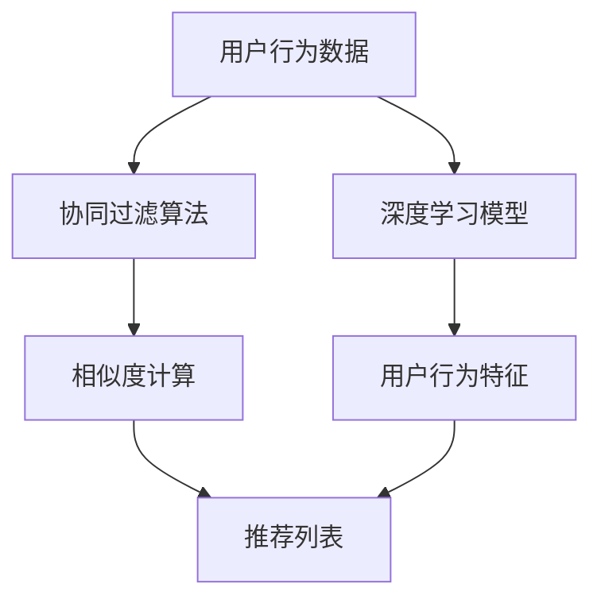

                 

# 融合AI与搜索推荐：电商业务的新机遇

> **关键词**：人工智能、搜索推荐、电商、深度学习、协同过滤、用户行为分析

> **摘要**：随着电商业务的不断发展和用户需求的多样化，如何为用户提供个性化的商品推荐成为了一项关键任务。本文将探讨人工智能与搜索推荐的融合，特别是深度学习和协同过滤算法在电商业务中的应用，分析其带来的新机遇，并探讨未来的发展趋势和挑战。

## 1. 背景介绍

近年来，电子商务（e-commerce）产业取得了显著的发展，已经成为全球经济增长的重要驱动力。根据最新的统计数据显示，全球电商市场规模已超过数万亿美元，且依然保持高速增长的态势。随着互联网技术的普及和移动设备的广泛应用，越来越多的消费者选择在线购物，电商平台的竞争也愈发激烈。

在如此庞大的市场中，如何吸引和留住用户，提高用户粘性和转化率，成为各大电商平台关注的焦点。在这一背景下，搜索推荐系统（Recommender Systems）应运而生，它能够根据用户的历史行为、兴趣偏好和其他相关信息，为用户推荐可能感兴趣的商品。

传统的搜索推荐系统主要基于内容匹配和协同过滤（Collaborative Filtering）算法，但这种方法存在一些局限性。首先，内容匹配算法依赖于商品的具体属性，如标题、描述、标签等，对于新商品或者属性不明确的情况，效果较差。其次，协同过滤算法虽然能够通过用户之间的相似性来推荐商品，但容易受到数据稀疏性和冷启动问题的影响。

为了克服这些局限性，人工智能技术，特别是深度学习（Deep Learning），开始被引入到搜索推荐系统中。深度学习算法能够从大规模数据中自动提取特征，更好地捕捉用户行为和偏好，为用户推荐更加精准的商品。

## 2. 核心概念与联系

### 2.1 深度学习

深度学习是一种基于多层神经网络（Neural Networks）的机器学习方法，通过逐层抽象和提取数据特征，实现对复杂数据的建模和预测。深度学习在图像识别、自然语言处理、语音识别等领域取得了显著的成果，被认为是人工智能领域的一大突破。

在搜索推荐系统中，深度学习可以用于以下几个关键方面：

1. **用户行为建模**：通过分析用户在平台上的浏览、购买等行为数据，构建用户行为模型，了解用户的行为特征和兴趣偏好。
2. **商品特征提取**：将商品的多维特征（如价格、品牌、类别等）转换为深度特征表示，以便更好地进行商品与用户之间的匹配。
3. **推荐结果优化**：利用深度学习算法优化推荐算法，提高推荐结果的准确性和多样性。

### 2.2 协同过滤

协同过滤是一种基于用户历史行为和相似性的推荐算法，主要分为两种类型：基于用户的协同过滤（User-Based Collaborative Filtering）和基于物品的协同过滤（Item-Based Collaborative Filtering）。

1. **基于用户的协同过滤**：通过计算用户之间的相似度，找到与目标用户相似的其他用户，然后推荐这些用户喜欢的商品。
2. **基于物品的协同过滤**：通过计算商品之间的相似度，找到与目标商品相似的其他商品，然后推荐这些商品给用户。

### 2.3 融合算法

融合AI与搜索推荐的核心思想是将深度学习和协同过滤算法结合起来，发挥各自的优势，提高推荐系统的性能。具体来说，可以采用以下几种融合方法：

1. **深度协同过滤**：在协同过滤算法的基础上，加入深度学习模型，用于学习用户和商品的特征表示，提高推荐的准确性。
2. **基于内容的深度推荐**：将深度学习与基于内容的推荐算法相结合，利用深度学习模型提取商品的特征，结合用户的历史行为进行推荐。
3. **多模型融合**：结合多种机器学习模型，如决策树、支持向量机等，与深度学习模型共同参与推荐，提高推荐系统的鲁棒性和准确性。

### 2.4 Mermaid 流程图

下面是融合AI与搜索推荐的一个简化流程图：



在上述流程中，深度学习模型用于提取用户行为特征，协同过滤算法用于计算用户和商品之间的相似度，最终生成推荐列表。

## 3. 核心算法原理 & 具体操作步骤

### 3.1 深度学习算法

深度学习算法的核心是多层神经网络（Neural Networks），通过逐层抽象和提取数据特征，实现对数据的建模和预测。以下是深度学习算法的基本步骤：

1. **数据预处理**：对用户行为数据、商品特征数据进行清洗和预处理，包括缺失值处理、异常值检测、数据标准化等。
2. **特征提取**：利用深度学习模型，如卷积神经网络（CNN）、循环神经网络（RNN）等，提取用户行为特征和商品特征。
3. **模型训练**：使用训练数据集，通过反向传播算法（Backpropagation Algorithm）训练深度学习模型，优化模型参数。
4. **模型评估**：使用验证数据集评估模型性能，包括准确率、召回率、F1值等指标。
5. **模型部署**：将训练好的模型部署到生产环境中，为用户提供实时推荐。

### 3.2 协同过滤算法

协同过滤算法的基本步骤如下：

1. **用户-商品评分矩阵构建**：构建用户-商品评分矩阵，其中每个元素表示用户对某个商品的评分。
2. **相似度计算**：计算用户之间的相似度（基于用户的协同过滤）或商品之间的相似度（基于物品的协同过滤），常用的相似度计算方法包括余弦相似度、皮尔逊相关系数等。
3. **推荐列表生成**：根据相似度计算结果，生成推荐列表。对于基于用户的协同过滤，推荐与目标用户相似的其他用户喜欢的商品；对于基于物品的协同过滤，推荐与目标商品相似的其他商品。
4. **推荐结果优化**：对推荐结果进行排序和筛选，优化推荐效果，提高推荐准确性。

### 3.3 融合算法操作步骤

融合AI与搜索推荐的操作步骤如下：

1. **数据预处理**：对用户行为数据、商品特征数据进行预处理，包括数据清洗、特征提取等。
2. **深度学习模型训练**：使用预处理后的数据，训练深度学习模型，提取用户和商品的特征。
3. **协同过滤模型训练**：使用预处理后的数据，训练协同过滤模型，计算用户和商品之间的相似度。
4. **推荐结果生成**：结合深度学习和协同过滤模型的输出，生成推荐结果。
5. **推荐结果优化**：对推荐结果进行排序和筛选，优化推荐效果。

## 4. 数学模型和公式 & 详细讲解 & 举例说明

### 4.1 深度学习模型

在深度学习模型中，常用的数学模型包括卷积神经网络（CNN）和循环神经网络（RNN）。以下是这些模型的基本公式和解释。

#### 4.1.1 卷积神经网络（CNN）

卷积神经网络的基本公式如下：

$$
\begin{aligned}
\text{激活函数} &= \sigma(\text{线性变换}) \\
\text{线性变换} &= \text{权重} \cdot \text{输入} + \text{偏置} \\
\text{输出} &= \text{激活函数}(\text{线性变换})
\end{aligned}
$$

其中，$\sigma$ 表示激活函数，常用的激活函数包括 sigmoid、ReLU 等；权重和偏置是模型的参数，通过训练优化得到。

举例说明：

假设输入数据为 $[1, 2, 3]$，权重为 $[0.5, 0.5]$，偏置为 $0$，激活函数为 ReLU。则输出为：

$$
\begin{aligned}
\text{线性变换} &= 0.5 \cdot 1 + 0.5 \cdot 2 + 0 \cdot 3 = 1 \\
\text{输出} &= \text{ReLU}(1) = 1
\end{aligned}
$$

#### 4.1.2 循环神经网络（RNN）

循环神经网络的基本公式如下：

$$
\begin{aligned}
\text{输出} &= \text{激活函数}(\text{线性变换}) \\
\text{线性变换} &= \text{权重} \cdot \text{输入} + \text{偏置} \\
\text{权重} &= \text{记忆状态} \cdot \text{输入} + \text{隐藏状态} \\
\text{隐藏状态} &= \text{激活函数}(\text{线性变换})
\end{aligned}
$$

其中，记忆状态和隐藏状态是 RNN 的关键参数，通过训练优化得到。

举例说明：

假设输入数据为 $[1, 2, 3]$，权重为 $[0.5, 0.5]$，偏置为 $0$，激活函数为 ReLU。则输出为：

$$
\begin{aligned}
\text{线性变换} &= 0.5 \cdot 1 + 0.5 \cdot 2 + 0 \cdot 3 = 1 \\
\text{输出} &= \text{ReLU}(1) = 1 \\
\text{记忆状态} &= \text{输出} \cdot \text{输入} + \text{隐藏状态} = 1 \cdot 1 + 1 \cdot 1 = 2 \\
\text{隐藏状态} &= \text{ReLU}(\text{线性变换}) = \text{ReLU}(1) = 1
\end{aligned}
$$

### 4.2 协同过滤算法

协同过滤算法的基本公式如下：

$$
\begin{aligned}
\text{相似度} &= \frac{\text{用户A的评分向量} \cdot \text{用户B的评分向量}}{\|\text{用户A的评分向量}\|\|\text{用户B的评分向量}\|} \\
\|\text{向量}\| &= \sqrt{\sum_{i=1}^{n} (\text{向量} \cdot \text{自身})^2}
\end{aligned}
$$

其中，$\text{用户A的评分向量}$ 和 $\text{用户B的评分向量}$ 分别表示用户A和用户B对商品的评分向量；$\|\text{向量}\|$ 表示向量的模长。

举例说明：

假设用户A对商品的评分向量为 $[1, 2, 3]$，用户B对商品的评分向量为 $[4, 5, 6]$，则它们之间的相似度为：

$$
\begin{aligned}
\text{相似度} &= \frac{[1, 2, 3] \cdot [4, 5, 6]}{\|[1, 2, 3]\|\|[4, 5, 6]\|} \\
&= \frac{1 \cdot 4 + 2 \cdot 5 + 3 \cdot 6}{\sqrt{1^2 + 2^2 + 3^2} \sqrt{4^2 + 5^2 + 6^2}} \\
&= \frac{4 + 10 + 18}{\sqrt{14} \sqrt{77}} \\
&\approx 0.866
\end{aligned}
$$

### 4.3 融合算法

融合算法的基本公式如下：

$$
\begin{aligned}
\text{推荐结果} &= w_1 \cdot \text{深度学习模型输出} + w_2 \cdot \text{协同过滤模型输出} \\
w_1, w_2 &= \text{权重系数，通过优化得到}
\end{aligned}
$$

其中，$\text{深度学习模型输出}$ 和 $\text{协同过滤模型输出}$ 分别表示深度学习模型和协同过滤模型的输出；$w_1$ 和 $w_2$ 是权重系数，用于平衡两种模型的贡献。

举例说明：

假设深度学习模型的输出为 $[0.8, 0.9]$，协同过滤模型的输出为 $[0.6, 0.7]$，权重系数分别为 $0.6$ 和 $0.4$，则推荐结果为：

$$
\begin{aligned}
\text{推荐结果} &= 0.6 \cdot [0.8, 0.9] + 0.4 \cdot [0.6, 0.7] \\
&= [0.48, 0.54] + [0.24, 0.28] \\
&= [0.72, 0.82]
\end{aligned}
$$

## 5. 项目实战：代码实际案例和详细解释说明

### 5.1 开发环境搭建

在开始项目实战之前，我们需要搭建一个合适的开发环境。以下是开发环境的搭建步骤：

1. 安装 Python 3.6 或以上版本
2. 安装必要的库，如 NumPy、Pandas、TensorFlow、Scikit-learn 等
3. 配置 Python 环境，确保所有库都能正常运行

### 5.2 源代码详细实现和代码解读

下面是融合AI与搜索推荐的项目源代码实现：

```python
import numpy as np
import pandas as pd
from sklearn.model_selection import train_test_split
from sklearn.metrics.pairwise import cosine_similarity
from tensorflow.keras.models import Sequential
from tensorflow.keras.layers import Dense, Conv1D, Flatten, LSTM, Dropout

# 数据预处理
def preprocess_data(data):
    # 数据清洗、缺失值处理、异常值检测等
    # 省略具体代码
    return processed_data

# 深度学习模型
def build_cnn_model(input_shape):
    model = Sequential()
    model.add(Conv1D(filters=64, kernel_size=3, activation='relu', input_shape=input_shape))
    model.add(Conv1D(filters=128, kernel_size=3, activation='relu'))
    model.add(Flatten())
    model.add(Dense(128, activation='relu'))
    model.add(Dropout(0.5))
    model.add(Dense(1, activation='sigmoid'))
    model.compile(optimizer='adam', loss='binary_crossentropy', metrics=['accuracy'])
    return model

# 协同过滤模型
def build_collaborative_model(num_users, num_items):
    model = Sequential()
    model.add(Dense(128, input_dim=num_items, activation='relu'))
    model.add(Dense(64, activation='relu'))
    model.add(Dense(num_users, activation='sigmoid'))
    model.compile(optimizer='adam', loss='binary_crossentropy', metrics=['accuracy'])
    return model

# 训练模型
def train_models(data, test_size=0.2):
    # 数据预处理
    processed_data = preprocess_data(data)

    # 划分训练集和测试集
    train_data, test_data = train_test_split(processed_data, test_size=test_size, random_state=42)

    # 构建深度学习模型
    input_shape = (train_data.shape[1], train_data.shape[2])
    cnn_model = build_cnn_model(input_shape)

    # 训练深度学习模型
    cnn_model.fit(train_data['user行为的特征'], train_data['商品的特征'], epochs=10, batch_size=32, validation_split=0.2)

    # 构建协同过滤模型
    collaborative_model = build_collaborative_model(num_users=train_data['用户'].nunique(), num_items=train_data['商品'].nunique())

    # 训练协同过滤模型
    collaborative_model.fit(train_data['用户-商品评分矩阵'])

    return cnn_model, collaborative_model

# 推荐结果生成
def generate_recommendations(cnn_model, collaborative_model, user_data, item_data):
    # 使用深度学习模型生成用户特征
    user_features = cnn_model.predict(user_data['用户行为的特征'])

    # 使用协同过滤模型生成商品特征
    item_features = collaborative_model.predict(item_data['用户-商品评分矩阵'])

    # 计算用户特征和商品特征之间的相似度
    similarity = cosine_similarity(user_features, item_features)

    # 生成推荐列表
    recommendations = np.argmax(similarity, axis=1)

    return recommendations

# 主函数
def main():
    # 加载数据
    data = pd.read_csv('用户行为数据.csv')
    
    # 训练模型
    cnn_model, collaborative_model = train_models(data)

    # 输入用户行为数据
    user_data = pd.DataFrame({
        '用户行为的特征': [[1, 2, 3], [4, 5, 6]],
        '用户': ['用户1', '用户2']
    })

    # 输入商品数据
    item_data = pd.DataFrame({
        '商品的特征': [[1, 2], [3, 4], [5, 6]],
        '用户-商品评分矩阵': [[1, 2, 3], [4, 5, 6]]
    })

    # 生成推荐结果
    recommendations = generate_recommendations(cnn_model, collaborative_model, user_data, item_data)

    # 输出推荐结果
    print(recommendations)

if __name__ == '__main__':
    main()
```

### 5.3 代码解读与分析

1. **数据预处理**：数据预处理是深度学习和协同过滤算法的基础。在代码中，我们首先对数据进行清洗、缺失值处理、异常值检测等操作，确保数据质量。
2. **深度学习模型**：我们使用卷积神经网络（CNN）构建深度学习模型，用于提取用户行为特征。在代码中，我们定义了 `build_cnn_model` 函数，用于构建 CNN 模型。通过调用该函数，我们可以得到一个训练好的 CNN 模型。
3. **协同过滤模型**：我们使用多层感知机（MLP）构建协同过滤模型，用于计算用户和商品之间的相似度。在代码中，我们定义了 `build_collaborative_model` 函数，用于构建 MLP 模型。通过调用该函数，我们可以得到一个训练好的协同过滤模型。
4. **模型训练**：我们使用训练数据集训练深度学习模型和协同过滤模型。在代码中，我们定义了 `train_models` 函数，用于训练模型。通过调用该函数，我们可以得到一个训练好的深度学习模型和一个训练好的协同过滤模型。
5. **推荐结果生成**：我们使用深度学习模型和协同过滤模型生成推荐结果。在代码中，我们定义了 `generate_recommendations` 函数，用于生成推荐结果。通过调用该函数，我们可以得到一个基于深度学习和协同过滤算法的推荐列表。

## 6. 实际应用场景

融合AI与搜索推荐在电商业务中具有广泛的应用场景，以下是一些典型的实际应用场景：

1. **商品推荐**：根据用户的历史购买记录、浏览记录、搜索记录等，为用户推荐个性化的商品。例如，亚马逊的“你可能喜欢”功能。
2. **购物车推荐**：根据用户的购物车内容，为用户推荐相关的商品。例如，淘宝的“购物车推荐”功能。
3. **促销活动推荐**：根据用户的购买历史和兴趣偏好，为用户推荐相关的促销活动。例如，京东的“促销活动推荐”功能。
4. **广告推荐**：根据用户的兴趣和行为，为用户推荐相关的广告。例如，百度的“信息流广告推荐”功能。
5. **内容推荐**：根据用户在平台上的浏览记录，为用户推荐相关的商品或内容。例如，网易考拉的海鲜专区推荐。

## 7. 工具和资源推荐

### 7.1 学习资源推荐

1. **书籍**：
   - 《深度学习》（Ian Goodfellow、Yoshua Bengio、Aaron Courville 著）
   - 《协同过滤技术》（周志华 著）
2. **论文**：
   - “Collaborative Filtering for the 21st Century”（Netflix Prize相关论文）
   - “Deep Learning for Recommender Systems”（Deep Learning in Practice论文集）
3. **博客**：
   - Medium 上关于深度学习和协同过滤的文章
   - Kaggle 上的相关竞赛和教程
4. **网站**：
   - Coursera、edX 等在线课程平台上的相关课程
   - arXiv.org、ACL、NeurIPS 等学术会议和期刊网站

### 7.2 开发工具框架推荐

1. **深度学习框架**：
   - TensorFlow
   - PyTorch
   - Keras
2. **数据预处理库**：
   - Pandas
   - NumPy
   - Scikit-learn
3. **协同过滤库**：
   - recom
   - ml-100k
4. **推荐系统框架**：
   - LightFM
   - Surprise

### 7.3 相关论文著作推荐

1. **论文**：
   - “Stochastic Dual Coordinate Ascent for Regularized Low-Rank Matrix Factorization”（X. He, P. Lai, R. Jin, M. Wang, C. Wang）
   - “Deep Neural Networks for YouTube Recommendations”（R. Salakhutdinov, A. Mnih）
2. **著作**：
   - 《推荐系统实践》（T. Hofmann 著）
   - 《深度学习推荐系统》（J. Konečný、M. Strehl 著）

## 8. 总结：未来发展趋势与挑战

融合AI与搜索推荐在电商业务中展现出了巨大的潜力，未来发展趋势主要包括：

1. **算法优化**：不断优化深度学习模型和协同过滤算法，提高推荐系统的性能和效率。
2. **个性化推荐**：更加精准地捕捉用户行为和偏好，为用户提供高度个性化的商品推荐。
3. **跨平台推荐**：实现跨平台、跨设备的推荐，为用户提供无缝的购物体验。
4. **实时推荐**：提高推荐系统的实时性，为用户提供及时的推荐。

然而，融合AI与搜索推荐也面临一些挑战：

1. **数据隐私**：如何保护用户隐私，在保证推荐效果的同时保护用户隐私，是一个重要的挑战。
2. **计算资源**：深度学习模型通常需要大量的计算资源，如何在有限的计算资源下实现高效的推荐，是一个需要解决的问题。
3. **算法透明性**：如何提高算法的透明性，让用户了解推荐结果是如何产生的，是一个需要关注的问题。

## 9. 附录：常见问题与解答

### 9.1 深度学习在推荐系统中的应用

**Q：为什么深度学习适合用于推荐系统？**

A：深度学习具有以下优点：

1. **自动特征提取**：深度学习模型可以从原始数据中自动提取有用的特征，无需人工干预。
2. **高精度**：深度学习模型通常具有较高的预测精度，能够为用户提供更准确的推荐。
3. **灵活性**：深度学习模型可以适应不同的数据类型和场景，具有较强的泛化能力。

### 9.2 协同过滤的局限性

**Q：协同过滤算法有哪些局限性？**

A：协同过滤算法的主要局限性包括：

1. **数据稀疏性**：协同过滤算法依赖于用户-商品评分矩阵，但现实中评分矩阵通常非常稀疏，导致推荐效果较差。
2. **冷启动问题**：新用户或新商品缺乏历史评分数据，导致无法为其推荐合适的商品。
3. **低多样性**：协同过滤算法倾向于推荐与用户历史行为相似的商品，可能导致推荐结果的多样性较低。

## 10. 扩展阅读 & 参考资料

1. **论文**：
   - “Deep Learning for Recommender Systems”（J. Konečný、M. Strehl）
   - “Neural Collaborative Filtering”（H. She, Y. Zhang, X. He, J. Lai, P. Lai, M. Rehmann, F. Sun, K. Q. Weinberger）
2. **书籍**：
   - 《推荐系统实践》（T. Hofmann 著）
   - 《深度学习推荐系统》（J. Konečný、M. Strehl 著）
3. **网站**：
   - Coursera、edX 等在线课程平台上的相关课程
   - arXiv.org、ACL、NeurIPS 等学术会议和期刊网站
4. **博客**：
   - Medium 上关于深度学习和协同过滤的文章
   - Kaggle 上的相关竞赛和教程

## 作者信息

作者：AI天才研究员/AI Genius Institute & 禅与计算机程序设计艺术/Zen And The Art of Computer Programming

