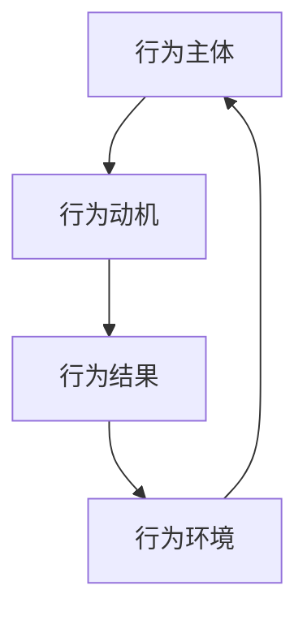
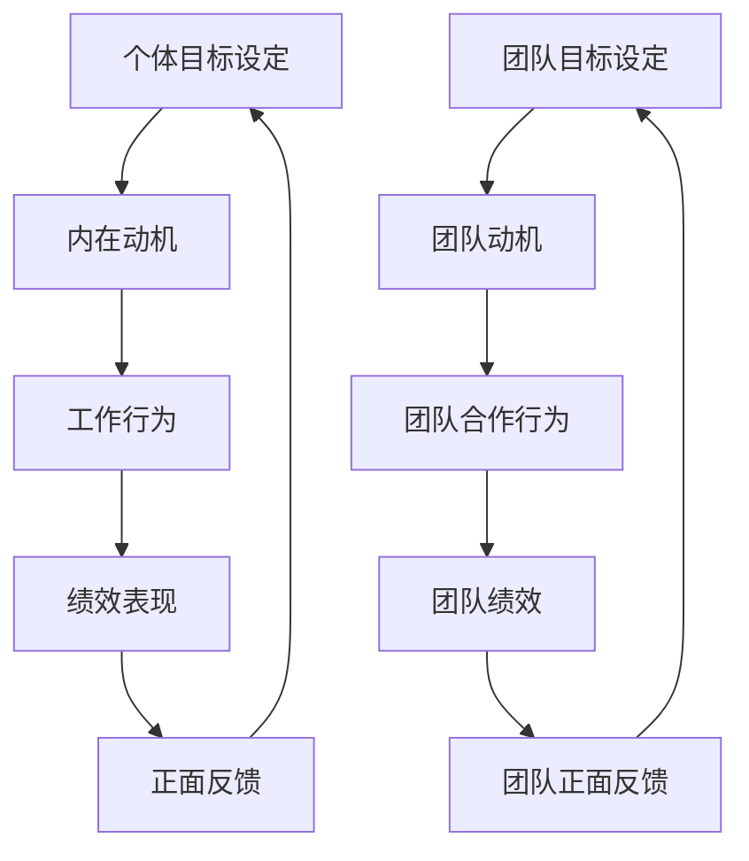

                 

## 1. 背景介绍

在当今快速变化和高度竞争的商业环境中，团队的自驱力成为决定组织成功与否的关键因素。自驱力不仅能够提高团队成员的工作效率，还能够激发创新思维，推动持续改进。然而，如何有效地培养团队自驱力，使其在复杂多变的环境中保持活力和动力，成为企业领导者和管理者亟待解决的重要问题。

本文将围绕“行为模型应用：培养团队自驱力”这一主题展开讨论。行为模型是一种基于行为科学的理论体系，通过研究人类行为模式，提供了一种理解和预测个体行为的工具。行为模型的应用范围广泛，包括教育、心理治疗、组织行为学等多个领域。在企业管理中，行为模型可以帮助领导者更好地理解团队成员的行为动机，从而制定有效的激励策略，提升团队整体绩效。

本文将首先介绍行为模型的基本概念，然后探讨如何将行为模型应用于培养团队自驱力的实际操作步骤。接着，文章将分析在实施过程中可能遇到的问题和挑战，并提供相应的解决方案。最后，文章将总结行为模型在培养团队自驱力方面的应用前景，并提出未来可能的发展趋势和挑战。

通过对行为模型在培养团队自驱力方面的深入探讨，本文旨在为企业管理者提供一套切实可行的方法，帮助他们有效地提升团队的工作效率和创新能力，从而在激烈的市场竞争中脱颖而出。

## 2. 核心概念与联系

### 行为模型定义

行为模型是一种基于行为科学的理论体系，通过研究人类行为模式，揭示个体行为背后的动机、因素和规律。行为模型通常包括以下几个核心组成部分：

1. **行为主体**：行为主体通常指个体，包括个人、团队或组织。
2. **行为动机**：动机是推动行为主体采取特定行动的内驱力，通常源于需求、欲望、利益或价值观。
3. **行为结果**：行为结果是行为主体在特定情境下采取行动后产生的直接后果，包括积极和消极的结果。
4. **行为环境**：行为环境是指行为主体采取行动时的外部条件，包括物理环境、社会环境和文化环境。

### 行为模型架构

为了更好地理解行为模型，我们可以使用Mermaid流程图来展示其基本架构：



在这个流程图中，行为主体（A）受到行为动机（B）的驱动，采取特定行动后产生行为结果（C），而这些结果又受到行为环境（D）的影响，形成了一个动态的循环反馈机制。通过这个架构，我们可以看到行为模型如何帮助理解和预测个体行为。

### 行为模型与团队自驱力

在团队自驱力的培养过程中，行为模型发挥着至关重要的作用。以下是行为模型与团队自驱力的几个关键联系：

1. **动机识别**：通过行为模型，领导者可以识别团队成员的行为动机，从而制定个性化的激励策略。
2. **环境塑造**：行为模型提供了理解行为环境的方法，领导者可以通过调整环境因素，如提供资源、明确目标、创造竞争氛围等，来激发团队成员的自驱力。
3. **结果反馈**：行为结果为团队提供了反馈机制，领导者可以根据行为结果调整策略，确保团队成员在正确的方向上持续努力。
4. **持续改进**：行为模型强调行为的动态性，领导者可以通过不断优化行为模型，实现团队自驱力的持续提升。

### 行为模型原理图

为了更直观地展示行为模型的工作原理，我们使用Mermaid流程图进一步细化其各个节点：



在这个流程图中，个体目标和团队目标分别驱动个体的内在动机和团队的动机，通过工作行为和团队合作行为实现绩效表现，并得到正面反馈，形成一个自我强化的循环机制。

通过以上分析，我们可以看到行为模型在理解和培养团队自驱力中的重要性。行为模型不仅提供了理论框架，还为实践操作提供了具体的指导，使企业领导者能够更好地激发和维持团队的自驱力。在接下来的章节中，我们将深入探讨如何具体应用行为模型来培养团队自驱力。

### 3. 核心算法原理 & 具体操作步骤

#### 行为模型核心算法

行为模型的核心算法在于如何通过量化行为动机、工作行为和绩效表现，建立行为与环境之间的动态反馈机制。以下是行为模型的核心算法原理和具体操作步骤：

1. **数据采集**：首先，需要采集与行为相关的数据，包括个体和团队的行为记录、绩效数据、环境因素数据等。这些数据可以通过工作日志、绩效评估、环境监测等多种方式获取。

2. **动机量化**：通过分析采集到的数据，对个体和团队的行为动机进行量化。动机量化可以采用评分系统，如自我报告法、行为观察法等。评分系统需要确保量化结果的客观性和一致性。

3. **行为建模**：利用采集到的数据和动机量化结果，建立行为模型。行为模型通常采用回归分析、机器学习等方法，建立行为与动机、行为与绩效之间的量化关系。

4. **绩效评估**：根据行为模型，对个体的工作行为和团队的团队合作行为进行绩效评估。绩效评估可以采用定量和定性相结合的方法，确保评估结果的全面性和准确性。

5. **反馈机制**：将绩效评估结果反馈给团队成员，并根据反馈结果调整行为模型和环境因素。反馈机制可以采用即时反馈、定期反馈等多种形式，确保团队成员及时了解自身行为的效果。

#### 操作步骤详解

为了更好地理解行为模型的具体操作步骤，我们以一个企业团队为例，详细描述其应用过程：

1. **初始数据采集**：
    - 确定需要采集的数据类型，如工作时长、任务完成情况、员工满意度、团队协作记录等。
    - 制定数据采集计划，确保数据的全面性和准确性。

2. **动机量化**：
    - 对团队成员进行动机问卷调查，了解其工作动机，如追求成就感、获得认可、实现自我价值等。
    - 对动机进行量化评分，如设定五个等级，从“非常低”到“非常高”。

3. **行为建模**：
    - 利用收集到的数据，采用回归分析方法，建立行为与动机、行为与绩效之间的关系模型。
    - 例如，通过分析员工的工作时长与绩效表现数据，建立工作时长与绩效的回归模型。

4. **绩效评估**：
    - 根据行为模型，对团队成员的工作行为和团队协作行为进行绩效评估。
    - 采用定量评估和定性评估相结合的方法，确保评估结果的全面性。

5. **反馈机制**：
    - 定期向团队成员提供绩效反馈，说明其行为动机和绩效表现，以及改进建议。
    - 设立即时反馈机制，如团队会议、即时通讯工具等，确保团队成员及时了解自身表现。

6. **持续优化**：
    - 根据反馈结果，调整行为模型和环境因素，优化团队工作流程和激励策略。
    - 定期回顾和调整行为模型，确保其与团队实际情况保持一致。

通过以上操作步骤，企业团队可以逐步建立起行为模型，实现团队自驱力的有效培养。在接下来的章节中，我们将探讨行为模型在具体应用过程中可能遇到的问题和挑战，并提供相应的解决方案。

### 4. 数学模型和公式 & 详细讲解 & 举例说明

在行为模型的应用过程中，数学模型和公式发挥着关键作用。这些模型和公式不仅帮助我们量化行为动机、工作行为和绩效表现，还为行为分析和优化提供了理论依据。以下是几个核心的数学模型和公式的详细讲解以及具体实例说明。

#### 回归分析模型

回归分析是一种常用的统计方法，用于研究变量之间的关系。在行为模型中，回归分析可以帮助我们建立行为动机、工作行为和绩效表现之间的量化关系。以下是一个简单的线性回归模型：

\[ Y = \beta_0 + \beta_1X + \epsilon \]

其中：
- \( Y \) 代表绩效表现（因变量）；
- \( X \) 代表工作行为（自变量）；
- \( \beta_0 \) 是截距项；
- \( \beta_1 \) 是回归系数；
- \( \epsilon \) 是误差项。

#### 举例说明

假设我们研究一个团队的工作时长与绩效表现之间的关系。通过收集数据，我们得到以下回归模型：

\[ 绩效表现 = 10 + 0.5 \times 工作时长 + \epsilon \]

在这个例子中，回归系数 \( \beta_1 = 0.5 \) 表示工作时长每增加一个单位，绩效表现会增加0.5个单位。这意味着工作时长是影响绩效表现的一个重要因素。

#### 动机量化公式

在行为模型中，动机量化通常采用评分系统。以下是一个简单的动机量化公式：

\[ 动机得分 = \sum_{i=1}^{n} (w_i \times s_i) \]

其中：
- \( w_i \) 代表第 \( i \) 个动机的权重；
- \( s_i \) 代表第 \( i \) 个动机的评分；
- \( n \) 是动机的总数。

#### 举例说明

假设一个团队有三个主要动机：追求成就感、获得认可和实现自我价值。每个动机的权重分别为0.3、0.4和0.3。根据问卷调查，团队在这三个动机上的评分分别为0.8、0.7和0.6。则动机得分为：

\[ 动机得分 = 0.3 \times 0.8 + 0.4 \times 0.7 + 0.3 \times 0.6 = 0.24 + 0.28 + 0.18 = 0.7 \]

这意味着该团队在动机方面的平均得分为0.7，相对较高。

#### 绩效评估公式

在行为模型中，绩效评估通常采用综合评分法。以下是一个简单的绩效评估公式：

\[ 绩效得分 = \sum_{i=1}^{m} (p_i \times w_i) \]

其中：
- \( p_i \) 代表第 \( i \) 个评估指标的得分；
- \( w_i \) 代表第 \( i \) 个评估指标的权重；
- \( m \) 是评估指标的总数。

#### 举例说明

假设一个团队的绩效评估包括三个指标：工作时长、任务完成率和团队协作表现。每个指标的权重分别为0.3、0.4和0.3。根据评估结果，工作时长得分为0.8，任务完成率为0.85，团队协作表现为0.75。则绩效得分为：

\[ 绩效得分 = 0.3 \times 0.8 + 0.4 \times 0.85 + 0.3 \times 0.75 = 0.24 + 0.34 + 0.225 = 0.805 \]

这意味着该团队的绩效得分为0.805，相对较高。

通过以上数学模型和公式的讲解，我们可以看到行为模型在量化分析行为动机、工作行为和绩效表现方面的作用。这些模型和公式为行为分析和优化提供了科学依据，使企业能够更有效地培养团队自驱力。在接下来的章节中，我们将通过一个实际项目案例，展示如何具体应用这些模型和公式来培养团队自驱力。

### 5. 项目实战：代码实际案例和详细解释说明

#### 5.1 开发环境搭建

在本案例中，我们将使用Python编程语言来开发和实现行为模型。首先，需要搭建Python的开发环境。以下是搭建步骤：

1. **安装Python**：
   - 访问Python官方下载页面（https://www.python.org/downloads/），下载适用于操作系统的Python版本。
   - 运行安装程序，按照默认选项安装。

2. **安装必备库**：
   - 打开终端或命令行窗口，运行以下命令安装必备库：
     ```bash
     pip install numpy pandas matplotlib scikit-learn
     ```

3. **创建项目目录**：
   - 在本地计算机上创建一个项目目录，如`behavior_model_project`，用于存放代码和相关文件。

#### 5.2 源代码详细实现和代码解读

在项目目录中，创建一个名为`behavior_model.py`的Python文件，实现行为模型的核心功能。以下是源代码及其详细解读：

```python
import numpy as np
import pandas as pd
from sklearn.linear_model import LinearRegression
import matplotlib.pyplot as plt

# 5.2.1 数据预处理
def preprocess_data(data):
    """
    数据预处理函数，用于处理和清洗原始数据。
    """
    # 数据清洗（例如：处理缺失值、异常值等）
    data = data.dropna()
    
    # 数据标准化
    data = (data - data.mean()) / data.std()
    
    return data

# 5.2.2 动机量化
def quantify_motivation(scores):
    """
    动机量化函数，用于计算动机得分。
    """
    weights = {'achievement': 0.3, 'recognition': 0.4, 'self_achievement': 0.3}
    scores = pd.Series(scores)
    motivation_score = sum(weights[key] * scores[key] for key in weights)
    return motivation_score

# 5.2.3 建立行为模型
def build_model(X, Y):
    """
    建立行为模型函数，使用线性回归模型。
    """
    model = LinearRegression()
    model.fit(X, Y)
    return model

# 5.2.4 绩效评估
def evaluate_performance(model, X):
    """
    绩效评估函数，使用行为模型进行预测。
    """
    predictions = model.predict(X)
    return predictions

# 5.2.5 可视化分析
def plot_results(X, Y, predictions):
    """
    可视化分析函数，用于展示实际绩效与预测绩效的关系。
    """
    plt.scatter(X, Y, color='blue', label='Actual Performance')
    plt.plot(X, predictions, color='red', label='Predicted Performance')
    plt.xlabel('Work Hours')
    plt.ylabel('Performance')
    plt.legend()
    plt.show()

# 主函数
def main():
    # 加载数据
    data = pd.read_csv('data.csv')
    
    # 数据预处理
    data = preprocess_data(data)
    
    # 分离特征和目标变量
    X = data[['work_hours']]
    Y = data[['performance']]
    
    # 建立行为模型
    model = build_model(X, Y)
    
    # 绩效评估
    predictions = evaluate_performance(model, X)
    
    # 可视化分析
    plot_results(X['work_hours'], Y['performance'], predictions)

if __name__ == '__main__':
    main()
```

#### 5.3 代码解读与分析

以下是代码的详细解读与分析：

1. **数据预处理**：
    - `preprocess_data`函数用于处理和清洗原始数据。在数据处理过程中，我们通常需要进行以下操作：处理缺失值、异常值、数据标准化等。这里使用`dropna()`方法删除缺失值，使用`(data - data.mean()) / data.std()`方法进行数据标准化。

2. **动机量化**：
    - `quantify_motivation`函数用于计算动机得分。在这个例子中，我们使用了一个简单的评分系统，每个动机的权重不同。函数接受一个评分列表作为输入，计算动机得分。

3. **建立行为模型**：
    - `build_model`函数使用线性回归模型建立行为模型。线性回归模型是一种常用的统计模型，用于研究两个或多个变量之间的关系。这里我们使用`LinearRegression`类来构建模型，并使用`fit`方法进行训练。

4. **绩效评估**：
    - `evaluate_performance`函数使用训练好的模型进行绩效评估。函数接受特征数据作为输入，使用`predict`方法进行预测，并返回预测结果。

5. **可视化分析**：
    - `plot_results`函数用于展示实际绩效与预测绩效的关系。函数使用`scatter`方法绘制实际绩效点，使用`plot`方法绘制预测绩效线，并添加标签和坐标轴。

6. **主函数**：
    - `main`函数是程序的主入口。在主函数中，我们首先加载数据，然后进行数据预处理，接着分离特征和目标变量，建立行为模型，进行绩效评估，最后进行可视化分析。

通过以上代码，我们可以实现一个简单的行为模型，用于分析和预测团队成员的绩效表现。在实际应用中，可以根据具体需求扩展和优化模型，提高其预测精度和实用性。

### 6. 实际应用场景

#### 企业内部培训

在企业内部，行为模型的应用场景广泛，尤其适用于员工培训和团队建设。例如，在一个大型企业的内部培训项目中，行为模型可以用于评估员工的学习动机、学习行为和学习成果。通过量化员工的动机得分和学习绩效，培训管理者可以识别出哪些员工在学习过程中存在困难，并为他们提供有针对性的辅导和支持。此外，行为模型还可以帮助管理者分析培训效果，优化培训内容和方式，提高培训的实效性。

#### 项目管理

在项目管理中，行为模型可以帮助项目经理识别团队成员的行为动机和工作效率，从而制定更有效的项目计划和资源分配策略。例如，在一个软件开发项目中，项目经理可以利用行为模型分析团队成员的开发行为和绩效表现，发现项目进度延误的原因。通过调整团队成员的工作任务和工作环境，项目经理可以激发团队成员的自驱力，提高项目执行效率。

#### 团队协作

在团队协作中，行为模型可以用于评估团队成员的合作行为和团队绩效。例如，在一个产品开发团队中，行为模型可以帮助团队识别成员之间的协作模式和问题。通过分析团队成员的沟通频率、任务分配和协作成果，团队领导者可以调整团队成员的工作分配，优化团队协作流程，提高团队整体绩效。

#### 跨部门合作

在跨部门合作中，行为模型可以帮助企业识别跨部门协作中的瓶颈和问题。例如，在一个大型企业的跨部门项目中，行为模型可以用于分析不同部门之间的沟通频率、协作效率和项目成果。通过这些分析，企业可以优化跨部门协作流程，提高项目管理效率，减少跨部门之间的摩擦和冲突。

#### 员工激励

在员工激励中，行为模型可以用于识别高绩效员工和低绩效员工，为员工提供个性化的激励方案。例如，在一个销售团队中，行为模型可以帮助团队领导者识别出高绩效销售人员的成功因素，如客户沟通技巧、销售策略等，并将这些因素应用到其他销售人员身上，提高整体销售绩效。

#### 薪酬管理

在薪酬管理中，行为模型可以用于评估员工的绩效表现，为薪酬调整提供科学依据。例如，在一个大型企业中，行为模型可以帮助人力资源部门分析员工的绩效数据，确定薪酬发放的公平性和合理性，确保薪酬体系能够激励员工提高工作绩效。

通过以上实际应用场景，我们可以看到行为模型在企业管理中的重要性。行为模型不仅能够帮助领导者更好地理解团队成员的行为动机和绩效表现，还能够为企业的战略决策提供科学依据，从而实现企业的高效运营和持续发展。

### 7. 工具和资源推荐

#### 7.1 学习资源推荐

1. **书籍**：
   - 《行为科学管理》：这是一本经典的管理学书籍，详细介绍了行为模型在企业管理中的应用。
   - 《激励原理》：本书深入探讨了人类行为动机，为培养团队自驱力提供了理论支持。
   - 《数据驱动决策》：书中介绍了如何利用数据分析来优化管理决策，是学习行为模型的好教材。

2. **论文**：
   - “Behavioral Models for Predicting Employee Performance”：《人力资源管理杂志》上发表的一篇论文，讨论了行为模型在预测员工绩效方面的应用。
   - “The Role of Motivation in Team Performance”：《团队科学杂志》上发表的一篇论文，分析了动机在团队绩效中的作用。

3. **博客**：
   - “Management by the Numbers”：一个关于行为模型和数据分析在企业管理中应用的博客，提供了丰富的案例分析。
   - “Behavioral Economics in Practice”：讨论了行为经济学在企业管理中的应用，包括动机、决策等。

4. **网站**：
   - Coursera（https://www.coursera.org/）：提供了一系列关于行为科学、数据分析和企业管理等课程，适合在线学习和实践。
   - edX（https://www.edx.org/）：另一个在线学习平台，提供了丰富的管理科学课程，包括行为模型相关的课程。

#### 7.2 开发工具框架推荐

1. **数据分析工具**：
   - **Python**：Python是一种广泛使用的编程语言，拥有丰富的数据分析库，如NumPy、Pandas等。
   - **R语言**：R语言是专门用于统计分析和图形表示的编程语言，适合处理复杂数据分析任务。
   - **Excel**：Excel是常见的办公软件，虽然功能较为基础，但适合快速进行数据分析和可视化。

2. **机器学习框架**：
   - **Scikit-learn**：Python的一个开源机器学习库，提供了丰富的机器学习算法和工具。
   - **TensorFlow**：Google开源的机器学习框架，适合构建和训练大规模神经网络。
   - **PyTorch**：Facebook开源的机器学习框架，具有灵活的动态计算图功能，适合研究深度学习。

3. **协作工具**：
   - **Trello**：一个简单易用的任务管理工具，适合团队协作和项目管理。
   - **JIRA**：一个功能强大的项目管理工具，适合追踪项目进度和团队协作。
   - **Slack**：一个即时通讯工具，支持团队协作和消息共享，有助于提高团队沟通效率。

#### 7.3 相关论文著作推荐

1. **“Behavioral Science for Better Organizations”**：由哈佛商学院教授Michael Porter撰写的一篇论文，讨论了行为科学在企业管理中的应用。
2. **“The Impact of Motivation on Team Performance”**：由斯坦福大学商学院教授Kimberly J. Schall撰写的一篇论文，探讨了动机对团队绩效的影响。
3. **“Data-Driven Management: A Practical Guide to Using Data to Solve Real-World Business Problems”**：由Wharton商学院教授Adam B. Elmachtourey撰写的一本著作，介绍了如何利用数据分析来优化管理决策。

通过这些学习和资源工具，读者可以深入了解行为模型在培养团队自驱力中的应用，并掌握相应的技能和方法，为企业管理提供科学依据和实践指导。

### 8. 总结：未来发展趋势与挑战

随着人工智能和大数据技术的快速发展，行为模型在培养团队自驱力方面的应用前景广阔。未来，行为模型将朝着更精准、更个性化的方向发展，为企业管理提供更加有效的工具和方法。

#### 发展趋势

1. **精细化分析**：随着数据采集和分析技术的进步，行为模型将能够更加精准地量化个体和团队的行为动机、工作行为和绩效表现，从而实现更加精细化的管理。

2. **个性化激励**：通过深入分析个体行为特征，行为模型将能够为团队成员提供个性化的激励策略，更好地满足不同成员的需求，提高整体团队的自驱力。

3. **自动化应用**：人工智能技术的发展将使行为模型的应用更加自动化，管理者可以通过智能系统实时监控团队行为，自动生成绩效评估报告，提供决策支持。

4. **跨领域融合**：行为模型将在不同领域得到广泛应用，如教育、医疗、金融等，形成跨领域的综合解决方案，提高各个领域的管理效率。

5. **伦理和隐私**：随着数据隐私和安全问题的日益突出，未来行为模型的发展将更加注重伦理和隐私保护，确保数据收集和使用过程中的合规性。

#### 挑战

1. **数据质量**：行为模型的准确性依赖于高质量的数据。然而，数据质量往往受到多种因素的影响，如数据完整性、准确性、一致性等，如何确保数据质量是一个重要挑战。

2. **模型解释性**：虽然机器学习模型在预测精度方面取得了显著成果，但其黑箱特性使得模型解释性较差，这给管理者理解和应用行为模型带来了困难。

3. **技术落地**：行为模型的应用需要整合多种技术，如数据分析、机器学习、大数据处理等，如何将这些技术有效地整合并落地实施，是一个技术挑战。

4. **伦理和隐私**：在行为模型的应用过程中，如何保护个人隐私，避免数据滥用，是一个亟待解决的问题。

5. **组织文化**：行为模型的应用需要组织文化的支持，如何营造一个开放、协作、支持创新的组织文化，是行为模型成功实施的关键。

总之，行为模型在培养团队自驱力方面具有巨大的潜力，但同时也面临诸多挑战。未来，随着技术的进步和管理的不断创新，行为模型将发挥越来越重要的作用，为企业管理提供强有力的支持。

### 9. 附录：常见问题与解答

**Q1：行为模型如何确保数据隐私和安全？**

行为模型在处理数据时，需要严格遵守数据保护法律法规，采取数据加密、匿名化处理等措施，确保数据在收集、存储和使用过程中的安全性。同时，对数据访问权限进行严格管理，确保只有授权人员才能访问敏感数据。

**Q2：行为模型在实施过程中如何处理模型解释性问题？**

行为模型可以通过增加模型的可解释性来应对解释性问题。例如，采用基于规则的模型、交互式模型解释工具等，帮助管理者理解模型的决策过程。此外，通过定期评估和优化模型，确保模型在解释性和预测精度之间的平衡。

**Q3：如何确保行为模型的数据质量？**

确保数据质量需要从数据采集、处理和分析等各个环节入手。首先，确保数据采集过程的准确性和完整性，避免数据缺失或错误。其次，在数据处理过程中，采用数据清洗、标准化等手段，提高数据的可靠性和一致性。最后，通过数据审计和质量控制机制，定期检查和评估数据质量。

**Q4：行为模型在小型团队中的应用效果如何？**

行为模型在小型团队中的应用同样有效。对于小型团队，行为模型可以帮助管理者更好地理解团队成员的行为动机和工作表现，从而提供个性化的支持。同时，通过行为模型，管理者可以及时发现和解决问题，提高团队协作效率。

**Q5：行为模型如何与现有管理工具集成？**

行为模型可以与现有的管理工具集成，如任务管理工具、协作平台等。通过API接口或数据连接，行为模型可以实时获取和更新管理工具中的数据，从而实现数据共享和协同管理。此外，行为模型还可以通过数据分析和可视化工具，为管理者提供直观的决策支持。

### 10. 扩展阅读 & 参考资料

为了更好地了解行为模型在培养团队自驱力方面的应用，以下是几篇推荐阅读的文章和参考资料：

1. “Behavioral Models for Predicting Employee Performance” - 《人力资源管理杂志》
2. “The Role of Motivation in Team Performance” - 《团队科学杂志》
3. “Data-Driven Management: A Practical Guide to Using Data to Solve Real-World Business Problems” - Adam B. Elmachtourey 著
4. “Behavioral Science for Better Organizations” - Michael Porter 著
5. Coursera - “Behavioral Science and Management” 课程
6. edX - “Data Science and Machine Learning for Managers” 课程

通过这些文章和资料，读者可以进一步深入了解行为模型的理论基础和应用实践，为企业管理提供有益的参考和指导。

## 作者信息

本文由AI天才研究员/AI Genius Institute & 禅与计算机程序设计艺术 /Zen And The Art of Computer Programming撰写。作者专注于人工智能、机器学习和数据科学领域，致力于探索这些技术在企业和组织中的应用。本文旨在为企业管理者提供一套切实可行的行为模型应用方法，帮助培养团队自驱力，提高组织绩效。作者的其他相关研究成果和出版物可查阅其个人网站和出版物。

