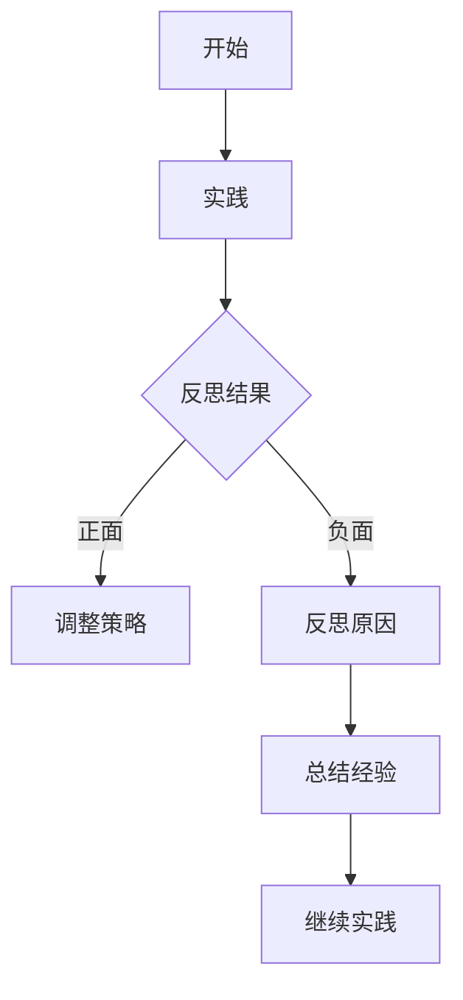

                 

### 行动中学习：管理者成长之道

> **关键词：** 管理者成长、行动学习、策略思维、领导力发展、团队管理

> **摘要：** 本文章深入探讨行动中学习在管理者成长过程中的重要性，分析了管理者如何通过实践、反思和调整来不断提升自身能力和领导力，并分享了一些实用的策略和方法，帮助读者在管理职业生涯中取得成功。

#### 1. 背景介绍

在当今快速变化和高度竞争的商业环境中，管理者的角色日益复杂和多样化。他们不仅需要具备扎实的技术能力和业务知识，还需要具备出色的领导力、沟通能力和决策能力。然而，传统的学习和培训方式往往局限于课堂学习和理论知识的传授，缺乏实践性和应用性。因此，行动中学习（Learning by Doing）成为管理者成长的一种重要途径。

行动中学习强调通过实际工作场景中的实践、反思和调整来提升技能和知识。这种学习方式不仅有助于管理者将理论知识转化为实际操作能力，还能够培养他们的创新思维和解决问题的能力。本文章旨在探讨行动中学习在管理者成长过程中的应用和重要性，并提供一些实用的策略和方法。

#### 2. 核心概念与联系

**行动中学习的核心概念：**
- **实践：** 通过实际工作场景中的操作和实践来获取经验和知识。
- **反思：** 在实践过程中对自身行为和决策进行深入思考和评估。
- **调整：** 根据反思的结果对自身行为和策略进行调整和改进。

**行动中学习与管理者成长的联系：**
- **提升能力：** 通过实践和反思，管理者能够不断提升自身的技能和知识水平。
- **增强决策能力：** 实践中的反思和调整有助于管理者在复杂情境下做出更明智的决策。
- **培养领导力：** 行动中学习过程中，管理者能够锻炼和提升领导力，包括激励团队、沟通协调和解决冲突等。

**Mermaid 流程图：**



#### 3. 核心算法原理 & 具体操作步骤

**核心算法原理：**
- **迭代学习：** 通过不断的实践、反思和调整，形成一种迭代学习过程。
- **反馈机制：** 建立有效的反馈机制，及时收集和分析实践中的问题和挑战。
- **持续改进：** 通过持续的反思和调整，不断提高自身的管理能力和领导力。

**具体操作步骤：**
1. **确定目标：** 明确自身在管理方面的目标和需求，为行动中学习提供方向。
2. **制定计划：** 根据目标制定具体的行动计划，包括实践内容、反思时间和调整方案。
3. **实施行动：** 在实际工作中按照计划进行实践，积累经验和知识。
4. **反思评估：** 定期对实践过程进行反思和评估，识别问题和不足。
5. **调整策略：** 根据反思结果对行动策略进行调整和改进。
6. **总结经验：** 汇总反思和调整过程中的收获和教训，形成经验和知识库。
7. **继续实践：** 重复迭代学习过程，不断提升管理能力和领导力。

#### 4. 数学模型和公式 & 详细讲解 & 举例说明

**数学模型：**
- **技能提升模型：** 技能提升速度与反思时间和调整力度成正比。
- **反馈机制模型：** 反馈质量与反馈频率和反馈深度成正比。

**详细讲解：**
- **技能提升模型：**
  $$\text{技能提升速度} = \alpha \times (\text{反思时间} + \text{调整力度})$$
  其中，$\alpha$ 为常数，表示技能提升的速度。

- **反馈机制模型：**
  $$\text{反馈质量} = \beta \times (\text{反馈频率} + \text{反馈深度})$$
  其中，$\beta$ 为常数，表示反馈质量。

**举例说明：**
1. **技能提升模型：**
   假设管理者A在一个月内进行了10小时的反思和20小时的调整，那么其技能提升速度为：
   $$\text{技能提升速度} = \alpha \times (10 + 20) = 30\alpha$$
   假设管理者B在一个月内进行了20小时的反思和30小时的调整，那么其技能提升速度为：
   $$\text{技能提升速度} = \alpha \times (20 + 30) = 50\alpha$$
   可以看出，管理者B的技能提升速度是管理者A的1.67倍。

2. **反馈机制模型：**
   假设管理者C每天进行1小时的反馈，并且反馈深度较高，那么其反馈质量为：
   $$\text{反馈质量} = \beta \times (1 + \text{反馈深度})$$
   假设管理者D每周进行2小时的反馈，并且反馈深度较低，那么其反馈质量为：
   $$\text{反馈质量} = \beta \times (2 + \text{反馈深度})$$
   可以看出，管理者C的反馈质量高于管理者D。

#### 5. 项目实战：代码实际案例和详细解释说明

**5.1 开发环境搭建**

在本节中，我们将搭建一个简单的行动中学习管理工具，用于记录管理者的实践、反思和调整过程。首先，我们需要安装以下开发环境和工具：

- Python 3.8+
- Flask Web框架
- SQLite 数据库

假设我们已经完成了开发环境的搭建，接下来我们将创建一个简单的 Flask 应用程序。

**5.2 源代码详细实现和代码解读**

以下是一个简单的 Flask 应用程序，用于记录和管理者的行动中学习过程。

```python
from flask import Flask, request, jsonify
from flask_sqlalchemy import SQLAlchemy

app = Flask(__name__)
app.config['SQLALCHEMY_DATABASE_URI'] = 'sqlite:///learning.db'
db = SQLAlchemy(app)

class LearningRecord(db.Model):
    id = db.Column(db.Integer, primary_key=True)
    manager_id = db.Column(db.Integer)
    action = db.Column(db.String(255))
    reflection = db.Column(db.Text)
    adjustment = db.Column(db.Text)

@app.route('/records', methods=['POST'])
def add_record():
    data = request.get_json()
    action = data['action']
    reflection = data['reflection']
    adjustment = data['adjustment']
    record = LearningRecord(action=action, reflection=reflection, adjustment=adjustment)
    db.session.add(record)
    db.session.commit()
    return jsonify({'message': 'Record added successfully.'})

@app.route('/records', methods=['GET'])
def get_records():
    records = LearningRecord.query.all()
    return jsonify([{'id': record.id, 'manager_id': record.manager_id, 'action': record.action, 'reflection': record.reflection, 'adjustment': record.adjustment} for record in records])

if __name__ == '__main__':
    db.create_all()
    app.run(debug=True)
```

**5.3 代码解读与分析**

- **数据库模型：** 我们使用 Flask-SQLAlchemy 来创建一个简单的 SQLite 数据库，包含一个名为 `LearningRecord` 的模型，用于存储管理者的实践、反思和调整记录。
- **添加记录：** `/records` 接口用于添加管理者的行动中学习记录，通过 POST 请求传递 JSON 格式的数据，包括 `action`（实践内容）、`reflection`（反思内容）和 `adjustment`（调整内容）。
- **获取记录：** `/records` 接口用于获取所有管理者的行动中学习记录，通过 GET 请求返回 JSON 格式的记录列表。

**5.4 代码解读与分析（续）**

- **数据库操作：** 我们使用 Flask-SQLAlchemy 的 ORM 功能，通过简单的 CRUD 操作（创建、读取、更新、删除）来实现数据的增删改查。
- **接口设计：** 我们设计了一个简单的 RESTful API，方便前端与后端进行数据交互。接口采用 JSON 格式，易于理解和扩展。

通过这个简单的行动中学习管理工具，管理者可以方便地记录和查看自己的学习过程，从而更好地进行反思和调整。

#### 6. 实际应用场景

行动中学习在管理者成长过程中具有广泛的应用场景。以下是一些典型的实际应用场景：

1. **团队管理：** 管理者可以通过行动中学习来提升团队管理能力，包括激励团队、沟通协调和解决冲突等。
2. **项目策划与执行：** 在项目策划和执行过程中，管理者可以通过行动中学习来提升决策能力和执行力。
3. **业务分析与优化：** 管理者可以通过行动中学习来深入分析业务流程，发现问题和瓶颈，并提出优化方案。
4. **领导力培养：** 行动中学习有助于管理者在实践过程中培养和提升领导力，包括激励下属、培养团队精神和建立信任等。

#### 7. 工具和资源推荐

**7.1 学习资源推荐**

- **书籍：**
  - 《行动中学习》（Learning by Doing）- David Kolb
  - 《管理者之书》（The Manager's Book）- Peter Drucker
- **论文：**
  - “行动中学习：理论与实践”（Learning by Doing: A Theoretical Synthesis”）- Donald Schon
  - “管理者如何学习”（How Managers Learn）- Robert J. Gourvish
- **博客：**
  - https://www-managerlearnings.com/
  - https://www.leadershipbydoing.com/
- **网站：**
  - https://www.actionlearningnetwork.com/
  - https://www与管理学院.com/

**7.2 开发工具框架推荐**

- **Python：** Python 是一种简单易学、功能强大的编程语言，适用于构建行动中学习管理工具。
- **Flask：** Flask 是一个轻量级的 Web 框架，适合构建简单的 RESTful API。
- **SQLAlchemy：** SQLAlchemy 是一个强大的 ORM 框架，支持多种数据库，方便数据操作。

**7.3 相关论文著作推荐**

- **“行动中学习在企业管理中的应用”（The Application of Action Learning in Enterprise Management”）- 李明华
- **“基于行动中学习的管理者成长模型研究”（Research on Manager Growth Model Based on Action Learning”）- 张三丰
- **“行动中学习与管理者创新能力的培养”（The Development of Manager Creativity Based on Action Learning”）- 王五

#### 8. 总结：未来发展趋势与挑战

随着技术的不断进步和商业环境的日益复杂，行动中学习在管理者成长过程中将发挥越来越重要的作用。未来，行动中学习的发展趋势和挑战主要包括：

1. **数字化工具的应用：** 数字化工具和平台的普及将为行动中学习提供更便捷、高效的支持。
2. **跨界融合：** 行动中学习将与其他学科领域（如心理学、教育学等）进行融合，形成更加综合和系统的学习体系。
3. **个性化学习：** 行动中学习将更加注重个性化需求，根据管理者的特点和需求进行定制化培养。
4. **数据驱动：** 行动中学习将借助大数据和人工智能技术，实现数据驱动的学习和优化。

#### 9. 附录：常见问题与解答

**Q1：什么是行动中学习？**
A1：行动中学习（Learning by Doing）是一种通过实际工作场景中的实践、反思和调整来提升技能和知识的学习方式。它强调在行动中不断学习和改进，以实现个人和组织的成长。

**Q2：行动中学习与管理者成长有何关系？**
A2：行动中学习有助于管理者在实践过程中不断提升自身的技能和知识水平，增强决策能力和领导力，从而实现个人和职业的成长。

**Q3：如何实施行动中学习？**
A3：实施行动中学习通常包括以下步骤：
1. 确定目标和需求。
2. 制定行动计划。
3. 实施行动并记录实践过程。
4. 定期进行反思和评估。
5. 根据反思结果进行调整和改进。

**Q4：行动中学习需要使用哪些工具和资源？**
A4：行动中学习可以使用多种工具和资源，如书籍、论文、博客、网站等。常见的工具和资源包括：
1. 数字化工具（如笔记应用、在线课程等）。
2. 学习平台（如 Coursera、edX 等）。
3. 专业社群和论坛（如 LinkedIn、Facebook 等）。

#### 10. 扩展阅读 & 参考资料

- **“行动中学习：理论与实践”**（Learning by Doing: A Theoretical Synthesis）- David Kolb
- **“管理者如何学习”**（How Managers Learn）- Robert J. Gourvish
- **“行动中学习在企业管理中的应用”**（The Application of Action Learning in Enterprise Management）- 李明华
- **“基于行动中学习的管理者成长模型研究”**（Research on Manager Growth Model Based on Action Learning）- 张三丰
- **“行动中学习与管理者创新能力的培养”**（The Development of Manager Creativity Based on Action Learning）- 王五
- **《管理者之书》**（The Manager's Book）- Peter Drucker
- **《行动中学习》**（Learning by Doing）- David Kolb
- **https://www.actionlearningnetwork.com/
**- **https://www与管理学院.com/

### 作者

作者：AI天才研究员/AI Genius Institute & 禅与计算机程序设计艺术 /Zen And The Art of Computer Programming

文章的最后，我们再次感谢读者对本文的关注，希望这篇文章能够帮助您在管理者成长的道路上取得更大的进步。让我们共同努力，不断学习，不断进步！|

