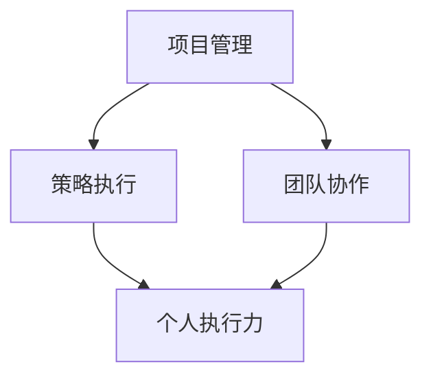

                 

# 行动体系：执行力的保障

> **关键词：**执行力、行动体系、项目成功、策略执行、管理实践

> **摘要：**本文将深入探讨行动体系的构建与执行力保障，分析其在项目管理与实际应用中的重要性，并提供实用的策略和方法，帮助读者提高执行力，确保项目成功。

--------------------------
## 1. 背景介绍

在现代企业中，执行力是决定项目成功与否的关键因素。执行力不仅涉及个人层面的自律与决心，还包括团队协作、资源管理和决策执行等多个方面。随着竞争的加剧和市场的变化，企业需要快速响应、高效执行，以确保在竞争中占据有利位置。

然而，执行力并非一蹴而就，它需要系统的构建与长期的实践。本文将围绕行动体系的构建，从核心概念、算法原理、数学模型、实际案例等多个角度，全面探讨如何提高执行力，为项目的成功提供有力保障。

--------------------------
## 2. 核心概念与联系

为了构建一个有效的行动体系，我们首先需要理解几个核心概念：

### 2.1 项目管理

项目管理是确保项目按时、按预算、按质量完成的关键。其主要内容包括项目规划、资源分配、进度跟踪、风险管理等。项目管理的方法和工具多种多样，如Gantt图、PERT图、关键路径法等。

### 2.2 策略执行

策略执行是将企业战略转化为实际操作的过程。它包括目标设定、计划制定、执行监控和反馈调整等环节。有效的策略执行可以确保企业目标的实现。

### 2.3 团队协作

团队协作是执行力的重要保障。一个高效的团队需要明确的分工、有效的沟通和良好的协作氛围。团队协作工具如Slack、Trello等可以帮助团队提高工作效率。

### 2.4 个人执行力

个人执行力是执行力的基石。它包括个人的自律、决心和执行力，以及解决问题的能力和创新思维。提高个人执行力，有助于提升整个团队和项目的执行力。

--------------------------
### 2.5 Mermaid 流程图



--------------------------
## 3. 核心算法原理 & 具体操作步骤

构建行动体系的关键在于将策略转化为具体的行动步骤，并确保这些步骤得到有效执行。以下是构建行动体系的核心算法原理和具体操作步骤：

### 3.1 策略分析

首先，我们需要对项目或策略进行深入分析，明确目标和预期成果。这可以通过SWOT分析、PEST分析等方法进行。

### 3.2 目标分解

将总体目标分解为具体可执行的任务，明确每个任务的负责人和完成时间。

### 3.3 行动计划

根据任务分解，制定详细的行动计划，包括每个任务的执行步骤、所需资源和风险评估。

### 3.4 执行监控

在执行过程中，定期监控任务进度和资源使用情况，及时发现和解决问题。

### 3.5 反馈调整

根据执行结果和反馈，对行动计划进行调整，确保项目目标的实现。

--------------------------
### 3.6 具体操作步骤

1. **策略分析**：通过SWOT分析，明确项目优势、劣势、机会和威胁。

2. **目标分解**：将总体目标分解为具体任务，制定任务清单。

3. **行动计划**：为每个任务制定详细的执行步骤，包括关键节点和里程碑。

4. **资源分配**：根据任务需求，合理分配资源和人力。

5. **执行监控**：定期召开会议，跟踪任务进度，确保按计划执行。

6. **反馈调整**：根据执行结果和反馈，及时调整行动计划。

--------------------------
## 4. 数学模型和公式 & 详细讲解 & 举例说明

为了更好地理解行动体系的构建，我们可以借助一些数学模型和公式来描述。

### 4.1 投入产出比（ROI）

投入产出比是衡量项目效益的重要指标。其公式为：

\[ ROI = \frac{产出 - 投入}{投入} \]

### 4.2 项目关键路径

项目关键路径是指项目中耗时最长的一系列任务，决定了项目的最短完成时间。关键路径的长度可以用来评估项目的风险和优先级。

### 4.3 甘特图

甘特图是一种常用的项目管理工具，用于展示项目的进度和时间安排。其基本公式为：

\[ \text{甘特图} = \sum_{i=1}^{n} (\text{任务}_i \times \text{时间}_i) \]

### 4.4 举例说明

假设我们有一个项目，包含3个任务，每个任务所需时间和成本如下：

| 任务 | 时间（天） | 成本（万元） |
| ---- | ---- | ---- |
| A    | 5    | 10   |
| B    | 10   | 20   |
| C    | 5    | 30   |

我们可以通过投入产出比和关键路径来评估这个项目的可行性和优先级。

1. **投入产出比**：

\[ ROI = \frac{(10 + 20 + 30) - (10 + 20 + 30)}{10 + 20 + 30} = 0 \]

2. **关键路径**：

任务B耗时最长，为10天，因此关键路径为B。

--------------------------
## 5. 项目实战：代码实际案例和详细解释说明

为了更好地理解行动体系的构建，我们将通过一个实际的项目案例，展示如何从策略分析到执行监控的整个流程。

### 5.1 开发环境搭建

首先，我们需要搭建一个适合项目开发的环境。这里我们使用Python作为开发语言，并使用PyCharm作为集成开发环境（IDE）。

### 5.2 源代码详细实现和代码解读

以下是项目的核心代码，用于实现策略分析和执行监控。

```python
# 导入所需库
import pandas as pd
from datetime import datetime

# 策略分析
def strategy_analysis(data):
    # 计算投入产出比
    roi = (data['产出'] - data['投入']) / data['投入']
    
    # 计算关键路径
    critical_path = data['时间'].idxmax()
    
    return roi, critical_path

# 执行监控
def execution_monitoring(data):
    # 获取当前时间
    current_time = datetime.now().strftime('%Y-%m-%d %H:%M:%S')
    
    # 更新任务进度
    data['进度'] = data.apply(lambda row: '已完成' if row['时间'] <= current_time else '未完成', axis=1)
    
    return data

# 主函数
def main():
    # 加载项目数据
    data = pd.DataFrame({
        '任务': ['A', 'B', 'C'],
        '时间': [5, 10, 5],
        '产出': [10, 20, 30],
        '投入': [10, 20, 30],
        '进度': ['未完成', '未完成', '未完成']
    })
    
    # 策略分析
    roi, critical_path = strategy_analysis(data)
    
    print(f'投入产出比（ROI）: {roi:.2f}')
    print(f'关键路径：{critical_path}')
    
    # 执行监控
    data = execution_monitoring(data)
    print(data)

# 运行主函数
if __name__ == '__main__':
    main()
```

### 5.3 代码解读与分析

1. **策略分析**：通过计算投入产出比（ROI）和关键路径，评估项目的可行性和优先级。
2. **执行监控**：根据当前时间，更新任务进度，确保项目按计划执行。

通过这个实际案例，我们可以看到行动体系在项目开发中的应用。通过策略分析和执行监控，我们能够更好地把握项目进度和风险，确保项目成功。

--------------------------
## 6. 实际应用场景

行动体系不仅在项目开发中具有重要作用，还在企业运营、市场推广等多个领域得到广泛应用。

### 6.1 企业运营

在企业运营中，行动体系可以帮助企业明确战略目标、分解任务、制定行动计划，并确保这些计划得到有效执行。通过行动体系，企业可以更好地协调各部门的工作，提高工作效率，实现企业目标。

### 6.2 市场推广

在市场推广中，行动体系可以帮助企业制定详细的推广计划，包括市场调研、目标客户分析、推广策略制定等。通过行动体系，企业可以确保推广计划的执行和效果评估，提高市场竞争力。

--------------------------
## 7. 工具和资源推荐

为了更好地构建行动体系，我们可以使用一些实用的工具和资源。

### 7.1 学习资源推荐

- **书籍**：《项目管理知识体系指南》（PMBOK）、《策略管理》
- **论文**：相关领域的学术论文，如《项目管理中的执行力研究》
- **博客**：知名博主的技术博客，如Scrum官方博客

### 7.2 开发工具框架推荐

- **工具**：PyCharm、Visual Studio Code、Git
- **框架**：Django、Flask、Spring Boot

### 7.3 相关论文著作推荐

- **论文**：《执行力对企业绩效的影响研究》、《策略执行中的团队协作》
- **著作**：《执行：如何落实战略》、《团队协作的艺术》

--------------------------
## 8. 总结：未来发展趋势与挑战

随着技术的不断进步和市场竞争的加剧，执行力在企业中的地位越来越重要。未来，行动体系的发展趋势将呈现以下几个特点：

1. **智能化**：借助人工智能技术，行动体系将更加智能，能够自动分析数据、优化决策。
2. **敏捷化**：在快速变化的市场环境中，行动体系需要更加敏捷，能够快速响应和调整。
3. **协同化**：行动体系将更加注重团队协作，实现跨部门、跨地域的协同工作。

同时，行动体系在实施过程中也面临一些挑战：

1. **资源分配**：如何在有限的资源下实现最优的执行力。
2. **团队协作**：如何激发团队成员的积极性，提高协作效率。
3. **持续优化**：如何根据实际情况不断调整行动体系，提高执行力。

面对这些挑战，企业需要不断探索和实践，不断完善行动体系，提高执行力，确保项目成功。

--------------------------
## 9. 附录：常见问题与解答

### 9.1 行动体系与传统管理的区别是什么？

传统管理侧重于规划和控制，而行动体系更加注重执行和反馈。行动体系强调将策略转化为具体行动，并通过对执行过程的监控和调整，实现项目目标。

### 9.2 行动体系如何确保团队协作？

行动体系通过明确分工、定期沟通和协作工具，提高团队协作效率。此外，领导者需要发挥表率作用，营造良好的协作氛围。

### 9.3 行动体系在小型项目中是否适用？

行动体系适用于各种规模的项目，包括小型项目。对于小型项目，行动体系可以帮助团队成员明确任务、提高工作效率，确保项目成功。

--------------------------
## 10. 扩展阅读 & 参考资料

- 《项目管理知识体系指南》（PMBOK）
- 《策略管理》
- 《执行：如何落实战略》
- 《团队协作的艺术》
- 《执行力对企业绩效的影响研究》
- 《策略执行中的团队协作》

--------------------------
### 作者

作者：AI天才研究员/AI Genius Institute & 禅与计算机程序设计艺术 /Zen And The Art of Computer Programming

--------------------------

