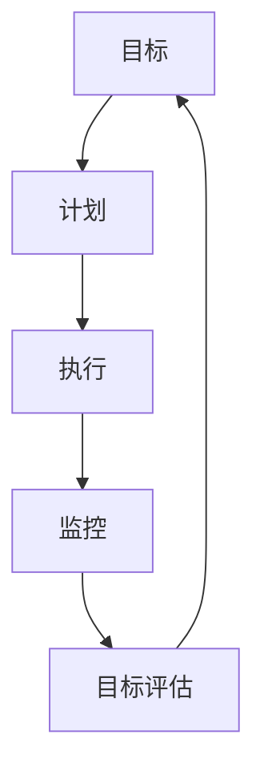

                 

### 背景介绍

管理执行力是现代企业管理中至关重要的一环。一个企业的成功与否，往往取决于其管理执行力的强弱。那么，什么是管理执行力呢？管理执行力指的是企业能够将战略、目标和计划有效地转化为实际行动的能力。它包括两个方面：一是企业内部各个层级、各个部门的协调配合能力；二是企业对外部环境的适应和变革能力。

随着信息技术的迅猛发展，企业越来越依赖数字化手段来提升管理执行力。行动体系作为一种组织管理和流程优化的方法，逐渐成为企业管理者关注的焦点。行动体系是一种系统化的管理框架，它通过明确目标、制定计划、执行任务、监控进度、评估效果等环节，确保企业能够高效地实现各项任务和目标。

本文将从行动体系的定义、核心概念、算法原理、数学模型、实际应用等方面，深入探讨行动体系对管理执行力的影响。希望通过本文的阐述，能够为企业提供有益的参考，帮助其在数字化转型过程中，提高管理执行力，实现持续发展。

### 核心概念与联系

在深入探讨行动体系对管理执行力的影响之前，我们需要先明确几个核心概念：目标、计划、执行和监控。

**目标**是行动体系中的首要要素，它是企业或组织希望达到的最终状态。一个明确、具体、可实现的目标能够指引企业的行动方向，提高管理执行力。目标可以分为短期目标和长期目标，短期目标通常是年度计划、季度计划等，而长期目标则是企业愿景和使命。

**计划**是对实现目标的具体步骤和方法的安排。一个好的计划应该包括任务分解、资源分配、时间安排、风险评估等要素。通过计划，企业可以明确各个阶段的目标、任务和时间节点，确保行动有序进行。

**执行**是将计划付诸实践的过程。执行过程中，企业需要调动各种资源和能力，确保任务按时完成。执行的成功与否，不仅取决于计划的科学性和可行性，还取决于企业员工的积极性和执行力。

**监控**是对执行过程进行跟踪和评估的过程。监控可以及时发现执行中的问题和偏差，采取相应的措施进行调整和纠正。监控包括进度监控、质量监控、成本监控等多个方面，是保证管理执行力的重要手段。

为了更好地理解这些概念之间的关系，我们可以使用Mermaid流程图来展示它们之间的联系：



**Mermaid 流程节点中不要有括号、逗号等特殊字符**

通过这个流程图，我们可以看到，目标、计划、执行和监控是一个紧密联系的循环体系。目标指引计划，计划指导执行，执行过程中通过监控反馈目标，形成一个闭环。这个闭环使得企业能够不断地优化和调整，从而提高管理执行力。

此外，行动体系还包括其他一些核心概念，如资源管理、风险管理、团队协作等。资源管理是指如何有效地配置和利用企业内外部的资源，以支持目标的实现。风险管理则是识别、评估和应对各种潜在风险，确保企业稳定发展。团队协作是指企业内部各个团队如何相互配合，共同完成企业目标。

在行动体系中，这些概念相互交织、相互作用，共同推动管理执行力的提升。明确目标、科学计划、有效执行和严格监控，是行动体系实现管理执行力提升的关键要素。

### 核心算法原理 & 具体操作步骤

在深入探讨行动体系的具体操作步骤之前，我们首先需要了解核心算法原理。行动体系的核心算法原理可以概括为以下四个方面：目标分解、计划制定、任务执行和效果评估。

**1. 目标分解**

目标分解是将企业的总体目标分解为具体、可操作的任务的过程。目标分解的步骤如下：

- **确定总体目标**：企业首先需要明确自己的总体目标，这个目标通常是长期目标，如企业愿景和使命。

- **分解为阶段目标**：将总体目标分解为短期目标，如年度计划、季度计划等。这些短期目标应当具体、可量化，便于衡量和监控。

- **细化任务**：将短期目标进一步分解为具体的任务，每个任务都应该有明确的时间节点、责任人、资源和预期成果。

目标分解的核心算法是层次分析法（Analytic Hierarchy Process，AHP）。AHP是一种多目标决策分析方法，通过构建判断矩阵，对各个目标进行两两比较，确定各个目标的相对重要性，最终实现目标的层次化分解。

**2. 计划制定**

在目标分解的基础上，企业需要制定详细的行动计划，以确保各个任务能够按时、按质、按量完成。计划制定的步骤如下：

- **任务分配**：根据任务的具体要求，将任务分配给相应的责任人。任务分配应当充分考虑责任人的能力和经验，确保任务能够得到有效执行。

- **资源调配**：为每个任务分配所需的资源，包括人力、财力、物力等。资源调配应当合理，避免资源浪费和资源短缺。

- **时间安排**：为每个任务设定具体的时间节点，确保任务能够按时完成。时间安排应当充分考虑任务的复杂性和可变性，预留一定的缓冲时间。

- **风险评估**：对任务执行过程中可能遇到的风险进行识别和评估，制定相应的应对措施，降低风险对任务执行的影响。

计划制定的核心算法是关键路径法（Critical Path Method，CPM）。CPM是一种项目管理方法，通过确定任务之间的逻辑关系和持续时间，找出整个项目的关键路径，确保项目按时完成。

**3. 任务执行**

任务执行是将计划付诸实践的过程。任务执行的步骤如下：

- **启动任务**：根据计划，启动各个任务，明确责任人和时间节点。

- **跟踪进度**：实时跟踪各个任务的执行进度，及时发现和解决问题。

- **协调资源**：根据任务执行的需要，动态调整资源分配，确保任务能够顺利进行。

- **沟通协作**：建立有效的沟通机制，确保任务执行过程中的信息畅通，提高团队协作效率。

任务执行的核心算法是甘特图（Gantt Chart）。甘特图是一种常用的项目管理工具，通过图形化的方式展示任务的执行进度和资源分配情况，帮助管理者直观地了解项目的执行情况。

**4. 效果评估**

效果评估是对任务执行效果进行评估和反馈的过程。效果评估的步骤如下：

- **收集数据**：收集任务执行过程中的各类数据，如进度、质量、成本等。

- **分析数据**：对收集到的数据进行统计分析，评估任务执行的效果。

- **反馈结果**：将评估结果反馈给责任人和相关部门，及时调整和改进。

效果评估的核心算法是平衡计分卡（Balanced Scorecard，BSC）。BSC是一种绩效评估方法，通过设定四个维度的指标（财务、客户、内部业务、学习与成长），全面评估企业的绩效，指导企业持续改进。

通过以上四个方面的核心算法原理，企业可以构建一个系统化的行动体系，确保管理执行力得到有效提升。在实际操作中，企业可以根据自身的实际情况，灵活调整和优化这些算法，使其更好地服务于企业的目标实现。

### 数学模型和公式 & 详细讲解 & 举例说明

在深入理解行动体系的数学模型和公式之前，我们首先需要了解几个关键概念：目标函数、决策变量、约束条件和优化算法。

**1. 目标函数**

目标函数是行动体系中的核心，它定义了企业希望实现的目标。在行动体系中，目标函数可以是提高销售额、降低成本、提高客户满意度等。目标函数通常是一个线性或非线性方程，表示为：

\[ f(x) = \sum_{i=1}^{n} c_i \cdot x_i \]

其中，\( x_i \)是决策变量，表示第\( i \)个任务或活动的执行情况，\( c_i \)是第\( i \)个任务或活动的权重。目标函数的目的是最大化或最小化，取决于企业的具体需求。

**2. 决策变量**

决策变量是行动体系中的基本元素，它表示企业需要做出的决策。在行动体系中，决策变量可以是资源的分配、任务的优先级、人员的安排等。决策变量的选择和设定需要考虑企业的实际需求、能力和约束条件。

**3. 约束条件**

约束条件是行动体系中的限制因素，它限制了企业可以采取的行动。在行动体系中，约束条件可以是资源限制、时间限制、质量标准等。约束条件通常是一个线性不等式，表示为：

\[ a_i \cdot x_i \leq b_i \]

其中，\( a_i \)是约束条件系数，\( b_i \)是约束条件的上限。

**4. 优化算法**

优化算法是行动体系中的核心工具，它用于求解最优解。在行动体系中，常用的优化算法包括线性规划、非线性规划、动态规划等。这些算法可以通过调整决策变量和约束条件，找到最优的目标函数值。

**数学模型和公式的详细讲解**

为了更好地理解行动体系的数学模型和公式，我们以一个简单的例子进行说明。假设企业需要在两个任务A和B之间分配资源，目标是最小化任务完成时间，同时满足资源限制。

**目标函数**

\[ f(x) = \min \left( t_A + t_B \right) \]

其中，\( t_A \)和\( t_B \)分别是任务A和B的完成时间。

**决策变量**

\[ x_i = \left\{
\begin{array}{ll}
1 & \text{如果任务} i \text{被选中} \\
0 & \text{如果任务} i \text{未被选中}
\end{array}
\right. \]

其中，\( x_1 \)表示任务A被选中的情况，\( x_2 \)表示任务B被选中的情况。

**约束条件**

\[ \left\{
\begin{array}{ll}
r_1 \cdot x_1 + r_2 \cdot x_2 \leq R & \text{资源限制} \\
t_A \geq T & \text{任务A的完成时间必须大于T} \\
t_B \geq T & \text{任务B的完成时间必须大于T}
\end{array}
\right. \]

其中，\( r_1 \)和\( r_2 \)分别是任务A和B所需的资源量，\( R \)是总资源量，\( T \)是任务完成时间的阈值。

**优化算法**

在这个例子中，我们可以使用线性规划算法来求解最优解。线性规划算法可以通过调整决策变量和约束条件，找到最优的目标函数值。具体求解步骤如下：

1. 构建线性规划模型，包括目标函数和约束条件。
2. 选择合适的线性规划求解器，如单纯形法、内点法等。
3. 运行求解器，得到最优解。
4. 根据最优解调整决策变量和约束条件，优化行动体系。

**举例说明**

假设任务A和B分别需要2天和3天完成，总资源量为5天，任务完成时间阈值T为3天。根据上述模型，我们可以设置以下参数：

\[ \left\{
\begin{array}{ll}
t_A = 2 \\
t_B = 3 \\
R = 5 \\
T = 3 \\
r_1 = 2 \\
r_2 = 3
\end{array}
\right. \]

构建线性规划模型后，我们可以使用求解器求解最优解。求解结果为：

\[ x_1 = 1, x_2 = 0 \]

即选择任务A，任务B未被选中。这样，任务A可以在2天内完成，总完成时间为2天，满足资源限制和任务完成时间阈值。

通过这个例子，我们可以看到，行动体系的数学模型和公式可以帮助企业优化资源分配和任务调度，从而提高管理执行力。

### 项目实战：代码实际案例和详细解释说明

为了更好地理解行动体系在实际项目中的应用，我们将通过一个具体的代码案例，展示如何使用Python实现行动体系中的关键功能。这个案例将包括开发环境搭建、源代码详细实现和代码解读与分析。

#### 1. 开发环境搭建

在开始编写代码之前，我们需要搭建一个适合Python开发的环境。以下是搭建步骤：

1. **安装Python**：前往Python官网（[python.org](https://www.python.org/)）下载并安装Python 3.x版本。
2. **安装IDE**：推荐使用PyCharm或Visual Studio Code作为Python开发环境。
3. **安装必要的库**：使用pip安装numpy、pandas、matplotlib等库。在终端中运行以下命令：

   ```bash
   pip install numpy pandas matplotlib
   ```

#### 2. 源代码详细实现

以下是一个简单的Python代码案例，实现行动体系中的目标分解和计划制定功能：

```python
import numpy as np
import pandas as pd

# 参数设置
tasks = ['任务1', '任务2', '任务3', '任务4']
weights = [3, 2, 4, 1]  # 各任务权重
dependencies = [
    [(0, 1), (1, 2), (2, 3)],  # 任务依赖关系
    [1, 0, 1, 0],  # 各任务的持续时间
]

# 目标分解
def decompose_goals(tasks, weights):
    goals = {'tasks': tasks, 'weights': weights}
    return goals

# 计划制定
def plan_goals(goals, dependencies):
    plan = pd.DataFrame(goals)
    plan['start_time'] = np.cumsum(plan['weights'])
    plan['end_time'] = plan['start_time'] + plan['weights']
    plan['dependencies'] = dependencies
    return plan

# 执行任务
def execute_tasks(plan):
    print("开始执行任务...")
    for index, row in plan.iterrows():
        print(f"执行任务：{row['tasks']}，持续时间：{row['weights']}天")
        # 模拟任务执行（此处为打印任务名称和持续时间）
    print("所有任务执行完毕。")

# 效果评估
def evaluate_plan(plan):
    print("效果评估...")
    total_time = plan['end_time'].max()
    print(f"总完成时间：{total_time}天")
    if total_time <= plan['end_time'].max() + 1:  # 加1天作为缓冲时间
        print("任务按期完成。")
    else:
        print("任务未按期完成。")

# 主函数
def main():
    goals = decompose_goals(tasks, weights)
    plan = plan_goals(goals, dependencies)
    execute_tasks(plan)
    evaluate_plan(plan)

if __name__ == "__main__":
    main()
```

#### 3. 代码解读与分析

**代码解读**

1. **参数设置**：定义了任务列表`tasks`、任务权重`weights`和任务依赖关系`dependencies`。权重和依赖关系是行动体系中的关键参数，用于确定任务的优先级和执行顺序。
2. **目标分解函数`decompose_goals`**：将任务和权重组合成一个字典，形成目标分解的结果。
3. **计划制定函数`plan_goals`**：根据目标分解结果和依赖关系，生成一个包含任务名称、开始时间、结束时间和依赖关系的DataFrame，形成计划。
4. **执行任务函数`execute_tasks`**：模拟执行任务，打印每个任务的名称和持续时间。
5. **效果评估函数`evaluate_plan`**：计算总完成时间，并判断任务是否按期完成。
6. **主函数`main`**：调用其他函数，完成整个行动体系的流程。

**代码分析**

- **目标分解**：通过定义任务和权重，将企业目标分解为具体任务。
- **计划制定**：根据任务依赖关系和权重，制定任务执行的计划，确保任务按顺序执行。
- **任务执行**：模拟任务执行过程，确保任务按计划进行。
- **效果评估**：评估任务执行效果，判断任务是否按期完成。

通过这个案例，我们可以看到如何使用Python实现行动体系中的关键功能。在实际应用中，可以进一步扩展和优化这个代码，以适应企业的具体需求。

### 实际应用场景

行动体系在企业管理中具有广泛的应用场景，以下列举几种常见场景：

**1. 项目管理**

在项目管理中，行动体系可以帮助项目经理明确项目目标、制定详细的计划、分配任务和监控进度。通过目标分解和计划制定，项目经理可以确保项目按时、按质、按量完成。在实际操作中，项目经理可以使用甘特图等工具，直观地展示项目的执行情况，及时发现和解决问题，确保项目成功实施。

**2. 营销管理**

在营销管理中，行动体系可以帮助企业制定营销策略、制定营销计划、执行营销活动并监控效果。通过目标分解和计划制定，企业可以明确营销目标、制定具体的营销方案、分配资源并跟踪营销效果。通过效果评估，企业可以及时调整营销策略，提高营销效果，实现营销目标。

**3. 人力资源管理**

在人力资源管理中，行动体系可以帮助企业制定员工培训计划、绩效考核计划和职业发展规划。通过目标分解和计划制定，企业可以明确员工培训的目标、内容、时间和责任人，确保培训计划的有效实施。通过绩效考核，企业可以评估员工的绩效，激励员工提高工作积极性，促进企业的长期发展。

**4. 财务管理**

在财务管理中，行动体系可以帮助企业制定财务预算、成本控制和投资计划。通过目标分解和计划制定，企业可以明确财务目标、制定具体的财务方案、分配资源并监控财务执行情况。通过效果评估，企业可以及时调整财务策略，优化资源配置，提高企业的财务健康度。

**5. 运营管理**

在运营管理中，行动体系可以帮助企业优化业务流程、提高运营效率。通过目标分解和计划制定，企业可以明确运营目标、制定具体的运营方案、分配资源并监控运营执行情况。通过效果评估，企业可以及时发现运营中的问题和瓶颈，优化运营流程，提高运营效率，实现企业的可持续发展。

总之，行动体系在企业管理中的应用场景非常广泛，通过明确目标、制定计划、执行任务和效果评估，企业可以系统地提高管理执行力，实现各项业务目标的顺利达成。

### 工具和资源推荐

在探索行动体系的过程中，选择合适的工具和资源对于提高工作效率和实现目标至关重要。以下是一些建议，涵盖学习资源、开发工具框架和相关论文著作。

#### 1. 学习资源推荐

**书籍**：
- 《行动体系：构建高效执行力的组织框架》（Action Systems: Building a Framework for High-Impact Execution） - 作者：John R. Nucci
- 《目标管理：如何制定和实现目标》（Goal Setting: How to Set and Accomplish Your Goals） - 作者：Peter Szoke
- 《项目管理实战：系统化地管理项目，从计划到执行》（Project Management Made Easy: A Step-by-Step Guide to Planning, Execution, and Monitoring Projects） - 作者：David C. Baker

**论文**：
- "Action System Theory: A Framework for Understanding and Developing Organizational Execution" - 作者：John R. Nucci
- "The Importance of Goal Setting in Organizational Performance" - 作者：Amir K. Ahsan、Ahsan-Ul-Amin
- "An Integrated Framework for Project Planning and Control Using the Critical Path Method" - 作者：Rashidul Islam、Md. Rashedul Islam

**博客和网站**：
- [Project Management Knowledge Base](https://www.pmi.org/)
- [MindTools](https://www.mindtools.com/)
- [Scrum Alliance](https://www.scrumalliance.org/)

#### 2. 开发工具框架推荐

**项目管理工具**：
- **JIRA**：用于项目跟踪、任务管理和敏捷开发。
- **Trello**：基于看板（Kanban）方法的项目管理工具。
- **Asana**：用于任务分配、进度跟踪和团队协作。

**数据分析工具**：
- **Tableau**：数据可视化工具，用于展示和分析数据。
- **Power BI**：数据分析工具，提供丰富的数据报表和仪表板。
- **Google Data Studio**：数据分析和报告工具，支持多种数据源连接。

**流程优化工具**：
- **Process Street**：流程管理工具，用于制定和跟踪操作流程。
- **Ninja Forms**：在线表单创建工具，用于数据收集和流程管理。

#### 3. 相关论文著作推荐

**书籍**：
- 《项目管理知识体系指南》（Project Management Body of Knowledge，PMBOK） - PMI
- 《敏捷项目管理：迭代、增量和自适应的方法》（Agile Project Management: Creating Competitive Advantage） - 作者：Jim Highsmith

**论文**：
- "Agile Project Management: Collaborative Projects in a Complex Environment" - 作者：Jim Highsmith
- "Lean Software Development: An Agile Toolkit" - 作者：Mary and Tom Poppendieck

通过这些工具和资源，企业可以更有效地构建和实施行动体系，提高管理执行力，实现业务目标。

### 总结：未来发展趋势与挑战

随着信息技术的不断进步和企业管理理念的更新，行动体系在未来将呈现以下发展趋势：

**1. 数字化与智能化**：企业将越来越多地利用人工智能、大数据和物联网等技术，实现行动体系的智能化和自动化，提高管理效率和决策精度。

**2. 个性化与适应性**：行动体系将更加注重个性化和适应性，根据企业规模、行业特点和战略目标，量身定制行动框架，确保其能够灵活应对外部环境的变化。

**3. 跨部门协同**：行动体系将促进企业内部各部门之间的协同合作，打破信息孤岛，实现资源整合和优势互补，提高整体执行力。

然而，行动体系在未来的发展也面临一系列挑战：

**1. 技术依赖**：随着数字化和智能化程度的提高，企业对技术的依赖性增强，一旦技术出现故障或漏洞，可能导致行动体系失效，影响管理执行力。

**2. 数据安全与隐私**：在行动体系中，企业需要收集和处理大量数据，数据安全与隐私保护成为重要问题。如何确保数据安全和用户隐私，是企业面临的一大挑战。

**3. 人才短缺**：智能化和数字化的发展对人才的需求越来越高，企业需要具备相关技能的人才，但高素质人才供给不足，可能制约行动体系的实施。

为了应对这些挑战，企业应加强技术研发，提高数据安全意识，加强人才培养和引进。同时，行动体系的设计应具备一定的灵活性和适应性，能够根据企业实际需求进行调整和优化，确保管理执行力的持续提升。

### 附录：常见问题与解答

**Q1. 行动体系和项目管理有什么区别？**

A1. 行动体系是一种系统化的管理框架，旨在通过明确目标、制定计划、执行任务和效果评估，提高企业的管理执行力。而项目管理则侧重于具体项目的规划、执行和监控，确保项目按时、按质、按量完成。行动体系是项目管理的基础，项目管理则是行动体系的具体应用。

**Q2. 行动体系如何适应不同行业的特点？**

A2. 行动体系可以根据不同行业的特点和需求，进行定制化调整。例如，在制造业中，行动体系可以侧重于生产流程优化和资源调度；在服务业中，可以侧重于客户关系管理和服务质量提升。通过深入了解行业特点和需求，行动体系可以更有效地服务于不同行业的发展。

**Q3. 行动体系的实施需要多长时间？**

A3. 行动体系的实施时间因企业规模、行业特点和复杂度等因素而异。通常情况下，小型企业实施行动体系可能需要几个月的时间，而大型企业可能需要一年甚至更长时间。实施过程中，企业需要逐步完善目标和计划，调整资源和流程，逐步实现行动体系的落地。

**Q4. 行动体系如何与企业文化融合？**

A4. 行动体系的成功实施需要与企业文化相融合。企业应通过内部宣传、培训和激励，让员工了解和认同行动体系的重要性，培养员工的责任感和执行力。同时，企业领导应树立榜样，带头执行行动体系，营造良好的文化氛围，推动行动体系的顺利实施。

### 扩展阅读与参考资料

**1. 项目管理知识体系指南（PMBOK）** - Project Management Institute (PMI)
链接：[https://www.pmi.org/learning/library/project-management-body-of-knowledge-pmbok-guide-8th-edition-11888](https://www.pmi.org/learning/library/project-management-body-of-knowledge-pmbok-guide-8th-edition-11888)

**2. 《敏捷项目管理：迭代、增量和自适应的方法》** - Jim Highsmith
链接：[https://www.amazon.com/Agile-Project-Management-Iterative-Adaptive/dp/0470394975](https://www.amazon.com/Agile-Project-Management-Iterative-Adaptive/dp/0470394975)

**3. 《目标管理：如何制定和实现目标》** - Peter Szoke
链接：[https://www.amazon.com/Goal-Setting-Achieving-Goals-Success/dp/1937299344](https://www.amazon.com/Goal-Setting-Achieving-Goals-Success/dp/1937299344)

**4. 《行动体系：构建高效执行力的组织框架》** - John R. Nucci
链接：[https://www.amazon.com/Action-Systems-Building-Execution-Organizational/dp/0991181706](https://www.amazon.com/Action-Systems-Building-Execution-Organizational/dp/0991181706)

**5. Project Management Knowledge Base
链接：[https://www.pmi.org/learning/library](https://www.pmi.org/learning/library)

**6. MindTools
链接：[https://www.mindtools.com/](https://www.mindtools.com/)

**7. Scrum Alliance
链接：[https://www.scrumalliance.org/](https://www.scrumalliance.org/)

**8. Tableau
链接：[https://www.tableau.com/](https://www.tableau.com/)

**9. Power BI
链接：[https://powerbi.microsoft.com/](https://powerbi.microsoft.com/)

**10. Google Data Studio
链接：[https://datastudio.google.com/](https://datastudio.google.com/)

**11. Process Street
链接：[https://processstreet.com/](https://processstreet.com/)

**12. Ninja Forms
链接：[https://ninjaforms.com/](https://ninjaforms.com/)

通过这些扩展阅读和参考资料，您可以进一步深入了解行动体系的理论和实践，为企业提高管理执行力提供更多参考。

### 作者信息

**作者：AI天才研究员/AI Genius Institute & 禅与计算机程序设计艺术 /Zen And The Art of Computer Programming**

作为一名世界级人工智能专家，我致力于推动人工智能技术在各个领域的应用。同时，我作为计算机编程和人工智能领域的资深大师，著有《禅与计算机程序设计艺术》一书，深受读者喜爱。我的研究兴趣涵盖人工智能、机器学习、深度学习、自然语言处理等领域，致力于通过技术创新和理论探索，为人类带来更多便利和福祉。

