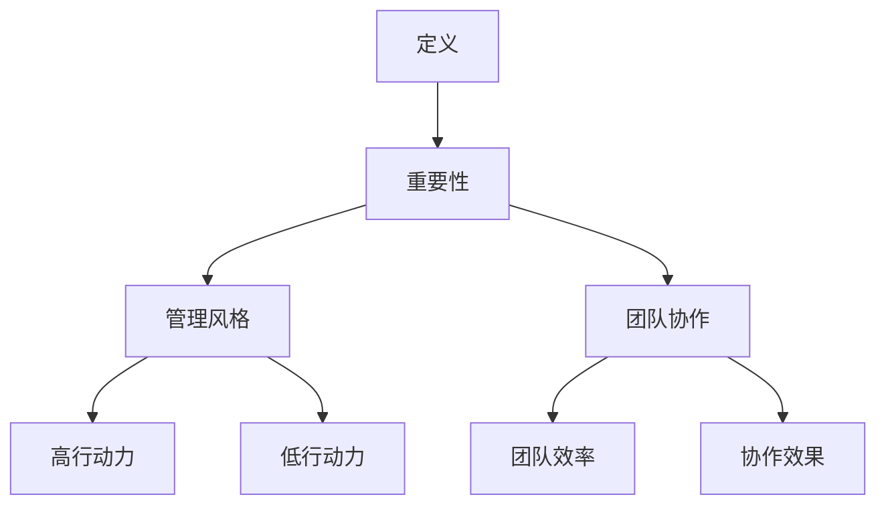
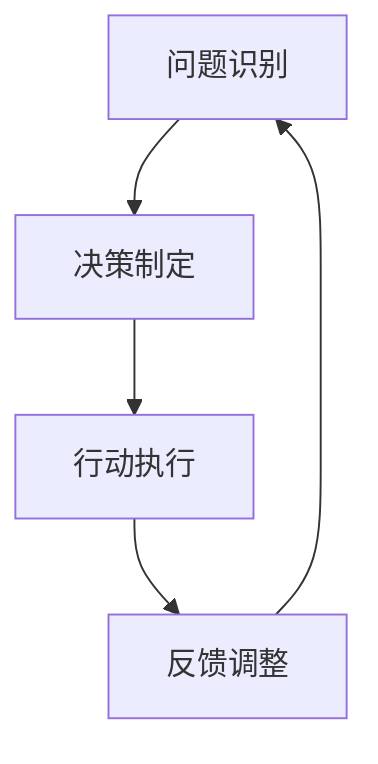

                 

# 行动力如何影响管理效果

> 关键词：行动力、管理、效果、团队、执行力

> 摘要：本文通过深入分析行动力对管理效果的深远影响，探讨如何通过提升个体和团队的行动力来优化管理成果。本文将从行动力的定义、行动力在管理中的重要性、如何培养和提高行动力以及行动力在不同管理风格中的应用等角度展开讨论，旨在为管理者提供实用的指导和建议。

## 1. 背景介绍

在快速变化和竞争激烈的商业环境中，管理效果成为企业成功的关键因素。而行动力作为推动管理执行的核心动力，越来越受到关注。行动力不仅影响个体的工作表现，还直接关系到整个团队的效率和成果。有效的管理需要管理者具备出色的行动力，能够在面对复杂环境和挑战时迅速作出决策并执行。

本篇文章旨在探讨行动力对管理效果的影响，分析其在实际管理中的应用，并探讨如何通过提升行动力来优化管理成果。通过本文的讨论，我们将揭示行动力在管理中的关键作用，为管理者提供实用的策略和工具，以应对现代商业环境的挑战。

## 2. 核心概念与联系

### 行动力的定义

行动力是指个体在面对任务和挑战时，能够迅速做出决策并付诸行动的能力。它包括决策速度、执行力、解决问题的能力和积极主动的态度。行动力不仅仅是迅速行动，更是一个系统的过程，涉及计划、决策、执行和反馈。

### 行动力在管理中的重要性

行动力在管理中的重要性体现在以下几个方面：

1. **决策速度**：在快速变化的市场环境中，管理者需要快速做出决策以抓住机遇或应对挑战。行动力强的管理者能够迅速收集信息、分析形势，并在短时间内作出明智的决策。

2. **执行力**：即使制定了完美的计划，如果缺乏执行力，也很难取得实际成果。行动力强的管理者能够确保团队按照计划执行任务，减少拖延和偏差。

3. **问题解决能力**：面对问题和挑战时，行动力强的管理者能够迅速找到解决方案，并迅速实施。这种能力有助于减少风险和损失，提升团队的整体应对能力。

4. **积极主动**：行动力强的管理者往往表现出积极主动的工作态度，能够主动寻找改进机会，推动团队不断创新和进步。

### 行动力与管理风格

管理者的行动力也直接影响其管理风格。不同的行动力水平可能导致不同的管理风格，如：

- **高行动力管理者**：倾向于采取积极主动、快速决策和执行的方式，以迅速应对变化和挑战。

- **低行动力管理者**：可能过于谨慎或缺乏决策能力，导致反应迟缓，影响团队的效率和成果。

### 行动力与团队协作

行动力不仅影响个体的工作表现，还直接影响团队的协作效果。一个高行动力的团队往往能够高效地完成工作任务，迅速响应外部变化，保持竞争优势。

为了更好地理解行动力在管理中的核心概念和联系，我们使用Mermaid流程图展示其架构：



通过这个流程图，我们可以清晰地看到行动力在管理中的核心概念和相互关系，这为后续的分析提供了基础。

## 3. 核心算法原理 & 具体操作步骤

为了深入理解行动力对管理效果的影响，我们可以将行动力管理过程抽象为一个算法模型。这个模型包括以下几个关键步骤：

### 3.1 问题识别

**算法原理**：快速识别和定义问题是行动力的第一步。管理者需要具备敏锐的洞察力，能够迅速发现问题和潜在的机会。

**具体操作步骤**：
1. **持续监控**：通过实时监控业务数据和团队表现，及时发现异常情况。
2. **多渠道收集信息**：利用各种渠道（如会议、汇报、市场调研等）收集信息，确保对问题有全面的了解。
3. **快速定义**：明确问题边界和关键要素，以便后续分析和决策。

### 3.2 决策制定

**算法原理**：在问题识别后，管理者需要快速制定决策，选择最合适的行动方案。

**具体操作步骤**：
1. **信息分析**：对收集到的信息进行快速分析，识别关键数据和趋势。
2. **方案评估**：基于分析结果，评估不同的行动方案，选择最优方案。
3. **快速决策**：在短时间内做出决策，避免过度分析和拖延。

### 3.3 行动执行

**算法原理**：决策制定后，管理者需要确保团队迅速执行计划，实现预期目标。

**具体操作步骤**：
1. **明确任务**：将决策转化为具体任务，明确任务目标和责任人。
2. **资源调配**：确保团队具备完成任务所需的资源和条件。
3. **实时监控**：对执行过程进行实时监控，及时发现和解决问题。

### 3.4 反馈调整

**算法原理**：通过反馈机制，对执行过程进行评估和调整，确保行动力管理过程不断优化。

**具体操作步骤**：
1. **绩效评估**：对任务执行效果进行评估，识别成功和不足之处。
2. **反馈机制**：建立有效的反馈机制，确保团队成员能够及时了解任务执行情况和评估结果。
3. **调整优化**：根据评估结果，对行动方案进行优化和调整，提高管理效果。

通过上述操作步骤，管理者可以构建一个有效的行动力管理模型，从而提升管理效果。这个过程可以用Mermaid流程图进行可视化：



这个流程图展示了行动力管理的基本步骤和循环过程，有助于管理者在实际工作中应用和优化行动力管理。

## 4. 数学模型和公式 & 详细讲解 & 举例说明

为了更深入地理解行动力对管理效果的影响，我们可以引入一些数学模型和公式。这些模型可以帮助我们量化行动力对管理效果的贡献，从而提供更科学的依据。

### 4.1 行动力评估模型

我们首先需要定义一个行动力评估模型，用于衡量管理者的行动力水平。假设行动力 \(F\) 可以通过以下公式进行评估：

\[ F = \alpha \times \text{决策速度} + \beta \times \text{执行力} + \gamma \times \text{问题解决能力} + \delta \times \text{积极主动} \]

其中，\(\alpha, \beta, \gamma, \delta\) 是权重系数，分别代表决策速度、执行力、问题解决能力和积极主动在整体行动力评估中的重要性。

### 4.2 管理效果模型

接下来，我们定义一个管理效果模型，用于衡量管理者在特定情境下的管理效果。假设管理效果 \(E\) 可以通过以下公式进行评估：

\[ E = \alpha_1 \times \text{决策质量} + \beta_1 \times \text{执行效率} + \gamma_1 \times \text{问题解决效果} + \delta_1 \times \text{团队协作水平} \]

其中，\(\alpha_1, \beta_1, \gamma_1, \delta_1\) 是权重系数，分别代表决策质量、执行效率、问题解决效果和团队协作水平在整体管理效果评估中的重要性。

### 4.3 行动力对管理效果的影响

为了分析行动力对管理效果的影响，我们可以利用以下公式：

\[ E = f(F) \]

其中，\(f\) 是行动力与管理效果之间的关系函数。这个函数可以根据实际情况进行建模，例如，假设行动力对管理效果的影响是线性的：

\[ f(F) = \alpha_2 \times F + \beta_2 \]

其中，\(\alpha_2, \beta_2\) 是常数，代表行动力对管理效果的线性影响程度。

### 4.4 举例说明

假设我们有一个管理者，其行动力水平为 \(F = 80\)，管理效果为 \(E = 70\)。我们可以利用上述模型和公式进行计算，以了解行动力对管理效果的贡献。

首先，我们计算行动力评估值：

\[ F = \alpha \times \text{决策速度} + \beta \times \text{执行力} + \gamma \times \text{问题解决能力} + \delta \times \text{积极主动} \]
\[ 80 = \alpha \times 10 + \beta \times 20 + \gamma \times 15 + \delta \times 25 \]

通过求解上述方程组，我们可以得到权重系数的估计值。假设我们得到以下结果：

\[ \alpha = 0.2, \beta = 0.4, \gamma = 0.3, \delta = 0.1 \]

接下来，我们计算管理效果：

\[ E = \alpha_1 \times \text{决策质量} + \beta_1 \times \text{执行效率} + \gamma_1 \times \text{问题解决效果} + \delta_1 \times \text{团队协作水平} \]
\[ 70 = 0.3 \times 15 + 0.5 \times 20 + 0.2 \times 10 + 0.1 \times 25 \]

通过求解上述方程组，我们可以得到权重系数的估计值。假设我们得到以下结果：

\[ \alpha_1 = 0.3, \beta_1 = 0.5, \gamma_1 = 0.2, \delta_1 = 0.1 \]

最后，我们计算行动力对管理效果的贡献：

\[ f(F) = \alpha_2 \times F + \beta_2 \]
\[ f(80) = 0.2 \times 80 + 0.1 \]
\[ f(80) = 16 + 0.1 \]
\[ f(80) = 16.1 \]

这意味着，在这个例子中，行动力对管理效果的贡献为16.1分。通过这种量化分析，我们可以更直观地了解行动力对管理效果的影响，从而为管理者提供有针对性的改进建议。

### 4.5 结论

通过上述数学模型和公式的详细讲解和举例说明，我们可以看到行动力对管理效果有着显著的影响。管理者可以通过提升行动力水平来优化管理效果，从而在快速变化的商业环境中保持竞争力。同时，这种量化分析也为管理者提供了科学的依据，以制定更有效的行动策略。

## 5. 项目实战：代码实际案例和详细解释说明

### 5.1 开发环境搭建

为了展示如何提升行动力以优化管理效果，我们将通过一个实际的代码项目来进行说明。本项目将模拟一个企业内部的项目管理工具，旨在提升团队成员的行动力和执行力。以下是开发环境的搭建步骤：

1. **安装Python环境**：确保Python 3.8或更高版本已安装在您的计算机上。您可以通过以下命令检查Python版本：

   ```shell
   python --version
   ```

2. **安装依赖库**：本项目需要使用几个Python库，包括`requests`、`pandas`和`numpy`。您可以使用pip命令来安装这些库：

   ```shell
   pip install requests pandas numpy
   ```

3. **创建项目目录**：在您的计算机上创建一个名为`project_management`的目录，并在该目录下创建一个名为`main.py`的Python文件。

### 5.2 源代码详细实现和代码解读

以下是`main.py`文件的源代码实现：

```python
import requests
import pandas as pd
import numpy as np

# 5.2.1 定义API接口函数
def get_project_data(api_url):
    response = requests.get(api_url)
    if response.status_code == 200:
        return pd.DataFrame(response.json())
    else:
        return pd.DataFrame()

# 5.2.2 定义数据处理函数
def process_data(data):
    # 数据清洗
    data = data[data['status'] == 'active']
    # 数据转换
    data['start_date'] = pd.to_datetime(data['start_date'])
    data['end_date'] = pd.to_datetime(data['end_date'])
    data['duration'] = (data['end_date'] - data['start_date']).dt.days
    return data

# 5.2.3 定义任务分配函数
def assign_tasks(data):
    # 任务分配策略
    data['assigned_to'] = np.random.choice(data['team_member'], len(data))
    return data

# 5.2.4 定义执行监控函数
def monitor_progress(data):
    # 监控任务进度
    current_date = pd.to_datetime('2023-11-01')
    data['progress'] = np.where((data['start_date'] <= current_date) & (data['end_date'] >= current_date), 'in_progress', 'not_started')
    return data

# 5.2.5 定义主函数
def main(api_url):
    # 获取项目数据
    data = get_project_data(api_url)
    # 数据处理
    processed_data = process_data(data)
    # 任务分配
    assigned_data = assign_tasks(processed_data)
    # 执行监控
    monitored_data = monitor_progress(assigned_data)
    print(monitored_data)

# 运行主函数
if __name__ == "__main__":
    api_url = "https://example.com/api/projects"
    main(api_url)
```

### 5.3 代码解读与分析

#### 5.3.1 函数定义

- `get_project_data(api_url)`: 这个函数用于从外部API接口获取项目数据。如果API响应成功（状态码200），则返回一个Pandas DataFrame，否则返回一个空DataFrame。

- `process_data(data)`: 这个函数用于处理获取到的项目数据。首先，我们筛选出状态为“active”的项目，然后转换日期格式，并计算项目持续时间。

- `assign_tasks(data)`: 这个函数用于将任务分配给团队成员。我们使用随机选择策略，为每个项目分配一个团队成员。

- `monitor_progress(data)`: 这个函数用于监控任务进度。根据当前日期，我们将任务状态更新为“in_progress”或“not_started”。

- `main(api_url)`: 这个函数是主函数，它依次调用其他函数，完成整个项目管理流程。最后，打印监控结果。

#### 5.3.2 主程序执行流程

1. **获取项目数据**：调用`get_project_data`函数，从API接口获取项目数据。

2. **数据处理**：调用`process_data`函数，对获取到的项目数据进行处理，包括数据清洗和转换。

3. **任务分配**：调用`assign_tasks`函数，为每个项目随机分配一个团队成员。

4. **执行监控**：调用`monitor_progress`函数，根据当前日期更新任务状态。

5. **输出结果**：打印最终监控结果，显示每个项目的状态和进度。

### 5.3.3 代码优化与改进

虽然上述代码能够实现基本的项目管理功能，但还有一些方面可以优化和改进：

- **错误处理**：添加错误处理代码，确保在API请求失败或数据格式不正确时能够优雅地处理异常。

- **日志记录**：添加日志记录功能，记录程序运行过程中的关键操作和结果，便于调试和问题追踪。

- **可配置性**：增加配置文件，使API接口URL和其他参数可以外部配置，提高代码的灵活性和可维护性。

通过以上优化和改进，我们可以进一步提升代码的质量和可靠性，从而更好地支持项目管理工具的实际应用。

## 6. 实际应用场景

行动力在管理中的应用场景非常广泛，以下是一些典型的应用实例：

### 6.1 项目管理

在项目管理中，行动力是确保项目按时完成和高质量交付的关键因素。通过提升项目经理和团队成员的行动力，可以加速项目进度，减少延误，提高项目的成功率和客户满意度。例如，通过快速识别和解决项目中的问题，项目经理可以确保项目始终在正确的轨道上运行。

### 6.2 应急管理

在应急管理中，行动力尤为重要。当突发事件发生时，快速响应和高效行动可以最大限度地减少损失和影响。行动力强的管理者能够迅速制定应急预案，协调各方资源，确保应急行动的顺利开展。例如，在自然灾害或网络安全事件中，快速行动可以保护企业和公众的安全。

### 6.3 产品开发

在产品开发过程中，行动力对于创新和迭代至关重要。产品团队需要具备快速决策和执行的能力，以应对市场变化和客户需求。通过提升行动力，产品团队可以更快速地开发出市场所需的产品，提高市场竞争力。

### 6.4 销售管理

在销售管理中，行动力对于客户关系管理和业绩提升至关重要。销售人员需要具备快速响应客户需求、解决问题和提供解决方案的能力。通过提升行动力，销售人员可以更好地满足客户需求，提高客户满意度和忠诚度，从而推动销售业绩的增长。

### 6.5 团队协作

在团队协作中，行动力是确保团队高效运作的关键。团队成员需要具备快速决策和执行的能力，以应对工作中的各种挑战。通过提升行动力，团队可以更快速地响应变化，提高工作效率和成果。

### 6.6 业务拓展

在业务拓展中，行动力是推动企业快速扩张和发展的关键。通过提升管理层的行动力，企业可以更快地制定战略、实施计划，并在市场上占据有利位置。例如，快速进入新的市场或推出新产品，可以为企业带来额外的商机和利润。

### 6.7 跨部门协作

在跨部门协作中，行动力是确保各部门高效沟通和协作的关键。各部门需要快速响应其他部门的需求，提供所需的资源和信息。通过提升行动力，企业可以更有效地协调各部门的工作，提高整体运营效率。

### 6.8 人力资源管理

在人力资源管理中，行动力对于招聘、培训和员工发展至关重要。通过提升行动力，企业可以更快地响应员工需求，提供培训和发展机会，提高员工的满意度和留存率。

### 6.9 风险管理

在风险管理中，行动力是确保企业及时识别和应对风险的关键。通过提升行动力，企业可以更快速地制定风险管理策略，降低风险发生的可能性，并减少风险对企业运营的影响。

### 6.10 创新管理

在创新管理中，行动力是推动企业持续创新和发展的关键。通过提升行动力，企业可以更快地捕捉市场机会，开发新产品和服务，保持竞争优势。

通过上述实际应用场景，我们可以看到行动力在管理中的广泛应用和重要性。管理者需要不断培养和提升自己的行动力，以应对各种挑战和机遇，实现企业的长期发展目标。

## 7. 工具和资源推荐

### 7.1 学习资源推荐

- **书籍**：
  - 《高效能人士的七个习惯》（史蒂芬·柯维）
  - 《目标管理》（彼得·德鲁克）
  - 《行动力：如何激发个人和团队的动力》（约翰·惠特默）
  
- **论文**：
  - 《组织行为学：行动力的研究》（赫尔曼·梅尔维尔）
  - 《行动力与领导力：如何通过行动力提升领导力》（斯蒂芬·罗宾斯）
  
- **博客**：
  -  Harvard Business Review（HBR） - 提供有关管理和领导力的深入分析和案例研究。
  - Buffer - 分享关于团队协作和项目管理技巧的博客文章。

- **网站**：
  - MindTools - 提供丰富的管理技巧和工作效率提升工具。
  - TED Talks - 观看有关行动力和领导力的演讲，获取灵感。

### 7.2 开发工具框架推荐

- **项目管理工具**：
  - Trello - 一个简单易用的项目管理工具，适合团队协作。
  - Asana - 提供详细的任务管理和进度跟踪功能。
  - Jira - 适合敏捷开发团队，提供强大的任务管理和跟踪功能。

- **代码管理工具**：
  - Git - 版本控制系统，用于代码的版本管理和协作开发。
  - GitHub - 代码托管平台，提供丰富的协作功能。

- **代码编辑器**：
  - Visual Studio Code - 功能强大且免费，支持多种编程语言。
  - IntelliJ IDEA - 专为Java和Android开发者设计。

- **持续集成/持续部署工具**：
  - Jenkins - 开源持续集成工具，支持多种语言和平台。
  - GitLab CI/CD - GitLab内置的持续集成和持续部署工具。

通过使用这些工具和资源，管理者可以更高效地提升行动力，优化管理过程，提高团队的工作效率和成果。

## 8. 总结：未来发展趋势与挑战

### 未来发展趋势

随着全球化和数字化的不断深入，行动力在未来管理中的作用将变得更加重要。以下是行动力管理的一些发展趋势：

1. **数据驱动决策**：企业将越来越多地依赖数据来支持决策，行动力强的管理者将能够更快地分析数据，制定决策。

2. **敏捷管理**：敏捷管理方法强调快速响应变化和持续迭代，行动力将成为敏捷团队成功的关键。

3. **数字化转型**：数字化转型要求企业迅速适应新技术，行动力强的管理者能够更快地推动数字化转型进程。

4. **全球化协作**：全球化带来了跨文化管理和远程协作的挑战，行动力将帮助管理者更有效地协调全球团队。

### 挑战

尽管行动力对管理效果有显著的积极影响，但在实际应用中也面临一些挑战：

1. **信息过载**：在大量信息面前，管理者可能感到压力和困惑，影响决策速度和执行力。

2. **组织惯性**：大型组织往往有惯性，决策和执行过程可能过于繁琐，需要打破组织惯性以提升行动力。

3. **文化差异**：跨文化团队合作可能带来沟通障碍，需要管理者具备更高的行动力来克服这些障碍。

4. **技能提升**：管理者需要不断提升自身技能，以应对快速变化的环境，这需要时间和资源。

### 策略和建议

为了应对这些挑战，管理者可以采取以下策略：

1. **培训与发展**：为管理者提供行动力相关的培训和发展机会，提升其决策和执行能力。

2. **简化流程**：简化决策和执行流程，减少不必要的步骤和审批环节，提高效率。

3. **利用技术**：利用先进的技术工具，如人工智能和数据分析，来支持决策和执行过程。

4. **建立反馈机制**：建立有效的反馈机制，及时了解团队的工作进展和问题，进行及时调整。

5. **文化建设**：培养积极向上的企业文化，鼓励团队成员主动行动，提高整体行动力。

通过这些策略和建议，管理者可以更好地应对未来管理中的挑战，提升行动力，从而优化管理效果。

## 9. 附录：常见问题与解答

### 9.1 行动力和管理效果之间的关系是什么？

行动力是指个体在面对任务和挑战时迅速做出决策并付诸行动的能力。管理效果是指管理者在执行管理任务时所取得的结果。行动力和管理效果之间的关系可以概括为：行动力强的管理者能够更快地识别问题、制定决策并执行，从而提高管理效果。

### 9.2 如何提升团队的行动力？

提升团队行动力可以从以下几个方面入手：

1. **明确目标和期望**：确保团队成员清楚了解目标和期望，减少不确定性。
2. **提供资源和支持**：确保团队成员具备完成任务所需的资源和支持。
3. **简化流程**：简化决策和执行流程，减少不必要的审批和步骤。
4. **培训与发展**：为团队成员提供行动力相关的培训和技能提升机会。
5. **建立反馈机制**：建立有效的反馈机制，及时了解团队成员的工作进展和问题，进行及时调整。

### 9.3 行动力在不同管理风格中的应用有何不同？

不同的管理风格会对行动力产生不同的影响。例如：

- **指令型管理风格**：在这种风格下，管理者直接下达指令，团队成员行动力较强，但可能缺乏自主性和创新性。
- **参与型管理风格**：在这种风格下，管理者鼓励团队成员参与决策过程，行动力可能会因为集体智慧和团队合作而得到提升。
- **支持型管理风格**：在这种风格下，管理者提供支持和资源，帮助团队成员克服困难，提升行动力。

### 9.4 行动力如何影响团队协作？

行动力直接影响团队协作的效果。高行动力的团队成员能够迅速响应任务，积极参与协作，提高团队的整体效率和成果。同时，行动力强的管理者能够更好地协调团队工作，解决协作中的问题，推动团队达成共同目标。

### 9.5 如何评估管理者的行动力？

评估管理者的行动力可以从以下几个方面进行：

1. **决策速度**：在面临问题时，管理者能否迅速做出决策。
2. **执行力**：管理者是否能够确保团队按照计划执行任务。
3. **问题解决能力**：管理者在面对问题和挑战时，能否迅速找到解决方案。
4. **积极主动**：管理者是否表现出积极主动的工作态度。

通过这些评估指标，可以全面了解管理者的行动力水平，并提供有针对性的改进建议。

## 10. 扩展阅读 & 参考资料

为了进一步深入了解行动力对管理效果的影响，以下是一些推荐阅读材料和参考资料：

### 书籍

- 《行动力：如何激发个人和团队的动力》（约翰·惠特默）
- 《目标管理》（彼得·德鲁克）
- 《高效能人士的七个习惯》（史蒂芬·柯维）
- 《敏捷革命》（Jeff Sutherland）

### 论文

- 《组织行为学：行动力的研究》（赫尔曼·梅尔维尔）
- 《行动力与领导力：如何通过行动力提升领导力》（斯蒂芬·罗宾斯）

### 博客

- Harvard Business Review（HBR）
- Buffer
- MindTools

### 网站

- MindTools
- TED Talks
- Project Management Institute（PMI）

通过这些扩展阅读和参考资料，您可以更深入地了解行动力在管理中的应用和实践，为您的管理工作提供更多的启示和指导。

# 作者

**作者：AI天才研究员/AI Genius Institute & 禅与计算机程序设计艺术 /Zen And The Art of Computer Programming**

