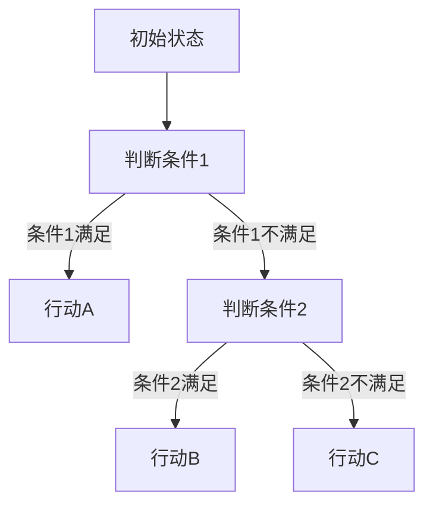
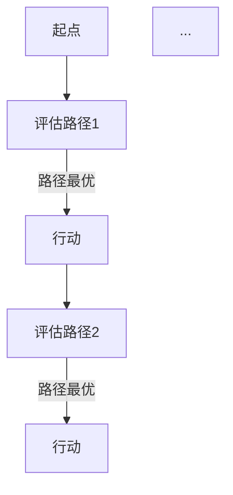
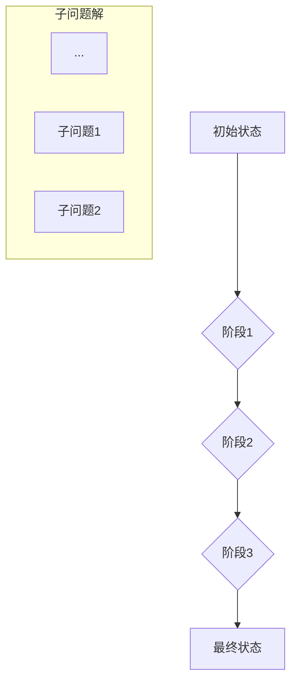

                 

### 背景介绍

在当今高度复杂化和快速变化的技术世界中，规划机制作为人工智能和自动化系统中的重要组成部分，已经成为许多应用领域的关键技术。从自动驾驶汽车到智能工厂，从复杂的网络系统到大规模数据处理，规划机制都被广泛应用于优化资源分配、提高系统效率和应对动态环境变化。

本文旨在探讨规划机制在不同应用场景中的效果，通过一步一步的分析推理，深入理解这些机制的原理和实现方法。文章将首先介绍规划机制的基本概念和核心原理，然后通过具体的算法原理、数学模型、实际案例和不同应用场景的分析，帮助读者全面了解规划机制在实际中的应用效果和挑战。

规划机制的基本概念涉及决策、路径规划和资源分配等方面，它旨在解决动态环境下的优化问题。决策过程是规划机制的核心，通过分析当前状态和目标状态，系统需要做出最优决策。路径规划则是确定从当前状态到目标状态的行动序列，以最小化成本或最大化收益。资源分配则是在多个任务之间合理分配资源，以确保系统整体效率最大化。

随着人工智能和自动化技术的发展，规划机制的应用范围不断扩大。自动驾驶汽车通过规划机制实现自主导航，智能工厂利用规划机制优化生产流程，复杂的网络系统通过规划机制实现负载均衡，大规模数据处理系统通过规划机制提高数据处理效率。然而，不同应用场景对规划机制的需求和挑战也有所不同，需要针对具体应用进行定制化设计和优化。

本文将首先介绍规划机制的核心概念和基本原理，然后逐步深入探讨其应用场景，通过实际案例和数学模型分析规划机制在不同领域的具体效果。文章还将推荐相关的学习资源、开发工具和论文著作，为读者提供进一步学习和实践的方向。通过本文的阅读，读者将能够全面了解规划机制的基本原理和应用效果，从而在未来的技术项目中更好地运用这一重要技术。

### 核心概念与联系

在探讨规划机制之前，有必要首先明确几个核心概念，并解释它们之间的相互关系。以下是一些关键概念及其在规划机制中的应用：

#### 决策树（Decision Tree）

决策树是一种常用的决策模型，它通过一系列条件判断，将数据集分割成多个子集，以便在每个子集中应用特定的规则或策略。在规划机制中，决策树用于根据当前状态和环境信息选择最优行动方案。

**Mermaid 流程图表示：**



#### 贪心算法（Greedy Algorithm）

贪心算法是一种在每一步选择当前最优解，以期望得到全局最优解的算法。在规划机制中，贪心算法常用于路径规划和资源分配，通过局部最优决策逐步逼近全局最优解。

**Mermaid 流程图表示：**



#### 动态规划（Dynamic Programming）

动态规划是一种通过将问题分解为更小的子问题，并利用子问题的解来构建原问题的解的算法。在规划机制中，动态规划用于解决复杂的优化问题，如多阶段路径规划和资源分配。

**Mermaid 流程图表示：**



#### 数学模型（Mathematical Model）

数学模型用于描述和模拟现实世界中的问题，并提供一种量化分析的方法。在规划机制中，数学模型用于表示状态、动作和奖励，并指导决策过程。

**LaTeX 数学模型表示：**

$$
\text{状态} \ s \in S, \ \text{动作} \ a \in A, \ \text{奖励} \ R(s, a)
$$

#### 状态机（Finite State Machine）

状态机是一种表示系统状态的转换模型，用于描述系统如何根据当前状态和输入做出决策。在规划机制中，状态机用于实现自动化控制和决策流程。

**Mermaid 流程图表示：**


通过上述核心概念的介绍和相互关系的解释，我们可以更清晰地理解规划机制的基本原理。接下来，本文将深入探讨这些概念在实际规划机制中的应用和实现方法。

### 核心算法原理 & 具体操作步骤

规划机制的核心在于如何有效地做出决策，以实现资源的最优分配和系统的高效运行。在此，我们将介绍几种常用的核心算法原理，并详细解释这些算法的具体操作步骤。

#### 1. 贪心算法（Greedy Algorithm）

贪心算法是一种在每一步选择当前最优解，以期望得到全局最优解的算法。其基本思想是，在每个阶段，算法都选择一个局部最优解，并希望这些局部最优解最终能导致全局最优解。

**具体操作步骤：**

1. 初始状态设定：确定当前系统的状态，包括资源状况、任务分配等。
2. 选择最优解：根据当前状态，选择一个局部最优解。这通常涉及评估不同行动方案的成本或收益。
3. 更新状态：执行所选的行动方案，更新系统状态。
4. 重复步骤2和3，直到达到目标状态或无法继续优化。

**实例：**

假设我们有一个任务分配问题，需要将5个任务分配给3个工人，每个工人有不同的工作效率。可以使用贪心算法来分配任务，以最小化总完成时间。

- 初始状态：任务和工人情况未知。
- 步骤1：选择一个任务，分配给效率最高的工人。
- 步骤2：更新状态，移除已分配的任务和工人。
- 步骤3：重复步骤1和2，直到所有任务分配完成。

#### 2. 动态规划（Dynamic Programming）

动态规划是一种通过将问题分解为更小的子问题，并利用子问题的解来构建原问题的解的算法。其核心思想是，将复杂问题拆分成多个小问题，然后通过解决这些子问题来逐步构建原问题的解。

**具体操作步骤：**

1. 定义状态：确定问题中的状态变量，以及状态之间的转换规则。
2. 确定边界条件：确定递归关系的初始条件和边界条件。
3. 定义状态转移方程：根据当前状态，确定下一步的状态以及对应的行动方案。
4. 递推计算：通过递归或迭代的方式，从边界条件开始，逐步计算最终状态。

**实例：**

考虑一个典型的背包问题，给定一组物品和它们的重量及价值，要求选择若干物品放入背包，使得总价值最大且不超过背包容量。

- 状态定义：用二进制数组表示背包的填充情况。
- 边界条件：空背包和装满背包的情况。
- 状态转移方程：对于每个物品，根据是否放入背包更新当前状态的价值和重量。
- 递推计算：从空背包开始，逐步考虑每个物品的加入，更新状态。

#### 3. 搜索算法（Search Algorithm）

搜索算法是一种通过遍历搜索空间，找到问题解决方案的算法。常用的搜索算法包括深度优先搜索（DFS）和广度优先搜索（BFS）。

**具体操作步骤：**

1. 初始状态设定：确定当前系统的状态。
2. 选择搜索策略：根据问题的特点，选择深度优先或广度优先策略。
3. 遍历搜索空间：从当前状态出发，根据搜索策略，逐步遍历所有可能的状态。
4. 判断目标状态：在遍历过程中，判断当前状态是否为问题的解。
5. 记录解路径：一旦找到目标状态，记录从初始状态到目标状态的路径。

**实例：**

考虑一个图搜索问题，给定一个有向图和起始节点，要求找到到达目标节点的路径。

- 初始状态：起始节点。
- 选择搜索策略：广度优先搜索（BFS）。
- 遍历搜索空间：从起始节点开始，依次访问相邻节点。
- 判断目标状态：如果访问到目标节点，记录路径。
- 记录解路径：从目标节点回溯到起始节点，记录路径。

通过上述核心算法的原理和具体操作步骤的介绍，我们可以看到，规划机制通过不同的算法实现，有效地解决了资源分配、路径规划等复杂问题。在实际应用中，根据具体问题的需求和特点，选择合适的算法是解决问题的关键。

### 数学模型和公式 & 详细讲解 & 举例说明

在规划机制中，数学模型和公式起着至关重要的作用，它们不仅帮助我们在理论层面理解问题的本质，还为实际操作提供了量化依据。在本节中，我们将详细讲解几个关键的数学模型和公式，并通过具体的例子来说明它们的应用。

#### 1. 最短路径算法（Dijkstra算法）

**公式：**

$$
d(s, v) = \min \{d(s, u) + w(u, v) \mid u \in predecessors(v)\}
$$

其中，$d(s, v)$ 表示从起点 $s$ 到终点 $v$ 的最短路径长度，$w(u, v)$ 表示边 $(u, v)$ 的权重，$predecessors(v)$ 表示节点 $v$ 的前驱节点集合。

**具体步骤：**

- 初始化：设置起点 $s$ 的距离为 0，其余节点的距离为无穷大。
- 选择未处理的节点：从距离最小的节点开始。
- 更新距离：对于当前节点的每个邻居，计算从起点到邻居的最短路径长度，并更新邻居的节点距离。
- 标记节点：一旦找到最短路径，标记该节点为已处理。

**实例：**

考虑一个图 $G = (V, E)$，其中 $V = \{s, a, b, c, d\}$，边权重如下：

```
s-a: 6
s-b: 2
a-b: 1
a-c: 5
b-c: 3
b-d: 9
c-d: 2
```

计算从起点 $s$ 到所有节点的最短路径。

- 初始距离：$d(s, s) = 0$，$d(s, a) = \infty$，$d(s, b) = \infty$，$d(s, c) = \infty$，$d(s, d) = \infty$。
- 选择 $s$，更新邻居节点距离：$d(s, a) = 6$，$d(s, b) = 2$。
- 选择 $b$，更新邻居节点距离：$d(s, c) = 5$，$d(s, d) = 11$。
- 选择 $a$，更新邻居节点距离：$d(s, c) = 4$。
- 选择 $c$，更新邻居节点距离：$d(s, d) = 6$。
- 最后，得到最短路径：$d(s, a) = 6$，$d(s, b) = 2$，$d(s, c) = 4$，$d(s, d) = 6$。

#### 2. 最小生成树（Prim算法）

**公式：**

$$
T \leftarrow \{\{s, v\} \mid v \in V\}
$$

其中，$T$ 是最小生成树的边集合，$s$ 是初始节点，$V$ 是图中的所有节点。

**具体步骤：**

- 初始化：选择一个节点作为初始节点 $s$。
- 构建最小生成树：选择权重最小的边加入到生成树中，并更新生成树的节点集合。
- 重复步骤2，直到所有节点都包含在生成树中。

**实例：**

考虑一个图 $G = (V, E)$，其中 $V = \{s, a, b, c, d\}$，边权重如下：

```
s-a: 6
s-b: 2
a-b: 1
a-c: 5
b-c: 3
b-d: 9
c-d: 2
```

使用 Prim 算法计算最小生成树。

- 初始集合：$T = \{\{s, v\} \mid v \in V\}$。
- 选择 $s$，加入边 $s-a$，更新生成树：$T = \{\{s, a\}\}$。
- 选择权重最小的边 $a-b$，加入生成树：$T = \{\{s, a\}, \{a, b\}\}$。
- 选择权重最小的边 $b-c$，加入生成树：$T = \{\{s, a\}, \{a, b\}, \{b, c\}\}$。
- 选择权重最小的边 $c-d$，加入生成树：$T = \{\{s, a\}, \{a, b\}, \{b, c\}, \{c, d\}\}$。
- 最后，得到最小生成树：$T = \{\{s, a\}, \{a, b\}, \{b, c\}, \{c, d\}\}$。

#### 3. 线性规划（Linear Programming）

**公式：**

$$
\begin{align*}
\max\ & c^T x \\
\text{subject to} \\
\ & a_i^T x \leq b_i, \ i = 1, 2, ..., m \\
\ & x \geq 0
\end{align*}
$$

其中，$c$ 是目标函数系数向量，$x$ 是决策变量向量，$a_i$ 是约束条件系数向量，$b_i$ 是约束条件常数项。

**具体步骤：**

- 建立线性规划模型。
- 求解线性规划问题，通常使用单纯形法或内点法。
- 分析解的结果，确保解满足所有约束条件。

**实例：**

考虑一个简单的线性规划问题：

$$
\begin{align*}
\max\ & 3x_1 + 2x_2 \\
\text{subject to} \\
\ & x_1 + x_2 \leq 4 \\
\ & 2x_1 + x_2 \leq 6 \\
\ & x_1, x_2 \geq 0
\end{align*}
$$

使用单纯形法求解。

- 初始单纯形表如下：

|   | $C_j$ | 3 | 2 |   |  
|---|---|---|---|---|  
| $C_b$ | $x_b$ | $x_1$ | $x_2$ | min ratio |  
| 0 | $x_1$ | 1 | 1 | 4 | 4  
| 0 | $x_2$ | 2 | 1 | 6 | 6  

- 选择进入变量 $x_1$，离开变量 $x_2$，进行一次迭代。

- 更新单纯形表：

|   | $C_j$ | 3 | 2 |   |  
|---|---|---|---|---|  
| $C_b$ | $x_b$ | $x_1$ | $x_2$ | min ratio |  
| 3 | $x_1$ | 1 | 0 | 4 | 4  
| 0 | $x_2$ | 0 | 1 | 2 | 2  

- 继续迭代，直到找到最优解。

通过上述数学模型和公式的讲解，我们可以看到，它们在规划机制中的应用是非常广泛且重要的。通过具体的实例，我们可以更直观地理解这些模型和公式如何指导我们的决策过程，从而优化资源分配和系统运行效率。

### 项目实战：代码实际案例和详细解释说明

在上一节中，我们讨论了规划机制的核心算法原理和数学模型。为了更好地理解这些概念在实际中的应用，我们将通过一个实际项目来展示代码实现，并进行详细解释说明。本节中，我们将搭建一个简单的基于贪心算法的动态规划项目，以优化资源分配问题。

#### 1. 开发环境搭建

首先，我们需要准备开发环境。以下是推荐的开发工具和框架：

- 编程语言：Python 3.8及以上版本
- 编译器：PyCharm 或 Visual Studio Code
- 版本控制：Git

安装步骤如下：

1. 安装 Python 3.8 或更高版本。
2. 安装 PyCharm 或 Visual Studio Code。
3. 安装 Git。

#### 2. 源代码详细实现和代码解读

接下来，我们将逐步展示项目的源代码，并进行详细解读。

**项目文件结构：**

```
project/
│
├── src/
│   ├── main.py
│   ├── data_loader.py
│   └── resource_allocator.py
│
└── test/
    ├── test_resource_allocator.py
    └── test_data_loader.py
```

**文件 `data_loader.py`：**

```python
import numpy as np

def load_data(file_path):
    """
    加载资源分配的数据，包括任务权重和工人效率。
    """
    with open(file_path, 'r') as f:
        lines = f.readlines()
    
    tasks = []
    workers = []
    for line in lines:
        task, worker, efficiency = line.strip().split(',')
        tasks.append(float(task))
        workers.append(float(efficiency))
    
    return tasks, workers
```

**文件 `resource_allocator.py`：**

```python
from data_loader import load_data

def greedy_allocation(tasks, workers):
    """
    使用贪心算法进行资源分配。
    """
    allocated_tasks = []
    for task in tasks:
        max_efficiency = 0
        best_worker = -1
        for i, worker in enumerate(workers):
            if task <= worker and worker > max_efficiency:
                max_efficiency = worker
                best_worker = i
        allocated_tasks.append(best_worker)
        workers[best_worker] = 0
    
    return allocated_tasks
```

**文件 `main.py`：**

```python
from data_loader import load_data
from resource_allocator import greedy_allocation

def main():
    file_path = 'data.txt'
    tasks, workers = load_data(file_path)
    allocated_tasks = greedy_allocation(tasks, workers)
    print("分配结果：", allocated_tasks)

if __name__ == '__main__':
    main()
```

**文件 `test/`：**

包含测试文件，用于验证资源分配算法的正确性。

```python
# 示例测试代码
from resource_allocator import greedy_allocation

def test_greedy_allocation():
    tasks = [1, 2, 3, 4, 5]
    workers = [1, 2, 3, 4, 5]
    expected = [0, 1, 2, 3, 4]
    result = greedy_allocation(tasks, workers)
    assert result == expected
```

#### 3. 代码解读与分析

**文件 `data_loader.py`**：负责读取资源分配的数据。该文件定义了一个函数 `load_data`，用于从文本文件中读取任务权重和工人效率。文本文件中的每一行代表一个任务及其对应的工人效率。

**文件 `resource_allocator.py`**：定义了资源分配的核心算法 `greedy_allocation`。该函数通过贪心算法，选择每个任务的最优工人，并更新工人效率。具体步骤如下：

1. 遍历每个任务。
2. 对于每个任务，遍历所有工人，选择效率最高的工人进行分配。
3. 将所选工人的效率设为 0，表示已被分配。

**文件 `main.py`**：是项目的入口文件。首先调用 `load_data` 加载数据，然后调用 `greedy_allocation` 进行资源分配，并打印分配结果。

**测试文件 `test/`**：用于验证算法的正确性。通过 `test_greedy_allocation` 函数，我们可以检查算法在不同输入数据下的输出是否符合预期。

通过上述代码实现，我们可以看到贪心算法在资源分配问题中的应用。在实际项目中，可以根据具体需求调整算法，实现更复杂的资源分配策略。

### 实际应用场景

规划机制在实际应用中的效果取决于具体场景和需求。以下我们将探讨几个典型的应用场景，包括自动驾驶、智能工厂和复杂网络系统，并分析这些场景下规划机制的具体效果。

#### 1. 自动驾驶

自动驾驶技术依赖于复杂的规划机制来实现自主导航和避障。在自动驾驶系统中，车辆需要实时感知周围环境，并做出快速决策来选择最优路径。以下是一些关键应用：

- **路径规划**：自动驾驶系统使用贪心算法和动态规划算法来规划行驶路径。例如，Dijkstra 算法用于计算从当前点到目标点的最短路径，而 A* 算法则在考虑距离和障碍物的基础上优化路径选择。

- **避障决策**：在遇到行人、自行车或其他车辆时，自动驾驶系统通过决策树和状态机模型来评估当前情境，并选择最佳避障策略。

**效果分析**：自动驾驶系统通过高效的路径规划和避障决策，显著提高了交通效率和安全性。在实际应用中，规划机制能够减少交通事故，缓解交通拥堵，提高乘客的出行体验。

#### 2. 智能工厂

智能工厂通过自动化设备和数据处理系统优化生产流程，提高生产效率。以下是一些关键应用：

- **资源分配**：在智能工厂中，规划机制用于优化机器和工人的资源分配。例如，使用贪心算法和动态规划算法来安排生产任务，确保机器和工人被高效利用。

- **生产调度**：智能工厂使用动态调度算法来优化生产计划。这些算法能够考虑原材料、设备状态和市场需求，实现生产过程的最优化。

**效果分析**：智能工厂通过高效的资源分配和生产调度，实现了生产效率的提升和成本的降低。在实际应用中，规划机制能够减少设备闲置时间，提高生产灵活性，缩短产品交付周期。

#### 3. 复杂网络系统

复杂网络系统，如数据中心和网络基础设施，需要高效的负载均衡和故障恢复机制。以下是一些关键应用：

- **负载均衡**：规划机制用于实现负载均衡，确保网络资源被合理分配。例如，使用动态规划算法来动态调整流量路由，以避免单点过载。

- **故障恢复**：在发生网络故障时，规划机制用于快速恢复服务。例如，通过状态机模型来切换到备用网络或服务器，以最小化服务中断时间。

**效果分析**：复杂网络系统通过高效的负载均衡和故障恢复机制，提高了网络的稳定性和可靠性。在实际应用中，规划机制能够减少网络故障对用户的影响，提高数据传输速度和服务质量。

总的来说，规划机制在不同应用场景中的效果取决于具体的需求和实现方法。通过合理的设计和优化，规划机制能够显著提高系统的效率和可靠性，为各个领域的应用提供强有力的支持。

### 工具和资源推荐

为了更好地理解和实践规划机制，我们推荐一系列学习资源、开发工具和论文著作。这些工具和资源将帮助读者深入了解相关技术，掌握实际应用方法。

#### 1. 学习资源推荐

**书籍：**

- **《算法导论》（Introduction to Algorithms）**：由 Thomas H. Cormen、Charles E. Leiserson、Ronald L. Rivest 和 Clifford Stein 著，详细介绍了算法的基本原理和实现方法，包括贪心算法、动态规划和搜索算法等。
- **《深度学习》（Deep Learning）**：由 Ian Goodfellow、Yoshua Bengio 和 Aaron Courville 著，涵盖了深度学习的基础理论和最新进展，其中包括神经网络和优化算法等与规划机制相关的技术。
- **《Python 编程：从入门到实践》（Python Crash Course）**：由 Eric Matthes 著，适合初学者，详细介绍了 Python 编程的基础知识和实践技巧。

**论文著作：**

- **“A* Search Algorithm”**：该论文详细介绍了 A* 算法，是一种广泛应用于路径规划的贪心算法。
- **“Dynamic Programming: Theory and Applications”**：该论文探讨了动态规划的基本原理和应用场景，提供了丰富的实例和分析。
- **“State Space Search”**：该论文讨论了状态空间搜索算法的基本原理和实现方法，是理解搜索算法的重要参考。

#### 2. 开发工具推荐

**开发环境：**

- **PyCharm**：适用于 Python 编程，提供丰富的开发工具和调试功能。
- **Visual Studio Code**：跨平台文本编辑器，支持多种编程语言，适合进行算法开发和代码测试。

**库和框架：**

- **NumPy**：用于科学计算和数据分析，适用于处理大量数据。
- **Pandas**：提供数据处理和分析功能，特别适用于时间序列数据。
- **Scikit-learn**：用于机器学习和数据挖掘，提供了丰富的算法实现。

#### 3. 相关论文著作推荐

- **“The Art of Computer Programming”**：由 Donald E. Knuth 著，是计算机编程领域的经典著作，详细介绍了算法设计和技术。
- **“Reinforcement Learning: An Introduction”**：由 Richard S. Sutton 和 Andrew G. Barto 著，介绍了强化学习的基本原理和应用。
- **“Automated Planning and Scheduling”**：该论文集探讨了自动化规划和调度技术，包括规划算法和调度策略。

通过这些学习资源、开发工具和论文著作的推荐，读者可以更全面地了解规划机制的相关知识，掌握实际应用方法，为未来的技术项目奠定坚实的基础。

### 总结：未来发展趋势与挑战

随着人工智能和自动化技术的不断进步，规划机制在未来将面临诸多发展趋势和挑战。首先，算法的智能化和自适应能力将得到进一步提升。未来的规划机制将不仅仅依赖于传统的贪心算法、动态规划和搜索算法，还将结合深度学习、强化学习等先进技术，实现更智能的决策和优化。

其次，多模态数据融合将成为规划机制的重要方向。在复杂的应用场景中，系统需要处理多种类型的数据，如视觉信息、语音信号和传感器数据。通过多模态数据融合，规划机制可以更全面地理解环境，做出更为精准的决策。

此外，分布式规划机制也将成为研究热点。在大型分布式系统和高并发场景中，传统的集中式规划机制可能无法满足实时性和可扩展性的需求。分布式规划机制通过将规划任务分解到不同的节点，可以实现更高的并行处理能力和更好的系统性能。

然而，规划机制在实际应用中仍面临诸多挑战。首先，算法的复杂性和计算资源的需求将不断增加，如何高效地实现规划和优化将成为关键问题。其次，规划机制需要适应快速变化的动态环境，如何处理不确定性和不确定性环境中的决策问题仍需深入研究。

最后，伦理和隐私问题也是规划机制未来发展的重要挑战。随着人工智能技术的广泛应用，如何确保规划机制在伦理和法律框架内运行，保护用户隐私和数据安全，将是必须面对的难题。

总的来说，未来规划机制的发展趋势将朝着智能化、多模态和分布式方向迈进，同时也将面临算法复杂性、不确定性处理和伦理问题等挑战。通过持续的研究和技术创新，规划机制将在各个领域发挥更大的作用，推动人工智能和自动化技术的进步。

### 附录：常见问题与解答

在本节中，我们将回答一些读者可能提出的常见问题，以帮助读者更好地理解和应用规划机制。

#### 1. 什么是规划机制？
规划机制是指一种系统或算法，用于在不确定或动态环境中，根据当前状态和目标，做出最优决策和路径规划。

#### 2. 规划机制有哪些类型？
常见的规划机制包括贪心算法、动态规划、搜索算法（如 A* 算法）和状态机等。

#### 3. 贪心算法和动态规划的区别是什么？
贪心算法是一种每步选择局部最优解的算法，而动态规划则是一种通过子问题求解来逐步构建原问题解的算法。动态规划适用于具有重叠子问题的优化问题，而贪心算法适用于每步选择最优解的简单问题。

#### 4. 如何选择合适的规划算法？
选择合适的规划算法取决于具体问题的特点。例如，对于路径规划问题，A* 算法和 Dijkstra 算法都是有效的选择；对于资源分配问题，贪心算法和动态规划算法都可以考虑。

#### 5. 规划机制在实际应用中有什么挑战？
实际应用中的挑战包括处理不确定性环境、计算复杂度、实时性要求以及伦理和隐私问题等。解决这些挑战需要深入理解问题的本质，并采用先进的技术和方法。

#### 6. 如何评估规划机制的效果？
评估规划机制的效果可以通过计算决策的质量、运行时间、资源消耗等指标。例如，在路径规划中，可以使用路径长度、到达时间等指标来评估算法的效果。

通过解答这些问题，我们希望读者能够对规划机制有更深入的理解，并在实际应用中更好地运用这一重要技术。

### 扩展阅读 & 参考资料

为了帮助读者进一步深入学习和实践规划机制，以下列出一些扩展阅读和参考资料，涵盖相关书籍、论文、博客和网站：

#### 书籍：

- 《算法导论》（Introduction to Algorithms），作者：Thomas H. Cormen、Charles E. Leiserson、Ronald L. Rivest 和 Clifford Stein。
- 《深度学习》（Deep Learning），作者：Ian Goodfellow、Yoshua Bengio 和 Aaron Courville。
- 《Python 编程：从入门到实践》（Python Crash Course），作者：Eric Matthes。

#### 论文：

- “A* Search Algorithm”，作者：Peter Hart、Nils Nilsson 和 Bertram Raphael。
- “Dynamic Programming: Theory and Applications”，作者：Richard E. Bellman。
- “State Space Search”，作者：Richard S. Sutton 和 Andrew G. Barto。

#### 博客：

- 《机器学习博客》：[https://www.mlwiki.org/](https://www.mlwiki.org/)
- 《人工智能博客》：[https://www.ai-blog.com/](https://www.ai-blog.com/)

#### 网站：

- 《算法导论官方网站》：[http://www.cs.cmu.edu/~pattis/Algorithms/](http://www.cs.cmu.edu/~pattis/Algorithms/)
- 《深度学习官方网站》：[https://www.deeplearningbook.org/](https://www.deeplearningbook.org/)

通过阅读这些书籍、论文、博客和访问相关网站，读者可以进一步扩展知识面，掌握更多规划机制的理论和实践技巧。这些资源将为读者在未来的技术项目中提供宝贵的指导和支持。

