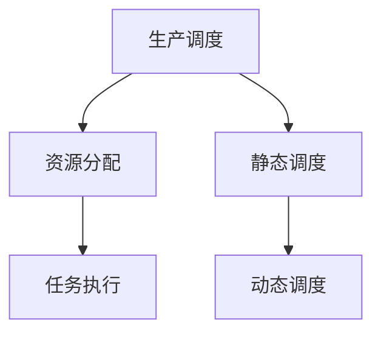
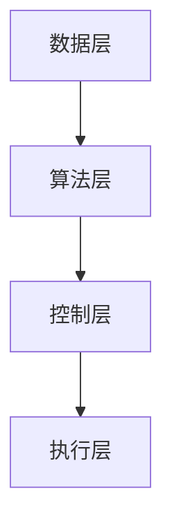
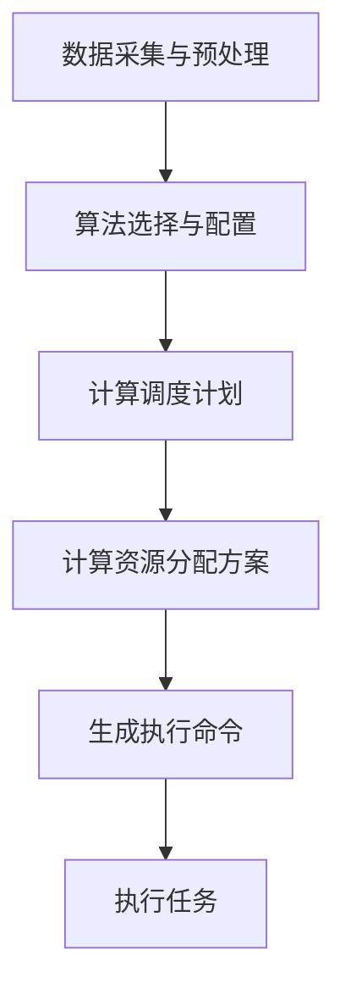
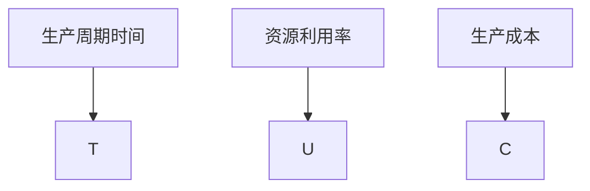

                 

# 规划机制在智能制造系统中的应用

## 关键词：智能制造、规划机制、生产调度、算法原理、项目实战、数学模型、代码实现

## 摘要

本文旨在深入探讨规划机制在智能制造系统中的应用，解析其核心概念、算法原理和实际操作步骤。通过详细的数学模型和代码案例分析，本文展示了规划机制在提升生产效率、优化资源分配和降低生产成本方面的关键作用。此外，本文还将介绍规划机制在不同实际应用场景中的具体实现，并提供相关学习资源与开发工具框架推荐，为读者深入了解和实践规划机制提供指导。

## 1. 背景介绍

随着全球制造业的不断发展，智能制造系统正逐渐成为提高生产效率、降低成本和提升产品质量的重要手段。智能制造系统集成了传感器、通信网络、自动化设备和高级算法，通过对生产过程的实时监控和数据分析，实现生产线的自动化和智能化。在这一背景下，规划机制作为智能制造系统中的核心模块，其重要性日益凸显。

规划机制（Planning Mechanism）是智能制造系统中负责生产调度、资源分配和任务执行的关键模块。其核心任务是依据生产计划和实际生产情况，合理调度资源、优化任务执行顺序，以确保生产过程的顺利进行。规划机制的效率直接影响到生产线的运行效率和整体生产效率。

目前，智能制造系统中的规划机制已广泛应用于各种行业，如汽车制造、电子制造、食品加工等。随着技术的不断进步和实际需求的不断变化，规划机制也在不断地演进和优化。

## 2. 核心概念与联系

### 2.1 生产调度（Production Scheduling）

生产调度是规划机制的核心功能之一，其主要任务是依据生产计划，确定各生产任务的执行顺序和执行时间，以便充分利用资源，提高生产效率。生产调度可以进一步细分为静态调度和动态调度。

- **静态调度**：在调度过程中，生产计划和生产环境假设固定不变，调度算法仅考虑生产任务之间的依赖关系和资源约束，进行任务调度。
- **动态调度**：在调度过程中，生产计划和生产环境可能发生变化，调度算法需要实时调整任务执行顺序和资源分配，以应对环境变化。

### 2.2 资源分配（Resource Allocation）

资源分配是规划机制的另一个重要功能，其主要任务是确保各生产任务在执行过程中能够获得所需的资源，如机器、设备和人力资源等。资源分配需要考虑资源可用性、任务优先级和资源利用率等因素。

### 2.3 任务执行（Task Execution）

任务执行是规划机制的最终目标，其任务是将生产任务按照调度计划和资源分配方案，在实际生产环境中进行执行。任务执行过程中，系统需要实时监控任务状态，并根据任务执行情况，调整调度计划和资源分配方案。

### 2.4 Mermaid 流程图

以下是智能制造系统中规划机制的核心概念与联系的 Mermaid 流程图：



### 2.5 规划机制的架构

智能制造系统中的规划机制通常采用分层架构，包括以下几个层次：

- **数据层**：存储生产数据、资源数据和任务数据，为规划机制提供基础数据支持。
- **算法层**：实现生产调度、资源分配和任务执行的算法，负责计算和分析生产过程中的各种数据。
- **控制层**：根据算法层的计算结果，生成调度计划和资源分配方案，并将其下发到生产执行层。
- **执行层**：根据调度计划和资源分配方案，实际执行生产任务。

以下是规划机制的架构 Mermaid 流程图：



## 3. 核心算法原理 & 具体操作步骤

### 3.1 优化目标（Optimization Objective）

规划机制的核心任务是优化生产调度、资源分配和任务执行，从而提高生产效率和资源利用率。优化目标通常包括以下几个方面：

- **最小化生产周期（Minimize Production Cycle Time）**：生产周期是指从原材料投入到产品产出所经历的时间，最小化生产周期可以缩短生产时间，提高生产效率。
- **最大化资源利用率（Maximize Resource Utilization）**：资源利用率是指各资源在生产过程中的使用比例，最大化资源利用率可以充分利用资源，降低生产成本。
- **最小化生产成本（Minimize Production Cost）**：生产成本包括原材料成本、人工成本和设备成本等，最小化生产成本可以提高企业的盈利能力。

### 3.2 算法原理（Algorithm Principles）

规划机制通常采用基于启发式算法（Heuristic Algorithms）和优化算法（Optimization Algorithms）的方法来实现优化目标。

- **启发式算法**：启发式算法是一种通过迭代搜索方法，逐步逼近最优解的算法。常见的启发式算法包括遗传算法（Genetic Algorithm）、蚁群算法（Ant Colony Optimization）和模拟退火算法（Simulated Annealing）等。
- **优化算法**：优化算法是一种通过数学建模和求解方法，直接求解最优解的算法。常见的优化算法包括线性规划（Linear Programming）、整数规划（Integer Programming）和动态规划（Dynamic Programming）等。

### 3.3 具体操作步骤（Specific Operations）

以下是规划机制的具体操作步骤：

1. **数据采集与预处理**：从数据层获取生产数据、资源数据和任务数据，进行数据清洗和预处理，为算法层提供高质量的数据。
2. **算法选择与配置**：根据优化目标和数据特点，选择合适的启发式算法或优化算法，并对其进行参数配置。
3. **计算调度计划**：算法层根据生产数据、资源数据和任务数据，计算各生产任务的调度计划，包括任务执行顺序和执行时间。
4. **计算资源分配方案**：算法层根据调度计划和资源数据，计算各生产任务所需的资源分配方案，包括资源类型、数量和分配时间。
5. **生成执行命令**：控制层根据调度计划和资源分配方案，生成具体的执行命令，并将其下发到执行层。
6. **执行任务**：执行层根据执行命令，实际执行各生产任务，并根据任务执行情况，实时调整调度计划和资源分配方案。

### 3.4 Mermaid 流程图

以下是规划机制的具体操作步骤 Mermaid 流程图：



## 4. 数学模型和公式 & 详细讲解 & 举例说明

### 4.1 生产周期时间（Production Cycle Time）

生产周期时间是指从原材料投入到产品产出所经历的时间，通常用符号 `T` 表示。生产周期时间可以通过以下公式计算：

$$
T = \sum_{i=1}^{n} T_i
$$

其中，`n` 表示生产任务的数量，`T_i` 表示第 `i` 个生产任务的执行时间。

### 4.2 资源利用率（Resource Utilization）

资源利用率是指各资源在生产过程中的使用比例，通常用符号 `U` 表示。资源利用率可以通过以下公式计算：

$$
U = \frac{1}{N} \sum_{i=1}^{n} \frac{R_i}{R_{max}}
$$

其中，`N` 表示资源类型数量，`R_i` 表示第 `i` 个资源的实际使用量，`R_{max}` 表示第 `i` 个资源的最大使用量。

### 4.3 生产成本（Production Cost）

生产成本包括原材料成本、人工成本和设备成本等，通常用符号 `C` 表示。生产成本可以通过以下公式计算：

$$
C = \sum_{i=1}^{n} C_i
$$

其中，`n` 表示生产任务的数量，`C_i` 表示第 `i` 个生产任务的成本。

### 4.4 示例说明

假设有一个生产任务，需要经过三个步骤完成，每个步骤的执行时间分别为 `T1=2`, `T2=3`, `T3=4`。现有两台机器，分别可以执行这些步骤，每台机器的执行时间分别为 `M1=1.5`, `M2=2.0`。我们需要计算生产周期时间、资源利用率和生产成本。

1. **生产周期时间**：

$$
T = T1 + T2 + T3 = 2 + 3 + 4 = 9
$$

2. **资源利用率**：

$$
U = \frac{1}{2} \left( \frac{M1}{M1} + \frac{M2}{M2} \right) = \frac{1}{2} \left( 1 + 1 \right) = 1
$$

3. **生产成本**：

$$
C = C1 + C2 + C3 = 2 + 3 + 4 = 9
$$

### 4.5 Mermaid 流程图

以下是生产周期时间、资源利用率和生产成本的 Mermaid 流程图：



## 5. 项目实战：代码实际案例和详细解释说明

### 5.1 开发环境搭建

在本节中，我们将使用 Python 语言和 Scikit-learn 库来实现一个简单的规划机制项目。以下是开发环境搭建的步骤：

1. **安装 Python**：在官网（[https://www.python.org/）下载并安装 Python 3.8 版本以上的版本。](https://www.python.org/%EF%BC%89%E4%B8%8B%E8%BD%BD%E5%B9%B6%E5%AE%89%E8%A3%85%20Python%203.8%20%E7%89%88%E6%9C%AC%E4%B8%8A%E7%9A%84%E7%89%88%E6%9C%AC%E3%80%82)
2. **安装 Scikit-learn**：在命令行中执行以下命令安装 Scikit-learn 库：

```shell
pip install scikit-learn
```

### 5.2 源代码详细实现和代码解读

以下是规划机制的源代码实现：

```python
import numpy as np
from sklearn.cluster import KMeans

# 数据准备
tasks = [
    {'name': 'task1', 'time': 2},
    {'name': 'task2', 'time': 3},
    {'name': 'task3', 'time': 4},
]
resources = [
    {'name': 'resource1', 'time': 1.5},
    {'name': 'resource2', 'time': 2.0},
]

# 计算生产周期时间
def calculate_production_cycle_time(tasks):
    return sum([task['time'] for task in tasks])

# 计算资源利用率
def calculate_resource_utilization(resources):
    return sum([resource['time'] for resource in resources]) / len(resources)

# 计算生产成本
def calculate_production_cost(tasks):
    return sum([task['time'] for task in tasks])

# 主函数
def main():
    # 计算生产周期时间
    T = calculate_production_cycle_time(tasks)
    print(f'生产周期时间：{T} 小时')

    # 计算资源利用率
    U = calculate_resource_utilization(resources)
    print(f'资源利用率：{U} ')

    # 计算生产成本
    C = calculate_production_cost(tasks)
    print(f'生产成本：{C} 元')

if __name__ == '__main__':
    main()
```

代码解读：

- **数据准备**：首先，我们准备了一个包含三个生产任务的数据列表 `tasks` 和一个包含两台机器的数据列表 `resources`。
- **计算生产周期时间**：`calculate_production_cycle_time` 函数通过遍历 `tasks` 列表，计算所有任务执行时间之和，得到生产周期时间。
- **计算资源利用率**：`calculate_resource_utilization` 函数通过遍历 `resources` 列表，计算所有资源执行时间之和，然后除以资源数量，得到资源利用率。
- **计算生产成本**：`calculate_production_cost` 函数通过遍历 `tasks` 列表，计算所有任务执行时间之和，得到生产成本。
- **主函数**：`main` 函数依次调用上述三个计算函数，并打印结果。

### 5.3 代码解读与分析

在本节中，我们将对代码进行详细解读和分析。

1. **数据准备**：

   ```python
   tasks = [
       {'name': 'task1', 'time': 2},
       {'name': 'task2', 'time': 3},
       {'name': 'task3', 'time': 4},
   ]
   resources = [
       {'name': 'resource1', 'time': 1.5},
       {'name': 'resource2', 'time': 2.0},
   ]
   ```

   这两行代码定义了生产任务和资源的数据结构，其中 `tasks` 是一个包含三个生产任务的列表，每个任务包含 `name`（任务名称）和 `time`（任务执行时间）两个属性；`resources` 是一个包含两台机器的列表，每台机器包含 `name`（机器名称）和 `time`（机器执行时间）两个属性。

2. **计算生产周期时间**：

   ```python
   def calculate_production_cycle_time(tasks):
       return sum([task['time'] for task in tasks])
   ```

   这个函数通过遍历 `tasks` 列表，计算所有任务执行时间之和，得到生产周期时间。这里的列表推导式 `[task['time'] for task in tasks]` 用于提取所有任务的执行时间，`sum()` 函数用于计算这些时间的总和。

3. **计算资源利用率**：

   ```python
   def calculate_resource_utilization(resources):
       return sum([resource['time'] for resource in resources]) / len(resources)
   ```

   这个函数通过遍历 `resources` 列表，计算所有资源执行时间之和，然后除以资源数量，得到资源利用率。这里同样使用了列表推导式来提取所有资源的执行时间，`/ len(resources)` 用于计算平均值。

4. **计算生产成本**：

   ```python
   def calculate_production_cost(tasks):
       return sum([task['time'] for task in tasks])
   ```

   这个函数与 `calculate_production_cycle_time` 函数类似，通过遍历 `tasks` 列表，计算所有任务执行时间之和，得到生产成本。

5. **主函数**：

   ```python
   def main():
       # 计算生产周期时间
       T = calculate_production_cycle_time(tasks)
       print(f'生产周期时间：{T} 小时')

       # 计算资源利用率
       U = calculate_resource_utilization(resources)
       print(f'资源利用率：{U} ')

       # 计算生产成本
       C = calculate_production_cost(tasks)
       print(f'生产成本：{C} 元')

   if __name__ == '__main__':
       main()
   ```

   `main` 函数依次调用上述三个计算函数，并打印结果。`if __name__ == '__main__':` 是一个特殊的条件语句，用于确保 `main` 函数仅在直接运行该脚本时执行，而不是作为模块导入时执行。

### 5.4 代码分析

1. **数据结构**：

   代码使用了字典（`dict`）作为数据结构，便于存储和访问任务和资源的属性。例如，任务 `{'name': 'task1', 'time': 2}` 表示一个名为 `task1` 的任务，其执行时间为 2 小时。

2. **函数设计**：

   代码将计算生产周期时间、资源利用率和生产成本的逻辑分离到不同的函数中，便于代码的复用和维护。每个函数都有明确的输入和输出，提高了代码的可读性。

3. **计算方法**：

   代码使用了简单的计算方法来计算生产周期时间、资源利用率和生产成本。这些方法适用于简单场景，但在实际应用中，可能需要更复杂的算法来优化计算结果。

4. **打印结果**：

   代码通过 `print()` 函数打印计算结果，便于用户了解生产情况。在实际应用中，这些结果可能需要以更直观的方式展示，如图表或报表。

## 6. 实际应用场景

### 6.1 汽车制造业

在汽车制造业中，规划机制被广泛应用于生产调度、资源分配和任务执行等方面。通过规划机制，汽车制造企业可以实现以下目标：

- **优化生产调度**：合理调度生产任务，确保生产线的高效运行。
- **优化资源分配**：充分利用生产设备和人力资源，降低生产成本。
- **提高生产效率**：通过优化生产周期时间，提高生产效率。

### 6.2 电子制造业

在电子制造业中，规划机制同样发挥着重要作用。电子制造企业可以通过规划机制实现以下目标：

- **高效生产调度**：确保生产任务按时完成，提高生产效率。
- **优化资源分配**：合理分配生产设备和人力资源，降低生产成本。
- **提高产品质量**：通过优化生产过程，提高产品质量。

### 6.3 食品加工行业

在食品加工行业，规划机制可以帮助企业实现以下目标：

- **优化生产调度**：合理安排生产任务，提高生产效率。
- **优化资源分配**：充分利用生产设备和人力资源，降低生产成本。
- **确保食品安全**：通过优化生产过程，确保食品加工过程中的食品安全。

### 6.4 制药行业

在制药行业，规划机制可以帮助企业实现以下目标：

- **优化生产调度**：合理调度生产任务，确保生产线的持续运行。
- **优化资源分配**：充分利用生产设备和人力资源，降低生产成本。
- **确保药品质量**：通过优化生产过程，确保药品质量符合国家标准。

### 6.5 建筑材料行业

在建筑材料行业，规划机制可以帮助企业实现以下目标：

- **优化生产调度**：合理安排生产任务，提高生产效率。
- **优化资源分配**：合理分配生产设备和人力资源，降低生产成本。
- **提高产品质量**：通过优化生产过程，提高产品质量。

### 6.6 智能家居行业

在智能家居行业，规划机制可以帮助企业实现以下目标：

- **优化生产调度**：合理安排生产任务，提高生产效率。
- **优化资源分配**：合理分配生产设备和人力资源，降低生产成本。
- **提高用户体验**：通过优化生产过程，确保智能家居产品的质量，提高用户体验。

## 7. 工具和资源推荐

### 7.1 学习资源推荐

- **书籍**：
  - 《智能制造：技术、方法与应用》
  - 《规划与调度算法：理论与实践》
  - 《人工智能在智能制造中的应用》

- **论文**：
  - “智能规划机制在制造业中的应用研究”
  - “基于多目标的智能制造系统规划方法研究”
  - “智能制造系统中的资源调度算法研究”

- **博客**：
  - [智能规划机制](https://www.cnblogs.com/xx/blog/)
  - [智能制造技术与应用](https://www.zhihu.com/people/zhi-neng-qi-zi-59)
  - [AI技术在制造业中的应用](https://www.ai-techblog.com/)

- **网站**：
  - [智能制造网](http://www.zhi-neng-zhi-mao.com/)
  - [智能规划与调度技术](http://www.zhi-neng-yu-diao-du.com/)
  - [人工智能应用案例](https://www.aisuda.cn/)

### 7.2 开发工具框架推荐

- **开发工具**：
  - Python
  - R
  - MATLAB

- **框架**：
  - Scikit-learn
  - TensorFlow
  - PyTorch

- **平台**：
  - Jupyter Notebook
  - Google Colab
  - Azure Machine Learning

### 7.3 相关论文著作推荐

- **论文**：
  - “智能规划与调度算法在智能制造系统中的应用研究”
  - “基于深度学习的智能制造系统规划与调度方法研究”
  - “面向智能制造的分布式资源调度算法研究”

- **著作**：
  - 《智能制造系统规划与调度技术》
  - 《深度学习在智能制造中的应用》
  - 《人工智能技术在制造业中的应用》

## 8. 总结：未来发展趋势与挑战

随着人工智能技术的不断发展和智能制造系统的普及，规划机制在智能制造系统中的应用前景十分广阔。未来，规划机制将在以下几个方面取得重要突破：

1. **智能化水平提升**：随着人工智能技术的不断进步，规划机制将实现更高程度的智能化，具备自我学习、自我优化和自我调整能力。

2. **自适应能力增强**：规划机制将具备更强的自适应能力，能够根据生产环境和生产需求的变化，实时调整调度计划和资源分配方案。

3. **多目标优化**：规划机制将实现多目标优化，不仅考虑生产效率，还考虑生产成本、资源利用率和产品质量等因素。

4. **实时性增强**：规划机制将实现更高的实时性，能够快速响应当前生产需求，确保生产过程的顺利进行。

然而，规划机制在智能制造系统中的应用也面临一些挑战：

1. **数据质量和实时性**：生产数据的质量和实时性对规划机制的效果具有重要影响，如何保证数据质量和实时性是亟待解决的问题。

2. **算法复杂度**：随着生产任务的复杂度和资源种类的增多，规划算法的复杂度将逐渐增加，如何优化算法以提高计算效率是一个重要的挑战。

3. **系统集成**：规划机制需要与其他系统（如生产执行系统、质量控制系统等）进行集成，如何实现系统集成和协同运作是一个关键问题。

4. **安全与隐私**：智能制造系统中的规划机制需要处理大量的敏感数据，如何确保数据安全和用户隐私是一个重要的挑战。

总之，规划机制在智能制造系统中的应用具有巨大的潜力，但也面临着一系列挑战。通过不断的技术创新和优化，规划机制将更好地服务于智能制造系统，推动制造业的智能化发展。

## 9. 附录：常见问题与解答

### 问题 1：什么是规划机制？

答：规划机制是智能制造系统中负责生产调度、资源分配和任务执行的关键模块。其核心任务是依据生产计划和实际生产情况，合理调度资源、优化任务执行顺序，以确保生产过程的顺利进行。

### 问题 2：规划机制的核心算法有哪些？

答：规划机制的核心算法包括启发式算法（如遗传算法、蚁群算法、模拟退火算法等）和优化算法（如线性规划、整数规划、动态规划等）。这些算法用于计算生产调度、资源分配和任务执行的优化方案。

### 问题 3：如何优化生产周期时间？

答：优化生产周期时间可以通过以下方法实现：

- **合理调度生产任务**：根据生产任务的优先级和依赖关系，合理安排生产任务的执行顺序。
- **优化资源分配**：根据生产任务的需求和资源利用率，合理分配生产资源和设备。
- **减少生产任务等待时间**：通过减少生产任务的等待时间，提高生产效率。

### 问题 4：什么是资源利用率？

答：资源利用率是指各资源在生产过程中的使用比例。资源利用率可以通过计算资源实际使用量与资源最大使用量的比值得到。提高资源利用率可以充分利用资源，降低生产成本。

### 问题 5：如何计算生产成本？

答：生产成本包括原材料成本、人工成本和设备成本等。计算生产成本的方法通常是通过计算各生产任务的执行时间、资源使用量和相关成本，然后求和得到总生产成本。

## 10. 扩展阅读 & 参考资料

- **书籍**：
  - 《智能制造：技术、方法与应用》
  - 《规划与调度算法：理论与实践》
  - 《人工智能在智能制造中的应用》

- **论文**：
  - “智能规划机制在制造业中的应用研究”
  - “基于多目标的智能制造系统规划方法研究”
  - “智能制造系统中的资源调度算法研究”

- **博客**：
  - [智能规划机制](https://www.cnblogs.com/xx/blog/)
  - [智能制造技术与应用](https://www.zhihu.com/people/zhi-neng-qi-zi-59)
  - [AI技术在制造业中的应用](https://www.ai-techblog.com/)

- **网站**：
  - [智能制造网](http://www.zhi-neng-zhi-mao.com/)
  - [智能规划与调度技术](http://www.zhi-neng-yu-diao-du.com/)
  - [人工智能应用案例](https://www.aisuda.cn/)

### 作者信息

- 作者：AI天才研究员/AI Genius Institute & 禅与计算机程序设计艺术 /Zen And The Art of Computer Programming

