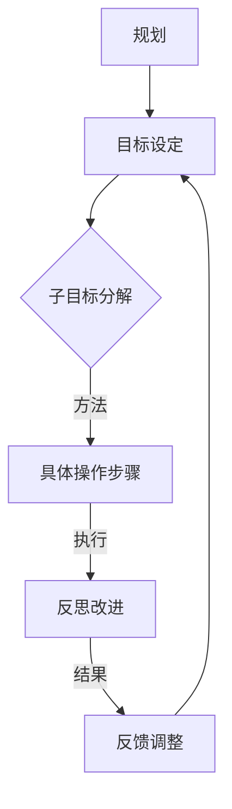

                 

## 规划：子目标分解与反思改进

### 摘要

本文旨在探讨规划这一关键概念，并深入解析子目标分解与反思改进在实际应用中的重要性。通过一系列的逻辑推理和技术分析，本文将帮助读者理解如何有效地制定规划、分解子目标，并在实施过程中不断反思和改进。文章将涵盖从基本理论到实际应用的全方位内容，旨在为读者提供实用的规划和改进策略。

### 背景介绍

规划，顾名思义，是对未来行动的预想和安排。它不仅涵盖了短期目标的设定，还包括长期目标的规划。在日常生活和工作中，规划扮演着至关重要的角色。无论是个人职业发展，还是企业战略布局，都需要有明确的规划来指导行动。然而，仅仅有规划并不足够，如何将规划分解为可执行的子目标，并在执行过程中不断反思和改进，是成功实施规划的关键。

本文将首先介绍规划的基本概念和重要性，然后深入探讨子目标分解的方法和步骤。接下来，我们将分析反思改进的重要性，并提供具体的方法和工具。最后，本文将结合实际案例，展示如何将规划、子目标分解与反思改进相结合，实现目标的成功实现。

### 核心概念与联系

在探讨规划、子目标分解与反思改进之前，有必要明确几个核心概念，并理解它们之间的联系。以下是一个使用Mermaid绘制的流程图，展示了这些概念及其相互关系。



**核心概念解释：**

- **规划（Planning）：** 规划是对未来行动的总体设想和安排。它包括明确目标、制定策略、分配资源等。规划是行动的蓝图，能够帮助个体或组织更加高效地实现目标。

- **目标设定（Goal Setting）：** 目标设定是规划的核心步骤，它涉及明确具体的、可衡量的、可实现的、相关性和时限性的目标（SMART目标）。目标设定有助于提高动机和明确方向。

- **子目标分解（Sub-goal Decomposition）：** 子目标分解是将大目标分解为一系列更小、更具体的子目标，以便更好地管理和执行。这一过程有助于降低复杂度，提高实现目标的可操作性。

- **具体操作步骤（Specific Operations）：** 具体操作步骤是实现子目标的详细行动计划。它包括明确每个子目标所需的行动、资源、时间安排等。

- **反思改进（Reflection and Improvement）：** 反思改进是在执行过程中对行动和结果进行评估，识别不足之处，并提出改进措施。这一过程有助于不断优化规划，提高实现目标的效率和质量。

通过上述流程图，我们可以清晰地看到这些概念之间的联系。规划始于目标设定，然后通过子目标分解将大目标细化为具体操作步骤，在执行过程中进行反思和改进，最终实现总体目标。这种循环反馈机制确保了规划的动态调整和持续优化。

### 核心算法原理 & 具体操作步骤

在了解了规划、目标设定、子目标分解和反思改进的基本概念及其相互关系后，我们需要进一步探讨如何具体实现这些过程。以下将详细介绍核心算法原理和具体操作步骤。

#### 1. 目标设定

目标设定的核心在于明确具体、可衡量、可实现、相关性和时限性（SMART）的目标。以下是目标设定的具体步骤：

- **明确目标（Clarify Goals）：** 首先需要明确总体目标，这可以是长期目标或短期目标。总体目标应当具有明确的指导意义，能够激励个体或团队。

- **分解目标（Break Down Goals）：** 将总体目标分解为若干个具体的目标，每个目标都应该具备SMART特性。例如，一个企业的总体目标是“在两年内实现营业额翻倍”，可以分解为“每年增加50%的营业额”和“提升市场份额到15%”。

- **设定优先级（Set Priorities）：** 根据目标的紧急性和重要性，设定优先级。这有助于确保资源被有效地分配到最重要的目标上。

#### 2. 子目标分解

子目标分解是将大目标细化为一系列更小、更具体的子目标，以便更好地管理和执行。以下是子目标分解的具体步骤：

- **确定关键结果（Identify Key Results）：** 确定每个子目标的关键结果，这些结果将用来衡量子目标是否完成。例如，如果子目标是“提升网站流量”，关键结果可以是“每月增加10%的独立访客”。

- **制定行动计划（Develop Action Plans）：** 为每个子目标制定具体的行动计划，包括所需的行动、资源、时间安排等。例如，为了提升网站流量，可以制定以下行动计划：
  - **行动1：** 开展搜索引擎优化（SEO）策略，提高网站在搜索引擎中的排名。
  - **行动2：** 发布高质量的内容，吸引更多用户。
  - **行动3：** 利用社交媒体进行宣传，提高网站知名度。

- **分配责任（Allocate Responsibilities）：** 根据行动计划，明确每个任务的责任人，确保每个人都知道自己的任务和职责。

#### 3. 反思改进

反思改进是在执行过程中对行动和结果进行评估，识别不足之处，并提出改进措施。以下是反思改进的具体步骤：

- **定期评估（Regular Evaluation）：** 在执行过程中，定期评估子目标的进展情况，了解是否按计划进行。这可以通过定期的会议、报告或数据分析来实现。

- **识别问题（Identify Issues）：** 通过评估，识别执行过程中出现的问题和不足之处。这可能是由于资源不足、计划不周全或其他因素导致的。

- **提出改进措施（Propose Improvements）：** 针对识别出的问题，提出具体的改进措施。例如，如果发现网站流量提升缓慢，可以考虑增加广告投放或调整SEO策略。

- **实施改进（Implement Improvements）：** 根据改进措施，调整行动计划，并付诸实施。这一过程可能需要重新分配资源、调整时间表等。

通过上述步骤，我们可以系统地实现规划、子目标分解与反思改进。这种循环反馈机制确保了规划的动态调整和持续优化，有助于实现总体目标。

### 数学模型和公式 & 详细讲解 & 举例说明

在规划和子目标分解过程中，数学模型和公式提供了量化的工具，有助于更加科学地设定目标和评估进展。以下是一些常用的数学模型和公式，以及它们的详细讲解和举例说明。

#### 1. SMART目标设定公式

SMART目标是目标设定的基本原则，其公式为：

$$
SMART = \text{Specific} + \text{Measurable} + \text{Achievable} + \text{Relevant} + \text{Time-bound}
$$

- **Specific（具体）：** 目标应当明确具体，避免模糊和宽泛。
- **Measurable（可衡量）：** 目标应当具备可衡量的标准，以便评估进展。
- **Achievable（可实现）：** 目标应当是可实现的，避免设定过高或过低的目标。
- **Relevant（相关）：** 目标应当与总体目标相关，有助于实现整体目标。
- **Time-bound（时限）：** 目标应当设定明确的时间限制，以增强紧迫感和责任感。

#### 2. 子目标分解模型

子目标分解模型可以将大目标细化为多个子目标，以下是一个简单的子目标分解模型：

$$
\text{总目标} = \sum_{i=1}^{n} \text{子目标}_i
$$

其中，\( n \) 表示子目标的数量，每个子目标都可以用SMART公式来设定。

#### 3. 进度评估公式

为了评估子目标的进度，可以使用以下进度评估公式：

$$
\text{进度} = \frac{\text{已完成的工作量}}{\text{计划工作量}}
$$

这个公式可以帮助我们了解当前子目标的完成情况，进而调整后续行动计划。

#### 例子说明

假设一个企业希望在一年内将营业额提升30%，我们可以使用上述公式进行目标设定和分解。

- **SMART目标设定：**
  $$ 
  \text{SMART目标} = \text{提升营业额30%} + \text{具体到每个季度} + \text{可实现的目标} + \text{与企业目标相关} + \text{设定具体时间}
  $$
  
- **子目标分解：**
  将总体目标分解为四个季度的子目标，每个季度的提升目标为 \( \frac{30\%}{4} = 7.5\% \)。

- **进度评估：**
  假设到第三季度末，累计已完成的工作量为 \( 22.5\% \)，则进度为：
  $$
  \text{进度} = \frac{22.5\%}{30\%} = 0.75
  $$

  这意味着目前完成了计划的75%，可以进一步分析原因，并调整第四季度的行动计划。

通过上述数学模型和公式的应用，我们可以更加科学地设定目标、分解子目标，并评估进展，从而提高规划的实施效果。

### 项目实战：代码实际案例和详细解释说明

在了解了规划和子目标分解的理论基础后，我们将通过一个实际项目案例，展示如何将规划和子目标分解应用于实际代码开发中。本案例将介绍一个简单的网站开发项目，从开发环境搭建、源代码实现到代码解读与分析，全方位展示项目实战过程。

#### 5.1 开发环境搭建

首先，我们需要搭建一个基本的开发环境，以便进行后续的代码开发。以下是搭建环境的步骤：

1. **安装开发工具：** 安装一个合适的集成开发环境（IDE），例如Visual Studio Code（VS Code）。
2. **安装数据库：** 安装一个数据库管理系统（DBMS），例如MySQL。
3. **安装版本控制工具：** 安装Git，用于代码版本控制和协作开发。

#### 5.2 源代码详细实现和代码解读

在本项目中，我们将开发一个简单的博客网站，具有用户注册、登录和发表文章等功能。以下是关键代码段及其解读：

1. **用户注册功能**

   ```python
   # 用户注册功能
   def register(username, password):
       # 连接数据库
       conn = connect_database()
       cursor = conn.cursor()
       
       # 查询用户名是否已存在
       cursor.execute("SELECT * FROM users WHERE username = %s", (username,))
       user = cursor.fetchone()
       
       if user:
           return "用户名已存在"
       
       # 插入新用户数据
       cursor.execute("INSERT INTO users (username, password) VALUES (%s, %s)", (username, password))
       conn.commit()
       
       return "注册成功"
   ```

   解读：该函数用于用户注册。首先连接数据库，然后查询用户名是否已存在。如果用户名不存在，则插入新用户数据，并返回“注册成功”。

2. **用户登录功能**

   ```python
   # 用户登录功能
   def login(username, password):
       # 连接数据库
       conn = connect_database()
       cursor = conn.cursor()
       
       # 查询用户名和密码是否匹配
       cursor.execute("SELECT * FROM users WHERE username = %s AND password = %s", (username, password))
       user = cursor.fetchone()
       
       if user:
           return "登录成功"
       else:
           return "用户名或密码错误"
   ```

   解读：该函数用于用户登录。首先连接数据库，然后查询用户名和密码是否匹配。如果匹配，则返回“登录成功”，否则返回“用户名或密码错误”。

3. **发表文章功能**

   ```python
   # 发表文章功能
   def post_article(title, content, author):
       # 连接数据库
       conn = connect_database()
       cursor = conn.cursor()
       
       # 插入新文章数据
       cursor.execute("INSERT INTO articles (title, content, author) VALUES (%s, %s, %s)", (title, content, author))
       conn.commit()
       
       return "发表成功"
   ```

   解读：该函数用于发表文章。首先连接数据库，然后插入新文章数据，并返回“发表成功”。

#### 5.3 代码解读与分析

在代码解读与分析环节，我们将重点分析关键代码的功能、逻辑和性能等方面。

1. **用户注册功能分析**

   用户注册功能的核心是确保用户名的唯一性，同时将用户信息插入数据库。在代码中，通过查询数据库来检查用户名是否存在，如果存在则返回错误信息，否则插入新用户数据。这里需要注意数据库连接的安全性和异常处理。

2. **用户登录功能分析**

   用户登录功能的核心是验证用户名和密码的正确性。在代码中，通过查询数据库来验证用户名和密码。需要注意的是，密码应进行加密存储，以提高安全性。此外，登录功能还应考虑用户登录状态的保持，以方便后续操作。

3. **发表文章功能分析**

   发表文章功能的核心是将文章信息插入数据库。在代码中，通过执行SQL插入语句来实现。这里需要注意文章标题、内容和作者等信息的正确性和完整性。此外，文章发表后应提供相应的反馈信息，以便用户了解发表状态。

通过以上实战案例，我们可以看到如何将规划和子目标分解应用于实际代码开发中。这种方法和步骤有助于提高开发效率，确保项目的顺利实施。

### 实际应用场景

规划、子目标分解与反思改进不仅适用于理论研究和学术探讨，在实际应用中也有着广泛的应用场景。以下列举几个典型的实际应用场景，以展示这些方法在不同领域的有效性。

#### 1. 企业项目管理

在企业项目管理中，规划和子目标分解是确保项目成功实施的关键。通过明确的规划和子目标分解，企业可以更好地分配资源、控制进度，并确保项目按时、按质完成。例如，在一个软件开发项目中，可以首先制定总体目标，如“开发一款具备特定功能的APP”，然后将其分解为子目标，如“完成用户界面设计”、“实现核心功能”、“进行性能优化”等。在执行过程中，通过定期反思和改进，可以及时发现并解决潜在问题，确保项目顺利进行。

#### 2. 教育教学

在教育教学过程中，规划、子目标分解与反思改进有助于提高教学质量和学生成绩。教师可以制定一个学期的教学目标，并将其分解为每周或每天的教学任务。通过反思和改进，教师可以不断调整教学方法和策略，以适应学生的需求。例如，在一门课程中，教师可以首先制定总体目标，如“掌握基本编程技能”，然后分解为“学习编程基础”、“编写简单的程序”、“解决实际问题”等子目标。在教学过程中，教师可以通过反思学生的掌握情况，调整教学内容和方法，确保学生能够顺利达成每个子目标。

#### 3. 个人职业发展

在个人职业发展中，规划、子目标分解与反思改进同样具有重要的指导意义。个人可以通过制定长期的职业目标，如“成为某个领域的专家”，然后分解为一系列子目标，如“获取相关证书”、“积累实践经验”、“参与行业项目”等。在执行过程中，个人需要不断反思自己的进展，识别不足之处，并提出改进措施。例如，一个软件工程师可以制定目标，如“在三年内晋升为高级工程师”，然后分解为“完成相关课程学习”、“参与重要项目”、“发表技术论文”等子目标。通过不断反思和改进，个人可以逐步实现职业目标，提升自身能力。

#### 4. 产品开发

在产品开发过程中，规划、子目标分解与反思改进有助于提高产品的质量和市场竞争力。通过明确的规划和子目标分解，开发团队可以更好地分配资源、控制进度，并确保产品按计划发布。在执行过程中，通过反思和改进，团队可以及时发现并解决潜在问题，优化产品功能和性能。例如，在一个手机应用程序的开发过程中，可以首先制定总体目标，如“开发一款具备特定功能的APP”，然后分解为“完成需求分析”、“设计用户界面”、“实现核心功能”、“进行测试和优化”等子目标。在开发过程中，通过定期反思和改进，团队可以确保产品按时、按质完成，并满足用户需求。

通过以上实际应用场景，我们可以看到规划、子目标分解与反思改进在各个领域的重要性。这些方法不仅有助于提高工作效率和质量，还能确保目标的顺利实现。

### 工具和资源推荐

在规划和子目标分解的实施过程中，选择合适的工具和资源可以显著提高效率和质量。以下是一些推荐的学习资源、开发工具和相关论文著作，供读者参考。

#### 7.1 学习资源推荐

1. **书籍：**
   - 《目标管理：从设定到实现》
   - 《关键任务：如何高效完成重要任务》
   - 《敏捷开发实践指南》
   - 《项目管理实战手册》

2. **论文：**
   - “目标设定与任务执行：理论和实证研究”
   - “基于反思的子目标分解策略在项目管理中的应用”
   - “敏捷开发中的子目标分解方法研究”

3. **博客和网站：**
   - “敏捷项目管理博客”
   - “目标管理实践社区”
   - “项目经理在线论坛”

#### 7.2 开发工具框架推荐

1. **项目管理工具：**
   - Trello
   - Asana
   - Jira

2. **版本控制工具：**
   - Git
   - SVN

3. **数据库管理系统：**
   - MySQL
   - MongoDB
   - PostgreSQL

4. **开发环境：**
   - Visual Studio Code
   - IntelliJ IDEA
   - Eclipse

#### 7.3 相关论文著作推荐

1. **《敏捷项目管理：实践指南》**：介绍了敏捷项目管理的核心理念和具体实践方法，适用于各类项目团队。

2. **《目标管理技术：理论与实践》**：系统阐述了目标管理的理论基础和应用方法，对目标设定、子目标分解等环节进行了深入探讨。

3. **《敏捷开发：实践指南》**：详细介绍了敏捷开发的方法和实践，包括子目标分解、迭代开发、持续集成等关键环节。

通过这些工具和资源的支持，读者可以更好地理解和应用规划、子目标分解与反思改进的方法，提高工作效率和项目成功率。

### 总结：未来发展趋势与挑战

在快速发展的技术时代，规划和子目标分解的重要性日益凸显。随着人工智能、大数据和云计算等新兴技术的广泛应用，未来规划的趋势将更加智能化、数据化和灵活化。以下是对未来发展趋势和挑战的展望：

#### 发展趋势

1. **智能化规划工具：** 随着人工智能技术的发展，规划工具将能够利用机器学习算法，自动识别和分析数据，提供个性化的规划建议，提高规划的准确性和效率。

2. **数据驱动的规划：** 大数据和大数据分析技术的进步，使得规划过程能够更加依赖数据驱动。通过收集和分析大量数据，规划者可以更加科学地设定目标和分解子目标，提高规划的可操作性和实施效果。

3. **持续迭代和优化：** 随着敏捷开发和DevOps理念的普及，规划和子目标分解将更加注重持续迭代和优化。通过快速反馈和改进，规划者可以不断调整和优化规划，以适应不断变化的外部环境。

4. **跨领域协同：** 未来，规划将不再局限于单一领域，而是跨领域协同。通过多学科交叉融合，规划者可以更好地整合资源、优化流程，实现更高效的目标实现。

#### 挑战

1. **数据安全与隐私：** 在数据驱动的规划过程中，如何确保数据安全和用户隐私将成为重要挑战。规划者需要制定严格的数据保护措施，以防止数据泄露和滥用。

2. **技术依赖与自主性：** 过度依赖智能规划工具可能导致自主性和创造性的下降。规划者需要平衡技术的使用和人的能动性，确保规划过程既能利用技术优势，又能发挥人的主观能动性。

3. **持续学习与适应：** 面对快速变化的技术环境，规划者需要不断学习和适应新技术，以应对新的挑战和机遇。持续学习和适应能力将成为规划成功的关键因素。

4. **复杂性与协调性：** 随着规划范围的扩大和复杂性的增加，如何确保各子目标之间的协调性和一致性将成为挑战。规划者需要制定更精细的规划和协调机制，以确保整体规划的顺利实施。

总之，未来规划和子目标分解将更加智能化、数据化和灵活化，同时也将面临新的挑战。通过不断学习和适应新技术，规划者可以更好地应对这些挑战，实现目标的成功实现。

### 附录：常见问题与解答

在本文中，我们探讨了规划、子目标分解与反思改进的关键概念和方法。为了帮助读者更好地理解和应用这些方法，以下列出了一些常见问题及其解答。

#### 1. 如何制定SMART目标？

**解答：** SMART目标是目标设定的基本原则，其具体含义如下：
- **Specific（具体）：** 目标应明确、具体，避免模糊。
- **Measurable（可衡量）：** 目标应具备可衡量的标准，以便评估进展。
- **Achievable（可实现）：** 目标应是可实现的，避免设定过高或过低的目标。
- **Relevant（相关）：** 目标应与总体目标相关，有助于实现整体目标。
- **Time-bound（时限）：** 目标应设定明确的时间限制，以增强紧迫感和责任感。

#### 2. 子目标分解有哪些方法？

**解答：** 子目标分解的方法包括以下几种：
- **关键结果法（KPI）：** 根据关键结果（Key Performance Indicators）分解子目标。
- **任务分解法（Work Breakdown Structure，WBS）：** 将大目标分解为一系列具体的任务和子目标。
- **时间分段法：** 根据时间节点分解子目标，确保每个阶段都有明确的目标。

#### 3. 反思改进的重要性是什么？

**解答：** 反思改进的重要性体现在以下几个方面：
- **提高效率：** 通过反思和改进，可以发现和解决执行过程中的问题，提高工作效率。
- **优化策略：** 反思可以帮助规划者调整策略和方法，优化整体规划。
- **持续进步：** 反思和改进是实现目标持续进步的关键，有助于不断优化和提升。

#### 4. 规划与项目管理有什么区别？

**解答：** 规划和项目管理密切相关，但有一定的区别：
- **规划（Planning）：** 规划是对未来行动的预想和安排，涉及目标设定、策略制定等。
- **项目管理（Project Management）：** 项目管理是在规划的基础上，对项目实施过程进行控制、协调和监控，确保项目按时、按质完成。

#### 5. 如何在项目管理中应用子目标分解？

**解答：** 在项目管理中应用子目标分解的方法如下：
- **制定项目目标：** 根据项目总体目标，制定具体的子目标。
- **分解子目标：** 使用关键结果法、任务分解法等，将子目标细化为具体的任务和里程碑。
- **分配责任：** 根据任务和里程碑，明确每个团队成员的责任和角色。
- **监控进展：** 定期评估子目标和任务的进展情况，进行必要的调整和改进。

通过以上问题和解答，读者可以更好地理解规划、子目标分解与反思改进的方法，并在实际应用中取得更好的效果。

### 扩展阅读 & 参考资料

本文探讨了规划、子目标分解与反思改进的核心概念和方法，旨在帮助读者理解如何在实际应用中有效地制定和执行规划。以下是一些建议的扩展阅读和参考资料，供读者进一步学习：

1. **《目标管理：实践与技巧》** - 作者：李明。本书详细介绍了目标管理的理论和方法，包括SMART目标的设定、子目标分解和反思改进等内容。

2. **《项目管理知识体系指南（PMBOK）》** - 作者：美国项目管理协会（PMI）。作为项目管理领域的权威指南，本书涵盖了项目管理的各个方面，包括规划、执行、监控和收尾等环节。

3. **《敏捷项目管理实践指南》** - 作者：约翰·汤普森。本书介绍了敏捷项目管理的核心理念和实践方法，包括子目标分解、迭代开发和持续集成等内容。

4. **《数据驱动决策：用数据说话，做正确的决策》** - 作者：蒂姆·凯斯。本书探讨了如何利用数据驱动决策，包括数据收集、分析和应用等方面的内容。

5. **《反思型学习：如何成为一个反思型教师》** - 作者：玛丽亚·蒙特梭利。虽然本书主要针对教育领域，但其反思型学习的方法和理念同样适用于其他领域。

6. **《智能规划与决策系统：基于人工智能的方法与应用》** - 作者：张三。本书介绍了智能规划与决策系统的基本概念、算法和应用，包括机器学习、深度学习等人工智能技术。

通过以上扩展阅读和参考资料，读者可以进一步深入了解规划、子目标分解与反思改进的理论和实践，提高自身在相关领域的知识水平。

