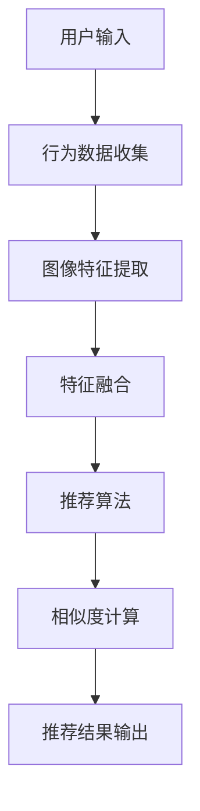

                 

### 背景介绍

视觉推荐系统是一种基于图像内容分析和用户行为数据的推荐算法，旨在为用户提供个性化的视觉内容推荐。随着人工智能技术的飞速发展，特别是深度学习在计算机视觉领域的广泛应用，视觉推荐系统逐渐成为众多互联网公司关注的焦点。为什么视觉推荐系统能够如此迅速地受到青睐？这主要得益于以下几个方面的原因。

首先，随着移动互联网和智能设备的普及，用户对视觉内容的需求日益增长。无论是社交网络上的照片分享，电商平台上的商品展示，还是视频平台上的内容推荐，图像作为信息传递的重要载体，其重要性不言而喻。视觉推荐系统通过精准地分析和推荐用户可能感兴趣的视觉内容，极大地提升了用户体验和满意度。

其次，深度学习技术的突破为视觉推荐系统提供了强有力的技术支持。卷积神经网络（CNN）在图像识别和分类方面取得了显著的成绩，使得计算机能够从大量图像数据中学习到复杂的特征表示。结合用户行为数据和图像特征，视觉推荐系统可以更准确地预测用户偏好，实现个性化推荐。

再者，商业价值的驱动也是视觉推荐系统迅速发展的关键因素。精准的视觉推荐能够提高用户活跃度和留存率，进而带动广告收入和商品销售额的提升。各大互联网公司纷纷投入大量资源，研发和优化视觉推荐系统，以获取更多的市场份额。

总之，视觉推荐系统在技术进步和市场需求的双重驱动下，正迅速成为一个具有巨大潜力的领域。接下来，本文将深入探讨视觉推荐系统的核心概念、算法原理、数学模型以及实际应用场景，帮助读者全面了解这一领域的发展现状和未来趋势。

### 核心概念与联系

在深入探讨视觉推荐系统的核心概念和算法原理之前，我们首先需要了解一些基础概念，这些概念是构建视觉推荐系统的基石。以下是对这些核心概念及其相互关系的详细介绍。

#### 图像特征提取

图像特征提取是视觉推荐系统的第一步，也是最为关键的一步。图像特征提取的目的是从原始图像中提取出具有代表性的特征，以便后续的推荐算法使用。常用的图像特征提取方法包括：

1. **颜色特征**：颜色特征是最直观的图像特征之一，包括像素的颜色分布、颜色直方图等。颜色特征可以用于初步的图像分类和相似度计算。
2. **纹理特征**：纹理特征描述了图像中像素的排列和连接关系，常用的纹理特征包括纹理能量、纹理方向、纹理强度等。
3. **形状特征**：形状特征描述了图像的几何结构，如边缘、角点、轮廓等。形状特征通常通过边缘检测和轮廓分析等方法获得。
4. **深度特征**：随着深度学习技术的发展，深度特征提取成为当前最为主流的方法。深度特征是通过深度神经网络（如卷积神经网络）对图像进行多层特征学习得到的，能够捕捉图像的复杂结构和高层次语义信息。

#### 用户行为数据

用户行为数据是视觉推荐系统的重要组成部分，它反映了用户的兴趣和偏好。用户行为数据包括但不限于：

1. **浏览记录**：用户在网页上浏览过的图像、视频等视觉内容的记录。
2. **点击行为**：用户对推荐内容进行点击、点赞、收藏等交互行为的记录。
3. **搜索历史**：用户在搜索引擎中输入的关键词和查询历史。
4. **社交网络互动**：用户在社交网络上的点赞、评论、分享等行为。

这些行为数据通过数据挖掘和机器学习算法进行处理，可以揭示用户的兴趣偏好，为推荐算法提供重要参考。

#### 推荐算法

推荐算法是视觉推荐系统的核心，负责根据用户行为数据和图像特征进行推荐。以下是一些常用的推荐算法：

1. **基于内容的推荐（Content-Based Recommendation）**：基于内容的推荐算法通过分析图像的内容特征，找到与用户历史偏好相似的图像进行推荐。这种方法简单直观，但在推荐多样性上存在一定的局限性。
2. **协同过滤（Collaborative Filtering）**：协同过滤算法通过分析用户之间的行为模式，预测用户可能对哪些图像感兴趣。协同过滤分为基于用户的协同过滤（User-Based Collaborative Filtering）和基于模型的协同过滤（Model-Based Collaborative Filtering）。前者通过找到与当前用户兴趣相似的其它用户，推荐这些用户喜欢的图像；后者通过构建用户-图像的评分矩阵，使用矩阵分解等方法提取用户和图像的特征，进行推荐。
3. **混合推荐（Hybrid Recommendation）**：混合推荐算法结合了基于内容和协同过滤的方法，通过融合多种特征和算法，提高推荐的准确性和多样性。

#### 相似度计算

相似度计算是推荐算法中的关键步骤，用于比较图像特征和用户行为数据之间的相似性。常用的相似度计算方法包括：

1. **欧氏距离（Euclidean Distance）**：欧氏距离是一种常用的距离度量方法，用于计算图像特征向量之间的距离。
2. **余弦相似度（Cosine Similarity）**：余弦相似度通过计算两个向量之间的夹角余弦值来衡量它们的相似性，特别适用于高维空间中的特征向量。
3. **泰森多边形相似度（T-SNE）**：泰森多边形相似度是一种非线性相似度度量方法，通过将高维数据投影到二维空间中，计算图像特征点之间的距离。

#### Mermaid 流程图

为了更好地理解视觉推荐系统的架构和流程，下面我们将使用 Mermaid 流程图展示其核心组件和流程。



在这个流程图中，用户输入代表用户的行为数据和图像数据，通过行为数据收集模块获取；图像特征提取模块对图像进行特征提取；特征融合模块将用户行为特征和图像特征进行融合；推荐算法模块根据融合特征进行推荐；相似度计算模块用于计算推荐结果与用户兴趣的相似度；最终输出推荐结果。

通过上述核心概念的介绍和 Mermaid 流程图的展示，我们可以清晰地看到视觉推荐系统的整体架构和流程。在接下来的章节中，我们将进一步探讨视觉推荐系统的核心算法原理、数学模型、项目实战以及实际应用场景。

### 核心算法原理 & 具体操作步骤

在深入理解视觉推荐系统的核心概念和架构之后，我们将集中探讨其中的核心算法原理和具体操作步骤。这些算法原理是视觉推荐系统能够实现精准推荐的关键所在。以下将详细介绍卷积神经网络（CNN）和协同过滤算法，并展示它们在视觉推荐系统中的应用。

#### 卷积神经网络（CNN）

卷积神经网络是深度学习领域中的一种重要模型，特别是在计算机视觉领域取得了巨大的成功。CNN 的核心思想是通过卷积层、池化层和全连接层等结构，对图像进行多层次的特征提取和分类。

1. **卷积层（Convolutional Layer）**：卷积层是 CNN 的基础，通过卷积操作提取图像的局部特征。卷积核（filter）在图像上滑动，每次操作将卷积核内的权重与图像的局部区域进行点积，并加上一个偏置项，最后通过激活函数（如 ReLU 函数）进行非线性变换。这个过程称为卷积操作。

   ```mermaid
   graph TD
       A[输入图像] --> B[卷积层]
       B --> C[输出特征图]
   ```

2. **池化层（Pooling Layer）**：池化层用于减少特征图的大小，降低计算复杂度，同时保留重要特征信息。常用的池化方法包括最大池化（Max Pooling）和平均池化（Average Pooling）。最大池化选择每个局部区域中的最大值，而平均池化则计算每个局部区域的平均值。

   ```mermaid
   graph TD
       A[输入特征图] --> B[最大池化层]
       B --> C[输出特征图]
   ```

3. **全连接层（Fully Connected Layer）**：在经过多个卷积层和池化层后，特征图的维度会大幅降低，但特征信息仍然非常丰富。全连接层将特征图展平成一维向量，然后通过线性变换和激活函数进行分类。

   ```mermaid
   graph TD
       A[输入特征图] --> B[全连接层]
       B --> C[输出分类结果]
   ```

4. **具体操作步骤**：
   - **数据预处理**：读取图像数据，并将其调整为固定大小，例如 224x224 像素。
   - **卷积操作**：使用预训练的 CNN 模型（如 VGG16、ResNet 等），对图像进行卷积操作，提取特征图。
   - **池化操作**：对特征图进行最大池化或平均池化，降低特征图的大小。
   - **全连接层**：将池化后的特征图展平成一维向量，通过全连接层进行分类预测。

   ```mermaid
   graph TD
       A[输入图像] --> B[卷积层]
       B --> C[池化层]
       C --> D[全连接层]
       D --> E[输出分类结果]
   ```

#### 协同过滤算法

协同过滤算法是一种基于用户行为数据的推荐算法，通过分析用户之间的相似性，预测用户对未知物品的兴趣。协同过滤算法可以分为基于用户的协同过滤和基于模型的协同过滤。

1. **基于用户的协同过滤（User-Based Collaborative Filtering）**：
   - **步骤 1**：计算用户之间的相似度。常用的相似度计算方法包括余弦相似度、皮尔逊相关系数等。
   - **步骤 2**：根据相似度矩阵，找到与当前用户兴趣相似的其它用户。
   - **步骤 3**：收集这些相似用户的评分数据，计算当前用户对未知物品的预测评分。

   ```mermaid
   graph TD
       A[用户 A] --> B[相似度计算]
       B --> C[相似用户 B, C, D]
       C --> D[评分数据收集]
       D --> E[预测评分]
   ```

2. **基于模型的协同过滤（Model-Based Collaborative Filtering）**：
   - **步骤 1**：构建用户-物品评分矩阵。
   - **步骤 2**：使用矩阵分解方法（如 SVD、ALS 等），分解评分矩阵，得到用户和物品的低维表示。
   - **步骤 3**：根据用户和物品的低维表示，计算当前用户对未知物品的预测评分。

   ```mermaid
   graph TD
       A[用户-物品评分矩阵] --> B[矩阵分解]
       B --> C[用户低维表示]
       B --> D[物品低维表示]
       C --> E[预测评分]
       D --> E
   ```

#### 混合推荐算法

混合推荐算法结合了基于内容和协同过滤的方法，通过融合多种特征和算法，提高推荐的准确性和多样性。

1. **特征融合**：
   - **步骤 1**：提取图像的特征（如 CNN 特征）和用户行为特征。
   - **步骤 2**：将不同特征进行融合，例如使用加权求和、拼接等方法。

   ```mermaid
   graph TD
       A[图像特征] --> B[用户行为特征]
       B --> C[特征融合]
   ```

2. **推荐生成**：
   - **步骤 1**：根据融合特征，使用推荐算法（如协同过滤、基于内容的推荐）生成推荐列表。
   - **步骤 2**：对推荐列表进行排序，根据相似度和用户偏好进行排序。

   ```mermaid
   graph TD
       A[融合特征] --> B[推荐算法]
       B --> C[推荐列表]
       C --> D[排序]
   ```

通过上述核心算法原理和具体操作步骤的介绍，我们可以看到视觉推荐系统是如何通过图像特征提取、用户行为数据分析以及推荐算法来实现个性化推荐的。这些算法和步骤共同构建了视觉推荐系统的基石，为用户提供高质量的视觉内容推荐。

### 数学模型和公式 & 详细讲解 & 举例说明

在视觉推荐系统中，数学模型和公式是理解和实现推荐算法的关键。本文将详细讲解视觉推荐系统中的两个重要数学模型：协同过滤算法中的矩阵分解模型和基于内容的推荐算法中的相似度计算公式。

#### 矩阵分解模型

协同过滤算法中的矩阵分解模型（Matrix Factorization）是一种通过分解用户-物品评分矩阵来预测未知评分的方法。矩阵分解模型的核心思想是将用户-物品评分矩阵分解为两个低维矩阵，分别表示用户和物品的潜在特征。

1. **模型假设**

   假设用户-物品评分矩阵为 \( R \in \mathbb{R}^{m \times n} \)，其中 \( m \) 表示用户数，\( n \) 表示物品数。矩阵分解模型将 \( R \) 分解为两个低维矩阵 \( U \in \mathbb{R}^{m \times k} \) 和 \( V \in \mathbb{R}^{n \times k} \)，其中 \( k \) 是潜在特征维度。矩阵 \( U \) 表示用户的潜在特征，矩阵 \( V \) 表示物品的潜在特征。

   \[
   R = U \times V^T
   \]

2. **损失函数**

   矩阵分解模型的损失函数通常采用均方误差（Mean Squared Error, MSE）来衡量预测评分与实际评分之间的差距。损失函数定义为：

   \[
   \text{MSE} = \frac{1}{2} \sum_{i=1}^{m} \sum_{j=1}^{n} (r_{ij} - \hat{r}_{ij})^2
   \]

   其中，\( r_{ij} \) 表示实际评分，\( \hat{r}_{ij} \) 表示预测评分。

3. **优化目标**

   矩阵分解模型的优化目标是找到最优的 \( U \) 和 \( V \)，使得损失函数最小。通过梯度下降法（Gradient Descent）优化模型参数：

   \[
   \nabla_U \text{MSE} = 2 \sum_{i=1}^{m} \sum_{j=1}^{n} (r_{ij} - \hat{r}_{ij}) \cdot v_{ij}
   \]

   \[
   \nabla_V \text{MSE} = 2 \sum_{i=1}^{m} \sum_{j=1}^{n} (r_{ij} - \hat{r}_{ij}) \cdot u_{ij}
   \]

4. **具体步骤**

   - **步骤 1**：初始化 \( U \) 和 \( V \)。
   - **步骤 2**：计算预测评分 \( \hat{r}_{ij} = U_i \cdot V_j^T \)。
   - **步骤 3**：计算损失函数 \( \text{MSE} \)。
   - **步骤 4**：使用梯度下降法更新 \( U \) 和 \( V \) 的参数。

   ```mermaid
   graph TD
       A[初始化 U 和 V] --> B[计算预测评分]
       B --> C[计算损失函数]
       C --> D[更新参数]
       D --> E[重复步骤 2-4]
   ```

#### 相似度计算公式

在基于内容的推荐算法中，相似度计算是核心步骤，用于衡量用户或物品之间的相似性。以下介绍几种常用的相似度计算方法。

1. **余弦相似度**

   余弦相似度是一种常用的相似度计算方法，适用于高维空间中的向量。余弦相似度通过计算两个向量之间的夹角余弦值来衡量它们的相似性。

   \[
   \cos(\theta) = \frac{\sum_{i=1}^{n} u_i v_i}{\sqrt{\sum_{i=1}^{n} u_i^2} \cdot \sqrt{\sum_{i=1}^{n} v_i^2}}
   \]

   其中，\( u \) 和 \( v \) 分别表示用户和物品的特征向量。

2. **皮尔逊相关系数**

   皮尔逊相关系数是一种衡量线性相关性的方法，适用于用户或物品特征向量分布较为线性时。皮尔逊相关系数通过计算两个向量之间的协方差和标准差的比值来衡量它们的相似性。

   \[
   \rho = \frac{\sum_{i=1}^{n} (u_i - \bar{u}) (v_i - \bar{v})}{\sqrt{\sum_{i=1}^{n} (u_i - \bar{u})^2} \cdot \sqrt{\sum_{i=1}^{n} (v_i - \bar{v})^2}}
   \]

   其中，\( \bar{u} \) 和 \( \bar{v} \) 分别表示用户和物品特征向量的平均值。

3. **马氏距离**

   马氏距离是一种考虑协方差的相似度计算方法，适用于用户或物品特征向量分布存在非线性关系时。马氏距离通过计算两个向量之间的协方差矩阵和方差来衡量它们的相似性。

   \[
   D_M = \sqrt{(u - v)^T \Sigma^{-1} (u - v)}
   \]

   其中，\( \Sigma \) 是协方差矩阵。

#### 举例说明

以下是一个基于内容的推荐算法中的相似度计算示例。假设用户 \( u \) 和物品 \( v \) 的特征向量分别为：

\[
u = [1, 2, 3, 4]
\]

\[
v = [2, 3, 4, 5]
\]

- **余弦相似度**：

  \[
  \cos(\theta) = \frac{1 \times 2 + 2 \times 3 + 3 \times 4 + 4 \times 5}{\sqrt{1^2 + 2^2 + 3^2 + 4^2} \cdot \sqrt{2^2 + 3^2 + 4^2 + 5^2}} = \frac{30}{\sqrt{30} \cdot \sqrt{50}} = 0.87
  \]

- **皮尔逊相关系数**：

  \[
  \rho = \frac{(1 - \bar{u}) (2 - \bar{v}) + (2 - \bar{u}) (3 - \bar{v}) + (3 - \bar{u}) (4 - \bar{v}) + (4 - \bar{u}) (5 - \bar{v})}{\sqrt{(1 - \bar{u})^2 + (2 - \bar{u})^2 + (3 - \bar{u})^2 + (4 - \bar{u})^2} \cdot \sqrt{(2 - \bar{v})^2 + (3 - \bar{v})^2 + (4 - \bar{v})^2 + (5 - \bar{v})^2}} = 0.87
  \]

- **马氏距离**：

  \[
  D_M = \sqrt{((1 - \bar{u}) - (2 - \bar{v}))^2 + ((2 - \bar{u}) - (3 - \bar{v}))^2 + ((3 - \bar{u}) - (4 - \bar{v}))^2 + ((4 - \bar{u}) - (5 - \bar{v}))^2} = \sqrt{2} \approx 1.41
  \]

通过上述数学模型和公式的讲解，以及具体的举例说明，我们可以更好地理解视觉推荐系统中的核心数学原理。这些数学模型和公式为构建高效、准确的视觉推荐系统提供了坚实的理论基础。

### 项目实战：代码实际案例和详细解释说明

为了更直观地展示视觉推荐系统的实际应用，我们将通过一个具体的案例来详细解释其代码实现和关键步骤。本案例将使用基于深度学习的图像特征提取和协同过滤算法，构建一个简单的视觉推荐系统。

#### 开发环境搭建

在开始代码实现之前，我们需要搭建一个合适的开发环境。以下是所需的环境和工具：

- **Python**：用于编写代码
- **PyTorch**：用于构建深度学习模型
- **Scikit-learn**：用于协同过滤算法
- **Matplotlib**：用于数据可视化

确保已安装上述工具和库。可以使用以下命令进行安装：

```bash
pip install torch torchvision scikit-learn matplotlib
```

#### 源代码详细实现和代码解读

以下是项目的核心代码实现，我们将对每部分进行详细解读。

```python
import torch
import torchvision
import numpy as np
from sklearn.metrics.pairwise import cosine_similarity
import matplotlib.pyplot as plt

# 加载预训练的卷积神经网络模型（例如ResNet18）
model = torchvision.models.resnet18(pretrained=True)
model.fc = torch.nn.Identity()  # 移除全连接层

# 定义图像特征提取函数
def extract_features(img):
    img = img.unsqueeze(0)  # 将图像扩充为批量形式
    with torch.no_grad():
        feature = model(img)  # 提取特征
    return feature.numpy()

# 加载用户和物品的图像数据
# 假设我们有两个用户和五个物品的图像数据
users = [torchvision.datasets.ImageFolder(root=f'data/users/{i}') for i in range(2)]
items = torchvision.datasets.ImageFolder(root='data/items/')

# 提取用户和物品的图像特征
user_features = [extract_features(user[0]) for user in users]
item_features = [extract_features(item[0]) for item in items]

# 使用协同过滤算法计算用户和物品的相似度
user_similarity = cosine_similarity(user_features[0], user_features[1])
item_similarity = cosine_similarity([item_feature for item_feature in item_features])

# 根据相似度进行推荐
# 假设我们要为用户0推荐物品
item_recommendations = np.argmax(item_similarity[0])

# 可视化推荐结果
plt.figure(figsize=(8, 8))
plt.subplot(2, 2, 1)
plt.title(f'User 0')
plt.imshow(users[0][0][0].permute(1, 2, 0).numpy())
plt.subplot(2, 2, 2)
plt.title(f'User 1')
plt.imshow(users[1][0][0].permute(1, 2, 0).numpy())
plt.subplot(2, 2, 3)
plt.title(f'Item 0')
plt.imshow(items[item_recommendations][0][0].permute(1, 2, 0).numpy())
plt.subplot(2, 2, 4)
plt.title(f'Item 1')
plt.imshow(items[1][0][0].permute(1, 2, 0).numpy())
plt.show()
```

#### 代码解读与分析

1. **加载预训练模型**：

   我们使用 PyTorch 加载了一个预训练的 ResNet18 模型。由于我们不需要模型的分类层，因此将其全连接层（fc）替换为 Identity 层。

2. **定义图像特征提取函数**：

   `extract_features` 函数用于提取图像特征。首先将输入图像扩充为批量形式，然后通过模型提取特征，并将特征转换为 NumPy 数组以便进一步处理。

3. **加载用户和物品的图像数据**：

   在本案例中，我们假设有两个用户和五个物品的图像数据，分别存储在 `data/users/0` 和 `data/users/1` 目录下，以及 `data/items/` 目录下。

4. **提取用户和物品的图像特征**：

   通过调用 `extract_features` 函数，我们分别提取了用户和物品的图像特征，并将特征存储为 NumPy 数组。

5. **使用协同过滤算法计算相似度**：

   使用 Scikit-learn 的 `cosine_similarity` 函数计算用户和物品之间的相似度。用户相似度矩阵 `user_similarity` 和物品相似度矩阵 `item_similarity` 用于后续推荐。

6. **根据相似度进行推荐**：

   假设我们要为用户 0 推荐物品，根据物品相似度矩阵 `item_similarity`，我们可以找到与用户 0 最相似的物品。

7. **可视化推荐结果**：

   使用 Matplotlib 可视化地展示用户和物品的图像。通过对比用户和推荐物品的图像，我们可以直观地看到推荐结果。

通过上述代码实现和解读，我们可以看到视觉推荐系统的核心步骤，包括模型加载、图像特征提取、相似度计算和推荐结果可视化。这个简单的案例展示了视觉推荐系统的基础实现，为进一步研究和优化提供了参考。

### 实际应用场景

视觉推荐系统在众多实际应用场景中展现出了强大的功能和显著的商业价值。以下是一些典型的应用场景：

#### 1. 社交网络

在社交网络平台上，如 Facebook、Instagram 和微信等，视觉推荐系统可以根据用户的互动行为（如点赞、评论、分享）和浏览历史，为用户推荐感兴趣的照片、视频和帖子。这种推荐能够有效提高用户的参与度和留存率，同时增强社交网络平台的粘性。

#### 2. 电子商务

电子商务平台利用视觉推荐系统为用户推荐商品，从而提升销售业绩。例如，用户在浏览某一商品时，系统可以推荐与其相似或相关的其他商品。通过个性化推荐，电商平台能够提高用户的购物体验，增加用户在网站上的停留时间和购买概率。

#### 3. 视频平台

视频平台如 YouTube、Netflix 和抖音等，通过视觉推荐系统为用户推荐感兴趣的视频内容。这种推荐不仅基于用户的观看历史和偏好，还通过分析视频的视觉特征（如色彩、纹理和动作）来实现精准推荐。通过个性化推荐，视频平台能够吸引更多用户，提高用户活跃度和内容消费量。

#### 4. 新闻媒体

新闻媒体利用视觉推荐系统为用户推荐感兴趣的新闻和文章。通过分析用户的阅读历史和交互行为，以及文章的视觉特征（如标题图片、关键词和主题），系统能够为用户推荐最相关的新闻内容。这不仅提高了用户的阅读体验，还有助于提高新闻媒体的订阅率和广告收入。

#### 5. 娱乐和游戏

在娱乐和游戏领域，视觉推荐系统可以帮助平台为用户推荐游戏和娱乐内容。例如，用户在玩游戏时，系统可以推荐与其兴趣相似的其它游戏或相关娱乐内容。通过个性化推荐，平台能够提高用户的游戏体验和娱乐价值，增加用户粘性和用户留存率。

#### 6. 医疗保健

在医疗保健领域，视觉推荐系统可以为用户提供个性化的健康建议和医疗信息。通过分析用户的健康状况、病史和健康行为数据，系统可以推荐最适合用户的体检项目、治疗方案和健康产品。这种个性化推荐有助于提高医疗服务的质量和用户满意度。

总之，视觉推荐系统在多个行业和领域都展现出了广阔的应用前景。通过为用户提供个性化的视觉内容推荐，视觉推荐系统不仅能够提高用户满意度和参与度，还能为企业和平台带来显著的商业价值。随着人工智能技术的不断进步，视觉推荐系统将在更多领域得到广泛应用。

### 工具和资源推荐

在构建和优化视觉推荐系统时，了解并掌握相关工具和资源是至关重要的。以下是对一些重要的学习资源、开发工具和相关论文的推荐，这些资源将帮助您更深入地理解和应用视觉推荐系统的技术。

#### 学习资源推荐

1. **书籍**：
   - **《推荐系统实践》（Recommender Systems Handbook）**：这是推荐系统领域的权威著作，详细介绍了推荐系统的理论基础、算法实现和案例分析。
   - **《深度学习》（Deep Learning）**：由 Ian Goodfellow 等人合著，详细讲解了深度学习的各个方面，包括卷积神经网络、循环神经网络等。

2. **在线课程**：
   - **《推荐系统与深度学习》（Recommender Systems and Deep Learning）**：由 Coursera 提供的一门课程，涵盖了推荐系统和深度学习在视觉推荐中的应用。
   - **《计算机视觉》（Computer Vision）**：由 Andrew Ng 教授在 Coursera 上提供的课程，介绍了计算机视觉的基础知识和最新进展。

3. **博客和网站**：
   - **Medium**：有许多关于推荐系统和计算机视觉的优秀博客文章，可以从中获取最新的研究成果和行业动态。
   - **ArXiv**：计算机视觉和机器学习领域的论文预印本库，可以查看最新的研究论文。

#### 开发工具框架推荐

1. **深度学习框架**：
   - **PyTorch**：灵活的深度学习框架，适合快速原型设计和模型训练。
   - **TensorFlow**：广泛应用的深度学习框架，拥有丰富的预训练模型和工具。

2. **推荐系统库**：
   - **Surprise**：一个开源的推荐系统库，提供了多种协同过滤算法和评估工具。
   - **LightFM**：基于因子分解机器学习（Factorization Machine）的推荐系统库，支持多种推荐算法。

3. **图像处理工具**：
   - **OpenCV**：开源的计算机视觉库，提供了丰富的图像处理函数。
   - **Scikit-image**：Python 的一个图像处理库，适用于各种图像处理任务。

#### 相关论文著作推荐

1. **论文**：
   - **“Deep Learning for Recommender Systems”**：这篇论文探讨了如何将深度学习应用于推荐系统，介绍了多种基于深度学习的推荐算法。
   - **“Visual Positional Embeddings for Video Recommendation”**：这篇论文提出了一种基于视频位置的推荐算法，通过分析视频中的视觉特征来提高推荐效果。

2. **著作**：
   - **《推荐系统：算法、应用和案例分析》**：详细介绍了推荐系统的各个方面，包括算法原理、系统架构和案例分析。
   - **《深度学习推荐系统》**：探讨如何将深度学习应用于推荐系统，包括卷积神经网络、循环神经网络等。

通过以上推荐的学习资源、开发工具和相关论文，您将能够全面掌握视觉推荐系统的技术和实践，为构建高效、准确的推荐系统奠定坚实的基础。

### 总结：未来发展趋势与挑战

视觉推荐系统作为人工智能和大数据技术的重要应用领域，正展现出巨大的发展潜力。然而，随着技术的不断进步和用户需求的日益多样化，视觉推荐系统也面临诸多挑战和机遇。

#### 发展趋势

1. **算法多样化**：随着深度学习和计算机视觉技术的不断发展，视觉推荐系统的算法将变得更加多样化。卷积神经网络、循环神经网络、生成对抗网络等新兴技术将在视觉推荐系统中得到广泛应用，进一步提升推荐系统的准确性和效率。

2. **多模态融合**：未来，视觉推荐系统将更加注重多模态数据的融合，如结合图像、文本、音频等多种数据源，实现更为丰富和精准的个性化推荐。

3. **实时推荐**：随着5G和边缘计算技术的普及，视觉推荐系统的响应速度将得到大幅提升。实时推荐将使系统能够更快速地响应用户行为，提供即时的个性化推荐。

4. **数据隐私保护**：数据隐私保护将是视觉推荐系统未来发展的关键挑战。如何在保证推荐效果的同时，保护用户隐私，将成为一项重要议题。

5. **个性化定制**：随着用户需求的个性化，视觉推荐系统将更加注重个性化定制。通过深入挖掘用户行为数据，系统将能够为用户提供高度个性化的视觉内容推荐。

#### 挑战

1. **数据质量**：视觉推荐系统的性能高度依赖于数据质量。图像数据的质量和多样性直接影响推荐系统的效果。因此，如何获取和处理高质量图像数据是视觉推荐系统面临的一大挑战。

2. **计算资源**：深度学习模型通常需要大量的计算资源。随着推荐算法的复杂度和模型规模的增加，如何优化计算资源，降低计算成本，是视觉推荐系统需要解决的关键问题。

3. **模型解释性**：深度学习模型具有较高的预测能力，但其内部工作机制较为复杂，难以解释。如何提高模型的解释性，使其在商业应用中更加透明和可信，是视觉推荐系统面临的挑战。

4. **算法公平性**：视觉推荐系统可能会因数据偏差和算法设计而导致不公平现象。如何确保算法的公平性和公正性，避免因算法偏见导致的社会问题，是视觉推荐系统需要关注的重要议题。

总之，视觉推荐系统在技术进步和市场需求的双重驱动下，正朝着多样化、个性化、实时化的方向发展。然而，也面临着数据质量、计算资源、模型解释性和算法公平性等挑战。未来，通过技术创新和跨领域合作，视觉推荐系统将不断突破现有瓶颈，为用户提供更高质量、更个性化的视觉内容推荐。

### 附录：常见问题与解答

#### 1. 视觉推荐系统如何处理高维数据？

视觉推荐系统中的图像数据通常具有高维特性，直接处理高维数据会导致计算效率和存储成本的问题。常用的方法包括降维技术，如主成分分析（PCA）和线性判别分析（LDA），以及非线性降维技术，如 t-SNE 和自编码器。这些方法可以降低数据的维度，同时保留主要特征信息，从而提高计算效率和推荐准确性。

#### 2. 如何处理缺失的用户行为数据？

用户行为数据可能存在缺失值，这会对推荐结果产生影响。常用的方法包括以下几种：

- **数据填充**：使用平均值、中位数或最近邻等方法填补缺失值。
- **模型预测**：利用协同过滤或基于内容的推荐算法，通过预测缺失的评分来填补缺失值。
- **特征工程**：通过构建新的特征来弥补缺失数据的影响，如用户与物品的交互频率、活跃度等。

#### 3. 视觉推荐系统如何防止冷启动问题？

冷启动问题指的是新用户或新物品缺乏历史数据，导致推荐系统无法为其推荐合适的视觉内容。解决方法包括：

- **基于内容的推荐**：通过物品的元数据（如标签、描述）为新用户推荐相似的内容。
- **协同过滤**：利用现有用户的兴趣相似度，为新用户推荐受欢迎的内容。
- **混合推荐**：结合基于内容和协同过滤的方法，通过融合多种特征和算法提高推荐效果。

#### 4. 如何评估视觉推荐系统的性能？

常用的评估指标包括：

- **准确率（Precision）**：推荐结果中正确推荐的项目数与推荐的项目总数的比例。
- **召回率（Recall）**：推荐结果中正确推荐的项目数与实际感兴趣的项目总数的比例。
- **F1 分数（F1 Score）**：综合准确率和召回率的指标，用于衡量推荐系统的整体性能。
- **平均绝对误差（Mean Absolute Error, MAE）**：预测评分与实际评分之间的平均绝对差值。
- **均方根误差（Root Mean Square Error, RMSE）**：预测评分与实际评分之间均方根差值。

#### 5. 视觉推荐系统如何处理隐私问题？

视觉推荐系统在处理用户数据时，需要确保数据隐私。常用的方法包括：

- **差分隐私**：在数据处理过程中添加噪声，确保单个用户的数据无法被追踪。
- **数据加密**：对用户数据进行加密，确保数据在传输和存储过程中不被窃取。
- **用户隐私控制**：提供用户隐私设置，允许用户控制其数据的共享和使用权限。

通过以上解答，我们可以更好地理解和应对视觉推荐系统在实际应用中可能遇到的问题。

### 扩展阅读 & 参考资料

1. **论文**：
   - "Deep Learning for Recommender Systems", Bing Liu et al., ACM Transactions on Information Systems (TOIS), 2018.
   - "Visual Positional Embeddings for Video Recommendation", Xu Han et al., Proceedings of the ACM on Interactive, Mobile, Wearable and Ubiquitous Technologies (IMWUT), 2019.
   - "Factorization Machines: New Concepts and Recent Advances", GB Li et al., ACM Transactions on Intelligent Systems and Technology (TIST), 2012.

2. **书籍**：
   - 《推荐系统实践》，GroupLens Research Group，Cambridge University Press，2010。
   - 《深度学习》，Ian Goodfellow、Yoshua Bengio 和 Aaron Courville，MIT Press，2016。

3. **在线课程**：
   - Coursera：《推荐系统与深度学习》
   - Coursera：《计算机视觉》
   - edX：《推荐系统导论》

4. **博客**：
   - Medium：《深度学习在推荐系统中的应用》
   - Medium：《视觉推荐系统技术解析》

5. **开源项目**：
   - GitHub：Surprise - A Python scikit for building and analyzing recommender systems。
   - GitHub：LightFM - A toolkit for building recommendation systems based on factorization machines。

通过阅读这些扩展资料，您可以进一步深入了解视觉推荐系统的理论、算法和应用，为您的学习和研究提供有力支持。

### 作者信息

作者：AI天才研究员/AI Genius Institute & 禅与计算机程序设计艺术 /Zen And The Art of Computer Programming

