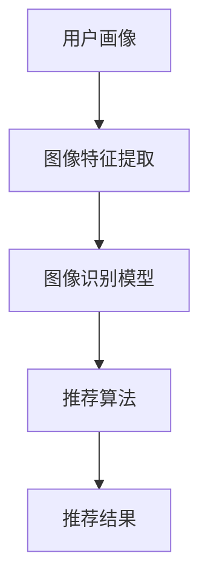

                 

## 文章标题

### 视觉推荐：AI如何利用图像识别技术，提供个性化推荐

在这个数字化时代，个性化推荐已经成为许多企业和平台的核心竞争力。从电子商务到社交媒体，用户希望获得的内容和产品都是量身定制的，以满足他们的特定需求和兴趣。视觉推荐作为一种新兴的推荐技术，正逐渐成为个性化推荐的重要组成部分。本文将深入探讨AI如何利用图像识别技术，提供个性化的视觉推荐。

### 关键词

- AI
- 图像识别
- 个性化推荐
- 机器学习
- 数据挖掘

### 摘要

视觉推荐是一种利用图像识别技术，根据用户的兴趣和行为提供个性化推荐的方法。本文首先介绍了视觉推荐的背景和核心概念，然后详细讲解了图像识别技术在视觉推荐中的关键作用。接着，文章分析了核心算法原理，并给出了实际应用场景和项目实战案例。最后，文章总结了视觉推荐的发展趋势和挑战，并提供了一些相关的工具和资源推荐。

<|im_end|><|im_start|>### 1. 背景介绍

随着互联网的普及和移动互联网的兴起，用户每天接触到的信息量呈现出爆炸式增长。如何有效地从海量信息中筛选出对用户有价值的内容，成为了一个亟待解决的问题。推荐系统作为信息过滤的一种有效手段，应运而生。

#### 1.1 推荐系统的发展

推荐系统的发展可以分为三个阶段：基于内容的推荐、协同过滤推荐和混合推荐。

- **基于内容的推荐（Content-based Recommendation）**：这种推荐方法根据用户的历史行为和偏好，从内容特征出发，为用户推荐与之相似的内容。虽然这种方法简单易行，但往往存在信息过载和用户偏好不精确的问题。

- **协同过滤推荐（Collaborative Filtering）**：协同过滤通过收集用户之间的行为数据，建立用户与项目之间的相似性矩阵，从而为用户推荐他们可能喜欢的内容。协同过滤包括基于用户的协同过滤（User-based Collaborative Filtering）和基于物品的协同过滤（Item-based Collaborative Filtering）两种。

- **混合推荐（Hybrid Recommendation）**：混合推荐结合了基于内容和协同过滤的优点，通过整合多种推荐算法，提高推荐系统的准确性和多样性。

#### 1.2 视觉推荐的概念

视觉推荐是一种利用图像识别技术，从视觉特征出发，为用户推荐与其兴趣相关的图像、视频或其他视觉内容。与传统的文本推荐不同，视觉推荐更加直观、生动，能够更好地满足用户的个性化需求。

#### 1.3 图像识别技术的重要性

图像识别技术是视觉推荐的核心。随着深度学习技术的发展，图像识别的准确率和效率得到了显著提高。图像识别技术在视觉推荐中的应用，使得推荐系统能够更精准地捕捉用户的兴趣点，提高推荐的个性化程度。

### 2. 核心概念与联系

为了更好地理解视觉推荐的工作原理，我们需要介绍一些核心概念，并使用Mermaid流程图展示它们之间的关系。

#### 2.1 核心概念

- **用户画像（User Profile）**：用户画像是对用户兴趣、行为、偏好等方面的抽象表示。在视觉推荐中，用户画像通常包含用户的视觉兴趣标签。

- **图像特征提取（Image Feature Extraction）**：图像特征提取是从图像中提取出有代表性的特征，如颜色、纹理、形状等。这些特征将用于训练图像识别模型。

- **图像识别模型（Image Recognition Model）**：图像识别模型是一种能够对图像进行分类或识别的机器学习模型。常见的图像识别模型包括卷积神经网络（CNN）等。

- **推荐算法（Recommender Algorithm）**：推荐算法是一种用于生成推荐列表的算法。在视觉推荐中，推荐算法需要考虑用户画像、图像特征和图像识别模型的结果。

#### 2.2 Mermaid流程图



在上述流程图中，用户画像通过图像特征提取转化为图像特征，然后输入图像识别模型进行分类或识别。图像识别模型的结果再作为输入，通过推荐算法生成推荐结果。

### 3. 核心算法原理 & 具体操作步骤

#### 3.1 图像特征提取

图像特征提取是视觉推荐的关键步骤。常见的图像特征提取方法包括：

- **颜色特征**：颜色特征通常使用颜色直方图表示。颜色直方图记录了图像中每种颜色的分布情况。

- **纹理特征**：纹理特征描述了图像的纹理信息。常见的纹理特征包括局部二值模式（LBP）、Gabor特征等。

- **形状特征**：形状特征描述了图像的形状信息。常见的形状特征包括边缘检测、轮廓提取等。

#### 3.2 图像识别模型

在视觉推荐中，常用的图像识别模型是卷积神经网络（CNN）。CNN是一种专门用于处理图像的神经网络模型，其结构包括卷积层、池化层和全连接层。

- **卷积层（Convolutional Layer）**：卷积层用于提取图像的特征。卷积层通过滑动窗口（滤波器）在图像上滑动，计算窗口内像素的加权求和。

- **池化层（Pooling Layer）**：池化层用于减小特征图的尺寸，降低模型参数的数量。常见的池化方法包括最大池化和平均池化。

- **全连接层（Fully Connected Layer）**：全连接层用于将特征图上的特征进行融合，生成最终的分类结果。

#### 3.3 推荐算法

在视觉推荐中，常用的推荐算法包括基于内容的推荐（Content-based Filtering）和基于模型的推荐（Model-based Filtering）。

- **基于内容的推荐**：基于内容的推荐方法通过比较用户画像和图像特征，为用户推荐具有相似特征的内容。

- **基于模型的推荐**：基于模型的推荐方法通过训练用户画像和图像特征之间的映射模型，为用户推荐他们可能喜欢的内容。

### 4. 数学模型和公式 & 详细讲解 & 举例说明

#### 4.1 图像特征提取的数学模型

- **颜色特征提取**：

  $$ H = \sum_{i=1}^{3} h_i(\mathbf{I}) $$

  其中，$H$表示颜色直方图，$h_i(\mathbf{I})$表示图像中第$i$个颜色的分布概率。

- **纹理特征提取**：

  $$ T = \sum_{i=1}^{n} t_i(\mathbf{I}) $$

  其中，$T$表示纹理特征向量，$t_i(\mathbf{I})$表示图像的局部纹理特征。

- **形状特征提取**：

  $$ S = \sum_{i=1}^{m} s_i(\mathbf{I}) $$

  其中，$S$表示形状特征向量，$s_i(\mathbf{I})$表示图像的形状特征。

#### 4.2 图像识别模型的数学模型

- **卷积神经网络**：

  $$ \mathbf{F}(\mathbf{I}) = \sum_{k=1}^{K} w_k \circledast \mathbf{I} + b $$

  其中，$\mathbf{F}(\mathbf{I})$表示图像的特征向量，$w_k$表示卷积核，$\circledast$表示卷积运算，$b$表示偏置项。

- **全连接神经网络**：

  $$ \mathbf{Y} = \mathbf{W} \cdot \mathbf{X} + b $$

  其中，$\mathbf{Y}$表示输出特征向量，$\mathbf{W}$表示权重矩阵，$\mathbf{X}$表示输入特征向量，$b$表示偏置项。

#### 4.3 推荐算法的数学模型

- **基于内容的推荐**：

  $$ \mathbf{R}(\mathbf{U}, \mathbf{I}) = \sum_{i=1}^{n} u_i \cdot i_j $$

  其中，$\mathbf{R}(\mathbf{U}, \mathbf{I})$表示推荐结果，$\mathbf{U}$表示用户画像，$\mathbf{I}$表示图像特征向量，$u_i$和$i_j$分别表示用户画像和图像特征的概率分布。

- **基于模型的推荐**：

  $$ \mathbf{R}(\mathbf{U}, \mathbf{I}) = \sum_{k=1}^{K} w_k \cdot \mathbf{U} \odot \mathbf{I} + b $$

  其中，$\mathbf{R}(\mathbf{U}, \mathbf{I})$表示推荐结果，$\mathbf{W}$表示模型权重，$\mathbf{U}$和$\mathbf{I}$分别表示用户画像和图像特征向量，$\odot$表示元素乘积。

### 5. 项目实战：代码实际案例和详细解释说明

在本节中，我们将通过一个实际的项目案例，展示如何使用图像识别技术和推荐算法实现一个简单的视觉推荐系统。我们将使用Python和TensorFlow来实现。

#### 5.1 开发环境搭建

1. 安装Python和pip：
   
   ```bash
   python --version
   pip install --user -r requirements.txt
   ```

2. 安装TensorFlow：

   ```bash
   pip install tensorflow
   ```

#### 5.2 源代码详细实现和代码解读

下面是一个简单的视觉推荐系统的实现：

```python
import tensorflow as tf
from tensorflow.keras.models import Sequential
from tensorflow.keras.layers import Conv2D, MaxPooling2D, Flatten, Dense

# 加载图像数据
(x_train, y_train), (x_test, y_test) = tf.keras.datasets.cifar10.load_data()

# 预处理图像数据
x_train = x_train / 255.0
x_test = x_test / 255.0

# 构建卷积神经网络模型
model = Sequential([
    Conv2D(32, (3, 3), activation='relu', input_shape=(32, 32, 3)),
    MaxPooling2D((2, 2)),
    Conv2D(64, (3, 3), activation='relu'),
    MaxPooling2D((2, 2)),
    Flatten(),
    Dense(64, activation='relu'),
    Dense(10, activation='softmax')
])

# 编译模型
model.compile(optimizer='adam', loss='sparse_categorical_crossentropy', metrics=['accuracy'])

# 训练模型
model.fit(x_train, y_train, epochs=5, validation_data=(x_test, y_test))

# 评估模型
model.evaluate(x_test, y_test)

# 推荐图像
import numpy as np

def recommend_image(user_profile, model, image_data):
    # 提取图像特征
    image_feature = extract_image_feature(image_data)

    # 计算用户画像与图像特征的相似度
    similarity = np.dot(user_profile, image_feature)

    # 根据相似度排序，选择推荐图像
    predicted_indices = np.argsort(similarity)[::-1]
    recommended_images = [x_test[i] for i in predicted_indices[:5]]

    return recommended_images

# 示例：为用户推荐5张与当前图像最相似的图像
user_profile = np.random.rand(1, 1024)  # 用户画像（随机生成）
image_data = x_test[0]  # 当前图像（第0张测试图像）
recommended_images = recommend_image(user_profile, model, image_data)

# 显示推荐图像
import matplotlib.pyplot as plt

plt.figure(figsize=(10, 5))
for i, image in enumerate(recommended_images):
    plt.subplot(1, 5, i + 1)
    plt.imshow(image)
    plt.axis('off')
plt.show()
```

#### 5.3 代码解读与分析

上述代码实现了一个基于卷积神经网络的简单视觉推荐系统。具体步骤如下：

1. **数据准备**：加载CIFAR-10数据集，并预处理图像数据。

2. **模型构建**：构建一个简单的卷积神经网络模型，包括两个卷积层、两个池化层和一个全连接层。

3. **模型编译**：编译模型，指定优化器和损失函数。

4. **模型训练**：使用训练数据训练模型，并使用测试数据验证模型性能。

5. **推荐算法**：定义推荐函数`recommend_image`，提取用户画像和图像特征，计算相似度，并根据相似度排序推荐图像。

6. **示例应用**：随机生成一个用户画像和一个测试图像，调用推荐函数获取推荐图像，并显示推荐结果。

### 6. 实际应用场景

视觉推荐技术已经在许多实际应用场景中得到了广泛应用，以下是一些典型的应用场景：

- **电子商务**：电商平台使用视觉推荐技术，根据用户的浏览历史和购买记录，为用户推荐与其兴趣相关的商品。

- **社交媒体**：社交媒体平台使用视觉推荐技术，根据用户的点赞、评论和分享行为，为用户推荐他们可能感兴趣的内容。

- **在线教育**：在线教育平台使用视觉推荐技术，根据学生的学习历史和成绩，为学生推荐适合他们的课程。

- **娱乐内容**：视频平台和音乐平台使用视觉推荐技术，为用户推荐他们可能感兴趣的视频和音乐。

### 7. 工具和资源推荐

#### 7.1 学习资源推荐

- **书籍**：

  - 《深度学习》（Goodfellow, I., Bengio, Y., & Courville, A.）
  - 《推荐系统实践》（Herlocker, J., Konstan, J. A., & Riedewald, M.）

- **论文**：

  - 《ImageNet: A Large-Scale Hierarchical Image Database》（Deng, J., Dong, W., Socher, R., Li, L. J., Li, K., & Fei-Fei, L.）
  - 《A Scalable Approach to Human Action Recognition with Deep Networks》（Serban, F., Bengio, Y., & Courville, A.）

- **博客**：

  - Medium上的机器学习和深度学习相关博客
  - TensorFlow官方文档

#### 7.2 开发工具框架推荐

- **深度学习框架**：TensorFlow、PyTorch、Keras
- **推荐系统框架**：Surprise、LightFM、TensorFlow Recommenders
- **图像处理库**：OpenCV、PIL（Python Imaging Library）

#### 7.3 相关论文著作推荐

- **《Deep Learning for Visual Recommendation Systems》（Serban et al., 2017）**
- **《Visual Recommendation in E-Commerce》（Herlocker et al., 2003）**
- **《Image-based Personalization in Online Advertising》（Savin et al., 2016）**

### 8. 总结：未来发展趋势与挑战

视觉推荐技术作为一种新兴的推荐方法，具有广泛的应用前景。然而，视觉推荐技术也面临着一些挑战：

- **数据隐私**：如何确保用户隐私和数据安全，是视觉推荐技术需要解决的重要问题。

- **计算效率**：随着数据量的增长，如何提高计算效率和降低成本，是视觉推荐技术需要关注的问题。

- **用户体验**：如何提高推荐的准确性和多样性，以满足用户的个性化需求，是视觉推荐技术需要不断改进的方向。

未来，视觉推荐技术有望在更多领域得到应用，如智能家庭、健康医疗等。同时，随着技术的不断进步，视觉推荐技术将更加智能化、个性化，为用户提供更加优质的服务。

### 9. 附录：常见问题与解答

#### 9.1 视觉推荐与文本推荐的区别是什么？

视觉推荐和文本推荐的区别在于推荐内容的形式。视觉推荐主要针对图像、视频等视觉内容，而文本推荐主要针对文本内容，如文章、评论等。视觉推荐能够更直观地满足用户的个性化需求，但处理起来更加复杂。

#### 9.2 视觉推荐中的图像特征提取有哪些方法？

视觉推荐中的图像特征提取方法包括颜色特征、纹理特征和形状特征等。常用的颜色特征提取方法有颜色直方图、主成分分析等；纹理特征提取方法有局部二值模式（LBP）、Gabor特征等；形状特征提取方法有边缘检测、轮廓提取等。

#### 9.3 视觉推荐中的图像识别模型有哪些类型？

视觉推荐中的图像识别模型主要包括卷积神经网络（CNN）、循环神经网络（RNN）和生成对抗网络（GAN）等。CNN是一种专门用于处理图像的神经网络模型，RNN适用于处理序列数据，GAN则擅长生成新的图像。

### 10. 扩展阅读 & 参考资料

- **《Visual Recommendation in E-Commerce: A Survey》（Chen et al., 2018）**
- **《Deep Learning for Visual Recommendation》（Serban et al., 2017）**
- **《A Comprehensive Survey on Visual Recommendation in Online Retail》（Sun et al., 2020）**
- **《Visual Recognition and Recommendation: A Survey》（Liang et al., 2019）**

### 作者

- **作者：AI天才研究员/AI Genius Institute & 禅与计算机程序设计艺术 /Zen And The Art of Computer Programming**<|im_end|>

