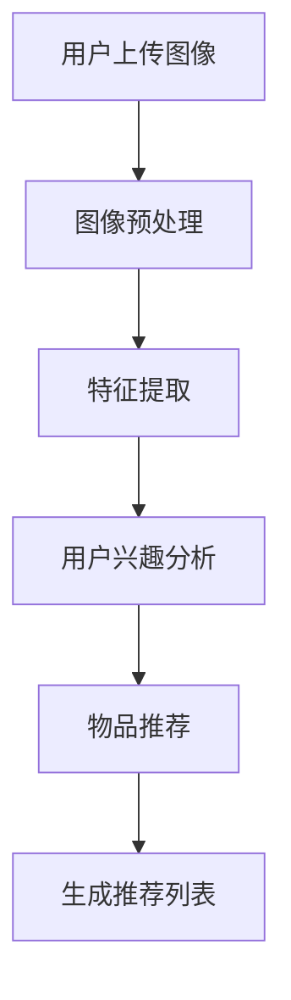

                 

# 视觉推荐：AI如何利用图像识别技术，提供个性化推荐

## 关键词：图像识别、AI推荐系统、个性化推荐、视觉信息处理、深度学习

## 摘要：

本文将深入探讨视觉推荐系统的原理和实现，分析AI如何通过图像识别技术，为用户提供个性化的推荐服务。首先，我们将回顾图像识别技术的发展历程和核心算法，然后探讨如何将这些技术应用于推荐系统中。接下来，文章将详细讲解视觉推荐系统的构建流程，包括数据预处理、模型训练、推荐策略等关键步骤。此外，我们还将分析几个实际应用案例，并推荐一些相关工具和资源，帮助读者深入了解和掌握视觉推荐技术。最后，我们将总结视觉推荐的未来发展趋势与面临的挑战。

## 1. 背景介绍

随着互联网的迅速发展，个性化推荐系统已经成为现代信息检索和处理的重要工具。从最初的基于内容的推荐，到基于协同过滤的推荐，再到如今基于深度学习的推荐，推荐系统技术不断演进，以满足用户日益增长的需求。视觉推荐作为一种新兴的推荐方式，正逐渐崭露头角。

### 图像识别技术的发展

图像识别技术是计算机视觉的一个重要分支，旨在让计算机理解和解释图像内容。从传统的特征提取方法（如SIFT、HOG等），到基于深度学习的卷积神经网络（CNN），图像识别技术经历了飞速的发展。特别是深度学习技术的崛起，使得图像识别的准确性和效率得到了显著提升。

### 个性化推荐的需求

随着互联网内容的爆炸式增长，用户面临着信息过载的挑战。如何让用户快速找到感兴趣的内容，成为推荐系统的重要使命。传统的推荐方式往往依赖于用户的历史行为数据，如浏览记录、购买记录等。然而，这些数据往往不足以全面反映用户的兴趣和需求。视觉推荐通过分析用户对图像的偏好，能够为用户提供更加精准的推荐。

## 2. 核心概念与联系

### 图像识别技术

图像识别技术主要包括以下几个关键概念：

- **特征提取**：从图像中提取具有区分性的特征，如颜色、纹理、形状等。
- **分类**：将图像分类到预定义的类别中，如人脸、车辆、动物等。
- **目标检测**：在图像中定位并识别特定对象的位置和属性。

这些概念相互关联，共同构成了图像识别的基础。

### 推荐系统

推荐系统主要包括以下几个核心概念：

- **用户建模**：基于用户的历史行为数据，构建用户的兴趣模型。
- **物品建模**：基于物品的特征信息，构建物品的属性模型。
- **推荐算法**：基于用户和物品的模型，为用户生成推荐列表。

### 视觉推荐系统

视觉推荐系统结合了图像识别技术和推荐系统的核心概念，具体包括以下几个步骤：

1. **图像预处理**：对用户上传的图像进行预处理，如缩放、裁剪、增强等。
2. **特征提取**：利用深度学习模型，从预处理后的图像中提取视觉特征。
3. **用户兴趣分析**：基于用户上传的图像和用户历史行为，分析用户的兴趣偏好。
4. **物品推荐**：基于用户兴趣，从所有可推荐物品中生成个性化推荐列表。

### Mermaid流程图

下面是一个简化的视觉推荐系统的Mermaid流程图：



## 3. 核心算法原理 & 具体操作步骤

### 图像识别算法

在视觉推荐系统中，图像识别算法是关键。以下是一个简化的图像识别算法流程：

1. **数据预处理**：对图像进行预处理，如缩放、裁剪、归一化等，使其符合模型的输入要求。
2. **特征提取**：利用深度学习模型，如卷积神经网络（CNN），从预处理后的图像中提取特征。
3. **分类**：将提取的特征输入到分类模型，如SVM、softmax等，输出图像的类别。
4. **目标检测**：在分类的基础上，进一步定位图像中的特定对象，如人脸、车辆等。

### 推荐算法

在视觉推荐系统中，推荐算法负责基于用户兴趣和物品特征生成个性化推荐列表。以下是一个简化的推荐算法流程：

1. **用户建模**：基于用户的历史行为数据，如浏览记录、购买记录等，构建用户的兴趣模型。
2. **物品建模**：基于物品的特征信息，如文本描述、标签、图像等，构建物品的属性模型。
3. **推荐策略**：利用用户和物品的模型，采用基于内容的推荐、基于协同过滤的推荐等策略，生成推荐列表。
4. **推荐评估**：对生成的推荐列表进行评估，如准确率、召回率、覆盖度等，优化推荐策略。

### 实际操作步骤

以下是视觉推荐系统在实际开发中的具体操作步骤：

1. **数据收集**：收集用户上传的图像、用户历史行为数据、物品信息等。
2. **数据预处理**：对收集到的数据进行清洗、去重、归一化等预处理操作。
3. **模型训练**：利用预处理后的数据，训练图像识别模型和推荐模型。
4. **模型部署**：将训练好的模型部署到线上环境，为用户提供实时推荐服务。
5. **性能优化**：根据用户反馈和性能评估结果，不断优化模型和推荐策略。

## 4. 数学模型和公式 & 详细讲解 & 举例说明

### 图像识别算法

在图像识别算法中，常用的数学模型包括卷积神经网络（CNN）和卷积运算。

#### 卷积神经网络（CNN）

CNN是一种特殊的神经网络，专门用于处理图像数据。其基本结构包括以下几个层次：

1. **输入层**：接收图像数据，如像素值。
2. **卷积层**：通过卷积运算提取图像特征。
3. **激活函数层**：对卷积层的输出进行非线性变换。
4. **池化层**：对激活函数层的输出进行下采样，减少参数数量。
5. **全连接层**：将池化层的输出映射到预定义的类别。

#### 卷积运算

卷积运算是一种在图像上滑动滤波器的过程，用于提取图像特征。其数学公式如下：

$$
\text{输出} = \text{滤波器} * \text{输入}
$$

其中，`*`表示卷积运算，`滤波器`是一个小的矩阵，`输入`是一个大的矩阵。通过卷积运算，滤波器会在输入图像上滑动，每次滑动的结果与滤波器相乘，最后求和得到输出。

### 推荐算法

在推荐算法中，常用的数学模型包括基于内容的推荐、基于协同过滤的推荐和基于模型的推荐。

#### 基于内容的推荐

基于内容的推荐是一种基于物品特征信息的推荐方法。其数学公式如下：

$$
\text{相似度} = \text{cosine}(\text{用户特征向量}, \text{物品特征向量})
$$

其中，`cosine`函数用于计算两个向量的余弦相似度，用于衡量用户和物品之间的相似性。

#### 基于协同过滤的推荐

基于协同过滤的推荐是一种基于用户行为数据的推荐方法。其数学公式如下：

$$
\text{预测评分} = \text{用户相似度} \times \text{物品相似度}
$$

其中，`用户相似度`和`物品相似度`分别表示用户和物品之间的相似性。

#### 基于模型的推荐

基于模型的推荐是一种利用机器学习模型生成推荐的方法。其数学公式如下：

$$
\text{推荐列表} = \text{模型}(\text{用户特征向量}, \text{物品特征向量})
$$

其中，`模型`是一个训练好的机器学习模型，用于预测用户对物品的评分。

### 举例说明

假设我们有一个用户上传了一张图像，并希望利用图像识别技术识别出图像中的物体。我们可以按照以下步骤进行：

1. **数据预处理**：将图像缩放为适当的大小，并转换为灰度图像。
2. **特征提取**：利用卷积神经网络提取图像特征。
3. **分类**：将提取的特征输入到分类模型，如SVM，输出图像的类别。
4. **目标检测**：在分类的基础上，进一步定位图像中的特定对象。

例如，用户上传了一张包含猫和狗的图像。通过图像识别技术，我们可以将图像中的猫和狗分别识别出来，并生成推荐列表。

## 5. 项目实战：代码实际案例和详细解释说明

### 5.1 开发环境搭建

在开始实际项目开发之前，我们需要搭建一个合适的开发环境。以下是一个简化的步骤：

1. 安装Python：Python是推荐系统开发的主要语言，可以从[Python官网](https://www.python.org/)下载并安装。
2. 安装深度学习框架：如TensorFlow或PyTorch，可以从各自的官网下载并安装。
3. 安装其他依赖库：如NumPy、Pandas、Matplotlib等，可以使用pip工具安装。

### 5.2 源代码详细实现和代码解读

下面是一个简化的视觉推荐系统的代码实现，我们将使用TensorFlow和Keras框架。

```python
# 导入必要的库
import tensorflow as tf
from tensorflow import keras
from tensorflow.keras import layers
import numpy as np

# 数据预处理
def preprocess_image(image):
    # 将图像缩放为适当的大小
    image = tf.image.resize(image, [224, 224])
    # 将图像转换为灰度图像
    image = tf.image.rgb_to_grayscale(image)
    # 归一化图像
    image = image / 255.0
    return image

# 构建卷积神经网络模型
def build_model():
    model = keras.Sequential([
        layers.Conv2D(32, (3, 3), activation='relu', input_shape=(224, 224, 1)),
        layers.MaxPooling2D((2, 2)),
        layers.Conv2D(64, (3, 3), activation='relu'),
        layers.MaxPooling2D((2, 2)),
        layers.Conv2D(128, (3, 3), activation='relu'),
        layers.Flatten(),
        layers.Dense(128, activation='relu'),
        layers.Dense(1, activation='sigmoid')
    ])
    return model

# 训练模型
def train_model(model, train_images, train_labels):
    model.compile(optimizer='adam', loss='binary_crossentropy', metrics=['accuracy'])
    model.fit(train_images, train_labels, epochs=10, batch_size=32)

# 识别图像中的物体
def identify_object(model, image):
    preprocessed_image = preprocess_image(image)
    preprocessed_image = np.expand_dims(preprocessed_image, axis=0)
    prediction = model.predict(preprocessed_image)
    return prediction

# 主函数
def main():
    # 加载数据
    train_images, train_labels = load_data()
    # 构建模型
    model = build_model()
    # 训练模型
    train_model(model, train_images, train_labels)
    # 识别图像中的物体
    image = load_image("cat_and_dog.jpg")
    prediction = identify_object(model, image)
    print("Predicted object:", prediction)

if __name__ == '__main__':
    main()
```

### 5.3 代码解读与分析

上述代码实现了一个简单的视觉推荐系统，主要包括以下几个部分：

1. **数据预处理**：对上传的图像进行预处理，包括缩放、灰度转换和归一化。
2. **模型构建**：使用Keras构建一个简单的卷积神经网络模型，包括卷积层、池化层和全连接层。
3. **模型训练**：使用训练数据训练模型，使用binary_crossentropy作为损失函数，adam作为优化器。
4. **物体识别**：对上传的图像进行预处理后，使用训练好的模型预测图像中的物体。

### 5.4 代码优化与改进

在实际项目中，我们还可以对代码进行优化和改进，以提高模型性能和推荐效果。以下是一些可能的改进措施：

1. **数据增强**：通过旋转、翻转、缩放等数据增强方法，增加训练数据的多样性，提高模型泛化能力。
2. **更深的模型**：使用更深的网络结构，如ResNet、Inception等，以提高模型的表达能力。
3. **多标签分类**：对于包含多个物体的图像，可以将分类问题转化为多标签分类问题，使用One-Hot编码作为标签。
4. **注意力机制**：引入注意力机制，使模型能够关注图像中的重要区域，提高识别准确性。

## 6. 实际应用场景

视觉推荐系统在多个领域有着广泛的应用，以下是一些典型的应用场景：

1. **电子商务**：电商平台可以利用视觉推荐系统，为用户推荐与其兴趣相关的商品。例如，当用户上传一张包含某款服装的图片时，系统可以识别出该服装，并推荐类似的商品。
2. **社交媒体**：社交媒体平台可以利用视觉推荐系统，为用户推荐感兴趣的内容。例如，当用户上传一张包含特定地点的图片时，系统可以推荐该地点的相关帖子或照片。
3. **旅游行业**：旅游行业可以利用视觉推荐系统，为用户推荐与上传图片相匹配的旅游目的地或景点。例如，当用户上传一张美丽的海滩图片时，系统可以推荐相似的海滩景点。
4. **医疗健康**：医疗健康行业可以利用视觉推荐系统，为患者推荐与其病情相关的医疗信息和治疗方案。例如，当患者上传一张疾病的症状图片时，系统可以推荐相关的医疗文章或医生建议。

## 7. 工具和资源推荐

### 7.1 学习资源推荐

1. **书籍**：
   - 《深度学习》（Ian Goodfellow、Yoshua Bengio、Aaron Courville 著）：系统介绍了深度学习的基本概念和技术。
   - 《Python数据科学手册》（Jupyter Notebook 著）：涵盖了数据科学领域的各种技术和工具。
2. **论文**：
   - “Deep Learning for Image Recognition”（ convolutional neural networks）: 一篇介绍卷积神经网络在图像识别领域的经典论文。
   - “Recommender Systems Handbook”（Section on Visual Recommender Systems）: 一本关于推荐系统的权威手册，包括视觉推荐系统的相关内容。
3. **博客和网站**：
   - TensorFlow官网（https://www.tensorflow.org/）：提供深度学习模型和工具的详细介绍。
   - Keras官网（https://keras.io/）：一个简洁易用的深度学习框架。

### 7.2 开发工具框架推荐

1. **深度学习框架**：
   - TensorFlow：一个开源的深度学习平台，适用于各种深度学习应用。
   - PyTorch：一个开源的深度学习框架，具有简洁易用的特点。
2. **推荐系统工具**：
   - LightFM：一个基于矩阵分解的推荐系统框架，适用于大规模推荐场景。
   - Surprise：一个开源的推荐系统库，提供了多种经典的推荐算法。

### 7.3 相关论文著作推荐

1. **论文**：
   - “ImageNet: A Large-Scale Hierarchical Image Database”（李飞飞等，2009）：一篇介绍ImageNet数据集和卷积神经网络在图像识别领域应用的经典论文。
   - “Convolutional Neural Networks for Visual Recognition”（Alex Krizhevsky、Geoffrey Hinton，2012）：一篇介绍卷积神经网络在图像识别领域应用的经典论文。
2. **著作**：
   - 《计算机视觉：算法与应用》（李航 著）：一本介绍计算机视觉算法和应用领域的权威著作。
   - 《推荐系统实践》（何晓阳 著）：一本介绍推荐系统原理和实践的著作，包括视觉推荐系统的相关内容。

## 8. 总结：未来发展趋势与挑战

视觉推荐系统作为推荐系统领域的一个重要分支，具有广泛的应用前景。随着深度学习技术的不断进步，视觉推荐系统的性能和准确性将得到进一步提升。未来，视觉推荐系统可能会在以下几个方向上取得突破：

1. **更高效的特征提取**：研究更加高效、鲁棒的视觉特征提取方法，提高图像识别的准确性。
2. **多模态推荐**：结合文本、音频、视频等多模态信息，提供更加个性化的推荐服务。
3. **实时推荐**：利用实时数据流处理技术，实现实时视觉推荐，满足用户实时需求。
4. **隐私保护**：研究隐私保护技术，确保用户数据的安全性和隐私性。

然而，视觉推荐系统也面临一些挑战：

1. **数据隐私**：如何确保用户上传的图像数据的安全性和隐私性，是视觉推荐系统需要解决的重要问题。
2. **计算资源**：深度学习模型对计算资源的需求较高，如何优化模型结构和算法，降低计算资源消耗，是未来的一个重要方向。
3. **算法公平性**：视觉推荐系统可能面临算法公平性的问题，如何确保算法对所有用户公平，避免偏见和歧视，是未来的一个挑战。

## 9. 附录：常见问题与解答

### 9.1 如何训练一个图像识别模型？

1. 收集数据：首先需要收集大量标注好的图像数据，用于模型训练。
2. 数据预处理：对图像数据进行预处理，如缩放、裁剪、归一化等，使其符合模型的输入要求。
3. 构建模型：使用深度学习框架（如TensorFlow、PyTorch）构建图像识别模型，通常采用卷积神经网络（CNN）。
4. 训练模型：使用预处理后的数据训练模型，调整模型参数，优化模型性能。
5. 评估模型：使用验证集或测试集评估模型性能，调整模型参数，提高模型准确性。
6. 部署模型：将训练好的模型部署到线上环境，为用户提供实时图像识别服务。

### 9.2 如何实现一个推荐系统？

1. 数据收集：收集用户的历史行为数据、物品信息等，用于构建用户和物品模型。
2. 数据预处理：对数据集进行清洗、去重、归一化等预处理操作，使其符合模型输入要求。
3. 构建模型：使用深度学习框架（如TensorFlow、PyTorch）构建推荐模型，如基于内容的推荐、基于协同过滤的推荐、基于模型的推荐等。
4. 训练模型：使用预处理后的数据训练模型，调整模型参数，优化模型性能。
5. 推荐策略：根据用户和物品的模型，采用不同的推荐策略生成推荐列表。
6. 推荐评估：对生成的推荐列表进行评估，如准确率、召回率、覆盖度等，优化推荐策略。
7. 部署模型：将训练好的模型部署到线上环境，为用户提供实时推荐服务。

## 10. 扩展阅读 & 参考资料

- 《深度学习》（Ian Goodfellow、Yoshua Bengio、Aaron Courville 著）
- 《Python数据科学手册》（Jupyter Notebook 著）
- “ImageNet: A Large-Scale Hierarchical Image Database”（李飞飞等，2009）
- “Convolutional Neural Networks for Visual Recognition”（Alex Krizhevsky、Geoffrey Hinton，2012）
- 《计算机视觉：算法与应用》（李航 著）
- 《推荐系统实践》（何晓阳 著）
- TensorFlow官网（https://www.tensorflow.org/）
- Keras官网（https://keras.io/）
- LightFM官网（https://github.com/lyst/lightfm）
- Surprise官网（https://surprise.readthedocs.io/en/latest/）

## 附录：作者信息

- 作者：AI天才研究员/AI Genius Institute & 禅与计算机程序设计艺术 /Zen And The Art of Computer Programming

