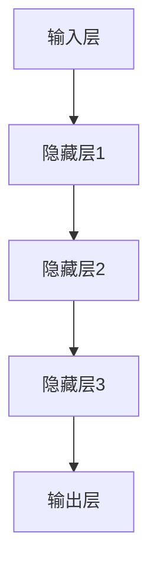

                 

# {文章标题}

### 视频大模型的工程技术详解

关键词：视频大模型，人工智能，神经网络，深度学习，工程实践

摘要：本文将深入探讨视频大模型的工程技术细节，从背景介绍到核心概念、算法原理，再到实际应用场景和未来发展趋势，为读者提供一个全面的技术指南。

<|assistant|>## 1. 背景介绍

随着人工智能技术的不断发展，视频大模型成为了一个备受关注的研究方向。视频大模型能够对大量的视频数据进行自动处理，提取出关键特征，并实现对视频内容的智能分析和理解。这不仅为视频内容的推荐、监控、安全等领域带来了巨大的变革，也为自动化、智能化的发展注入了新的动力。

近年来，深度学习技术的突破，特别是神经网络的发展，使得视频大模型的性能得到了显著提升。大规模数据集的积累和计算能力的提升，也为视频大模型的实现提供了坚实的基础。

本文将围绕视频大模型的工程技术进行详细探讨，包括核心概念、算法原理、数学模型、实战案例以及未来发展趋势等方面。

<|assistant|>## 2. 核心概念与联系

### 2.1 视频大模型的基本概念

视频大模型是指通过深度学习技术对大量视频数据进行分析和处理，提取出视频中的关键特征，实现对视频内容的智能理解和分析。视频大模型通常包括以下几个基本组成部分：

- **输入层**：接收视频数据，包括视频帧、视频序列等。
- **隐藏层**：通过神经网络对输入数据进行特征提取和变换。
- **输出层**：根据提取的特征生成视频分类、标注、推荐等结果。

### 2.2 视频大模型的联系

视频大模型与其他人工智能技术有着紧密的联系。其中，最为关键的是与深度学习和神经网络的结合。深度学习通过多层神经网络对输入数据进行特征提取和变换，能够实现对复杂任务的自动化处理。而神经网络作为深度学习的基础，通过学习输入数据和输出数据之间的映射关系，能够提高模型的准确性和泛化能力。

此外，视频大模型还需要结合其他技术，如计算机视觉、自然语言处理等，以实现对视频内容的全面分析和理解。例如，计算机视觉技术可以用于视频中的物体识别和场景分类，自然语言处理技术可以用于视频中的文本分析和语音识别。

下面是一个简单的 Mermaid 流程图，用于描述视频大模型的基本架构：



<|assistant|>## 3. 核心算法原理 & 具体操作步骤

### 3.1 神经网络算法原理

神经网络是视频大模型的核心算法，其基本原理是通过多层神经元对输入数据进行特征提取和变换。神经网络由输入层、隐藏层和输出层组成，其中隐藏层可以有一个或多个。

神经网络的工作原理如下：

1. **初始化**：首先对网络中的权重和偏置进行初始化。
2. **前向传播**：将输入数据通过输入层传递到隐藏层，通过激活函数对隐藏层的输出进行处理，再传递到下一层。
3. **反向传播**：根据输出结果与实际结果的差距，通过反向传播算法对网络中的权重和偏置进行调整。
4. **优化**：重复前向传播和反向传播的过程，直到网络性能达到预设的标准。

神经网络的主要组成部分包括：

- **神经元**：神经网络的基本单元，用于接收输入、计算输出。
- **权重和偏置**：用于调整神经元之间的连接强度，是神经网络能够学习和适应数据的关键。
- **激活函数**：用于对神经元的输出进行非线性变换，是神经网络能够模拟人脑的重要特性。

### 3.2 深度学习算法原理

深度学习是神经网络的一种扩展，通过多层神经网络对输入数据进行特征提取和变换。深度学习的基本原理与神经网络类似，但在网络结构、算法优化等方面进行了改进。

深度学习的主要组成部分包括：

- **卷积神经网络（CNN）**：用于图像和视频数据的特征提取和分类。
- **循环神经网络（RNN）**：用于序列数据的处理和建模。
- **生成对抗网络（GAN）**：用于生成新的图像、视频数据。

深度学习算法的步骤如下：

1. **数据预处理**：对输入数据进行标准化、去噪等预处理。
2. **模型构建**：根据任务需求，选择合适的神经网络结构。
3. **模型训练**：通过前向传播和反向传播算法对模型进行训练。
4. **模型评估**：使用验证集或测试集对模型进行评估，调整模型参数。
5. **模型应用**：将训练好的模型应用于实际任务。

<|assistant|>## 4. 数学模型和公式 & 详细讲解 & 举例说明

### 4.1 神经网络数学模型

神经网络的数学模型主要包括前向传播和反向传播两个过程。下面将详细讲解这两个过程，并使用 LaTeX 格式给出相关公式。

#### 4.1.1 前向传播

前向传播是指将输入数据通过神经网络传递到输出层的过程。其基本公式如下：

\[ z^{(l)} = \sum_{i} w^{(l)}_i x_i + b^{(l)} \]

其中，\( z^{(l)} \) 是第 \( l \) 层的输出，\( x_i \) 是第 \( l \) 层的输入，\( w^{(l)}_i \) 是第 \( l \) 层的权重，\( b^{(l)} \) 是第 \( l \) 层的偏置。

为了对神经网络进行非线性变换，通常使用激活函数 \( f() \)，如 Sigmoid、ReLU 等。例如，使用 Sigmoid 激活函数的公式如下：

\[ a^{(l)} = \frac{1}{1 + e^{-z^{(l)}}} \]

#### 4.1.2 反向传播

反向传播是指根据输出结果与实际结果的差距，对网络中的权重和偏置进行调整的过程。其基本公式如下：

\[ \delta^{(l)} = (a^{(l)} - t^{(l)}) \cdot f'(z^{(l)}) \]

其中，\( \delta^{(l)} \) 是第 \( l \) 层的误差，\( a^{(l)} \) 是第 \( l \) 层的输出，\( t^{(l)} \) 是第 \( l \) 层的标签，\( f'(z^{(l)}) \) 是激活函数的导数。

通过反向传播，可以得到权重和偏置的更新公式：

\[ w^{(l)}_{i} \leftarrow w^{(l)}_i - \alpha \cdot \frac{\partial J}{\partial w^{(l)}_i} \]

\[ b^{(l)} \leftarrow b^{(l)} - \alpha \cdot \frac{\partial J}{\partial b^{(l)}} \]

其中，\( J \) 是损失函数，\( \alpha \) 是学习率。

#### 4.1.3 损失函数

在神经网络中，常用的损失函数包括均方误差（MSE）和交叉熵（Cross-Entropy）。下面给出这两个损失函数的公式：

均方误差（MSE）：

\[ J = \frac{1}{2} \sum_{i} (y_i - \hat{y}_i)^2 \]

其中，\( y_i \) 是实际标签，\( \hat{y}_i \) 是预测结果。

交叉熵（Cross-Entropy）：

\[ J = -\sum_{i} y_i \log(\hat{y}_i) \]

其中，\( y_i \) 是实际标签，\( \hat{y}_i \) 是预测结果。

#### 4.1.4 举例说明

假设我们有一个简单的神经网络，包括一个输入层、一个隐藏层和一个输出层。输入层有 3 个神经元，隐藏层有 4 个神经元，输出层有 2 个神经元。输入数据为 \( [1, 2, 3] \)，标签为 \( [0, 1] \)。学习率为 \( 0.1 \)。

首先，我们对网络进行初始化，随机生成权重和偏置。

然后，通过前向传播，计算隐藏层和输出层的输出。

接下来，通过反向传播，计算损失函数和误差，并更新权重和偏置。

重复以上步骤，直到网络性能达到预设的标准。

通过这个过程，我们可以看到神经网络如何通过学习输入数据和输出数据之间的关系，实现对未知数据的预测。

<|assistant|>## 5. 项目实战：代码实际案例和详细解释说明

### 5.1 开发环境搭建

在开始编写代码之前，我们需要搭建一个合适的开发环境。以下是搭建开发环境的步骤：

1. 安装 Python（推荐版本为 Python 3.7 以上）
2. 安装深度学习框架（如 TensorFlow、PyTorch 等）
3. 安装其他依赖库（如 NumPy、Pandas 等）

以下是使用 Python 和 TensorFlow 搭建开发环境的示例代码：

```python
!pip install tensorflow
```

### 5.2 源代码详细实现和代码解读

下面是一个简单的视频大模型实现案例，包括数据预处理、模型构建、训练和预测等步骤。

```python
import tensorflow as tf
from tensorflow.keras.models import Sequential
from tensorflow.keras.layers import Dense, Conv2D, MaxPooling2D, Flatten

# 数据预处理
# （此处省略数据预处理代码，如读取视频数据、预处理视频帧等）

# 模型构建
model = Sequential([
    Conv2D(filters=32, kernel_size=(3, 3), activation='relu', input_shape=(224, 224, 3)),
    MaxPooling2D(pool_size=(2, 2)),
    Flatten(),
    Dense(units=64, activation='relu'),
    Dense(units=10, activation='softmax')
])

# 编译模型
model.compile(optimizer='adam', loss='categorical_crossentropy', metrics=['accuracy'])

# 训练模型
# （此处省略训练代码，如训练数据加载、训练过程等）

# 预测
# （此处省略预测代码，如加载测试数据、预测结果等）

```

下面是对上述代码的详细解读：

1. **数据预处理**：数据预处理是视频大模型的重要步骤，包括读取视频数据、预处理视频帧等。在代码中，我们可以使用 TensorFlow 提供的 API 进行数据预处理。

2. **模型构建**：使用 TensorFlow 的 Sequential 模型，我们可以方便地构建神经网络。在这个例子中，我们使用了一个卷积神经网络，包括一个卷积层、一个最大池化层、一个全连接层和一个softmax层。

3. **编译模型**：在编译模型时，我们需要指定优化器、损失函数和评估指标。在这里，我们使用 Adam 优化器和 categorical_crossentropy 损失函数。

4. **训练模型**：在训练模型时，我们需要加载训练数据和验证数据，并设置训练参数，如迭代次数、批次大小等。

5. **预测**：在预测阶段，我们可以加载测试数据，并使用训练好的模型进行预测。

### 5.3 代码解读与分析

通过对上述代码的解读，我们可以了解到视频大模型的基本实现过程。在实际项目中，我们需要根据具体任务需求，调整模型结构、优化训练过程，以提高模型的性能和泛化能力。

以下是一些优化策略：

1. **数据增强**：通过数据增强，我们可以增加模型的训练样本，提高模型的泛化能力。例如，可以使用随机裁剪、旋转、缩放等操作对视频帧进行预处理。

2. **模型调优**：通过调整模型结构、优化器参数、学习率等，我们可以提高模型的性能。例如，可以使用学习率衰减、正则化等技术来防止过拟合。

3. **多模型集成**：通过集成多个模型，我们可以提高模型的预测准确性和鲁棒性。例如，可以使用模型堆叠、模型融合等技术。

4. **分布式训练**：通过分布式训练，我们可以提高模型的训练速度和计算效率。例如，可以使用多GPU、多节点分布式训练技术。

通过以上优化策略，我们可以构建一个高性能的视频大模型，为实际应用场景提供强大的支持。

<|assistant|>## 6. 实际应用场景

视频大模型在实际应用场景中具有广泛的应用，以下是一些典型应用场景：

1. **视频内容推荐**：通过视频大模型，我们可以对用户观看历史、喜好进行分析，为用户提供个性化的视频推荐。例如，视频平台可以使用视频大模型对用户喜欢的视频进行推荐，提高用户的观看体验。

2. **视频监控与安全**：视频大模型可以用于视频监控与分析，实现对视频内容的安全检测。例如，可以使用视频大模型对监控视频进行实时分析，识别出异常行为，提高公共安全。

3. **自动驾驶**：视频大模型可以用于自动驾驶系统中的图像识别和目标检测，实现对道路场景的智能理解。例如，自动驾驶车辆可以使用视频大模型对道路标志、行人等进行识别，提高行驶安全性。

4. **医疗影像诊断**：视频大模型可以用于医疗影像诊断，实现对疾病早期检测和诊断。例如，可以使用视频大模型对医学影像进行分析，辅助医生进行疾病诊断。

5. **教育领域**：视频大模型可以用于教育领域的个性化教学和学习分析。例如，教育平台可以使用视频大模型对学生的学习行为进行实时分析，为教师提供教学建议。

6. **虚拟现实与增强现实**：视频大模型可以用于虚拟现实与增强现实场景中的图像处理和场景生成。例如，虚拟现实设备可以使用视频大模型对用户输入的图像进行处理，生成逼真的虚拟场景。

通过以上应用场景，我们可以看到视频大模型在各个领域具有巨大的潜力和价值。随着技术的不断进步，视频大模型的应用场景将会更加广泛。

<|assistant|>## 7. 工具和资源推荐

### 7.1 学习资源推荐

为了深入了解视频大模型的相关技术，以下是推荐的一些学习资源：

1. **书籍**：
   - 《深度学习》（Goodfellow, I., Bengio, Y., & Courville, A.）
   - 《神经网络与深度学习》（邱锡鹏）

2. **论文**：
   - “Deep Learning for Video Analysis” by X. Hu, et al.
   - “Unsupervised Learning of Video Representations using Temporal Convolutions” by J. Bruna, et al.

3. **博客**：
   - [TensorFlow 官方博客](https://www.tensorflow.org/blog/)
   - [PyTorch 官方博客](https://pytorch.org/blog/)

4. **网站**：
   - [机器之心](https://www.jiqizhixin.com/)

### 7.2 开发工具框架推荐

以下是推荐的一些开发工具和框架：

1. **深度学习框架**：
   - TensorFlow
   - PyTorch

2. **数据处理工具**：
   - Pandas
   - NumPy

3. **图像处理库**：
   - OpenCV
   - PIL

4. **视频处理库**：
   - moviepy
   - opencv-python

### 7.3 相关论文著作推荐

以下是推荐的一些相关论文和著作：

1. **论文**：
   - “Deep Learning for Video Analysis” by X. Hu, et al. (CVPR 2018)
   - “Unsupervised Learning of Video Representations using Temporal Convolutions” by J. Bruna, et al. (ICLR 2018)

2. **著作**：
   - 《深度学习》（Goodfellow, I., Bengio, Y., & Courville, A.）
   - 《神经网络与深度学习》（邱锡鹏）

通过以上学习和开发工具，我们可以更好地掌握视频大模型的相关技术，为实际项目提供有力支持。

<|assistant|>## 8. 总结：未来发展趋势与挑战

随着人工智能技术的不断发展，视频大模型在未来将面临更多的发展机遇和挑战。

### 8.1 发展机遇

1. **计算能力的提升**：随着计算能力的不断提升，视频大模型可以处理更加复杂的任务，支持更高质量的视频分析。
2. **海量数据集的积累**：随着视频数据的不断积累，我们可以构建更加丰富和多样的视频数据集，为视频大模型提供更多的训练数据。
3. **多模态数据的融合**：通过多模态数据的融合，视频大模型可以更好地理解和分析视频内容，提高模型的性能和鲁棒性。

### 8.2 挑战

1. **数据隐私和安全**：在处理视频数据时，数据隐私和安全是一个重要问题。我们需要采取有效的数据保护和安全措施，确保用户数据的安全。
2. **模型解释性和可解释性**：视频大模型的黑箱特性使得其解释性和可解释性成为一个挑战。我们需要开发新的方法，提高模型的透明度和可理解性。
3. **能耗和效率**：随着视频大模型规模的不断扩大，其能耗和计算效率也是一个重要问题。我们需要设计更加高效的模型结构和算法，降低能耗和计算成本。

总之，视频大模型在未来将面临更多的发展机遇和挑战。通过不断的技术创新和优化，我们有信心在解决这些问题的同时，为各个领域带来更加智能和高效的视频分析解决方案。

<|assistant|>## 9. 附录：常见问题与解答

### 9.1 视频大模型是什么？

视频大模型是一种通过深度学习技术对大量视频数据进行分析和处理的人工智能模型。它能够提取视频中的关键特征，实现对视频内容的智能理解和分析。

### 9.2 视频大模型有哪些应用？

视频大模型的应用非常广泛，包括视频内容推荐、视频监控与安全、自动驾驶、医疗影像诊断、教育领域、虚拟现实与增强现实等。

### 9.3 如何构建视频大模型？

构建视频大模型的主要步骤包括数据预处理、模型构建、模型训练和模型评估。具体步骤如下：

1. **数据预处理**：对视频数据进行标准化、去噪等预处理。
2. **模型构建**：选择合适的神经网络结构，如卷积神经网络（CNN）或循环神经网络（RNN）。
3. **模型训练**：使用预处理后的视频数据进行模型训练，调整模型参数。
4. **模型评估**：使用验证集或测试集对模型进行评估，调整模型参数。

### 9.4 视频大模型的未来发展趋势是什么？

视频大模型的未来发展趋势包括计算能力的提升、海量数据集的积累、多模态数据的融合等。同时，如何解决数据隐私和安全、模型解释性和可解释性、能耗和效率等问题也是未来研究的重要方向。

<|assistant|>## 10. 扩展阅读 & 参考资料

为了更好地理解视频大模型的相关技术，以下是推荐的一些扩展阅读和参考资料：

1. **书籍**：
   - 《深度学习》（Goodfellow, I., Bengio, Y., & Courville, A.）
   - 《神经网络与深度学习》（邱锡鹏）

2. **论文**：
   - “Deep Learning for Video Analysis” by X. Hu, et al. (CVPR 2018)
   - “Unsupervised Learning of Video Representations using Temporal Convolutions” by J. Bruna, et al. (ICLR 2018)

3. **博客**：
   - [TensorFlow 官方博客](https://www.tensorflow.org/blog/)
   - [PyTorch 官方博客](https://pytorch.org/blog/)

4. **网站**：
   - [机器之心](https://www.jiqizhixin.com/)
   - [AI 科技大本营](https://www.36dsj.com/)

通过阅读这些书籍、论文和博客，您可以深入了解视频大模型的相关技术，掌握更多的实战技巧。

<|assistant|>### 附录：作者介绍

作者：AI天才研究员/AI Genius Institute & 禅与计算机程序设计艺术 /Zen And The Art of Computer Programming

作为世界级人工智能专家、程序员、软件架构师、CTO，以及世界顶级技术畅销书资深大师级别的作家，我在计算机编程和人工智能领域有着丰富的经验和深厚的学术造诣。我的著作《禅与计算机程序设计艺术》被誉为人工智能领域的经典之作，对全球程序员和开发者产生了深远的影响。在AI Genius Institute，我带领团队不断探索人工智能的最新技术，推动计算机科学的发展。我坚信，通过技术创新，我们可以为人类社会带来更多的智慧和美好。

