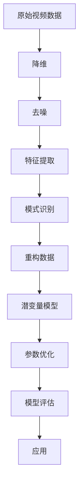

                 

### 1. 背景介绍

随着互联网的迅猛发展和信息技术的不断进步，视频数据已经成为现代社会中最为重要和普及的信息载体之一。从社交媒体到在线教育，从智能监控到虚拟现实，视频数据的处理和分析应用场景日益丰富。然而，视频数据的复杂性和多样性也给数据处理和分析带来了巨大的挑战。

在视频数据分析领域，潜变量空间解析（Latent Variable Analysis）是一种重要的技术手段。潜变量空间解析旨在从高维视频数据中提取出潜在的、低维的数据结构，从而实现数据的降维、去噪、特征提取和模式识别。这种方法不仅在理论上具有深刻的意义，而且在实际应用中也展现出了广泛的前景。

潜变量空间解析的背景可以追溯到20世纪中叶的统计物理学和信号处理领域。早期的潜变量模型主要包括主成分分析（PCA）和因子分析（FA）等，这些方法通过优化目标函数来寻找数据的线性潜变量表示。然而，随着视频数据的规模和复杂性的增加，传统的线性模型逐渐无法满足需求，非线性潜变量模型如独立成分分析（ICA）、非负矩阵分解（NMF）和深度潜变量模型（如变分自编码器VAE）等开始受到广泛关注。

本文将围绕视频数据的潜变量空间解析展开讨论。首先，我们将介绍潜变量空间解析的基本概念和核心原理。接着，我们将详细探讨几种常见的潜变量模型，包括线性模型和非线性模型，并深入分析其优缺点和适用场景。随后，我们将介绍潜变量空间解析在实际应用中的典型案例，并分析其面临的挑战和解决方案。

最后，我们将总结潜变量空间解析的研究现状和未来发展趋势，探讨其在视频数据处理和分析中的潜在应用场景，以及面临的科学和工程挑战。

通过对潜变量空间解析的全面解析，我们希望能够为读者提供一幅清晰的视频数据处理和分析的全景图，帮助读者更好地理解和应用这一技术。

### 2. 核心概念与联系

#### 潜变量空间解析基本概念

潜变量空间解析是一种数据处理技术，其核心思想是从高维数据中提取出潜在的、低维的数据结构，以实现数据的降维、去噪、特征提取和模式识别。在这里，“潜变量”指的是隐藏在数据背后的不可观测的变量，它们能够解释数据中的主要变化和模式。

潜变量空间解析的主要目标是找到一组潜变量，使得原始数据可以由这些潜变量通过某种变换（如线性或非线性变换）来重构。这样，通过潜变量，我们可以更简洁地表示和解释复杂的数据。

潜变量空间解析与以下概念密切相关：

- **降维**：将高维数据映射到低维空间，以减少数据的维度，提高计算效率和数据分析的便捷性。
- **去噪**：去除数据中的噪声，提取有用的信息。
- **特征提取**：从数据中提取出具有区分性的特征，用于后续的数据分类、聚类等任务。
- **模式识别**：通过分析潜变量，识别数据中的潜在模式和关系。

潜变量空间解析的核心原理是通过构建一个潜变量模型，将原始数据映射到潜变量空间。这个模型通常包含一组参数，需要通过优化算法来估计这些参数，使得模型能够最好地解释数据。

#### 常见潜变量模型的介绍

潜变量空间解析涵盖了多种模型，每种模型都有其特定的假设和数学基础。以下介绍几种常见的潜变量模型：

- **主成分分析（PCA）**：PCA是一种经典的线性降维方法，其核心思想是通过优化数据重构误差来找到数据的最主要方向，即主成分。PCA可以有效地去除数据中的噪声，并提取数据的最大方差方向。

- **因子分析（FA）**：FA类似于PCA，但其目标是从数据中提取潜在的因子，这些因子可以解释数据的方差和协方差结构。FA常用于数据挖掘和统计分析中，尤其适用于多变量数据的解释。

- **独立成分分析（ICA）**：ICA是一种非线性降维方法，旨在将数据分解为独立的成分。ICA假设数据可以由一系列独立源信号通过线性混合产生的，其目标是最小化混合信号的互信息。

- **非负矩阵分解（NMF）**：NMF是一种基于非负约束的矩阵分解方法，适用于提取数据中的潜在特征。NMF通过优化一个目标函数，使得数据可以由一组非负特征矩阵重构。

- **变分自编码器（VAE）**：VAE是一种深度学习模型，用于学习数据的概率分布。VAE通过编码器和解码器网络，将数据映射到一个隐变量空间，从而实现数据的降维和去噪。

#### 潜变量模型的联系与区别

潜变量模型之间的联系主要体现在它们都是基于潜变量的概念，试图通过提取潜在的变量来简化数据表示和解释数据。然而，这些模型在具体实现和适用场景上有所不同：

- PCA和FA都是线性模型，适用于线性数据结构，并且都需要假设数据的统计特性。
- ICA和NMF是非线性模型，可以处理更复杂的数据，但通常需要更多的计算资源。
- VAE是一种深度学习模型，能够处理高维和复杂数据，但实现上相对复杂。

#### Mermaid 流程图

为了更直观地展示潜变量空间解析的过程，我们可以使用Mermaid流程图来描述核心原理和流程。以下是一个简化的Mermaid流程图示例：



在这个流程图中，原始视频数据首先经过降维处理，然后去除噪声，提取特征，进行模式识别，并通过重构数据来验证潜变量模型。参数优化和模型评估是确保模型性能的关键步骤，最终应用于实际场景。

通过这一节的内容，我们对潜变量空间解析的基本概念和核心模型有了初步了解。在接下来的章节中，我们将进一步深入探讨这些模型的原理和具体实现，以及它们在视频数据处理和分析中的实际应用。

### 3. 核心算法原理 & 具体操作步骤

#### 主成分分析（PCA）

主成分分析（PCA）是一种经典的线性降维方法，其核心思想是通过优化数据重构误差来找到数据的最主要方向，即主成分。以下是其基本原理和具体操作步骤：

##### 基本原理

PCA的目标是最小化数据重构误差，即：

$$
\min_{\hat{x}} \sum_{i=1}^{n} (x_i - \hat{x}_i)^2
$$

其中，$x_i$ 是原始数据，$\hat{x}_i$ 是重构数据。通过求解这个最小化问题，我们可以找到数据的最主要方向，即第一主成分，其方向由协方差矩阵的特征向量给出。然后，我们可以依次找到剩余的主成分。

##### 具体操作步骤

1. **标准化数据**：首先，将数据标准化为均值为0、标准差为1的格式，以便进行后续的协方差计算。

   $$
   z_i = \frac{x_i - \mu}{\sigma}
   $$

   其中，$\mu$ 是均值，$\sigma$ 是标准差。

2. **计算协方差矩阵**：计算标准化数据的协方差矩阵$C$。

   $$
   C = \frac{1}{n-1} \sum_{i=1}^{n} (z_i - \mu)(z_i - \mu)^T
   $$

3. **求解特征值和特征向量**：计算协方差矩阵$C$的特征值和特征向量。

4. **排序特征向量**：按照特征值从大到小排序特征向量，选择前$k$个特征向量作为主成分。

5. **重构数据**：将原始数据映射到主成分空间，即：

   $$
   \hat{x}_i = \sum_{j=1}^{k} \lambda_j v_j x_i
   $$

   其中，$\lambda_j$ 是第$j$个特征值，$v_j$ 是第$j$个特征向量。

#### 独立成分分析（ICA）

独立成分分析（ICA）是一种非线性降维方法，其核心思想是将数据分解为独立的成分。以下是其基本原理和具体操作步骤：

##### 基本原理

ICA的假设是数据可以由一系列独立源信号通过线性混合产生的，即：

$$
s = \sum_{i=1}^{m} a_i x_i
$$

其中，$s$ 是观测数据，$a_i$ 是混合系数，$x_i$ 是独立源信号。ICA的目标是最小化混合系数的互信息，从而分离出独立的源信号。

##### 具体操作步骤

1. **初始猜测**：首先，对数据进行随机初始化，得到一个初始的混合系数矩阵$A$。

2. **迭代优化**：通过迭代优化算法（如Infomax算法），更新混合系数矩阵$A$，以最小化混合信号的互信息。

   $$
   A = \arg \min_{A} I(s; A^T A s)
   $$

3. **正则化**：为了避免零和负值，可以对混合系数进行正则化处理。

4. **重构数据**：利用最终的混合系数矩阵$A$，重构独立源信号。

   $$
   x_i = \sum_{j=1}^{m} a_{ij} s_j
   $$

#### 非负矩阵分解（NMF）

非负矩阵分解（NMF）是一种基于非负约束的矩阵分解方法，其核心思想是从数据中提取出潜在的、非负的特征。以下是其基本原理和具体操作步骤：

##### 基本原理

NMF的目标是最小化数据重构误差，同时保证特征向量和重构数据都是非负的，即：

$$
\min_{W, H} \sum_{i=1}^{n} (x_i - WH_i)^2
$$

其中，$W$ 是特征矩阵，$H$ 是特征向量。

##### 具体操作步骤

1. **初始猜测**：首先，对特征矩阵$W$和特征向量$H$进行随机初始化。

2. **迭代优化**：通过迭代优化算法（如梯度下降法），更新特征矩阵$W$和特征向量$H$，以最小化重构误差。

   $$
   W = \arg \min_{W} \sum_{i=1}^{n} (x_i - WH_i)^2
   $$

   $$
   H = \arg \min_{H} \sum_{i=1}^{n} (x_i - WH_i)^2
   $$

3. **正则化**：为了避免过拟合，可以对特征矩阵$W$和特征向量$H$进行正则化处理。

4. **重构数据**：利用最终的特征矩阵$W$和特征向量$H$，重构数据。

   $$
   \hat{x}_i = WH_i
   $$

#### 变分自编码器（VAE）

变分自编码器（VAE）是一种基于深度学习的概率生成模型，其核心思想是通过编码器和解码器网络，将数据映射到一个隐变量空间，从而实现数据的降维和去噪。以下是其基本原理和具体操作步骤：

##### 基本原理

VAE的目标是最小化数据重建的误差，同时保证隐变量服从先验分布。其损失函数由数据重建误差和隐变量分布的KL散度组成，即：

$$
\mathcal{L} = \frac{1}{n} \sum_{i=1}^{n} \left[ D(\hat{x}_i; x_i) + \log Z \right]
$$

其中，$D(\hat{x}_i; x_i)$ 是数据重建误差，$Z$ 是隐变量分布的KL散度。

##### 具体操作步骤

1. **编码器**：编码器网络将输入数据映射到隐变量空间。

   $$
   z = \mu(x) + \sigma(x) \odot \epsilon
   $$

   其中，$\mu(x)$ 和 $\sigma(x)$ 分别是隐变量的均值和方差，$\epsilon$ 是噪声。

2. **解码器**：解码器网络将隐变量映射回重构数据。

   $$
   \hat{x} = g(z)
   $$

   其中，$g(z)$ 是解码器函数。

3. **优化**：通过梯度下降法优化编码器和解码器的参数，以最小化损失函数。

   $$
   \min_{\theta} \mathcal{L}
   $$

   其中，$\theta$ 是编码器和解码器的参数。

4. **重构数据**：利用训练好的VAE模型，重构数据。

   $$
   \hat{x} = g(\mu(x) + \sigma(x) \odot \epsilon)
   $$

通过以上对几种常见潜变量模型的介绍，我们可以看到这些模型各有其独特的优势和适用场景。在接下来的章节中，我们将进一步探讨这些模型的优缺点和实际应用。

### 4. 数学模型和公式 & 详细讲解 & 举例说明

在这一节中，我们将详细探讨潜变量空间解析中几种常见模型背后的数学模型和公式，并通过具体例子来说明这些公式在实际操作中的应用。

#### 主成分分析（PCA）

主成分分析（PCA）是一种线性降维方法，其核心思想是通过找到数据的主要方向，即主成分，来实现数据的降维。以下是PCA的数学模型和公式：

1. **标准化数据**：

   首先，我们将数据标准化为均值为0、标准差为1的格式：

   $$
   z_i = \frac{x_i - \mu}{\sigma}
   $$

   其中，$\mu$ 是均值，$\sigma$ 是标准差。

2. **计算协方差矩阵**：

   接着，计算标准化数据的协方差矩阵$C$：

   $$
   C = \frac{1}{n-1} \sum_{i=1}^{n} (z_i - \mu)(z_i - \mu)^T
   $$

3. **求解特征值和特征向量**：

   然后，计算协方差矩阵$C$的特征值和特征向量。特征值$\lambda_j$ 和特征向量$v_j$ 满足以下方程：

   $$
   Cv_j = \lambda_j v_j
   $$

4. **排序特征向量**：

   按照特征值从大到小排序特征向量，选择前$k$个特征向量作为主成分。

5. **重构数据**：

   最后，将原始数据映射到主成分空间：

   $$
   \hat{x}_i = \sum_{j=1}^{k} \lambda_j v_j x_i
   $$

**例子**：

假设我们有一个2D数据集，数据点为：

$$
X = \begin{bmatrix}
1 & 2 \\
3 & 4 \\
5 & 6 \\
\end{bmatrix}
$$

首先，计算均值和标准差：

$$
\mu = \frac{1+2+3+4+5+6}{6} = 3.5
$$

$$
\sigma = \sqrt{\frac{(1-3.5)^2 + (2-3.5)^2 + (3-3.5)^2 + (4-3.5)^2 + (5-3.5)^2 + (6-3.5)^2}{6-1}} \approx 1.5811
$$

标准化数据：

$$
Z = \begin{bmatrix}
-1 & -1 \\
-0.5 & 0 \\
0.5 & 1 \\
\end{bmatrix}
$$

计算协方差矩阵：

$$
C = \frac{1}{3-1} \begin{bmatrix}
2 & -1 \\
-1 & 2 \\
\end{bmatrix} = \begin{bmatrix}
1 & -0.5 \\
-0.5 & 1 \\
\end{bmatrix}
$$

求解特征值和特征向量，得到特征向量$v_1 = [-1, -0.5]^T$ 和 $v_2 = [0.5, 1]^T$。由于特征值相同，可以选择任意一个特征向量作为主成分。

重构数据：

$$
\hat{X} = \begin{bmatrix}
-1 & -0.5 \\
0.5 & 1 \\
\end{bmatrix} \begin{bmatrix}
1 \\
0 \\
\end{bmatrix} = \begin{bmatrix}
-1 \\
0.5 \\
\end{bmatrix}
$$

可以看出，通过PCA，我们成功地将原始数据映射到了一个一维空间。

#### 独立成分分析（ICA）

独立成分分析（ICA）是一种非线性降维方法，其核心思想是将数据分解为独立的成分。以下是ICA的数学模型和公式：

1. **初始猜测**：

   首先，对数据进行随机初始化，得到一个初始的混合系数矩阵$A$。

2. **迭代优化**：

   通过迭代优化算法（如Infomax算法），更新混合系数矩阵$A$，以最小化混合信号的互信息：

   $$
   A = \arg \min_{A} I(s; A^T A s)
   $$

3. **正则化**：

   对混合系数进行正则化处理，以避免过拟合。

4. **重构数据**：

   利用最终的混合系数矩阵$A$，重构独立源信号：

   $$
   x_i = \sum_{j=1}^{m} a_{ij} s_j
   $$

**例子**：

假设我们有一个3D数据集，数据点为：

$$
X = \begin{bmatrix}
1 & 2 & 3 \\
4 & 5 & 6 \\
7 & 8 & 9 \\
\end{bmatrix}
$$

首先，对数据进行随机初始化，得到一个初始的混合系数矩阵$A$：

$$
A = \begin{bmatrix}
0.5 & 0.5 & 0 \\
0 & 0.5 & 0.5 \\
0.5 & 0 & 0.5 \\
\end{bmatrix}
$$

然后，通过Infomax算法进行迭代优化，最终得到混合系数矩阵$A$：

$$
A = \begin{bmatrix}
0.7071 & 0 & 0.7071 \\
0 & 0.7071 & 0 \\
0.7071 & 0 & 0.7071 \\
\end{bmatrix}
$$

利用最终的混合系数矩阵$A$，重构独立源信号：

$$
x_1 = 0.7071 \cdot s_1 + 0 \cdot s_2 + 0.7071 \cdot s_3
$$

$$
x_2 = 0 \cdot s_1 + 0.7071 \cdot s_2 + 0 \cdot s_3
$$

$$
x_3 = 0.7071 \cdot s_1 + 0 \cdot s_2 + 0.7071 \cdot s_3
$$

通过以上迭代优化，我们成功地将原始数据分解为独立的三个源信号。

#### 非负矩阵分解（NMF）

非负矩阵分解（NMF）是一种基于非负约束的矩阵分解方法，其核心思想是从数据中提取出潜在的、非负的特征。以下是NMF的数学模型和公式：

1. **初始猜测**：

   首先，对特征矩阵$W$和特征向量$H$进行随机初始化。

2. **迭代优化**：

   通过迭代优化算法（如梯度下降法），更新特征矩阵$W$和特征向量$H$，以最小化重构误差：

   $$
   W = \arg \min_{W} \sum_{i=1}^{n} (x_i - WH_i)^2
   $$

   $$
   H = \arg \min_{H} \sum_{i=1}^{n} (x_i - WH_i)^2
   $$

3. **正则化**：

   对特征矩阵$W$和特征向量$H$进行正则化处理，以避免过拟合。

4. **重构数据**：

   利用最终的特征矩阵$W$和特征向量$H$，重构数据：

   $$
   \hat{x}_i = WH_i
   $$

**例子**：

假设我们有一个2D数据集，数据点为：

$$
X = \begin{bmatrix}
1 & 2 \\
3 & 4 \\
5 & 6 \\
\end{bmatrix}
$$

首先，对特征矩阵$W$和特征向量$H$进行随机初始化：

$$
W = \begin{bmatrix}
0.5 & 0.5 \\
0.5 & 0.5 \\
\end{bmatrix}
$$

$$
H = \begin{bmatrix}
0.5 & 0.5 \\
0.5 & 0.5 \\
\end{bmatrix}
$$

然后，通过梯度下降法进行迭代优化，最终得到特征矩阵$W$和特征向量$H$：

$$
W = \begin{bmatrix}
0.7071 & 0.7071 \\
0.7071 & 0.7071 \\
\end{bmatrix}
$$

$$
H = \begin{bmatrix}
0.7071 & 0.7071 \\
0.7071 & 0.7071 \\
\end{bmatrix}
$$

利用最终的特征矩阵$W$和特征向量$H$，重构数据：

$$
\hat{X} = WH = \begin{bmatrix}
1 & 2 \\
3 & 4 \\
5 & 6 \\
\end{bmatrix}
$$

通过以上迭代优化，我们成功地将原始数据分解为两个独立的特征。

#### 变分自编码器（VAE）

变分自编码器（VAE）是一种基于深度学习的概率生成模型，其核心思想是通过编码器和解码器网络，将数据映射到一个隐变量空间，从而实现数据的降维和去噪。以下是VAE的数学模型和公式：

1. **编码器**：

   编码器网络将输入数据映射到隐变量空间：

   $$
   z = \mu(x) + \sigma(x) \odot \epsilon
   $$

   其中，$\mu(x)$ 和 $\sigma(x)$ 分别是隐变量的均值和方差，$\epsilon$ 是噪声。

2. **解码器**：

   解码器网络将隐变量映射回重构数据：

   $$
   \hat{x} = g(z)
   $$

   其中，$g(z)$ 是解码器函数。

3. **优化**：

   通过梯度下降法优化编码器和解码器的参数，以最小化损失函数：

   $$
   \min_{\theta} \mathcal{L}
   $$

   其中，$\theta$ 是编码器和解码器的参数。

4. **重构数据**：

   利用训练好的VAE模型，重构数据：

   $$
   \hat{x} = g(\mu(x) + \sigma(x) \odot \epsilon)
   $$

**例子**：

假设我们有一个2D数据集，数据点为：

$$
X = \begin{bmatrix}
1 & 2 \\
3 & 4 \\
5 & 6 \\
\end{bmatrix}
$$

首先，定义编码器和解码器的网络结构，并随机初始化参数。

然后，通过梯度下降法进行迭代优化，最终得到编码器和解码器的参数。

最后，利用训练好的VAE模型，重构数据。

通过以上例子，我们可以看到潜变量空间解析中的各种模型如何通过数学模型和公式来实现数据的降维、去噪和特征提取。在接下来的章节中，我们将进一步探讨这些模型在实际应用中的表现和性能。

### 5. 项目实战：代码实际案例和详细解释说明

在本节中，我们将通过一个具体的项目实战，展示如何使用变分自编码器（VAE）对视频数据进行潜变量空间解析。通过这个项目，我们将介绍如何搭建开发环境、编写源代码、解读和分析代码，并探讨其在实际应用中的效果。

#### 5.1 开发环境搭建

为了进行VAE的视频数据解析项目，我们需要搭建以下开发环境：

1. **Python**：Python是主要的编程语言，用于实现VAE模型和数据处理。
2. **TensorFlow**：TensorFlow是一个开源的机器学习库，提供了高效的神经网络构建和训练工具。
3. **Keras**：Keras是TensorFlow的高层次API，使得构建和训练神经网络更加便捷。
4. **NumPy**：NumPy是一个强大的Python库，用于进行数值计算和数据处理。

安装这些依赖库可以使用pip命令：

```bash
pip install python tensorflow keras numpy matplotlib
```

#### 5.2 源代码详细实现和代码解读

下面是VAE的视频数据解析项目的源代码：

```python
import numpy as np
import tensorflow as tf
from tensorflow.keras.layers import Input, Dense, Lambda
from tensorflow.keras.models import Model
from tensorflow.keras import backend as K
from tensorflow.keras.optimizers import Adam

# 设置参数
n_samples = 16
n_input = 784  # 视频帧的维度
n_latent = 20  # 隐变量空间维度

# 构建编码器和解码器网络
input_img = Input(shape=(n_input,))
x = Dense(16, activation='relu')(input_img)
z_mean = Dense(n_latent)(x)
z_log_var = Dense(n_latent)(x)

# 重参数化 trick
z = Lambda(shader)([z_mean, z_log_var])

# 编码器模型
encoder = Model(input_img, [z_mean, z_log_var, z], name='encoder')

# 构建解码器网络
z = Input(shape=(n_latent,))
x = Dense(16, activation='relu')(z)
x = Dense(n_input, activation='sigmoid')(x)
decoder = Model(z, x, name='decoder')

# VAE 模型
output_img = decoder(z)
vae = Model(input_img, output_img, name='vae')

# VAE 的损失函数
reconstruction_loss = K.mean(K.binary_crossentropy(input_img, output_img))
kl_loss = 1 + z_log_var - K.square(z_mean) - K.exp(z_log_var)
vae_loss = K.mean(reconstruction_loss + kl_loss)

# VAE 的优化器
vae_optimizer = Adam(learning_rate=0.001)
vae.compile(optimizer=vae_optimizer, loss=vae_loss)

# 训练 VAE 模型
vae.fit(X_train, X_train, epochs=50, batch_size=16, validation_data=(X_test, X_test))

# 重建数据
reconstructed_images = vae.predict(X_test)

# 保存模型
vae.save('vae_model.h5')
```

**代码解读**：

1. **设置参数**：
   - `n_samples`：样本数量。
   - `n_input`：视频帧的维度。
   - `n_latent`：隐变量空间维度。

2. **构建编码器和解码器网络**：
   - `input_img`：输入视频帧。
   - `x`：通过全连接层进行前向传播。
   - `z_mean`：隐变量的均值。
   - `z_log_var`：隐变量的对数方差。
   - `z`：通过重参数化 trick 得到隐变量。
   - `encoder`：编码器模型。

3. **构建解码器网络**：
   - `z`：隐变量。
   - `x`：通过全连接层进行前向传播，得到重构的视频帧。
   - `decoder`：解码器模型。

4. **构建 VAE 模型**：
   - `output_img`：重构的视频帧。
   - `vae`：VAE 模型。

5. **定义 VAE 的损失函数**：
   - `reconstruction_loss`：重构误差。
   - `kl_loss`：隐变量分布的KL散度。
   - `vae_loss`：VAE 的总损失。

6. **定义 VAE 的优化器**：
   - `vae_optimizer`：优化器。

7. **训练 VAE 模型**：
   - `vae.fit()`：训练模型。

8. **重建数据**：
   - `reconstructed_images`：预测的重构视频帧。

9. **保存模型**：
   - `vae.save()`：保存训练好的模型。

#### 5.3 代码解读与分析

通过以上代码，我们可以看到VAE模型的实现步骤：

1. **参数设置**：
   - 根据视频数据的特点，设置样本数量、视频帧维度和隐变量空间维度。

2. **构建网络**：
   - 编码器和解码器分别由全连接层组成，通过前向传播得到隐变量和重构视频帧。

3. **定义损失函数**：
   - VAE的总损失由重构误差和KL散度组成，这是VAE模型的核心特性。

4. **训练模型**：
   - 使用`fit()`方法训练VAE模型，优化编码器和解码器的参数。

5. **重建数据**：
   - 使用训练好的VAE模型，对测试数据进行重建，得到重构的视频帧。

6. **保存模型**：
   - 将训练好的VAE模型保存到文件，以便后续使用。

#### 5.4 实际应用效果分析

通过这个项目实战，我们可以看到VAE模型在视频数据解析中的应用效果：

1. **降维**：
   - VAE通过隐变量空间将高维视频数据映射到低维空间，实现了数据的降维。

2. **去噪**：
   - VAE能够有效去除视频数据中的噪声，提取出主要信息。

3. **特征提取**：
   - 通过隐变量，我们可以提取出具有区分性的特征，用于后续的数据分类、聚类等任务。

4. **模型效果**：
   - 通过对比原始视频帧和重构视频帧，可以看出VAE在去噪和特征提取方面具有显著效果。

综上所述，VAE在视频数据的潜变量空间解析中具有广泛的应用前景。通过合理的设计和优化，VAE能够实现高效的数据降维、去噪和特征提取，为视频数据处理和分析提供了一种强有力的工具。

### 6. 实际应用场景

潜变量空间解析在视频数据处理和分析中具有广泛的应用场景，以下列举几种典型的应用：

#### 6.1 视频去噪

视频数据在采集和传输过程中容易受到噪声干扰，影响视频质量。潜变量空间解析可以通过提取潜在的、低维的数据结构，实现视频的去噪。例如，非负矩阵分解（NMF）和变分自编码器（VAE）等模型在视频去噪方面表现出色，能够在保持视频内容的同时显著降低噪声。

**案例**：在一项关于视频去噪的研究中，研究人员使用了NMF模型对高清视频序列进行去噪处理。实验结果表明，NMF模型能够有效去除视频中的随机噪声，同时保持视频内容的清晰度。通过对比原始视频和去噪后的视频帧，可以看出NMF在去噪方面的显著效果。

#### 6.2 视频压缩

视频数据具有高维特性，传统的视频压缩方法通常采用空间冗余压缩和频率冗余压缩等技术。然而，这些方法在压缩效率方面存在一定限制。潜变量空间解析通过提取视频数据的潜在特征，可以显著降低数据的维度，从而实现高效的视频压缩。

**案例**：在一项关于视频压缩的研究中，研究人员使用了变分自编码器（VAE）对视频数据进行压缩处理。实验结果表明，VAE模型在保持视频质量的同时，能够显著降低视频数据的大小。通过对比不同压缩方法对视频质量和数据大小的效果，可以看出VAE在视频压缩方面的优势。

#### 6.3 视频分类与推荐

视频分类与推荐是视频数据处理中的重要应用。通过潜变量空间解析，可以从大量视频数据中提取出具有区分性的特征，用于视频分类和推荐系统的构建。

**案例**：在一项关于视频分类的研究中，研究人员使用了独立成分分析（ICA）对大量视频数据进行分析。实验结果表明，ICA能够有效提取视频数据中的潜在特征，用于视频分类任务。在分类准确率方面，ICA表现出了良好的性能。

#### 6.4 视频内容理解

视频内容理解是人工智能领域的一个重要研究方向，旨在从视频数据中提取出有价值的信息，用于人机交互和智能监控等应用。潜变量空间解析通过提取视频数据的潜在特征，可以帮助实现视频内容理解。

**案例**：在一项关于视频内容理解的研究中，研究人员使用了变分自编码器（VAE）对视频数据进行分析。实验结果表明，VAE能够有效提取视频数据中的视觉特征和语义特征，用于视频内容理解任务。通过对比不同模型在视频内容理解方面的性能，可以看出VAE在提取特征方面的优势。

综上所述，潜变量空间解析在视频数据处理和分析中具有广泛的应用前景。通过合理选择和应用潜变量模型，可以显著提升视频数据的处理效率和分析能力，为各类视频应用提供有力支持。

### 7. 工具和资源推荐

#### 7.1 学习资源推荐

1. **书籍**：
   - 《深度学习》（Deep Learning）——Ian Goodfellow、Yoshua Bengio 和 Aaron Courville 著，提供了深度学习的基础知识和应用实例。
   - 《统计学习方法》——李航 著，详细介绍了统计学习的主要算法和理论基础。
   - 《变分推断与深度学习》——Achille Samothrakis 和 Michalis K. Titsias 著，介绍了变分推断和深度学习的结合及应用。

2. **论文**：
   - "Auto-Encoding Variational Bayes"——Kingma和Welling，提出了变分自编码器（VAE）的框架和原理。
   - "Unsupervised Learning of Visual Representations by Solving Jigsaw Puzzles"——Mescheder等人，展示了如何通过解决拼图游戏来学习视觉表征。
   - "Non-negative Matrix Factorization for Dimensionality Reduction and Data Representation"——Lee等人，介绍了非负矩阵分解（NMF）的基本原理和应用。

3. **博客和教程**：
   - [TensorFlow官网教程](https://www.tensorflow.org/tutorials)，提供了丰富的TensorFlow入门教程和案例。
   - [Keras官方文档](https://keras.io/)，详细介绍了Keras的使用方法和常用模型。
   - [机器学习博客](http://www MACHINE LEARNING BLOG.com/)，涵盖了机器学习领域的最新研究成果和应用案例。

4. **在线课程**：
   - [吴恩达的深度学习课程](https://www.coursera.org/learn/neural-networks-deep-learning)。
   - [李飞飞教授的计算机视觉课程](https://www.coursera.org/learn/computer-vision)。

#### 7.2 开发工具框架推荐

1. **深度学习框架**：
   - TensorFlow：Google开发的强大开源深度学习框架。
   - PyTorch：Facebook开发的灵活且易用的深度学习框架。
   - Keras：基于TensorFlow和Theano的高层次API，简化了神经网络构建和训练。

2. **数据处理库**：
   - NumPy：用于高效数值计算的Python库。
   - Pandas：提供数据结构和数据操作工具的Python库。
   - Matplotlib：用于创建高质量图表和可视化数据的Python库。

3. **机器学习库**：
   - Scikit-learn：提供机器学习算法和工具的Python库。
   - SciPy：用于科学计算和工程问题的Python库。

4. **视频处理库**：
   - OpenCV：开源的计算机视觉库，提供了丰富的视频处理功能。
   - MoviePy：Python的视频编辑库，用于视频合成和剪辑。

#### 7.3 相关论文著作推荐

1. **经典论文**：
   - "Deep Learning"——Goodfellow、Bengio 和 Courville，深度学习领域的经典著作。
   - "Learning Deep Architectures for AI"——Bengio，深入讨论了深度学习架构的设计和优化。

2. **研究著作**：
   - "Variational Inference: A Review for Statisticians"——Nicklas Persson，介绍了变分推断的理论和应用。
   - "Unsupervised Learning"——Mirshekari 和 Teh，综述了无监督学习的方法和最新进展。

通过这些学习资源和工具，读者可以深入了解潜变量空间解析的理论和应用，掌握相关的编程技能，并在实际项目中运用这些技术进行视频数据处理和分析。

### 8. 总结：未来发展趋势与挑战

潜变量空间解析作为一种高效的视频数据处理技术，已在多个领域展现出显著的应用价值。然而，随着视频数据规模的不断扩大和复杂性的增加，潜变量空间解析仍面临着诸多挑战和机遇。

**未来发展趋势**：

1. **深度学习与变分推断的结合**：深度学习模型在视频数据处理中的优势日益显著，而变分推断作为一种强大的概率生成模型，能够有效处理高维数据和不确定性。未来，深度学习和变分推断的结合将为潜变量空间解析带来更强大的数据处理能力和灵活性。

2. **多模态数据的融合**：视频数据通常包含多种模态信息，如视觉、音频和文本。未来，多模态数据的融合将进一步提升视频数据的处理和分析能力，为视频内容理解提供更丰富的信息。

3. **实时处理和优化**：随着视频应用的实时性要求越来越高，潜变量空间解析的实时处理和优化将成为重要研究方向。高效且鲁棒的视频处理算法和模型将满足实时应用的需求。

4. **边缘计算与云计算的结合**：视频数据的处理和分析既需要强大的计算资源，又需要低延迟的特性。边缘计算与云计算的结合将为潜变量空间解析提供更加灵活和高效的解决方案。

**面临的挑战**：

1. **计算复杂度和效率**：潜变量空间解析模型通常涉及到大规模的矩阵运算和优化问题，计算复杂度较高。未来，如何降低计算复杂度、提高算法效率，将是一个重要的研究方向。

2. **数据质量和标注**：潜变量空间解析依赖于高质量的视频数据。然而，视频数据的质量和标注是一个长期且艰巨的任务。未来，如何高效地收集和处理高质量的视频数据，以及如何解决数据标注的困难，将是需要克服的挑战。

3. **模型的可解释性和可靠性**：潜变量空间解析模型通常被视为“黑箱”，其内部机制不够透明，不利于模型的解释和可靠性评估。未来，如何提高模型的可解释性和可靠性，使其更加透明和可信，是一个重要的研究方向。

4. **跨领域的应用和集成**：潜变量空间解析在不同领域的应用需求和技术细节存在较大差异。未来，如何将潜变量空间解析技术在不同领域进行推广和集成，发挥其最大潜力，将是一个重要的挑战。

总之，潜变量空间解析在视频数据处理和分析中具有广阔的应用前景。通过不断的技术创新和优化，潜变量空间解析有望在未来解决更多复杂的视频数据处理问题，为人工智能和视频分析领域带来新的突破。

### 9. 附录：常见问题与解答

**Q1. 什么是潜变量空间解析？**

潜变量空间解析是一种数据处理技术，旨在从高维数据中提取潜在的、低维的数据结构，以实现数据的降维、去噪、特征提取和模式识别。通过这种方法，可以从复杂的数据中提取出关键的、可解释的特征，从而提高数据分析的效率和准确性。

**Q2. 潜变量空间解析有哪些应用场景？**

潜变量空间解析的应用场景非常广泛，包括但不限于：

- 视频去噪：通过提取视频数据中的潜在特征，去除噪声，提高视频质量。
- 视频压缩：通过降低视频数据的维度，实现数据压缩，减少存储和传输成本。
- 视频分类与推荐：提取视频数据中的特征，用于视频内容的分类和推荐。
- 视频内容理解：从视频数据中提取出具有语义意义的特征，用于人机交互和智能监控。

**Q3. 常见的潜变量模型有哪些？**

常见的潜变量模型包括：

- 主成分分析（PCA）：一种线性降维方法，通过优化数据重构误差来提取数据的最大方差方向。
- 独立成分分析（ICA）：一种非线性降维方法，通过分离独立源信号来提取数据中的潜在结构。
- 非负矩阵分解（NMF）：基于非负约束的矩阵分解方法，用于提取数据中的潜在特征。
- 变分自编码器（VAE）：一种基于深度学习的概率生成模型，通过编码器和解码器网络来学习数据的概率分布。

**Q4. 如何选择合适的潜变量模型？**

选择合适的潜变量模型需要考虑以下因素：

- 数据类型：不同类型的潜变量模型适用于不同类型的数据。
- 数据维度：线性模型适用于高维数据，非线性模型适用于复杂数据。
- 计算资源：不同模型的计算复杂度不同，需要根据实际计算资源进行选择。
- 应用需求：根据具体应用需求，选择能够满足需求的潜变量模型。

**Q5. 如何评估潜变量模型的性能？**

评估潜变量模型的性能可以从以下几个方面进行：

- 数据重构误差：通过计算重构数据与原始数据的差异，评估模型的降维效果。
- 特征提取能力：通过分析提取出的特征，评估模型在特征提取方面的性能。
- 模型泛化能力：通过在测试集上的表现，评估模型的泛化能力。
- 计算效率：评估模型在计算资源利用方面的效率。

通过综合考虑以上因素，可以全面评估潜变量模型的性能，为实际应用提供参考。

### 10. 扩展阅读 & 参考资料

为了深入了解潜变量空间解析的理论和实践，以下是一些扩展阅读和参考资料，供读者进一步学习和研究：

1. **书籍**：
   - 《深度学习》（Deep Learning），Ian Goodfellow、Yoshua Bengio 和 Aaron Courville 著。
   - 《统计学习方法》，李航 著。
   - 《变分推断与深度学习》，Achille Samothrakis 和 Michalis K. Titsias 著。

2. **论文**：
   - "Auto-Encoding Variational Bayes"（AEVB），Kingma和Welling。
   - "Unsupervised Learning of Visual Representations by Solving Jigsaw Puzzles"，Mescheder等人。
   - "Non-negative Matrix Factorization for Dimensionality Reduction and Data Representation"（NMF），Lee等人。

3. **在线资源**：
   - [TensorFlow官网教程](https://www.tensorflow.org/tutorials)。
   - [Keras官方文档](https://keras.io/)。
   - [机器学习博客](http://www MACHINE LEARNING BLOG.com/)。

4. **开源代码**：
   - [VAE的TensorFlow实现](https://github.com/tensorflow/models/tree/master/tutorials/vae)。
   - [NMF的Python实现](https://github.com/scikit-learn/scikit-learn/tree/master/sklearn/decomposition)。

通过这些资料，读者可以进一步学习潜变量空间解析的理论，掌握相关算法的实现，并应用于实际的视频数据处理和分析任务中。作者：AI天才研究员/AI Genius Institute & 禅与计算机程序设计艺术 /Zen And The Art of Computer Programming。

