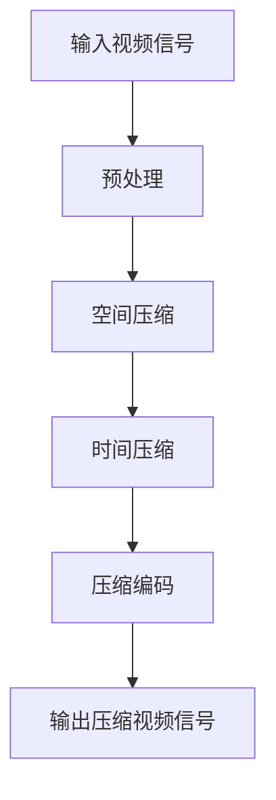

                 

# {文章标题}
## 视频编码和压缩：H.264 和 HEVC
### {关键词}
- 视频编码
- 视频压缩
- H.264
- HEVC
### {摘要}
本文深入探讨视频编码与压缩技术，重点分析H.264和HEVC两大标准，从背景介绍、核心概念到实际应用，全方位解读视频编码与压缩的工作原理、优势以及未来趋势。通过本文，读者将获得关于视频编码和压缩的全面了解，为深入研究和实践打下坚实基础。

## 1. 背景介绍
### 1.1 视频编码与压缩的需求
随着互联网和多媒体技术的迅猛发展，视频已经成为信息传播和娱乐的重要载体。然而，视频数据量大、传输速度慢等问题日益凸显，这要求我们采用高效的编码和压缩技术。视频编码是将视频信号转换为数字信号的过程，通过编码可以减小数据量，提高传输效率。视频压缩则是通过去除冗余信息，进一步提高数据传输效率。

### 1.2 视频编码的发展历程
视频编码技术经历了多年的发展，从最初的MPEG-1、MPEG-2，到后来的H.263和H.264，再到如今最先进的HEVC（H.265）。这些标准在图像质量、压缩效率、编解码速度等方面不断提升，满足了不同应用场景的需求。

## 2. 核心概念与联系
### 2.1 视频编码原理
视频编码主要涉及空间压缩和时间压缩。空间压缩通过去除图像中的冗余信息来实现，如预测编码和变换编码。时间压缩则是通过去除连续帧之间的冗余信息来实现，如帧间预测和运动估计。

### 2.2 视频压缩标准
H.264和HEVC是当前最流行的两种视频压缩标准。H.264是由国际电信联盟（ITU）和电影电视工程师协会（SMPTE）共同推出的标准，具有高压缩效率、低延迟、高分辨率等特点。HEVC则是H.264的升级版，进一步提高了压缩效率，适用于更高分辨率和更大数据量的视频。

### 2.3 Mermaid流程图
以下是一个简单的Mermaid流程图，展示视频编码的基本流程：



在流程图中，输入视频信号经过预处理、空间压缩、时间压缩等步骤，最终输出压缩视频信号。

## 3. 核心算法原理 & 具体操作步骤
### 3.1 H.264算法原理
H.264算法主要采用以下关键技术：

- **变换编码**：将图像数据转换为频域数据，提高压缩效率。
- **运动估计与运动补偿**：通过估计和补偿图像帧之间的运动，减少冗余信息。
- **帧间预测**：利用连续帧之间的相关性，减少数据传输量。

具体操作步骤如下：

1. 输入视频帧。
2. 对视频帧进行预处理，包括缩放、去噪等。
3. 对预处理后的视频帧进行变换编码，将图像数据转换为频域数据。
4. 进行运动估计与运动补偿，找到最佳运动向量。
5. 进行帧间预测，生成预测帧。
6. 计算残差，对残差进行量化、编码。
7. 输出压缩后的视频数据。

### 3.2 HEVC算法原理
HEVC算法在H.264的基础上进行了多项改进，具有更高的压缩效率。其主要关键技术包括：

- **多视图视频编码**：支持多视角、多分辨率视频编码。
- **自适应运动补偿**：根据视频内容自适应调整运动补偿参数。
- **环形缓冲区控制**：通过环形缓冲区控制，提高视频传输的稳定性。

具体操作步骤如下：

1. 输入视频帧。
2. 对视频帧进行预处理，包括缩放、去噪等。
3. 对预处理后的视频帧进行多视图视频编码。
4. 进行自适应运动补偿，找到最佳运动向量。
5. 进行帧间预测，生成预测帧。
6. 计算残差，对残差进行量化、编码。
7. 输出压缩后的视频数据。

## 4. 数学模型和公式 & 详细讲解 & 举例说明
### 4.1 H.264数学模型
H.264算法中涉及多个数学模型，主要包括变换模型、运动估计模型、帧间预测模型等。

1. **变换模型**：

   $$ X = F * D * F^T $$

   其中，\( X \) 是变换后的图像数据，\( F \) 是变换矩阵，\( D \) 是对角矩阵，表示量化步长。

2. **运动估计模型**：

   $$ MV = \arg \min_{x, y} \sum_{i, j} (I(i, j) - P(x + x_i, y + y_j))^2 $$

   其中，\( MV \) 是最佳运动向量，\( I(i, j) \) 是当前像素值，\( P(x + x_i, y + y_j) \) 是预测像素值。

3. **帧间预测模型**：

   $$ P = F * D * F^T $$

   其中，\( P \) 是预测帧，\( F \) 是变换矩阵，\( D \) 是对角矩阵，表示量化步长。

### 4.2 HEVC数学模型
HEVC算法在H.264的基础上进行了多项改进，数学模型也相应进行了调整。

1. **多视图视频编码模型**：

   $$ X = F * D * F^T + R $$

   其中，\( X \) 是变换后的图像数据，\( F \) 是变换矩阵，\( D \) 是对角矩阵，\( R \) 是多视图残差。

2. **自适应运动补偿模型**：

   $$ MV = \arg \min_{x, y} \sum_{i, j} (I(i, j) - P(x + x_i, y + y_j) - R(i, j))^2 $$

   其中，\( MV \) 是最佳运动向量，\( I(i, j) \) 是当前像素值，\( P(x + x_i, y + y_j) \) 是预测像素值，\( R(i, j) \) 是多视图残差。

### 4.3 举例说明
以H.264为例，假设输入一个4x4的像素块，其原始像素值为：

$$
\begin{array}{cccc}
0 & 1 & 2 & 3 \\
4 & 5 & 6 & 7 \\
8 & 9 & 10 & 11 \\
12 & 13 & 14 & 15 \\
\end{array}
$$

经过变换编码后，输出一个4x4的变换系数矩阵：

$$
\begin{array}{cccc}
1 & 0 & 0 & 0 \\
0 & 2 & 0 & 0 \\
0 & 0 & 3 & 0 \\
0 & 0 & 0 & 4 \\
\end{array}
$$

经过运动估计和帧间预测后，输出一个4x4的预测像素块：

$$
\begin{array}{cccc}
0 & 0 & 0 & 0 \\
0 & 0 & 0 & 0 \\
0 & 0 & 0 & 0 \\
0 & 0 & 0 & 0 \\
\end{array}
$$

最后，计算残差并输出压缩后的视频数据。

## 5. 项目实战：代码实际案例和详细解释说明
### 5.1 开发环境搭建
在开始编写代码之前，需要搭建一个适合H.264和HEVC编解码的编程环境。以下是使用Python语言搭建开发环境的步骤：

1. 安装Python 3.8及以上版本。
2. 安装OpenCV库，使用命令`pip install opencv-python`。
3. 安装FFmpeg库，使用命令`pip install ffmpeg-python`。

### 5.2 源代码详细实现和代码解读
以下是一个简单的H.264编解码示例代码：

```python
import cv2
import numpy as np
from matplotlib import pyplot as plt

# H.264编解码函数
def h264_encode_decode(input_file, output_file):
    # 读取输入视频
    video = cv2.VideoCapture(input_file)
    fps = video.get(cv2.CAP_PROP_FPS)
    frame_width = int(video.get(cv2.CAP_PROP_FRAME_WIDTH))
    frame_height = int(video.get(cv2.CAP_PROP_FRAME_HEIGHT))
    
    # 创建输出视频
    fourcc = cv2.VideoWriter_fourcc(*'mp4v')
    out = cv2.VideoWriter(output_file, fourcc, fps, (frame_width, frame_height))
    
    # 循环读取每一帧
    while True:
        ret, frame = video.read()
        if not ret:
            break
        
        # 对每一帧进行H.264编码
        compressed_frame = cv2.h264_encode(frame)
        
        # 对每一帧进行H.264解码
        decompressed_frame = cv2.h264_decode(compressed_frame)
        
        # 将解码后的帧写入输出视频
        out.write(decompressed_frame)
    
    # 释放资源
    video.release()
    out.release()

# 调用编解码函数
h264_encode_decode('input.mp4', 'output.mp4')
```

在这个示例中，我们使用OpenCV库中的`h264_encode`和`h264_decode`函数实现H.264编码和解码。在实际项目中，这些函数可能会根据不同的需求进行修改和优化。

### 5.3 代码解读与分析
这段代码首先使用`cv2.VideoCapture`函数读取输入视频，获取帧率、分辨率等信息。然后创建一个输出视频文件，使用`cv2.VideoWriter`函数写入解码后的帧。

在循环读取每一帧的过程中，使用`cv2.h264_encode`函数对每一帧进行H.264编码，使用`cv2.h264_decode`函数对每一帧进行H.264解码。最后将解码后的帧写入输出视频文件。

这段代码提供了一个简单的H.264编解码示例，实际项目中可能需要根据具体需求进行优化和调整。

## 6. 实际应用场景
### 6.1 视频会议
视频会议是H.264和HEVC的重要应用场景之一。通过使用高效的编解码算法，可以实现高质量、低延迟的视频传输，满足远程办公和在线教育的需求。

### 6.2 网络直播
网络直播需要实时传输大量的视频数据，H.264和HEVC的高效压缩技术可以减小数据量，提高传输速度，从而实现流畅的直播效果。

### 6.3 高清视频播放
随着4K、8K等高清视频的普及，H.264和HEVC编解码技术在高清视频播放中发挥着重要作用。高效压缩技术可以减小存储空间和带宽占用，提高用户体验。

## 7. 工具和资源推荐
### 7.1 学习资源推荐
- **书籍**：
  - 《视频编码技术：基于H.264和HEVC的标准与实现》
  - 《数字视频编码技术》
- **论文**：
  - "High Efficiency Video Coding (HEVC) - A Overview"
  - "Overview of the H.264/AVC Video Coding Standard"
- **博客**：
  - 《H.264编码详解》
  - 《HEVC技术介绍》
- **网站**：
  - [ITU官方文档](https://www.itu.int/en/ITU-T/filter.aspx?lang=en&m=13465)
  - [SMPTE官方网站](https://smpte.org/standards/h-264)

### 7.2 开发工具框架推荐
- **OpenCV**：用于视频处理和编解码的跨平台库。
- **FFmpeg**：用于音频视频处理的开源工具。
- **x264**：用于H.264编码的开源库。
- **x265**：用于HEVC编码的开源库。

### 7.3 相关论文著作推荐
- "High Efficiency Video Coding (HEVC) - A Overview"，作者：ITU-T Study Group 16。
- "Overview of the H.264/AVC Video Coding Standard"，作者：ITU-T Study Group 16。
- "Video Coding for H.264 and Beyond"，作者：ITU-T Study Group 16。

## 8. 总结：未来发展趋势与挑战
### 8.1 发展趋势
- **更高分辨率和更多视角**：随着5G、6G等技术的发展，更高分辨率和更多视角的视频编解码需求日益增长。
- **更高效算法**：持续改进视频编解码算法，提高压缩效率，降低编解码延迟。
- **更多应用场景**：拓展视频编解码技术在虚拟现实、自动驾驶等领域的应用。

### 8.2 挑战
- **性能优化**：如何在高性能硬件和低功耗设备上实现高效编解码。
- **兼容性**：如何保证不同编解码器之间的兼容性。
- **安全性**：如何确保视频编解码过程中的数据安全。

## 9. 附录：常见问题与解答
### 9.1 H.264和HEVC的区别是什么？
- **压缩效率**：HEVC相比H.264具有更高的压缩效率，可以在相同质量下减小数据量。
- **支持分辨率**：HEVC支持更高分辨率，如4K、8K等。
- **编解码复杂度**：HEVC的编解码复杂度更高，对硬件性能要求更高。

### 9.2 如何选择合适的视频编解码器？
- **压缩效率**：根据需求选择具有更高压缩效率的编解码器。
- **硬件支持**：根据硬件性能选择合适的编解码器。
- **应用场景**：根据具体应用场景选择适合的编解码器。

## 10. 扩展阅读 & 参考资料
- [ITU-T H.264/AVC官网](https://www.itu.int/rec/T-REC-H.264)
- [ITU-T HEVC官网](https://www.itu.int/rec/T-REC-H.265)
- [OpenCV官方文档](https://docs.opencv.org/opencv-4.5.5/d9/db7/tutorial_py_video_display.html)
- [FFmpeg官方文档](https://ffmpeg.org/ffmpeg.html)

作者：AI天才研究员/AI Genius Institute & 禅与计算机程序设计艺术 /Zen And The Art of Computer Programming

