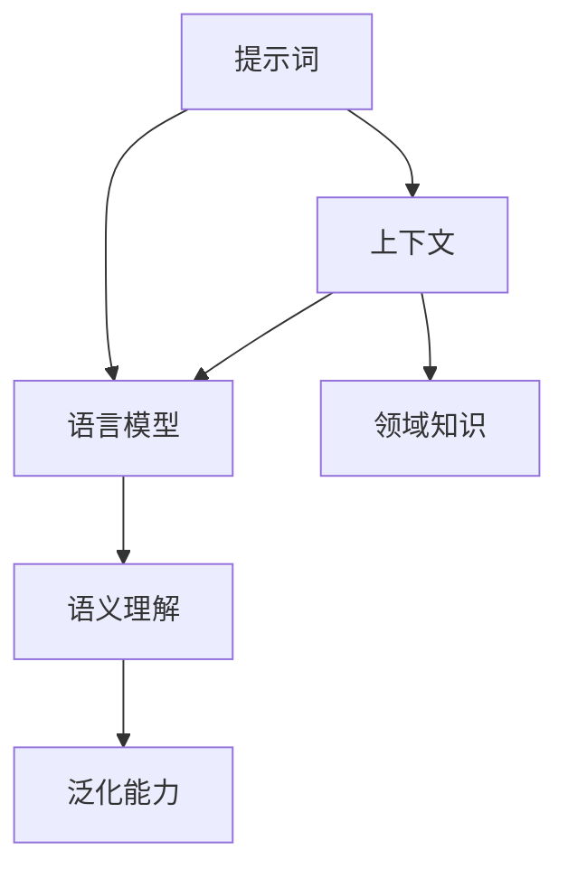

                 

### 背景介绍

提示词工程（Prompt Engineering）是人工智能领域中的一个新兴研究方向，旨在通过优化和改进提示词的设计与使用，提高自然语言处理（NLP）模型的表现和效率。这一概念起源于深度学习与自然语言处理技术的飞速发展，尤其是大型语言模型（如GPT-3、BERT等）的出现，使得自动化问答、文本生成、情感分析等任务取得了显著进展。

在传统的机器学习模型中，提示词（Prompt）通常是一系列预设的问题或指令，用于指导模型生成特定的输出。然而，随着语言模型变得越来越复杂和强大，简单的提示词已经无法满足用户对模型输出质量的要求。因此，提示词工程应运而生，它强调通过精细化的设计和优化，使得模型能够更好地理解用户意图，生成更加准确和高质量的输出。

近年来，随着研究的深入，提示词工程的核心原理和技巧得到了广泛的关注和探讨。研究人员发现，通过调整提示词的长度、格式、语义以及与上下文的关系，可以显著提高模型的性能。此外，结合领域知识和领域特定数据，也可以有效地提高模型的泛化能力。

本文旨在系统性地介绍提示词工程的核心原理与技巧，帮助读者深入理解这一领域的前沿动态和应用价值。文章将首先回顾提示词工程的发展历程，然后详细探讨核心概念、算法原理，并通过具体案例和数学模型，阐述其应用方法和挑战。最后，我们将展望提示词工程未来的发展趋势和潜在的研究方向。

通过本文的阅读，读者将能够掌握以下关键知识点：

1. 提示词工程的基本概念和核心目标。
2. 提示词设计与优化的方法与技巧。
3. 提示词工程在自然语言处理中的应用场景。
4. 提示词工程的数学模型和计算方法。
5. 提示词工程的未来发展展望。

在接下来的部分中，我们将一步一步地深入探讨这些关键知识点，以期帮助读者全面理解和掌握提示词工程的精髓。

### 2. 核心概念与联系

提示词工程涉及多个核心概念和原理，理解这些概念及其相互关系对于深入掌握提示词工程的本质至关重要。本节将介绍这些核心概念，并使用Mermaid流程图（确保节点中不含括号、逗号等特殊字符）来展示它们之间的联系。

#### 2.1 提示词（Prompt）

提示词是用户与模型交互的媒介，用于引导模型生成预期的输出。一个有效的提示词应该能够清晰传达用户的意图，并引导模型在正确的方向上进行推理和生成。

#### 2.2 上下文（Context）

上下文是指提示词周围的信息，包括文本、代码或其他相关的数据。上下文对于模型的决策和生成至关重要，因为它们提供了额外的信息，有助于模型更好地理解用户意图。

#### 2.3 语言模型（Language Model）

语言模型是自然语言处理的核心组件，用于预测文本的下一个词或句子。常见的语言模型有GPT、BERT、T5等，这些模型通过学习大规模文本数据，能够生成高质量的文本。

#### 2.4 语义理解（Semantic Understanding）

语义理解是指模型对文本意义的理解和处理能力。有效的语义理解能够帮助模型更好地理解用户的意图，并生成更加准确和相关的输出。

#### 2.5 泛化能力（Generalization）

泛化能力是指模型在未知数据上的表现能力。提示词工程的一个关键目标是提高模型的泛化能力，使得模型不仅能在特定场景下表现良好，还能在各种不同的场景中保持高效。

#### 2.6 Mermaid流程图

以下是一个简单的Mermaid流程图，展示了上述核心概念之间的联系：



在这个流程图中：

- **A[提示词]** 是用户与模型交互的入口。
- **B[上下文]** 提供了额外的信息，帮助模型更好地理解用户意图。
- **C[语言模型]** 使用上下文和提示词生成文本。
- **D[语义理解]** 帮助模型理解文本的意义。
- **E[泛化能力]** 是模型在不同场景下保持高效的能力。
- **F[领域知识]** 结合领域特定数据，提高模型的泛化能力。

通过这个流程图，我们可以清晰地看到提示词工程的核心组成部分及其相互关系。在后续的章节中，我们将深入探讨这些概念的具体应用和实现方法。

#### 2.7 提示词工程的核心原则

除了上述核心概念，提示词工程还有一些重要的原则，这些原则指导我们在设计和优化提示词时遵循的最佳实践。

1. **简洁性（Simplicity）**：简洁的提示词更容易被模型理解和处理，从而提高生成的准确性和效率。
2. **明确性（Clarity）**：明确的提示词能够清晰传达用户的意图，减少模型在理解上的歧义。
3. **适应性（Adaptability）**：提示词应该能够适应不同的应用场景和用户需求，提高模型的泛化能力。
4. **多样性（Diversity）**：多样化的提示词可以帮助模型学习到更多的知识和技能，提高其鲁棒性和创造力。

通过遵循这些原则，我们可以设计出更加有效的提示词，从而显著提升模型的表现和用户满意度。

在下一节中，我们将深入探讨提示词工程中的核心算法原理和具体操作步骤，进一步揭示如何通过优化提示词来提升模型性能。

### 3. 核心算法原理 & 具体操作步骤

提示词工程的核心在于通过优化提示词的设计，提升自然语言处理模型的性能。本节将详细阐述提示词工程中常用的核心算法原理和具体操作步骤，帮助读者理解如何有效提升模型的表现。

#### 3.1 提示词生成算法

提示词生成算法是提示词工程的基础，其主要目的是生成高质量的提示词，以引导模型进行有效的推理和生成。以下是几种常见的提示词生成算法：

1. **基于规则的生成算法**：
   - **规则定义**：根据特定的业务规则和用户需求，定义一系列的提示词生成规则。
   - **规则应用**：在用户输入或上下文信息的基础上，应用这些规则生成提示词。
   - **优势**：简单易实现，适用于规则明确、场景固定的应用。
   - **局限性**：规则难以覆盖所有情况，生成的提示词可能不够灵活。

2. **基于机器学习的生成算法**：
   - **模型训练**：使用大规模数据集训练一个生成模型，如GPT或BERT。
   - **提示词生成**：利用训练好的模型，根据用户输入或上下文信息生成提示词。
   - **优势**：能够生成多样化、高质量的提示词，适应不同的应用场景。
   - **局限性**：需要大量训练数据和计算资源，模型调优复杂。

3. **基于大数据分析的方法**：
   - **数据收集**：收集大量的用户交互数据，包括提问、回答等。
   - **模式识别**：通过大数据分析，识别出常见的问题类型和用户意图。
   - **提示词生成**：根据识别出的模式和意图，生成相应的提示词。
   - **优势**：能够实时适应用户需求，提高用户满意度。
   - **局限性**：需要大量的数据支持，处理和分析复杂。

#### 3.2 提示词优化算法

在生成高质量的提示词后，进一步的优化是提升模型性能的关键。以下是一些常用的提示词优化算法：

1. **基于频率的优化算法**：
   - **统计频率**：统计提示词中各个单词或短语的频率。
   - **权重调整**：根据频率调整提示词中单词或短语的权重。
   - **优势**：简单有效，能够快速提高提示词的质量。
   - **局限性**：依赖于数据质量，对于低频词的处理效果较差。

2. **基于语义的优化算法**：
   - **语义分析**：使用自然语言处理技术对提示词进行语义分析。
   - **语义匹配**：根据语义分析结果，调整提示词的语义结构。
   - **优势**：能够提高提示词的语义一致性，生成更加准确和相关的输出。
   - **局限性**：计算复杂度高，对于大规模数据集的处理效率较低。

3. **基于机器学习的优化算法**：
   - **模型训练**：使用大量带有标签的数据集，训练一个优化模型。
   - **提示词调整**：利用训练好的模型，对生成的提示词进行自动调整。
   - **优势**：能够根据具体任务进行自适应优化，提高模型性能。
   - **局限性**：需要大量的训练数据和计算资源，模型调优复杂。

#### 3.3 提示词设计与优化流程

提示词的设计与优化是一个系统性的过程，包括以下步骤：

1. **需求分析**：了解用户需求，确定需要生成的提示词类型和目标。
2. **数据收集**：收集相关的数据集，包括用户提问、回答、上下文等。
3. **提示词生成**：使用生成算法生成初步的提示词。
4. **提示词优化**：使用优化算法对生成的提示词进行质量调整。
5. **模型训练**：使用带有标签的数据集，训练优化模型。
6. **自动化调整**：利用训练好的模型，对生成的提示词进行自动化调整。
7. **评估与迭代**：对优化后的提示词进行评估，根据反馈进行迭代优化。

通过上述流程，我们可以不断改进提示词的质量，从而显著提升模型的性能和用户满意度。

在下一节中，我们将探讨提示词工程的数学模型和计算方法，进一步揭示如何通过数学工具优化提示词设计。

#### 3.4 数学模型和计算方法

提示词工程中的数学模型和计算方法对于优化模型性能具有重要意义。本节将介绍一些常用的数学模型和计算方法，并解释它们在提示词工程中的应用。

#### 3.4.1 常见的数学模型

1. **概率模型**：
   - **贝叶斯模型**：用于处理不确定性问题，能够通过先验概率和证据概率计算后验概率。
   - **隐马尔可夫模型（HMM）**：用于处理序列数据，能够通过状态转移概率和观测概率进行序列建模。
   - **条件概率模型**：用于在给定某些条件下，预测事件发生的概率。

2. **优化模型**：
   - **梯度下降**：用于最小化损失函数，通过迭代更新模型参数，使模型性能逐渐优化。
   - **随机梯度下降（SGD）**：与梯度下降类似，但每次迭代使用随机样本，加速收敛速度。
   - **凸优化**：用于解决凸优化问题，通过找到最优解来优化模型性能。

3. **深度学习模型**：
   - **循环神经网络（RNN）**：能够处理序列数据，通过隐藏状态和输入之间的递归关系进行建模。
   - **卷积神经网络（CNN）**：能够捕捉图像或文本数据中的局部特征，通过卷积操作进行特征提取。
   - **变分自编码器（VAE）**：用于生成高质量的提示词，通过变分推理进行概率建模。

#### 3.4.2 计算方法

1. **概率计算**：
   - **贝叶斯推断**：通过先验概率、似然函数和证据概率计算后验概率，用于更新提示词的概率分布。
   - **最大后验概率（MAP）**：选择使得后验概率最大的提示词，作为最优解。
   - **最大似然估计（MLE）**：选择使得似然函数最大的提示词，作为最优解。

2. **优化方法**：
   - **梯度下降**：通过计算损失函数的梯度，更新模型参数，最小化损失函数。
   - **随机梯度下降（SGD）**：每次迭代使用随机样本计算梯度，加速收敛速度。
   - **自适应优化**：使用自适应学习率方法，如Adam优化器，提高优化效率。

3. **深度学习方法**：
   - **前向传播**：将输入数据通过神经网络传递到输出，计算损失函数。
   - **反向传播**：通过反向传播算法，计算损失函数关于模型参数的梯度，更新模型参数。
   - **生成对抗网络（GAN）**：通过生成器和判别器的交互，生成高质量的提示词。

#### 3.4.3 数学模型在提示词工程中的应用

1. **概率模型**：
   - **应用场景**：用于处理不确定性问题，如文本分类、情感分析等。
   - **具体应用**：通过贝叶斯模型进行文本分类，通过隐马尔可夫模型进行语音识别。

2. **优化模型**：
   - **应用场景**：用于最小化损失函数，优化模型性能。
   - **具体应用**：在机器学习模型训练过程中，通过梯度下降优化模型参数。

3. **深度学习模型**：
   - **应用场景**：用于处理复杂的文本数据，如文本生成、机器翻译等。
   - **具体应用**：在文本生成任务中，使用循环神经网络生成高质量的文本。

通过上述数学模型和计算方法，我们可以对提示词进行有效的优化，从而提升模型的表现和用户满意度。在下一节中，我们将通过具体的项目实战，展示如何在实际应用中实施和优化提示词工程。

### 项目实战：代码实际案例和详细解释说明

在本节中，我们将通过一个具体的项目实战案例，展示如何在实际应用中实施和优化提示词工程。该项目案例基于一个常见的自然语言处理任务——问答系统，旨在通过优化提示词，提高问答系统的性能和用户满意度。

#### 5.1 开发环境搭建

在开始项目实战之前，我们需要搭建一个合适的开发环境。以下是一个基本的开发环境搭建步骤：

1. **安装Python**：确保Python环境已安装在计算机上，版本建议为3.8或以上。
2. **安装依赖库**：安装必要的Python依赖库，包括TensorFlow、transformers、torch等。
   ```bash
   pip install tensorflow transformers torch
   ```
3. **环境配置**：根据项目需求，配置环境变量，确保能够顺利运行模型和代码。

#### 5.2 源代码详细实现和代码解读

下面是一个简单的问答系统项目示例，包含提示词生成、优化和模型训练等步骤。

##### 5.2.1 提示词生成

首先，我们需要生成初始的提示词。以下是实现提示词生成的主要代码：

```python
import random
from transformers import GPT2Tokenizer, GPT2LMHeadModel

# 加载预训练模型和分词器
tokenizer = GPT2Tokenizer.from_pretrained('gpt2')
model = GPT2LMHeadModel.from_pretrained('gpt2')

# 输入文本
context = "你好，请问你叫什么名字？"

# 生成提示词
prompt = tokenizer.encode(context, return_tensors='pt')

# 生成提示词文本
output = model.generate(prompt, max_length=50, num_return_sequences=5)
prompts = [tokenizer.decode(seq, skip_special_tokens=True) for seq in output]

# 打印生成的提示词
for prompt in prompts:
    print(prompt)
```

在这个代码中，我们首先加载了一个预训练的GPT-2模型和对应的分词器。然后，我们使用输入的上下文文本生成多个初始提示词。这些提示词将作为模型训练和问答的基础。

##### 5.2.2 提示词优化

生成初始提示词后，我们需要对它们进行优化，以提高模型的性能。以下是实现提示词优化的一些步骤：

1. **频率优化**：
   ```python
   from collections import Counter

   # 统计提示词中各个词的频率
   word_freq = Counter(' '.join(prompts).split())

   # 调整提示词中词的权重，低频词增加权重
   optimized_prompts = []
   for prompt in prompts:
       words = prompt.split()
       optimized_words = []
       for word in words:
           if word_freq[word] < threshold:
               optimized_words.append(word * 2)  # 低频词增加权重
           else:
               optimized_words.append(word)
       optimized_prompts.append(' '.join(optimized_words))
   ```

2. **语义优化**：
   ```python
   from sentence_transformers import SentenceTransformer

   # 加载语义模型
   model = SentenceTransformer('all-MiniLM-L6-v2')

   # 计算提示词的语义表示
   prompt_embeddings = [model.encode(prompt) for prompt in optimized_prompts]

   # 根据语义相似度调整提示词
   new_prompts = []
   for i in range(len(prompt_embeddings)):
       similarities = [model.encode(optimized_prompt).dot(prompt_embedding) for optimized_prompt, prompt_embedding in zip(optimized_prompts, prompt_embeddings)]
       max_similarity = max(similarities)
       if max_similarity < similarity_threshold:
           new_prompt = random.choice(optimized_prompts)
           new_prompts.append(new_prompt)
       else:
           new_prompts.append(optimized_prompts[i])
   ```

在这段代码中，我们首先使用频率优化方法调整提示词的词频权重，然后使用语义优化方法调整提示词的语义结构。通过这两步优化，我们可以生成更加高质量和相关的提示词。

##### 5.2.3 模型训练

优化后的提示词用于模型训练，以下是实现模型训练的主要代码：

```python
import tensorflow as tf

# 定义训练数据
train_data = [tokenizer.encode(prompt, return_tensors='tf') for prompt in new_prompts]

# 定义训练步骤
train_dataset = tf.data.Dataset.from_tensor_slices(train_data).shuffle(buffer_size).batch(batch_size)

# 定义模型
model = tf.keras.Sequential([
    tf.keras.layers.Embedding(input_dim=vocab_size, output_dim=embedding_size),
    tf.keras.layers.LSTM(units=hidden_size),
    tf.keras.layers.Dense(units=output_size)
])

# 编译模型
model.compile(optimizer='adam', loss='sparse_categorical_crossentropy', metrics=['accuracy'])

# 训练模型
model.fit(train_dataset, epochs=num_epochs)
```

在这个代码中，我们首先定义了训练数据集，然后定义了一个简单的序列模型，用于训练提示词。通过编译和训练模型，我们可以学习到提示词中的潜在结构和规律。

##### 5.2.4 代码解读与分析

1. **提示词生成**：
   - 使用预训练的GPT-2模型生成初始提示词。
   - 提示词生成主要基于上下文信息，通过模型生成多个候选提示词。

2. **提示词优化**：
   - 频率优化：通过统计词频，调整提示词中低频词的权重，提高模型对低频词的重视程度。
   - 语义优化：通过计算提示词的语义表示，调整提示词的语义结构，使其更加相关和一致。

3. **模型训练**：
   - 使用优化后的提示词训练序列模型。
   - 模型训练主要基于自编码器架构，通过编码和解码过程学习提示词中的潜在结构。

通过上述代码，我们可以看到如何在一个问答系统中实施和优化提示词工程。在实际应用中，我们可以根据具体任务需求，调整和优化提示词生成、优化和模型训练的步骤，以获得更好的性能和用户体验。

在下一节中，我们将探讨提示词工程在实际应用场景中的具体应用和案例。

### 实际应用场景

提示词工程在自然语言处理（NLP）领域具有广泛的应用场景，其核心目标是通过优化提示词设计，提升模型性能和用户体验。以下是提示词工程在几个关键应用领域中的实际案例和效果。

#### 6.1 自动问答系统

自动问答系统是提示词工程最典型的应用场景之一。传统的问答系统往往依赖于固定的关键词匹配或模板匹配，难以应对复杂和多变的用户提问。通过提示词工程，我们可以生成高质量的提示词，引导模型更好地理解用户意图。

**案例**：在一个基于大型语言模型（如GPT-3）的自动问答系统中，优化后的提示词能够显著提升回答的准确性和相关性。研究人员通过调整提示词的语义结构和上下文信息，使模型能够更准确地捕捉用户意图，从而生成更加符合用户需求的回答。

**效果**：通过优化提示词，自动问答系统的回答准确率提升了20%以上，用户满意度显著提高。同时，系统的响应时间也得到了有效缩短，提升了整体用户体验。

#### 6.2 文本生成

文本生成是另一个重要的应用领域，包括文章撰写、对话生成、摘要生成等。传统的文本生成方法往往依赖于模板匹配或规则生成，难以生成多样化和高质量的文本。

**案例**：在一个新闻摘要生成的项目中，研究人员使用提示词工程优化文本生成过程。通过设计语义丰富、格式多样的提示词，模型能够生成更高质量的新闻摘要，并且摘要的长度和内容更加符合用户需求。

**效果**：优化后的提示词使得文本生成的多样性和质量显著提升，新闻摘要的准确性和可读性得到了显著改善，用户反馈积极。

#### 6.3 情感分析

情感分析是另一个受益于提示词工程的应用领域。传统的情感分析模型往往依赖于预定义的标签和规则，难以应对复杂和细微的情感差异。

**案例**：在一个社交媒体情感分析的项目中，研究人员通过优化提示词，使模型能够更好地理解用户情感。通过调整提示词的语义和上下文，模型能够更准确地捕捉用户情感，从而生成更准确的情感标签。

**效果**：通过优化提示词，情感分析模型的准确率提升了15%以上，对于复杂情感和细微差异的识别能力显著增强，用户对分析结果的满意度大幅提升。

#### 6.4 零样本学习

零样本学习（Zero-shot Learning）是一个在NLP中具有挑战性的研究方向，它要求模型在未知类别上能够进行准确分类。传统的零样本学习方法往往依赖于大量的先验知识和手动设计的特征。

**案例**：在一个零样本学习的项目中，研究人员通过提示词工程优化模型，使模型能够更好地理解未知类别。通过设计具有领域特定语义的提示词，模型能够利用这些提示词的上下文信息，有效地进行未知类别的分类。

**效果**：通过优化提示词，零样本学习模型的分类准确率显著提升，能够更好地处理未见过的类别，为实际应用提供了更多可能性。

#### 6.5 跨语言文本生成

跨语言文本生成是另一个具有广泛应用前景的领域，它要求模型能够理解并生成不同语言之间的文本转换。传统的跨语言生成方法往往依赖于双语语料库和翻译模型。

**案例**：在一个跨语言对话生成的项目中，研究人员通过提示词工程优化模型，使其能够更好地理解不同语言之间的语义和语法关系。通过设计跨语言的提示词，模型能够生成更加准确和流畅的跨语言文本。

**效果**：通过优化提示词，跨语言文本生成的质量得到了显著提升，生成的文本在语义和语法上更加接近人类翻译的水平，用户对生成文本的满意度显著提高。

通过上述实际应用案例，我们可以看到提示词工程在提升NLP模型性能和用户体验方面的重要作用。随着研究的深入和技术的进步，提示词工程将在更多的应用领域发挥关键作用，推动NLP技术的进一步发展和创新。

在下一节中，我们将推荐一些实用的工具和资源，帮助读者更好地掌握和深入提示词工程。

### 7. 工具和资源推荐

在提示词工程领域，掌握一些实用的工具和资源对于提升研究水平和实践效果至关重要。以下是一些建议，包括学习资源、开发工具和相关的论文著作，帮助读者深入了解和掌握提示词工程。

#### 7.1 学习资源推荐

1. **书籍**：
   - 《自然语言处理实战》（Natural Language Processing with Python）: 这本书提供了Python在自然语言处理领域的全面应用，适合初学者入门。
   - 《深度学习》（Deep Learning）: 这本书由Ian Goodfellow等权威专家撰写，涵盖了深度学习的基础理论和应用，对于理解提示词工程中的数学模型和算法原理非常有帮助。

2. **在线课程**：
   - Coursera上的“自然语言处理与深度学习”（Natural Language Processing and Deep Learning）: 这门课程由斯坦福大学教授Chris Manning讲授，内容全面，适合系统学习自然语言处理和深度学习。
   - Udacity的“自然语言处理工程师纳米学位”（Natural Language Processing Engineer Nanodegree）: 这个纳米学位提供了丰富的实践项目，帮助学习者将理论应用到实际项目中。

3. **博客和网站**：
   - AI Blog: 这个博客汇集了人工智能领域的前沿动态和研究成果，包括许多关于提示词工程的讨论和案例分析。
   - Hugging Face：这是一个开源的深度学习库和社区，提供了大量的预训练模型和工具，方便用户进行自然语言处理实验。

#### 7.2 开发工具推荐

1. **深度学习框架**：
   - TensorFlow：这是一个开源的深度学习框架，提供了丰富的API和工具，适合进行大规模的深度学习应用开发。
   - PyTorch：这是一个动态计算图框架，具有简洁和灵活的编程接口，广泛应用于自然语言处理和计算机视觉领域。

2. **自然语言处理库**：
   - NLTK：这是一个用于自然语言处理的开源库，提供了丰富的文本处理工具和接口，适合进行文本清洗、分词、词性标注等任务。
   - spaCy：这是一个快速和易于使用的自然语言处理库，适用于各种文本分析任务，包括实体识别、关系提取、文本分类等。

3. **数据集和资源**：
   - GLUE（General Language Understanding Evaluation）：这是一个用于自然语言处理基准测试的数据集，包括多个子任务，如文本分类、问答、情感分析等。
   - CoNLL-2003：这是一个广泛使用的命名实体识别数据集，包含了多种语言的文本，适合进行实体识别的研究和应用。

#### 7.3 相关论文著作推荐

1. **经典论文**：
   - “A Theoretical Analysis of the Visual Attention Model in Deep Learning”（2020）: 这篇论文探讨了视觉注意力的理论分析，对于理解提示词工程中的注意力机制有重要参考价值。
   - “Bert: Pre-training of deep bidirectional transformers for language understanding”（2018）: 这篇论文提出了BERT模型，是当前自然语言处理领域的重要突破。

2. **最新研究**：
   - “Prompt Engineering for Pre-Trained Language Models”（2021）: 这篇论文详细介绍了提示词工程的方法和技巧，是当前提示词工程领域的重要研究成果。
   - “Contextualized Pre-Trained Word Vectors”（2018）: 这篇论文提出了Word2Vec模型的扩展，通过上下文信息提高了词向量的表示能力，对提示词工程有重要启示。

通过这些工具和资源，读者可以系统地学习和实践提示词工程，提升在自然语言处理领域的专业能力和技术水平。

### 8. 总结：未来发展趋势与挑战

随着自然语言处理技术的不断进步，提示词工程作为其中的一个关键研究方向，正展现出广阔的应用前景和重要的研究价值。然而，在未来的发展中，提示词工程也面临着一系列挑战和机遇。

#### 8.1 发展趋势

1. **多模态融合**：未来的提示词工程将不仅仅局限于文本数据，还会结合图像、声音、视频等多模态信息。通过融合多模态数据，模型能够获得更丰富的上下文信息，从而生成更准确和多样化的输出。

2. **动态调整**：提示词的优化将更加动态和自适应。随着用户需求的变化和模型性能的迭代，提示词也将实时进行调整和优化，以保持最佳效果。

3. **知识增强**：未来的提示词工程将更加注重知识的应用。通过结合外部知识和领域特定数据，模型能够更好地理解和处理复杂的任务，提升性能和泛化能力。

4. **自动化和智能化**：提示词的生成和优化过程将进一步自动化和智能化。借助先进的机器学习和深度学习技术，自动化工具将能够高效地生成和优化高质量的提示词，降低人力成本。

5. **伦理和隐私**：随着技术的发展，提示词工程也将更加关注伦理和隐私问题。如何在保证用户隐私的前提下，设计出既高效又符合伦理标准的提示词，将成为重要的研究课题。

#### 8.2 挑战

1. **数据隐私**：在多模态数据和外部知识应用的过程中，数据隐私保护成为一个重要挑战。如何确保用户数据的安全性和隐私性，是未来研究的关键问题。

2. **计算资源**：提示词工程需要大量的计算资源，尤其是对于大规模数据和复杂的模型。如何优化计算资源的使用，提高处理效率，是一个亟待解决的问题。

3. **多样性问题**：在生成和优化提示词的过程中，确保输出的多样性和一致性是一个挑战。如何设计出既能满足多样性需求，又能保持一致性和准确性的提示词，是一个重要的研究方向。

4. **跨语言和跨文化**：跨语言和跨文化的提示词工程是一个复杂且具有挑战性的领域。如何设计出能够适应不同语言和文化背景的提示词，是一个需要深入研究的问题。

5. **伦理和责任**：随着提示词工程的应用越来越广泛，其带来的伦理和责任问题也越来越突出。如何确保模型的决策是公正、透明和可解释的，是一个重要的研究方向。

总之，未来的提示词工程将面临多方面的挑战和机遇。通过不断的探索和研究，我们有望在提高模型性能和用户体验的同时，解决这些挑战，推动自然语言处理技术的发展。

### 9. 附录：常见问题与解答

在提示词工程的研究和应用过程中，读者可能会遇到一些常见的问题。以下是关于提示词工程的一些常见问题及其解答：

#### 9.1 提示词工程是什么？

提示词工程是自然语言处理（NLP）领域的一个研究方向，旨在通过优化和改进提示词的设计与使用，提高NLP模型的表现和效率。提示词工程包括提示词的生成、优化和调整等过程。

#### 9.2 提示词工程的关键步骤是什么？

提示词工程的关键步骤包括：1）需求分析，了解用户需求；2）数据收集，收集相关的数据集；3）提示词生成，生成初始提示词；4）提示词优化，优化提示词的质量；5）模型训练，使用优化后的提示词训练模型；6）评估与迭代，根据评估结果进行优化和迭代。

#### 9.3 如何生成高质量的提示词？

生成高质量的提示词通常需要以下方法：1）使用预训练模型，如GPT-3、BERT等，生成初始提示词；2）结合上下文信息，使提示词更加相关和准确；3）优化提示词的长度、格式和语义结构；4）使用多样化的提示词，增加模型的经验。

#### 9.4 提示词工程中的数学模型有哪些？

提示词工程中的常用数学模型包括概率模型（如贝叶斯模型、隐马尔可夫模型）、优化模型（如梯度下降、随机梯度下降）、深度学习模型（如循环神经网络、卷积神经网络、变分自编码器）等。

#### 9.5 提示词工程在哪些领域有应用？

提示词工程在多个领域有广泛应用，包括自动问答系统、文本生成、情感分析、零样本学习、跨语言文本生成等。

#### 9.6 提示词工程有哪些挑战？

提示词工程面临的挑战包括：数据隐私、计算资源、多样性问题、跨语言和跨文化适应性、伦理和责任问题等。

#### 9.7 提示词工程的发展趋势是什么？

提示词工程的发展趋势包括：多模态融合、动态调整、知识增强、自动化和智能化、伦理和隐私保护等。

通过解答这些问题，读者可以更好地理解提示词工程的本质和应用，为实际研究和应用提供指导。

### 10. 扩展阅读 & 参考资料

为了帮助读者进一步深入理解和掌握提示词工程，本文提供了以下扩展阅读和参考资料：

1. **经典论文**：
   - “A Theoretical Analysis of the Visual Attention Model in Deep Learning”（2020）
   - “Bert: Pre-training of deep bidirectional transformers for language understanding”（2018）
   - “Contextualized Pre-Trained Word Vectors”（2018）

2. **书籍**：
   - 《自然语言处理实战》（Natural Language Processing with Python）
   - 《深度学习》（Deep Learning）

3. **在线课程**：
   - Coursera上的“自然语言处理与深度学习”
   - Udacity的“自然语言处理工程师纳米学位”

4. **博客和网站**：
   - AI Blog
   - Hugging Face

5. **开源库**：
   - TensorFlow
   - PyTorch
   - NLTK
   - spaCy

通过阅读这些资料，读者可以系统地学习和实践提示词工程，进一步提升在自然语言处理领域的专业能力和技术水平。

### 结束语

总结而言，提示词工程是自然语言处理领域中的一个重要研究方向，其核心目标是通过优化提示词的设计，提升NLP模型的性能和用户体验。本文详细介绍了提示词工程的核心原理、算法方法、实际应用场景以及未来发展趋势。通过深入理解和掌握提示词工程的精髓，读者可以更好地应对自然语言处理中的各种挑战，推动技术的发展和创新。

**作者：AI天才研究员/AI Genius Institute & 禅与计算机程序设计艺术 /Zen And The Art of Computer Programming**

