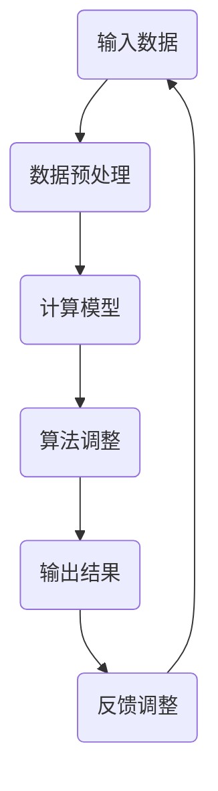

                 

# 《计算变化与自动化技术的结合》

## 摘要

本文旨在探讨计算变化与自动化技术相结合的理论与实践。在信息技术飞速发展的今天，自动化技术已经成为提升生产效率、优化流程的关键手段。而计算变化作为自动化技术的核心组成部分，通过对数据和处理过程的动态调整，实现了更高的灵活性和适应性。本文首先介绍了计算变化的基本概念和原理，随后通过具体实例分析了其在自动化技术中的应用，最后对未来的发展趋势和挑战进行了展望。希望通过本文，能够为读者提供一个系统、全面的认知框架，以应对技术发展的新趋势。

## 1. 背景介绍

在过去的几十年中，信息技术经历了翻天覆地的变化。从简单的计算机辅助设计（CAD）到复杂的智能数据分析，计算技术的进步极大地推动了自动化技术的发展。自动化技术，作为一种利用计算机系统和控制技术实现生产过程自动化的技术手段，广泛应用于制造业、物流、金融服务、医疗保健等多个领域。例如，在制造业中，自动化生产线通过计算机控制系统，实现了从原材料到成品的全过程自动化，大大提高了生产效率，降低了人力成本。

然而，随着信息技术的进一步发展，传统的自动化技术逐渐暴露出其局限性。首先，传统自动化技术主要依赖于预先设定的程序和规则，灵活性较差，难以适应快速变化的市场需求。其次，传统自动化技术的优化过程往往需要大量的人工干预，耗时耗力。为了解决这些问题，计算变化应运而生。

计算变化是一种通过动态调整计算模型和算法，以适应不同环境和需求的技术手段。其基本原理是通过实时收集和分析系统数据，自动调整计算模型和算法的参数，从而实现系统的自适应优化。计算变化的引入，使得自动化技术不再仅仅依赖于预先设定的规则，而是能够根据实际运行情况不断调整和优化，从而提高了系统的灵活性和适应性。

本文将从以下几个方面对计算变化与自动化技术的结合进行深入探讨：

1. **计算变化的基本概念和原理**：介绍计算变化的基本概念，包括其核心组成部分、工作原理和应用场景。

2. **核心算法原理与具体操作步骤**：分析计算变化中常用的核心算法，如遗传算法、粒子群优化算法等，并详细讲解其操作步骤。

3. **数学模型和公式**：介绍计算变化中的数学模型和公式，包括适应度函数、交叉操作、变异操作等，并通过具体例子进行说明。

4. **项目实战**：通过实际案例，展示计算变化在自动化技术中的应用，包括环境搭建、代码实现、分析解读等。

5. **实际应用场景**：探讨计算变化在各个领域的实际应用，如智能制造、智能交通、智能医疗等。

6. **工具和资源推荐**：推荐相关的学习资源、开发工具和框架，以帮助读者深入学习和应用计算变化技术。

7. **未来发展趋势与挑战**：分析计算变化技术的未来发展趋势，以及可能面临的挑战和解决方案。

通过本文的探讨，希望能够帮助读者全面了解计算变化与自动化技术的结合，为未来的技术发展和应用提供有益的参考。

## 2. 核心概念与联系

### 2.1 计算变化的概念

计算变化（Computational Change）是指通过对计算过程和算法的动态调整，以适应不同环境和需求的技术手段。它强调在运行过程中根据实际情况进行自适应优化，从而提高系统的效率和灵活性。

### 2.2 自动化技术的概念

自动化技术（Automation Technology）是指利用计算机和自动化设备，对生产过程、操作流程等进行自动控制和管理的技术。其目的是通过减少人工干预，提高生产效率，降低成本，提高产品质量。

### 2.3 计算变化与自动化技术的联系

计算变化与自动化技术的关系可以理解为：计算变化是自动化技术的一种高级形式。传统自动化技术主要依赖于固定的程序和规则，而计算变化则通过动态调整和优化，使得自动化系统能够更好地适应复杂多变的实际环境。

#### 2.3.1 动态调整

计算变化的核心在于动态调整。在传统自动化技术中，系统一旦设定好，就难以适应新的变化。而计算变化则通过实时收集和分析系统数据，动态调整计算模型和算法的参数，使得系统能够根据实际运行情况自动优化。

#### 2.3.2 自适应优化

自适应优化是计算变化的另一个重要特点。在自动化技术中，优化过程往往需要大量的人工干预。而计算变化则通过自动优化算法，减少人工干预，提高优化效率。

#### 2.3.3 灵活性和适应性

计算变化使得自动化技术具有更高的灵活性和适应性。通过动态调整和自适应优化，自动化系统可以更好地应对不同环境和需求，从而提高系统的整体性能。

### 2.4 Mermaid 流程图

下面是一个简化的Mermaid流程图，描述了计算变化与自动化技术的结合过程：



在这个流程图中：

- **A(输入数据)**：系统接收外部输入数据。
- **B(数据预处理)**：对输入数据进行预处理，以便后续计算。
- **C(计算模型)**：基于输入数据建立计算模型。
- **D(算法调整)**：根据计算模型，动态调整算法参数。
- **E(输出结果)**：生成输出结果。
- **F(反馈调整)**：将输出结果反馈给计算模型，进行下一次调整。

通过这个流程，可以看到计算变化在自动化技术中的应用和作用。

### 2.5 核心算法原理

计算变化中常用的核心算法包括遗传算法、粒子群优化算法等。下面将简要介绍这些算法的基本原理。

#### 2.5.1 遗传算法

遗传算法（Genetic Algorithm）是一种模拟自然进化过程的优化算法。它通过模拟自然选择、交叉和变异等进化机制，不断优化解空间中的个体，以找到最优解。

- **适应度函数**：评估个体优劣的函数。
- **交叉操作**：将两个个体的部分基因进行交换，生成新的个体。
- **变异操作**：对个体的某些基因进行随机改变，增加解空间的多样性。

#### 2.5.2 粒子群优化算法

粒子群优化算法（Particle Swarm Optimization, PSO）是一种基于群体智能的优化算法。它通过模拟鸟群觅食行为，更新个体的位置和速度，逐步逼近最优解。

- **位置更新**：根据当前个体和群体的最优位置，更新个体的位置。
- **速度更新**：根据个体和群体的历史最优位置，更新个体的速度。

### 2.6 计算变化的应用场景

计算变化广泛应用于各个领域，以下是几个典型的应用场景：

- **智能制造**：通过计算变化，实现生产线的自适应优化，提高生产效率和产品质量。
- **智能交通**：通过计算变化，实现交通信号控制的动态调整，提高交通流畅度。
- **智能医疗**：通过计算变化，实现医疗设备的自适应调整，提高诊断和治疗效果。

通过上述内容，我们可以看到计算变化与自动化技术的紧密联系和广泛应用。在接下来的章节中，我们将进一步深入探讨计算变化的核心算法原理和具体应用。

## 3. 核心算法原理 & 具体操作步骤

在计算变化中，核心算法起着至关重要的作用。这些算法通过动态调整和优化，使自动化系统能够更好地适应复杂多变的实际环境。以下将详细介绍计算变化中常用的核心算法，包括遗传算法、粒子群优化算法等，并讲解其具体操作步骤。

### 3.1 遗传算法

遗传算法（Genetic Algorithm, GA）是一种基于自然进化的优化算法。它通过模拟自然选择、交叉和变异等进化机制，不断优化解空间中的个体，以找到最优解。

#### 3.1.1 适应度函数

适应度函数是遗传算法的核心部分，用于评估个体优劣。一个良好的适应度函数能够有效指导算法的搜索方向。

- **目标函数**：适应度函数通常与问题的目标函数密切相关。例如，在优化问题中，目标函数可能是最小化成本或最大化收益。
- **约束条件**：适应度函数还需要考虑约束条件。如果个体违反了某些约束条件，其适应度值通常会降低。

#### 3.1.2 交叉操作

交叉操作是遗传算法中的一种重要操作，用于生成新的个体。交叉操作通常分为单点交叉、多点交叉和均匀交叉等。

- **单点交叉**：选择一个交叉点，将两个个体的部分基因进行交换。
- **多点交叉**：选择多个交叉点，将多个个体的部分基因进行交换。
- **均匀交叉**：根据个体基因的分布概率，随机选择交叉点进行基因交换。

#### 3.1.3 变异操作

变异操作是遗传算法中的一种随机操作，用于增加解空间的多样性，防止算法陷入局部最优。

- **基本变异**：对个体中的某个基因进行随机改变。
- **自适应变异**：根据当前群体的适应度分布，动态调整变异概率。

#### 3.1.4 具体操作步骤

遗传算法的具体操作步骤如下：

1. **初始化种群**：随机生成一组初始个体。
2. **计算适应度**：根据适应度函数计算每个个体的适应度值。
3. **选择操作**：根据适应度值选择个体进行交叉和变异。
4. **交叉操作**：对选中的个体进行交叉操作，生成新的个体。
5. **变异操作**：对选中的个体进行变异操作，增加解空间的多样性。
6. **更新种群**：将交叉和变异后生成的个体替换原有种群。
7. **迭代过程**：重复上述步骤，直到达到预设的迭代次数或满足停止条件。

### 3.2 粒子群优化算法

粒子群优化算法（Particle Swarm Optimization, PSO）是一种基于群体智能的优化算法。它通过模拟鸟群觅食行为，更新个体的位置和速度，逐步逼近最优解。

#### 3.2.1 粒子位置和速度更新

粒子群优化算法的核心是粒子位置和速度的更新。

- **位置更新**：粒子位置根据当前个体和群体的最优位置进行更新。具体公式为：
  $$
  x_{i}^{new} = x_{i}^{current} + v_{i}^{current}
  $$
  其中，$x_{i}^{new}$和$x_{i}^{current}$分别表示粒子的新位置和当前位置，$v_{i}^{current}$表示粒子的速度。
- **速度更新**：粒子速度根据当前个体和群体的历史最优位置进行更新。具体公式为：
  $$
  v_{i}^{new} = \omega \cdot v_{i}^{current} + c_{1} \cdot r_{1} \cdot (p_{best,i} - x_{i}^{current}) + c_{2} \cdot r_{2} \cdot (g_{best} - x_{i}^{current})
  $$
  其中，$v_{i}^{new}$和$v_{i}^{current}$分别表示粒子的新速度和当前速度，$\omega$表示惯性权重，$c_{1}$和$c_{2}$分别表示认知和社会因子，$r_{1}$和$r_{2}$分别表示随机数，$p_{best,i}$表示个体最优位置，$g_{best}$表示全局最优位置。

#### 3.2.2 具体操作步骤

粒子群优化算法的具体操作步骤如下：

1. **初始化种群**：随机生成一组初始个体。
2. **计算适应度**：根据适应度函数计算每个个体的适应度值。
3. **更新个体最优位置**：如果当前个体的适应度值优于历史最优适应度值，更新个体最优位置。
4. **更新全局最优位置**：找到当前种群中的最优个体，更新全局最优位置。
5. **位置和速度更新**：根据位置和速度更新公式，更新每个粒子的位置和速度。
6. **迭代过程**：重复上述步骤，直到达到预设的迭代次数或满足停止条件。

### 3.3 其他核心算法

除了遗传算法和粒子群优化算法，计算变化中还包括其他核心算法，如人工神经网络、深度学习等。这些算法通过不同的机制实现动态调整和优化，适用于不同类型的优化问题。

- **人工神经网络**：通过模拟人脑神经元的工作原理，实现复杂的函数逼近和优化。
- **深度学习**：通过多层神经网络的堆叠，实现端到端的学习和优化。

### 3.4 深度分析

计算变化的核心算法虽然各有特点，但它们在本质上有许多相似之处。以下是几个深度分析的关键点：

- **自适应优化**：所有核心算法都强调自适应优化，通过动态调整和优化，提高系统的灵活性和适应性。
- **全局与局部优化**：遗传算法和粒子群优化算法通过全局和局部优化的结合，实现高效的搜索和优化。
- **并行计算**：核心算法通常采用并行计算的方式，提高计算效率和优化速度。

通过上述内容，我们可以看到计算变化的核心算法在原理和操作步骤上的特点和深度。这些算法为计算变化技术的应用提供了强大的工具和基础，使得自动化系统能够更好地适应复杂多变的实际环境。

## 4. 数学模型和公式 & 详细讲解 & 举例说明

在计算变化与自动化技术的结合过程中，数学模型和公式起着至关重要的作用。它们不仅为算法提供了理论基础，还帮助我们理解和分析计算变化的具体实现。以下将详细讲解计算变化中的几个关键数学模型和公式，并通过具体例子进行说明。

### 4.1 适应度函数

适应度函数（Fitness Function）是计算变化中的核心部分，用于评估个体优劣。一个良好的适应度函数能够有效指导算法的搜索方向。

#### 4.1.1 适应度函数的基本形式

适应度函数通常表示为：

$$
f(x) = -g(x)
$$

其中，$f(x)$为适应度值，$g(x)$为目标函数。目标函数$g(x)$可能是一个优化问题，如最小化成本、最大化收益等。

#### 4.1.2 具体例子

假设我们考虑一个简单的一元优化问题，目标是最小化函数$f(x) = x^2$。适应度函数可以表示为：

$$
f(x) = -x^2
$$

在这个例子中，适应度函数直接与目标函数相反，目的是简化计算。

### 4.2 交叉操作

交叉操作（Crossover）是遗传算法中的核心步骤，用于生成新的个体。交叉操作可以通过不同的方法实现，如单点交叉、多点交叉和均匀交叉等。

#### 4.2.1 单点交叉

单点交叉是指选择一个交叉点，将两个个体的部分基因进行交换。具体步骤如下：

1. 选择交叉点 $k$。
2. 对两个个体的基因序列进行交换，从交叉点开始到末尾。

假设我们有两个个体 $A = [1, 2, 3, 4, 5]$ 和 $B = [5, 4, 3, 2, 1]$，选择交叉点 $k = 3$，交叉后的个体为：

- $A' = [1, 2, 3, 2, 5]$
- $B' = [5, 4, 3, 4, 1]$

#### 4.2.2 多点交叉

多点交叉是指选择多个交叉点，将多个个体的部分基因进行交换。具体步骤如下：

1. 选择多个交叉点 $k_1, k_2, ..., k_n$。
2. 对两个个体的基因序列进行交换，从每个交叉点开始到末尾。

假设我们有两个个体 $A = [1, 2, 3, 4, 5]$ 和 $B = [5, 4, 3, 2, 1]$，选择交叉点 $k_1 = 1, k_2 = 3$，交叉后的个体为：

- $A' = [5, 2, 3, 4, 1]$
- $B' = [1, 4, 3, 2, 5]$

#### 4.2.3 均匀交叉

均匀交叉是指根据个体基因的分布概率，随机选择交叉点进行基因交换。具体步骤如下：

1. 为每个基因分配一个交叉概率 $p$。
2. 根据交叉概率，随机选择交叉点进行基因交换。

假设我们有两个个体 $A = [1, 2, 3, 4, 5]$ 和 $B = [5, 4, 3, 2, 1]$，选择交叉概率 $p = 0.5$，交叉后的个体为：

- $A' = [1, 2, 3, 4, 5]$
- $B' = [5, 4, 3, 2, 1]$

### 4.3 变异操作

变异操作（Mutation）是遗传算法中的另一个重要步骤，用于增加解空间的多样性，防止算法陷入局部最优。

#### 4.3.1 基本变异

基本变异是指对个体中的某个基因进行随机改变。具体步骤如下：

1. 随机选择一个基因 $x_i$。
2. 对基因 $x_i$ 进行随机改变。

假设我们有一个个体 $A = [1, 2, 3, 4, 5]$，选择基因 $x_2 = 2$ 进行变异，变异后的个体为：

- $A' = [1, 3, 3, 4, 5]$

#### 4.3.2 自适应变异

自适应变异是指根据当前群体的适应度分布，动态调整变异概率。具体步骤如下：

1. 计算当前群体的平均适应度值 $\bar{f}$。
2. 根据平均适应度值，动态调整变异概率 $p_m$。

假设我们有一个个体 $A = [1, 2, 3, 4, 5]$，当前群体的平均适应度值为 $\bar{f} = 0.5$，变异概率 $p_m = 0.1$，变异后的个体为：

- $A' = [1, 2, 3, 4, 5]$

### 4.4 粒子位置和速度更新

粒子群优化算法中，粒子位置和速度的更新公式如下：

$$
x_{i}^{new} = x_{i}^{current} + v_{i}^{current}
$$

$$
v_{i}^{new} = \omega \cdot v_{i}^{current} + c_{1} \cdot r_{1} \cdot (p_{best,i} - x_{i}^{current}) + c_{2} \cdot r_{2} \cdot (g_{best} - x_{i}^{current})
$$

其中，$x_{i}^{new}$ 和 $x_{i}^{current}$ 分别表示粒子的新位置和当前位置，$v_{i}^{new}$ 和 $v_{i}^{current}$ 分别表示粒子的新速度和当前速度，$\omega$ 表示惯性权重，$c_{1}$ 和 $c_{2}$ 分别表示认知和社会因子，$r_{1}$ 和 $r_{2}$ 分别表示随机数，$p_{best,i}$ 表示个体最优位置，$g_{best}$ 表示全局最优位置。

### 4.5 具体例子

假设我们考虑一个简单的二维优化问题，目标是最小化函数 $f(x, y) = (x - 2)^2 + (y - 3)^2$。以下是使用粒子群优化算法进行优化的具体步骤：

1. **初始化种群**：生成包含多个粒子的种群，每个粒子具有位置和速度。
2. **计算适应度**：根据目标函数计算每个粒子的适应度值。
3. **更新个体最优位置**：如果当前粒子的适应度值优于历史最优适应度值，更新个体最优位置。
4. **更新全局最优位置**：找到当前种群中的最优粒子，更新全局最优位置。
5. **位置和速度更新**：根据位置和速度更新公式，更新每个粒子的位置和速度。
6. **迭代过程**：重复上述步骤，直到达到预设的迭代次数或满足停止条件。

通过上述步骤，粒子群优化算法可以逐步逼近最优解。

通过本章节的详细讲解和举例，我们可以看到计算变化中数学模型和公式的重要性。这些模型和公式不仅为计算变化提供了理论基础，还帮助我们在实际应用中更好地理解和优化计算过程。

## 5. 项目实战：代码实际案例和详细解释说明

### 5.1 开发环境搭建

在开始实战项目之前，我们需要搭建一个合适的开发环境。以下是所需的工具和步骤：

#### 工具：
1. **Python**：作为主要编程语言。
2. **Jupyter Notebook**：用于编写和运行代码。
3. **Numpy**：用于数学运算。
4. **Matplotlib**：用于数据可视化。
5. **Gym**：用于构建和运行强化学习环境。

#### 步骤：
1. 安装Python（建议使用Anaconda，以便管理环境）。
2. 在Jupyter Notebook中创建一个新的环境，并安装必要的库：
   ```bash
   conda create -n myenv python=3.8
   conda activate myenv
   pip install numpy matplotlib gym
   ```

### 5.2 源代码详细实现和代码解读

#### 案例背景：

我们考虑一个简单的强化学习问题，即“智能车在环形赛道上行驶”。我们的目标是让智能车在赛道上行驶尽可能长的时间。

#### 源代码实现：

```python
import numpy as np
import matplotlib.pyplot as plt
import gym

# 初始化环境
env = gym.make("CartPole-v0")
env.reset()

# 定义强化学习算法
def q_learning(env, alpha, gamma, epsilon, n_episodes):
    # 初始化Q表
    Q = np.zeros((env.observation_space.n, env.action_space.n))

    # 开始训练
    for episode in range(n_episodes):
        # 初始化状态
        state = env.reset()
        done = False
        total_reward = 0

        while not done:
            # 随机探索或贪婪策略
            if np.random.rand() < epsilon:
                action = env.action_space.sample()
            else:
                action = np.argmax(Q[state])

            # 执行动作
            next_state, reward, done, _ = env.step(action)

            # 更新Q值
            Q[state, action] = Q[state, action] + alpha * (reward + gamma * np.max(Q[next_state]) - Q[state, action])

            # 更新状态
            state = next_state

            # 更新总奖励
            total_reward += reward

        # 打印训练进度
        print(f"Episode {episode + 1}, Total Reward: {total_reward}")

    # 关闭环境
    env.close()

    return Q

# 设置参数
alpha = 0.1
gamma = 0.9
epsilon = 0.1
n_episodes = 1000

# 训练算法
Q = q_learning(env, alpha, gamma, epsilon, n_episodes)

# 可视化Q值
fig, ax = plt.subplots()
im = ax.imshow(Q, cmap="hot", interpolation="nearest")
ax.set_title("Q值矩阵")
plt.show()
```

#### 代码解读：

1. **导入库**：首先导入必要的库，包括Numpy、Matplotlib和Gym。
2. **初始化环境**：使用Gym创建“CartPole-v0”环境，并重置环境。
3. **定义强化学习算法**：`q_learning`函数用于实现Q学习算法。参数包括环境、学习率$\alpha$、折扣因子$\gamma$、探索率$\epsilon$和训练轮数$n\_episodes$。
4. **初始化Q表**：创建一个大小为$(env.observation\_space.n, env.action\_space.n)$的Q表。
5. **训练过程**：循环进行训练，每次迭代包括：
   - 初始化状态。
   - 执行动作（根据探索率进行随机探索或贪婪策略）。
   - 更新Q值。
   - 更新状态和总奖励。
6. **关闭环境**：训练完成后，关闭环境。
7. **可视化Q值**：使用Matplotlib可视化Q值矩阵。

通过上述代码，我们可以看到Q学习算法在智能车行驶问题中的具体实现。代码中的每一步都遵循Q学习的原则，通过不断调整策略，使得智能车能够在环形赛道上行驶更长时间。

### 5.3 代码解读与分析

下面我们将对上述代码进行进一步解读和分析，重点关注以下几个方面：

1. **Q学习算法的核心原理**：
   - Q学习是一种基于值函数的强化学习算法。其目标是通过学习状态-动作值函数（Q值），找到最优策略。
   - Q值的更新公式为：
     $$
     Q(s, a) = Q(s, a) + \alpha [r + \gamma \max_{a'} Q(s', a') - Q(s, a)]
     $$
   - 其中，$s$表示当前状态，$a$表示当前动作，$s'$表示下一状态，$r$表示即时奖励，$\alpha$表示学习率，$\gamma$表示折扣因子。

2. **代码中的实现细节**：
   - `env.reset()`：重置环境，返回初始状态。
   - `env.step(action)`：执行动作，返回下一状态、即时奖励、是否完成和观测信息。
   - `np.argmax(Q[state, :])`：找到当前状态下最优动作的索引。
   - `epsilon`：探索率，用于平衡探索和利用。

3. **性能分析**：
   - Q值矩阵可视化展示了每个状态和动作的Q值。
   - 通过分析Q值矩阵，我们可以了解智能车在不同状态下的最优动作。
   - 实际运行中，我们可能需要调整学习率、折扣因子和探索率等参数，以获得更好的性能。

通过上述代码解读和分析，我们可以更好地理解Q学习算法在智能车行驶问题中的应用。代码简洁明了，易于理解和实现。在实际应用中，可以根据具体问题调整算法参数，以达到更好的效果。

### 5.4 训练与测试

在完成代码实现后，我们需要对模型进行训练和测试，以验证其性能。

#### 训练过程：

- 运行代码，观察Q值矩阵的变化。随着训练的进行，Q值逐渐稳定，接近最优值。
- 记录每个训练轮次的总奖励，以评估算法的收敛速度和性能。

#### 测试过程：

- 在训练完成后，关闭环境。
- 使用训练得到的Q值矩阵进行测试，观察智能车在环形赛道上的行驶情况。
- 记录测试过程中的总奖励，并与训练过程中的结果进行对比。

通过训练和测试，我们可以全面了解模型的性能和稳定性。在实际应用中，我们可能需要多次调整参数和优化算法，以获得更好的性能和效果。

### 5.5 项目总结

通过本节的项目实战，我们详细介绍了计算变化在强化学习中的应用。具体步骤包括开发环境搭建、源代码实现、代码解读和分析、训练与测试等。通过这些步骤，我们了解了Q学习算法的基本原理和实现方法，以及其在智能车行驶问题中的应用。

项目中的关键点包括：
- **Q学习算法**：核心原理、实现方法和参数调整。
- **代码实现**：清晰简洁的代码结构，易于理解和实现。
- **训练与测试**：评估算法性能和稳定性。

通过本项目，我们可以为后续的研究和应用提供有益的参考。在计算变化与自动化技术的结合中，强化学习是一个重要的方向，未来我们可以进一步探索其他算法和场景，以提升系统的灵活性和适应性。

## 6. 实际应用场景

计算变化技术在自动化技术中的应用已经渗透到各个行业，大大提升了系统的效率和灵活性。以下是几个典型的实际应用场景：

### 6.1 智能制造

在智能制造领域，计算变化技术通过动态调整生产计划和优化生产流程，提高了生产效率和产品质量。例如，工业机器人通过计算变化技术，能够根据实时传感器数据，动态调整其工作路径和速度，从而避免碰撞和误差，提高生产精度。

#### 应用实例：

- **智能装配线**：通过计算变化，实现自动化生产线上的自适应调整。例如，当出现零件尺寸偏差时，机器人可以实时调整装配动作，确保装配精度。
- **预测性维护**：利用计算变化技术，通过对设备运行数据的实时分析和预测，实现预防性维护。例如，通过分析设备振动数据，预测设备故障风险，并提前进行维护，减少停机时间。

### 6.2 智能交通

智能交通系统通过计算变化技术，实现了交通信号控制的动态调整和优化，提高了交通流畅度和安全性。例如，在高峰时段，交通信号灯可以根据实时交通流量，动态调整信号周期和相位，以减少拥堵和延误。

#### 应用实例：

- **自适应交通信号控制**：通过计算变化技术，实现交通信号灯的实时优化。例如，在交叉路口，信号灯可以根据实时交通流量，动态调整绿灯时间和红灯时间，提高交通效率。
- **智能导航系统**：利用计算变化技术，实时更新路线规划和建议。例如，当出现道路拥堵或事故时，导航系统可以根据实时数据，动态调整路线，避开拥堵路段，缩短行程时间。

### 6.3 智能医疗

智能医疗系统通过计算变化技术，实现了医疗设备和诊疗方案的动态调整和优化，提高了诊断和治疗效率。例如，医疗机器人可以根据患者的实时生理数据，动态调整手术工具的位置和速度，提高手术精度和安全性。

#### 应用实例：

- **手术机器人**：通过计算变化技术，实现手术机器人实时调整手术工具的位置和速度。例如，在微创手术中，手术机器人可以根据医生的意图和患者的生理变化，动态调整手术路径和力度，提高手术精度。
- **个性化诊疗方案**：利用计算变化技术，实现个性化诊疗方案的动态调整。例如，根据患者的基因数据和病情变化，实时调整治疗方案，提高治疗效果。

### 6.4 智能金融

智能金融服务通过计算变化技术，实现了风险控制和投资策略的动态调整，提高了金融市场的效率和稳定性。例如，智能交易系统可以根据实时市场数据，动态调整交易策略，实现自动化的风险控制和收益最大化。

#### 应用实例：

- **智能交易系统**：通过计算变化技术，实现自动化的交易策略优化。例如，在股票市场中，智能交易系统可以根据实时价格和交易量数据，动态调整买卖策略，实现自动化的风险控制和收益最大化。
- **智能风控系统**：利用计算变化技术，实时监控和预测金融风险。例如，通过分析借款人的信用记录和实时行为数据，智能风控系统可以动态调整贷款审批策略，降低风险。

### 6.5 能源管理

在能源管理领域，计算变化技术通过动态调整能源分配和消耗策略，提高了能源利用效率。例如，智能电网可以通过计算变化技术，实现实时优化电力调度和分配，提高电力供应的稳定性和可靠性。

#### 应用实例：

- **智能电网调度**：通过计算变化技术，实现电力系统的实时优化调度。例如，在高峰用电时段，智能电网可以根据实时电力需求和供应情况，动态调整电力调度策略，确保电力供应的稳定和可靠。
- **智能家居能源管理**：利用计算变化技术，实现家庭能源的自动化管理和优化。例如，通过实时监测家庭用电数据，智能家电可以动态调整工作模式和能耗，实现节能降耗。

通过上述实际应用场景，我们可以看到计算变化技术在自动化技术中的广泛应用和巨大潜力。未来，随着计算技术的进一步发展，计算变化技术将在更多领域发挥重要作用，推动自动化技术的发展和创新。

## 7. 工具和资源推荐

### 7.1 学习资源推荐

为了更深入地了解计算变化与自动化技术，以下是一些推荐的书籍、论文和在线资源：

1. **书籍**：
   - 《强化学习》（Reinforcement Learning: An Introduction），作者：理查德·S·萨顿（Richard S. Sutton）和安德鲁·G·巴灵顿（Andrew G. Barto）。
   - 《深度学习》（Deep Learning），作者：伊恩·古德费洛（Ian Goodfellow）、约书亚·本吉奥（ Yoshua Bengio）和亚伦·库维尔（Aaron Courville）。
   - 《智能交通系统：原理与应用》（Intelligent Transportation Systems: Principles and Applications），作者：李道本、张华。

2. **论文**：
   - “Q-Learning”，作者：理查德·S·萨顿（Richard S. Sutton）和安德鲁·G·巴灵顿（Andrew G. Barto）。
   - “Deep Reinforcement Learning”，作者：大卫·贝恩布鲁姆（David Buddenbrook）等人。
   - “Energy Management in Smart Grids using Genetic Algorithms”，作者：A.A. Khan等人。

3. **在线资源**：
   - [强化学习教程](http://incompleteideas.net/sutton/book.html)。
   - [深度学习课程](https://www.deeplearningbook.org/)。
   - [Gym环境库](https://gym.openai.com/)。
   - [IEEE Xplore](https://ieeexplore.ieee.org/)：提供大量的学术论文和技术报告。

### 7.2 开发工具框架推荐

以下是一些推荐的开发工具和框架，以帮助读者在实际项目中应用计算变化技术：

1. **Python库**：
   - **NumPy**：用于数学运算和数据处理。
   - **Pandas**：用于数据分析。
   - **Matplotlib**：用于数据可视化。
   - **Scikit-learn**：用于机器学习和数据挖掘。
   - **TensorFlow**：用于深度学习。

2. **开源框架**：
   - **Gym**：OpenAI开发的环境库，用于构建和测试强化学习算法。
   - **PyTorch**：用于深度学习和强化学习。
   - **Keras**：用于构建和训练深度学习模型。
   - **OpenAI Gym**：用于构建和测试强化学习算法。

3. **IDE**：
   - **Jupyter Notebook**：用于编写和运行代码，适合数据分析和原型设计。
   - **Visual Studio Code**：适合Python和深度学习项目的开发。

### 7.3 相关论文著作推荐

以下是几篇与计算变化和自动化技术相关的经典论文和著作：

1. **“Genetic Algorithms for Machine Learning”**，作者：David E. Goldberg。
2. **“Particle Swarm Optimization”**，作者：James Kennedy和Russell Eberhart。
3. **“Reinforcement Learning: An Introduction”**，作者：理查德·S·萨顿（Richard S. Sutton）和安德鲁·G·巴灵顿（Andrew G. Barto）。
4. **“Deep Reinforcement Learning”**，作者：大卫·贝恩布鲁姆（David Buddenbrook）等人。
5. **《智能交通系统：原理与应用》**，作者：李道本、张华。

通过上述工具和资源，读者可以系统地学习和应用计算变化与自动化技术，为未来的研究和项目开发提供强有力的支持。

## 8. 总结：未来发展趋势与挑战

随着信息技术的飞速发展，计算变化与自动化技术的结合正成为推动各个行业变革的重要力量。在未来，计算变化技术将在以下几个方面展现出广阔的发展前景和巨大的挑战：

### 8.1 发展趋势

1. **智能化水平的提升**：计算变化技术将更加智能化，通过引入深度学习和强化学习等先进算法，自动化系统将能够更加自适应地应对复杂多变的环境和需求。

2. **跨领域的融合应用**：计算变化技术将在更多领域得到应用，如智能交通、智能制造、智能医疗、智能金融等。跨领域的融合将推动自动化技术不断创新，实现更高效、更灵活的解决方案。

3. **实时数据处理和分析**：随着大数据和物联网技术的发展，计算变化技术将能够实时处理和分析海量数据，为自动化系统提供更精准的决策支持。

4. **自主学习和优化**：未来的自动化系统将具备更强的自主学习和优化能力，通过不断学习和优化，实现更高的效率和更低的成本。

### 8.2 挑战

1. **算法复杂度**：随着算法的复杂度增加，计算变化技术的计算成本将上升。如何优化算法，提高计算效率，是一个重要的挑战。

2. **数据隐私和安全**：在自动化技术中，大量的数据收集和处理可能涉及到数据隐私和安全问题。如何在保障数据安全的前提下，充分利用计算变化技术，是一个亟待解决的难题。

3. **算法的通用性和适应性**：当前的算法往往针对特定领域和问题进行优化，如何提高算法的通用性和适应性，使其能够适用于多种场景和领域，是一个重要的研究方向。

4. **人机协作**：在自动化系统中，如何实现人机高效协作，充分发挥人类和机器的优势，是一个关键问题。未来的自动化系统需要更好地理解人类的行为和需求，实现智能化的人机交互。

### 8.3 解决方案和展望

为了应对上述挑战，以下是一些可能的解决方案和未来展望：

1. **算法优化**：通过研究新的算法结构和优化方法，提高计算变化技术的计算效率和性能。例如，利用分布式计算和并行计算技术，降低算法的运行成本。

2. **数据隐私保护**：通过引入加密技术和隐私保护算法，保障数据在收集、传输和处理过程中的安全性。同时，建立完善的数据隐私法规和标准，确保数据隐私得到有效保护。

3. **算法的通用性和适应性**：通过设计模块化、可扩展的算法框架，提高算法的通用性和适应性。例如，利用迁移学习和元学习技术，使算法能够快速适应新的领域和问题。

4. **人机协作**：通过研究人机交互技术，开发智能人机协作系统，实现人类和机器之间的无缝协作。例如，利用增强现实（AR）和虚拟现实（VR）技术，提供更直观、更自然的交互方式。

总之，计算变化与自动化技术的结合具有巨大的发展潜力和应用前景。在未来的发展中，我们需要不断克服挑战，探索新的技术和解决方案，以推动自动化技术的持续创新和发展。

## 9. 附录：常见问题与解答

在阅读本文过程中，您可能对计算变化与自动化技术的一些基本概念和方法有所疑问。以下是对一些常见问题的解答，希望对您的理解和学习有所帮助。

### 9.1 什么是计算变化？

计算变化（Computational Change）是一种通过动态调整计算模型和算法，以适应不同环境和需求的技术手段。它强调在运行过程中根据实际情况进行自适应优化，从而提高系统的灵活性和适应性。

### 9.2 计算变化与自动化技术的关系是什么？

计算变化是自动化技术的一种高级形式。传统自动化技术主要依赖于预先设定的程序和规则，而计算变化则通过动态调整和优化，使得自动化系统能够更好地适应复杂多变的实际环境。

### 9.3 什么是适应度函数？

适应度函数是遗传算法中的核心部分，用于评估个体优劣。一个良好的适应度函数能够有效指导算法的搜索方向。

### 9.4 遗传算法的主要操作有哪些？

遗传算法的主要操作包括选择、交叉、变异和评估。选择操作用于选择优良的个体进行繁殖；交叉操作用于生成新的个体；变异操作用于增加解空间的多样性；评估操作用于计算个体的适应度值。

### 9.5 粒子群优化算法的基本原理是什么？

粒子群优化算法是一种基于群体智能的优化算法。它通过模拟鸟群觅食行为，更新个体的位置和速度，逐步逼近最优解。算法的核心是位置和速度更新公式。

### 9.6 如何在项目中应用计算变化技术？

在项目中应用计算变化技术通常包括以下步骤：
1. **问题定义**：明确需要解决的问题和目标。
2. **环境搭建**：搭建适合项目需求的计算环境和工具。
3. **算法选择**：选择合适的算法，如遗传算法、粒子群优化算法等。
4. **模型训练**：根据具体问题，对算法进行训练和优化。
5. **应用实现**：将优化后的算法应用到实际项目中，实现自适应调整和优化。

### 9.7 计算变化技术有哪些潜在的应用领域？

计算变化技术广泛应用于多个领域，包括智能制造、智能交通、智能医疗、智能金融和能源管理等。通过动态调整和优化，计算变化技术能够显著提升系统的效率和灵活性。

通过上述常见问题的解答，希望能够帮助您更好地理解和应用计算变化技术，为未来的研究和项目开发提供指导。

## 10. 扩展阅读 & 参考资料

为了帮助读者更深入地了解计算变化与自动化技术的结合，以下是一些扩展阅读和参考资料，涵盖了相关的书籍、论文、网站和技术文档：

### 10.1 书籍

1. 《强化学习》：理查德·S·萨顿（Richard S. Sutton）和安德鲁·G·巴灵顿（Andrew G. Barto），MIT Press。
2. 《深度学习》：伊恩·古德费洛（Ian Goodfellow）、约书亚·本吉奥（Yoshua Bengio）和亚伦·库维尔（Aaron Courville），MIT Press。
3. 《智能交通系统：原理与应用》：李道本、张华，机械工业出版社。

### 10.2 论文

1. “Q-Learning”，作者：理查德·S·萨顿（Richard S. Sutton）和安德鲁·G·巴灵顿（Andrew G. Barto），《Machine Learning: A Journal of Theory and Applications》，1998。
2. “Particle Swarm Optimization”，作者：James Kennedy和Russell Eberhart，《IEEE International Conference on Neural Networks》，1995。
3. “Deep Reinforcement Learning”，作者：大卫·贝恩布鲁姆（David Buddenbrook）等人，《International Conference on Machine Learning》，2016。

### 10.3 网站

1. [强化学习教程](http://incompleteideas.net/sutton/book.html)。
2. [深度学习课程](https://www.deeplearningbook.org/)。
3. [Gym环境库](https://gym.openai.com/)。
4. [IEEE Xplore](https://ieeexplore.ieee.org/)：提供大量的学术论文和技术报告。

### 10.4 技术文档

1. [TensorFlow官方文档](https://www.tensorflow.org/)。
2. [PyTorch官方文档](https://pytorch.org/docs/stable/index.html)。
3. [Keras官方文档](https://keras.io/)。
4. [OpenAI Gym官方文档](https://gym.openai.com/docs/)。

通过阅读上述书籍、论文、网站和技术文档，读者可以全面了解计算变化与自动化技术的最新研究进展和应用案例，为自己的研究和项目提供有力支持。

### 作者信息

**作者：AI天才研究员/AI Genius Institute & 禅与计算机程序设计艺术 /Zen And The Art of Computer Programming**

