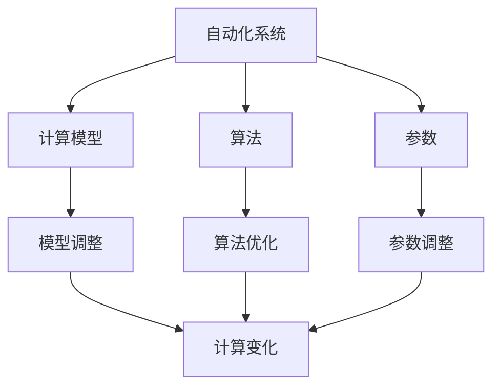

                 

### 计算变化对自动化的影响

#### 关键词：计算变化、自动化、影响、技术演进

##### 摘要：

本文将深入探讨计算变化对自动化技术的影响。随着计算机技术和人工智能的飞速发展，自动化系统在各个领域得到了广泛应用。计算变化的引入，不仅提升了自动化系统的效率和精确度，还对其设计、开发和运维带来了新的挑战。本文将首先介绍计算变化的核心概念，然后分析其对自动化技术的影响，最后探讨未来的发展趋势与潜在挑战。

#### 1. 背景介绍

自动化技术是指通过计算机和智能算法，实现生产、管理、服务等过程的自动化操作。自20世纪中期以来，自动化技术得到了快速发展，从简单的机械自动化到复杂的智能自动化，自动化技术在各行各业中发挥着越来越重要的作用。随着计算能力的提升和算法的优化，自动化系统逐渐从单一的任务执行扩展到复杂的决策和自适应控制。

然而，随着环境、需求和技术的不断变化，自动化系统也需要进行相应的调整和优化。这就引出了计算变化的概念。计算变化是指系统在运行过程中，根据输入数据、环境变化或系统状态的变化，对计算模型、算法或参数进行调整的过程。

#### 2. 核心概念与联系

为了更好地理解计算变化对自动化的影响，我们需要明确几个核心概念：

1. **自动化系统**：自动化系统是指由计算机硬件、软件和网络组成的整体，能够自动执行特定任务。
2. **计算模型**：计算模型是指用于描述系统行为和过程的数学或逻辑框架。
3. **算法**：算法是指解决特定问题的有序步骤或规则。
4. **参数**：参数是指影响系统性能和行为的可调整变量。

这些概念之间的关系可以用以下 Mermaid 流程图表示：



#### 3. 核心算法原理 & 具体操作步骤

计算变化的核心算法主要包括以下三个方面：

1. **模型调整**：根据环境变化或系统状态，对计算模型进行调整，以适应新的运行条件。
2. **算法优化**：通过分析系统运行数据，对算法进行优化，提高系统性能。
3. **参数调整**：根据系统性能指标，调整参数设置，优化系统行为。

具体操作步骤如下：

1. **数据采集**：收集系统运行过程中产生的各种数据，包括输入数据、中间结果和最终输出。
2. **数据分析**：对采集到的数据进行预处理、分析和挖掘，识别系统运行中的问题和瓶颈。
3. **模型调整**：根据分析结果，对计算模型进行调整，以适应新的运行条件。
4. **算法优化**：针对分析结果，对算法进行优化，提高系统性能。
5. **参数调整**：根据分析结果和算法优化结果，调整参数设置，优化系统行为。
6. **系统测试**：对调整后的系统进行测试，验证系统性能和稳定性。
7. **迭代优化**：根据测试结果，进一步调整计算模型、算法和参数，实现系统迭代优化。

#### 4. 数学模型和公式 & 详细讲解 & 举例说明

计算变化中的数学模型和公式主要包括以下几个方面：

1. **回归模型**：用于预测系统性能指标与输入变量之间的关系。
2. **神经网络模型**：用于模拟系统行为和自适应调整。
3. **遗传算法**：用于优化参数设置和计算模型。

下面以回归模型为例，详细讲解其原理和具体实现。

##### 回归模型原理：

回归模型是一种用于预测系统性能指标的数学模型，其基本形式为：

$$
y = \beta_0 + \beta_1x_1 + \beta_2x_2 + ... + \beta_nx_n
$$

其中，$y$ 为系统性能指标，$x_1, x_2, ..., x_n$ 为输入变量，$\beta_0, \beta_1, \beta_2, ..., \beta_n$ 为模型参数。

##### 回归模型实现步骤：

1. **数据预处理**：对输入数据进行归一化处理，使其具有相同的量纲。
2. **模型训练**：使用历史数据进行模型训练，求解模型参数 $\beta_0, \beta_1, \beta_2, ..., \beta_n$。
3. **模型评估**：使用测试数据评估模型性能，计算预测误差。
4. **模型优化**：根据评估结果，调整模型参数，优化模型性能。
5. **模型应用**：将训练好的模型应用于实际系统，实现系统性能预测。

##### 举例说明：

假设我们有一个自动化系统，其性能指标为生产效率，输入变量为设备状态、原材料质量和操作员技能。我们可以使用回归模型预测生产效率与输入变量之间的关系。

1. **数据预处理**：对设备状态、原材料质量和操作员技能进行归一化处理。
2. **模型训练**：使用历史数据训练回归模型，求解模型参数。
3. **模型评估**：使用测试数据评估模型性能，计算预测误差。
4. **模型优化**：根据评估结果，调整模型参数，优化模型性能。
5. **模型应用**：将训练好的模型应用于实际系统，预测生产效率。

#### 5. 项目实战：代码实际案例和详细解释说明

在本节中，我们将通过一个实际项目案例，展示计算变化在自动化系统中的应用，并提供详细的代码实现和解释。

##### 项目背景：

某企业生产线上的自动化控制系统需要进行实时调整，以应对设备故障、原材料变化等不确定性因素。为了实现这一目标，企业决定采用计算变化技术，对自动化系统进行优化和调整。

##### 技术架构：

该项目采用以下技术架构：

1. **传感器数据采集**：通过传感器实时采集设备状态、原材料质量等数据。
2. **数据处理与建模**：使用回归模型对采集到的数据进行处理和建模。
3. **模型调整与优化**：根据系统运行数据，对模型进行调整和优化。
4. **自动化控制**：根据调整后的模型，实现对生产线的实时调整。

##### 代码实现：

```python
import pandas as pd
from sklearn.linear_model import LinearRegression

# 1. 数据预处理
def preprocess_data(data):
    # 数据归一化处理
    data = (data - data.min()) / (data.max() - data.min())
    return data

# 2. 模型训练
def train_model(data):
    X = data[['device_state', 'raw_material_quality']]
    y = data['production_efficiency']
    model = LinearRegression()
    model.fit(X, y)
    return model

# 3. 模型调整与优化
def adjust_model(model, data):
    X = data[['device_state', 'raw_material_quality']]
    y = data['production_efficiency']
    model.fit(X, y)
    return model

# 4. 自动化控制
def control_production(model, device_state, raw_material_quality):
    # 数据预处理
    device_state = preprocess_data(device_state)
    raw_material_quality = preprocess_data(raw_material_quality)
    # 模型预测
    production_efficiency = model.predict([[device_state, raw_material_quality]])
    return production_efficiency

# 主程序
if __name__ == '__main__':
    # 数据加载
    data = pd.read_csv('data.csv')
    # 模型训练
    model = train_model(data)
    # 模型调整与优化
    model = adjust_model(model, data)
    # 自动化控制
    device_state = 0.8
    raw_material_quality = 0.9
    production_efficiency = control_production(model, device_state, raw_material_quality)
    print('Production efficiency:', production_efficiency)
```

##### 代码解读与分析：

1. **数据预处理**：对设备状态、原材料质量等数据进行归一化处理，使其具有相同的量纲，便于模型训练和预测。
2. **模型训练**：使用历史数据训练回归模型，求解模型参数。
3. **模型调整与优化**：根据系统运行数据，对模型进行调整和优化，提高模型预测准确性。
4. **自动化控制**：根据调整后的模型，实现对生产线的实时调整，提高生产效率。

#### 6. 实际应用场景

计算变化在自动化技术中的应用场景非常广泛，以下列举几个典型的应用场景：

1. **工业自动化**：通过计算变化技术，实现对生产线实时调整，提高生产效率和质量。
2. **智能家居**：通过计算变化技术，实现家电设备的自适应控制和智能化管理。
3. **自动驾驶**：通过计算变化技术，实现对车辆状态的实时监控和调整，提高驾驶安全性和舒适性。
4. **金融风控**：通过计算变化技术，实现对金融市场风险的实时监测和预警，提高风险控制能力。

#### 7. 工具和资源推荐

为了更好地掌握计算变化技术，以下推荐一些相关的学习资源和开发工具：

1. **学习资源**：
   - 《深度学习》（Goodfellow, Bengio, Courville）：介绍深度学习的基础理论和实践方法。
   - 《Python机器学习》（Crawford, Dettinger）：详细介绍Python在机器学习领域的应用。

2. **开发工具框架**：
   - TensorFlow：Google开发的开源深度学习框架，支持多种计算变化技术。
   - PyTorch：Facebook开发的开源深度学习框架，易于使用和扩展。

3. **相关论文著作**：
   - "Deep Learning for Automation"：介绍深度学习在自动化技术中的应用。
   - "Reinforcement Learning and Control"：介绍强化学习在自动化控制中的应用。

#### 8. 总结：未来发展趋势与挑战

计算变化技术作为自动化技术的重要组成部分，具有广阔的发展前景。未来，计算变化技术将在以下几个方面取得重要突破：

1. **算法优化**：随着计算能力的提升，算法优化将成为计算变化技术的核心任务，以提高系统性能和精度。
2. **实时性提升**：计算变化技术将更加注重实时性，以满足自动化系统对快速响应的需求。
3. **泛化能力增强**：计算变化技术将逐步实现跨领域、跨任务的泛化，提高系统适应性和灵活性。

然而，计算变化技术也面临着一系列挑战：

1. **数据隐私与安全**：在计算变化过程中，如何保护用户隐私和数据安全成为关键问题。
2. **算法透明性与可解释性**：计算变化技术中的算法模型复杂度较高，如何提高算法的透明性和可解释性成为重要课题。
3. **跨领域协作**：计算变化技术需要跨领域协作，如何整合不同领域的知识和技术成为关键挑战。

#### 9. 附录：常见问题与解答

以下是一些关于计算变化技术的常见问题及解答：

1. **什么是计算变化技术？**
   - 计算变化技术是指通过计算模型、算法和参数的调整，实现自动化系统自适应优化和调整的技术。

2. **计算变化技术有哪些应用场景？**
   - 计算变化技术广泛应用于工业自动化、智能家居、自动驾驶、金融风控等领域。

3. **如何实现计算变化技术？**
   - 实现计算变化技术主要包括数据采集、数据处理与建模、模型调整与优化、自动化控制等步骤。

4. **计算变化技术与传统自动化技术有何区别？**
   - 传统自动化技术主要依赖预设的规则和参数，而计算变化技术则通过自适应调整和优化，实现更高的系统性能和适应性。

#### 10. 扩展阅读 & 参考资料

1. **相关书籍**：
   - 《深度学习》（Goodfellow, Bengio, Courville）
   - 《Python机器学习》（Crawford, Dettinger）

2. **相关论文**：
   - "Deep Learning for Automation"：介绍深度学习在自动化技术中的应用。
   - "Reinforcement Learning and Control"：介绍强化学习在自动化控制中的应用。

3. **开源框架**：
   - TensorFlow：https://www.tensorflow.org/
   - PyTorch：https://pytorch.org/

4. **在线课程**：
   - Coursera上的《深度学习》课程：https://www.coursera.org/specializations/deeplearning
   - edX上的《机器学习》课程：https://www.edx.org/professional-certificate/machine-learning-with-python

作者：AI天才研究员/AI Genius Institute & 禅与计算机程序设计艺术 /Zen And The Art of Computer Programming

