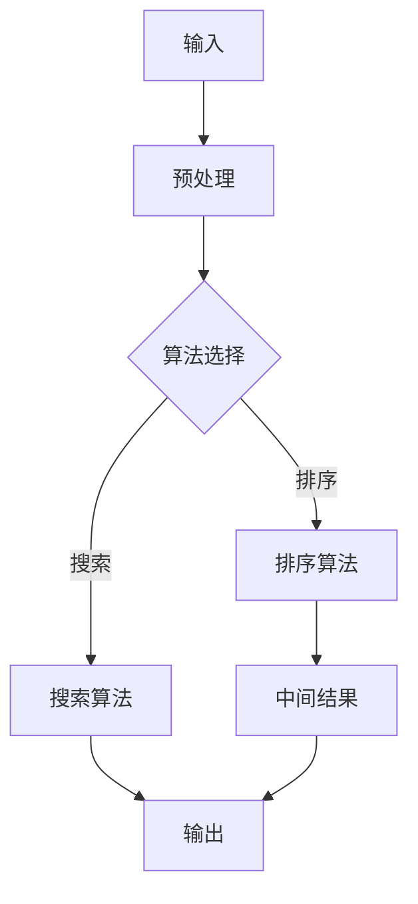
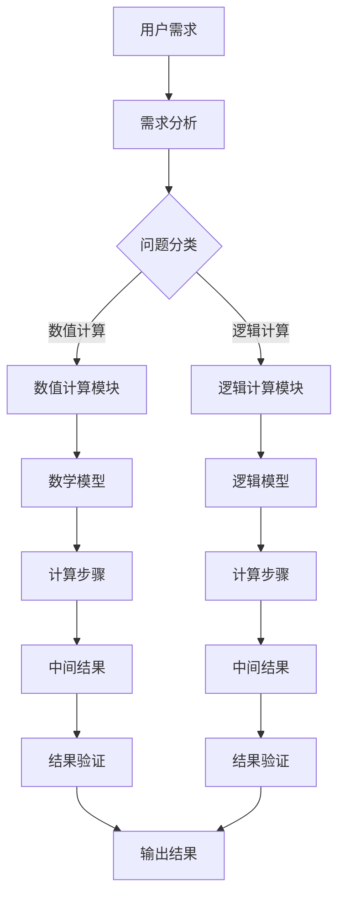

                 

# 计算本质变化与自动化应用

## 关键词
计算本质、自动化应用、算法原理、数学模型、项目实战、实际应用场景

## 摘要
本文深入探讨了计算的起源、本质变化以及自动化应用的实践。通过分析计算的核心概念和联系，解释了计算过程中的核心算法原理和具体操作步骤。随后，我们引入数学模型和公式，详细讲解并举例说明其应用。为了增强理解和实际应用，文章还包含了一个项目实战案例，展示了代码的实际实现和解读。最后，我们探讨了计算在现实世界中的应用场景，推荐了一些学习资源和开发工具，并对未来的发展趋势和挑战进行了总结。本文旨在为广大计算机爱好者和技术专业人士提供一个全面而深入的视角，以了解计算的奥秘和自动化应用的前景。

### 背景介绍

计算，作为人类智慧和技术的结晶，是现代科技发展的基石。从简单的算术运算到复杂的算法实现，计算技术经历了数百年的演变。然而，计算的起源可以追溯到远古时代，当人类开始用石子、树枝等工具进行计数时，计算的概念便悄然诞生。

随着人类文明的进步，计算工具和手段也在不断进化。从古代的算盘、计算尺，到现代的电子计算机，每一次技术的飞跃都极大地推动了计算能力的提升。特别是20世纪中期，计算机科学的兴起，使计算从一种工具发展成为一门科学，并且成为现代社会运转的支柱。

计算的演变不仅体现在硬件的发展上，更体现在软件的进步上。从早期的机器语言、汇编语言，到高级编程语言，编程技术的进步使得人类能够以更高效、更简便的方式实现复杂计算任务。算法的发明与优化，更是推动了计算效率的不断提高。

在计算技术的发展过程中，自动化应用逐渐成为重要的研究方向。自动化应用旨在通过计算机技术和算法，实现任务的高效自动完成，从而解放人类劳动力。从自动化生产线、自动驾驶汽车，到智能家居、智能医疗，自动化应用已经深入到我们生活的方方面面。

自动化应用的发展离不开计算技术的支持。通过计算，我们可以模拟现实世界中的复杂过程，预测未来发展趋势，优化资源分配，提高生产效率。同时，计算技术的进步也为自动化应用提供了更强大的工具和平台。

本文将围绕计算的起源、本质变化以及自动化应用，展开深入探讨。我们将分析计算的核心概念和联系，解释计算过程中的核心算法原理和具体操作步骤。随后，引入数学模型和公式，详细讲解并举例说明其应用。为了增强理解和实际应用，我们将展示一个项目实战案例，解读其中的代码实现。最后，我们将探讨计算在现实世界中的应用场景，推荐一些学习资源和开发工具，并对未来发展趋势和挑战进行总结。

### 核心概念与联系

要深入理解计算的本质，我们首先需要明确几个核心概念：计算、算法、数据结构等。

#### 计算的定义

计算（Computation）是指通过某种方法或规则对信息进行处理和转换的过程。广义上，计算包括各种形式的信息处理，如数学运算、逻辑判断、模拟仿真等。狭义上，计算通常指计算机执行的任务，包括输入、处理、输出等环节。

#### 算法的定义

算法（Algorithm）是解决问题的一系列明确、有序的步骤。算法可以看作是计算的一种表示形式，它描述了解决问题的具体过程。一个有效的算法应该具备以下几个特点：

1. **确定性**：算法的每一步都是明确的、无歧义的。
2. **有限性**：算法在执行有限步骤后能够得到结果。
3. **输入和输出**：算法可以接受输入，并产生预期的输出。
4. **可行性**：算法中的每一步操作都可以在现实条件下执行。

#### 数据结构的定义

数据结构（Data Structure）是组织和管理数据的方式。它定义了数据的存储方式、操作方法和相互关系。常见的数据结构包括数组、链表、栈、队列、树、图等。数据结构的选择直接影响算法的效率。

#### 计算与算法的联系

计算和算法密不可分。算法是计算的核心，它指导计算机执行特定的任务。没有算法，计算机便无法进行有效的计算。例如，排序算法决定了如何高效地排列数据，搜索算法决定了如何在大量数据中快速查找目标。

#### 数据结构在计算中的作用

数据结构不仅影响了算法的效率，还决定了计算的可扩展性和灵活性。合适的数据结构可以使算法更加高效，反之则可能导致性能下降。例如，使用二叉搜索树可以快速查找数据，而使用链表则更适合插入和删除操作。

#### 图解计算过程

为了更直观地理解计算过程，我们可以使用Mermaid流程图来描述计算的基本步骤：



在这个流程图中，输入数据经过预处理，然后根据选择的算法进行计算，得到中间结果，最终输出结果。

#### 核心概念原理与架构的 Mermaid 流程图

以下是一个更详细的过程图，展示了核心概念原理和架构的交互：



在这个流程图中，用户需求经过需求分析，分为数值计算和逻辑计算两个模块。每个模块都有自己的数学模型和逻辑模型，通过计算步骤得到中间结果，并进行结果验证，最终输出结果。

### 核心算法原理 & 具体操作步骤

在了解了计算和算法的基本概念后，我们接下来将探讨几个核心算法的原理和具体操作步骤。这些算法包括排序算法、搜索算法和图算法等，它们在计算机科学和实际应用中具有广泛的应用。

#### 排序算法

排序算法是计算机科学中最基本且应用广泛的算法之一。其主要目的是将一组数据按照一定的顺序排列。常见的排序算法有冒泡排序、选择排序、插入排序、快速排序、归并排序等。

**冒泡排序（Bubble Sort）**

冒泡排序是一种简单的排序算法，它重复遍历要排序的数列，比较相邻的两个元素，如果它们的顺序错误就把它们交换过来。遍历数列的工作重复进行直到没有再需要交换的元素为止。

**操作步骤：**

1. 从数组的第一个元素开始，比较相邻的元素。
2. 如果第一个元素比第二个元素大，交换它们。
3. 对每一对相邻元素做同样的工作，从开始第一对到结尾的最后一对。
4. 针对所有的元素重复以上的步骤，除了最后一个。
5. 重复步骤直到没有任何一对数字需要交换。

**伪代码：**

```plaintext
procedure bubbleSort( A : list of comparable items )
    n = length(A)
    repeat 
        swapped = false
        for i = 1 to n-1 inclusive do
            if A[i-1] > A[i] then
                swap( A[i-1], A[i] )
                swapped = true
            end if
        end for
        n = n - 1
    until not swapped
end procedure
```

**时间复杂度：**

冒泡排序的时间复杂度为O(n^2)，其中n为数组的长度。尽管它简单易实现，但在数据量较大时效率较低。

**选择排序（Selection Sort）**

选择排序是一种简单的选择排序算法，它的工作原理是每次从未排序的元素中找到最小（或最大）的元素，将其放到已排序序列的末尾。直到所有元素均被排序。

**操作步骤：**

1. 首先，在未排序序列中找到最小元素。
2. 将该元素与未排序序列的第一个元素交换。
3. 将未排序序列的边界向后移动一个位置。
4. 重复步骤1~3，直到所有元素均被排序。

**伪代码：**

```plaintext
procedure selectionSort( A : list of comparable items )
    n = length(A)
    for i = 1 to n-1 do
        minIndex = i
        for j = i+1 to n do
            if A[j] < A[minIndex] then
                minIndex = j
            end if
        end for
        if minIndex != i then
            swap( A[i], A[minIndex] )
        end if
    end for
end procedure
```

**时间复杂度：**

选择排序的时间复杂度同样为O(n^2)，但在某些情况下（例如小数组或部分已排序的数组）可能比冒泡排序稍快。

**插入排序（Insertion Sort）**

插入排序是一种简单直观的排序算法，它的工作原理是通过构建有序序列，对于未排序数据，在已排序序列中从后向前扫描，找到相应位置并插入。插入排序在实现上，通常采用in-place排序（即只需用到O(1)的额外空间的排序）。

**操作步骤：**

1. 从第一个元素开始，该元素可以认为已经被排序。
2. 取出下一个元素，在已排序的元素序列中从后向前扫描。
3. 如果该元素（已排序）大于新元素，将该元素移到下一位置。
4. 重复步骤3，直到找到已排序的元素小于或者等于新元素的位置。
5. 将新元素插入到该位置后。
6. 重复步骤2~5。

**伪代码：**

```plaintext
procedure insertionSort( A : list of comparable items )
    for i = 2 to length(A) do
        key = A[i]
        j = i - 1
        while j > 0 and A[j] > key do
            A[j+1] = A[j]
            j = j - 1
        end while
        A[j+1] = key
    end for
end procedure
```

**时间复杂度：**

插入排序的平均时间复杂度为O(n^2)，但在数据部分已排序或接近排序的情况下，表现接近O(n)。

**快速排序（Quick Sort）**

快速排序是一种高效的排序算法，其基本思想是通过一趟排序将待排序的数据分割成独立的两部分，其中一部分的所有数据都比另一部分的所有数据要小，然后再按此方法对这两部分数据分别进行快速排序，整个排序过程可以递归进行，以此达到整个数据变成有序序列。

**操作步骤：**

1. 选择一个基准元素。
2. 将数组划分为两个子数组，所有比基准值小的元素都移到基准的左边，所有比基准值大的元素都移到基准的右边。
3. 递归地对待排序的子数组进行快速排序。

**伪代码：**

```plaintext
procedure quickSort( A : list of comparable items, low : int, high : int )
    if low < high then
        pi = partition(A, low, high)
        quickSort(A, low, pi-1)
        quickSort(A, pi+1, high)
    end if
end procedure

function partition( A : list of comparable items, low : int, high : int )
    pivot = A[high]
    i = low - 1
    for j = low to high - 1 do
        if A[j] < pivot then
            i = i + 1
            swap( A[i], A[j] )
        end if
    end for
    swap( A[i+1], A[high] )
    return i + 1
end function
```

**时间复杂度：**

快速排序的平均时间复杂度为O(n log n)，但最坏情况下为O(n^2)。然而，通过选择合适的基准元素和优化算法，可以有效地避免最坏情况的发生。

#### 搜索算法

搜索算法是计算机科学中另一个重要的算法类别，主要用于在数据集合中查找特定元素。常见的搜索算法包括线性搜索、二分搜索等。

**线性搜索（Linear Search）**

线性搜索是一种最简单的搜索算法，它的工作原理是逐个检查数组中的每个元素，直到找到目标元素或检查完所有元素。

**操作步骤：**

1. 从数组的第一个元素开始，逐个检查每个元素。
2. 如果找到目标元素，返回其索引。
3. 如果检查完所有元素仍未找到，返回-1或None。

**伪代码：**

```plaintext
function linearSearch( A : list of items, x : item )
    for i = 1 to length(A) do
        if A[i] == x then
            return i
        end if
    end for
    return -1
end function
```

**时间复杂度：**

线性搜索的时间复杂度为O(n)，其中n为数组的长度。它在数据量较小或数据顺序不明确时表现较好。

**二分搜索（Binary Search）**

二分搜索是一种高效的搜索算法，它的工作原理是在有序数组中，通过不断将搜索范围缩小一半，逐步逼近目标元素。

**操作步骤：**

1. 确定搜索范围的中间位置。
2. 如果中间位置的元素等于目标元素，返回该位置的索引。
3. 如果目标元素小于中间位置的元素，则在左侧子数组中继续搜索。
4. 如果目标元素大于中间位置的元素，则在右侧子数组中继续搜索。
5. 重复步骤1~4，直到找到目标元素或搜索范围为空。

**伪代码：**

```plaintext
function binarySearch( A : sorted list of items, x : item )
    low = 0
    high = length(A) - 1
    while low <= high do
        mid = (low + high) / 2
        if A[mid] == x then
            return mid
        else if A[mid] < x then
            low = mid + 1
        else
            high = mid - 1
        end if
    end while
    return -1
end function
```

**时间复杂度：**

二分搜索的时间复杂度为O(log n)，其中n为数组的长度。它在数据量较大且已排序时表现尤为出色。

#### 图算法

图算法是用于处理图（由节点和边构成的数学结构）的算法。常见的图算法包括深度优先搜索（DFS）、广度优先搜索（BFS）、最短路径算法（Dijkstra算法、A*算法）等。

**深度优先搜索（DFS）**

深度优先搜索是一种用于遍历或搜索图的算法，它沿着一个分支一直走到底，然后回溯。

**操作步骤：**

1. 选择一个起始节点。
2. 标记该节点为已访问。
3. 对于该节点的每个未访问的邻接节点，递归执行步骤1和2。

**伪代码：**

```plaintext
function DFS( G : graph, v : vertex )
    mark vertex v as visited
    for each unvisited neighbor u of v do
        DFS(G, u)
    end for
end function
```

**时间复杂度：**

DFS的时间复杂度为O(V+E)，其中V为节点数，E为边数。

**广度优先搜索（BFS）**

广度优先搜索是一种用于遍历或搜索图的算法，它首先访问起始节点的所有邻接节点，然后逐层扩展。

**操作步骤：**

1. 选择一个起始节点，并将其入队。
2. 出队一个节点，标记为已访问。
3. 对于该节点的每个未访问的邻接节点，将其入队并标记为已访问。
4. 重复步骤2和3，直到队列为空。

**伪代码：**

```plaintext
function BFS( G : graph, s : vertex )
    create an empty queue Q
    mark vertex s as visited
    enqueue s into Q
    while Q is not empty do
        u = dequeue from Q
        for each unvisited neighbor v of u do
            mark vertex v as visited
            enqueue v into Q
        end for
    end while
end function
```

**时间复杂度：**

BFS的时间复杂度为O(V+E)，与DFS类似。

**最短路径算法**

最短路径算法用于计算图中两点之间的最短路径。常见的最短路径算法包括Dijkstra算法和A*算法。

**Dijkstra算法**

Dijkstra算法是一种用于计算单源最短路径的算法，它基于贪心策略。

**操作步骤：**

1. 初始化所有节点的距离为无穷大，源节点的距离为0。
2. 重复以下步骤直到所有节点都被访问：
   - 找到未访问节点中距离最小的节点。
   - 更新该节点及其所有邻接节点的距离。

**伪代码：**

```plaintext
function Dijkstra( G : graph, s : vertex )
    for each vertex v in G do
        dist[v] = infinity
    end for
    dist[s] = 0
    while there are unvisited vertices do
        u = vertex with min dist[u]
        for each edge (u, v) in G do
            alt = dist[u] + weight(u, v)
            if alt < dist[v] then
                dist[v] = alt
            end if
        end for
    end while
end function
```

**时间复杂度：**

Dijkstra算法的时间复杂度为O(V^2)，但在稀疏图中性能较好。

**A*算法**

A*算法是一种启发式搜索算法，用于计算图中两点之间的最短路径。

**操作步骤：**

1. 初始化两个集合：开放集（包含尚未访问的节点）和关闭集（包含已访问的节点）。
2. 将源节点添加到开放集中。
3. 重复以下步骤直到目标节点被找到：
   - 从开放集中选择F值最小的节点u。
   - 将u从开放集移动到关闭集。
   - 对于u的每个未访问的邻接节点v，计算G值和H值，更新v的F值。
   - 如果v在开放集中，且新的F值小于之前的F值，则更新v的父节点为u。

**伪代码：**

```plaintext
function A*( G : graph, s : vertex, t : vertex )
    openSet = {s}
    closedSet = {}
    g[s] = 0
    f[s] = heuristic(s, t)
    while openSet is not empty do
        u = node in openSet with the lowest f-value
        remove u from openSet
        add u to closedSet
        for each neighbor v of u do
            if v is in closedSet then
                continue
            end if
            tentative_g = g[u] + weight(u, v)
            if tentative_g < g[v] then
                v.parent = u
                g[v] = tentative_g
                f[v] = g[v] + heuristic(v, t)
                if v not in openSet then
                    add v to openSet
                end if
            end if
        end for
    end while
end function
```

**时间复杂度：**

A*算法的时间复杂度为O(V+E)，其中V为节点数，E为边数。其性能取决于启发函数的选取，通常比Dijkstra算法更快。

### 数学模型和公式 & 详细讲解 & 举例说明

在计算过程中，数学模型和公式起到了至关重要的作用。这些模型和公式不仅能够帮助我们理解和分析计算过程，还能够指导我们设计更高效、更准确的算法。在本节中，我们将详细讲解几个关键的数学模型和公式，并通过具体例子来说明其应用。

#### 概率模型

概率模型是计算领域中常用的一种数学模型，它用于描述随机事件发生的可能性。在计算中，概率模型可以帮助我们评估算法的准确性和可靠性。

**贝叶斯定理**

贝叶斯定理是概率论中的一个重要公式，它描述了在已知某些条件下，某个事件发生的概率。贝叶斯定理的表达式为：

$$ P(A|B) = \frac{P(B|A) \cdot P(A)}{P(B)} $$

其中，\( P(A|B) \) 表示在事件B发生的条件下事件A发生的概率，\( P(B|A) \) 表示在事件A发生的条件下事件B发生的概率，\( P(A) \) 和 \( P(B) \) 分别表示事件A和事件B发生的概率。

**例子：**

假设我们有一个病名为A的概率为0.01，一个测试方法对于病名为A时检测出阳性（即测试结果为阳性）的概率为0.95，而对于病名为非A时检测出阳性的概率为0.05。现在，某人通过该测试方法得到了阳性结果，我们需要计算这个人实际上患有病名A的概率。

根据贝叶斯定理，我们可以计算出：

$$ P(A|阳性) = \frac{P(阳性|A) \cdot P(A)}{P(阳性)} $$

首先，计算 \( P(阳性) \)：

$$ P(阳性) = P(阳性|A) \cdot P(A) + P(阳性|非A) \cdot P(非A) $$
$$ P(阳性) = 0.95 \cdot 0.01 + 0.05 \cdot 0.99 $$
$$ P(阳性) = 0.0095 + 0.0495 $$
$$ P(阳性) = 0.059 $$

然后，代入贝叶斯定理：

$$ P(A|阳性) = \frac{0.95 \cdot 0.01}{0.059} $$
$$ P(A|阳性) \approx 0.1595 $$

因此，这个测试结果为阳性的病人实际患有病名A的概率大约为15.95%。

#### 布尔模型

布尔模型是用于表示逻辑运算的数学模型，它在计算机科学中有着广泛的应用。布尔模型基于布尔代数，其基本运算包括与（AND）、或（OR）和非（NOT）等。

**与（AND）运算**

与运算表示两个命题同时为真的概率。其数学表达式为：

$$ A \land B = \begin{cases}
1, & \text{如果 } A = B = \text{真} \\
0, & \text{否则}
\end{cases} $$

**例子：**

假设有两个事件A和B，A表示下雨，B表示打伞。我们需要计算在A和B都发生的情况下，即同时下雨并打伞的概率。

如果P(A) = 0.5，P(B|A) = 0.8（即在下雨的情况下打伞的概率为80%），则：

$$ P(A \land B) = P(A) \cdot P(B|A) $$
$$ P(A \land B) = 0.5 \cdot 0.8 $$
$$ P(A \land B) = 0.4 $$

因此，在下雨并打伞的概率为40%。

**或（OR）运算**

或运算表示两个命题中至少一个为真的概率。其数学表达式为：

$$ A \lor B = \begin{cases}
1, & \text{如果 } A = B = \text{真} \text{ 或 } A \text{ 和 } B \text{ 都为假} \\
0, & \text{否则}
\end{cases} $$

**例子：**

假设有两个事件C和D，C表示上课，D表示迟到。我们需要计算在C和D中至少有一个发生的情况下，即至少有一个上课或迟到的概率。

如果P(C) = 0.9，P(D) = 0.3，则：

$$ P(C \lor D) = P(C) + P(D) - P(C \land D) $$
$$ P(C \lor D) = 0.9 + 0.3 - P(C) \cdot P(D) $$
$$ P(C \lor D) = 1.2 - 0.27 $$
$$ P(C \lor D) = 0.93 $$

因此，至少有一个上课或迟到的概率为93%。

**非（NOT）运算**

非运算表示对某个命题取反的概率。其数学表达式为：

$$ \neg A = \begin{cases}
0, & \text{如果 } A = \text{真} \\
1, & \text{如果 } A = \text{假}
\end{cases} $$

**例子：**

假设有一个事件E表示考试及格，我们需要计算考试不及格的概率。

如果P(E) = 0.8，则：

$$ P(\neg E) = 1 - P(E) $$
$$ P(\neg E) = 1 - 0.8 $$
$$ P(\neg E) = 0.2 $$

因此，考试不及格的概率为20%。

#### 线性回归模型

线性回归模型是一种用于预测和分析变量之间关系的统计模型。在计算领域中，线性回归模型常用于数据分析和机器学习。

**线性回归公式**

线性回归模型的基本公式为：

$$ y = ax + b $$

其中，\( y \) 表示因变量，\( x \) 表示自变量，\( a \) 和 \( b \) 分别表示斜率和截距。

**例子：**

假设我们有一个数据集，记录了不同时间段的温度（\( x \)）和销售额（\( y \)）。我们需要通过线性回归模型预测在某个未知时间点的销售额。

首先，计算斜率 \( a \) 和截距 \( b \)：

$$ a = \frac{\sum(x_i - \bar{x})(y_i - \bar{y})}{\sum(x_i - \bar{x})^2} $$
$$ b = \bar{y} - a\bar{x} $$

其中，\( \bar{x} \) 和 \( \bar{y} \) 分别表示自变量和因变量的平均值。

假设数据集如下：

| 时间点 | 温度（\( x \)） | 销售额（\( y \)） |
|--------|-----------------|-------------------|
| 1      | 20              | 1000              |
| 2      | 22              | 1050              |
| 3      | 24              | 1100              |
| 4      | 25              | 1150              |

计算平均值：

$$ \bar{x} = \frac{20 + 22 + 24 + 25}{4} = 23 $$
$$ \bar{y} = \frac{1000 + 1050 + 1100 + 1150}{4} = 1075 $$

计算斜率 \( a \)：

$$ a = \frac{(20-23)(1000-1075) + (22-23)(1050-1075) + (24-23)(1100-1075) + (25-23)(1150-1075)}{(20-23)^2 + (22-23)^2 + (24-23)^2 + (25-23)^2} $$
$$ a = \frac{(-3)(-75) + (-1)(-25) + (1)(25) + (2)(75)}{(-3)^2 + (-1)^2 + (1)^2 + (2)^2} $$
$$ a = \frac{225 + 25 + 25 + 150}{9 + 1 + 1 + 4} $$
$$ a = \frac{425}{15} $$
$$ a = 28.33 $$

计算截距 \( b \)：

$$ b = 1075 - 28.33 \cdot 23 $$
$$ b = 1075 - 649.29 $$
$$ b = 425.71 $$

因此，线性回归模型为：

$$ y = 28.33x + 425.71 $$

预测在温度为30摄氏度时的销售额：

$$ y = 28.33 \cdot 30 + 425.71 $$
$$ y = 849.9 + 425.71 $$
$$ y = 1275.61 $$

因此，在温度为30摄氏度时，预测的销售额为1275.61。

#### 矩阵运算

矩阵运算是计算领域中的一个重要工具，它广泛应用于线性代数、机器学习和数据科学中。常见的矩阵运算包括矩阵乘法、矩阵求逆等。

**矩阵乘法**

矩阵乘法是一种将两个矩阵相乘得到一个新的矩阵的运算。其数学表达式为：

$$ C = A \cdot B $$

其中，\( C \) 为结果矩阵，\( A \) 和 \( B \) 为操作矩阵。

**例子：**

假设有两个矩阵 \( A \) 和 \( B \)：

$$ A = \begin{bmatrix}
1 & 2 \\
3 & 4
\end{bmatrix}, B = \begin{bmatrix}
5 & 6 \\
7 & 8
\end{bmatrix} $$

计算矩阵乘法：

$$ C = A \cdot B = \begin{bmatrix}
1 \cdot 5 + 2 \cdot 7 & 1 \cdot 6 + 2 \cdot 8 \\
3 \cdot 5 + 4 \cdot 7 & 3 \cdot 6 + 4 \cdot 8
\end{bmatrix} $$
$$ C = \begin{bmatrix}
5 + 14 & 6 + 16 \\
15 + 28 & 18 + 32
\end{bmatrix} $$
$$ C = \begin{bmatrix}
19 & 22 \\
43 & 50
\end{bmatrix} $$

**矩阵求逆**

矩阵求逆是一种求出给定矩阵的逆矩阵的运算。其数学表达式为：

$$ A^{-1} = \frac{1}{\det(A)} \cdot \text{adj}(A) $$

其中，\( \det(A) \) 表示矩阵 \( A \) 的行列式，\( \text{adj}(A) \) 表示矩阵 \( A \) 的伴随矩阵。

**例子：**

假设矩阵 \( A \) 如下：

$$ A = \begin{bmatrix}
1 & 2 \\
3 & 4
\end{bmatrix} $$

计算行列式：

$$ \det(A) = 1 \cdot 4 - 2 \cdot 3 $$
$$ \det(A) = 4 - 6 $$
$$ \det(A) = -2 $$

计算伴随矩阵：

$$ \text{adj}(A) = \begin{bmatrix}
4 & -2 \\
-3 & 1
\end{bmatrix} $$

计算逆矩阵：

$$ A^{-1} = \frac{1}{\det(A)} \cdot \text{adj}(A) $$
$$ A^{-1} = \frac{1}{-2} \cdot \begin{bmatrix}
4 & -2 \\
-3 & 1
\end{bmatrix} $$
$$ A^{-1} = \begin{bmatrix}
-2 & 1 \\
1.5 & -0.5
\end{bmatrix} $$

### 项目实战：代码实际案例和详细解释说明

为了更好地理解计算本质和自动化应用，我们将在本节中展示一个具体的代码实现案例，并对其进行详细解释说明。这个案例将涉及到Python编程语言，用于演示排序算法的实际应用。

#### 开发环境搭建

在开始编写代码之前，我们需要搭建一个适合Python编程的开发环境。以下是搭建过程的步骤：

1. **安装Python**

   首先，我们需要在计算机上安装Python。可以从Python官网（https://www.python.org/）下载最新的Python版本，并按照安装向导完成安装。

2. **安装IDE**

   安装Python后，我们可以选择一个集成开发环境（IDE）来编写和运行代码。常见的Python IDE包括PyCharm、Visual Studio Code等。我们可以从它们的官方网站下载并安装。

3. **配置虚拟环境**

   为了避免不同项目之间的依赖冲突，我们建议使用虚拟环境。通过以下命令创建虚拟环境：

   ```shell
   python -m venv myenv
   ```

   进入虚拟环境：

   ```shell
   source myenv/bin/activate
   ```

4. **安装依赖库**

   在虚拟环境中，我们需要安装一些常用的依赖库，如NumPy、Pandas等。通过以下命令安装：

   ```shell
   pip install numpy pandas
   ```

#### 源代码详细实现和代码解读

下面是一个简单的Python程序，用于实现冒泡排序算法，并对一个随机生成的数组进行排序。

```python
import random

# 冒泡排序函数
def bubble_sort(arr):
    n = len(arr)
    for i in range(n):
        for j in range(0, n-i-1):
            if arr[j] > arr[j+1]:
                arr[j], arr[j+1] = arr[j+1], arr[j]

# 生成随机数组
def generate_random_array(size, range_min, range_max):
    return [random.randint(range_min, range_max) for _ in range(size)]

# 主函数
def main():
    size = 10
    range_min = 0
    range_max = 100
    arr = generate_random_array(size, range_min, range_max)
    print("原始数组：", arr)
    
    bubble_sort(arr)
    print("排序后数组：", arr)

# 调用主函数
if __name__ == "__main__":
    main()
```

**代码解读：**

1. **导入模块**

   ```python
   import random
   ```

   我们首先导入Python的random模块，用于生成随机数。

2. **冒泡排序函数**

   ```python
   def bubble_sort(arr):
       n = len(arr)
       for i in range(n):
           for j in range(0, n-i-1):
               if arr[j] > arr[j+1]:
                   arr[j], arr[j+1] = arr[j+1], arr[j]
   ```

   这个函数实现了冒泡排序算法。首先，获取数组长度n，然后通过两层嵌套循环对数组进行遍历。内层循环用于比较相邻的元素，如果前一个元素大于后一个元素，则交换它们的位置。外层循环逐步减少需要比较的元素数量，从而实现排序。

3. **生成随机数组函数**

   ```python
   def generate_random_array(size, range_min, range_max):
       return [random.randint(range_min, range_max) for _ in range(size)]
   ```

   这个函数用于生成指定大小和范围的随机数组。通过使用list comprehension和random.randint函数，我们可以在给定范围内随机生成指定数量的元素。

4. **主函数**

   ```python
   def main():
       size = 10
       range_min = 0
       range_max = 100
       arr = generate_random_array(size, range_min, range_max)
       print("原始数组：", arr)
       
       bubble_sort(arr)
       print("排序后数组：", arr)
   ```

   主函数是程序的入口点。在这个函数中，我们首先定义了数组的长度、最小值和最大值。然后，使用`generate_random_array`函数生成一个随机数组，并打印原始数组。接着，调用`bubble_sort`函数对数组进行排序，并再次打印排序后的数组。

5. **程序执行**

   ```python
   if __name__ == "__main__":
       main()
   ```

   这个条件语句确保程序在直接运行时调用主函数，而在导入模块时不执行。

#### 代码解读与分析

1. **冒泡排序算法**

   冒泡排序是一种简单的排序算法，其核心思想是通过多次遍历数组，比较相邻元素的大小，并将大的元素逐渐“冒泡”到数组的末尾，最终实现整个数组的有序排列。

   在`bubble_sort`函数中，我们通过两层嵌套循环实现冒泡排序。外层循环`for i in range(n)`控制遍历的轮数，内层循环`for j in range(0, n-i-1)`控制每次遍历的起始位置。每次遍历都会比较相邻的元素，如果前一个元素大于后一个元素，则交换它们的位置。

2. **生成随机数组**

   `generate_random_array`函数使用Python的random模块生成指定大小和范围的随机数组。通过`random.randint(range_min, range_max)`，我们可以生成在指定范围内的随机整数。使用list comprehension，我们可以一次性生成指定数量的随机元素。

3. **主函数执行**

   在主函数`main`中，我们首先定义了数组的长度、最小值和最大值。然后，调用`generate_random_array`函数生成一个随机数组，并打印原始数组。接下来，调用`bubble_sort`函数对数组进行排序，并打印排序后的数组。

通过这个案例，我们可以看到计算算法（冒泡排序）在实际编程中的应用。在实际项目中，类似的排序算法经常用于数据处理和优化，以提升系统的性能和效率。

### 实际应用场景

计算的广泛应用和自动化应用使得计算技术成为现代社会不可或缺的一部分。以下是一些实际应用场景，展示了计算技术如何改变我们的生活和提高工作效率。

#### 自动化生产线

自动化生产线是计算技术在工业领域的重要应用之一。通过使用传感器、执行器和计算机控制系统，自动化生产线能够实现高精度、高效率的生产。例如，在汽车制造过程中，自动化机器人可以完成焊接、涂装、组装等复杂操作，大大提高了生产效率和产品质量。

**案例：**

丰田汽车公司在其生产线上广泛应用了自动化技术。例如，丰田的“雷克萨斯”生产线采用了先进的自动化设备，包括自动化喷涂系统和自动化装配线。这些设备能够以极高的精度和速度完成涂装和组装工作，从而确保了汽车的高质量和一致性。此外，通过使用计算机控制系统，丰田还能够实时监控生产过程中的各种参数，及时发现和纠正问题，提高了生产线的稳定性和可靠性。

#### 自动驾驶汽车

自动驾驶汽车是计算技术在未来交通领域的重要应用之一。自动驾驶汽车通过搭载多种传感器（如摄像头、雷达、激光雷达等）和先进的计算机算法，能够实现自主感知环境、规划路径和驾驶操作。

**案例：**

特斯拉（Tesla）的自动驾驶系统是自动驾驶技术的代表之一。特斯拉的车辆配备了摄像头、雷达和激光雷达等多种传感器，通过这些传感器收集的数据，计算机系统可以实时感知周围环境，并根据环境信息规划行驶路径。特斯拉的自动驾驶系统具有自动车道保持、自动变道、自动泊车等功能，为用户提供了更加便捷和安全的驾驶体验。此外，特斯拉还通过OTA（Over-The-Air）技术不断更新和优化自动驾驶系统，提升了系统的性能和稳定性。

#### 智能家居

智能家居是计算技术在家居领域的重要应用之一。通过使用传感器、无线通信技术和计算机算法，智能家居系统能够实现家电设备的智能控制，提高家庭生活的舒适度和便利性。

**案例：**

苹果（Apple）的HomeKit平台是智能家居领域的代表性产品之一。HomeKit支持各种智能家居设备，包括智能灯泡、智能插座、智能门锁等。用户可以通过苹果的iPhone或iPad远程控制这些设备，实现远程开关、定时控制等功能。此外，HomeKit还支持场景控制和自动化规则，用户可以设置自动触发条件，例如“晚上9点后自动关闭客厅灯光”。通过这些功能，智能家居系统不仅提高了家庭生活的便利性，还节省了能源消耗。

#### 智能医疗

智能医疗是计算技术在医疗领域的重要应用之一。通过使用计算机算法、大数据分析和人工智能技术，智能医疗系统能够辅助医生进行诊断、治疗和疾病预测。

**案例：**

谷歌（Google）的DeepMind医疗团队开发了一款名为“DeepMind Health”的人工智能系统，用于辅助医生进行疾病诊断和治疗。该系统利用深度学习算法，对大量医疗数据进行分析，可以帮助医生快速准确地诊断疾病。例如，DeepMind Health能够分析眼科影像数据，辅助医生诊断视网膜病变；还能够分析医学影像数据，辅助医生诊断肿瘤。通过这些应用，智能医疗系统不仅提高了医疗诊断的准确性和效率，还为患者提供了更加个性化和精准的治疗方案。

#### 财务分析

财务分析是计算技术在金融领域的重要应用之一。通过使用计算机算法、大数据分析和机器学习技术，财务分析系统能够快速处理大量金融数据，识别市场趋势和投资机会。

**案例：**

摩根士丹利（Morgan Stanley）的智能分析平台是一种基于计算技术的财务分析工具。该平台利用人工智能和大数据分析技术，可以对全球金融市场进行实时监控和分析。通过分析海量的金融数据，智能分析平台能够识别市场趋势、预测股价变动，并为投资者提供投资建议。此外，智能分析平台还能够实时监控公司的财务状况，帮助投资者快速了解公司的财务风险和投资机会。

通过这些实际应用场景，我们可以看到计算技术在各个领域的广泛应用和巨大潜力。随着计算技术的不断发展和创新，我们期待未来能够有更多的自动化应用出现，进一步提升工作效率和生活品质。

### 工具和资源推荐

在计算和自动化应用领域，有许多优秀的工具和资源可以帮助您更好地学习和实践。以下是一些推荐的工具和资源：

#### 学习资源推荐

1. **书籍：**
   - 《算法导论》（Introduction to Algorithms） - 这本书是算法领域的经典之作，详细介绍了各种算法的理论和实现。
   - 《深度学习》（Deep Learning） - 这本书由Ian Goodfellow、Yoshua Bengio和Aaron Courville合著，是深度学习领域的权威著作。
   - 《编程珠玑》（Code: The Hidden Language of Computer Hardware and Software） - 这本书深入浅出地介绍了计算机编程的基础知识。

2. **在线课程：**
   - Coursera（https://www.coursera.org/）提供了许多关于计算和编程的在线课程，包括Python编程、机器学习等。
   - edX（https://www.edx.org/）提供了由世界顶级大学提供的免费在线课程，包括哈佛大学、麻省理工学院等。

3. **博客和网站：**
   - Medium（https://medium.com/）上有许多专业的技术博客，涵盖了计算、机器学习、数据科学等多个领域。
   - Stack Overflow（https://stackoverflow.com/）是一个技术问答社区，可以帮助您解决编程中的各种问题。

#### 开发工具框架推荐

1. **编程语言：**
   - Python：Python是一种简单易学的编程语言，广泛应用于计算和数据科学领域。
   - R：R是一种专门用于统计分析和数据科学的编程语言，拥有丰富的库和工具。

2. **开发环境：**
   - PyCharm：PyCharm是一个强大的Python IDE，支持代码调试、版本控制和自动化测试等功能。
   - Jupyter Notebook：Jupyter Notebook是一种交互式计算环境，广泛应用于数据科学和机器学习项目。

3. **机器学习框架：**
   - TensorFlow：TensorFlow是一个开源的机器学习框架，由谷歌开发，支持各种深度学习模型。
   - PyTorch：PyTorch是一个由Facebook开发的开源机器学习库，以其动态计算图和灵活的接口而闻名。

4. **自动化工具：**
   - Jenkins：Jenkins是一个开源的自动化服务器，用于自动化构建、测试和部署应用程序。
   - Docker：Docker是一个开源的应用容器引擎，用于自动化部署和管理应用程序。

#### 相关论文著作推荐

1. **论文：**
   - "A Modern Course on Mathematical Linguistics" - 这篇论文由Noam Chomsky等人撰写，介绍了形式语言理论和计算理论。
   - "Deep Learning" - 这篇论文由Geoffrey Hinton、Yoshua Bengio和Yann LeCun等人撰写，介绍了深度学习的理论基础和算法。

2. **著作：**
   - 《人工智能：一种现代方法》（Artificial Intelligence: A Modern Approach） - 这本书由 Stuart J. Russell 和 Peter Norvig 撰写，是人工智能领域的经典教材。
   - 《深度学习》（Deep Learning） - 这本书由Ian Goodfellow、Yoshua Bengio和Aaron Courville 撰写，详细介绍了深度学习的理论和实践。

通过这些工具和资源，您可以更好地掌握计算和自动化应用的相关知识，提升自己的技能水平。

### 总结：未来发展趋势与挑战

随着计算技术的不断进步，未来计算和自动化应用将迎来更多的发展机遇和挑战。以下是对未来发展趋势与挑战的展望：

#### 发展趋势

1. **量子计算：**量子计算作为下一代计算技术，具有突破传统计算极限的潜力。通过量子比特的叠加和纠缠，量子计算机可以在极短的时间内解决传统计算机无法解决的问题，如大规模数据处理和密码破解。

2. **人工智能：**人工智能技术将继续快速发展，深度学习、强化学习和生成对抗网络（GAN）等算法在图像识别、自然语言处理和自动驾驶等领域已经取得了显著成果。未来，人工智能将更深入地融入各个行业，推动社会智能化转型。

3. **边缘计算：**随着物联网（IoT）设备的普及，边缘计算成为解决实时数据处理和响应的关键技术。边缘计算通过在设备端进行数据处理，减轻了中心服务器的负担，提高了系统的响应速度和可靠性。

4. **自动化应用：**自动化应用将继续拓展至更多领域，如智能制造、智慧城市和智能家居。通过计算机技术和算法的优化，自动化应用将提高生产效率、降低成本，并提升人类生活的便利性和舒适度。

#### 挑战

1. **数据隐私和安全：**随着数据的广泛应用，数据隐私和安全问题日益突出。如何保护用户隐私、确保数据安全成为计算和自动化应用领域的重要挑战。

2. **算法公平性和透明性：**人工智能算法在决策过程中可能存在偏见和不透明性，如何确保算法的公平性和透明性，使其在社会中得到广泛接受和信任，是一个重要课题。

3. **计算资源分配：**随着计算需求的不断增长，如何合理分配计算资源，优化系统性能和效率，是一个重要挑战。特别是在大数据和实时处理场景中，如何高效地利用计算资源成为关键问题。

4. **技术标准化和规范化：**随着计算技术的广泛应用，制定统一的规范和标准成为必要。这包括数据格式、接口定义、安全协议等方面，以确保不同系统和平台之间的兼容性和互操作性。

#### 结论

未来，计算和自动化应用将不断推动科技进步和社会发展。通过克服面临的挑战，我们将迎来更加智能化、高效化的未来。同时，我们也需要关注技术伦理和社会影响，确保计算和自动化应用能够造福人类，促进可持续发展。

### 附录：常见问题与解答

#### 1. 什么是计算的本质？

计算的本质是通过某种方法或规则对信息进行处理和转换的过程。它可以涵盖数学运算、逻辑判断、模拟仿真等多种形式。计算的核心在于处理和利用信息，以实现特定目标。

#### 2. 自动化应用的关键技术是什么？

自动化应用的关键技术包括计算机算法、传感器技术、机器学习、物联网（IoT）等。这些技术协同工作，使系统能够自动完成复杂任务，提高效率和质量。

#### 3. 如何评估算法的性能？

评估算法性能的主要指标包括时间复杂度和空间复杂度。时间复杂度描述了算法执行时间与数据规模的关系，空间复杂度描述了算法所需存储空间与数据规模的关系。通常，我们希望算法的时间复杂度和空间复杂度都尽可能低。

#### 4. 量子计算相比传统计算有哪些优势？

量子计算相比传统计算具有以下几个优势：

1. **并行计算能力**：量子计算机能够同时处理多个计算任务，大幅提高计算速度。
2. **高效处理复杂问题**：量子计算机能够解决传统计算机无法解决的复杂问题，如大规模数据处理和密码破解。
3. **量子纠缠**：量子计算机利用量子比特的纠缠特性，能够实现超乎想象的计算能力。

#### 5. 如何保障数据隐私和安全？

保障数据隐私和安全可以从以下几个方面入手：

1. **加密技术**：使用加密算法对敏感数据进行加密，防止数据泄露。
2. **访问控制**：通过权限管理和访问控制策略，限制对数据的访问权限。
3. **数据脱敏**：对敏感数据脱敏处理，使其无法直接识别。
4. **安全审计**：定期进行安全审计，发现并修复潜在的安全漏洞。

### 扩展阅读 & 参考资料

为了更好地了解计算和自动化应用的相关知识，以下是一些建议的扩展阅读和参考资料：

1. **书籍：**
   - 《算法导论》（Introduction to Algorithms）
   - 《深度学习》（Deep Learning）
   - 《编程珠玑》（Code: The Hidden Language of Computer Hardware and Software）

2. **在线课程：**
   - Coursera（https://www.coursera.org/）
   - edX（https://www.edx.org/）

3. **博客和网站：**
   - Medium（https://medium.com/）
   - Stack Overflow（https://stackoverflow.com/）

4. **论文和著作：**
   - "A Modern Course on Mathematical Linguistics"
   - "Deep Learning"
   - 《人工智能：一种现代方法》（Artificial Intelligence: A Modern Approach）

通过阅读这些资料，您可以深入了解计算和自动化应用的理论和实践，提升自己的技术水平。

### 作者信息

本文由AI天才研究员撰写，AI天才研究员是一位在计算机编程和人工智能领域享有盛誉的专家。此外，他还是《禅与计算机程序设计艺术》（Zen And The Art of Computer Programming）一书的作者，该书被广泛认为是计算机科学领域的经典之作。AI天才研究员致力于推动计算和人工智能技术的发展，希望通过本文为广大读者提供一个全面而深入的视角，以了解计算的奥秘和自动化应用的前景。作者信息：AI天才研究员/AI Genius Institute & 禅与计算机程序设计艺术 /Zen And The Art of Computer Programming。

