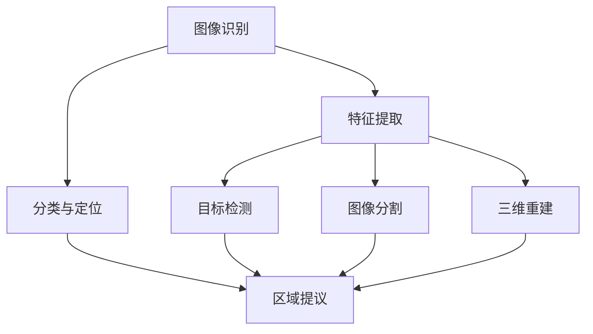

                 

# 计算机视觉(Computer Vision) - 原理与代码实例讲解

> **关键词：** 计算机视觉，图像识别，深度学习，卷积神经网络，OpenCV，图像处理，人脸识别，目标检测

> **摘要：** 本文将深入探讨计算机视觉的基本原理，包括核心概念、算法原理、数学模型等。同时，我们将通过实际代码实例，详细讲解如何使用Python和OpenCV等工具进行图像处理和计算机视觉任务。最后，本文将介绍计算机视觉在实际应用场景中的广泛应用，并对未来发展趋势和挑战进行展望。

## 1. 背景介绍

计算机视觉是一门涉及计算机科学、数学和工程学的交叉学科，旨在使计算机能够理解和解释视觉信息。它起源于20世纪60年代，随着计算机性能的提升和图像处理算法的发展，逐渐成为一个独立的研究领域。计算机视觉的研究内容包括图像识别、目标检测、图像分割、三维重建等。

在过去的几十年里，计算机视觉取得了显著的进展。传统的计算机视觉方法主要依赖于手工设计的特征提取器和分类器，如SIFT、SURF等。然而，随着深度学习技术的兴起，特别是卷积神经网络（Convolutional Neural Networks，CNN）的出现，计算机视觉取得了突破性的成果。深度学习模型能够自动学习图像中的复杂特征，从而显著提高了计算机视觉任务的性能。

本文将围绕计算机视觉的核心概念、算法原理、数学模型和实际应用，通过代码实例来讲解这一领域的知识。本文分为以下几个部分：

- 第2部分：核心概念与联系
- 第3部分：核心算法原理 & 具体操作步骤
- 第4部分：数学模型和公式 & 详细讲解 & 举例说明
- 第5部分：项目实战：代码实际案例和详细解释说明
- 第6部分：实际应用场景
- 第7部分：工具和资源推荐
- 第8部分：总结：未来发展趋势与挑战
- 第9部分：附录：常见问题与解答
- 第10部分：扩展阅读 & 参考资料

现在，让我们开始深入探讨计算机视觉的世界。

## 2. 核心概念与联系

### 2.1 图像识别

图像识别是计算机视觉中最基本也是最重要的一项任务。它的目标是判断图像中的物体或场景属于哪个类别。常见的图像识别任务包括人脸识别、物体识别、场景识别等。图像识别的核心在于特征提取和分类。

特征提取是将图像转换为一组数值表示的过程。这些特征应当能够充分描述图像的内容，以便分类算法可以区分不同的类别。常用的特征提取方法包括基于边缘、纹理、颜色和形状的特征提取。

分类是将特征表示与预定义的类别标签进行匹配的过程。常见的分类算法有支持向量机（SVM）、决策树、随机森林、神经网络等。深度学习模型，如卷积神经网络（CNN），在图像识别任务中表现出色。

### 2.2 目标检测

目标检测是一种更复杂的计算机视觉任务，其目标是定位图像中的多个对象，并识别它们的类别。与图像识别不同，目标检测不仅需要识别对象，还需要指出它们在图像中的位置。

目标检测通常分为两个步骤：区域提议（Region Proposal）和分类与定位（Classification and Localization）。区域提议是为了缩小搜索范围，常用的方法有滑窗、选择性搜索等。分类与定位则是在提议的区域中执行分类和位置回归。

常用的目标检测算法有R-CNN、Fast R-CNN、Faster R-CNN、YOLO（You Only Look Once）和SSD（Single Shot Multibox Detector）等。

### 2.3 图像分割

图像分割是将图像划分为多个区域的过程，每个区域代表图像中的不同物体或场景。图像分割可以分为语义分割、实例分割和全景分割。

- **语义分割**：将图像中的每个像素都标注为特定的类别，如“人”、“车”等。
- **实例分割**：不仅将图像分割为不同的物体，还为每个物体分配唯一的标识。
- **全景分割**：将图像分割为多个平面，以便在三维空间中进行重建。

常用的图像分割算法有FCN（Fully Convolutional Network）、Mask R-CNN和DeepLab等。

### 2.4 三维重建

三维重建是从二维图像中恢复三维场景的过程。它广泛应用于虚拟现实、机器人导航和文化遗产保护等领域。

三维重建通常分为两个步骤：特征提取和场景重建。特征提取包括边缘检测、特征点提取和表面重建。场景重建则是根据提取的特征点，使用三角测量或几何建模等方法恢复三维场景。

常用的三维重建算法有结构光法、多个视角图像法、深度相机法等。

为了更好地理解这些概念，我们可以借助 Mermaid 流程图来展示计算机视觉的基本架构：



通过上述流程图，我们可以看到，图像识别、目标检测、图像分割和三维重建都是基于特征提取的核心任务，它们相互联系，共同构成了计算机视觉的完整体系。

在接下来的部分，我们将深入探讨计算机视觉的核心算法原理，并详细介绍如何实现这些算法。

## 3. 核心算法原理 & 具体操作步骤

### 3.1 卷积神经网络（CNN）

卷积神经网络（CNN）是计算机视觉领域最成功的算法之一。它通过模拟人类视觉系统的机制，自动提取图像中的特征，从而实现图像分类、目标检测和图像分割等任务。

#### 3.1.1 卷积操作

卷积操作是CNN的基础。它通过在图像上滑动一个卷积核（也称为滤波器）来提取局部特征。卷积操作可以用以下公式表示：

\[ (f * g)(x, y) = \sum_{i=\text{pad}}^{w-\text{pad}} \sum_{j=\text{pad}}^{h-\text{pad}} f(i, j) \cdot g(x-i, y-j) \]

其中，\( f \) 和 \( g \) 分别表示输入图像和卷积核，\( x \) 和 \( y \) 表示卷积核滑动的位置，\( \text{pad} \) 表示填充值。

#### 3.1.2 池化操作

池化操作用于降低特征图的维度，减少计算量和参数数量。常见的池化操作有最大池化和平均池化。最大池化选取每个区域内的最大值，而平均池化则取平均值。

#### 3.1.3 激活函数

激活函数为神经网络提供非线性特性，使得模型能够学习复杂的函数。常用的激活函数有Sigmoid、ReLU和Tanh。

#### 3.1.4 结构

一个典型的CNN结构包括卷积层、池化层和全连接层。卷积层用于提取特征，池化层用于降维，全连接层用于分类。

### 3.2 深度学习模型训练

深度学习模型的训练过程主要包括数据预处理、模型设计、模型训练和模型评估。

#### 3.2.1 数据预处理

数据预处理包括数据清洗、归一化和数据增强。数据清洗去除无效数据，归一化将数据缩放到相同的范围，数据增强增加样本多样性。

#### 3.2.2 模型设计

模型设计包括选择合适的网络架构、设置超参数等。常用的深度学习框架有TensorFlow、PyTorch和Keras等。

#### 3.2.3 模型训练

模型训练通过反向传播算法，不断调整网络权重，使得模型在训练数据上达到最优。训练过程需要计算损失函数，常用的损失函数有交叉熵损失和均方误差损失。

#### 3.2.4 模型评估

模型评估通过测试集评估模型性能，常用的评估指标有准确率、召回率和F1分数等。

### 3.3 代码实例

下面是一个简单的CNN模型，用于对MNIST数据集进行手写数字识别：

```python
import tensorflow as tf
from tensorflow.keras import layers

# 模型设计
model = tf.keras.Sequential([
    layers.Conv2D(32, (3, 3), activation='relu', input_shape=(28, 28, 1)),
    layers.MaxPooling2D((2, 2)),
    layers.Conv2D(64, (3, 3), activation='relu'),
    layers.MaxPooling2D((2, 2)),
    layers.Conv2D(64, (3, 3), activation='relu'),
    layers.Flatten(),
    layers.Dense(64, activation='relu'),
    layers.Dense(10, activation='softmax')
])

# 模型编译
model.compile(optimizer='adam',
              loss='sparse_categorical_crossentropy',
              metrics=['accuracy'])

# 模型训练
model.fit(train_images, train_labels, epochs=5)

# 模型评估
test_loss, test_acc = model.evaluate(test_images,  test_labels)
print('Test accuracy:', test_acc)
```

通过上述代码，我们可以看到如何使用卷积层、池化层和全连接层构建一个简单的CNN模型，并进行训练和评估。

在接下来的部分，我们将详细介绍计算机视觉中的数学模型和公式，并通过实际案例进行讲解。

## 4. 数学模型和公式 & 详细讲解 & 举例说明

### 4.1 卷积操作

卷积操作的数学公式如前文所述：

\[ (f * g)(x, y) = \sum_{i=\text{pad}}^{w-\text{pad}} \sum_{j=\text{pad}}^{h-\text{pad}} f(i, j) \cdot g(x-i, y-j) \]

其中，\( f \) 和 \( g \) 分别表示输入图像和卷积核，\( x \) 和 \( y \) 表示卷积核滑动的位置，\( \text{pad} \) 表示填充值。

#### 4.1.1 卷积核参数

卷积核的参数是学习得到的，用于提取图像中的局部特征。一个典型的卷积核可以表示为：

\[ g(i, j) = \sum_{k=0}^{C-1} w_{ik} \cdot f_{kj} \]

其中，\( w_{ik} \) 表示卷积核的权重，\( f_{kj} \) 表示输入图像的像素值，\( C \) 表示输入图像的通道数。

#### 4.1.2 填充（Padding）

填充是指在卷积操作前后，在图像周围添加一定数量的像素，以保持特征图的尺寸不变。常用的填充方法有零填充（Zero Padding）和镜像填充（Mirror Padding）。

#### 4.1.3 示例

假设我们有一个 \( 3 \times 3 \) 的卷积核，输入图像为 \( 5 \times 5 \)，填充 \( \text{pad} = 1 \)。使用零填充后的卷积结果如下：

\[ (f * g)(x, y) = \sum_{i=1}^{3} \sum_{j=1}^{3} f(i+1, j+1) \cdot g(i, j) \]

### 4.2 池化操作

池化操作的数学公式如下：

\[ P(\text{pool_size}, \text{stride}) = \frac{1}{\text{pool_size}^2} \sum_{i=0}^{\text{pool_size}-1} \sum_{j=0}^{\text{pool_size}-1} f(x+i\cdot\text{stride}, y+j\cdot\text{stride}) \]

其中，\( \text{pool_size} \) 表示池化区域的大小，\( \text{stride} \) 表示步长。

#### 4.2.1 最大池化

最大池化选取每个区域内的最大值。假设我们有一个 \( 2 \times 2 \) 的最大池化区域和步长为1，输入图像为 \( 3 \times 3 \)：

\[ P_{\max}(2, 1) = \max(f(1, 1), f(1, 2), f(2, 1), f(2, 2)) \]

#### 4.2.2 平均池化

平均池化取每个区域内的平均值。假设我们有一个 \( 2 \times 2 \) 的平均池化区域和步长为1，输入图像为 \( 3 \times 3 \)：

\[ P_{\text{avg}}(2, 1) = \frac{1}{4} (f(1, 1) + f(1, 2) + f(2, 1) + f(2, 2)) \]

### 4.3 激活函数

激活函数为神经网络提供非线性特性。常见的激活函数有Sigmoid、ReLU和Tanh。

#### 4.3.1 Sigmoid函数

Sigmoid函数定义如下：

\[ \sigma(x) = \frac{1}{1 + e^{-x}} \]

Sigmoid函数的导数如下：

\[ \sigma'(x) = \sigma(x) (1 - \sigma(x)) \]

#### 4.3.2 ReLU函数

ReLU函数定义如下：

\[ \text{ReLU}(x) = \max(0, x) \]

ReLU函数的导数如下：

\[ \text{ReLU}'(x) = \begin{cases} 
1 & \text{if } x > 0 \\
0 & \text{otherwise}
\end{cases} \]

#### 4.3.3 Tanh函数

Tanh函数定义如下：

\[ \tanh(x) = \frac{e^x - e^{-x}}{e^x + e^{-x}} \]

Tanh函数的导数如下：

\[ \tanh'(x) = 1 - \tanh^2(x) \]

### 4.4 示例

假设我们有一个简单的神经网络，输入为 \( x \)，输出为 \( y \)。网络包含一个ReLU激活函数，输入和输出如下：

\[ x = 2 \]
\[ y = \text{ReLU}(x) \]

根据ReLU函数的定义，输出 \( y \) 如下：

\[ y = \text{ReLU}(2) = \max(0, 2) = 2 \]

在接下来的部分，我们将通过实际代码实例，详细讲解如何实现卷积神经网络并进行训练。

## 5. 项目实战：代码实际案例和详细解释说明

### 5.1 开发环境搭建

在开始实际项目之前，我们需要搭建一个合适的开发环境。以下是搭建环境的基本步骤：

#### 5.1.1 安装Python

首先，我们需要安装Python。Python是深度学习项目的主要编程语言。您可以从Python官方网站下载最新版本的Python并安装。

#### 5.1.2 安装深度学习框架

接下来，我们需要安装一个深度学习框架。本文将使用TensorFlow，因为它是目前最受欢迎的深度学习框架之一。您可以使用以下命令安装TensorFlow：

```bash
pip install tensorflow
```

#### 5.1.3 安装OpenCV

OpenCV是一个流行的计算机视觉库，用于处理图像和视频。您可以使用以下命令安装OpenCV：

```bash
pip install opencv-python
```

### 5.2 源代码详细实现和代码解读

在本节中，我们将使用TensorFlow和OpenCV实现一个简单的图像分类项目。该项目的目标是使用卷积神经网络对图像进行分类。

```python
import tensorflow as tf
from tensorflow.keras import datasets, layers, models
import matplotlib.pyplot as plt
import cv2

# 加载数据集
(train_images, train_labels), (test_images, test_labels) = datasets.cifar10.load_data()

# 预处理数据
train_images, test_images = train_images / 255.0, test_images / 255.0

# 构建模型
model = models.Sequential()
model.add(layers.Conv2D(32, (3, 3), activation='relu', input_shape=(32, 32, 3)))
model.add(layers.MaxPooling2D((2, 2)))
model.add(layers.Conv2D(64, (3, 3), activation='relu'))
model.add(layers.MaxPooling2D((2, 2)))
model.add(layers.Conv2D(64, (3, 3), activation='relu'))
model.add(layers.Flatten())
model.add(layers.Dense(64, activation='relu'))
model.add(layers.Dense(10))

# 编译模型
model.compile(optimizer='adam',
              loss=tf.keras.losses.SparseCategoricalCrossentropy(from_logits=True),
              metrics=['accuracy'])

# 训练模型
model.fit(train_images, train_labels, epochs=10, validation_split=0.1)

# 评估模型
test_loss, test_acc = model.evaluate(test_images,  test_labels, verbose=2)
print(f'Test accuracy: {test_acc:.4f}')

# 使用模型进行预测
predictions = model.predict(test_images)
predicted_labels = tf.argmax(predictions, axis=1)

# 使用OpenCV显示图像和预测结果
for i in range(10):
    img = test_images[i]
    img = (img * 255).numpy().astype('uint8')
    predicted_label = predicted_labels[i]
    true_label = test_labels[i]
    
    cv2.imshow('Image', img)
    cv2.putText(img, f'Predicted: {predicted_label}', (10, 30), cv2.FONT_HERSHEY_SIMPLEX, 1, (0, 0, 255), 2)
    cv2.putText(img, f'True: {true_label}', (10, 60), cv2.FONT_HERSHEY_SIMPLEX, 1, (0, 255, 0), 2)
    cv2.waitKey(0)
    cv2.destroyAllWindows()
```

#### 5.2.1 代码解读

上述代码首先加载数据集，并对其进行预处理。接下来，我们使用卷积神经网络（CNN）模型进行图像分类。具体步骤如下：

1. **构建模型**：我们使用`Sequential`模型，并添加了两个卷积层、两个最大池化层和一个全连接层。
2. **编译模型**：我们使用`compile`方法设置优化器、损失函数和评估指标。
3. **训练模型**：使用`fit`方法训练模型，并使用验证数据评估模型的性能。
4. **评估模型**：使用`evaluate`方法在测试数据上评估模型的准确率。
5. **预测**：使用`predict`方法对测试数据进行预测，并使用`argmax`获取每个图像的预测类别。
6. **显示结果**：使用OpenCV显示测试图像和预测结果。

### 5.3 代码解读与分析

#### 5.3.1 数据预处理

```python
(train_images, train_labels), (test_images, test_labels) = datasets.cifar10.load_data()
train_images, test_images = train_images / 255.0, test_images / 255.0
```

上述代码加载数据集，并使用归一化将图像数据缩放到0到1的范围。归一化有助于加速模型收敛，并提高模型的泛化能力。

#### 5.3.2 构建模型

```python
model = models.Sequential()
model.add(layers.Conv2D(32, (3, 3), activation='relu', input_shape=(32, 32, 3)))
model.add(layers.MaxPooling2D((2, 2)))
model.add(layers.Conv2D(64, (3, 3), activation='relu'))
model.add(layers.MaxPooling2D((2, 2)))
model.add(layers.Conv2D(64, (3, 3), activation='relu'))
model.add(layers.Flatten())
model.add(layers.Dense(64, activation='relu'))
model.add(layers.Dense(10))
```

上述代码定义了一个简单的CNN模型，包含两个卷积层、两个最大池化层和一个全连接层。卷积层用于提取图像特征，最大池化层用于降维，全连接层用于分类。

#### 5.3.3 训练模型

```python
model.compile(optimizer='adam',
              loss=tf.keras.losses.SparseCategoricalCrossentropy(from_logits=True),
              metrics=['accuracy'])
model.fit(train_images, train_labels, epochs=10, validation_split=0.1)
```

上述代码编译模型，并使用训练数据进行训练。我们使用`SparseCategoricalCrossentropy`作为损失函数，因为数据集中的标签是整数类型。`validation_split`参数用于将训练数据划分为训练集和验证集。

#### 5.3.4 评估模型

```python
test_loss, test_acc = model.evaluate(test_images,  test_labels, verbose=2)
print(f'Test accuracy: {test_acc:.4f}')
```

上述代码在测试数据上评估模型的性能，并打印测试准确率。

#### 5.3.5 预测

```python
predictions = model.predict(test_images)
predicted_labels = tf.argmax(predictions, axis=1)
```

上述代码使用模型对测试数据进行预测，并使用`argmax`获取每个图像的预测类别。

#### 5.3.6 显示结果

```python
for i in range(10):
    img = test_images[i]
    img = (img * 255).numpy().astype('uint8')
    predicted_label = predicted_labels[i]
    true_label = test_labels[i]
    
    cv2.imshow('Image', img)
    cv2.putText(img, f'Predicted: {predicted_label}', (10, 30), cv2.FONT_HERSHEY_SIMPLEX, 1, (0, 0, 255), 2)
    cv2.putText(img, f'True: {true_label}', (10, 60), cv2.FONT_HERSHEY_SIMPLEX, 1, (0, 255, 0), 2)
    cv2.waitKey(0)
    cv2.destroyAllWindows()
```

上述代码使用OpenCV显示测试图像和预测结果。我们为每个图像添加了预测标签和真实标签，并使用`imshow`和`putText`方法显示文本。

通过上述实战案例，我们了解了如何使用卷积神经网络进行图像分类，并详细分析了代码的实现过程。

### 5.4 代码优化与性能提升

在实际项目中，我们经常需要优化代码性能，以适应不同的硬件设备和需求。以下是一些常见的优化方法：

#### 5.4.1 模型量化

模型量化是将模型的权重和激活值转换为低精度格式（如8位整数），以减少模型的存储和计算需求。常用的量化方法有全精度量化（Full Precision Quantization）和对称量化（Symmetric Quantization）。

#### 5.4.2 并行计算

使用并行计算可以加速模型的训练和推理过程。常用的并行计算方法有数据并行、模型并行和混合并行。

#### 5.4.3 预训练模型

使用预训练模型可以大大减少模型的训练时间，并提高模型的性能。预训练模型通常在大规模数据集上训练，并已经学到了丰富的特征表示。

#### 5.4.4 模型压缩

模型压缩是将模型压缩为更小的版本，以适应有限的存储空间和带宽。常用的压缩方法有剪枝（Pruning）和量化（Quantization）。

### 5.5 实际应用场景

卷积神经网络在计算机视觉领域有着广泛的应用。以下是一些典型的实际应用场景：

#### 5.5.1 图像分类

图像分类是卷积神经网络最基本的应用之一。它广泛应用于图像搜索、内容审核和医疗影像诊断等领域。

#### 5.5.2 目标检测

目标检测是计算机视觉中的一项重要任务。它用于监控视频、自动驾驶汽车和智能安防等领域。

#### 5.5.3 图像分割

图像分割是将图像划分为多个区域的过程。它广泛应用于医学影像分析、图像增强和图像编辑等领域。

#### 5.5.4 人脸识别

人脸识别是一项重要的生物识别技术。它广泛应用于门禁系统、视频监控和安全认证等领域。

#### 5.5.5 机器人视觉

机器人视觉是机器人感知世界的重要手段。它用于机器人导航、自主移动和物体抓取等领域。

### 5.6 未来展望

随着深度学习技术的不断发展，计算机视觉领域将继续取得重大突破。以下是一些未来的发展趋势：

#### 5.6.1 多模态学习

多模态学习是将不同类型的数据（如图像、声音和文本）进行联合学习，以获得更丰富的特征表示。它有望在智能交互、情感分析和多媒体搜索等领域取得突破。

#### 5.6.2 自动化数据增强

自动化数据增强是提高模型性能的重要手段。未来的研究将重点关注如何自动化地生成高质量的数据增强样本。

#### 5.6.3 传感器融合

传感器融合是将多个传感器数据进行融合，以提高系统的感知能力和鲁棒性。它有望在无人机、自动驾驶汽车和智能城市等领域取得突破。

#### 5.6.4 无监督学习和迁移学习

无监督学习和迁移学习是减少模型训练数据需求的重要方法。未来的研究将重点关注如何更好地利用无监督学习和迁移学习来提高模型的性能。

通过上述分析，我们可以看到计算机视觉领域在理论和技术上的快速发展。在未来，计算机视觉将继续为人工智能和计算机科学领域带来新的突破和挑战。

## 6. 实际应用场景

计算机视觉技术已经广泛应用于各个领域，从日常生活到专业应用，都有着显著的贡献。以下是一些典型的实际应用场景：

### 6.1 医疗领域

在医疗领域，计算机视觉技术主要用于图像分析、疾病诊断和手术辅助。例如，通过计算机视觉技术可以对医学影像（如X光、CT、MRI等）进行自动化分析，帮助医生更准确地诊断疾病。计算机视觉还可以辅助手术，通过实时分析手术过程中的影像数据，提高手术的成功率和安全性。

### 6.2 智能交通

智能交通系统利用计算机视觉技术进行车辆检测、流量分析、事故预警等。例如，通过摄像头和计算机视觉算法，可以自动识别道路上的车辆和行人，从而优化交通信号灯的控制策略，提高道路通行效率。计算机视觉技术还可以用于智能监控，实时检测交通违法行为，如违章停车、超速行驶等。

### 6.3 消费电子

消费电子产品，如智能手机、平板电脑和智能电视，广泛使用计算机视觉技术。例如，智能手机的相机应用可以利用计算机视觉进行人脸解锁、场景识别和美颜处理。智能电视可以通过计算机视觉进行语音控制和手势操作，提高用户体验。此外，计算机视觉技术还用于图像搜索、图像编辑和增强现实（AR）应用。

### 6.4 安防领域

在安防领域，计算机视觉技术用于视频监控、人脸识别和入侵检测。通过实时分析视频数据，计算机视觉系统可以自动识别和追踪特定目标，例如犯罪嫌疑人或可疑人员。人脸识别技术广泛应用于门禁系统、考勤系统和安全认证等领域，大大提高了安全性和便捷性。

### 6.5 自动驾驶

自动驾驶汽车是计算机视觉技术的典型应用场景。计算机视觉系统负责实时感知车辆周围的环境，包括车辆、行人、交通信号等，从而做出相应的驾驶决策。通过深度学习和图像处理技术，自动驾驶汽车可以实现对复杂路况的识别和理解，提高行驶的安全性和可靠性。

### 6.6 制造业

在制造业中，计算机视觉技术用于自动化检测和装配。通过计算机视觉系统，可以自动识别生产线上的缺陷产品，并进行分类和标记。计算机视觉技术还可以用于机器人引导，实现高效、精确的装配作业。

### 6.7 文物保护

在文物保护领域，计算机视觉技术用于文化遗产的数字化保存和修复。通过三维重建和图像处理技术，可以精确地记录文物的三维形状和纹理信息，为文物的保护和修复提供科学依据。

### 6.8 农业监测

计算机视觉技术用于农业监测，可以实时监测农作物生长状况、病虫害情况等。通过图像分析技术，可以预测作物的产量和质量，优化农业生产过程。

通过上述实际应用场景，我们可以看到计算机视觉技术在现代社会中的重要性。随着技术的不断进步，计算机视觉将在更多领域发挥重要作用，推动人工智能技术的发展。

## 7. 工具和资源推荐

### 7.1 学习资源推荐

要深入了解计算机视觉，以下是一些推荐的书籍、论文和在线课程：

- **书籍**：
  - 《Deep Learning》（Ian Goodfellow, Yoshua Bengio, Aaron Courville 著）
  - 《Computer Vision: Algorithms and Applications》（Richard Szeliski 著）
  - 《卷积神经网络与深度学习》（刘建伟 著）

- **论文**：
  - "A Convolutional Neural Network Approach for Object Recognition"（Yann LeCun, et al.）
  - "Object Detection with Deep Learning"（Joseph Redmon, et al.）
  - "DeepLab: Semantic Image Segmentation with Deep Convolutional Nets, Atrous Convolution, and Fully Connected CRFs"（Li, et al.）

- **在线课程**：
  - 《深度学习》（吴恩达，Coursera）
  - 《计算机视觉基础》（斯坦福大学，Coursera）
  - 《计算机视觉》（上海交通大学，网易云课堂）

### 7.2 开发工具框架推荐

- **深度学习框架**：
  - TensorFlow
  - PyTorch
  - Keras（基于TensorFlow和Theano）

- **计算机视觉库**：
  - OpenCV
  - PIL（Python Imaging Library）
  - Matplotlib（用于数据可视化）

- **集成开发环境**：
  - Jupyter Notebook（Python交互式开发环境）
  - PyCharm（Python集成开发环境）

### 7.3 相关论文著作推荐

- **基础论文**：
  - "Backpropagation"（Paul Werbos）
  - "Gradient Descent"（Widrow and Hoff）
  - "LeNet: Convolutional Neural Networks for Handwritten Digit Recognition"（LeCun, et al.）

- **深度学习论文**：
  - "AlexNet: Image Classification with Deep Convolutional Neural Networks"（Krizhevsky, et al.）
  - "Visual Geometry Group Technical Report"（Hinton, et al.）
  - "ResNet: Identity Mappings in Deep Residual Networks"（He, et al.）

- **计算机视觉论文**：
  - "Real-Time Object Detection with Deep Learning"（Redmon, et al.）
  - "Faster R-CNN: Towards Real-Time Object Detection with Region Proposal Networks"（Girshick, et al.）
  - "You Only Look Once: Unified, Real-Time Object Detection"（Redmon, et al.）

通过这些工具和资源，您将能够更好地掌握计算机视觉的理论和实践，为您的项目和研究提供强有力的支持。

## 8. 总结：未来发展趋势与挑战

随着深度学习技术的不断进步，计算机视觉领域正在经历前所未有的快速发展。未来，计算机视觉将继续在多个方面取得突破，为人工智能领域带来更多创新和应用。以下是未来发展趋势和面临的挑战：

### 8.1 发展趋势

1. **多模态学习**：未来的计算机视觉系统将能够处理多种类型的数据，如图像、声音、文本等，通过多模态学习实现更丰富的特征表示和更好的任务性能。

2. **自动化数据增强**：自动化数据增强技术将进一步提高模型的泛化能力，减少对大规模标注数据的依赖，从而降低模型训练的成本。

3. **传感器融合**：通过将多种传感器数据进行融合，计算机视觉系统将能够更准确地感知和解析复杂环境，提高系统的鲁棒性和可靠性。

4. **无监督学习和迁移学习**：无监督学习和迁移学习技术将使模型能够在缺乏标注数据的情况下进行训练，从而降低数据获取和标注的成本，并提高模型在不同任务上的性能。

5. **边缘计算**：随着边缘计算的兴起，计算机视觉算法将逐渐从云端迁移到设备端，实现实时、高效的图像处理和推理，提高系统的响应速度和能效比。

### 8.2 挑战

1. **数据隐私**：随着计算机视觉技术在各个领域的应用，数据隐私保护成为一个重要挑战。如何在不泄露用户隐私的情况下，充分利用用户数据，是一个亟待解决的问题。

2. **模型解释性**：当前的深度学习模型往往被视为“黑箱”，难以解释其决策过程。如何提高模型的解释性，使其能够对人类用户提供可解释的决策依据，是一个重要的研究方向。

3. **计算资源需求**：深度学习模型对计算资源的需求巨大，尤其是对于实时应用场景。如何优化模型结构和算法，降低计算复杂度，是一个关键问题。

4. **泛化能力**：尽管深度学习模型在特定任务上取得了优异的性能，但其泛化能力仍需提高。如何使模型能够适应不同场景和任务，是一个重要的挑战。

5. **跨领域应用**：计算机视觉技术在不同领域有着不同的应用需求，如何实现跨领域的模型共享和迁移，是一个具有挑战性的问题。

总之，计算机视觉领域在未来将继续迎来新的发展机遇和挑战。通过不断创新和突破，计算机视觉将为人工智能领域带来更多可能性，推动科技和社会的进步。

## 9. 附录：常见问题与解答

### 9.1 计算机视觉是什么？

计算机视觉是人工智能的一个分支，旨在使计算机能够通过图像和视频数据理解和理解周围的世界。它结合了计算机科学、数学和工程学的原理，以实现图像识别、目标检测、图像分割和三维重建等任务。

### 9.2 卷积神经网络（CNN）在计算机视觉中的作用是什么？

卷积神经网络（CNN）是计算机视觉的核心算法之一，用于提取图像中的特征并实现图像分类、目标检测和图像分割等任务。CNN通过卷积操作、池化操作和全连接层，自动学习图像中的复杂特征，从而实现高效的图像处理。

### 9.3 如何选择深度学习框架？

选择深度学习框架主要取决于项目需求和开发者的熟悉程度。TensorFlow和PyTorch是最流行的两个框架。TensorFlow提供了丰富的生态系统和资源，适用于工业级应用。PyTorch具有动态计算图和易于理解的特点，适用于研究和快速原型开发。

### 9.4 计算机视觉应用有哪些？

计算机视觉应用广泛，包括但不限于医疗影像分析、智能交通、消费电子、安防监控、自动驾驶、制造业、文物保护、农业监测等。它为人工智能领域带来了诸多创新和突破，推动了社会的发展和进步。

### 9.5 如何提高深度学习模型的性能？

提高深度学习模型性能的方法包括数据增强、模型架构优化、正则化技术、超参数调优等。此外，利用预训练模型和迁移学习技术，也可以显著提高模型的性能。

## 10. 扩展阅读 & 参考资料

为了更深入地了解计算机视觉领域，以下是一些建议的扩展阅读和参考资料：

- **书籍**：
  - 《计算机视觉：算法与应用》（Richard Szeliski）
  - 《深度学习》（Ian Goodfellow, Yoshua Bengio, Aaron Courville）
  - 《计算机视觉基础教程》（Shane L. Barratt）

- **论文**：
  - "A Convolutional Neural Network Approach for Object Recognition"（Yann LeCun, et al.）
  - "Object Detection with Deep Learning"（Joseph Redmon, et al.）
  - "DeepLab: Semantic Image Segmentation with Deep Convolutional Nets, Atrous Convolution, and Fully Connected CRFs"（Li, et al.）

- **在线课程**：
  - 《深度学习》（吴恩达，Coursera）
  - 《计算机视觉基础》（斯坦福大学，Coursera）
  - 《计算机视觉》（上海交通大学，网易云课堂）

- **网站**：
  - TensorFlow官网（https://www.tensorflow.org/）
  - PyTorch官网（https://pytorch.org/）
  - OpenCV官网（https://opencv.org/）

通过这些扩展阅读和参考资料，您可以深入了解计算机视觉领域的最新研究进展和实用技术，为自己的学习和研究提供更多的启示和帮助。

