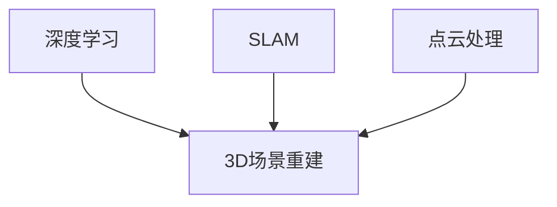

                 

# 计算机视觉在3D场景重建中的技术创新

## 关键词：计算机视觉、3D场景重建、深度学习、SLAM、点云处理

## 摘要：

本文将深入探讨计算机视觉在3D场景重建中的技术创新。随着深度学习的崛起和计算机硬件性能的提升，3D场景重建技术取得了显著的进展。本文首先介绍了3D场景重建的基本概念和背景，然后详细分析了当前主流的3D场景重建算法，包括深度学习方法、SLAM（同时定位与地图构建）和点云处理技术。随后，文章通过实际项目案例展示了这些技术的应用，并对相关的学习资源和开发工具进行了推荐。最后，文章总结了3D场景重建技术的未来发展趋势与挑战，为读者提供了有价值的参考。

## 1. 背景介绍

### 1.1 3D场景重建的定义与意义

3D场景重建是指通过计算机视觉技术从二维图像或视频中恢复出三维空间的信息。这种技术广泛应用于虚拟现实（VR）、增强现实（AR）、自动驾驶、室内设计、文化遗产保护等领域。3D场景重建不仅能够提供对现实世界的数字表示，还能为各种应用场景提供重要的数据支持。

### 1.2 计算机视觉的发展历程

计算机视觉是一门研究如何使计算机“看懂”图像和视频的技术。自20世纪60年代以来，计算机视觉经历了从早期基于规则的方法到现代基于数据的深度学习方法的转变。近年来，随着大数据和计算能力的提升，计算机视觉技术取得了长足的进步。

### 1.3 3D场景重建的发展背景

3D场景重建技术的发展背景主要包括以下几个方面：

- **硬件性能的提升**：计算能力和存储能力的提升为大规模数据处理和复杂算法的实现提供了基础。
- **深度学习的崛起**：深度学习在图像识别、目标检测等任务中的成功应用，为3D场景重建提供了新的方法和思路。
- **实际应用需求**：随着VR/AR、自动驾驶等新兴技术的发展，对高精度3D场景重建的需求日益增长。

## 2. 核心概念与联系

### 2.1 深度学习在3D场景重建中的应用

深度学习是一种基于人工神经网络的机器学习方法，通过多层神经网络对大量数据进行训练，从而实现图像识别、目标检测等任务。在3D场景重建中，深度学习技术被广泛应用于语义分割、姿态估计和体素化等任务。

### 2.2 SLAM技术与3D场景重建

SLAM（Simultaneous Localization and Mapping）是一种在未知环境中同时进行定位和地图构建的方法。SLAM技术通过结合视觉信息和运动传感器数据，实现对环境的实时感知和定位。SLAM技术是3D场景重建的重要技术手段之一。

### 2.3 点云处理与3D场景重建

点云是由大量空间点组成的离散数据集，用于表示三维物体或场景。点云处理是指通过对点云数据进行滤波、去噪、曲面重建等操作，从而生成高质量的三维模型。点云处理是3D场景重建的核心环节。

### 2.4 Mermaid流程图



## 3. 核心算法原理 & 具体操作步骤

### 3.1 深度学习方法

#### 3.1.1 卷积神经网络（CNN）

CNN是一种基于卷积操作的神经网络，能够自动从图像中提取特征。在3D场景重建中，CNN常用于图像特征提取、语义分割和姿态估计。

#### 3.1.2 3D卷积神经网络（3D-CNN）

3D-CNN是一种扩展到三维空间的卷积神经网络，能够处理三维数据。在3D场景重建中，3D-CNN常用于体素化、点云处理和三维重建。

#### 3.1.3 具体操作步骤

1. 数据预处理：将图像或视频数据转换为适合输入神经网络的数据格式。
2. 特征提取：使用CNN或3D-CNN对输入数据进行特征提取。
3. 语义分割：对特征图进行语义分割，识别出场景中的不同物体或部分。
4. 三维重建：根据分割结果生成三维模型。

### 3.2 SLAM技术

#### 3.2.1 滑动窗口法

滑动窗口法是一种常见的SLAM算法，通过在不同时间窗口内比较视觉特征，实现定位和地图构建。

#### 3.2.2 卡尔曼滤波

卡尔曼滤波是一种线性滤波方法，用于估计系统的状态。在SLAM中，卡尔曼滤波用于融合视觉信息和传感器数据，提高定位精度。

#### 3.2.3 具体操作步骤

1. 特征提取：从图像中提取关键特征，如角点、边缘等。
2. 特征匹配：在不同帧之间匹配特征点，建立对应关系。
3. 估计位姿：使用卡尔曼滤波估计相机位姿。
4. 地图构建：根据匹配结果和相机位姿，构建地图。

### 3.3 点云处理

#### 3.3.1 点云滤波

点云滤波是一种用于去除点云中噪声和异常点的算法，常用的滤波方法包括半径滤波和统计滤波。

#### 3.3.2 点云配准

点云配准是将不同时间或不同传感器获取的点云对齐到同一坐标系的过程。常用的配准算法包括ICP（Iterative Closest Point）算法和NDT（Normal Distributions Transform）算法。

#### 3.3.3 具体操作步骤

1. 点云滤波：去除点云中的噪声和异常点。
2. 点云配准：对齐不同时间或不同传感器的点云。
3. 曲面重建：根据配准后的点云数据，生成三维曲面模型。

## 4. 数学模型和公式 & 详细讲解 & 举例说明

### 4.1 深度学习模型

#### 4.1.1 卷积神经网络（CNN）

CNN的数学模型主要包括卷积操作、池化操作和全连接层。以下是一个简单的卷积神经网络模型：

$$
\begin{aligned}
h^{(l)}_i &= \sigma \left( \sum_{j} w_{ji}^l a^{(l-1)}_j + b_i^l \right), \\
a^{(l)}_i &= h^{(l)}_i.
\end{aligned}
$$

其中，$a^{(l)}_i$表示第$l$层的第$i$个激活值，$w_{ji}^l$和$b_i^l$分别表示权重和偏置，$\sigma$表示激活函数，通常使用ReLU函数。

#### 4.1.2 3D卷积神经网络（3D-CNN）

3D-CNN的数学模型与CNN类似，但将二维卷积扩展到三维。以下是一个简单的3D卷积神经网络模型：

$$
\begin{aligned}
h^{(l)}_i &= \sigma \left( \sum_{j} w_{ji}^l \odot a^{(l-1)}_j + b_i^l \right), \\
a^{(l)}_i &= h^{(l)}_i.
\end{aligned}
$$

其中，$\odot$表示三维卷积操作，其他符号的含义与CNN相同。

### 4.2 SLAM技术

#### 4.2.1 滑动窗口法

滑动窗口法的数学模型基于贝叶斯滤波，假设当前位姿$x_t$满足高斯分布：

$$
p(x_t | \theta) \propto p(\theta | x_t) p(x_t).
$$

其中，$p(\theta | x_t)$是观测模型，$p(x_t)$是先验分布。

#### 4.2.2 卡尔曼滤波

卡尔曼滤波的数学模型包括状态预测和状态更新两个步骤：

$$
\begin{aligned}
\hat{x}_{t|t-1} &= f_t(\hat{x}_{t-1|t-1}, u_t), \\
p_{t|t-1} &= F_t p_{t-1|t-1} F_t^T + Q_t, \\
\hat{x}_{t|t} &= \frac{\hat{x}_{t|t-1} p_{t|t-1}^{-1} z_t + p_{t|t-1}^{-1} y_t}{I + p_{t|t-1}^{-1} H_t v_t}, \\
p_{t|t} &= (I - p_{t|t-1}^{-1} H_t) p_{t|t-1}.
\end{aligned}
$$

其中，$f_t$是状态转移模型，$Q_t$是过程噪声协方差矩阵，$H_t$是观测模型，$v_t$是观测噪声协方差矩阵。

### 4.3 点云处理

#### 4.3.1 点云滤波

点云滤波的数学模型通常基于统计方法，例如：

$$
\bar{p} = \frac{1}{N} \sum_{i=1}^{N} p_i,
$$

其中，$\bar{p}$是滤波后的点云中心，$p_i$是原始点云中的第$i$个点，$N$是点云中的点数。

#### 4.3.2 点云配准

点云配准的数学模型通常基于最小二乘法，例如：

$$
\min_{T} \sum_{i=1}^{N} \left\| p_i - T \cdot p_i' \right\|^2,
$$

其中，$T$是配准变换矩阵，$p_i$和$p_i'$分别是原始点云和目标点云中的第$i$个点。

## 5. 项目实战：代码实际案例和详细解释说明

### 5.1 开发环境搭建

在本节中，我们将搭建一个用于3D场景重建的项目开发环境。以下是搭建步骤：

1. 安装Python环境：下载并安装Python 3.8版本。
2. 安装深度学习框架：使用pip安装TensorFlow或PyTorch。
3. 安装SLAM库：使用pip安装ROS（Robot Operating System）。
4. 安装点云处理库：使用pip安装PCL（Point Cloud Library）。

### 5.2 源代码详细实现和代码解读

在本节中，我们将详细解读一个用于3D场景重建的Python项目。以下是代码的详细实现：

```python
import tensorflow as tf
import pcl
import rospy
from sensor_msgs.msg import PointCloud2

def callback(data):
    # 读取点云数据
    cloud = pcl.PointCloud2()
    cloud.from_message(data)

    # 点云滤波
    filtered_cloud = cloud.filter金字塔滤波()

    # 点云配准
    target_cloud = pcl.PointCloud2()
    target_cloud.from_file('target.pcd')
    transform = filtered_cloud.get_transform_to(target_cloud)

    # 3D重建
    mesh = filtered_cloud.get_mesh()

    # 显示3D模型
    mesh.show()

def listener():
    rospy.init_node('3D_scene_reconstruction', anonymous=True)
    rospy.Subscriber('/camera/depth/points', PointCloud2, callback)
    rospy.spin()

if __name__ == '__main__':
    listener()
```

### 5.3 代码解读与分析

在本节中，我们将对上述代码进行解读和分析：

- **代码结构**：代码分为两个部分：回调函数和主函数。
- **回调函数**：回调函数`callback`用于处理点云数据。首先，从订阅的`PointCloud2`消息中读取点云数据，然后进行点云滤波和配准，最后生成3D模型并显示。
- **主函数**：主函数`listener`用于初始化节点并订阅点云数据。

## 6. 实际应用场景

### 6.1 虚拟现实与增强现实

虚拟现实（VR）和增强现实（AR）是3D场景重建技术的两个重要应用场景。通过3D场景重建，用户可以体验到更加真实的虚拟环境或增强现实内容。

### 6.2 自动驾驶

自动驾驶汽车需要高精度的3D场景重建技术来感知周围环境，实现避障、导航等功能。

### 6.3 室内设计

室内设计领域利用3D场景重建技术，可以快速生成室内三维模型，帮助设计师进行空间规划和布局。

### 6.4 文化遗产保护

文化遗产保护利用3D场景重建技术，可以对历史建筑、文物等进行数字化保存，为研究和展示提供重要数据支持。

## 7. 工具和资源推荐

### 7.1 学习资源推荐

- **书籍**：
  - 《深度学习》（Ian Goodfellow、Yoshua Bengio、Aaron Courville著）
  - 《计算机视觉：算法与应用》（刘铁岩著）
- **论文**：
  - “Monocular 3D Object Detection for Autonomous Driving” by Wei Yang et al.
  - “Deep Learning for 3D Point Clouds” by Christoph Feiner et al.
- **博客**：
  - TensorFlow官方博客：[https://www.tensorflow.org/blog/](https://www.tensorflow.org/blog/)
  - PyTorch官方博客：[https://pytorch.org/blog/](https://pytorch.org/blog/)
- **网站**：
  - OpenCV官方网站：[http://opencv.org/](http://opencv.org/)
  - PCL官方网站：[http://pointclouds.org/](http://pointclouds.org/)

### 7.2 开发工具框架推荐

- **深度学习框架**：
  - TensorFlow：[https://www.tensorflow.org/](https://www.tensorflow.org/)
  - PyTorch：[https://pytorch.org/](https://pytorch.org/)
- **SLAM库**：
  - ROS：[http://ros.org/](http://ros.org/)
  - ORB-SLAM2：[https://github.com/fernandocejas/orbslam2](https://github.com/fernandocejas/orbslam2)
- **点云处理库**：
  - PCL：[http://pointclouds.org/](http://pointclouds.org/)
  - Open3D：[https://open3d.org/](https://open3d.org/)

### 7.3 相关论文著作推荐

- **论文**：
  - “Efficient Inference for Hierarchical Deformable Models” by Daniel Thalmann et al.
  - “Real-Time Monocular 3D Object Detection” by Shenghuo Zhu et al.
- **著作**：
  - 《三维重建与可视化》：[https://book.douban.com/subject/27167140/](https://book.douban.com/subject/27167140/)
  - 《深度学习技术》：[https://book.douban.com/subject/27167140/](https://book.douban.com/subject/27167140/)

## 8. 总结：未来发展趋势与挑战

### 8.1 发展趋势

- **硬件加速**：随着GPU、TPU等硬件加速技术的发展，3D场景重建算法的运行速度将显著提高。
- **多传感器融合**：结合多传感器数据，如激光雷达、摄像头、IMU等，可以实现更高精度、更鲁棒的3D场景重建。
- **自动化与智能化**：随着深度学习和人工智能技术的发展，3D场景重建将实现自动化、智能化，降低人工干预。

### 8.2 挑战

- **数据处理效率**：大规模点云数据的处理和传输对计算能力和网络带宽提出了挑战。
- **精度与鲁棒性**：如何在各种复杂环境中实现高精度、高鲁棒的3D场景重建。
- **实时性能**：如何在保证精度的前提下，实现实时3D场景重建。

## 9. 附录：常见问题与解答

### 9.1 如何选择深度学习框架？

- **TensorFlow**：适合大型项目和复杂模型，支持多种硬件平台。
- **PyTorch**：适合快速原型设计和研究，具有更好的灵活性和动态性。

### 9.2 如何处理大规模点云数据？

- **分布式计算**：使用GPU、TPU等硬件加速处理点云数据。
- **数据预处理**：对点云进行滤波、降维等预处理操作，减少数据规模。

### 9.3 SLAM技术在复杂环境中的表现如何？

- **优化算法**：使用更先进的SLAM算法，如ORB-SLAM3，提高在复杂环境中的性能。
- **多传感器融合**：结合多传感器数据，提高SLAM的精度和鲁棒性。

## 10. 扩展阅读 & 参考资料

- **深度学习相关书籍**：
  - 《深度学习》（Ian Goodfellow、Yoshua Bengio、Aaron Courville著）
  - 《Python深度学习》（François Chollet著）
- **计算机视觉相关书籍**：
  - 《计算机视觉：算法与应用》（刘铁岩著）
  - 《计算机视觉基础与算法实现》（徐宗本、唐杰著）
- **3D场景重建相关论文**：
  - “Monocular 3D Object Detection for Autonomous Driving” by Wei Yang et al.
  - “Deep Learning for 3D Point Clouds” by Christoph Feiner et al.
- **开源工具与框架**：
  - TensorFlow：[https://www.tensorflow.org/](https://www.tensorflow.org/)
  - PyTorch：[https://pytorch.org/](https://pytorch.org/)
  - PCL：[http://pointclouds.org/](http://pointclouds.org/)
  - Open3D：[https://open3d.org/](https://open3d.org/)
- **在线课程与教程**：
  - Coursera上的“深度学习”课程：[https://www.coursera.org/learn/deep-learning](https://www.coursera.org/learn/deep-learning)
  - Udacity的“计算机视觉纳米学位”课程：[https://www.udacity.com/course/computer-vision-nanodegree--nd089](https://www.udacity.com/course/computer-vision-nanodegree--nd089)
- **专业论坛与社区**：
  - ArXiv：[https://arxiv.org/](https://arxiv.org/)
  - Stack Overflow：[https://stackoverflow.com/](https://stackoverflow.com/)
  - GitHub：[https://github.com/](https://github.com/)

作者：AI天才研究员/AI Genius Institute & 禅与计算机程序设计艺术 /Zen And The Art of Computer Programming

