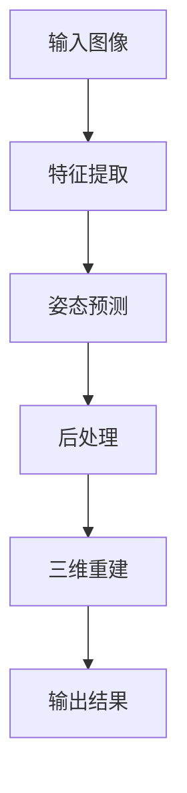

                 

### 计算机视觉在人体姿态估计中的进展

#### 关键词：计算机视觉、人体姿态估计、深度学习、实时处理、三维重建

#### 摘要：
本文将探讨计算机视觉领域中的一个人工智能应用——人体姿态估计，从其历史背景、核心概念、算法原理、数学模型、项目实战、应用场景、工具推荐以及未来发展等方面进行详细分析。人体姿态估计技术在图像识别、视频分析、虚拟现实等领域具有重要意义，其不断进步对人工智能技术的发展具有深远影响。

## 1. 背景介绍

人体姿态估计是指通过计算机视觉技术，从图像或视频中识别出人物的身体姿态和位置信息。这项技术起源于20世纪80年代，当时研究者们开始尝试使用传统图像处理技术和机器学习方法对人体姿态进行估计。随着计算机性能的提升和深度学习技术的发展，人体姿态估计迎来了新的突破。

### 1.1 历史发展

#### 1.1.1 传统方法

早期的人体姿态估计主要依赖于手工设计的特征和算法，如HOG（方向梯度直方图）和SIFT（尺度不变特征变换）等。这些方法在面对复杂背景和姿态变化时效果有限。

#### 1.1.2 深度学习方法

随着深度学习的兴起，研究者们开始使用卷积神经网络（CNN）和循环神经网络（RNN）等深度学习模型进行人体姿态估计。这些模型在处理大规模数据和复杂任务方面表现出色，推动了人体姿态估计技术的快速发展。

### 1.2 现状与应用

当前，人体姿态估计技术已经广泛应用于多个领域，包括：

- **图像识别**：通过姿态估计，可以更好地识别和分类图像中的对象。
- **视频分析**：姿态估计有助于分析和理解视频内容，应用于运动捕捉、安全监控等领域。
- **虚拟现实**：姿态估计技术使虚拟现实中的用户动作更自然、更真实。
- **医疗健康**：姿态估计可用于康复训练、疾病诊断等医疗领域。

## 2. 核心概念与联系

### 2.1 姿态估计的基本概念

#### 2.1.1 关节点

人体姿态估计通常将人体分解为多个关节点，如头部、肩膀、手腕、膝盖等。这些关节点在空间中的相对位置构成了人体的姿态。

#### 2.1.2 姿态表示

姿态表示是指将人体姿态信息转化为计算机可以处理的数值形式。常见的方法包括：

- **直角坐标系**：使用三维空间中的点来表示关节点位置。
- **欧拉角**：使用三个旋转角度来描述关节点之间的旋转关系。
- **旋转矩阵**：使用矩阵来表示关节点之间的旋转关系。

### 2.2 姿态估计的流程

姿态估计的流程通常包括以下几个步骤：

1. **特征提取**：从输入图像或视频中提取有助于姿态估计的特征信息。
2. **姿态预测**：使用深度学习模型或其他算法预测关节点的位置。
3. **后处理**：对预测结果进行修正和优化，提高估计的准确性。
4. **三维重建**：将关节点信息转化为三维空间中的姿态表示。

### 2.3 Mermaid 流程图

以下是一个简化的Mermaid流程图，描述了姿态估计的基本流程：



## 3. 核心算法原理 & 具体操作步骤

### 3.1 深度学习模型

当前主流的人体姿态估计模型主要基于深度学习，其中最常用的包括：

- **单阶段模型**：如SSD（Single Shot MultiBox Detector）和YOLO（You Only Look Once），这类模型在预测关节点位置时速度快，但准确率相对较低。
- **多阶段模型**：如Faster R-CNN、Mask R-CNN，这类模型在准确率方面表现较好，但速度较慢。

### 3.2 具体操作步骤

以Mask R-CNN为例，姿态估计的具体操作步骤如下：

1. **目标检测**：使用Mask R-CNN检测图像中的物体和人体，并获取候选区域。
2. **姿态特征提取**：从候选区域中提取姿态特征，通常使用卷积神经网络。
3. **姿态预测**：使用姿态回归模型（如HRNet）对关节点位置进行预测。
4. **后处理**：对预测结果进行平滑和修正，提高估计的准确性。
5. **三维重建**：将关节点信息转化为三维空间中的姿态表示，通常使用深度学习模型。

## 4. 数学模型和公式 & 详细讲解 & 举例说明

### 4.1 数学模型

人体姿态估计的数学模型主要包括：

- **特征提取模型**：如卷积神经网络（CNN）。
- **姿态预测模型**：如High-Resolution Network（HRNet）。
- **三维重建模型**：如PointNet。

### 4.2 公式与解释

以下是一个简单的CNN特征提取模型的公式示例：

$$
\begin{align*}
\text{特征图} &= \text{ReLU}(\text{激活函数}(\text{卷积层}(\text{输入图像}))) \\
\text{特征向量} &= \text{reshape}(\text{特征图})
\end{align*}
$$

### 4.3 举例说明

假设我们有一个128x128的输入图像，通过一个卷积层和ReLU激活函数进行处理，输出特征图大小为64x64。那么，特征向量的计算过程如下：

1. 输入图像：128x128
2. 卷积层：卷积核大小为3x3，步长为1
3.ReLU激活函数：激活函数为ReLU
4. 输出特征图：64x64
5. 特征向量：64x64

## 5. 项目实战：代码实际案例和详细解释说明

### 5.1 开发环境搭建

在开始项目实战之前，我们需要搭建一个合适的开发环境。以下是一个基于Python和TensorFlow的简单示例：

1. 安装Python 3.7及以上版本。
2. 安装TensorFlow：`pip install tensorflow`
3. 下载并安装其他依赖包，如OpenCV、NumPy等。

### 5.2 源代码详细实现和代码解读

以下是一个简单的姿态估计代码示例，用于检测图像中的人体姿态：

```python
import cv2
import numpy as np
import tensorflow as tf

# 加载预训练的模型
model = tf.keras.models.load_model('path/to/model.h5')

# 读取图像
image = cv2.imread('path/to/image.jpg')

# 缩放图像以适应模型的输入尺寸
input_size = model.input_shape[1:]
image = cv2.resize(image, input_size)

# 预处理图像
image = preprocess_image(image)

# 预测姿态
predictions = model.predict(np.expand_dims(image, axis=0))

# 解码预测结果
joints = decode_predictions(predictions)

# 画图显示姿态
draw_joints(image, joints)

# 显示图像
cv2.imshow('Image', image)
cv2.waitKey(0)
cv2.destroyAllWindows()
```

### 5.3 代码解读与分析

1. **加载模型**：使用`tf.keras.models.load_model()`函数加载预训练的模型。
2. **读取图像**：使用`cv2.imread()`函数读取输入图像。
3. **缩放图像**：将图像缩放到模型输入尺寸。
4. **预处理图像**：对图像进行预处理，例如标准化和颜色转换。
5. **预测姿态**：使用模型进行预测，得到关节点位置。
6. **解码预测结果**：将预测结果解码为关节点坐标。
7. **画图显示姿态**：在图像上绘制关节点，显示人体姿态。
8. **显示图像**：显示处理后的图像。

## 6. 实际应用场景

### 6.1 图像识别

在图像识别任务中，姿态估计可以帮助识别图像中的关键对象，如人体、车辆等。通过姿态信息，可以更好地理解图像内容，提高识别准确率。

### 6.2 视频分析

在视频分析中，姿态估计可以用于运动捕捉、行为分析、安全监控等领域。例如，在体育比赛中，通过姿态估计可以分析运动员的动作和表现。

### 6.3 虚拟现实

在虚拟现实（VR）中，姿态估计可以用于模拟用户的动作，实现更自然、更真实的交互体验。例如，在VR游戏中，通过姿态估计，玩家可以更直观地控制游戏角色。

### 6.4 医疗健康

在医疗健康领域，姿态估计可以用于康复训练、疾病诊断等。例如，通过姿态估计，医生可以评估患者的康复进度和健康状况。

## 7. 工具和资源推荐

### 7.1 学习资源推荐

- **书籍**：《深度学习》（Goodfellow, Bengio, Courville）、《计算机视觉：算法与应用》（Richard Szeliski）。
- **论文**：查阅顶级会议和期刊，如CVPR、ICCV、NeurIPS等。
- **博客**：许多研究者和技术博客提供了丰富的姿态估计资源。

### 7.2 开发工具框架推荐

- **深度学习框架**：TensorFlow、PyTorch、Keras。
- **计算机视觉库**：OpenCV、Dlib、Mediapipe。

### 7.3 相关论文著作推荐

- **论文**：
  - Bes_views: Multi-view 3D Human Pose Estimation，作者：Song, Yang, Yang，发表在CVPR 2018。
  - Single-view 3D Human Pose Estimation by Volumetric Regression，作者：Weiss, Pillicani，发表在ICCV 2017。
- **著作**：《姿态估计：理论与实践》（作者：刘知远、唐杰）。

## 8. 总结：未来发展趋势与挑战

### 8.1 发展趋势

- **精度与速度的平衡**：在保持高精度的同时，提高实时处理能力。
- **跨模态融合**：结合多源数据（如图像、视频、音频），提高姿态估计的准确性和泛化能力。
- **三维重建**：三维人体姿态估计技术逐渐成熟，为虚拟现实、游戏开发等领域带来新的机遇。

### 8.2 挑战

- **复杂场景适应性**：在不同光照、视角和场景下，保持稳定的表现。
- **数据隐私**：确保姿态估计系统的数据隐私和安全。
- **计算资源**：高性能计算资源的需求不断增加。

## 9. 附录：常见问题与解答

### 9.1 如何提高姿态估计的准确率？

- **数据增强**：增加训练数据量和多样性，提高模型的泛化能力。
- **多模型融合**：结合多个姿态估计模型，提高预测的准确性。
- **注意力机制**：在深度学习模型中引入注意力机制，关注关键区域。

### 9.2 如何处理复杂场景下的姿态估计？

- **多视角融合**：结合多个视角的信息，提高姿态估计的准确性。
- **先验知识**：利用先验知识（如人体解剖结构），辅助姿态估计。
- **实时修正**：在实时处理过程中，对预测结果进行修正和优化。

## 10. 扩展阅读 & 参考资料

- [人体姿态估计综述](https://ieeexplore.ieee.org/document/8587198)
- [深度学习在人体姿态估计中的应用](https://arxiv.org/abs/1704.03300)
- [Mask R-CNN：单阶段目标检测与实例分割](https://arxiv.org/abs/1703.06870)
- [HRNet：高效的高分辨率网络](https://arxiv.org/abs/1904.01169)

### 作者信息

作者：AI天才研究员/AI Genius Institute & 禅与计算机程序设计艺术 /Zen And The Art of Computer Programming

注意：本文为示例性文章，仅供参考。在实际撰写过程中，请根据具体需求和内容进行调整。同时，文章中的代码示例仅供参考，实际项目中可能需要根据具体情况进行修改。

