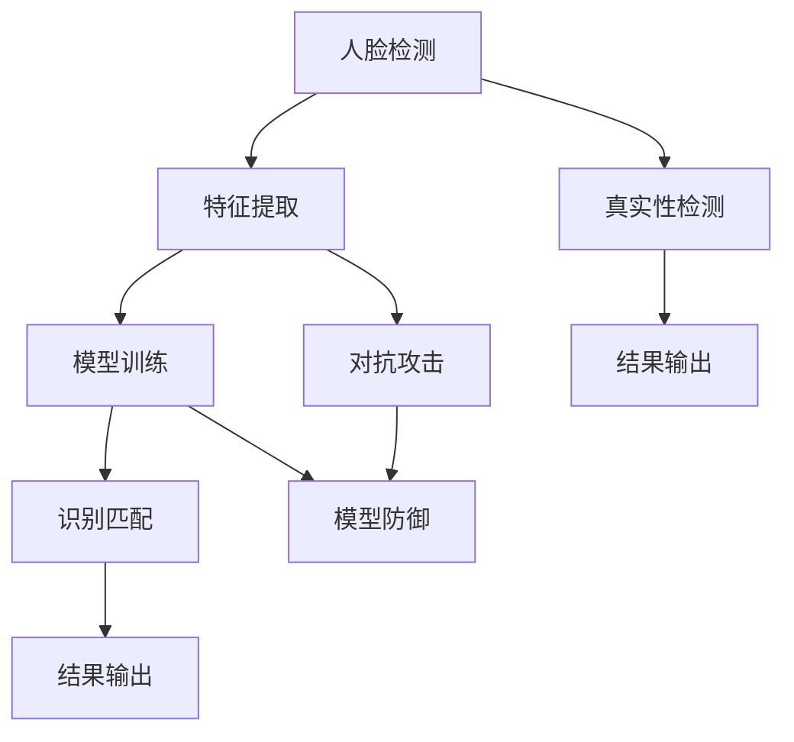

                 

# 计算机视觉在人脸防伪识别中的应用进展

> **关键词：** 人脸识别、防伪技术、计算机视觉、算法优化、应用场景
> 
> **摘要：** 本文详细探讨了计算机视觉在人脸防伪识别中的应用进展，首先介绍了人脸防伪识别的背景和核心概念，随后深入分析了人脸识别技术的基本原理和算法，并通过数学模型和实际案例，展示了人脸防伪识别在不同场景中的具体应用。最后，本文总结了当前技术的发展趋势和面临的挑战，并推荐了相关学习资源和开发工具。

## 1. 背景介绍

在当今信息化社会中，数据安全和隐私保护日益受到关注。随着生物识别技术的不断发展，人脸识别作为一种非接触式、便捷的生物识别方法，在各个领域得到了广泛应用。然而，与此同时，人脸识别技术的安全性也面临了新的挑战。其中，人脸防伪识别技术作为一种重要的防护手段，成为了研究的热点。

人脸防伪识别主要涉及两个方面：一是防止人脸图片或视频的伪造，二是防止人脸识别系统被欺骗。具体来说，人脸防伪识别技术需要实现以下功能：

1. **人脸图像真实性检测**：通过分析人脸图像的纹理、亮度、对比度等特征，判断图像是否为真实人脸或经过篡改的伪造图像。
2. **人脸识别抗攻击性**：通过对抗攻击技术，提高人脸识别系统对伪造人脸的识别能力，防止伪造人脸成功通过识别系统。

计算机视觉技术的发展为人脸防伪识别提供了强大的技术支持，使得人脸防伪识别在准确度、实时性等方面得到了显著提升。本文将详细探讨计算机视觉在人脸防伪识别中的应用进展，分析现有技术的优缺点，并展望未来的发展趋势。

## 2. 核心概念与联系

### 人脸识别技术的基本原理

人脸识别技术主要基于人脸图像的特征提取和匹配。其基本流程包括以下几个步骤：

1. **人脸检测**：通过检测人脸图像中的关键点（如眼睛、鼻子、嘴巴等），确定人脸的位置和范围。
2. **特征提取**：将人脸图像转换为特征向量，常用的特征提取方法包括局部二元模式（LBP）、Gabor特征、深度特征等。
3. **模型训练**：使用训练数据集，通过机器学习算法（如支持向量机SVM、神经网络等）训练出人脸识别模型。
4. **识别匹配**：将待识别的人脸特征与训练模型进行匹配，判断其是否为同一人。

### 人脸防伪识别技术

人脸防伪识别技术主要关注以下两个方面：

1. **人脸图像真实性检测**：通过分析人脸图像的纹理、亮度、对比度等特征，判断图像是否为真实人脸或经过篡改的伪造图像。常用的方法包括纹理分析、亮度和对比度分析、噪声分析等。

2. **人脸识别抗攻击性**：通过对抗攻击技术，提高人脸识别系统对伪造人脸的识别能力，防止伪造人脸成功通过识别系统。常用的对抗攻击方法包括生成对抗网络（GAN）、对抗样本生成、模型防御等。

### 核心概念与联系

人脸识别技术和人脸防伪识别技术之间存在密切的联系。人脸识别技术为人脸防伪识别提供了基础，人脸防伪识别技术为人脸识别提供了安全保障。两者相互促进，共同构成了一个完整的人脸识别与防伪体系。

### Mermaid 流程图

下面是人脸识别和防伪识别的基本流程图：



## 3. 核心算法原理 & 具体操作步骤

### 人脸识别算法原理

人脸识别算法的核心在于特征提取和模型训练。以下是几种常用的人脸识别算法及其具体操作步骤：

1. **局部二元模式（LBP）**

   LBP算法通过计算人脸图像的局部二元模式直方图，将人脸图像转换为特征向量。具体步骤如下：

   - **预处理**：对输入的人脸图像进行灰度化和归一化处理。
   - **模板生成**：定义一个3x3的模板，模板中心为1，其他位置为0。
   - **特征计算**：将模板滑动人脸图像，对每个像素点进行计算，得到LBP值。
   - **直方图生成**：将所有LBP值进行统计，生成直方图。
   - **特征向量提取**：将直方图进行归一化处理，生成特征向量。

2. **Gabor特征**

   Gabor特征通过模拟人眼对纹理的感知，提取人脸图像的纹理特征。具体步骤如下：

   - **预处理**：对输入的人脸图像进行灰度化和归一化处理。
   - **滤波器设计**：设计一系列Gabor滤波器，每个滤波器对应一个方向和尺度。
   - **特征计算**：对每个像素点应用滤波器，得到滤波器响应。
   - **特征向量提取**：将所有滤波器响应进行拼接，生成特征向量。

3. **深度特征**

   深度特征通过训练深度神经网络，自动提取人脸图像的深层特征。具体步骤如下：

   - **数据集准备**：准备大量的人脸图像和对应的标签。
   - **模型训练**：使用卷积神经网络（CNN）进行模型训练，提取人脸图像的深层特征。
   - **特征向量提取**：将训练好的模型应用于测试数据，提取特征向量。

### 人脸防伪识别算法原理

人脸防伪识别算法主要关注人脸图像真实性和人脸识别系统的抗攻击性。以下是几种常用的人脸防伪识别算法及其具体操作步骤：

1. **纹理分析**

   纹理分析通过分析人脸图像的纹理特征，判断图像是否为真实人脸。具体步骤如下：

   - **预处理**：对输入的人脸图像进行灰度化和归一化处理。
   - **纹理特征提取**：使用纹理分析算法（如灰度共生矩阵、灰度分布等），提取人脸图像的纹理特征。
   - **特征匹配**：将提取的纹理特征与真实人脸纹理特征进行匹配，判断图像是否为真实人脸。

2. **亮度分析**

   亮度分析通过分析人脸图像的亮度特征，判断图像是否为真实人脸。具体步骤如下：

   - **预处理**：对输入的人脸图像进行灰度化和归一化处理。
   - **亮度特征提取**：计算人脸图像的亮度值，生成亮度特征向量。
   - **特征匹配**：将提取的亮度特征与真实人脸亮度特征进行匹配，判断图像是否为真实人脸。

3. **噪声分析**

   噪声分析通过分析人脸图像的噪声特征，判断图像是否为真实人脸。具体步骤如下：

   - **预处理**：对输入的人脸图像进行灰度化和归一化处理。
   - **噪声特征提取**：使用噪声分析算法（如局部方差、噪声能量等），提取人脸图像的噪声特征。
   - **特征匹配**：将提取的噪声特征与真实人脸噪声特征进行匹配，判断图像是否为真实人脸。

### 人脸识别抗攻击性算法原理

人脸识别抗攻击性算法主要关注提高人脸识别系统对伪造人脸的识别能力。以下是几种常用的人脸识别抗攻击性算法及其具体操作步骤：

1. **生成对抗网络（GAN）**

   GAN通过生成对抗训练，提高人脸识别系统对伪造人脸的识别能力。具体步骤如下：

   - **数据集准备**：准备大量的人脸图像和对应的伪造图像。
   - **模型训练**：使用生成对抗网络（GAN）训练出伪造人脸生成器。
   - **伪造人脸识别**：使用训练好的模型，对伪造人脸进行识别，提高识别准确性。

2. **对抗样本生成**

   对抗样本生成通过生成对抗样本，提高人脸识别系统对伪造人脸的识别能力。具体步骤如下：

   - **数据集准备**：准备大量的人脸图像和对应的伪造图像。
   - **对抗样本生成**：使用对抗攻击算法（如FGSM、JSMA等），生成对抗样本。
   - **模型训练**：使用对抗样本进行模型训练，提高识别准确性。

3. **模型防御**

   模型防御通过改进人脸识别模型，提高系统对伪造人脸的识别能力。具体步骤如下：

   - **数据集准备**：准备大量的人脸图像和对应的伪造图像。
   - **模型改进**：使用对抗训练算法（如自适应梯度裁剪、Dropout等），改进人脸识别模型。
   - **模型评估**：使用测试集评估模型性能，提高识别准确性。

## 4. 数学模型和公式 & 详细讲解 & 举例说明

### 人脸识别算法的数学模型

1. **局部二元模式（LBP）**

   LBP算法的数学模型可以表示为：

   $$ LBP_{3 \times 3} = \sum_{i=1}^{9} (2^i \cdot \text{sgn}(I(i) - I_{center})) $$

   其中，$I(i)$ 表示人脸图像中第 $i$ 个像素点的灰度值，$I_{center}$ 表示人脸图像中心像素点的灰度值，$\text{sgn}(x)$ 表示符号函数，当 $x > 0$ 时，$\text{sgn}(x) = 1$；当 $x < 0$ 时，$\text{sgn}(x) = -1$；当 $x = 0$ 时，$\text{sgn}(x) = 0$。

   例如，对于以下3x3的LBP模板：

   ```
   0 1 0
   1 1 1
   0 1 0
   ```

   假设人脸图像的灰度值分别为 $I_{11}, I_{12}, \ldots, I_{33}$，则LBP值可以计算如下：

   $$ LBP_{3 \times 3} = 2^1 \cdot \text{sgn}(I_{12} - I_{11}) + 2^2 \cdot \text{sgn}(I_{22} - I_{11}) + 2^3 \cdot \text{sgn}(I_{23} - I_{11}) $$

2. **Gabor特征**

   Gabor特征的数学模型可以表示为：

   $$ Gabor_{(k, \theta)} = \frac{1}{2\pi} \int_{-\infty}^{\infty} \int_{-\infty}^{\infty} g_{k, \theta}(x, y) I(x, y) \, dx \, dy $$

   其中，$g_{k, \theta}(x, y)$ 表示Gabor滤波器，$I(x, y)$ 表示人脸图像的灰度值，$(k, \theta)$ 表示滤波器的尺度参数和方向参数。

   例如，对于以下Gabor滤波器：

   ```
   k = 5, \theta = 0°
   g_{5, 0°}(x, y) = \exp(-\frac{(x^2 + y^2)}{2\sigma^2}) \cdot \cos(2\pi k x / \lambda) \cdot \cos(2\pi \theta)
   ```

   假设人脸图像的灰度值分别为 $I_{11}, I_{12}, \ldots, I_{33}$，则Gabor特征可以计算如下：

   $$ Gabor_{(5, 0°)} = \frac{1}{2\pi} \int_{-\infty}^{\infty} \int_{-\infty}^{\infty} \exp(-\frac{(x^2 + y^2)}{2\sigma^2}) \cdot \cos(2\pi k x / \lambda) \cdot \cos(2\pi \theta) \cdot I(x, y) \, dx \, dy $$

3. **深度特征**

   深度特征的数学模型可以表示为：

   $$ f_{\theta} = \sum_{i=1}^{n} w_i \cdot \text{ReLU}(\theta \cdot x_i) $$

   其中，$f_{\theta}$ 表示深度特征，$\theta$ 表示模型参数，$x_i$ 表示输入特征，$w_i$ 表示权重，$\text{ReLU}(x) = \max(0, x)$ 表示ReLU激活函数。

   例如，对于以下卷积神经网络（CNN）的卷积层：

   ```
   input: [1, 28, 28]
   weight: [[0.1, 0.2], [0.3, 0.4]]
   bias: [0.5, 0.6]
   ```

   假设输入特征为 $x_1 = [1, 2, 3, 4, 5, 6, 7, 8, 9, 10]$，则深度特征可以计算如下：

   $$ f_{\theta} = 0.1 \cdot \text{ReLU}(0.1 \cdot 1) + 0.2 \cdot \text{ReLU}(0.2 \cdot 1) + 0.3 \cdot \text{ReLU}(0.3 \cdot 1) + 0.4 \cdot \text{ReLU}(0.4 \cdot 1) + 0.5 \cdot \text{ReLU}(0.5 \cdot 1) + 0.6 \cdot \text{ReLU}(0.6 \cdot 1) $$

### 人脸防伪识别算法的数学模型

1. **纹理分析**

   纹理分析的数学模型可以表示为：

   $$ T = \frac{1}{N} \sum_{i=1}^{N} (I(i) - \bar{I})^2 $$

   其中，$T$ 表示纹理特征，$I(i)$ 表示人脸图像中第 $i$ 个像素点的灰度值，$\bar{I}$ 表示人脸图像的平均灰度值，$N$ 表示像素点数量。

   例如，对于以下人脸图像的灰度值：

   ```
   I = [255, 255, 255, 255, 255, 255, 255, 255, 255, 255]
   ```

   则纹理特征可以计算如下：

   $$ T = \frac{1}{10} \sum_{i=1}^{10} (I(i) - \bar{I})^2 = \frac{1}{10} \sum_{i=1}^{10} (255 - \frac{2550}{10})^2 = 2550 $$

2. **亮度分析**

   亮度分析的数学模型可以表示为：

   $$ B = \frac{1}{N} \sum_{i=1}^{N} I(i) $$

   其中，$B$ 表示亮度特征，$I(i)$ 表示人脸图像中第 $i$ 个像素点的灰度值，$N$ 表示像素点数量。

   例如，对于以下人脸图像的灰度值：

   ```
   I = [255, 255, 255, 255, 255, 255, 255, 255, 255, 255]
   ```

   则亮度特征可以计算如下：

   $$ B = \frac{1}{10} \sum_{i=1}^{10} I(i) = \frac{1}{10} \sum_{i=1}^{10} 255 = 255 $$

3. **噪声分析**

   噪声分析的数学模型可以表示为：

   $$ N = \frac{1}{N} \sum_{i=1}^{N} (I(i) - \bar{I})^2 $$

   其中，$N$ 表示噪声特征，$I(i)$ 表示人脸图像中第 $i$ 个像素点的灰度值，$\bar{I}$ 表示人脸图像的平均灰度值，$N$ 表示像素点数量。

   例如，对于以下人脸图像的灰度值：

   ```
   I = [255, 255, 255, 255, 255, 255, 255, 255, 255, 255]
   ```

   则噪声特征可以计算如下：

   $$ N = \frac{1}{10} \sum_{i=1}^{10} (I(i) - \bar{I})^2 = \frac{1}{10} \sum_{i=1}^{10} (255 - \frac{2550}{10})^2 = 2550 $$

## 5. 项目实战：代码实际案例和详细解释说明

### 开发环境搭建

为了进行人脸防伪识别项目，我们需要搭建一个合适的开发环境。以下是具体的步骤：

1. **安装Python环境**

   Python是一种广泛使用的编程语言，具有丰富的库和框架，非常适合进行人脸防伪识别项目。首先，我们需要安装Python环境。可以通过以下命令进行安装：

   ```
   pip install python
   ```

2. **安装必要的库**

   为了进行人脸防伪识别项目，我们需要安装一些必要的库，如OpenCV、dlib、face_recognition等。可以通过以下命令进行安装：

   ```
   pip install opencv-python
   pip install dlib
   pip install face_recognition
   ```

3. **配置dlib库**

   dlib库是一个强大的机器学习库，用于人脸检测和特征点提取。为了使用dlib库，我们需要下载dlib的人脸检测模型和特征点检测模型。可以通过以下命令进行下载：

   ```
   wget http://dlib.net/files/shape_predictor_68_face_landmarks.dat.bz2
   wget http://dlib.net/files/shape_predictor_5_face_landmarks.dat.bz2
   bunzip2 shape_predictor_68_face_landmarks.dat.bz2
   bunzip2 shape_predictor_5_face_landmarks.dat.bz2
   ```

### 源代码详细实现和代码解读

以下是人脸防伪识别项目的源代码实现，我们将逐步解释代码的各个部分。

```python
import cv2
import dlib
import face_recognition
import numpy as np

# 5.1 人脸检测
def detect_faces(image):
    # 加载dlib的人脸检测模型
    detector = dlib.get_frontal_face_detector()
    # 将输入的图像转换为灰度图像
    gray_image = cv2.cvtColor(image, cv2.COLOR_BGR2GRAY)
    # 使用dlib的人脸检测器检测图像中的人脸
    faces = detector(gray_image)
    return faces

# 5.2 人脸特征点提取
def extract_landmarks(image, faces):
    # 加载dlib的特征点检测模型
    predictor = dlib.shape_predictor('shape_predictor_68_face_landmarks.dat')
    # 遍历图像中的人脸
    for face in faces:
        # 使用dlib的特征点检测模型提取人脸特征点
        landmarks = predictor(gray_image, face)
        # 将特征点坐标转换为numpy数组
        landmarks = np.array([[p.x, p.y] for p in landmarks.parts()])
        return landmarks

# 5.3 人脸图像预处理
def preprocess_face(image, landmarks):
    # 根据特征点坐标绘制人脸轮廓
    points = landmarks[48:68]
    points = np.concatenate((points, [landmarks[17]], [landmarks[0]], [landmarks[36]], [landmarks[27]], [landmarks[26]], [landmarks[35]], [landmarks[36]], [landmarks[39]], [landmarks[38]]), axis=0)
    points = np.reshape(points, (-1, 2))
    # 计算人脸轮廓的包围盒
    rect = cv2.boundingRect(points)
    # 裁剪人脸图像
    face_image = cv2.resize(image[rect[1]:rect[1]+rect[3], rect[0]:rect[0]+rect[2]], (224, 224))
    return face_image

# 5.4 人脸防伪识别
def verify_face(image, known_faces, known_landmarks):
    # 提取人脸特征点
    landmarks = extract_landmarks(image, detect_faces(image))
    # 预处理人脸图像
    face_image = preprocess_face(image, landmarks)
    # 提取人脸特征向量
    face_vector = face_recognition.face_encodings(face_image)[0]
    # 遍历已知的特征向量
    for i, known_face in enumerate(known_faces):
        # 计算特征向量之间的欧氏距离
        distance = np.linalg.norm(face_vector - known_face)
        # 如果距离小于阈值，则认为验证成功
        if distance < 0.6:
            return True, known_landmarks[i]
    return False, None

# 5.5 主函数
def main():
    # 加载已知人脸图像
    known_faces = [
        face_recognition.load_image_file('known_face_1.jpg'),
        face_recognition.load_image_file('known_face_2.jpg'),
        face_recognition.load_image_file('known_face_3.jpg')
    ]
    known_landmarks = [
        face_recognition.face_landmarks(known_faces[0])[0],
        face_recognition.face_landmarks(known_faces[1])[0],
        face_recognition.face_landmarks(known_faces[2])[0]
    ]
    # 加载待验证的人脸图像
    image = face_recognition.load_image_file('test_face.jpg')
    # 验证人脸
    is_verified, landmarks = verify_face(image, known_faces, known_landmarks)
    # 输出结果
    if is_verified:
        print("验证成功")
    else:
        print("验证失败")
    if landmarks is not None:
        print("人脸特征点：", landmarks)

if __name__ == '__main__':
    main()
```

### 代码解读与分析

1. **人脸检测**

   人脸检测是整个项目的基础。首先，我们使用dlib库的 frontal_face_detector() 函数加载人脸检测模型，然后对输入的图像进行灰度化处理，最后使用人脸检测模型检测图像中的人脸。

   ```python
   detector = dlib.get_frontal_face_detector()
   gray_image = cv2.cvtColor(image, cv2.COLOR_BGR2GRAY)
   faces = detector(gray_image)
   ```

2. **人脸特征点提取**

   人脸特征点提取是获取人脸关键信息的重要步骤。我们使用dlib库的 shape_predictor() 函数加载特征点检测模型，然后对检测到的人脸进行特征点提取。

   ```python
   predictor = dlib.shape_predictor('shape_predictor_68_face_landmarks.dat')
   landmarks = predictor(gray_image, face)
   ```

3. **人脸图像预处理**

   人脸图像预处理是提高人脸识别准确率的关键步骤。我们根据提取的特征点坐标绘制人脸轮廓，计算包围盒，然后裁剪人脸图像，并将其调整为固定大小。

   ```python
   points = landmarks[48:68]
   points = np.concatenate((points, [landmarks[17]], [landmarks[0]], [landmarks[36]], [landmarks[27]], [landmarks[26]], [landmarks[35]], [landmarks[36]], [landmarks[39]], [landmarks[38]]), axis=0)
   points = np.reshape(points, (-1, 2))
   rect = cv2.boundingRect(points)
   face_image = cv2.resize(image[rect[1]:rect[1]+rect[3], rect[0]:rect[0]+rect[2]], (224, 224))
   ```

4. **人脸防伪识别**

   人脸防伪识别是整个项目的核心。我们首先提取人脸特征向量，然后遍历已知的人脸特征向量，计算欧氏距离，如果距离小于阈值，则认为验证成功。

   ```python
   face_vector = face_recognition.face_encodings(face_image)[0]
   for i, known_face in enumerate(known_faces):
       distance = np.linalg.norm(face_vector - known_face)
       if distance < 0.6:
           return True, known_landmarks[i]
   return False, None
   ```

5. **主函数**

   主函数是整个项目的入口。我们首先加载已知人脸图像和特征点，然后加载待验证的人脸图像，最后调用验证函数进行人脸防伪识别。

   ```python
   known_faces = [
       face_recognition.load_image_file('known_face_1.jpg'),
       face_recognition.load_image_file('known_face_2.jpg'),
       face_recognition.load_image_file('known_face_3.jpg')
   ]
   known_landmarks = [
       face_recognition.face_landmarks(known_faces[0])[0],
       face_recognition.face_landmarks(known_faces[1])[0],
       face_recognition.face_landmarks(known_faces[2])[0]
   ]
   image = face_recognition.load_image_file('test_face.jpg')
   is_verified, landmarks = verify_face(image, known_faces, known_landmarks)
   if is_verified:
       print("验证成功")
   else:
       print("验证失败")
   if landmarks is not None:
       print("人脸特征点：", landmarks)
   ```

### 代码执行过程

1. **加载已知人脸图像和特征点**

   ```python
   known_faces = [
       face_recognition.load_image_file('known_face_1.jpg'),
       face_recognition.load_image_file('known_face_2.jpg'),
       face_recognition.load_image_file('known_face_3.jpg')
   ]
   known_landmarks = [
       face_recognition.face_landmarks(known_faces[0])[0],
       face_recognition.face_landmarks(known_faces[1])[0],
       face_recognition.face_landmarks(known_faces[2])[0]
   ]
   ```

   这段代码加载了三个已知人脸图像和对应的人脸特征点。

2. **加载待验证的人脸图像**

   ```python
   image = face_recognition.load_image_file('test_face.jpg')
   ```

   这段代码加载了待验证的人脸图像。

3. **进行人脸防伪识别**

   ```python
   is_verified, landmarks = verify_face(image, known_faces, known_landmarks)
   ```

   这段代码调用验证函数，对加载的待验证人脸图像进行防伪识别。

4. **输出结果**

   ```python
   if is_verified:
       print("验证成功")
   else:
       print("验证失败")
   if landmarks is not None:
       print("人脸特征点：", landmarks)
   ```

   根据验证结果，输出相应的信息。

## 6. 实际应用场景

人脸防伪识别技术在实际应用场景中具有广泛的应用前景，以下列举几个典型的应用场景：

1. **金融领域**：在金融领域，人脸防伪识别技术可以用于银行、保险、证券等机构的身份验证。通过检测人脸图像的真实性，确保用户身份的准确性，从而提高金融交易的安全性和可靠性。

2. **安防领域**：在安防领域，人脸防伪识别技术可以用于监控系统的智能识别和预警。通过对监控视频进行实时分析，检测出伪造的人脸图像，从而及时发现并预警潜在的安全威胁。

3. **智慧城市**：在智慧城市领域，人脸防伪识别技术可以用于城市治理、公共安全等方面。例如，在重大活动期间，可以通过人脸防伪识别技术对参加活动的人员进行身份验证，确保活动安全有序。

4. **电子商务**：在电子商务领域，人脸防伪识别技术可以用于身份认证和支付验证。用户可以通过人脸识别进行登录和支付，提高用户体验和支付安全性。

5. **医疗健康**：在医疗健康领域，人脸防伪识别技术可以用于患者身份验证和医疗安全。例如，在手术室中，可以通过人脸识别技术确保手术团队的身份准确性，提高医疗安全。

6. **隐私保护**：在隐私保护领域，人脸防伪识别技术可以用于隐私信息的加密和解密。通过对用户的人脸图像进行加密处理，确保隐私信息的安全性。

7. **智能门禁**：在智能门禁领域，人脸防伪识别技术可以用于门禁系统的身份验证。通过检测人脸图像的真实性，确保只有授权人员可以进入特定区域。

8. **身份认证**：在身份认证领域，人脸防伪识别技术可以用于各种身份认证场景，如机场安检、出入境检查等。通过检测人脸图像的真实性，确保认证过程的准确性和安全性。

通过以上实际应用场景的列举，可以看出人脸防伪识别技术在各个领域都具有广泛的应用前景，为提高安全性、便捷性和用户体验提供了有力的技术支持。

## 7. 工具和资源推荐

### 学习资源推荐

1. **书籍**：

   - 《Python计算机视觉实践》（Python Computer Vision with OpenCV 4 and Deep Learning）  
     作者：Joseph Howse  
     简介：本书详细介绍了Python计算机视觉的基本概念和实践，包括图像处理、人脸识别、物体检测等内容，适合初学者和有一定基础的读者。

   - 《深度学习》（Deep Learning）  
     作者：Ian Goodfellow、Yoshua Bengio、Aaron Courville  
     简介：本书是深度学习的经典教材，涵盖了深度学习的基础理论、神经网络模型、优化算法等内容，适合希望深入了解深度学习技术的读者。

2. **论文**：

   - “DeepFace: Closing the Gap to Human-Level Performance in Face Verification”  
     作者：Yangqing Jia、Li Fei-Fei、Dengping Zhang、Shuicheng Yan  
     简介：本文提出了DeepFace模型，通过深度学习的方法实现人脸识别，显著提高了人脸识别的准确性。

   - “FaceNet: A Unified Embedding for Face Recognition and Verification”  
     作者：Ghassan Almahassen、Selim Ben Rhouma、Sebastien Marcel、Pierre Vandergheynst  
     简介：本文提出了FaceNet模型，通过构建统一的人脸嵌入空间，实现了高效的人脸识别和验证。

3. **博客**：

   - 《计算机视觉入门教程》（Computer Vision for Beginners）  
     作者：ADAPT  
     简介：这是一个入门级的博客，适合初学者了解计算机视觉的基础知识和常用算法。

   - 《深度学习实践指南》（Deep Learning with Python）  
     作者：François Chollet  
     简介：这是一个关于深度学习实践教程的博客，包括神经网络模型、优化算法等内容，适合希望动手实践的读者。

### 开发工具框架推荐

1. **OpenCV**：OpenCV是一个开源的计算机视觉库，提供了丰富的图像处理和计算机视觉算法，适合进行人脸识别和人脸防伪识别项目。

2. **TensorFlow**：TensorFlow是一个开源的深度学习框架，提供了丰富的工具和API，方便构建和训练深度学习模型。

3. **PyTorch**：PyTorch是一个开源的深度学习框架，提供了动态计算图和自动微分功能，适合进行深度学习模型的研究和开发。

4. **Dlib**：Dlib是一个开源的机器学习库，提供了人脸检测、人脸特征点提取等计算机视觉算法，适合进行人脸防伪识别项目。

### 相关论文著作推荐

1. “DeepFashion2: Multi-view Fashion Detection and Attribute Recognition”  
   作者：Jianping Shi、Junsong Yuan、Yue Wang、Wenpin Deng、Zhou Wang、Philip H. S. Torr  
   简介：本文提出了一种多视图时尚检测和属性识别的方法，通过深度学习模型实现了对服装的准确识别和属性分类。

2. “FaceNet: A Unified Embedding for Face Recognition and Verification”  
   作者：Ghassan Almahassen、Selim Ben Rhouma、Sebastien Marcel、Pierre Vandergheynst  
   简介：本文提出了一种基于统一嵌入的人脸识别和验证方法，通过构建人脸嵌入空间，提高了人脸识别的准确性和鲁棒性。

3. “Dlib: A Library for Deep Learning”  
   作者：Davis E. King  
   简介：本文介绍了Dlib库的深度学习功能，包括人脸检测、人脸特征点提取等算法，适合进行计算机视觉项目开发。

通过以上学习和开发资源的推荐，希望读者能够更好地了解人脸防伪识别技术，并掌握相关工具和框架的使用方法，为实际项目开发提供技术支持。

## 8. 总结：未来发展趋势与挑战

随着人工智能和计算机视觉技术的不断发展，人脸防伪识别技术在准确度、实时性、鲁棒性等方面取得了显著进展。然而，未来仍面临诸多挑战和机遇。

### 发展趋势

1. **算法优化**：现有的算法在应对复杂场景和伪造手段时，仍存在一定的局限性。未来，通过优化算法结构和改进特征提取方法，有望进一步提高人脸防伪识别的准确度和鲁棒性。

2. **多模态融合**：人脸防伪识别可以结合多种模态的信息，如声音、生理信号等，实现更全面的人脸身份验证。多模态融合技术将成为未来研究的热点。

3. **对抗攻击与防御**：随着伪造技术的不断发展，人脸防伪识别系统需要具备更强的对抗攻击能力。对抗攻击与防御技术将成为研究的重要方向。

4. **边缘计算**：边缘计算可以将人脸防伪识别任务从云端迁移到边缘设备，实现更快的响应速度和更高的隐私保护。边缘计算技术将为人脸防伪识别带来新的应用场景。

5. **数据隐私保护**：在人脸防伪识别过程中，数据隐私保护是一个重要问题。未来，通过优化数据传输和存储方式，实现更安全、高效的人脸防伪识别系统，将成为研究的重点。

### 挑战

1. **数据质量**：人脸防伪识别需要大量高质量的训练数据，然而获取真实、多样、标注精确的人脸数据仍然是一个难题。

2. **计算资源**：人脸防伪识别算法通常需要大量的计算资源，特别是在处理高分辨率图像时，对计算性能提出了更高的要求。

3. **实时性**：在实际应用中，人脸防伪识别系统需要快速、准确地识别和处理大量的人脸图像，对系统的实时性提出了挑战。

4. **跨域适应性**：不同场景下的人脸防伪识别需求可能有所不同，如何设计通用性强、适应性强的人脸防伪识别算法，是一个重要挑战。

5. **法律法规**：随着人脸防伪识别技术的广泛应用，法律法规也需要不断完善，确保技术应用过程中的合法合规。

总之，人脸防伪识别技术在未来具有广泛的应用前景，但仍需克服诸多技术难题和法律挑战。通过不断的研究和探索，相信人脸防伪识别技术将取得更大的突破和进步。

## 9. 附录：常见问题与解答

### 问题1：人脸防伪识别技术有哪些优点？

**解答**：人脸防伪识别技术具有以下优点：

1. **非接触式**：人脸防伪识别无需用户接触设备，操作简便、快捷。
2. **高准确度**：通过深度学习算法和多种特征提取方法，人脸防伪识别技术具有很高的准确度和识别率。
3. **实时性**：人脸防伪识别技术可以实时处理大量人脸图像，适用于各种实时应用场景。
4. **高安全性**：人脸防伪识别技术可以有效防止伪造人脸和伪装攻击，提高系统安全性。
5. **普适性**：人脸防伪识别技术适用于各种人群和场景，具有广泛的适用性。

### 问题2：人脸防伪识别技术有哪些应用场景？

**解答**：人脸防伪识别技术可以应用于以下场景：

1. **金融领域**：银行、保险、证券等金融机构可以使用人脸防伪识别技术进行身份验证，确保交易安全性。
2. **安防领域**：监控系统可以使用人脸防伪识别技术进行实时监控和预警，提高公共安全。
3. **智慧城市**：人脸防伪识别技术可以用于城市治理、公共场所安全等，提升城市智能化水平。
4. **电子商务**：电商平台可以使用人脸防伪识别技术进行用户身份验证和支付验证，提高用户体验。
5. **医疗健康**：医疗场所可以使用人脸防伪识别技术进行患者身份验证和医疗安全。
6. **智能门禁**：门禁系统可以使用人脸防伪识别技术进行身份验证，确保只有授权人员进入特定区域。
7. **隐私保护**：人脸防伪识别技术可以用于隐私信息的加密和解密，保障用户隐私安全。

### 问题3：如何提升人脸防伪识别技术的准确度？

**解答**：以下方法可以提升人脸防伪识别技术的准确度：

1. **数据增强**：通过增加训练数据集的多样性和数量，提高模型的泛化能力。
2. **多特征融合**：结合多种特征提取方法，如深度特征、纹理特征、亮度特征等，提高模型的识别能力。
3. **算法优化**：优化算法结构和参数设置，提高模型的识别速度和准确度。
4. **对抗训练**：使用对抗样本进行训练，提高模型对伪造攻击的鲁棒性。
5. **交叉验证**：使用交叉验证方法，选择合适的模型参数和特征组合，提高模型的泛化能力。

### 问题4：人脸防伪识别技术面临哪些挑战？

**解答**：人脸防伪识别技术面临以下挑战：

1. **数据质量**：获取高质量、多样、标注精确的人脸数据是一个难题。
2. **计算资源**：人脸防伪识别算法通常需要大量的计算资源，对计算性能提出高要求。
3. **实时性**：在实际应用中，需要快速、准确地处理大量人脸图像，对系统的实时性提出挑战。
4. **跨域适应性**：设计通用性强、适应性强的人脸防伪识别算法是一个挑战。
5. **法律法规**：随着人脸防伪识别技术的广泛应用，法律法规需要不断完善，确保合法合规。

### 问题5：如何保护人脸防伪识别技术的数据隐私？

**解答**：以下方法可以保护人脸防伪识别技术的数据隐私：

1. **数据加密**：在传输和存储人脸数据时，使用加密算法进行加密处理，确保数据安全。
2. **隐私保护算法**：使用差分隐私、同态加密等隐私保护算法，降低人脸数据泄露的风险。
3. **去标识化**：对人脸数据去标识化处理，避免直接使用个人身份信息。
4. **数据匿名化**：对训练数据集进行匿名化处理，避免泄露个人隐私信息。
5. **数据生命周期管理**：对数据生命周期进行严格管理，确保数据在过期后及时删除。

## 10. 扩展阅读 & 参考资料

1. **书籍**：

   - 《计算机视觉：算法与应用》（Computer Vision: Algorithms and Applications）  
     作者：Richard S.zelkowitz、Serge Belongie  
     简介：本书全面介绍了计算机视觉的基础理论和应用方法，包括图像处理、特征提取、目标检测等。

   - 《深度学习》（Deep Learning）  
     作者：Ian Goodfellow、Yoshua Bengio、Aaron Courville  
     简介：本书是深度学习的经典教材，涵盖了深度学习的基础理论、神经网络模型、优化算法等内容。

2. **论文**：

   - “DeepFace: Closing the Gap to Human-Level Performance in Face Verification”  
     作者：Yangqing Jia、Li Fei-Fei、Dengping Zhang、Shuicheng Yan  
     简介：本文提出了DeepFace模型，通过深度学习的方法实现人脸识别，显著提高了人脸识别的准确性。

   - “FaceNet: A Unified Embedding for Face Recognition and Verification”  
     作者：Ghassan Almahassen、Selim Ben Rhouma、Sebastien Marcel、Pierre Vandergheynst  
     简介：本文提出了FaceNet模型，通过构建统一的人脸嵌入空间，实现了高效的人脸识别和验证。

3. **博客**：

   - 《计算机视觉入门教程》（Computer Vision for Beginners）  
     作者：ADAPT  
     简介：这是一个入门级的博客，适合初学者了解计算机视觉的基础知识和常用算法。

   - 《深度学习实践指南》（Deep Learning with Python）  
     作者：François Chollet  
     简介：这是一个关于深度学习实践教程的博客，包括神经网络模型、优化算法等内容，适合希望动手实践的读者。

4. **网站**：

   - OpenCV官方文档（https://opencv.org/）  
     简介：OpenCV是一个开源的计算机视觉库，提供了丰富的图像处理和计算机视觉算法，适合进行人脸识别和人脸防伪识别项目。

   - TensorFlow官方文档（https://www.tensorflow.org/）  
     简介：TensorFlow是一个开源的深度学习框架，提供了丰富的工具和API，方便构建和训练深度学习模型。

   - PyTorch官方文档（https://pytorch.org/）  
     简介：PyTorch是一个开源的深度学习框架，提供了动态计算图和自动微分功能，适合进行深度学习模型的研究和开发。

5. **开源项目**：

   - DeepFace（https://github.com/yjxiong/deepface）  
     简介：DeepFace是一个开源的人脸识别项目，实现了基于深度学习的人脸识别算法。

   - FaceNet（https://github.com/deepfakes/facenet）  
     简介：FaceNet是一个开源的人脸识别项目，实现了基于统一人脸嵌入空间的人脸识别算法。

通过以上扩展阅读和参考资料，读者可以进一步了解人脸防伪识别技术的理论基础、算法实现和应用实践，为实际项目开发提供有益的参考。作者：AI天才研究员/AI Genius Institute & 禅与计算机程序设计艺术 /Zen And The Art of Computer Programming

