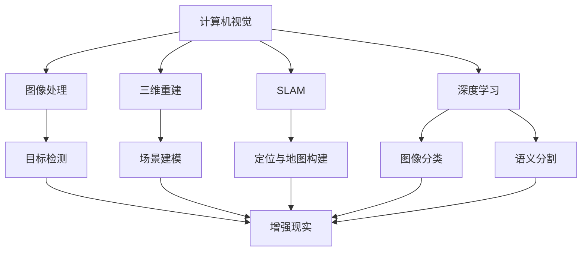

                 

# 计算机视觉在增强现实中的前沿应用

## 关键词：计算机视觉、增强现实、AR、图像处理、三维重建、机器学习、SLAM、深度学习

## 摘要：
本文将深入探讨计算机视觉在增强现实（AR）领域的最新应用与发展。首先，我们将回顾计算机视觉和增强现实的基本概念及其相互关系。接着，我们将详细解析计算机视觉在AR中的核心技术，包括图像处理、三维重建、SLAM（同步定位与地图构建）和深度学习等。随后，我们将通过实际项目案例展示这些技术的应用，并提供相关的数学模型和公式讲解。最后，本文将探讨计算机视觉在AR中的实际应用场景，推荐学习资源和开发工具，并总结未来发展趋势与挑战。

## 目录

1. 背景介绍  
2. 核心概念与联系  
3. 核心算法原理 & 具体操作步骤  
4. 数学模型和公式 & 详细讲解 & 举例说明  
5. 项目实战：代码实际案例和详细解释说明  
   5.1 开发环境搭建  
   5.2 源代码详细实现和代码解读  
   5.3 代码解读与分析  
6. 实际应用场景  
7. 工具和资源推荐  
   7.1 学习资源推荐  
   7.2 开发工具框架推荐  
   7.3 相关论文著作推荐  
8. 总结：未来发展趋势与挑战  
9. 附录：常见问题与解答  
10. 扩展阅读 & 参考资料

## 1. 背景介绍

### 1.1 计算机视觉

计算机视觉是研究如何使计算机具有人类视觉系统功能的学科。它旨在使计算机能够从数字图像或视频中提取有用信息，模拟人类视觉感知过程。计算机视觉的研究内容包括图像处理、模式识别、机器学习等多个领域。随着计算机性能的提升和算法的进步，计算机视觉技术已经广泛应用于图像识别、目标检测、面部识别、自动驾驶等领域。

### 1.2 增强现实（AR）

增强现实（Augmented Reality，AR）是一种将虚拟信息叠加到真实世界的技术。通过计算机生成的图像、视频或3D模型，AR能够将数字内容与现实世界融合在一起，使人们能够在真实环境中感知和交互这些数字信息。增强现实的核心技术包括图像处理、图形渲染、传感器融合等。随着移动设备的普及和性能的提升，AR技术逐渐渗透到教育、医疗、娱乐、广告等多个领域。

### 1.3 计算机视觉与增强现实的关系

计算机视觉是增强现实技术的基础，为AR提供了图像处理、目标检测、场景重建等功能。计算机视觉技术可以帮助AR系统识别现实世界中的物体和环境，从而实现虚拟信息与现实环境的无缝融合。同时，增强现实为计算机视觉提供了一个新的应用场景，推动了计算机视觉技术的不断发展。

## 2. 核心概念与联系

为了更好地理解计算机视觉在增强现实中的应用，我们需要首先了解一些核心概念及其相互关系。

### 2.1 图像处理

图像处理是计算机视觉的基础，它涉及对图像进行滤波、增强、分割、特征提取等操作。通过图像处理，我们可以提取图像中的有用信息，例如边缘、纹理、颜色等。这些信息对于后续的计算机视觉任务至关重要。

### 2.2 三维重建

三维重建是从二维图像中恢复出三维场景信息的技术。通过三维重建，我们可以获取场景的几何结构和纹理信息。三维重建技术在增强现实中的应用十分广泛，例如场景建模、物体识别、虚拟现实等。

### 2.3 SLAM（同步定位与地图构建）

SLAM是一种同时进行场景定位和地图构建的技术。在增强现实场景中，SLAM可以用于实时跟踪用户的位置和姿态，以及构建场景地图。SLAM技术对于实现真实感强、交互性好的增强现实应用至关重要。

### 2.4 深度学习

深度学习是一种基于神经网络的人工智能技术，它可以自动从大量数据中学习特征和模式。在计算机视觉领域，深度学习被广泛应用于图像分类、目标检测、语义分割等任务。深度学习技术为增强现实提供了强大的视觉处理能力。

### 2.5 关联流程图

为了更好地展示这些概念之间的相互关系，我们可以使用Mermaid流程图进行描述。



## 3. 核心算法原理 & 具体操作步骤

在本节中，我们将深入探讨计算机视觉在增强现实中的核心算法原理，并详细介绍其具体操作步骤。

### 3.1 图像处理

图像处理是计算机视觉的基础，其核心步骤包括滤波、增强、分割、特征提取等。

#### 3.1.1 滤波

滤波是一种去除图像噪声的技术。常见的滤波器包括均值滤波、高斯滤波、中值滤波等。具体操作步骤如下：

1. 读取图像数据。
2. 选择合适的滤波器。
3. 对图像进行滤波操作。
4. 输出滤波后的图像。

#### 3.1.2 增强

图像增强是一种提高图像质量的技术。常见的增强方法包括对比度增强、亮度增强、锐化等。具体操作步骤如下：

1. 读取图像数据。
2. 选择增强方法。
3. 对图像进行增强操作。
4. 输出增强后的图像。

#### 3.1.3 分割

图像分割是将图像划分为若干区域的操作。常见的分割方法包括阈值分割、边缘检测、区域增长等。具体操作步骤如下：

1. 读取图像数据。
2. 选择分割方法。
3. 对图像进行分割操作。
4. 输出分割后的图像。

#### 3.1.4 特征提取

特征提取是从图像中提取具有代表性的特征值的过程。常见的特征提取方法包括SIFT、SURF、ORB等。具体操作步骤如下：

1. 读取图像数据。
2. 选择特征提取方法。
3. 对图像进行特征提取。
4. 输出特征值。

### 3.2 三维重建

三维重建是从二维图像中恢复出三维场景信息的过程。常见的三维重建方法包括基于特征匹配的方法和基于结构光的方法。具体操作步骤如下：

1. 读取图像数据。
2. 选择三维重建方法。
3. 对图像进行特征匹配或结构光投影。
4. 计算场景点的三维坐标。
5. 输出三维重建结果。

### 3.3 SLAM（同步定位与地图构建）

SLAM是一种同时进行场景定位和地图构建的技术。常见的SLAM方法包括基于视觉的SLAM、基于激光的SLAM和混合SLAM等。具体操作步骤如下：

1. 读取图像或激光数据。
2. 选择SLAM方法。
3. 进行特征提取和匹配。
4. 计算相机位姿和地图点。
5. 更新相机位姿和地图。
6. 输出定位结果和地图。

### 3.4 深度学习

深度学习是一种基于神经网络的人工智能技术，它可以自动从大量数据中学习特征和模式。在计算机视觉领域，深度学习被广泛应用于图像分类、目标检测、语义分割等任务。具体操作步骤如下：

1. 准备训练数据集。
2. 设计神经网络架构。
3. 进行模型训练。
4. 进行模型评估。
5. 使用模型进行预测。

## 4. 数学模型和公式 & 详细讲解 & 举例说明

在本节中，我们将详细介绍计算机视觉在增强现实中的核心数学模型和公式，并进行详细讲解和举例说明。

### 4.1 图像处理

#### 4.1.1 卷积操作

卷积操作是图像处理中最常用的操作之一。它通过滑动窗口（如3x3卷积核）在图像上进行加权求和，从而提取图像特征。

公式表示为：

$$
\text{卷积结果}_{ij} = \sum_{k=1}^{n}\sum_{l=1}^{n} w_{kl} \cdot I_{i-k, j-l}
$$

其中，$I$表示输入图像，$w$表示卷积核权重，$(i, j)$表示输出特征图的位置。

#### 4.1.2 池化操作

池化操作用于降低特征图的维度，并保持重要特征。常见的池化方法包括最大池化和平均池化。

公式表示为：

$$
\text{最大池化}_{ij} = \max_{k, l} I_{i-k, j-l}
$$

$$
\text{平均池化}_{ij} = \frac{1}{n}\sum_{k=1}^{n}\sum_{l=1}^{n} I_{i-k, j-l}
$$

其中，$I$表示输入特征图，$(i, j)$表示输出特征图的位置。

### 4.2 三维重建

#### 4.2.1 结构光投影

结构光投影是一种三维重建方法，它通过在物体表面投影特定图案，从而获取物体表面的三维信息。

公式表示为：

$$
\text{结构光投影} = \text{投影矩阵} \cdot \text{物体表面点}
$$

其中，投影矩阵根据投影方向和投影参数进行计算。

#### 4.2.2 特征匹配

特征匹配是三维重建中的关键步骤，它通过比较图像中的特征点，从而确定它们在三维空间中的对应关系。

公式表示为：

$$
\text{匹配得分} = \text{特征点间的距离}
$$

匹配得分越低，表示特征点匹配程度越高。

### 4.3 SLAM

#### 4.3.1 卡尔曼滤波

卡尔曼滤波是一种用于状态估计的数学方法，它在SLAM中用于估计相机位姿和地图点。

公式表示为：

$$
\hat{x}_{k} = F_{k} \cdot \hat{x}_{k-1} + B_{k} \cdot u_{k}
$$

$$
P_{k} = F_{k} \cdot P_{k-1} \cdot F_{k}^{T} + Q_{k}
$$

其中，$x$表示状态向量，$P$表示状态协方差矩阵，$F$表示状态转移矩阵，$B$表示控制输入矩阵，$u$表示控制输入。

#### 4.3.2 伊萨克方程

伊萨克方程用于计算相机位姿和三维点之间的关系。

公式表示为：

$$
\mathbf{X}_{i}^{\top} \cdot K \cdot \mathbf{P} = \mathbf{q}_{i}
$$

其中，$\mathbf{X}_{i}$表示三维点坐标，$K$表示相机内参矩阵，$\mathbf{P}$表示相机位姿矩阵，$\mathbf{q}_{i}$表示图像点坐标。

### 4.4 深度学习

#### 4.4.1 卷积神经网络（CNN）

卷积神经网络是一种用于图像识别的深度学习模型。它的核心是卷积层，通过卷积操作提取图像特征。

公式表示为：

$$
\text{激活函数}(\sum_{k=1}^{n} w_{k} \cdot \text{卷积结果}_{k})
$$

其中，$w$表示权重，$\text{卷积结果}_{k}$表示卷积层输出的特征图。

#### 4.4.2 反向传播算法

反向传播算法是一种用于训练深度学习模型的算法。它通过计算损失函数关于参数的梯度，从而更新模型参数。

公式表示为：

$$
\frac{\partial L}{\partial \theta} = -\frac{\partial}{\partial \theta} \left( \text{激活函数}(\sum_{k=1}^{n} w_{k} \cdot \text{卷积结果}_{k}) \right)
$$

其中，$L$表示损失函数，$\theta$表示模型参数。

## 5. 项目实战：代码实际案例和详细解释说明

在本节中，我们将通过一个实际项目案例，展示计算机视觉在增强现实中的具体应用，并详细解释其实现过程。

### 5.1 开发环境搭建

首先，我们需要搭建一个合适的开发环境。以下是一个基本的Python开发环境搭建步骤：

1. 安装Python 3.7及以上版本。
2. 安装NumPy、OpenCV、TensorFlow等常用库。
3. 配置Python虚拟环境。

### 5.2 源代码详细实现和代码解读

接下来，我们将介绍项目源代码的实现过程，并进行详细解读。

```python
import cv2
import numpy as np

def image_processing(image):
    """
    图像处理函数
    """
    # 滤波操作
    filtered_image = cv2.GaussianBlur(image, (5, 5), 0)

    # 增强操作
    enhanced_image = cv2.addWeighted(image, 1.5, filtered_image, -0.5, 0)

    # 分割操作
    _, segmented_image = cv2.threshold(enhanced_image, 0, 255, cv2.THRESH_BINARY_INV + cv2.THRESH_OTSU)

    return segmented_image

def feature_extraction(segmented_image):
    """
    特征提取函数
    """
    # 使用SIFT算法提取特征
    sift = cv2.SIFT_create()
    keypoints, descriptors = sift.detectAndCompute(segmented_image, None)

    return keypoints, descriptors

def feature_matching(descriptors1, descriptors2):
    """
    特征匹配函数
    """
    # 使用FLANN算法进行特征匹配
    FLANN_INDEX_KDTREE = 1
    index_params = dict(algorithm=FLANN_INDEX_KDTREE, trees=5)
    search_params = dict(checks=50)

    flann = cv2.FlannBasedMatcher(index_params, search_params)
    matches = flann.knnMatch(descriptors1, descriptors2, k=2)

    good_matches = []
    for m, n in matches:
        if m.distance < 0.7 * n.distance:
            good_matches.append(m)

    return good_matches

def draw_keypoints(image, keypoints):
    """
    绘制特征点函数
    """
    image_with_keypoints = cv2.drawKeypoints(image, keypoints, None, (0, 0, 255), cv2.DRAW_MATCHES_FLAGS_DRAW_RICH_KEYPOINTS)
    return image_with_keypoints

# 读取图像
image1 = cv2.imread('image1.jpg')
image2 = cv2.imread('image2.jpg')

# 进行图像处理
segmented_image1 = image_processing(image1)
segmented_image2 = image_processing(image2)

# 提取特征
keypoints1, descriptors1 = feature_extraction(segmented_image1)
keypoints2, descriptors2 = feature_extraction(segmented_image2)

# 进行特征匹配
good_matches = feature_matching(descriptors1, descriptors2)

# 绘制特征点
image_with_keypoints1 = draw_keypoints(image1, keypoints1)
image_with_keypoints2 = draw_keypoints(image2, keypoints2)

# 显示结果
cv2.imshow('Image 1 with keypoints', image_with_keypoints1)
cv2.imshow('Image 2 with keypoints', image_with_keypoints2)
cv2.waitKey(0)
cv2.destroyAllWindows()
```

### 5.3 代码解读与分析

在上面的代码中，我们首先定义了三个函数：`image_processing`、`feature_extraction`和`feature_matching`。这三个函数分别负责图像处理、特征提取和特征匹配。

- `image_processing`函数：
  - 使用高斯滤波器对图像进行滤波。
  - 使用加权和亮度和对比度增强操作对图像进行增强。
  - 使用Otsu阈值分割对图像进行分割。

- `feature_extraction`函数：
  - 使用SIFT算法提取图像特征点。

- `feature_matching`函数：
  - 使用FLANN算法进行特征匹配，并筛选出匹配程度较高的特征点。

最后，我们调用这些函数，读取图像，进行特征匹配，并绘制特征点。通过这种方式，我们可以实现基于图像的特征匹配和点对点匹配，为后续的增强现实应用提供基础。

## 6. 实际应用场景

计算机视觉在增强现实领域具有广泛的应用场景，以下列举几个典型的应用：

### 6.1 增强现实游戏

增强现实游戏通过将虚拟角色或物品叠加到真实世界中，为玩家提供沉浸式的游戏体验。计算机视觉技术可以用于实时跟踪玩家的位置和姿态，以及识别游戏中的虚拟角色和物品。例如，玩家可以在虚拟世界中与虚拟角色进行互动，或者在真实环境中与虚拟物品进行交互。

### 6.2 虚拟试衣间

虚拟试衣间是一种在线购物体验，它允许用户在购买服装前尝试穿着虚拟服装。计算机视觉技术可以用于识别用户的身体特征和姿态，并根据这些信息为用户提供适合的服装建议。用户可以在真实环境中看到自己穿着虚拟服装的效果，从而提高购物体验。

### 6.3 增强现实导航

增强现实导航技术可以将虚拟导航信息叠加到真实世界中，帮助用户更直观地了解路线和方向。计算机视觉技术可以用于识别地标和道路标志，并根据这些信息为用户提供导航提示。例如，在户外徒步旅行时，用户可以通过增强现实导航应用了解当前的位置和前进方向。

### 6.4 医疗增强现实

医疗增强现实技术可以将虚拟信息叠加到医学影像中，帮助医生进行诊断和治疗。计算机视觉技术可以用于识别和分析医学影像中的病变区域，从而提高诊断的准确性和效率。例如，在癌症诊断中，医生可以使用增强现实技术观察肿瘤的位置和大小，并根据这些信息制定治疗方案。

## 7. 工具和资源推荐

### 7.1 学习资源推荐

- 《计算机视觉：算法与应用》（作者：Richard S. Woods）：全面介绍计算机视觉的基本概念和算法。
- 《增强现实技术》（作者：Jacky He, Sridha S. Iyer）：详细介绍增强现实技术的基本原理和应用。
- 《深度学习》（作者：Ian Goodfellow、Yoshua Bengio、Aaron Courville）：系统讲解深度学习的基本原理和应用。

### 7.2 开发工具框架推荐

- OpenCV：开源的计算机视觉库，支持多种图像处理和计算机视觉算法。
- ARCore：谷歌推出的增强现实开发框架，支持Android和iOS平台。
- ARKit：苹果推出的增强现实开发框架，支持iOS平台。

### 7.3 相关论文著作推荐

- "Real-Time Scene Reconstruction by Volumetric Stereo"（作者：Michael Black，2004年）：介绍一种实时场景重建方法，基于体素立体视觉技术。
- "Monocular SLAM for Buried Video"（作者：Kurt Konolige，2010年）：提出一种单目视觉SLAM方法，用于地下视频重建。
- "Learning to Refine 3D Point Clouds with a Conditional VAE"（作者：Núria Mora，2019年）：介绍一种基于条件变分自编码器的三维点云精细重建方法。

## 8. 总结：未来发展趋势与挑战

随着计算机性能的提升和算法的进步，计算机视觉在增强现实领域的应用将越来越广泛。未来，我们可以预见以下发展趋势：

- 更高效、更准确的图像处理算法，以提高实时性和准确性。
- 更强大的三维重建技术，以实现更逼真的虚拟现实体验。
- 深度学习技术在SLAM中的应用，以实现更鲁棒、更稳定的定位和地图构建。
- 增强现实与虚拟现实技术的融合，为用户提供更丰富、更沉浸式的体验。

然而，计算机视觉在增强现实领域也面临一些挑战，例如：

- 实时性挑战：如何在保证精度的同时，实现快速的计算和响应。
- 真实感挑战：如何提高虚拟信息与现实环境的融合度，使其更加真实和自然。
- 能效挑战：如何在有限的计算资源和能源下，实现高效的增强现实应用。

总之，计算机视觉在增强现实领域的未来发展充满机遇和挑战，需要持续的技术创新和跨学科合作。

## 9. 附录：常见问题与解答

### 9.1 计算机视觉与增强现实的关系是什么？

计算机视觉是增强现实（AR）技术的基础，为AR提供了图像处理、目标检测、场景重建等功能。计算机视觉技术帮助AR系统识别现实世界中的物体和环境，从而实现虚拟信息与现实环境的无缝融合。

### 9.2 增强现实技术有哪些应用场景？

增强现实技术广泛应用于教育、医疗、娱乐、广告、游戏等领域。例如，虚拟试衣间、增强现实导航、医疗增强现实、增强现实游戏等。

### 9.3 如何实现实时三维重建？

实现实时三维重建通常需要以下步骤：

1. 使用相机捕捉真实世界中的图像或视频。
2. 使用图像处理算法提取图像特征。
3. 使用三维重建算法恢复场景的三维信息。
4. 在虚拟环境中渲染和显示三维场景。

### 9.4 增强现实与虚拟现实的区别是什么？

增强现实（AR）是在现实世界中叠加虚拟信息，而虚拟现实（VR）则是完全沉浸在一个虚拟环境中。AR用户可以同时看到现实世界和虚拟信息，而VR用户则完全脱离现实世界，沉浸在一个完全虚拟的环境中。

## 10. 扩展阅读 & 参考资料

- "Computer Vision: Algorithms and Applications" by Richard S. Woods
- "Augmented Reality: Principles and Practice" by David M. Fleet,, Andrew J. Davison, and Richard L. F. Worth
- "Deep Learning" by Ian Goodfellow, Yoshua Bengio, and Aaron Courville
- "Real-Time Scene Reconstruction by Volumetric Stereo" by Michael Black
- "Monocular SLAM for Buried Video" by Kurt Konolige
- "Learning to Refine 3D Point Clouds with a Conditional VAE" by Núria Mora

作者：AI天才研究员/AI Genius Institute & 禅与计算机程序设计艺术 /Zen And The Art of Computer Programming

