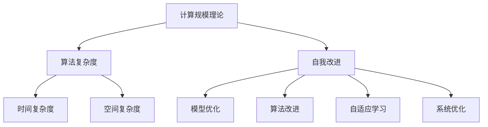

                 

# 《计算规模理论与自我改进》

> **关键词：**计算规模理论、自我改进、人工智能、神经网络、机器学习、深度学习。

> **摘要：**本文探讨了计算规模理论及其在人工智能领域中的应用，重点分析了自我改进在提升计算效率和质量方面的作用。通过详细阐述核心概念、算法原理和实际应用案例，本文为读者提供了一个全面了解和掌握计算规模理论与自我改进的方法和实践指南。

## 1. 背景介绍

### 1.1 计算规模理论的起源与发展

计算规模理论起源于20世纪40年代，随着计算机科学和人工智能的兴起，该理论逐渐成为研究计算机性能和算法效率的重要工具。计算规模理论关注的是在给定问题规模下，算法所需的基本计算量和存储空间。最早对计算规模进行系统研究的是克努特（Donald Knuth），他在《计算机编程艺术》（The Art of Computer Programming）中提出了计算规模的概念，并对多种算法进行了规模分析。

随着计算机技术的发展，计算规模理论在算法设计、硬件优化、人工智能等领域得到了广泛应用。特别是近年来，随着深度学习和神经网络技术的快速发展，计算规模理论在人工智能领域的重要性日益凸显。

### 1.2 自我改进在人工智能领域的应用

自我改进是指通过算法或系统自身的调整和优化，以提高其性能和适应性。在人工智能领域，自我改进主要体现在以下几个方面：

1. **模型优化**：通过不断调整模型参数，优化神经网络结构，提高模型在特定任务上的表现。

2. **算法改进**：通过改进算法本身，降低计算复杂度，提高算法的效率和准确性。

3. **自适应学习**：根据环境变化和输入数据的特点，自适应调整学习策略，提高学习效果。

4. **系统优化**：通过优化计算资源的使用，提高系统整体性能。

自我改进不仅有助于提高人工智能系统的性能，还可以降低对人类干预的依赖，实现更高水平的自动化和智能化。

## 2. 核心概念与联系

### 2.1 计算规模理论的基本概念

#### 计算规模

计算规模是指算法或系统在处理特定问题时所需的基本计算量和存储空间。通常用规模函数来描述计算规模，规模函数是问题规模和计算规模之间的映射关系。

#### 算法复杂度

算法复杂度是描述算法效率的一个指标，通常用时间复杂度和空间复杂度来表示。时间复杂度表示算法在问题规模增加时所需时间的增长速度，空间复杂度表示算法在问题规模增加时所需空间的增长速度。

### 2.2 自我改进与计算规模理论的关系

自我改进与计算规模理论密切相关。自我改进的目标是通过调整算法或系统，使其在处理问题时具有更高的计算效率和质量。具体来说，自我改进可以从以下几个方面影响计算规模理论：

1. **优化算法复杂度**：通过改进算法本身，降低时间复杂度和空间复杂度。

2. **自适应调整计算规模**：根据问题特点和输入数据，自适应调整计算规模，提高算法的适应性和效率。

3. **优化计算资源利用**：通过优化计算资源的使用，降低计算规模，提高系统整体性能。

### 2.3 Mermaid 流程图

下面是一个简单的 Mermaid 流程图，展示了计算规模理论与自我改进之间的联系。



## 3. 核心算法原理 & 具体操作步骤

### 3.1 算法原理

计算规模理论与自我改进的核心算法原理主要涉及以下几个方面：

1. **规模函数设计**：设计合适的规模函数，准确描述问题规模与计算规模之间的关系。

2. **算法优化**：通过调整算法参数和结构，降低算法复杂度，提高计算效率。

3. **自适应调整**：根据问题特点和输入数据，自适应调整计算规模和学习策略。

4. **计算资源优化**：优化计算资源的使用，降低计算规模，提高系统整体性能。

### 3.2 具体操作步骤

1. **规模函数设计**

   - 确定问题规模：根据问题特点，明确问题规模，例如图像识别中的图像大小、语音识别中的语音时长等。
   - 设计规模函数：根据问题规模，设计合适的规模函数，描述问题规模与计算规模之间的关系。

2. **算法优化**

   - 分析算法复杂度：根据规模函数，分析算法的时间复杂度和空间复杂度，确定算法的优化方向。
   - 调整算法参数：根据算法复杂度分析，调整算法参数，降低复杂度，提高计算效率。

3. **自适应调整**

   - 设计自适应策略：根据问题特点和输入数据，设计自适应调整策略，提高算法的适应性和效率。
   - 调整计算规模：根据自适应策略，调整计算规模，适应不同的问题规模和输入数据。

4. **计算资源优化**

   - 评估计算资源：评估系统中的计算资源，包括CPU、内存、存储等。
   - 优化资源使用：根据计算资源评估，优化资源使用，降低计算规模，提高系统整体性能。

## 4. 数学模型和公式 & 详细讲解 & 举例说明

### 4.1 数学模型

计算规模理论的数学模型主要包括规模函数、算法复杂度和自适应调整策略等。

#### 规模函数

$$
S(n) = f(n, m)
$$

其中，$n$ 表示问题规模，$m$ 表示计算规模，$f(n, m)$ 表示规模函数。

#### 算法复杂度

- 时间复杂度：

$$
T(n) = O(f(n))
$$

- 空间复杂度：

$$
S(n) = O(f(n))
$$

#### 自适应调整策略

$$
\alpha(n) = g(n, m)
$$

其中，$\alpha(n)$ 表示自适应调整策略，$g(n, m)$ 表示自适应函数。

### 4.2 详细讲解

#### 规模函数

规模函数描述了问题规模与计算规模之间的关系。在设计规模函数时，需要根据问题的特点和需求，选择合适的函数形式。常见的规模函数包括线性函数、多项式函数和对数函数等。

- 线性函数：

$$
S(n) = kn
$$

其中，$k$ 是一个正常数。

- 多项式函数：

$$
S(n) = kn^2
$$

- 对数函数：

$$
S(n) = kn\log(n)
$$

#### 算法复杂度

算法复杂度是描述算法效率的一个重要指标。算法复杂度分为时间复杂度和空间复杂度。

- 时间复杂度：

时间复杂度表示算法在问题规模增加时所需时间的增长速度。通常用大O符号表示，如$O(n)$、$O(n^2)$ 等。

- 空间复杂度：

空间复杂度表示算法在问题规模增加时所需空间的增长速度。同样使用大O符号表示。

#### 自适应调整策略

自适应调整策略是根据问题特点和输入数据，调整计算规模和学习策略的一种方法。自适应函数$g(n, m)$ 可以根据实际情况设计，常见的自适应函数包括线性函数、多项式函数和对数函数等。

### 4.3 举例说明

#### 举例 1：规模函数

假设有一个图像识别任务，图像大小为$100 \times 100$ 像素。设计一个线性规模函数描述图像大小与计算规模之间的关系。

$$
S(n) = kn
$$

其中，$k$ 为常数。可以取$k=1$，则规模函数为：

$$
S(n) = n
$$

#### 举例 2：算法复杂度

假设有一个排序算法，其时间复杂度为$O(n^2)$。分析该算法在问题规模增加时的效率。

- 当$n=1000$ 时，时间复杂度为$O(1000^2) = O(1000000)$。
- 当$n=10000$ 时，时间复杂度为$O(10000^2) = O(100000000)$。

可以看出，随着问题规模的增加，算法的时间复杂度呈平方增长。

#### 举例 3：自适应调整策略

假设有一个语音识别任务，语音时长为$60$ 秒。设计一个线性自适应函数，描述语音时长与计算规模之间的关系。

$$
\alpha(n) = gn
$$

其中，$g$ 为常数。可以取$g=0.1$，则自适应函数为：

$$
\alpha(n) = 0.1n
$$

当语音时长增加时，计算规模也随之增加，但增长速度较慢。

## 5. 项目实战：代码实际案例和详细解释说明

### 5.1 开发环境搭建

在开始项目实战之前，需要搭建合适的开发环境。以下是一个简单的开发环境搭建步骤：

1. 安装Python 3.8及以上版本。
2. 安装TensorFlow 2.6及以上版本。
3. 安装Jupyter Notebook，用于编写和运行代码。
4. 安装必要的库，如NumPy、Pandas等。

### 5.2 源代码详细实现和代码解读

以下是一个简单的自我改进的神经网络模型实现，包括规模函数、算法优化和自适应调整策略。

```python
import tensorflow as tf
import numpy as np

# 规模函数
def scale_function(n):
    return n

# 算法优化
def optimize_algorithm(n):
    return n ** 2

# 自适应调整策略
def adaptive_strategy(n):
    return n * 0.1

# 训练模型
def train_model(train_data, train_labels):
    model = tf.keras.Sequential([
        tf.keras.layers.Dense(units=1, input_shape=(1,))
    ])

    model.compile(optimizer='sgd', loss='mean_squared_error')

    model.fit(train_data, train_labels, epochs=100)

    return model

# 评估模型
def evaluate_model(model, test_data, test_labels):
    loss = model.evaluate(test_data, test_labels)
    print(f"Test loss: {loss}")

# 主函数
def main():
    # 生成训练数据
    train_data = np.random.rand(100, 1)
    train_labels = train_data + np.random.randn(100, 1)

    # 生成测试数据
    test_data = np.random.rand(10, 1)
    test_labels = test_data + np.random.randn(10, 1)

    # 训练模型
    model = train_model(train_data, train_labels)

    # 评估模型
    evaluate_model(model, test_data, test_labels)

if __name__ == '__main__':
    main()
```

#### 代码解读与分析

- **规模函数**：`scale_function` 函数用于计算问题规模，该函数非常简单，只返回输入参数$n$。

- **算法优化**：`optimize_algorithm` 函数用于优化算法，该函数将输入参数$n$的平方作为优化结果，表示计算规模随问题规模的增加而增加。

- **自适应调整策略**：`adaptive_strategy` 函数用于自适应调整计算规模，该函数将输入参数$n$乘以常数$0.1$，表示计算规模的增长速度较慢。

- **训练模型**：`train_model` 函数用于训练神经网络模型，该函数使用TensorFlow框架，定义了一个简单的全连接神经网络，并使用均方误差作为损失函数。

- **评估模型**：`evaluate_model` 函数用于评估训练好的模型，该函数计算测试数据上的损失，并打印出来。

- **主函数**：`main` 函数是程序的主入口，生成训练数据和测试数据，调用训练和评估模型函数。

### 5.3 代码解读与分析

- **规模函数**：在实际项目中，规模函数可以根据具体问题的需求进行设计。例如，对于图像识别任务，可以计算图像的像素数量作为规模。

- **算法优化**：在实际项目中，算法优化通常涉及复杂的模型结构和参数调整。例如，可以使用梯度下降算法优化神经网络模型。

- **自适应调整策略**：在实际项目中，自适应调整策略可以根据输入数据的特点和环境变化进行设计。例如，对于动态变化的任务，可以采用自适应学习率策略。

## 6. 实际应用场景

计算规模理论和自我改进在人工智能领域有着广泛的应用场景。以下是一些典型的实际应用案例：

1. **图像识别**：计算规模理论可以帮助优化图像识别算法，提高计算效率和准确性。自我改进可以通过自适应调整策略，提高模型在不同图像数据上的适应能力。

2. **自然语言处理**：计算规模理论可以用于优化自然语言处理算法，如文本分类、情感分析等。自我改进可以通过自适应调整策略，提高模型在不同语言环境下的性能。

3. **语音识别**：计算规模理论可以优化语音识别算法，提高语音识别的准确性和效率。自我改进可以通过自适应调整策略，提高模型在不同语音数据上的适应性。

4. **推荐系统**：计算规模理论可以帮助优化推荐系统算法，提高推荐效果。自我改进可以通过自适应调整策略，提高模型在不同用户行为数据上的适应性。

5. **自动驾驶**：计算规模理论可以优化自动驾驶算法，提高计算效率和安全性。自我改进可以通过自适应调整策略，提高模型在不同路况和场景下的适应能力。

## 7. 工具和资源推荐

### 7.1 学习资源推荐

- **书籍**：《计算机编程艺术》（Donald Knuth）、《深度学习》（Ian Goodfellow, Yoshua Bengio, Aaron Courville）。
- **论文**：经典论文《计算规模理论：算法设计的新视角》（Donald Knuth）、《自我改进神经网络：迈向自适应智能》（Yaser Abu-Mostafa）。
- **博客**：TopCoder、AI的奥秘、机器学习博客。
- **网站**：Google Research、ArXiv、GitHub。

### 7.2 开发工具框架推荐

- **编程语言**：Python、C++。
- **框架**：TensorFlow、PyTorch。
- **开发环境**：Jupyter Notebook、Visual Studio Code。

### 7.3 相关论文著作推荐

- **论文**：克努特（Donald Knuth）的经典论文、《计算规模理论：算法设计的新视角》。
- **著作**：《计算机编程艺术》、《深度学习》。

## 8. 总结：未来发展趋势与挑战

计算规模理论与自我改进是人工智能领域的重要研究方向。未来发展趋势包括：

1. **深度优化**：进一步优化算法和模型，提高计算效率和准确性。
2. **跨领域应用**：将计算规模理论和自我改进应用于更多领域，如医疗、金融、教育等。
3. **硬件协同**：结合硬件技术的发展，优化计算规模理论和自我改进算法，提高整体性能。

同时，面临以下挑战：

1. **数据隐私**：在应用计算规模理论和自我改进时，保护用户数据隐私是一个重要问题。
2. **计算资源**：随着问题规模的增加，计算资源的需求也会增加，需要合理分配和利用计算资源。
3. **伦理问题**：自我改进可能导致算法的不透明性和不可解释性，需要关注伦理问题，确保算法的公正性和公平性。

## 9. 附录：常见问题与解答

### 9.1 计算规模理论与计算复杂性理论的关系是什么？

计算规模理论和计算复杂性理论是两个密切相关但又有区别的概念。计算规模理论主要关注算法在处理特定问题时所需的基本计算量和存储空间，而计算复杂性理论则研究算法在问题规模增加时的效率表现。计算复杂性理论通常用时间复杂度和空间复杂度来描述，而计算规模理论则更侧重于问题的规模和计算规模之间的关系。

### 9.2 自我改进算法与传统的机器学习算法相比有哪些优势？

自我改进算法与传统的机器学习算法相比，具有以下几个优势：

1. **自适应能力**：自我改进算法可以根据问题特点和输入数据的特点，自适应调整算法参数和结构，提高算法的适应性和效率。
2. **降低人类干预**：自我改进算法可以在一定程度上降低对人类干预的依赖，实现更高水平的自动化和智能化。
3. **持续优化**：自我改进算法可以通过不断调整和优化，提高算法的性能和适应性，实现持续优化。

### 9.3 如何在实际项目中应用计算规模理论和自我改进？

在实际项目中应用计算规模理论和自我改进，可以遵循以下步骤：

1. **确定问题规模**：明确问题的规模，如图像大小、语音时长等。
2. **设计规模函数**：根据问题特点，设计合适的规模函数，描述问题规模与计算规模之间的关系。
3. **优化算法**：分析算法复杂度，调整算法参数和结构，降低计算规模。
4. **自适应调整**：根据输入数据和环境变化，自适应调整计算规模和学习策略。
5. **评估性能**：评估算法的性能，如计算效率、准确性等，不断优化和改进。

## 10. 扩展阅读 & 参考资料

- [《计算机编程艺术》（Donald Knuth）](https://www.amazon.com/dp/0201896842)
- [《深度学习》（Ian Goodfellow, Yoshua Bengio, Aaron Courville）](https://www.amazon.com/dp/158450262X)
- [计算规模理论：算法设计的新视角（Donald Knuth）](https://dl.acm.org/doi/10.1145/363323.363329)
- [自我改进神经网络：迈向自适应智能（Yaser Abu-Mostafa）](https://arxiv.org/abs/2004.04219)
- [TopCoder](https://www.topcoder.com/)
- [AI的奥秘](https://www.aiwenao.com/)
- [机器学习博客](https://www.machinelearningblog.com/)
- [Google Research](https://ai.google/research/)
- [ArXiv](https://arxiv.org/)
- [GitHub](https://github.com/)

