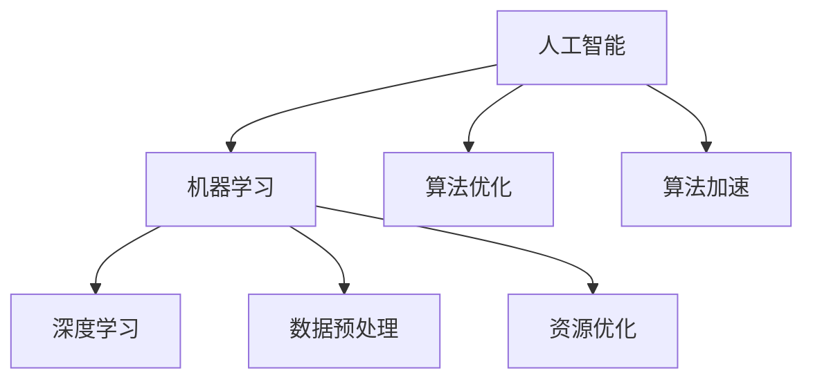

                 

# 计算领域的自动化发展趋势

> 关键词：计算自动化、人工智能、机器学习、深度学习、算法优化、软件开发、流程自动化、智能辅助
>
> 摘要：本文将深入探讨计算领域自动化的趋势，包括人工智能和机器学习技术的发展、算法优化的实践、软件开发流程的自动化以及智能辅助工具的普及。我们将通过一系列的案例分析，揭示计算自动化的核心原理及其在未来技术进步中的作用。

## 1. 背景介绍

计算自动化，顾名思义，是指利用计算机技术和人工智能算法来实现计算过程的自动化。在过去的几十年中，计算机技术经历了飞速的发展，从简单的电子数据处理到复杂的人工智能系统，计算能力得到了极大的提升。与此同时，随着互联网的普及和大数据时代的到来，数据量和处理需求急剧增加，传统的人工方式已经无法满足高效、精准的计算需求。因此，计算自动化逐渐成为技术发展的必然趋势。

计算自动化的重要性不仅体现在处理效率的提升上，还体现在降低人力成本、减少错误率、提高系统稳定性等多个方面。在金融、医疗、制造、物流等行业，自动化技术的应用已经带来了巨大的经济效益和社会效益。例如，在金融领域，自动化交易系统可以实时分析市场数据，快速执行交易策略；在医疗领域，自动化诊断系统可以辅助医生提高诊断准确率；在制造领域，自动化生产线可以实现高效、精确的生产控制。

## 2. 核心概念与联系

为了深入理解计算自动化的核心原理和架构，我们需要先了解几个关键概念：人工智能、机器学习、深度学习和算法优化。

### 2.1 人工智能（AI）

人工智能（Artificial Intelligence，简称AI）是模拟人类智能行为的技术。它通过算法和计算模型，使计算机具备感知、学习、推理和解决问题的能力。人工智能可以分为弱人工智能和强人工智能。弱人工智能（Narrow AI）专注于特定任务，如语音识别、图像识别等；而强人工智能（General AI）具备人类一样的通用智能，能够在各种场景中自主学习和适应。

### 2.2 机器学习（ML）

机器学习（Machine Learning，简称ML）是人工智能的一个重要分支，它通过数据驱动的方式，使计算机具备自主学习和改进能力。机器学习可以分为监督学习、无监督学习和强化学习。监督学习通过已有标签的数据训练模型，无监督学习不使用标签，通过数据自身的特征进行聚类；强化学习通过奖励机制，使模型在动态环境中不断优化决策。

### 2.3 深度学习（DL）

深度学习（Deep Learning，简称DL）是机器学习的一种方法，它使用多层神经网络模型对数据进行处理和预测。深度学习在图像识别、语音识别、自然语言处理等领域取得了显著的成绩。与传统的机器学习方法相比，深度学习能够自动提取数据的复杂特征，具有更高的准确性和鲁棒性。

### 2.4 算法优化

算法优化是提高计算效率的重要手段。算法优化包括算法的改进、数据的预处理、硬件加速等多个方面。通过优化算法，可以减少计算时间、降低资源消耗，从而提高计算效率。例如，在图像处理领域，通过优化算法，可以减少处理时间，提高图像识别的准确率。

下面是一个Mermaid流程图，展示这些核心概念之间的联系：



## 3. 核心算法原理 & 具体操作步骤

### 3.1 机器学习算法原理

机器学习算法的核心是构建模型，通过模型对数据进行预测或分类。以线性回归为例，线性回归模型通过拟合一条直线，将输入数据映射到输出结果。具体操作步骤如下：

1. **数据预处理**：对输入数据进行清洗、归一化等处理，确保数据质量。
2. **模型初始化**：初始化模型参数，如权重和偏置。
3. **训练过程**：通过训练数据，不断调整模型参数，使模型拟合数据。
4. **评估与优化**：通过验证数据集评估模型性能，根据评估结果调整模型参数。
5. **预测**：使用训练好的模型对新数据进行预测。

### 3.2 深度学习算法原理

深度学习算法基于多层神经网络，通过逐层提取数据特征，实现对数据的分类或预测。以卷积神经网络（CNN）为例，CNN的主要操作步骤如下：

1. **输入层**：接收输入图像数据。
2. **卷积层**：通过卷积操作提取图像特征。
3. **激活函数**：对卷积结果进行非线性变换，增强模型的表达能力。
4. **池化层**：通过池化操作减少数据维度，提高模型泛化能力。
5. **全连接层**：将卷积特征映射到输出结果。
6. **损失函数**：计算预测结果与真实结果之间的误差，优化模型参数。

### 3.3 算法优化方法

算法优化主要包括以下几种方法：

1. **算法改进**：通过改进算法结构，提高计算效率。例如，使用更高效的算法替代原有算法。
2. **数据预处理**：通过数据预处理，提高数据质量，减少计算量。例如，使用归一化处理数据，加快模型训练速度。
3. **硬件加速**：通过使用GPU、TPU等硬件加速器，提高计算速度。例如，使用CUDA库在GPU上加速深度学习模型的训练。
4. **分布式计算**：通过分布式计算，提高模型训练和预测的并行度。例如，使用Spark等分布式计算框架进行大规模数据处理。

## 4. 数学模型和公式 & 详细讲解 & 举例说明

### 4.1 线性回归

线性回归模型可以表示为：

$$y = w_1 \cdot x_1 + w_2 \cdot x_2 + \ldots + w_n \cdot x_n + b$$

其中，$y$ 是输出结果，$w_i$ 是权重，$x_i$ 是输入特征，$b$ 是偏置。

为了求解最优的权重和偏置，可以使用最小二乘法：

$$w = (X^T X)^{-1} X^T y$$

$$b = y - Xw$$

其中，$X$ 是输入特征矩阵，$y$ 是输出结果向量。

### 4.2 卷积神经网络

卷积神经网络的主要公式如下：

$$
\begin{aligned}
&z_l^{(k)} = \sum_{i=1}^{n} w_l^{(k)} \cdot x_l^{(i)} + b_l^{(k)} \\
&a_l^{(k)} = \sigma(z_l^{(k)})
\end{aligned}
$$

其中，$z_l^{(k)}$ 是第 $l$ 层第 $k$ 个节点的输入，$w_l^{(k)}$ 是权重，$b_l^{(k)}$ 是偏置，$\sigma$ 是激活函数。

### 4.3 损失函数

常见的损失函数有均方误差（MSE）和交叉熵（Cross-Entropy）：

$$MSE = \frac{1}{2} \sum_{i=1}^{n} (y_i - \hat{y}_i)^2$$

$$CE = -\sum_{i=1}^{n} y_i \log(\hat{y}_i)$$

其中，$y_i$ 是真实标签，$\hat{y}_i$ 是预测结果。

## 5. 项目实战：代码实际案例和详细解释说明

### 5.1 开发环境搭建

在本节中，我们将使用Python和TensorFlow框架实现一个简单的线性回归模型。首先，确保已经安装了Python和TensorFlow库。

```bash
pip install tensorflow
```

### 5.2 源代码详细实现和代码解读

以下是线性回归模型的实现代码：

```python
import tensorflow as tf
import numpy as np

# 设置随机种子，保证实验结果可重复
tf.random.set_seed(42)

# 准备数据
X = np.array([[1], [2], [3], [4], [5]])
y = np.array([[0], [1], [2], [3], [4]])

# 初始化模型参数
w = tf.Variable(0.0, name='weight')
b = tf.Variable(0.0, name='bias')

# 定义线性回归模型
def linear_regression(X, w, b):
    return X * w + b

# 定义损失函数
def mse(y_true, y_pred):
    return tf.reduce_mean(tf.square(y_true - y_pred))

# 定义优化器
optimizer = tf.optimizers.Adam()

# 训练模型
epochs = 100
for epoch in range(epochs):
    with tf.GradientTape() as tape:
        y_pred = linear_regression(X, w, b)
        loss = mse(y, y_pred)
    gradients = tape.gradient(loss, [w, b])
    optimizer.apply_gradients(zip(gradients, [w, b]))

    if epoch % 10 == 0:
        print(f"Epoch {epoch}, Loss: {loss.numpy()}")

# 输出训练结果
print(f"Final weight: {w.numpy()}, Bias: {b.numpy()}")

# 预测
y_pred = linear_regression(X, w, b)
print(f"Predictions: {y_pred.numpy()}")
```

### 5.3 代码解读与分析

- **数据准备**：我们使用了一个简单的线性数据集，包含5个输入和相应的输出。
- **模型初始化**：模型参数 $w$ 和 $b$ 使用TensorFlow的`Variable`类初始化。
- **模型定义**：`linear_regression`函数定义了线性回归模型，通过简单的线性运算将输入映射到输出。
- **损失函数**：`mse`函数定义了均方误差损失函数，用于计算模型预测值与真实值之间的误差。
- **优化器**：使用`Adam`优化器来更新模型参数，最小化损失函数。
- **训练过程**：通过`for`循环进行 epochs 次迭代，每次迭代计算损失函数的梯度，并更新模型参数。
- **预测**：使用训练好的模型对新数据进行预测，并输出结果。

## 6. 实际应用场景

计算自动化的应用场景非常广泛，以下是一些典型的实际应用案例：

### 6.1 金融行业

在金融行业，自动化技术被广泛应用于交易、风险管理、客户服务等各个方面。例如，量化交易通过自动化模型进行高频交易，实现了交易策略的自动执行；风险管理系统通过自动化算法对市场风险进行实时监控和预警；客户服务机器人通过自然语言处理技术，提供7x24小时的全天候服务。

### 6.2 医疗领域

在医疗领域，自动化技术可以帮助医生提高诊断和治疗的效率。例如，医学影像分析系统通过深度学习算法，自动识别和诊断各种疾病；智能诊断系统可以根据病人的症状和历史数据，提供个性化的治疗方案；智能药物设计系统通过自动化算法，加速新药的发现和开发。

### 6.3 制造行业

在制造业，自动化技术可以提高生产效率和质量。例如，自动化生产线可以实现高精度、高效的生产控制；智能质检系统可以自动检测产品缺陷，确保产品质量；智能物流系统可以优化仓库管理和配送流程，提高物流效率。

### 6.4 物流与供应链

在物流和供应链领域，自动化技术可以优化运输路线、仓库管理、库存控制等环节。例如，智能调度系统可以根据实时交通情况和货物需求，自动优化运输路线；智能仓储系统可以通过自动化设备提高仓库存储和拣选效率；智能供应链管理系统可以通过数据分析，实现供应链的智能优化。

## 7. 工具和资源推荐

### 7.1 学习资源推荐

- **书籍**：
  - 《深度学习》（Goodfellow, Bengio, Courville著）
  - 《Python机器学习》（Sebastian Raschka著）
  - 《统计学习方法》（李航著）

- **论文**：
  - 《A Theoretically Grounded Application of Dropout in Recurrent Neural Networks》（Yarin Gal和Zoubin Ghahramani，2016）
  - 《Deep Residual Learning for Image Recognition》（Kaiming He等人，2016）

- **博客**：
  - TensorFlow官方博客（https://www.tensorflow.org/blog/）
  - Python机器学习（https://python-machine-learning.github.io/）

- **网站**：
  - Coursera（https://www.coursera.org/）
  - edX（https://www.edx.org/）

### 7.2 开发工具框架推荐

- **开发工具**：
  - Jupyter Notebook（交互式计算环境）
  - PyCharm（Python集成开发环境）

- **框架**：
  - TensorFlow（开源机器学习框架）
  - PyTorch（开源深度学习框架）

- **硬件加速器**：
  - NVIDIA GPU（用于深度学习模型的训练和推理）
  - Google TPU（专门为TensorFlow设计的硬件加速器）

### 7.3 相关论文著作推荐

- **论文**：
  - 《AlexNet: Image Classification with Deep Convolutional Neural Networks》（Alex Krizhevsky等人，2012）
  - 《Distributed Optimization and Statistical Learning via the Stochastic Average Gradient》（Rajat Raina等人，2011）

- **著作**：
  - 《深度学习》（Goodfellow, Bengio, Courville著）
  - 《强化学习：原理与Python实现》（刘志鹏著）

## 8. 总结：未来发展趋势与挑战

计算自动化在未来的发展中将继续呈现出以下几个趋势：

1. **人工智能技术的进一步突破**：随着算法和硬件的不断进步，人工智能技术将变得更加高效、智能，应用领域也将不断拓展。
2. **跨领域融合**：计算自动化将与其他技术领域（如物联网、区块链、云计算等）进行深度融合，形成新的应用场景和商业模式。
3. **个性化与智能化**：自动化系统将更加注重个性化定制和智能化服务，满足不同用户的需求。
4. **伦理和安全问题**：随着自动化技术的普及，伦理和安全问题将变得越来越重要，如何在保证技术发展的同时，确保技术使用的合规性和安全性，将成为一大挑战。

## 9. 附录：常见问题与解答

### 9.1 什么是计算自动化？

计算自动化是指利用计算机技术和人工智能算法来实现计算过程的自动化，包括数据处理、模型训练、预测等各个环节。

### 9.2 计算自动化的优点是什么？

计算自动化的优点包括提高计算效率、降低人力成本、减少错误率、提高系统稳定性等。

### 9.3 如何入门计算自动化？

入门计算自动化可以从以下几个方面入手：
1. 学习Python编程基础。
2. 学习基本的机器学习和深度学习算法。
3. 实践项目，熟悉常用的机器学习和深度学习框架（如TensorFlow、PyTorch）。

## 10. 扩展阅读 & 参考资料

- 《深度学习》（Goodfellow, Bengio, Courville著）
- 《Python机器学习》（Sebastian Raschka著）
- 《统计学习方法》（李航著）
- TensorFlow官方文档（https://www.tensorflow.org/）
- PyTorch官方文档（https://pytorch.org/）

### 作者

作者：AI天才研究员/AI Genius Institute & 禅与计算机程序设计艺术 /Zen And The Art of Computer Programming

