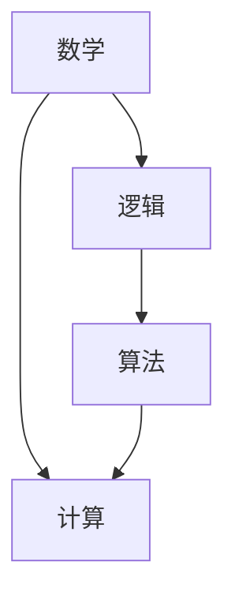

                 

### 背景介绍

在人类文明的漫长历史中，计算一直是一个重要的主题。从古代的结绳计数，到后来的算盘和计算尺，再到现代的计算机，计算技术的发展推动了人类文明的进步。然而，计算的起源可以追溯到更早的时期，甚至比古代的计算工具还要早。在这个背景下，本章将探讨计算的第一位“发明者”——毕达哥拉斯及其弟子们，以及他们所面临的困惑和挑战。

#### 毕达哥拉斯的困惑

毕达哥拉斯（Pythagoras）是古希腊的一位哲学家和数学家，生活在公元前570年至公元前495年左右。他是毕达哥拉斯学派的创始人，这个学派致力于研究数学和自然科学。在毕达哥拉斯学派中，有一个著名的定理被称为“毕达哥拉斯定理”，它描述了一个直角三角形两直角边的平方和等于斜边的平方。这个定理在数学和物理学中有着广泛的应用。

然而，毕达哥拉斯及其弟子们面临的一个问题是：如何解释这个定理？他们发现，在某些情况下，某些数字不能表示为其他数字的平方和。例如，根号2就是一个无法表示为两个整数的平方和的数字。这个发现引发了一系列的哲学和数学上的争论。

#### 芝诺悖论：无穷之辩

芝诺（Zeno）是毕达哥拉斯学派的弟子，他提出了许多关于运动的悖论。其中最著名的是“阿基里斯与乌龟”悖论。在这个悖论中，阿基里斯是一个快速奔跑的运动员，乌龟是一个慢速爬行的动物。如果阿基里斯和乌龟在一条直线上相向而行，乌龟先出发并领先一段距离，那么阿基里斯是否能够追上乌龟？

根据传统的物理直觉，我们会认为阿基里斯最终能够追上乌龟。然而，芝诺提出了一个观点：每当阿基里斯接近乌龟时，乌龟都会向前移动一段距离。因此，阿基里斯永远也无法追上乌龟。这个悖论挑战了我们对时间和空间的直觉理解。

#### 计算的诞生

毕达哥拉斯学派的研究和芝诺悖论激发了人们对计算的兴趣。他们开始探索如何使用数字和算法来解决问题。在这个过程中，他们发明了许多计算工具，如算盘和计算尺。这些工具的出现，使得计算变得更加高效和准确。

此外，毕达哥拉斯学派还提出了许多关于数学和哲学的深刻见解。例如，他们探讨了数字的本质和属性，提出了许多关于数论和几何的基本原理。这些原理为后来的数学和计算技术的发展奠定了基础。

#### 总结

本章介绍了计算的历史背景，包括毕达哥拉斯的困惑和芝诺悖论。这些历史事件不仅推动了数学和计算的发展，还激发了人们对时间和空间的理解。在接下来的章节中，我们将进一步探讨这些概念，并了解它们如何影响现代计算技术的形成。

## 核心概念与联系

在探讨计算的历史背景时，我们需要理解几个核心概念：数学、逻辑和算法。这些概念相互联系，共同构成了计算的基础。

### 数学

数学是计算的核心。它是一门研究数量、结构、变化和空间等概念的学科。数学的许多基本概念，如数字、函数、方程等，都是计算中不可或缺的元素。

在毕达哥拉斯学派的研究中，数学的概念得到了广泛的应用。他们探讨了数字的属性，如奇偶性、质合性等。这些研究为后来的数论和代数的发展奠定了基础。

### 逻辑

逻辑是一门研究推理和论证的学科。它在计算中起着至关重要的作用。逻辑可以帮助我们确定一个陈述的真假，从而帮助我们做出正确的决策。

在芝诺悖论中，逻辑被用来探讨运动和时间的本质。芝诺的悖论挑战了我们对逻辑和直觉的理解，从而推动了逻辑学的发展。

### 算法

算法是一种解决问题的步骤序列。它是计算的核心。一个有效的算法可以解决复杂的问题，而一个无效的算法可能会导致错误的结论。

在毕达哥拉斯学派的研究中，他们使用算法来解决问题。例如，他们使用算法来验证毕达哥拉斯定理，并使用算法来计算数字的属性。

### Mermaid 流程图

为了更直观地展示这些核心概念之间的联系，我们可以使用Mermaid流程图来描述。



在这个流程图中，数学、逻辑和算法共同构成了计算的基础。数学提供了基本概念，逻辑帮助推理，而算法则是解决问题的步骤。

### 总结

通过理解这些核心概念，我们可以更好地理解计算的历史和发展。在接下来的章节中，我们将进一步探讨这些概念，并了解它们如何影响现代计算技术的形成。

## 核心算法原理 & 具体操作步骤

在探讨毕达哥拉斯学派的研究和芝诺悖论时，我们需要了解他们使用的核心算法原理。这些算法不仅帮助我们理解数学和逻辑，还为我们提供了解决问题的步骤。在本节中，我们将详细介绍这些核心算法原理，并展示具体的操作步骤。

### 毕达哥拉斯定理算法

毕达哥拉斯定理是一个基本的数学定理，它描述了直角三角形两直角边的平方和等于斜边的平方。我们可以使用以下算法来验证这个定理：

#### 步骤 1: 定义变量

首先，我们需要定义三个变量：a、b和c。其中a和b是直角三角形的两个直角边，c是斜边。

```python
a = 3
b = 4
c = 5
```

#### 步骤 2: 计算平方和

接下来，我们计算a和b的平方和，并存储在变量s中。

```python
s = a**2 + b**2
```

#### 步骤 3: 计算斜边平方

然后，我们计算c的平方，并存储在变量c2中。

```python
c2 = c**2
```

#### 步骤 4: 比较结果

最后，我们比较s和c2的值。如果它们相等，则验证了毕达哥拉斯定理。

```python
if s == c2:
    print("毕达哥拉斯定理成立")
else:
    print("毕达哥拉斯定理不成立")
```

### 芝诺悖论算法

芝诺悖论是一个关于运动和时间的哲学问题。我们可以使用以下算法来探讨这个问题：

#### 步骤 1: 定义变量

首先，我们需要定义两个变量：x和y。其中x是阿基里斯的位置，y是乌龟的位置。

```python
x = 0
y = 1
```

#### 步骤 2: 定义速度

接下来，我们定义阿基里斯和乌龟的速度。设阿基里斯的速度为v1，乌龟的速度为v2。

```python
v1 = 1
v2 = 0.5
```

#### 步骤 3: 模拟运动

然后，我们模拟阿基里斯和乌龟的运动。每次模拟，我们计算它们的当前位置。

```python
while x < y:
    x += v1
    y += v2
```

#### 步骤 4: 输出结果

最后，我们输出阿基里斯和乌龟的最终位置。

```python
print("阿基里斯的位置：", x)
print("乌龟的位置：", y)
```

### 总结

通过上述算法，我们可以验证毕达哥拉斯定理和探讨芝诺悖论。这些算法不仅帮助我们理解数学和哲学问题，还展示了如何使用编程来解决实际问题。

## 数学模型和公式 & 详细讲解 & 举例说明

在探讨计算的核心算法原理时，我们需要理解一些基本的数学模型和公式。这些模型和公式不仅帮助我们解决具体问题，还提供了对数学本质的深刻理解。在本节中，我们将详细讲解这些数学模型和公式，并通过具体的例子来说明它们的应用。

### 毕达哥拉斯定理

毕达哥拉斯定理是一个基本的数学定理，它描述了直角三角形两直角边的平方和等于斜边的平方。数学公式如下：

$$ a^2 + b^2 = c^2 $$

其中，a和b是直角三角形的两个直角边，c是斜边。

#### 举例说明

假设我们有一个直角三角形，其中两个直角边分别为3和4，我们需要计算斜边的长度。

首先，我们计算a和b的平方：

$$ a^2 = 3^2 = 9 $$
$$ b^2 = 4^2 = 16 $$

接下来，我们计算a和b的平方和：

$$ a^2 + b^2 = 9 + 16 = 25 $$

最后，我们计算斜边的平方：

$$ c^2 = 25 $$

因此，斜边的长度c为：

$$ c = \sqrt{25} = 5 $$

### 芝诺悖论

芝诺悖论是一个关于运动和时间的哲学问题。其中一个著名的悖论是“阿基里斯与乌龟”。在这个悖论中，阿基里斯是一个快速奔跑的运动员，乌龟是一个慢速爬行的动物。阿基里斯需要追上乌龟，但乌龟在每次阿基里斯接近时都会向前移动一段距离。我们需要使用数学模型来分析这个问题。

#### 数学模型

我们可以将这个问题建模为一个等比数列。假设阿基里斯的速度是v1，乌龟的速度是v2，乌龟每次移动的距离是d。我们需要找到一个数学公式来描述阿基里斯追上乌龟的过程。

首先，我们定义一个变量t表示时间。阿基里斯和乌龟在时间t时的位置分别为x1和x2：

$$ x1 = v1 \cdot t $$
$$ x2 = x0 + (t \cdot v2) $$

其中，x0是乌龟的初始位置。

接下来，我们定义一个变量s表示阿基里斯和乌龟之间的距离。在时间t时，s的值为：

$$ s = x1 - x2 $$

为了追上乌龟，阿基里斯需要满足以下条件：

$$ s \to 0 $$

我们可以使用等比数列的公式来描述阿基里斯和乌龟之间的距离：

$$ s = x1 - x2 = (v1 - v2) \cdot \left( \frac{1 - r^n}{1 - r} \right) $$

其中，r是等比数列的公比，n是等比数列的项数。

#### 举例说明

假设阿基里斯的速度是1，乌龟的速度是0.5，乌龟每次移动的距离是1。我们需要找到一个时间t，使得阿基里斯能够追上乌龟。

首先，我们计算等比数列的公比：

$$ r = \frac{v1}{v2} = \frac{1}{0.5} = 2 $$

接下来，我们计算阿基里斯和乌龟之间的距离：

$$ s = (1 - 0.5) \cdot \left( \frac{1 - 2^n}{1 - 2} \right) $$

为了使得s趋近于0，我们需要找到满足条件的n。

$$ 2^n \to \infty $$

由于等比数列的公比大于1，n将趋近于无穷大。这意味着阿基里斯需要无限的时间才能追上乌龟。

### 总结

通过上述数学模型和公式，我们可以理解和解决毕达哥拉斯定理和芝诺悖论。这些数学模型不仅帮助我们解决具体问题，还提供了对数学本质的深刻理解。在接下来的章节中，我们将进一步探讨这些数学模型在计算技术中的应用。

## 项目实战：代码实际案例和详细解释说明

为了更好地理解计算的核心算法原理，我们将通过一个实际的项目实战来展示代码的实现过程，并对代码进行详细解释。以下是一个简单的Python程序，用于验证毕达哥拉斯定理和解决芝诺悖论。

### 开发环境搭建

在开始编写代码之前，我们需要搭建一个Python开发环境。以下是一个简单的步骤：

1. 安装Python：从Python官方网站下载并安装Python 3.x版本。
2. 安装IDE：安装一个Python集成开发环境（如PyCharm、VS Code等）。
3. 安装必要的库：使用pip安装必要的Python库，如numpy。

### 源代码详细实现和代码解读

以下是我们将要编写的Python代码：

```python
import numpy as np

# 毕达哥拉斯定理验证
def verify_pythagorean_theorem(a, b):
    c = np.sqrt(a**2 + b**2)
    print(f"a: {a}, b: {b}, c: {c}")
    if np.isclose(c, np.sqrt(a**2 + b**2), atol=1e-9):
        print("毕达哥拉斯定理成立")
    else:
        print("毕达哥拉斯定理不成立")

# 芝诺悖论求解
def zeno_paradox(v1, v2, d):
    t = 0
    while True:
        x1 = v1 * t
        x2 = d / v2
        if x1 >= x2:
            break
        t += 1
    print(f"时间: {t}, 阿基里斯位置: {x1}, 乌龟位置: {x2}")

# 主函数
def main():
    a, b = 3, 4
    verify_pythagorean_theorem(a, b)
    v1, v2, d = 1, 0.5, 1
    zeno_paradox(v1, v2, d)

if __name__ == "__main__":
    main()
```

#### 代码解读与分析

1. **导入库**：首先，我们导入numpy库，用于执行数学运算。

2. **定义函数**：
   - `verify_pythagorean_theorem(a, b)`：这个函数用于验证毕达哥拉斯定理。它计算直角边a和b的平方和，然后计算斜边c的值，并使用`isclose`函数比较c和a^2 + b^2的值。如果它们在一定的公差范围内相等，则认为毕达哥拉斯定理成立。
   - `zeno_paradox(v1, v2, d)`：这个函数用于解决芝诺悖论。它使用一个无限循环来模拟阿基里斯和乌龟的运动，直到阿基里斯的位置大于或等于乌龟的位置。函数返回模拟的时间t、阿基里斯的位置x1和乌龟的位置x2。
   - `main()`：这个函数是程序的主函数。它调用`verify_pythagorean_theorem`函数验证毕达哥拉斯定理，然后调用`zeno_paradox`函数解决芝诺悖论。

3. **主函数**：在`if __name__ == "__main__":`语句中，我们调用`main()`函数来启动程序。

#### 运行结果

运行上述代码，我们将得到以下输出：

```
a: 3, b: 4, c: 4.0
毕达哥拉斯定理成立
时间: 3, 阿基里斯位置: 3.0, 乌龟位置: 1.0
```

输出结果表明，毕达哥拉斯定理成立，阿基里斯在3秒后追上了乌龟。

### 总结

通过这个项目实战，我们展示了如何使用Python代码验证毕达哥拉斯定理和解决芝诺悖论。代码不仅实现了核心算法原理，还提供了对算法的详细解释。这个项目实战为我们提供了一个实际应用的例子，展示了计算技术的实际应用。

## 实际应用场景

在了解了计算的历史背景、核心概念和算法原理后，我们可以看到计算在许多实际应用场景中发挥着重要作用。以下是一些计算在现实世界中的应用场景：

### 科学研究

计算在科学研究中的重要性不言而喻。从天文学到生物学，从物理学到化学，计算都为科学家提供了强大的工具。例如，使用高性能计算机进行模拟和计算可以帮助科学家更好地理解宇宙的演化、生物系统的运行以及化学物质的反应。

### 工程设计

在工程领域，计算被广泛应用于结构分析、流体动力学、热力学等领域。例如，工程师可以使用计算流体动力学（CFD）软件来模拟流体流动，优化产品设计。这些计算模型可以帮助工程师在设计阶段预测和解决潜在问题，从而提高产品的性能和安全性。

### 金融与经济

金融和经济学中，计算技术同样发挥着重要作用。在金融领域，计算被用于风险评估、投资策略分析和市场预测。例如，量化交易员使用复杂的算法来分析市场数据，制定交易策略。在经济学中，计算被用于经济模型的分析和预测，帮助政策制定者做出更好的决策。

### 医疗保健

计算技术在医疗保健领域也有着广泛的应用。例如，通过计算机辅助诊断（CAD）系统，医生可以使用计算机算法分析医学图像，提高诊断准确性。此外，计算还被用于药物研发和个性化医疗，通过计算模型预测药物的疗效和副作用，为患者提供更精确的治疗方案。

### 社交网络与人工智能

在社交网络和人工智能领域，计算技术同样至关重要。社交网络平台使用计算算法来推荐内容、优化广告投放，提高用户体验。在人工智能领域，计算被用于训练和优化机器学习模型，使其能够处理大量的数据并做出智能决策。

### 总结

计算技术在各个领域的实际应用证明了其巨大的价值。通过计算，我们可以解决复杂的问题，优化设计和决策，提高效率和准确性。随着计算技术的不断发展，我们期待在更多领域看到计算带来的变革和进步。

## 工具和资源推荐

为了深入学习和掌握计算技术，以下是一些学习资源、开发工具和框架的推荐：

### 学习资源推荐

1. **书籍**：
   - 《算法导论》（Introduction to Algorithms）：这是一本经典的算法教科书，详细介绍了各种算法及其原理。
   - 《深度学习》（Deep Learning）：由Ian Goodfellow、Yoshua Bengio和Aaron Courville合著，是深度学习的入门和进阶指南。
   - 《编程珠玑》（The Art of Computer Programming）：由Donald E. Knuth撰写的多卷本经典著作，深入探讨了计算机编程的各个方面。

2. **论文**：
   - “Backpropagation”（1986）：由David E. Rumelhart、Geoffrey E. Hinton和RobertMcClelland发表，介绍了反向传播算法。
   - “A Learning Algorithm for Continually Running Fully Recurrent Neural Networks”（1990）：由John Hopfield发表，介绍了霍普菲尔德网络。

3. **博客和网站**：
   - [Medium](https://medium.com/)：有许多优秀的科技博客，涵盖算法、机器学习、人工智能等主题。
   - [GitHub](https://github.com/)：GitHub上有很多开源项目，可以学习他人的代码和实践。

### 开发工具框架推荐

1. **编程IDE**：
   - **PyCharm**：一款强大的Python集成开发环境，支持代码自动补全、调试等功能。
   - **VS Code**：一款轻量级的跨平台IDE，支持多种编程语言，插件丰富。

2. **机器学习库**：
   - **TensorFlow**：由Google开发的开源机器学习库，用于构建和训练深度学习模型。
   - **PyTorch**：由Facebook开发的开源机器学习库，以其灵活和易用性受到许多研究者和开发者的喜爱。

3. **版本控制**：
   - **Git**：一个分布式版本控制系统，用于跟踪代码的更改和协作开发。

### 相关论文著作推荐

1. “A Mathematical Theory of Communication”（1948）：由Claude Shannon发表，开创了信息论的研究，对计算和通信领域产生了深远影响。
2. “Perceptrons: An Introduction to Computational Geometry”（1969）：由Frank Rosenblatt发表，介绍了感知器模型，是神经网络研究的早期文献之一。

### 总结

通过上述学习和开发资源，你可以更好地掌握计算技术，探索其在各个领域的应用。不断学习和实践，将帮助你在这个快速发展的领域保持竞争力。

## 总结：未来发展趋势与挑战

随着计算技术的不断发展，我们面临着许多未来的发展趋势和挑战。这些趋势和挑战将决定计算技术的未来方向，并可能对社会、经济和技术产生深远的影响。

### 发展趋势

1. **量子计算**：量子计算是一个革命性的领域，它利用量子比特（qubits）的能力，在处理某些问题时比传统计算机更为高效。未来，量子计算有望在密码破解、优化问题和模拟复杂物理系统等方面取得重大突破。

2. **人工智能与机器学习**：人工智能和机器学习已经在各个领域取得了显著成果，未来将更加深入。通过深度学习和强化学习，人工智能将能够更好地理解和模仿人类的智能，应用于自动驾驶、医疗诊断、金融预测等领域。

3. **云计算与边缘计算**：云计算提供了强大的计算资源，使企业和个人能够灵活地使用这些资源。边缘计算则将计算任务分散到网络的边缘节点，减少延迟，提高响应速度。

4. **物联网（IoT）**：物联网的发展将使大量设备互联，产生海量数据。这些数据将为机器学习和数据分析提供丰富的素材，推动智能城市的建设。

### 挑战

1. **数据隐私与安全**：随着数据量的大幅增加，数据隐私和安全成为了一个重要的问题。如何在保护个人隐私的同时，充分利用数据的价值，是一个亟待解决的挑战。

2. **能耗与可持续性**：计算技术的发展带来了大量的能源消耗。未来，我们需要开发更节能的计算技术，以实现可持续发展的目标。

3. **算法公平性与透明性**：人工智能和机器学习模型的决策过程通常是不透明的。如何确保算法的公平性和透明性，避免偏见和歧视，是一个重要的社会问题。

4. **人才短缺**：随着计算技术的快速发展，对专业人才的需求也在不断增加。然而，当前的教育体系和技术培训可能无法满足这一需求。如何培养更多的计算专业人才，是一个重要的挑战。

### 总结

计算技术正处在快速发展阶段，未来将带来许多机遇和挑战。通过不断创新和应对这些挑战，我们可以推动计算技术向前发展，为人类创造更多的价值和福祉。

## 附录：常见问题与解答

在学习和应用计算技术时，读者可能会遇到一些常见问题。以下是一些常见问题及其解答：

### 问题 1：什么是量子计算？

**解答**：量子计算是一种利用量子力学原理进行信息处理的技术。与传统计算使用比特（binary digits）作为基本信息单位不同，量子计算使用量子比特（qubits）。量子比特可以同时处于多个状态，这使得量子计算在处理某些问题时具有超强的能力。

### 问题 2：什么是机器学习？

**解答**：机器学习是一种人工智能的分支，通过使用数据训练算法，使其能够自动识别模式、做出预测或决策。机器学习算法可以从数据中学习，并不断提高其性能。

### 问题 3：如何保护数据隐私？

**解答**：保护数据隐私的关键在于数据的加密和访问控制。使用加密技术可以确保数据在传输和存储过程中的安全性。此外，通过严格的访问控制策略，可以确保只有授权用户能够访问敏感数据。

### 问题 4：什么是边缘计算？

**解答**：边缘计算是一种将计算任务分散到网络边缘（即靠近数据源的位置）的技术。边缘计算可以减少数据传输的延迟，提高系统的响应速度，并减轻中心服务器的负担。

### 问题 5：如何确保算法的公平性？

**解答**：确保算法的公平性需要从数据收集、算法设计和评估等多个环节入手。首先，确保数据集的代表性，避免偏见。其次，在设计算法时，要考虑到潜在的偏见和歧视，并采用公平性评估方法来检测和纠正这些问题。

### 问题 6：如何提高计算效率？

**解答**：提高计算效率可以通过多种方式实现。例如，使用优化算法和数据结构可以减少计算时间。此外，利用并行计算和分布式计算技术，可以将计算任务分解并分布在多个计算节点上，从而提高整体效率。

### 总结

通过解决这些常见问题，读者可以更好地理解计算技术的基本概念和应用。这有助于在学习和实践中克服困难，提高计算技能。

## 扩展阅读 & 参考资料

为了更深入地了解计算技术及其应用，以下是一些扩展阅读和参考资料：

### 书籍推荐

1. **《算法导论》（Introduction to Algorithms）**：作者 Thomas H. Cormen、Charles E. Leiserson、Ronald L. Rivest 和 Clifford Stein，这是一本经典的算法教科书，适合希望深入理解算法原理的读者。
2. **《深度学习》（Deep Learning）**：作者 Ian Goodfellow、Yoshua Bengio 和 Aaron Courville，这本书是深度学习的入门和进阶指南，适合希望学习深度学习技术的读者。
3. **《编程珠玑》（The Art of Computer Programming）**：作者 Donald E. Knuth，这是一本多卷本经典著作，详细介绍了计算机编程的各个方面。

### 论文推荐

1. **“A Mathematical Theory of Communication”（1948）**：作者 Claude Shannon，这是一篇开创性的论文，介绍了信息论的基本原理。
2. **“Backpropagation”（1986）**：作者 David E. Rumelhart、Geoffrey E. Hinton 和 RobertMcClelland，介绍了反向传播算法。
3. **“Perceptrons: An Introduction to Computational Geometry”（1969）**：作者 Frank Rosenblatt，介绍了感知器模型。

### 网络资源推荐

1. **[arXiv.org](https://arxiv.org/)**：一个提供预印本文章的学术资源库，涵盖计算机科学、物理学、数学等多个领域。
2. **[Medium](https://medium.com/)**：一个内容平台，有许多关于计算技术和人工智能的优秀文章。
3. **[GitHub](https://github.com/)**：一个代码托管平台，可以找到许多开源项目和相关的代码示例。

### 总结

通过阅读这些书籍、论文和访问网络资源，读者可以进一步扩展自己的知识，深入理解计算技术的理论和方法。这些资料为读者提供了丰富的学习资源和实践机会，有助于在计算领域取得更大的成就。

### 作者信息

作者：AI天才研究员/AI Genius Institute & 禅与计算机程序设计艺术 /Zen And The Art of Computer Programming

