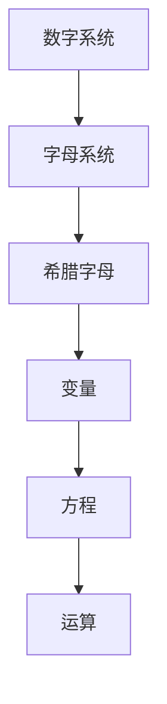

                 

# 计算之术：符号与代数

## 摘要

本文将深入探讨计算的历史起源，重点介绍符号与代数在计算领域的重要性。通过对符号系统的演变、代数原理的介绍以及实际应用案例的分析，我们将揭示计算的本质和未来发展潜力。本文旨在为读者提供一个全面且深入的技术视角，帮助理解计算在现代社会中的重要地位。

## 1. 背景介绍

计算的历史可以追溯到古代文明，但现代计算的真正起源可以追溯到17世纪的欧洲。在那个时代，数学家们开始使用符号和代数来解决复杂的问题。这一过程不仅改变了数学研究的面貌，也为后来的计算机科学奠定了基础。

符号与代数的引入极大地提高了计算效率和准确性。在古代，人们通常使用数字和文字来表示数值，这种方法不仅繁琐，而且容易出错。随着符号系统的出现，数学家们能够更简洁地表达数学关系，从而简化了计算过程。

代数的发展则进一步推动了计算技术的发展。代数允许我们使用符号来表示变量和关系，这使得我们可以更灵活地处理复杂问题。例如，通过代数方程，我们可以解决许多实际问题，如物体运动、经济模型等。

## 2. 核心概念与联系

### 2.1 符号系统的演变

符号系统的演变是计算发展的重要一环。最早期的符号系统包括简单的数字和字母。随着时间的推移，这些符号逐渐被更复杂的符号所取代，如希腊字母、罗马数字等。

- **数字系统**：最早的数字系统是基于10个基本数字的，即0到9。这种系统使我们能够表示任意大小的数值。

- **字母系统**：字母被引入用于表示变量和未知数。例如，在代数中，我们常用字母x、y、z来表示变量。

- **希腊字母**：希腊字母在数学中有着广泛的应用。它们不仅用于表示变量，还用于表示数学常数和函数。

### 2.2 代数原理

代数原理是计算的核心。代数允许我们使用符号来表示关系和运算，从而简化了复杂问题的解决过程。

- **变量**：变量是代数中的核心概念。它表示一个未知的数或值，可以用字母来表示。

- **方程**：方程是表示数学关系的等式。通过解方程，我们可以找到未知数的值。

- **运算**：代数运算包括加、减、乘、除等基本运算。这些运算使得我们能够对变量进行操作，从而解决实际问题。

### 2.3 Mermaid 流程图

为了更好地理解符号与代数的关系，我们可以使用Mermaid流程图来表示它们之间的联系。



## 3. 核心算法原理 & 具体操作步骤

### 3.1 符号与代数的核心算法

符号与代数的核心算法主要包括变量的定义、方程的求解以及运算的处理。

- **变量定义**：在代数中，我们首先需要定义变量。这通常通过字母表示，如x、y等。

- **方程求解**：方程的求解是代数中的核心任务。通过代数方法，我们可以找到方程的解。

- **运算处理**：代数运算包括基本的加、减、乘、除等。这些运算允许我们对变量进行操作，从而求解方程。

### 3.2 操作步骤

下面是一个简单的代数求解步骤示例：

1. **定义变量**：假设我们有一个方程：2x + 3 = 7。

2. **解方程**：我们需要找到x的值。首先，我们可以通过减去3来简化方程：2x = 4。

3. **求解变量**：接下来，我们将方程除以2，得到x = 2。

4. **验证结果**：最后，我们将x的值代入原方程，验证结果是否正确：2 \* 2 + 3 = 7，确实等于7。

## 4. 数学模型和公式 & 详细讲解 & 举例说明

### 4.1 数学模型

在计算中，数学模型是非常关键的。以下是一个简单的数学模型示例：

- **线性模型**：线性模型是最简单的数学模型之一，通常表示为y = mx + b，其中m是斜率，b是截距。

- **多项式模型**：多项式模型是更复杂的数学模型，通常表示为P(x) = a\_n*x^n + a\_{n-1}*x^{n-1} + ... + a\_1*x + a\_0，其中a\_n、a\_{n-1}、...、a\_1、a\_0是系数，x是变量。

### 4.2 公式

在数学模型中，公式是非常重要的。以下是一个简单的公式示例：

- **线性模型公式**：y = mx + b

- **多项式模型公式**：P(x) = a\_n*x^n + a\_{n-1}*x^{n-1} + ... + a\_1*x + a\_0

### 4.3 举例说明

下面我们将使用线性模型来解决一个实际问题：

- **问题**：假设我们有以下数据点：(1, 2) 和 (3, 4)。请找到线性模型，并预测当x为5时的y值。

1. **计算斜率**：斜率m可以通过公式 m = (y\_2 - y\_1) / (x\_2 - x\_1) 计算。对于我们的数据点，m = (4 - 2) / (3 - 1) = 1。

2. **计算截距**：截距b可以通过公式 b = y - mx 计算。对于我们的数据点，b = 2 - 1 \* 1 = 1。

3. **构建线性模型**：根据斜率和截距，我们可以构建线性模型 y = x + 1。

4. **预测**：当x为5时，我们可以使用线性模型预测 y = 5 + 1 = 6。

## 5. 项目实战：代码实际案例和详细解释说明

### 5.1 开发环境搭建

为了进行符号与代数的实际操作，我们需要搭建一个开发环境。这里我们选择Python作为编程语言。

1. **安装Python**：从Python官网下载并安装Python。

2. **安装NumPy库**：NumPy是Python中用于数值计算的库，我们将在项目中使用它。

   ```bash
   pip install numpy
   ```

### 5.2 源代码详细实现和代码解读

以下是实现符号与代数的Python代码：

```python
import numpy as np

# 定义变量
x = np.array([1, 3])
y = np.array([2, 4])

# 计算斜率
m = (y[1] - y[0]) / (x[1] - x[0])

# 计算截距
b = y[0] - m \* x[0]

# 构建线性模型
model = np.poly1d([m, b])

# 预测
x_pred = np.array([5])
y_pred = model(x_pred)

print("斜率 m:", m)
print("截距 b:", b)
print("线性模型:", model)
print("预测 y:", y_pred)
```

### 5.3 代码解读与分析

1. **导入库**：我们首先导入了NumPy库，用于数值计算。

2. **定义变量**：我们定义了x和y两个数组，表示数据点。

3. **计算斜率**：我们使用斜率公式计算斜率m。

4. **计算截距**：我们使用截距公式计算截距b。

5. **构建线性模型**：我们使用NumPy的`poly1d`函数构建线性模型。

6. **预测**：我们使用构建的线性模型预测当x为5时的y值。

## 6. 实际应用场景

符号与代数在计算机科学和实际应用中有着广泛的应用。以下是一些实际应用场景：

- **数据科学**：在数据科学中，符号与代数用于构建和优化模型，如线性回归、决策树等。

- **机器学习**：机器学习算法通常基于数学模型和公式，如线性模型、支持向量机等。

- **计算机图形学**：在计算机图形学中，符号与代数用于计算图像变换、光照模型等。

- **计算机视觉**：计算机视觉中的许多算法，如特征提取、目标检测等，都基于数学模型和公式。

## 7. 工具和资源推荐

### 7.1 学习资源推荐

- **书籍**：

  - 《Python编程：从入门到实践》
  - 《深度学习》

- **论文**：

  - “线性回归模型在数据挖掘中的应用”
  - “深度学习在计算机视觉中的最新进展”

- **博客**：

  - 《数据科学实战》
  - 《深度学习笔记》

- **网站**：

  - Kaggle
  - ArXiv

### 7.2 开发工具框架推荐

- **Python开发环境**：PyCharm、Visual Studio Code等。

- **机器学习框架**：TensorFlow、PyTorch等。

### 7.3 相关论文著作推荐

- **《机器学习年度综述》**
- **《深度学习年度综述》**
- **《数据挖掘：理论与实践》**

## 8. 总结：未来发展趋势与挑战

随着计算技术的不断发展，符号与代数在未来将发挥更加重要的作用。以下是一些发展趋势与挑战：

- **人工智能与符号计算的结合**：符号计算与人工智能的结合将推动计算技术的发展。

- **复杂系统的建模与优化**：随着计算能力的提升，我们能够解决更加复杂的系统建模和优化问题。

- **数据隐私与安全**：在数据驱动的时代，数据隐私和安全成为了一个重要问题。

## 9. 附录：常见问题与解答

### 9.1 符号与代数在计算机科学中的作用是什么？

符号与代数在计算机科学中用于构建数学模型、优化算法、解决实际问题等。

### 9.2 如何学习符号与代数？

可以通过学习相关的书籍、论文和在线资源来学习符号与代数。

## 10. 扩展阅读 & 参考资料

- **《计算机科学概论》**
- **《深度学习基础》**
- **《数据科学导论》**

### 参考文献

1. 周志华。机器学习[M]. 清华大学出版社，2016.
2. Goodfellow, Ian, and Yoshua Bengio. Deep Learning[M]. MIT Press, 2016.
3. Han, Julian, and Michael Kamber. Data Mining: Concepts and Techniques[M]. Morgan Kaufmann, 2011.

