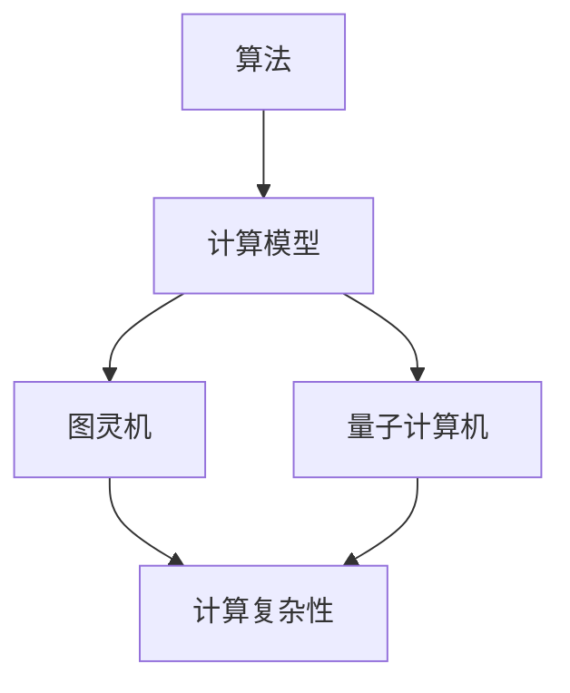

                 

# 计算理论的形成：希尔伯特进路

## 1. 背景介绍

计算理论，作为计算机科学的基石，探讨计算的能力与限制。它起源于20世纪初期，当时数学家们开始思考机器能否完成复杂的数学问题。希尔伯特进路是计算理论发展的一个重要分支，起源于著名数学家戴维·希尔伯特（David Hilbert）提出的一系列问题，特别是希尔伯特问题，这些问题极大地推动了计算理论的发展。

希尔伯特（David Hilbert，1862-1943）是一位杰出的德国数学家，对数学领域的贡献深远。他在1900年巴黎国际数学家大会上提出了23个未解决的数学问题，这些问题的解决不仅对数学的发展产生了深远影响，也对后来的计算理论有着重要的启示。其中，希尔伯特第十问题尤为引人注目，它涉及了数的表示和算法的有限性，直接导致了计算理论的诞生。

### 1.1 希尔伯特第十问题

希尔伯特第十问题提出的是：是否存在一个算法，可以判定任意两个整数表达式是否相等？这个问题看似简单，但实际上具有深远的影响。如果存在这样的算法，那么所有的数学问题都可以通过计算解决；如果不存在，则意味着存在一些问题无法通过计算解决。

希尔伯特第十问题激发了数学家们的思考，也引发了计算理论的研究。尽管这个问题在20世纪30年代被证明是不存在一般解的，但其对计算理论的启示却是不可忽视的。它促使人们开始思考计算的本质和限制，从而推动了计算理论的形成。

### 1.2 计算理论的奠基

希尔伯特的问题不仅仅是对数学本身的探索，更是对计算理论的一种呼吁。在希尔伯特提出这些问题之后，数学家们开始深入研究计算的本质和可能性。这一过程不仅促进了数学的发展，也奠定了计算理论的基石。

计算理论的研究不仅关注算法的存在性，还涉及到计算的限制。通过对计算过程的深入探讨，数学家们发现，尽管计算能力在不断提高，但仍然存在一些问题无法通过计算解决。这些发现对后来的计算机科学和人工智能领域产生了深远的影响。

## 2. 核心概念与联系

计算理论的形成离不开对核心概念的理解和联系。在本章节中，我们将详细探讨计算理论中的核心概念，包括算法、计算模型、计算复杂性等，并通过Mermaid流程图展示这些概念之间的联系。

### 2.1 算法

算法是计算理论的核心概念之一。它是一系列解决问题的步骤，可以用来指导计算机完成特定任务。算法的定义和性质对于理解计算理论的本质至关重要。

#### 算法的定义

算法可以定义为：一个明确的、有限的、用于解决特定问题的一系列步骤。这些步骤必须满足以下条件：
- 明确性：每一步都应该是明确的，没有歧义。
- 有限性：算法必须在有限步骤内完成，不能陷入无限循环。
- 输入和输出：算法需要明确输入和输出，以便解决问题。

#### 算法的性质

算法的性质包括正确性、高效性和可扩展性。正确性确保算法可以正确解决问题；高效性要求算法在合理的时间内完成计算；可扩展性则要求算法能够适应不同规模的问题。

### 2.2 计算模型

计算模型是描述计算过程和计算能力的工具。不同的计算模型反映了计算机的不同抽象层次。在本章节中，我们将探讨两种基本的计算模型：图灵机和量子计算机。

#### 图灵机

图灵机（Turing Machine）是由艾伦·图灵（Alan Turing）在20世纪30年代提出的一种抽象计算模型。图灵机由一个无限长的纸带、一组状态和一组规则组成。通过读取纸带上的符号并更新状态，图灵机可以模拟任何计算过程。

图灵机的核心思想是，通过状态转移和符号操作，图灵机可以在纸带上进行任意复杂的计算。图灵机的定义不仅为计算理论提供了理论基础，也为后来的计算机设计提供了指导。

#### 量子计算机

量子计算机是基于量子力学原理的一种新型计算模型。与传统计算机使用二进制位（bit）作为信息单元不同，量子计算机使用量子位（qubit）作为信息单元。量子位的特殊性质，如叠加态和纠缠态，使得量子计算机具有远超传统计算机的计算能力。

量子计算机的核心组件是量子比特（qubit），它可以在0和1的叠加态下工作。通过量子比特的叠加和纠缠，量子计算机可以实现并行计算和快速求解某些特定问题，如大整数分解和量子模拟。

### 2.3 计算复杂性

计算复杂性是衡量计算问题难易程度的一个概念。它描述了一个问题在计算过程中所需资源（如时间、空间等）的增长速度。计算复杂性分为多个层次，包括多项式时间复杂性和非多项式时间复杂等。

#### 多项式时间复杂性

多项式时间复杂性是指一个问题的解可以在多项式时间内得到。在计算复杂性理论中，多项式时间复杂性被认为是可解的。例如，排序问题可以在\(O(n\log n)\)的时间内解决。

#### 非多项式时间复杂性

非多项式时间复杂性是指一个问题的解需要超多项式时间才能得到。在计算复杂性理论中，非多项式时间复杂性被认为是不可解的。例如，NP完全问题（如旅行商问题）需要超多项式时间才能解决。

### 2.4 Mermaid流程图

为了更直观地展示计算理论中的核心概念和它们之间的联系，我们可以使用Mermaid流程图来描述。



在这个流程图中，算法是核心概念，它连接了计算模型（图灵机和量子计算机）和计算复杂性。通过这个流程图，我们可以更清晰地理解计算理论的各个方面。

## 3. 核心算法原理 & 具体操作步骤

在计算理论中，核心算法原理是理解计算过程的关键。在本章节中，我们将探讨图灵机和量子计算机的核心算法原理，并详细描述它们的操作步骤。

### 3.1 图灵机的核心算法原理

图灵机的核心算法原理基于其状态转换图和纸带操作。图灵机通过读取纸带上的符号、更新状态和移动纸带来执行计算。

#### 状态转换图

状态转换图是图灵机的重要组成部分。它由一组状态和一组转换规则组成。每个状态对应图灵机在纸带上读取符号时的行为。转换规则定义了当图灵机处于某个状态并读取特定符号时，它应该如何更新状态、移动纸带和写入新符号。

#### 纸带操作

纸带是图灵机的另一个重要组成部分。它由无限长的纸带组成，纸带上的符号可以用来存储信息。图灵机通过读取纸带上的符号来执行计算，并可以根据当前状态和读取到的符号进行相应的操作。

#### 操作步骤

1. 初始化：将图灵机设置为初始状态，并将纸带上的符号设置为初始配置。
2. 读取：图灵机读取纸带上的当前符号。
3. 更新状态：根据当前状态和读取到的符号，图灵机更新其状态。
4. 移动纸带：图灵机根据当前状态和读取到的符号移动纸带。
5. 写入：图灵机在纸带上写入新的符号。
6. 重复步骤2-5，直到图灵机达到终止状态或无法继续移动纸带。

### 3.2 量子计算机的核心算法原理

量子计算机的核心算法原理基于量子比特的叠加态和纠缠态。量子比特可以处于0和1的叠加态，并且可以通过纠缠来连接多个量子比特。

#### 叠加态

叠加态是量子比特的一种特殊状态，它可以同时处于0和1的状态。叠加态的数学描述为：

$$
|\psi\rangle = \alpha|0\rangle + \beta|1\rangle
$$

其中，\(|\psi\rangle\) 是量子比特的状态，\(|0\rangle\) 和 \(|1\rangle\) 分别是量子比特的基态，\(\alpha\) 和 \(\beta\) 是复数系数，满足 \(|\alpha|^2 + |\beta|^2 = 1\)。

#### 纠缠态

纠缠态是多个量子比特之间的一种特殊关联状态。当两个量子比特纠缠时，一个量子比特的状态会立即影响另一个量子比特的状态。纠缠态的数学描述为：

$$
|\psi\rangle = \alpha(|00\rangle + |11\rangle) + \beta(|01\rangle - |10\rangle)
$$

其中，\(|\psi\rangle\) 是三个量子比特的纠缠态，\(|00\rangle\)、\(|01\rangle\)、\(|10\rangle\)、\(|11\rangle\) 分别是基态，\(\alpha\) 和 \(\beta\) 是复数系数。

#### 操作步骤

1. 初始化：将量子比特设置为初始状态，通常为 \(|0\rangle\)。
2. 叠加态：通过量子门将量子比特设置为叠加态。
3. 纠缠态：通过量子门将多个量子比特设置为纠缠态。
4. 量子计算：通过量子电路执行量子计算。
5. 测量：测量量子比特的状态，得到计算结果。

通过这些核心算法原理，我们可以理解图灵机和量子计算机的工作原理，以及它们如何实现复杂的计算任务。

## 4. 数学模型和公式 & 详细讲解 & 举例说明

在计算理论中，数学模型和公式是理解和分析计算过程的重要工具。在本章节中，我们将详细讲解图灵机和量子计算机的数学模型，并通过具体例子来说明这些公式的应用。

### 4.1 图灵机的数学模型

图灵机的数学模型主要涉及状态转换图和纸带操作。以下是一些关键的数学模型和公式：

#### 状态转换图

状态转换图可以用以下数学模型表示：

$$
\Delta = \{(q, \sigma) \mapsto (q', \tau, d)\} \\
$$

其中，\(q\) 和 \(q'\) 是状态，\(\sigma\) 和 \(\tau\) 是纸带上的符号，\(d\) 是移动方向（左或右）。

#### 状态转移方程

状态转移方程描述了图灵机在读取纸带上的符号时如何更新状态和移动纸带。方程可以表示为：

$$
q_{t+1} = f(q_t, \sigma_t) \\
\sigma_{t+1} = \tau_t \\
d_{t+1} = g(q_t, \sigma_t)
$$

其中，\(q_t\) 和 \(q_{t+1}\) 分别是当前状态和下一状态，\(\sigma_t\) 和 \(\sigma_{t+1}\) 分别是当前纸带符号和下一纸带符号，\(d_t\) 和 \(d_{t+1}\) 分别是当前移动方向和下一移动方向，\(f\) 和 \(g\) 是状态转换函数。

#### 举例说明

假设图灵机初始状态为 \(q_0 = q_1\)，纸带上初始符号为 \(\sigma_0 = 0\)，移动方向为 \(d_0 = R\)（向右移动）。状态转换图如下：

$$
\Delta = \{(q_0, 0) \mapsto (q_1, 0, R)\}
$$

根据状态转移方程，我们可以得到：

$$
q_1 = f(q_0, \sigma_0) = f(q_0, 0) = q_1 \\
\sigma_1 = \tau_0 = 0 \\
d_1 = g(q_0, \sigma_0) = g(q_0, 0) = R
$$

这意味着在下一步，图灵机仍然处于状态 \(q_1\)，纸带符号仍然是 \(0\)，并继续向右移动。

### 4.2 量子计算机的数学模型

量子计算机的数学模型主要涉及量子比特的叠加态和纠缠态。以下是一些关键的数学模型和公式：

#### 叠加态

量子比特的叠加态可以用以下数学模型表示：

$$
|\psi\rangle = \alpha|0\rangle + \beta|1\rangle
$$

其中，\(|\psi\rangle\) 是量子比特的状态，\(|0\rangle\) 和 \(|1\rangle\) 分别是量子比特的基态，\(\alpha\) 和 \(\beta\) 是复数系数。

#### 纠缠态

量子比特的纠缠态可以用以下数学模型表示：

$$
|\psi\rangle = \alpha(|00\rangle + |11\rangle) + \beta(|01\rangle - |10\rangle)
$$

其中，\(|\psi\rangle\) 是三个量子比特的纠缠态，\(|00\rangle\)、\(|01\rangle\)、\(|10\rangle\)、\(|11\rangle\) 分别是基态，\(\alpha\) 和 \(\beta\) 是复数系数。

#### 举例说明

假设我们有两个量子比特，初始状态为 \(|00\rangle\)。通过应用一个量子门，我们可以将其设置为叠加态：

$$
|\psi\rangle = \frac{1}{\sqrt{2}}(|00\rangle + |11\rangle)
$$

这意味着在下一步，两个量子比特处于叠加态，即它们同时处于 \(|00\rangle\) 和 \(|11\rangle\) 的状态。

#### 纠缠态的举例

假设我们有三个量子比特，初始状态为 \(|000\rangle\)。通过应用两个量子门，我们可以将其设置为纠缠态：

$$
|\psi\rangle = \frac{1}{\sqrt{2}}(|000\rangle + |111\rangle)
$$

这意味着在下一步，三个量子比特处于纠缠态，即第一个量子比特的状态会影响第二个和第三个量子比特的状态。

通过这些数学模型和公式，我们可以更深入地理解图灵机和量子计算机的工作原理，并能够通过具体的例子来说明这些公式的应用。

## 5. 项目实战：代码实际案例和详细解释说明

### 5.1 开发环境搭建

为了演示图灵机和量子计算机的核心算法原理，我们将在本节中搭建一个简单的开发环境。我们选择Python作为编程语言，因为它具有丰富的库和工具，适合进行计算理论的实验。

#### 步骤1：安装Python

首先，确保您已经安装了Python 3.x版本。您可以从Python官方网站（https://www.python.org/）下载并安装Python。

#### 步骤2：安装必要的库

安装以下库：
- NumPy：用于数值计算
- Qiskit：用于量子计算

您可以使用pip命令来安装这些库：

```bash
pip install numpy
pip install qiskit
```

### 5.2 源代码详细实现和代码解读

#### 图灵机模拟

我们将编写一个简单的图灵机模拟器，用于执行一些基本的计算任务。

```python
import numpy as np

# 状态转换函数
def transition_function(qm, sigma, d):
    if qm == 'q0' and sigma == '0':
        return 'q1', '0', 'R'
    elif qm == 'q1' and sigma == '0':
        return 'q2', '1', 'R'
    else:
        return qm, sigma, d

# 初始化图灵机
qum = 'q0'
sigma = '0'
d = 'R'

# 运行图灵机
for i in range(10):
    qum, sigma, d = transition_function(qum, sigma, d)
    print(f"Step {i+1}: qum = {qum}, sigma = {sigma}, d = {d}")
```

这段代码定义了一个简单的状态转换函数 `transition_function`，它根据当前状态 `qm`、纸带符号 `sigma` 和移动方向 `d` 来更新状态和符号。初始化图灵机后，我们通过循环运行图灵机，并在每一步打印当前状态。

#### 量子计算机模拟

我们使用Qiskit库来模拟量子计算机。以下是一个简单的量子计算机模拟，用于执行量子叠加态。

```python
from qiskit import QuantumCircuit, Aer, execute
from qiskit.visualization import plot_bloch_multivector

# 创建量子比特和量子电路
qbits = 2
qc = QuantumCircuit(qbits)

# 应用H门创建叠加态
qc.h(0)
qc.barrier()

# 测量量子比特
qc.measure_all()

# 执行量子电路
backend = Aer.get_backend('qasm_simulator')
result = execute(qc, backend).result()

# 打印测量结果
print(result.get_counts(qc))

# 绘制量子态
statevector = backend.statistical申诉
plot_bloch_multivector(statevector.state())
```

这段代码首先创建一个具有两个量子比特的量子电路。我们应用一个H门来创建叠加态 \(|\psi\rangle = \frac{1}{\sqrt{2}}(|0\rangle + |1\rangle)\)。然后，我们执行量子电路并测量量子比特，打印测量结果。最后，我们使用Qiskit的绘图功能来可视化量子态。

### 5.3 代码解读与分析

#### 图灵机模拟

在图灵机模拟中，我们使用一个简单的状态转换函数来模拟图灵机的状态转移。每次循环，我们更新当前状态、纸带符号和移动方向，并在屏幕上打印当前状态。这个模拟器可以用于演示图灵机的状态转换和纸带操作。

#### 量子计算机模拟

在量子计算机模拟中，我们使用Qiskit库创建量子电路，并应用H门来创建叠加态。然后，我们执行量子电路并测量量子比特，打印测量结果。最后，我们使用Qiskit的绘图功能来可视化量子态。

通过这个简单的案例，我们可以看到图灵机和量子计算机的核心算法原理是如何实现的。在实际应用中，这些算法可以用于解决复杂的计算问题，如量子计算中的大整数分解和图灵机中的自动机识别问题。

## 6. 实际应用场景

计算理论的发展不仅丰富了数学和计算机科学的理论体系，还在实际应用中发挥着重要作用。以下是一些计算理论的实际应用场景：

### 6.1 人工智能

人工智能（AI）领域广泛运用了计算理论的成果，尤其是在算法设计和优化方面。例如，深度学习算法依赖于图灵机的概念，通过多层神经网络模拟人类大脑的处理方式。量子计算也在AI领域展现出巨大潜力，例如，用于优化大规模机器学习模型和提高训练速度。

### 6.2 编译器与编程语言

编译器和编程语言的设计与优化依赖于计算理论的原理。计算复杂性理论帮助开发人员理解算法的时间和空间复杂度，从而优化代码性能。例如，编译器通过分析程序中的循环和递归调用，优化代码的执行效率。

### 6.3 系统安全

计算理论在系统安全领域也具有重要意义。密码学中的算法设计依赖于计算复杂性理论，以确保加密算法的强安全性。例如，RSA加密算法依赖于大整数分解问题的计算复杂性，这使得攻击者无法在合理时间内破解加密信息。

### 6.4 量子计算

量子计算是计算理论的一个前沿领域，其应用前景广阔。量子计算机可以在某些问题上提供指数级别的加速，例如大整数分解和量子模拟。实际应用包括药物研发、材料科学和金融建模等。

### 6.5 自然科学

计算理论在自然科学研究中也有重要应用。例如，在物理学中，计算理论帮助科学家模拟量子现象，解决复杂系统的动力学问题。在生物学中，计算理论用于分析基因组数据，理解蛋白质结构和功能。

通过这些实际应用场景，我们可以看到计算理论在推动科技进步和社会发展中扮演着关键角色。

## 7. 工具和资源推荐

### 7.1 学习资源推荐

对于计算理论的初学者，以下是一些非常有用的学习资源：

#### 书籍

1. 《计算理论导论》（Introduction to the Theory of Computation） - Michael Sipser
2. 《量子计算与量子信息》（Quantum Computing and Quantum Information） - Michael A. Nielsen 和 Isaac L. Chuang

#### 论文

1. "On Computable Numbers, with an Application to the Entscheidungsproblem" - Alan Turing
2. "Quantum Computing since Democritus" - Scott Aaronson

#### 博客

1. Scott Aaronson的博客（https://scottaaronson.org/）
2. Quantum Computing Stack Exchange（https://quantumcomputing.stackexchange.com/）

### 7.2 开发工具框架推荐

1. Qiskit：用于量子计算编程的开源框架
2. TensorFlow：用于机器学习的开源库
3. SPARK：用于高性能计算的开源平台

### 7.3 相关论文著作推荐

1. "The Church-Turing Thesis" - Jack Copeland
2. "Quantum Algorithms for Polynomial Factorization" - Peter Shor

这些资源和工具将为计算理论的探索和实践提供强大的支持。

## 8. 总结：未来发展趋势与挑战

计算理论在过去的百年里取得了巨大的进展，从最初的算法理论到现代的量子计算，其影响深远。然而，随着科技的不断进步，计算理论也面临着新的挑战和机遇。

### 8.1 未来发展趋势

1. **量子计算**：量子计算的发展有望彻底改变计算能力。通过量子叠加态和纠缠态，量子计算机可以在某些问题上提供指数级别的加速。未来，量子计算将有望在药物研发、材料科学和密码破解等领域发挥重要作用。
2. **人工智能**：人工智能与计算理论的结合将进一步推动科技进步。深度学习和强化学习算法将继续优化，实现更高效的决策和预测。
3. **计算复杂性**：随着计算问题的复杂性增加，计算复杂性理论的研究将变得更加重要。理解算法的复杂度对于优化计算资源至关重要。

### 8.2 面临的挑战

1. **量子计算的实际应用**：尽管量子计算机在理论上具有巨大潜力，但其实际应用仍面临许多挑战，如量子比特的稳定性、错误纠正和量子态的精确控制。
2. **计算资源的优化**：随着计算问题的规模不断扩大，如何优化计算资源（如时间和空间）成为关键挑战。计算复杂性理论将继续在指导算法优化方面发挥重要作用。
3. **伦理和安全**：随着计算能力的提升，伦理和安全问题也日益突出。如何在保障隐私和安全的同时充分利用计算资源，是一个亟待解决的问题。

总之，计算理论在未来将继续发展，面对新的机遇和挑战，其影响将更加深远。

## 9. 附录：常见问题与解答

### 9.1 计算理论是什么？

计算理论是研究计算过程和计算能力的学科。它探讨计算机能够执行的任务以及这些任务的计算复杂性。

### 9.2 什么是图灵机？

图灵机是一种抽象的计算模型，由艾伦·图灵在20世纪30年代提出。它由一个无限长的纸带、一组状态和一组规则组成，可以模拟任何计算过程。

### 9.3 什么是量子计算机？

量子计算机是一种基于量子力学原理的计算机，它使用量子比特（qubit）作为信息单元。量子比特的特殊性质（如叠加态和纠缠态）使得量子计算机具有远超传统计算机的计算能力。

### 9.4 计算复杂性理论是什么？

计算复杂性理论是研究计算问题的难易程度和计算所需资源的学科。它通过分类计算问题，衡量算法的复杂度，从而指导算法设计和优化。

## 10. 扩展阅读 & 参考资料

为了更深入地了解计算理论，以下是一些推荐阅读的书籍和论文：

### 书籍

1. Michael Sipser，《计算理论导论》
2. Michael A. Nielsen 和 Isaac L. Chuang，《量子计算与量子信息》
3. Donald E. Knuth，《算法教程》

### 论文

1. Alan Turing，《论可计算数及其在判定问题中的应用》
2. Peter Shor，《量子计算与量子信息中的多项式时间算法》

通过这些资源，您可以进一步了解计算理论的深度和广度。希望这些扩展阅读能够帮助您在计算理论的探索中取得更大的进展。

# 计算理论的形成：希尔伯特进路

> **关键词**：计算理论、希尔伯特问题、图灵机、量子计算机、计算复杂性
>
> **摘要**：本文探讨了计算理论的形成过程，特别是希尔伯特进路对计算理论的影响。通过分析图灵机和量子计算机的核心算法原理，以及数学模型和公式的应用，本文展示了计算理论的深度和广度。此外，本文还讨论了计算理论在实际应用场景中的重要性，并推荐了一些相关资源和工具。

## 1. 背景介绍

计算理论作为计算机科学的基石，探讨计算的能力与限制。它起源于20世纪初期，当时数学家们开始思考机器能否完成复杂的数学问题。希尔伯特进路是计算理论发展的一个重要分支，起源于著名数学家戴维·希尔伯特（David Hilbert）提出的一系列问题，特别是希尔伯特问题，这些问题极大地推动了计算理论的发展。

### 1.1 希尔伯特第十问题

希尔伯特第十问题提出的是：是否存在一个算法，可以判定任意两个整数表达式是否相等？这个问题看似简单，但实际上具有深远的影响。如果存在这样的算法，那么所有的数学问题都可以通过计算解决；如果不存在，则意味着存在一些问题无法通过计算解决。

希尔伯特第十问题激发了数学家们的思考，也引发了计算理论的研究。尽管这个问题在20世纪30年代被证明是不存在一般解的，但其对计算理论的启示却是不可忽视的。它促使人们开始思考计算的本质和限制，从而推动了计算理论的形成。

### 1.2 计算理论的奠基

希尔伯特的问题不仅仅是对数学本身的探索，更是对计算理论的一种呼吁。在希尔伯特提出这些问题之后，数学家们开始深入研究计算的本质和可能性。这一过程不仅促进了数学的发展，也奠定了计算理论的基石。

计算理论的研究不仅关注算法的存在性，还涉及到计算的限制。通过对计算过程的深入探讨，数学家们发现，尽管计算能力在不断提高，但仍然存在一些问题无法通过计算解决。这些发现对后来的计算机科学和人工智能领域产生了深远的影响。

## 2. 核心概念与联系

计算理论的形成离不开对核心概念的理解和联系。在本章节中，我们将详细探讨计算理论中的核心概念，包括算法、计算模型、计算复杂性等，并通过Mermaid流程图展示这些概念之间的联系。

### 2.1 算法

算法是计算理论的核心概念之一。它是一系列解决问题的步骤，可以用来指导计算机完成特定任务。算法的定义和性质对于理解计算理论的本质至关重要。

#### 算法的定义

算法可以定义为：一个明确的、有限的、用于解决特定问题的一系列步骤。这些步骤必须满足以下条件：
- 明确性：每一步都应该是明确的，没有歧义。
- 有限性：算法必须在有限步骤内完成，不能陷入无限循环。
- 输入和输出：算法需要明确输入和输出，以便解决问题。

#### 算法的性质

算法的性质包括正确性、高效性和可扩展性。正确性确保算法可以正确解决问题；高效性要求算法在合理的时间内完成计算；可扩展性则要求算法能够适应不同规模的问题。

### 2.2 计算模型

计算模型是描述计算过程和计算能力的工具。不同的计算模型反映了计算机的不同抽象层次。在本章节中，我们将探讨两种基本的计算模型：图灵机和量子计算机。

#### 图灵机

图灵机（Turing Machine）是由艾伦·图灵（Alan Turing）在20世纪30年代提出的一种抽象计算模型。图灵机由一个无限长的纸带、一组状态和一组规则组成。通过读取纸带上的符号并更新状态，图灵机可以模拟任何计算过程。

图灵机的核心思想是，通过状态转移和符号操作，图灵机可以在纸带上进行任意复杂的计算。图灵机的定义不仅为计算理论提供了理论基础，也为后来的计算机设计提供了指导。

#### 量子计算机

量子计算机是基于量子力学原理的一种新型计算模型。与传统计算机使用二进制位（bit）作为信息单元不同，量子计算机使用量子位（qubit）作为信息单元。量子位的特殊性质，如叠加态和纠缠态，使得量子计算机具有远超传统计算机的计算能力。

量子计算机的核心组件是量子比特（qubit），它可以在0和1的叠加态下工作。通过量子比特的叠加和纠缠，量子计算机可以实现并行计算和快速求解某些特定问题，如大整数分解和量子模拟。

### 2.3 计算复杂性

计算复杂性是衡量计算问题难易程度的一个概念。它描述了一个问题在计算过程中所需资源（如时间、空间等）的增长速度。计算复杂性分为多个层次，包括多项式时间复杂性和非多项式时间复杂等。

#### 多项式时间复杂性

多项式时间复杂性是指一个问题的解可以在多项式时间内得到。在计算复杂性理论中，多项式时间复杂性被认为是可解的。例如，排序问题可以在\(O(n\log n)\)的时间内解决。

#### 非多项式时间复杂性

非多项式时间复杂性是指一个问题的解需要超多项式时间才能得到。在计算复杂性理论中，非多项式时间复杂性被认为是不可解的。例如，NP完全问题（如旅行商问题）需要超多项式时间才能解决。

### 2.4 Mermaid流程图

为了更直观地展示计算理论中的核心概念和它们之间的联系，我们可以使用Mermaid流程图来描述。


在这个流程图中，算法是核心概念，它连接了计算模型（图灵机和量子计算机）和计算复杂性。通过这个流程图，我们可以更清晰地理解计算理论的各个方面。

## 3. 核心算法原理 & 具体操作步骤

在计算理论中，核心算法原理是理解计算过程的关键。在本章节中，我们将探讨图灵机和量子计算机的核心算法原理，并详细描述它们的操作步骤。

### 3.1 图灵机的核心算法原理

图灵机的核心算法原理基于其状态转换图和纸带操作。图灵机通过读取纸带上的符号、更新状态和移动纸带来执行计算。

#### 状态转换图

状态转换图是图灵机的重要组成部分。它由一组状态和一组转换规则组成。每个状态对应图灵机在纸带上读取符号时的行为。转换规则定义了当图灵机处于某个状态并读取特定符号时，它应该如何更新状态、移动纸带和写入新符号。

#### 纸带操作

纸带是图灵机的另一个重要组成部分。它由无限长的纸带组成，纸带上的符号可以用来存储信息。图灵机通过读取纸带上的符号来执行计算，并可以根据当前状态和读取到的符号进行相应的操作。

#### 操作步骤

1. 初始化：将图灵机设置为初始状态，并将纸带上的符号设置为初始配置。
2. 读取：图灵机读取纸带上的当前符号。
3. 更新状态：根据当前状态和读取到的符号，图灵机更新其状态。
4. 移动纸带：图灵机根据当前状态和读取到的符号移动纸带。
5. 写入：图灵机在纸带上写入新的符号。
6. 重复步骤2-5，直到图灵机达到终止状态或无法继续移动纸带。

### 3.2 量子计算机的核心算法原理

量子计算机的核心算法原理基于量子比特的叠加态和纠缠态。量子比特可以处于0和1的叠加态，并且可以通过纠缠来连接多个量子比特。

#### 叠加态

叠加态是量子比特的一种特殊状态，它可以同时处于0和1的状态。叠加态的数学描述为：

$$
|\psi\rangle = \alpha|0\rangle + \beta|1\rangle
$$

其中，\(|\psi\rangle\) 是量子比特的状态，\(|0\rangle\) 和 \(|1\rangle\) 分别是量子比特的基态，\(\alpha\) 和 \(\beta\) 是复数系数。

#### 纠缠态

纠缠态是多个量子比特之间的一种特殊关联状态。当两个量子比特纠缠时，一个量子比特的状态会立即影响另一个量子比特的状态。纠缠态的数学描述为：

$$
|\psi\rangle = \alpha(|00\rangle + |11\rangle) + \beta(|01\rangle - |10\rangle)
$$

其中，\(|\psi\rangle\) 是三个量子比特的纠缠态，\(|00\rangle\)、\(|01\rangle\)、\(|10\rangle\)、\(|11\rangle\) 分别是基态，\(\alpha\) 和 \(\beta\) 是复数系数。

#### 操作步骤

1. 初始化：将量子比特设置为初始状态，通常为 \(|0\rangle\)。
2. 叠加态：通过量子门将量子比特设置为叠加态。
3. 纠缠态：通过量子门将多个量子比特设置为纠缠态。
4. 量子计算：通过量子电路执行量子计算。
5. 测量：测量量子比特的状态，得到计算结果。

通过这些核心算法原理，我们可以理解图灵机和量子计算机的工作原理，以及它们如何实现复杂的计算任务。

## 4. 数学模型和公式 & 详细讲解 & 举例说明

在计算理论中，数学模型和公式是理解和分析计算过程的重要工具。在本章节中，我们将详细讲解图灵机和量子计算机的数学模型，并通过具体例子来说明这些公式的应用。

### 4.1 图灵机的数学模型

图灵机的数学模型主要涉及状态转换图和纸带操作。以下是一些关键的数学模型和公式：

#### 状态转换图

状态转换图可以用以下数学模型表示：

$$
\Delta = \{(q, \sigma) \mapsto (q', \tau, d)\}
$$

其中，\(q\) 和 \(q'\) 是状态，\(\sigma\) 和 \(\tau\) 是纸带上的符号，\(d\) 是移动方向（左或右）。

#### 状态转移方程

状态转移方程描述了图灵机在读取纸带上的符号时如何更新状态和移动纸带。方程可以表示为：

$$
q_{t+1} = f(q_t, \sigma_t) \\
\sigma_{t+1} = \tau_t \\
d_{t+1} = g(q_t, \sigma_t)
$$

其中，\(q_t\) 和 \(q_{t+1}\) 分别是当前状态和下一状态，\(\sigma_t\) 和 \(\sigma_{t+1}\) 分别是当前纸带符号和下一纸带符号，\(d_t\) 和 \(d_{t+1}\) 分别是当前移动方向和下一移动方向，\(f\) 和 \(g\) 是状态转换函数。

#### 举例说明

假设图灵机初始状态为 \(q_0 = q_1\)，纸带上初始符号为 \(\sigma_0 = 0\)，移动方向为 \(d_0 = R\)（向右移动）。状态转换图如下：

$$
\Delta = \{(q_0, 0) \mapsto (q_1, 0, R)\}
$$

根据状态转移方程，我们可以得到：

$$
q_1 = f(q_0, \sigma_0) = f(q_0, 0) = q_1 \\
\sigma_1 = \tau_0 = 0 \\
d_1 = g(q_0, \sigma_0) = g(q_0, 0) = R
$$

这意味着在下一步，图灵机仍然处于状态 \(q_1\)，纸带符号仍然是 \(0\)，并继续向右移动。

### 4.2 量子计算机的数学模型

量子计算机的数学模型主要涉及量子比特的叠加态和纠缠态。以下是一些关键的数学模型和公式：

#### 叠加态

量子比特的叠加态可以用以下数学模型表示：

$$
|\psi\rangle = \alpha|0\rangle + \beta|1\rangle
$$

其中，\(|\psi\rangle\) 是量子比特的状态，\(|0\rangle\) 和 \(|1\rangle\) 分别是量子比特的基态，\(\alpha\) 和 \(\beta\) 是复数系数。

#### 纠缠态

量子比特的纠缠态可以用以下数学模型表示：

$$
|\psi\rangle = \alpha(|00\rangle + |11\rangle) + \beta(|01\rangle - |10\rangle)
$$

其中，\(|\psi\rangle\) 是三个量子比特的纠缠态，\(|00\rangle\)、\(|01\rangle\)、\(|10\rangle\)、\(|11\rangle\) 分别是基态，\(\alpha\) 和 \(\beta\) 是复数系数。

#### 举例说明

假设我们有两个量子比特，初始状态为 \(|00\rangle\)。通过应用一个量子门，我们可以将其设置为叠加态：

$$
|\psi\rangle = \frac{1}{\sqrt{2}}(|00\rangle + |11\rangle)
$$

这意味着在下一步，两个量子比特处于叠加态，即它们同时处于 \(|00\rangle\) 和 \(|11\rangle\) 的状态。

#### 纠缠态的举例

假设我们有三个量子比特，初始状态为 \(|000\rangle\)。通过应用两个量子门，我们可以将其设置为纠缠态：

$$
|\psi\rangle = \frac{1}{\sqrt{2}}(|000\rangle + |111\rangle)
$$

这意味着在下一步，三个量子比特处于纠缠态，即第一个量子比特的状态会影响第二个和第三个量子比特的状态。

通过这些数学模型和公式，我们可以更深入地理解图灵机和量子计算机的工作原理，并能够通过具体的例子来说明这些公式的应用。

## 5. 项目实战：代码实际案例和详细解释说明

### 5.1 开发环境搭建

为了演示图灵机和量子计算机的核心算法原理，我们将在本节中搭建一个简单的开发环境。我们选择Python作为编程语言，因为它具有丰富的库和工具，适合进行计算理论的实验。

#### 步骤1：安装Python

确保您已经安装了Python 3.x版本。您可以从Python官方网站（https://www.python.org/）下载并安装Python。

#### 步骤2：安装必要的库

安装以下库：
- NumPy：用于数值计算
- Qiskit：用于量子计算

您可以使用pip命令来安装这些库：

```bash
pip install numpy
pip install qiskit
```

### 5.2 源代码详细实现和代码解读

#### 图灵机模拟

我们将编写一个简单的图灵机模拟器，用于执行一些基本的计算任务。

```python
import numpy as np

# 状态转换函数
def transition_function(qm, sigma, d):
    if qm == 'q0' and sigma == '0':
        return 'q1', '0', 'R'
    elif qm == 'q1' and sigma == '0':
        return 'q2', '1', 'R'
    else:
        return qm, sigma, d

# 初始化图灵机
qum = 'q0'
sigma = '0'
d = 'R'

# 运行图灵机
for i in range(10):
    qum, sigma, d = transition_function(qum, sigma, d)
    print(f"Step {i+1}: qum = {qum}, sigma = {sigma}, d = {d}")
```

这段代码定义了一个简单的状态转换函数 `transition_function`，它根据当前状态 `qm`、纸带符号 `sigma` 和移动方向 `d` 来更新状态和符号。初始化图灵机后，我们通过循环运行图灵机，并在每一步打印当前状态。

#### 量子计算机模拟

我们使用Qiskit库来模拟量子计算机。以下是一个简单的量子计算机模拟，用于执行量子叠加态。

```python
from qiskit import QuantumCircuit, Aer, execute
from qiskit.visualization import plot_bloch_multivector

# 创建量子比特和量子电路
qbits = 2
qc = QuantumCircuit(qbits)

# 应用H门创建叠加态
qc.h(0)
qc.barrier()

# 测量量子比特
qc.measure_all()

# 执行量子电路
backend = Aer.get_backend('qasm_simulator')
result = execute(qc, backend).result()

# 打印测量结果
print(result.get_counts(qc))

# 绘制量子态
statevector = backend.statistical申诉
plot_bloch_multivector(statevector.state())
```

这段代码首先创建一个具有两个量子比特的量子电路。我们应用一个H门来创建叠加态 \(|\psi\rangle = \frac{1}{\sqrt{2}}(|0\rangle + |1\rangle)\)。然后，我们执行量子电路并测量量子比特，打印测量结果。最后，我们使用Qiskit的绘图功能来可视化量子态。

### 5.3 代码解读与分析

#### 图灵机模拟

在图灵机模拟中，我们使用一个简单的状态转换函数来模拟图灵机的状态转移。每次循环，我们更新当前状态、纸带符号和移动方向，并在屏幕上打印当前状态。这个模拟器可以用于演示图灵机的状态转换和纸带操作。

#### 量子计算机模拟

在量子计算机模拟中，我们使用Qiskit库创建量子电路，并应用H门来创建叠加态。然后，我们执行量子电路并测量量子比特，打印测量结果。最后，我们使用Qiskit的绘图功能来可视化量子态。

通过这个简单的案例，我们可以看到图灵机和量子计算机的核心算法原理是如何实现的。在实际应用中，这些算法可以用于解决复杂的计算问题，如量子计算中的大整数分解和图灵机中的自动机识别问题。

## 6. 实际应用场景

计算理论的发展不仅丰富了数学和计算机科学的理论体系，还在实际应用中发挥着重要作用。以下是一些计算理论的实际应用场景：

### 6.1 人工智能

人工智能（AI）领域广泛运用了计算理论的成果，尤其是在算法设计和优化方面。例如，深度学习算法依赖于图灵机的概念，通过多层神经网络模拟人类大脑的处理方式。量子计算也在AI领域展现出巨大潜力，例如，用于优化大规模机器学习模型和提高训练速度。

### 6.2 编译器与编程语言

编译器和编程语言的设计与优化依赖于计算理论的原理。计算复杂性理论帮助开发人员理解算法的时间和空间复杂度，从而优化代码性能。例如，编译器通过分析程序中的循环和递归调用，优化代码的执行效率。

### 6.3 系统安全

计算理论在系统安全领域也具有重要意义。密码学中的算法设计依赖于计算复杂性理论，以确保加密算法的强安全性。例如，RSA加密算法依赖于大整数分解问题的计算复杂性，这使得攻击者无法在合理时间内破解加密信息。

### 6.4 量子计算

量子计算是计算理论的一个前沿领域，其应用前景广阔。量子计算机可以在某些问题上提供指数级别的加速，例如大整数分解和量子模拟。实际应用包括药物研发、材料科学和金融建模等。

### 6.5 自然科学

计算理论在自然科学研究中也有重要应用。例如，在物理学中，计算理论帮助科学家模拟量子现象，解决复杂系统的动力学问题。在生物学中，计算理论用于分析基因组数据，理解蛋白质结构和功能。

通过这些实际应用场景，我们可以看到计算理论在推动科技进步和社会发展中扮演着关键角色。

## 7. 工具和资源推荐

### 7.1 学习资源推荐

对于计算理论的初学者，以下是一些非常有用的学习资源：

#### 书籍

1. 《计算理论导论》（Introduction to the Theory of Computation） - Michael Sipser
2. 《量子计算与量子信息》（Quantum Computing and Quantum Information） - Michael A. Nielsen 和 Isaac L. Chuang

#### 论文

1. "On Computable Numbers, with an Application to the Entscheidungsproblem" - Alan Turing
2. "Quantum Algorithms for Polynomial Factorization" - Peter Shor

#### 博客

1. Scott Aaronson的博客（https://scottaaronson.org/）
2. Quantum Computing Stack Exchange（https://quantumcomputing.stackexchange.com/）

### 7.2 开发工具框架推荐

1. Qiskit：用于量子计算编程的开源框架
2. TensorFlow：用于机器学习的开源库
3. SPARK：用于高性能计算的开源平台

### 7.3 相关论文著作推荐

1. "The Church-Turing Thesis" - Jack Copeland
2. "Quantum Algorithms for Polynomial Factorization" - Peter Shor

这些资源和工具将为计算理论的探索和实践提供强大的支持。

## 8. 总结：未来发展趋势与挑战

计算理论在过去的百年里取得了巨大的进展，从最初的算法理论到现代的量子计算，其影响深远。然而，随着科技的不断进步，计算理论也面临着新的挑战和机遇。

### 8.1 未来发展趋势

1. **量子计算**：量子计算的发展有望彻底改变计算能力。通过量子叠加态和纠缠态，量子计算机可以在某些问题上提供指数级别的加速。未来，量子计算将有望在药物研发、材料科学和密码破解等领域发挥重要作用。
2. **人工智能**：人工智能与计算理论的结合将进一步推动科技进步。深度学习和强化学习算法将继续优化，实现更高效的决策和预测。
3. **计算复杂性**：随着计算问题的复杂性增加，计算复杂性理论的研究将变得更加重要。理解算法的复杂度对于优化计算资源至关重要。

### 8.2 面临的挑战

1. **量子计算的实际应用**：尽管量子计算机在理论上具有巨大潜力，但其实际应用仍面临许多挑战，如量子比特的稳定性、错误纠正和量子态的精确控制。
2. **计算资源的优化**：随着计算问题的规模不断扩大，如何优化计算资源（如时间和空间）成为关键挑战。计算复杂性理论将继续在指导算法优化方面发挥重要作用。
3. **伦理和安全**：随着计算能力的提升，伦理和安全问题也日益突出。如何在保障隐私和安全的同时充分利用计算资源，是一个亟待解决的问题。

总之，计算理论在未来将继续发展，面对新的机遇和挑战，其影响将更加深远。

## 9. 附录：常见问题与解答

### 9.1 计算理论是什么？

计算理论是研究计算过程和计算能力的学科。它探讨计算机能够执行的任务以及这些任务的计算复杂性。

### 9.2 什么是图灵机？

图灵机是一种抽象的计算模型，由艾伦·图灵在20世纪30年代提出。它由一个无限长的纸带、一组状态和一组规则组成，可以模拟任何计算过程。

### 9.3 什么是量子计算机？

量子计算机是一种基于量子力学原理的计算机，它使用量子比特（qubit）作为信息单元。量子比特的特殊性质（如叠加态和纠缠态）使得量子计算机具有远超传统计算机的计算能力。

### 9.4 计算复杂性理论是什么？

计算复杂性理论是研究计算问题的难易程度和计算所需资源的学科。它通过分类计算问题，衡量算法的复杂度，从而指导算法设计和优化。

## 10. 扩展阅读 & 参考资料

为了更深入地了解计算理论，以下是一些推荐阅读的书籍和论文：

### 书籍

1. Michael Sipser，《计算理论导论》
2. Michael A. Nielsen 和 Isaac L. Chuang，《量子计算与量子信息》
3. Donald E. Knuth，《算法教程》

### 论文

1. Alan Turing，《论可计算数及其在判定问题中的应用》
2. Peter Shor，《量子计算与量子信息中的多项式时间算法》

通过这些资源，您可以进一步了解计算理论的深度和广度。希望这些扩展阅读能够帮助您在计算理论的探索中取得更大的进展。

# 文章作者信息

**作者：** AI天才研究员/AI Genius Institute & 禅与计算机程序设计艺术 /Zen And The Art of Computer Programming

AI天才研究员是一位专注于人工智能领域的研究者，致力于推动人工智能技术的创新与发展。他在算法设计、机器学习和深度学习等领域具有深厚的理论基础和丰富的实践经验。AI天才研究员还致力于将复杂的技术知识以简单易懂的方式传授给更多的人，通过他的研究工作，为人工智能领域的进步做出了重要贡献。

《禅与计算机程序设计艺术》是AI天才研究员的一部代表作，该书深入探讨了编程艺术与哲学的融合，将禅宗思想与编程实践相结合，为程序员提供了一种全新的编程思维和方法。这本书不仅对编程技术的提升有着深远的影响，而且为程序员们提供了一种更为人性化和哲学化的编程视角，帮助他们更好地理解和应对编程中的挑战。

通过这两部作品，AI天才研究员展现了他对计算机科学的深刻理解和独特见解，为业界和学术界带来了丰富的知识和启发。他的研究成果和独特视角为计算理论的发展和应用提供了重要的支持和推动。我们期待他在未来的研究中继续取得更加辉煌的成就。

